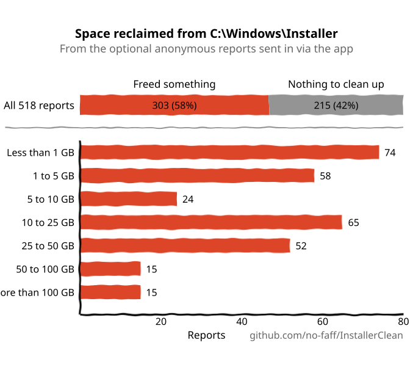

# InstallerClean privacy policy

Last updated 6 October 2026.

I don't find out anything about you or your files. The first time you use InstallerClean on a PC it can send me one anonymous report of how that run went, and a box on the result screen decides whether it does. No ads, no tracking. Here is every time InstallerClean touches the network or writes anything down.

## Update check

When you open InstallerClean, it asks GitHub's releases page whether a newer version exists. That is one web request to github.com: GitHub sees your IP address, as with any web request, and a line naming InstallerClean and its version. It downloads nothing. If a newer version exists you get a line on screen with a link, and your browser opens only if you click it. You can turn the check off in the About screen. The command-line tool never checks.

## The anonymous report

**When.** The first time InstallerClean finishes on a PC, after a Move or a Delete or after a scan that found nothing to offer you, the result screen has a box, "Send anonymous report". The report goes as you close that screen, however you close it. Untick the box and nothing is sent, then or ever, from that PC. The small "i" beside the box shows a summary of what the report holds.

**Only once per PC.** No later run on the same PC writes or sends a report, from any Windows account. A run you cancel, or that InstallerClean stops, carries no box, and if it moved or deleted any files it counts as the PC's first run. A Move or Delete that left every file alone at the last moment carries no box and does not count.

**Where the box starts unticked.** If the Country or region set in Windows is in the European Union, Iceland, Liechtenstein or Norway, including the EU's overseas regions, or InstallerClean can't read it, the box starts unticked and nothing is sent unless you tick it. Everywhere else, the UK included, it starts ticked. The setting is read on your PC and is not in the report.

**If it can't be sent.** If the report doesn't go, because there's no network or you closed InstallerClean straight away, it stays saved and InstallerClean tries again each time you open it until it goes. A report you unticked is never sent.

**Where it goes.** To nofaff.netlify.app/api/result-log, a site of mine. Like any web request it reaches the server from your IP address, but the code that receives the report never reads that, and nothing stored with the report records it, so I never see it. The reports are what the chart of results in the README is built from:

  <picture>
    <source media="(prefers-color-scheme: dark)" srcset="docs/reports-en-dark.svg" />
    <source media="(prefers-color-scheme: light)" srcset="docs/reports-en-light.svg" />
    
  </picture>

**What it holds.** Counts and fixed labels only:

- InstallerClean's version and the language it was showing, the language Windows is set to (never a country), and the report format's version.
- Windows 10 or 11, and x64, Arm or 32-bit.
- How long the scan and the Move or Delete took.
- How many installer files Windows has a record of, how many of them are no longer needed of each kind, and how much space each group takes.
- How many recorded files are missing from disk, and how many of those a program still needs.
- How many files were left alone and why, by the scan and at the last moment before a Move or Delete.
- How many programs and patches Windows has a record of, and how many programs are installed as a second copy of themselves.
- Whether Windows still makes old-style short file names, and how many file names are too long to be one.
- How many drives or network shares InstallerClean gave up on, and why; how many times it showed a line saying it was waiting; and how many files it left alone as a result. Never which drive, share or file.
- Whether the run was a scan, a Move or a Delete, and whether it finished; how many files it moved or deleted and how many failed; how much space it freed; and for a Move, whether it went to the same drive, another drive, a removable drive or a network share.
- Counts of errors by kind, and of records that were missing or couldn't be read.

There are no file names, no paths, no program names, no time of day and nothing that identifies you or your PC.

**On your PC.** The report is written to `%LOCALAPPDATA%\NoFaff\InstallerClean\last-run.json` when the first result screen appears, whether or not you leave the box ticked, and that file is exactly what is sent. Nothing writes it again. You can read it from the app too: the "See exactly what's sent" link at the end of the panel the small "i" opens shows it.

## The first-run record

InstallerClean records that a PC has had its first run in the registry, at `HKEY_LOCAL_MACHINE\SOFTWARE\NoFaff\InstallerClean`, as a value named `FirstRunRecorded`. It covers the whole PC, every Windows account on it. It is set by the first result screen, by any run that moved or deleted files (the command-line tool's included), and when InstallerClean opens and finds the PC has been cleaned before: an earlier report from your account, or the command-line tool's entries in the Windows Application event log, which it reads on your PC. Uninstalling InstallerClean leaves it in place.

## The command-line tool

It sends nothing. It writes one summary line per run to the Windows Application event log, which stays on your PC, and sets the first-run record after a Move or Delete that moved or deleted files.

## Links

Buttons that open the documentation, the project page or the donate page open your browser, and only when you click them.

## On your PC only

In `%LOCALAPPDATA%\NoFaff\InstallerClean`, for the Windows account running InstallerClean:

- `settings.json`: your backup folder, whether the update check is on, the language you picked, and whether your report has been sent or is waiting to be.
- `last-run.json`: the report.
- `crash.log`: details of any error, to help with diagnosis, with the one before kept as `crash.log.old`.

`settings.json` and the crash logs never leave your PC, and `last-run.json` leaves it only as the report described above. That is all of it. The source is public at [github.com/no-faff/InstallerClean](https://github.com/no-faff/InstallerClean), so you can check every word of this for yourself.
