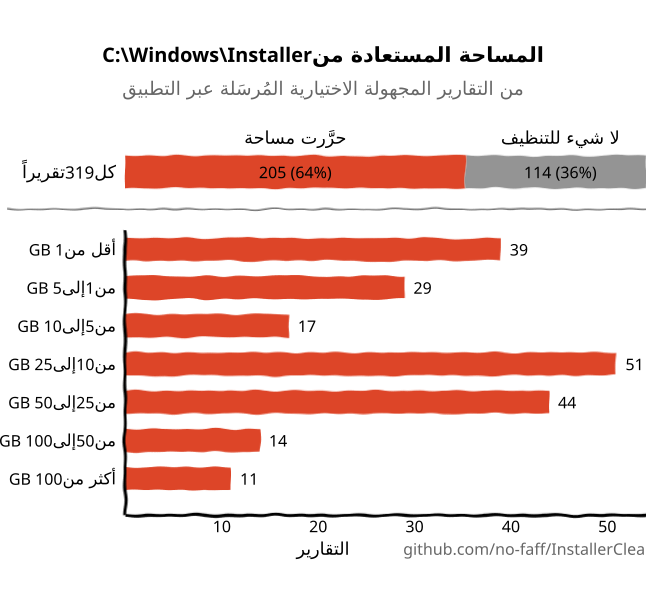
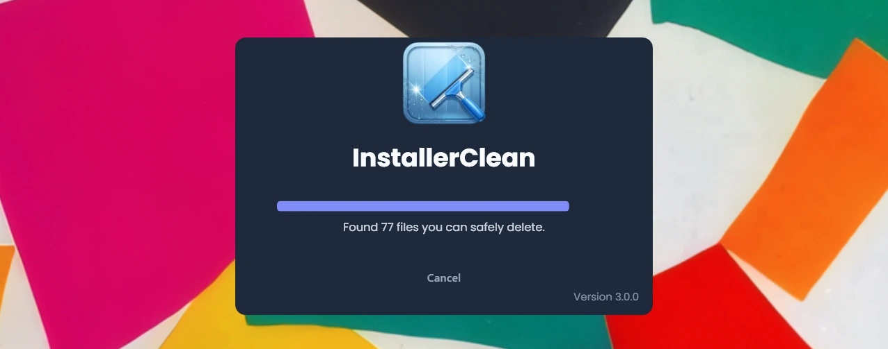
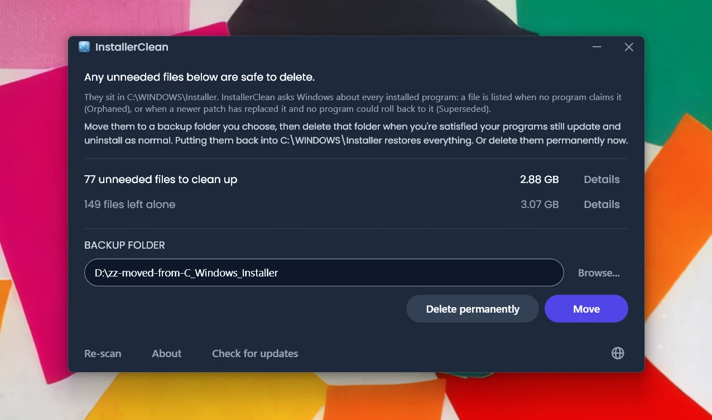
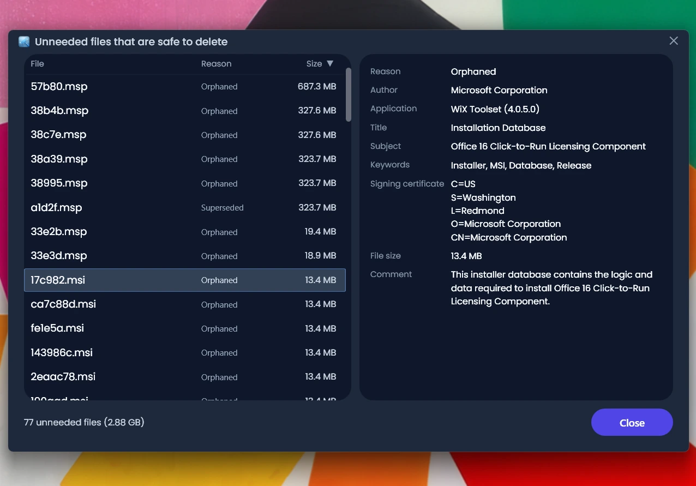
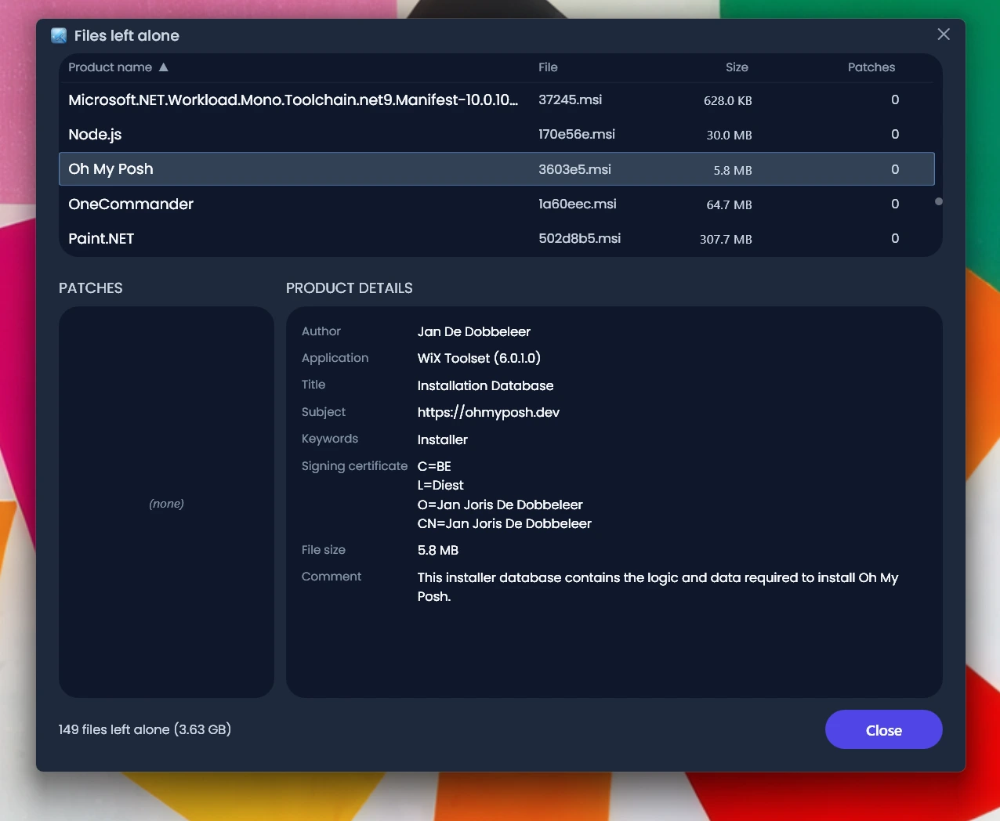
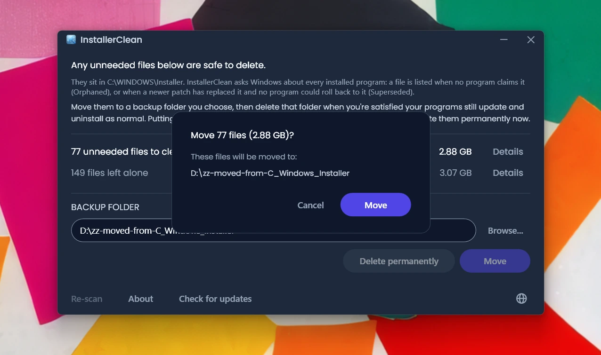
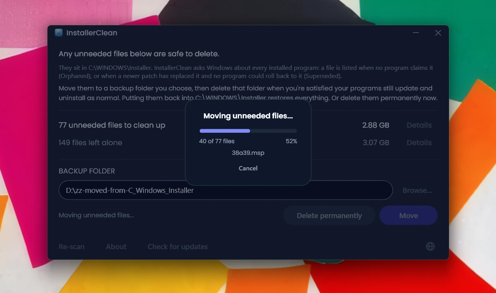
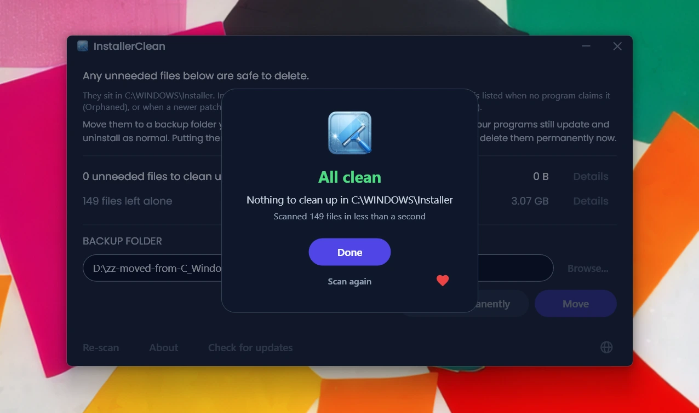

<p align="center">
  <a href="README.md">English</a> · <a href="README.zh-CN.md">简体中文</a> · <a href="README.ru.md">Русский</a> · <a href="README.es.md">Español</a> · <strong>العربية</strong> · <a href="README.ja.md">日本語</a> · <a href="README.pt-BR.md">Português (BR)</a> · <a href="README.pl.md">Polski</a> · <a href="README.tr.md">Türkçe</a> · <a href="README.ko.md">한국어</a> · <a href="README.fr.md">Français</a> · <a href="README.it.md">Italiano</a> · <a href="README.de.md">Deutsch</a> · <a href="README.id.md">Bahasa Indonesia</a> · <a href="README.vi.md">Tiếng Việt</a> · <a href="README.uk.md">Українська</a> · <a href="README.nl.md">Nederlands</a>
</p>

<p align="center"><em>البرنامج نفسه بالإنجليزية؛ ولم يُترجَم إلى العربية سوى هذا الملف التعريفي، لأن جعل الواجهة تعمل من اليمين إلى اليسار مهمة مستقلة ليوم آخر.</em></p>

<p align="center">
  
</p>

<p align="center"><em>🎶 What's my line? I'm happy <a href="https://www.youtube.com/watch?v=HM-jHhUZfFI">cleaning Windows</a></em></p>

<h1 align="center">InstallerClean</h1>

<p align="center"><strong>أداة مفتوحة المصدر لتنظيف <code>C:\Windows\Installer</code> بأمان، ذلك المجلد المخفي في Windows الذي يلتهم مساحة قرصك بهدوء.</strong></p>

<p align="center"><em>استخدمه بين الفينة والأخرى. ربما توفّر بعض المساحة. ثم امضِ في يومك نظيفاً مرتاحاً.</em></p>

<p align="center">
  <a href="LICENSE"></a>
  <a href="https://dotnet.microsoft.com/download/dotnet/10.0"></a>
  <a href="https://github.com/no-faff/InstallerClean/actions/workflows/ci.yml"></a>
  <a href="https://github.com/no-faff/InstallerClean/releases"></a>
  <a href="https://github.com/no-faff/InstallerClean/releases/latest"></a>
  <a href="https://github.com/no-faff/InstallerClean/releases"></a>
</p>

<a id="reports-stats"></a>

<!-- reports-stats-start chart-only (generated; do not hand-edit between these markers) -->
<p align="center">
  <picture>
    <source media="(prefers-color-scheme: dark)" srcset="docs/reports-ar-dark.svg" />
    <source media="(prefers-color-scheme: light)" srcset="docs/reports-ar-light.svg" />
    
  </picture>
</p>
<!-- reports-stats-end -->

- **ما هو:** يفعل InstallerClean شيئاً واحداً: يزيل الملفات غير الضرورية من `C:\Windows\Installer`، وهو مجلد مخفي يمتلئ مع كل برنامج تثبّته أو تحدّثه. وبعد فحص سريع يخبرك InstallerClean إن كان لديك منها شيء، ويعرض تفاصيل أوفى لمن أراد، ويتيح لك نقلها إلى مكان آخر أو حذفها لتحرير مساحة على قرص C:.
- **قد تكون هنا لأنك:** استخدمت [WinDirStat](https://github.com/windirstat/windirstat) أو WizTree أو TreeSize، فرأيت `C:\Windows\Installer` يشغل مساحة كبيرة ولم تعرف ما بداخله. وفي هذه الحالة، InstallerClean هو ما تحتاج إليه تماماً. فهو يعرف ما بداخل تلك الملفات ذات الأسماء التي تبدو عشوائية مثل `9f05cba.msi`، ويخبرك بسرعة أيّها يمكنك إزالته بأمان.
- **كم من المساحة:** يعرض الرسم البياني أعلاه نتائج التقارير الاختيارية التي ما زالت تصل بالتدريج منذ الإصدار v1.8.0. (شكراً لكل من ضغط ذلك الزر. فلولاكم لما وُجد هذا الرسم.) ومن بين الـ <!-- reports-freedpct-start -->64%<!-- reports-freedpct-end --> التي حرَّرت مساحة، بلغ الوسيط المُحرَّر <!-- reports-median-start -->16.1 GB<!-- reports-median-end -->. <!-- reports-biggest-start -->واستعاد أحد الأجهزة 464 GB كاملة، وهو رقم مذهل.<!-- reports-biggest-end --> أما الـ <!-- reports-nothingpct-start -->36%<!-- reports-nothingpct-end --> الباقية فلم تحرّر شيئاً، فالأمر يتوقف على الجهاز: تثبيت Windows 11 نظيف بلا برامج إضافية لا شيء فيه للإزالة. وأكثر الأجهزة ملفات غير ضرورية هي التي ظلّت تعمل سنوات، وأي جهاز عليه برامج ثقيلة قائمة على MSI (مثل Acrobat وOffice وLibreOffice وأدوات التطوير الكبيرة)، ومن يكثر من تثبيت البرامج وإلغاء تثبيتها. وسترى المقدار بالضبط لحظة تشغيله.
- **هل هو آمن:** نعم. كل ما يمسّه InstallerClean ملفات داخل `C:\Windows\Installer`. فهو يسأل Windows Installer عمّا لا يزال مطلوباً، ويقرأ التطبيق السجلات نفسها من سجل النظام كذلك. ولا يعرض ملفاً إلا إذا لم يطالب به شيء مثبّت على الجهاز، أو حلّ محلّه تصحيح أحدث ولم يعد بوسع أي برنامج هنا الرجوع إلى القديم. وكل ما لا يجد InstallerClean عنه جواباً قاطعاً يحجبه. [التفاصيل أدناه](#كيف-يعمل).
- **لا شيء عنك:** مفتوح المصدر (Apache 2.0). لا حساب، ولا إعلانات، ولا تتبّع، ولا قياس عن بُعد، ولا شيء يعمل في الخلفية. والشيء الوحيد الذي يفعله عبر الإنترنت من تلقاء نفسه هو التحقق من GitHub بحثاً عن إصدار أحدث عند تشغيله، ويمكنك إيقاف ذلك.
- **احصل عليه:** [نزّل أحدث إصدار](../../releases/latest). شغّله؛ وتجاوز [أي تحذير يعرضه Windows](#unknown-publisher) و[طلب صلاحيات المسؤول](#admin). انقل ما يجده أو احذفه. تم.

## المحتويات

- [المجلد الذي لا يخبرك عنه أحد](#المجلد-الذي-لا-يخبرك-عنه-أحد)
- [البحث عن حل](#البحث-عن-حل)
- [ما الذي يفعله InstallerClean](#ما-الذي-يفعله-installerclean)
- [لقطات الشاشة](#لقطات-الشاشة)
- [كيف يعمل](#كيف-يعمل)
- [التنزيل](#التنزيل)
  - [التحقق من التنزيل نفسه](#التحقق-من-التنزيل-نفسه)
- [الأسئلة الشائعة](#الأسئلة-الشائعة)
- [سطر الأوامر](#سطر-الأوامر)
- [إمكانية الوصول](#إمكانية-الوصول)
- [سياسة توقيع الشيفرة البرمجية](#سياسة-توقيع-الشيفرة-البرمجية)
- [الخصوصية](#الخصوصية)
- [ما الذي لا يفعله](#ما-الذي-لا-يفعله)
- [البدائل](#البدائل)
- [إذا اختفى ملف من C:\Windows\Installer](#recovery)
- [المتطلبات](#المتطلبات)
- [البناء من المصدر](#البناء-من-المصدر)
- [المساهمة](#المساهمة)
- [ادعم المشروع](#ادعم-المشروع)
- [سجل النجوم](#سجل-النجوم)
- [الترخيص](#الترخيص)

---

## المجلد الذي لا يخبرك عنه أحد

على كل جهاز يعمل بنظام Windows مجلد مخفي اسمه `C:\Windows\Installer`. في كل مرة تثبّت فيها برنامجاً يستخدم نظام Windows Installer، أو تطبّق تصحيحاً على Microsoft Office أو Adobe Acrobat أو Visual Studio أو أي تطبيق آخر قائم على `.msi`، تذهب نسخة من ذلك المثبّت أو من ملف التصحيح `.msp` إلى هذا المجلد، وتبقى فيه.

وعندما يحلّ تصحيح أحدث محلّ تصحيح أقدم، يبقى الاثنان. وكذلك تبقى مثبّتات البرامج التي ألغيت تثبيتها منذ زمن بعيد. لا يمسّ تنظيف القرص شيئاً من ذلك، ولا استشعار سعة التخزين. وأداة DISM مخصصة لمجلد مختلف تماماً. ومع الوقت ينمو المجلد: 1 GB، ثم 5 GB، ثم 20 GB، ثم 50 GB. وعلى الأجهزة المثقلة بالبرامج التي تكثر من استخدام MSI (وAcrobat مذنب متكرر)، قد [يتجاوز 100 GB](https://www.reddit.com/r/sysadmin/comments/1oxcrmh/acrobat_filling_up_the_cwindowsinstaller_folder/).

وهذه ليست ملفات مؤقتة تعود من تلقاء نفسها. إنها ثقل ميت حقيقي: مثبّتات قديمة لبرامج ألغيت تثبيتها منذ سنوات، وتصحيحات استُبدلت عدة مرات. وحين تزول، لا تعود.

**إن كنت تبحث عن طريقة سهلة لتحرير مساحة على القرص في Windows، فهذا المجلد نقطة بداية جيدة.** يعثر InstallerClean على الملفات غير الضرورية ويزيلها بأمان.

## البحث عن حل

إن سبق أن بحثت عن حل لمشكلة هذا المجلد، فأنت على الأرجح تعرف كيف تسير الأمور. شخص لديه 180 GB في `C:\Windows\Installer` يسأل كيف ينظفه. [يُنصح بتشغيل تنظيف القرص](https://learn.microsoft.com/en-us/answers/questions/4238108/windows-installer-folder-has-occupied-180gb). يجرّبه السائل، فيتحرر 600 MB، لا شيء منها من ذلك المجلد (لأن تنظيف القرص لا يمسّ `C:\Windows\Installer`). ثم يخفت النقاش.

> *«كل النقاشات التي وجدتها تميل إلى اقتراح الأشياء نفسها التي لا تحل المشكلة، ثم تموت.»*
>
> [ksparks519, r/Windows10](https://www.reddit.com/r/Windows10/comments/1bt8c5p/anyone_ever_figure_out_giant_installer_folders/) (مترجمة عن الأصل الإنجليزي)

أو يُقال لهم ألا يلمسوه إطلاقاً. في أحد النقاشات، قيل لشخص لديه مجلد Installer بحجم 60 GB: [«لا تعبث به.»](https://www.reddit.com/r/techsupport/comments/1hw4suq/my_windows_installer_folder_is_like_60gb_so_i/) وعندما سأل عمّا ينبغي أن يفعله بدلاً من ذلك، كان الرد: *«لقد أخبرتك للتو.»*

تخلط النصيحة المعتادة بين أمرين مختلفين. فحذف الملفات عشوائياً يمنعك من تحديث أي برنامج تعود إليه تلك الملفات أو إلغاء تثبيته. أما إزالة الملفات التي لا يطالب بها شيء على الجهاز، أو التي يسجّل Windows أنها استُبدلت، فلا تمنعك من شيء. وInstallerClean يفعل الثاني.

## ما الذي يفعله InstallerClean

1. **يفحص** InstallerClean مجلد `C:\Windows\Installer` بحثاً عن ملفات `.msi` و`.msp`
2. **يستعلم** من Windows Installer عمّا لا يزال مطلوباً، ويقرأ التطبيق السجلات نفسها من سجل النظام كذلك
3. **يحجب** كل ما لا تستطيع القراءتان الفصل فيه بينهما
4. **يخبرك بمقدار ما يمكنك تحريره**، وبمقدار ما يتركه دون مساس، مع نوافذ تفصيلية اختيارية تسرد كل ملف
5. **يزيل الملفات غير الضرورية**: نقلاً إلى مجلد نسخ احتياطي تختاره، أو حذفاً نهائياً

## لقطات الشاشة

<p>
  <br>
  <em>الفحص الأولي. وهو سريع جداً.</em>
  <br><br>
</p>

<p>
  <br>
  <em>النتائج: كم يمكن إزالته، وكم تُرك دون مساس.</em>
  <br><br>
</p>

<p>
  <br>
  <em>تفاصيل الملفات التي يمكن أن تزول: سبب عدم الحاجة إلى كل منها، وما يقوله الملف عن نفسه.</em>
  <br><br>
</p>

<p>
  <br>
  <em>تفاصيل الملفات المتروكة دون مساس: البرنامج الذي يقول Windows إن كل ملف يعود إليه، وما يقوله الملف عن نفسه.</em>
  <br><br>
</p>

<p>
  <br>
  <em>تأكيد قبل أي من الإجراءين. النقل ينسخ الملفات احتياطياً إلى مجلد تختاره. أو احذفها نهائياً.</em>
  <br><br>
</p>

<p>
  <br>
  <em>النقل أثناء تنفيذه. إلى القرص نفسه يكون فورياً. وإلى قرص آخر، كلما زادت الغيغابايتات طال الوقت.</em>
  <br><br>
</p>

<p>
  <br>
  <em>تم. استُعيدت المساحة. والملفات محفوظة احتياطياً حتى تطمئن بنفسك إلى أن كل شيء على ما يرام. ثم احذف مجلد النسخ الاحتياطي.</em>
  <br><br>
</p>

<p>
  <br>
  <em>بعد إعادة الفحص. لم يبق شيء للتنظيف.</em>
  <br><br>
</p>

<a id="is-it-safe"></a>
## كيف يعمل

حين يثبّت Windows Installer برنامجاً، يحتفظ بنسخة من المثبّت في `C:\Windows\Installer`؛ وحين يُسجَّل تصحيح على برنامج، يحتفظ Windows Installer بنسخة منه كذلك. وهذه النسخ هي ما يرجع إليه لاحقاً عند إصلاح البرنامج أو تحديثه أو إلغاء تثبيته، ولهذا تبقى هناك بعد انتهاء التثبيت بزمن طويل. وينتهي النوعان كلاهما إلى المجلد: مثبّتات `.msi`؛ وتصحيحات `.msp`، وهي تحدّث برنامجاً لديك بدل أن تستبدله.

ويعرض InstallerClean ملفاً لأحد سببين.

يعني **Orphaned** (يتيم) أن لا شيء على الجهاز يطالب بالملف. فلا منتج مثبّت ولا تصحيح مسجّل يسمّيه.

ويعني **Superseded** (مُستبدَل) أن Windows سجّل أن تصحيحاً أحدث حلّ محلّ هذا التصحيح، واحتفظ بالملف مع ذلك. فالتصحيح لا يُحذف إلا بعد أن يكون كل برنامج سُجّل عليه قد أُلغي تثبيته، أو بعد أن يُزال التصحيح منها جميعاً. وحلول تصحيح أحدث محلّه ليس أياً من هذين، فيبقى الملف. وهكذا يعمل Adobe Acrobat على Windows: فتحديثاته تصل في صورة تصحيحات على تثبيت أساسي بدل أن تصل في صورة مثبّتات جديدة، فالجهاز الذي مضى عليه وقت مع البرنامج قد يحتفظ بعدة تصحيحات.

ويصل InstallerClean إلى النتيجتين من اتجاهين متعاكسين، والأول وحده هو الذي يقتضي النظر في المجلد أصلاً.

**سرد المجلد.** يسرد InstallerClean ملفات `.msi` و`.msp` الموجودة مباشرة في `C:\Windows\Installer`. ولا يدخل إلى المجلدات الفرعية.

**قراءة السجلات مرتين.** يستعلم InstallerClean من Windows Installer عن كل منتج مثبّت وكل تصحيح مسجّل، وعن الملف المخزَّن الذي يسمّيه كل منها، باستدعاء واجهة Windows Installer البرمجية في `msi.dll`. ثم يقرأ التطبيق السجلات نفسها بطريقة ثانية، مباشرة من سجل النظام، لأن السؤال قد يعود ناقصاً دون أن يقول ذلك: يسلّم Windows السجلات واحداً تلو الآخر حتى يقول إنه لم يبق شيء، وتشغيل يتوقف عند الثالث من مئتين يبدو تماماً كتشغيل بلغ النهاية. أما مفتاح سجل النظام فيسلّم قائمة أسمائه كاملة دفعة واحدة، فلا تستطيع قائمة ناقصة أن تبدو كاملة. وكل منتج يسمّيه سجل النظام ولم يظهر في السؤال يُعاد طرحه على Windows بالاسم، واحداً واحداً. وهذه القراءة الثانية لا تستطيع إلا أن تنقل ملفاً إلى جانب «ما زال مطلوباً». وليس ثمة طريق تضع به ملفاً على قائمة الإزالة.

**مطابقة سجل بملفه.** يشير كل سجل إلى ملفه المخزَّن بمسار، والمجلد الواحد لا يُكتب في هذه السجلات دائماً بالهجاء نفسه. فبدل الوثوق بالهجاء، يسأل InstallerClean نظام Windows إلى أين يشير كل مسار مسجَّل حقاً، ويقارن التطبيق ذلك بالملفات التي سردها في المجلد. وكل ما بقي دون أن يطالب به شيء يخضع لمقارنة ثانية لا تمرّ بالأسماء إطلاقاً: يفتح InstallerClean الملف ويطلب من Windows تعريفه، حتى يُعرَف الاسمان المختلفان للملف الواحد على أنهما ملف واحد.

**سجلات يتعذّر مطابقتها.** إذا امتنع Windows عن بيان إلى أين يشير مسار مسجَّل، أو تعذّر تعريف الملف الذي ينتهي إليه، فإن InstallerClean لا يعرف عن أي ملف كان ذلك السجل، وأي ملف من الملفات التي سردها قد يكون هو. والأمر نفسه إذا احتمل أن يكون برنامج قد ثُبّت أكثر من مرة، لأن InstallerClean عندئذ لا يستطيع تمييز أي ملف مخزَّن يخصّ أي نسخة. وفي أي من هذه الحالات لا يعرض شيئاً مما وجده بسرد المجلد في تلك المرة. أما السجل الذي يشير إلى ملف زال بالفعل فأمره مختلف: لم يبق شيء يمكن أن يكون قد عناه، فلا يمكن أن يكون عن أي من الملفات التي لا تزال في المجلد.

**السؤال من الطرف الآخر.** يُقرَّر اليُتم بغياب، والغياب قد يعني كذلك أن التطبيق أخفق في العثور على السجل. فقبل عرض مثبّت `.msi`، يفتح InstallerClean الملف، ويقرأ رمز المنتج الذي يحمله الملف نفسه، ويستعلم من Windows عمّا إذا كان ذلك المنتج مثبّتاً. فإن كان، بقي الملف، مهما وجد باقي الفحص. وهذا التحقق لا يستطيع إلا أن يرفع ملفاً عن القائمة. ولا شيء مما قد يجيب به يضع ملفاً عليها.

**ما الذي يحسم تصحيح `.msp`.** لا يُفتح التصحيح ليُسأل عن البرنامج الذي يتبعه. وما يحسمه بدلاً من ذلك أن تسجيل التصحيح يسمّي ملفه المخزَّن في موضعين: التصحيحات المسجّلة على كل منتج؛ وقائمة واحدة في سجل النظام بكل تسجيلات التصحيحات على الجهاز. ولا يُعرض تصحيح باعتباره يتيماً إلا إذا لم يسمّه أي منهما.

**أين يختلف التصحيح المُستبدَل.** لا يمرّ بشيء مما سبق، لأنه ليس من الملفات التي لا يطالب بها شيء. فلدى Windows سجل به، وذلك السجل هو ما يقول إنه استُبدل. والخطر هنا مختلف: فقد يكون التصحيح مسجّلاً على عدة برامج، ولم ينته منه إلا واحد منها. فلا يُعرض تصحيح مُستبدَل إلا إذا سجّل Windows أنه لا يمكن إلغاء تثبيته، وسُئل كل برنامج سُجّل عليه، ولم يعد أي منها مطبّقاً له، ولم يكن لدى أي منها تصحيح يقول Windows إنه يمكن إلغاء تثبيته. والشرط الأخير موضوع لأن التراجع عن تصحيح في برنامج قد يرجع إلى الملف الأقدم. وإن تعذّر الجواب عن أي من ذلك، بقي الملف.

<details>
<summary>استدعاءات Windows Installer التي يستعملها InstallerClean</summary>

- `MsiEnumProductsEx` لتعداد كل منتج مثبّت، ومرة أخرى برمز منتج واحد للسؤال عمّا إذا كان منتج بعينه مثبّتاً
- `MsiEnumPatchesEx` لسرد التصحيحات المسجّلة، لكل منتج وعلى مستوى الجهاز كله
- `MsiGetProductInfoEx` لقراءة اسم المنتج، والملف المخزَّن الذي يسمّيه، وما إذا كان واحداً من عدة تثبيتات للمنتج نفسه
- `MsiGetPatchInfoEx` لقراءة حالة التصحيح، وما إذا كان Windows يستطيع إلغاء تثبيته، والملف المخزَّن الذي يسمّيه
- `MsiGetSummaryInformation` و`MsiSummaryInfoGetProperty` لتقرأ من ملف التصحيح البرامج التي يمكن تطبيقه عليها
- `MsiOpenDatabase` و`MsiDatabaseOpenView` و`MsiViewExecute` و`MsiViewFetch` و`MsiRecordGetString` لتقرأ من ملف المثبّت رمز المنتج الذي يعلنه

</details>

ومع هذا كله، يشجّعك التطبيق على نقل الملفات إلى مجلد نسخ احتياطي (على قرص أو قسم آخر إن كنت تريد تحرير مساحة على C). فبذلك تتاح لك فرصة الاطمئنان إلى أن كل شيء على ما يرام فعلاً قبل أن تحذف الملفات غير الضرورية نهائياً.

## التنزيل

ثلاث نسخ، اختر واحدة:

- **Portable** (`InstallerClean-3.0.0-portable.exe`): ملف واحد، بداخله بيئة تشغيل .NET 10. بلا تثبيت وبلا أداة إلغاء تثبيت: انقره نقراً مزدوجاً فيعمل. احتفظ بالملف في مكان ما للمرة القادمة، أو احذفه حين تنتهي.
- **Setup** (`InstallerClean-3.0.0-setup.exe`): مثبّت Windows عادي مع تضمين بيئة تشغيل .NET 10. يضيف إدخالاً في القائمة «ابدأ» ويُلغى تثبيته بنظافة. مُدرَج ضمن البرامج ليسهل العثور عليه بعد ستة أشهر من الآن، أو لتشغيله أكثر من ذلك إن كنت تكثر من تثبيت البرامج وإلغاء تثبيتها.
- **CLI** (`installerclean-cli.exe`): نسخة سطر الأوامر وحدها، ملف واحد بداخله بيئة التشغيل. بلا تثبيت وبلا أداة إلغاء تثبيت. ضعه على جهاز عميل، وشغّل فحصاً أو تنظيفاً، ثم احذفه. مبني للبرمجة النصية والمهام المجدولة والنشر الواسع، حيث تريد العمليات دون تطبيق سطح مكتب على العميل. انظر [سطر الأوامر](#سطر-الأوامر) للوسائط ورموز الخروج.

بدءاً من الإصدار 2.2.0، يحمل اسما ملف التثبيت والنسخة المحمولة رقم الإصدار، فتقول النسخة المُنزَّلة دائماً ما هي؛ أما أداة سطر الأوامر فتحتفظ باسمها البسيط `installerclean-cli.exe` كي تستمر المهام المجدولة والبرامج النصية التي تشير إليه في العمل عبر التحديثات.

نزّله من [صفحة الإصدارات](../../releases/latest)، ثم شغّله. وهو غير موقّع، فيعرض Windows تحذير «ناشر غير معروف»؛ وتشرح [الأسئلة الشائعة](#unknown-publisher) ما ستراه ولماذا هو آمن.

يفحص التطبيق تلقائياً عند بدء التشغيل. راجع النتائج، ثم انقر **Move** (نقل) أو **Delete permanently** (حذف نهائي).

أو ثبّته عبر [winget](https://learn.microsoft.com/windows/package-manager/winget/):

```
winget install NoFaff.InstallerClean
```

أو ثبّته عبر [Scoop](https://scoop.sh):

```
scoop install installerclean
```

### التحقق من التنزيل نفسه

ليس InstallerClean موقّعاً رقمياً. وإليك ما يمكنك التحقق منه قبل تشغيله:

- بصمة SHA-256 لكل تنزيل موجودة على صفحة إصداره.
- تُفحص كل نسخة على VirusTotal قبل خروجها، وتحمل صفحة الإصدار النتيجة الكاملة لكل محرك عن كل تنزيل.
- الشيفرة المصدرية هنا على [github.com/no-faff/InstallerClean](https://github.com/no-faff/InstallerClean). وخدمات الفحص والاستعلام والنقل والحذف والإعدادات وإعادة التشغيل المعلّقة مغطاة بمجموعة اختبارات آلية تعمل على Windows مع كل دفع إلى `main` ومع كل طلب سحب، وتُبلّغ شارة CI أعلى هذه الصفحة بالنتيجة.
- بناء الإصدارات حتمي: الشيفرة نفسها والـ SDK نفسه وأعلام النشر نفسها تُنتج البايتات نفسها، ولا يمكن وضع tag على إصدار ما لم يطابق كل مُدخَل بناء الشيفرةَ عند ذلك الـ tag. فيمكنك جلب الشيفرة عند الـ tag وبناءها بنفسك ومقارنة البصمات بالمنشورة. وتحمل ملاحظات كل إصدار ما تحتاج إليه لذلك: إصدار الـ SDK الذي بُني به، وأعلام النشر لأي تنزيل لم يُبنَ بالإعدادات الافتراضية. والمثبّت هو الاستثناء: إذ يصرّفه Inno Setup لا الـ SDK ويطبع سنة البناء في نفسه، فإعادة إنتاج بصمته تحتاج إلى إصدار Inno نفسه وإلى السنة الميلادية نفسها كذلك.
- <!-- downloads-start -->80,000+<!-- downloads-end --> عملية تنزيل عبر GitHub وMajorGeeks وSoftpedia.
- يختبر [MajorGeeks](https://www.majorgeeks.com/files/details/installerclean.html) كل نسخة مُرسَلة في جهاز افتراضي ولا يدرجها إلا إذا اجتازت مراجعتهم.<br><a href="https://www.majorgeeks.com/files/details/installerclean.html"></a>
- راجعته [Softpedia](https://www.softpedia.com/get/System/Hard-Disk-Utils/InstallerClean.shtml) وشهدت بخلوّه من برامج التجسس والبرامج الإعلانية والفيروسات.<br><a href="https://www.softpedia.com/get/System/Hard-Disk-Utils/InstallerClean.shtml"></a>

## الأسئلة الشائعة

<a id="admin"></a>

**لماذا يطلب صلاحيات المسؤول؟** لسببين. `C:\Windows\Installer` مقيّد للمسؤولين، فقراءته، والاستعلام من Windows Installer، ونقل الملفات أو حذفها، كلها تحتاج إلى ذلك. وللمسؤول أن يسأل Windows عن البرامج المثبّتة تحت أي حساب على الجهاز، وليس ذلك لغير المسؤول: شغّله بدونها، فيقول Windows إن برنامجاً غير مثبّت وهو مثبّت، داخل التحقق الذي يقرّر ما إذا كان الملف لا يزال مطلوباً.

<a id="unknown-publisher"></a>

**لماذا يقول Windows «ناشر غير معروف»؟** لأن InstallerClean غير موقّع رقمياً، ولأن Windows يضع علامة على الملفات المنزّلة من الإنترنت، فعند أول تشغيل يعرض SmartScreen عادةً «قام Windows بحماية الكمبيوتر الخاص بك» مع إدراج الناشر على أنه غير معروف. وشهادة التوقيع المدفوعة تكلّف مالاً كل عام، وأفضّل أن أبقي التطبيق مجانياً على أن أدفع ثمنها، فتقدّمت بطلب إلى SignPath Foundation، وهي توقّع البرمجيات مفتوحة المصدر بلا مقابل، وقُبل InstallerClean (انظر [سياسة توقيع الشيفرة البرمجية](#سياسة-توقيع-الشيفرة-البرمجية)). ولم تصدر الشهادة بعد، فانقر في الوقت الحالي **مزيد من المعلومات**، ثم **التشغيل على أي حال**. وهذا آمن: الشيفرة المصدرية علنية، ولكل إصدار روابط VirusTotal وبصمات SHA-256 يمكنك التحقق منها أولاً.

**هل يعمل على Windows 7 أو 8؟** لا. يحتاج إلى Windows 10 الإصدار 1607 أو أحدث، وهو أقدم بنية تدعمها بيئة تشغيل .NET 10. ويرفض المثبّت التثبيت على ما هو أقدم، والنسخة المحمولة لا تبدأ.

## سطر الأوامر

تأتي أداة `installerclean-cli.exe` ملفاً تنفيذياً طرفياً منفصلاً، يُثبَّت بجانب الواجهة الرسومية. الفحص نفسه، والنقل نفسه، والحذف نفسه، بلا نافذة. وهو يحجب الموجّه حتى ينتهي، فيستطيع سكربت أو مهمة مجدولة انتظاره.

### الأعلام

| العلَم | ما يفعله | يقبل كذلك |
|---|---|---|
| `/s` | فحص فقط. يسرد ما سيزيله، مع اسم كل ملف وحجمه وسببه. لا يغيّر شيئاً. | |
| `/d` | يفحص، ثم يحذف الملفات غير الضرورية نهائياً. | |
| `/m` | يفحص، ثم ينقلها إلى المجلد المحفوظ في الواجهة الرسومية. | |
| `/m PATH` | يفحص، ثم ينقلها إلى `PATH`. ضعه بين علامتي اقتباس إن كان فيه مسافة. | |
| `--help` | طباعة الاستخدام والخروج بالرمز `0`. | `/?` و`-h` |
| `--version` | طباعة الإصدار والخروج بالرمز `0`. | `-v` |

الأعلام غير حسّاسة لحالة الأحرف، فـ`/S` و`/D` تعملان كما تعمل `/s` و`/d`. وعلَم واحد لكل تشغيل: لا يمكن الجمع بينها، و`/s` و`/d` لا يأتي بعدهما شيء.

شغّله بلا وسيط فتُطبَع رسالة الاستخدام وينتهي التشغيل بالرمز `1`، حتى تفشل مهمة مجدولة فقدت علَمها فشلاً ظاهراً بدل أن تنجح بصمت دون أن تفعل شيئاً. وعلَم لا يعرفه يطبع سطر خطأ، ثم الاستخدام، وينتهي بالرمز `1` كذلك. ومسار نقل فيه مسافة وليس بين علامتي اقتباس يُرفض على النحو نفسه بدل أن يُبتر بصمت، وتخبرك الرسالة بأن تضعه بين علامتي اقتباس.

### رموز الخروج

هذه هي الرموز التي توثّقها الأداة نفسها في `--help`:

| الرمز | معناه |
|---|---|
| `0` | نجاح. فعل التشغيل ما طُلب منه ولم يفشل شيء. |
| `1` | لم تُعالَج أي ملفات. أخفق التشغيل أو رُفض. |
| `2` | جزئي. عولج بعضها دون بعض، ومن ذلك Ctrl+C في منتصف الطريق. |
| `75` | عارض. وضع مؤقت حجب التشغيل؛ وتقول الرسالة المطبوعة أيّه. |
| `130` | أُلغي بـ Ctrl+C قبل معالجة أي شيء. |

يشمل `1` الرفض كما يشمل الإخفاق، والرفض ليس عيباً: وجهة ممتلئة ببساطة، أو قيمة في سجل النظام لم يستطع التطبيق قراءتها قبل أن يمسّ شيئاً، كلاهما ينتهي هنا. و`0` يعني أن شيئاً لم يفشل، لا أن شيئاً لم يبق: فـ`--help` و`--version` والتشغيل بالفحص وحده كلها تنتهي بالرمز `0` سواء وجد الفحص ثمانية وستين ملفاً أو لم يجد شيئاً.

### سجل الأحداث

يكتب كل تشغيل إدخال نتيجة في سجل التطبيقات، وقد يضيف بجانبه إشعاراً أو أكثر. ومعرّف الحدث عقد آلي ثابت، فيستطيع نظام RMM الترشيح بالرقم دون تحليل أي نص:

| المعرّف | معناه |
|---|---|
| `1000` | نجاح |
| `1002` | جزئي |
| `2000` | تخطٍّ، حالة عارضة |
| `4000` | إخفاق جسيم |
| `3000` | إشعار: لم يتمكّن الفحص من الإحاطة بكل منتج مثبّت |
| `3001` | إشعار: ملفات يتوقعها Windows غير موجودة في المجلد |
| `3002` | إشعار: ملفات حُجبت بدل أن تُعرض |

نطاق `3000` إشعار لا نتيجة، ولا يُحتسب نتيجةً للتشغيل. ونوع الإدخال «معلومات» حيث لم يقع خلل في التشغيل، و«تحذير» حيث وقع. **سجل الأحداث بالإنجليزية دائماً**، مهما كانت لغة عرض الجهاز، فيكون للبحث عن عبارة معروفة هدف ثابت. أما سطر الأوامر فهو الواجهة المترجَمة: يتبع لغة الجهاز نفسه، ويكتب الأحجام والتواريخ بصيغة منطقته.

### وصفات جاهزة

تدقيق إلى ملف، دون تغيير أي شيء:

```
installerclean-cli /s > audit.txt
```

نقل شهري إلى `D:\InstallerBackup`، مع وضع أداة سطر الأوامر في `C:\Tools`:

```
schtasks /create /tn "InstallerClean monthly" /tr "C:\Tools\installerclean-cli.exe /m D:\InstallerBackup" /sc monthly /ru SYSTEM /rl highest
```

تحجب المهمة حتى ينتهي التشغيل وتسجّل رمز الخروج بوصفه «نتيجة آخر تشغيل» لديها، فيستطيع نظام RMM الاعتماد على الرموز أعلاه.

من PowerShell:

```powershell
& 'C:\Tools\installerclean-cli.exe' /m D:\InstallerBackup
switch ($LASTEXITCODE) {
    0       { 'نظيف' }
    2       { 'جزئي، راجع المُخرَجات' }
    75      { 'محجوب، أعد المحاولة لاحقاً' }
    default { "أخفق ($LASTEXITCODE)" }
}
```

### قبل أن تكتب سكربتاً

- **يحتاج إلى رفع الصلاحيات.** كله يحتاج إليه، بما في ذلك `/s`. ومن موجّه غير مرفوع الصلاحيات، يرفض Windows تشغيله ويسلّم صدفتك الرمز `740`.
- **المجلد المحفوظ في الواجهة الرسومية لكل مستخدم على حدة.** ولن تراه مهمة تعمل بحساب SYSTEM أو بحساب خدمة، فعلى تلك التشغيلات تمرير `/m PATH`.
- **يصل SYSTEM إلى الشبكة بحساب الجهاز**، فوجهة على الصورة `\\server\share` تحتاج إلى منح ذلك الحساب الصلاحيات.
- **العلَم `/s` لا يحجب أبداً.** فهو للقراءة فقط ولا يأخذ قفلاً، فيمكنك الفحص وتطبيق سطح المكتب مفتوح. أما `/d` و`/m` فيأخذان قفلاً على مستوى الجهاز وينتهيان بالرمز `75` إن كان تشغيل آخر لـ InstallerClean يحمله.
- **كل شيء يذهب إلى stdout**، بما في ذلك الأخطاء؛ ولا يوجد stderr. اعتمد على رمز الخروج بدل تحليل النص.
- **النقل يرفض ولا يعيد التسمية.** إذا كان لدى الوجهة ملف بذلك الاسم، تُرك ذلك الملف في المخزن المؤقت وسُمّي في المُخرَجات، ومضى باقي الدفعة في النقل. والتشغيل الذي تتصادم فيه كل الملفات لا يعالج شيئاً وينتهي بالرمز `1`.
- **لا شيء يفرّغ مجلد النسخ الاحتياطي.** فـ`/m` لا يفعل غير الإضافة. وعليك أنت تفريغه بنفسك.
- **الأمر `taskkill /pid` ليس إلغاءً سلساً.** ويستعيد التشغيلُ التالي قفلَ المثيل الواحد.
- **يسجّل التشغيل الأول مصدراً لسجل الأحداث**، عند `HKLM\SYSTEM\CurrentControlSet\Services\EventLog\Application\InstallerClean`. اتركه هناك: فعارض الأحداث يقرأ وصف الإدخال عبر مصدره، وإزالته تحوّل كل إدخال كتبته الأداة من قبل إلى خطأ «مصدر غير معروف».

### لماذا `installerclean-cli` وليس `installerclean.exe`

أما `InstallerClean.exe` فهو النافذة، وهو يتجاهل وسائط سطر الأوامر. أما `installerclean-cli.exe` فعملية طرفية حقيقية، تحجب الموجّه حتى تنتهي، ويُعاد توجيهها وتُمرَّر بالأنبوب كأي شيء آخر. ويثبّت المثبّت كليهما. أما تنزيل النسخة المحمولة فالواجهة الرسومية وحدها؛ نزّل `installerclean-cli.exe` وحده من [صفحة الإصدارات](../../releases/latest) إن أردت سطر الأوامر دون النافذة.

## إمكانية الوصول

صُمّم InstallerClean ليكون قابلاً للاستخدام بالكامل من لوحة المفاتيح ومع قارئ الشاشة.

- **قابل للتشغيل بالكامل من لوحة المفاتيح.** كل ما يفعله التطبيق يمكن بلوغه من لوحة المفاتيح، وتُرتَّب أعمدة نوافذ التفاصيل من لوحة المفاتيح كذلك، فلا شيء هنا يحتاج إلى فأرة. وأزرار شريط العنوان تتصرف كأزرار Windows وتُبلَغ بـ Alt+Space أو Alt+F4. ويبقى مؤشر تركيز لوحة المفاتيح مرئياً أينما حلّ.
- **الراوي والوصول الصوتي.** كل عنصر تحكم موسوم، والكلمة الظاهرة على الزر هي الكلمة التي تفعّله بالصوت. وعند انتهاء عملية نقل أو حذف، تُقرأ النتيجة بصوت مسموع.
- **مصمَّم ليُقرأ.** يفي النص بتباين WCAG AA في جميع أنحاء المظهر الداكن.

إن اعترض شيء هنا طريقك، [افتح مشكلة](../../issues). مشكلات إمكانية الوصول عيوب برمجية، لا حالات هامشية.

## سياسة توقيع الشيفرة البرمجية

قُبل InstallerClean لدى [SignPath Foundation](https://signpath.org) للحصول على توقيع مجاني للشيفرة، وهو برنامج يوقّع البرمجيات مفتوحة المصدر حتى تكفّ عن الوصول إلى جهازك من ناشر غير معروف. ولم تصدر الشهادة نفسها بعد، فالتنزيلات هنا غير موقّعة اليوم وسينبّهك Windows بشأنها.

وحين تصدر، ستحمل الإصدارات السطر الذي تطلبه SignPath: free code signing provided by SignPath.io, certificate by SignPath Foundation. والشهادة ملك للمؤسسة لا لي، لأن الشهادة لا بد أن تُصدَر باسم كيان قانوني، ومشروع يديره شخص واحد ليس كذلك. وهذا لا يعني أن InstallerClean ملكهم، ولا أنهم يشاركون فيه بما يتجاوز التوقيع.

**الأدوار.** لـInstallerClean مشرف واحد. المساهمون بالشيفرة ومراجعوها، أي من يستطيع إدخال شيفرة إلى المشروع: أنا. والمعتمِدون، أي من يستطيع الإذن بتوقيع إصدار: أنا.

## الخصوصية

التقرير الاختياري هو الشيء الوحيد الذي يرسل أي شيء عن تشغيل، ولا يذهب إلا حين تضغط الزر. يقول ما وجده الفحص، وما حجبه ولماذا، وهل نقلت أم حذفت، وكم حرّر ذلك، وكم استغرق، وما أخفق منه، إلى جانب إصدار التطبيق، واللغة التي قرأته بها، وإصدار Windows لديك. لا أسماء ملفات، ولا أسماء مجلدات، ولا اسم حساب، ولا شيء يعرّف جهازك، ولا شيء يمكن أن يربط تقريرين أحدهما بالآخر. وبه أعرف إن كان التطبيق يعمل، وما الذي يحجبه، على أجهزة غير جهازي.

لا إعلانات ولا قياس عن بُعد. والاتصالات الأخرى الوحيدة هي فحص الإصدار عند بدء التطبيق، وهو طلب واحد إلى GitHub يمكنك إيقافه من نافذة **About** (حول)، وأزرار تحيل إلى GitHub وإلى صفحة يمكنك التبرع فيها إن طابت نفسك بذلك. [سياسة الخصوصية](PRIVACY.md) كاملة (بالإنجليزية).

## ما الذي لا يفعله

- أما WinSxS (`C:\Windows\WinSxS`) فمجلد مختلف بقواعد مختلفة. ولأجله، شغّل `Dism /Online /Cleanup-Image /StartComponentCleanup` من موجّه مرفوع الصلاحيات.
- لا خدمة في الخلفية، ولا مهمة مجدولة، ولا تنظيف تلقائي. يعمل التطبيق حين تشغّله.
- لا يغيّر برامجك المثبّتة ولا قاعدة بيانات Windows Installer، بل يقرؤها فقط. والشيء الوحيد الذي يكتبه في سجل النظام هو تسجيل مصدر الأحداث لمرة واحدة، الذي تحتاج إليه أداة سطر الأوامر كي تظهر تشغيلاتها في سجل أحداث Windows.
- يُجري نوعاً واحداً من الاتصال من تلقاء نفسه: فحص سريع لصفحة الإصدارات على GitHub بحثاً عن إصدار أحدث عند تشغيله، ويمكنك إيقافه من **About**. وكل ما عدا ذلك لا يحدث إلا حين تطلبه منه: التقرير المجهول الاختياري (أرقام عن التشغيل، ولا شيء يسمّيك أو يسمّي ملفاتك)، وروابط إلى وثائق GitHub وإلى صفحة تبرع، تُفتح في متصفحك إن نقرت عليها. وهو لا ينزّل شيئاً من تلقاء نفسه أبداً.
- لا أشرطة أدوات، ولا برامج مرفقة، ولا برامج إعلانية.

## البدائل

إن سبق أن بحثت عن هذا المجلد، فالأداة التي على الأرجح وجدتها هي [PatchCleaner](https://www.homedev.com.au/free/patchcleaner). هي التي قامت بهذا العمل أولاً، وقامت به عشر سنين قبل أن يوجد InstallerClean، وهي لا تزال تعمل بقوة، وما كان InstallerClean ليوجد لولاها.

وكان دافعي إلى صنع InstallerClean أن PatchCleaner مغلق المصدر، ولم يحصل على تحديث منذ مارس 2016، ويستبعد ملفات Adobe افتراضياً. ولهذا الاستبعاد سبب وجيه، وقد قالته HomeDev صراحةً في ملاحظات الإصدار حينها:

> *«في الإصدارات السابقة مشكلة معروفة، إذ يُعرّف PatchCleaner خطأً تصحيحات Adobe Acrobat Reader على أنها غير مطلوبة. فـAdobe تفعل شيئاً خاصاً بها في تحديثها التلقائي، بحيث إن أزال PatchCleaner التصحيحات «اليتيمة» من مجلد المثبّت، لم تعد تحديثات Adobe Reader التلقائية تُثبَّت بنجاح.»*
>
> [ملاحظات إصدار PatchCleaner، النسخة 1.4.0.0](https://www.homedev.com.au/free/patchcleaner) (مترجمة عن الأصل الإنجليزي)

والمرشّح الذي دخل معها يبحث عن كلمة «Acrobat» في بيانات الملف الوصفية وفي توقيعه. وعلى الأجهزة التي يكون فيها Acrobat أسوأ مذنب، قد يكون ذلك معظم المساحة:

> *«حمّلت PatchCleaner لحذف ملفات `.msp` اليتيمة، لكن يبدو أن ذلك لن يحرّر سوى 250 MB من المساحة. فـ 29 GB من الملفات "مستبعَدة بالمرشّحات"، فلا يبدو أن PatchCleaner يساعد.»*
>
> HeatherBunny1111, [r/techsupport](https://www.reddit.com/r/techsupport/comments/1qc4tcf/how_to_delete_msp_files_safely/) (مترجمة عن الأصل الإنجليزي)

والفرق بين الأداتين هنا هو ما تطلبه كل منهما من Windows، لا اختلاف في الرأي بشأن Adobe. فالقائمة التي يحتفظ بها Windows بالتصحيحات *المطبَّقة* على منتج تُسقط تلك التي حلّ محلها تصحيح أحدث، فالأداة التي تقرأ تلك القائمة تلقى ملف التصحيح المُستبدَل ملفاً لا يطالب به شيء، شأنه شأن أي ملف آخر. ومرشّح الاستبعاد هو ما يمسك ملفات Adobe بالاسم. أما InstallerClean فيسأل Windows عن حالة التصحيح بدلاً من ذلك، فيصل التصحيح المُستبدَل موسوماً بأنه كذلك، ويُقرَّر مصيره بناءً على ما يسجّله Windows عنه لا على ما يقوله اسمه. وإليك كيف تتقارن الأداتان:

| | **InstallerClean** | **PatchCleaner** |
|---|---|---|
| آخر تحديث | 2026 (نشط) | 3 مارس 2016 |
| الشيفرة المصدرية | مفتوحة المصدر (Apache 2.0) | مغلقة المصدر |
| بيئة التشغيل | .NET 10 (مكتفية ذاتياً) | .NET Framework 4.5.2 + VBScript |
| الواجهة البرمجية | واجهة Windows Installer في `msi.dll` (داخل العملية) | Windows Installer COM (خارج العملية عبر VBScript) |
| التصحيحات المُستبدَلة | تُعرَّف من سجلات تصحيحات Windows | لا تُميَّز عن الملفات التي لا يطالب بها شيء |
| ملفات Adobe | تُكتشَف التصحيحات المُستبدَلة وتُوسَم | تُستبعَد بمرشّح بالاسم، مفعَّل افتراضياً |

> **ملاحظة عن `Win32_Product`:** النهج الشائع المعيب لسرد المنتجات المثبّتة هو `Win32_Product` (WMI)، الذي [يطلق عمليات إصلاح MSI](https://gregramsey.net/2012/02/20/win32_product-is-evil/) على كل منتج أثناء التعداد. وكلٌّ من InstallerClean وPatchCleaner يتجنّبه. فـInstallerClean يستدعي واجهة Windows Installer البرمجية في `msi.dll`؛ وPatchCleaner يشغّل سكربتاً مساعداً يستخدم كائن Windows Installer COM. واسم ذلك السكربت `WMIProducts.vbs`، وهو ما يوحي بغير ذلك، لكن الملف سكربت المثال الذي كتبته Microsoft نفسها مع تعديل، وهو يسأل Windows Installer لا WMI. والاسم هو الشيء المضلّل الوحيد فيه.

ولا ينظّف أيٌّ من تنظيف القرص واستشعار سعة التخزين وCCleaner وBleachBit مجلد `C:\Windows\Installer`.

<a id="recovery"></a>
## إذا اختفى ملف من `C:\Windows\Installer`

إن كان لديك بالفعل ملف مفقود من ذلك المجلد، فالبرنامج الذي كان يتبعه لا يزال يعمل عادياً. لكن حين تحاول تحديث ذلك البرنامج أو إلغاء تثبيته فالأرجح أن تخفق المحاولة. يذهب Windows باحثاً عن الملف، فلا يجده، فتتوقف الخطوة.

وInstallerClean غرضه كله ألا يعرض للنقل أو الحذف إلا الملفات غير المطلوبة، لكنه يعرف متى يكون ملف مفقوداً، فيعلّم كل ما يجده منها بمثلث تحذير ورابط يشير إلى هنا. وهذا ما تفعله لمحاولة إصلاح البرنامج:

- اعرف رقم إصدار برنامجك المثبّت (الإعدادات، التطبيقات، التطبيقات المثبتة)
- نزّل مثبّت **ذلك الإصدار** بعينه من صانعه. فالأحدث لن ينفع، ولا ينفع إلغاء التثبيت أولاً: كلاهما عليه أن يزيل ما هو مثبّت قبل أن يمضي، والإزالة هي الخطوة التي تحتاج إلى الملف المفقود.
- شغّل ذلك المثبّت
- من المفترض أن يعيد ذلك المثبّت الملف المفقود ويترك إعداداتك دون مساس. أعد الفحص في InstallerClean وسيختفي التحذير إن نجح الأمر.

غير أن Microsoft لا تضمن نجاح ذلك. وما يلي رواية Microsoft نفسها، وهي أوفى:

<details>
<summary>موقف Microsoft الأوفى</summary>

*اقتباسات Microsoft التالية بالنص الإنجليزي الأصلي.*

الإرشادات الكاملة: [Restore missing Windows Installer cache files](https://learn.microsoft.com/en-us/troubleshoot/windows-client/application-management/missing-windows-installer-cache)، رقم KB 2667628.

*قد لا تظهر المشكلة فوراً:*
> "If the installer cache is compromised, you may not immediately see problems until you take an action such as uninstalling, repairing, or updating a product."

*الملفات فريدة لكل جهاز، فلا يمكنك نسخ ملف من حاسوب آخر:*
> "Missing files cannot be copied between computers because the files are unique."

*وإن كانت لديك نسخة احتياطية أُخذت قبل اختفاء الملف، تذكر Microsoft أربع طرق، بهذا الترتيب:*
> - System Restore points (available only on client operating systems)
> - Restoreable system state backup
> - Failure recovery methods that can restore the full system state backup
> - Reinstallation of the operating system and all applications

*والعقبة في الأربع جميعاً. وهذا عن نسخة احتياطية لحالة النظام، لا عن مجلد نقلت إليه الملفات بنفسك: فتلك يمكنك نسخها مباشرة، مع تأكيد طلب صلاحيات المسؤول الذي يعرضه Windows عند النسخ إلى المجلد.*
> "To restore the missing files, a full system state restoration is required. It is not possible to replace only the missing files from a previous backup."

*طريقة الاسترداد الموصى بها، وحدودها الصريحة:*
> "If application files are missing from the Windows Installer Cache, ask the vendor or support team for the application about the missing files. You must follow the procedures or steps recommended by the application vendor to restore the files. In some cases, you may have to rebuild the operating system and reinstall the application to fix the problem."
>
> "Windows support engineers cannot help you recover missing application files from the Windows Installer cache."

</details>

وإن كان InstallerClean يوماً سبب اختفاء ملف، فأنا أريد أن أعرف. [افتح مشكلة](../../issues) وسأصلحها.

## المتطلبات

- نظام Windows 10 (الإصدار 1607 / البنية 14393 أو أحدث، وهو أقدم ما تدعمه بيئة تشغيل .NET 10) أو Windows 11
- نسخة 64 بت من Windows. لن يثبّت المثبّت على 32 بت وسيخبرك بذلك.
- صلاحيات المسؤول، للمثبّت وللتطبيق (`C:\Windows\Installer` للمسؤولين فقط)

انظر [التنزيل](#التنزيل) لخيارات نسخ Setup وPortable وCLI.

## البناء من المصدر

```
git clone https://github.com/no-faff/InstallerClean.git
cd InstallerClean
dotnet build src/InstallerClean.sln
```

شغّل الاختبارات:

```
dotnet test src/InstallerClean.Tests/
```

## المساهمة

وجدت عيباً أو لديك اقتراح؟ [افتح مشكلة](../../issues) أو ابدأ [نقاشاً](../../discussions). وطلبات السحب مرحَّب بها. ويُرجى تشغيل `dotnet test` قبل الإرسال.

يأتي InstallerClean بـ16 لغة، تغطي كل منها المشروع كله: التطبيق والمثبّت وسطر الأوامر وهذا الملف التعريفي. وفي التطبيق والمثبّت وسطر الأوامر، ساهم coolvitto وRijckAlex باليابانية والهولندية كاملتين، والإيطالية ترجمة آلية من عندي صحّحها واعتمدها bovirus، وثلاثتهم ناطقون بلغاتهم أصلاً؛ وما بقي ترجمات آلية من عندي. وكل ملف تعريفي من عندي، بكل لغة. بذلت فيها جهداً كبيراً، لكنها لن تكون مثالية، وقررت أن أنشرها كما هي بدل حبسها حتى يراجع كل واحدة منها ناطق أصلي. فإن كنت تتحدث الإنجليزية وإحدى هذه اللغات ولاحظت ما يمكن تحسينه، فيسعدني أن أسمعه، في [مشكلة](../../issues/new?template=translation_review.md) أو طلب سحب أو [نقاش](../../discussions).

## ادعم المشروع

إن حرّر InstallerClean بعض المساحة وطابت نفسك بذلك، فسأقدّر [تبرعاً صغيراً](https://nofaff.netlify.app/support) حق التقدير. وفي التطبيق زر ❤️ يحيل إلى المكان نفسه. وأي مبلغ يُقبل بامتنان. وشكراً جزيلاً لكل من تبرّع حتى الآن. كان العمل هائلاً وأنا سعيد بأنه كان يستحق.

## سجل النجوم

<picture>
  <source media="(prefers-color-scheme: dark)" srcset="docs/star-history-dark.svg" />
  <source media="(prefers-color-scheme: light)" srcset="docs/star-history-light.svg" />
  
</picture>

## الترخيص

[Apache 2.0](LICENSE)

---

🎶 [George Formby - When I'm Cleaning Windows](https://www.youtube.com/watch?v=P183Uo5Ust4). استمتع!
