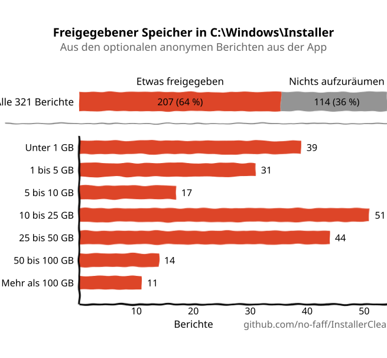
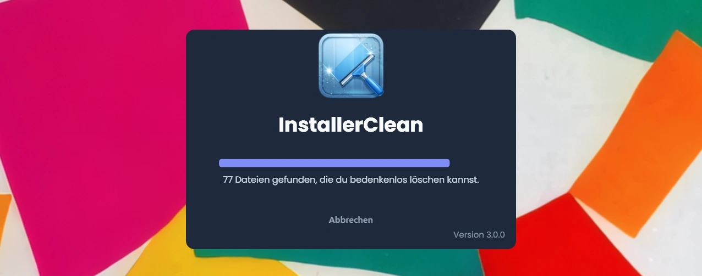
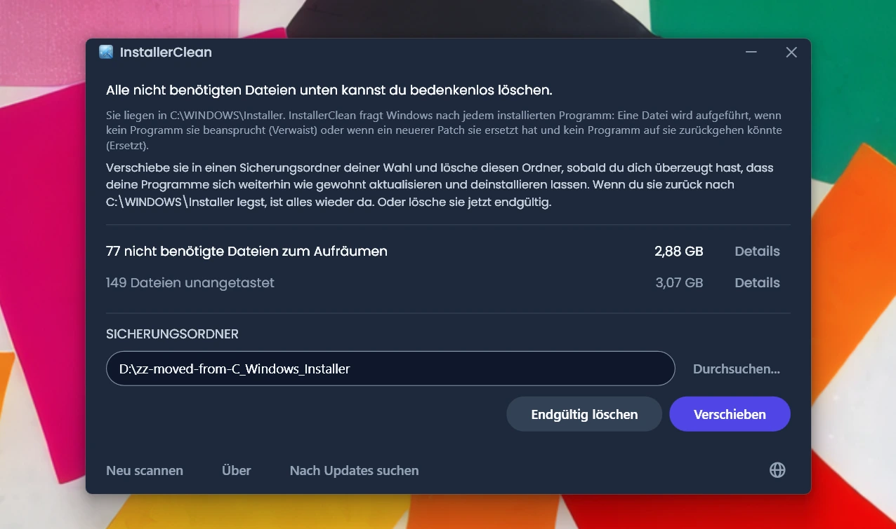
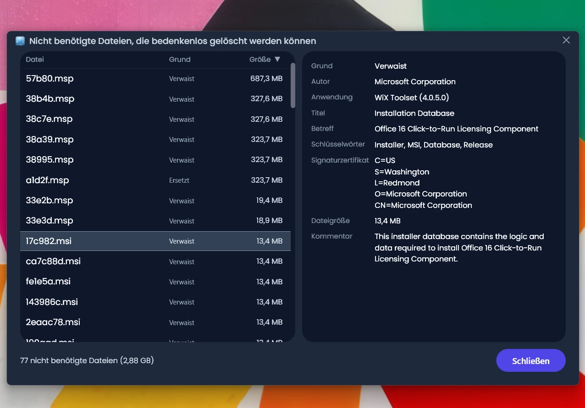
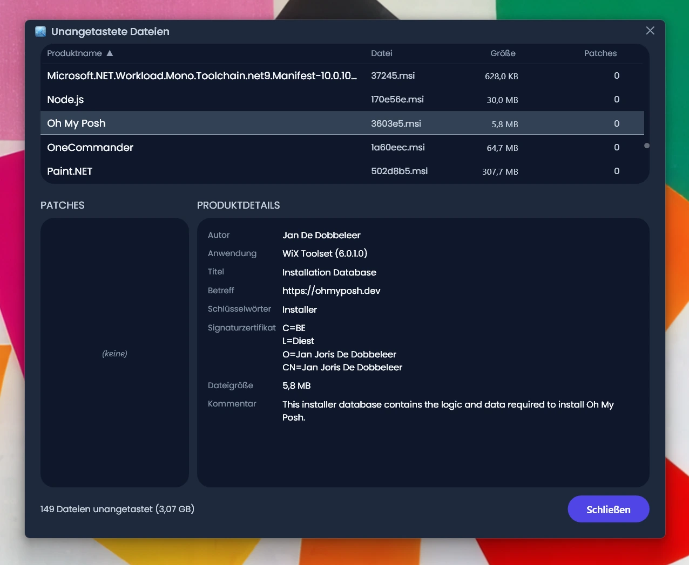
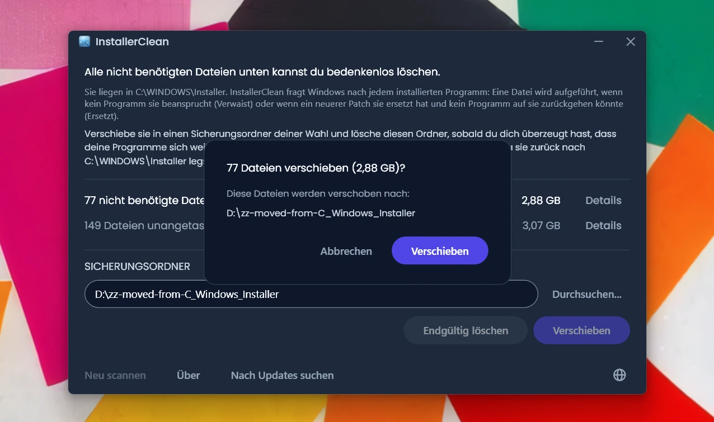
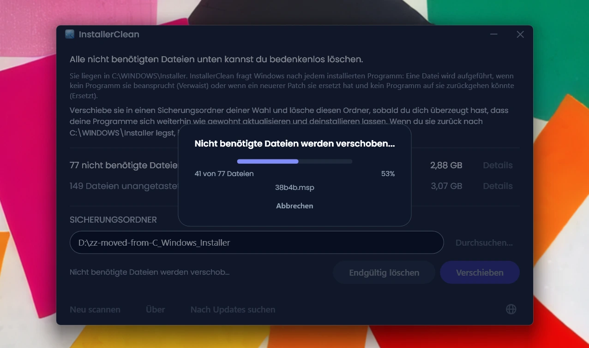
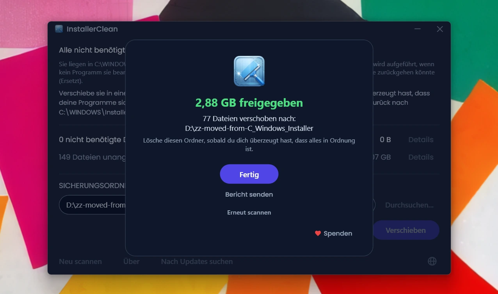

<p align="center">
  <a href="README.md">English</a> · <a href="README.zh-CN.md">简体中文</a> · <a href="README.ru.md">Русский</a> · <a href="README.es.md">Español</a> · <a href="README.ar.md">العربية</a> · <a href="README.ja.md">日本語</a> · <a href="README.pt-BR.md">Português (BR)</a> · <a href="README.pl.md">Polski</a> · <a href="README.tr.md">Türkçe</a> · <a href="README.ko.md">한국어</a> · <a href="README.fr.md">Français</a> · <a href="README.it.md">Italiano</a> · <strong>Deutsch</strong> · <a href="README.id.md">Bahasa Indonesia</a> · <a href="README.vi.md">Tiếng Việt</a> · <a href="README.uk.md">Українська</a> · <a href="README.nl.md">Nederlands</a>
</p>

<p align="center">
  
</p>

<p align="center"><em>🎶 What's my line? I'm happy <a href="https://www.youtube.com/watch?v=HM-jHhUZfFI">cleaning Windows</a></em></p>

<h1 align="center">InstallerClean</h1>

<p align="center"><strong>Ein quelloffenes Tool, um <code>C:\Windows\Installer</code> sicher aufzuräumen, den versteckten Windows-Ordner, der still und leise deinen Speicherplatz auffrisst.</strong></p>

<p align="center"><em>Alle Jubeljahre mal benutzen. Vielleicht etwas Platz schaffen. Aufgeräumt weiterziehen.</em></p>

<p align="center">
  <a href="LICENSE"></a>
  <a href="https://dotnet.microsoft.com/download/dotnet/10.0"></a>
  <a href="https://github.com/no-faff/InstallerClean/actions/workflows/ci.yml"></a>
  <a href="https://github.com/no-faff/InstallerClean/releases"></a>
  <a href="https://github.com/no-faff/InstallerClean/releases/latest"></a>
  <a href="https://github.com/no-faff/InstallerClean/releases"></a>
</p>

<a id="reports-stats"></a>

<!-- reports-stats-start chart-only (generated; do not hand-edit between these markers) -->
<p align="center">
  <picture>
    <source media="(prefers-color-scheme: dark)" srcset="docs/reports-de-dark.svg" />
    <source media="(prefers-color-scheme: light)" srcset="docs/reports-de-light.svg" />
    
  </picture>
</p>
<!-- reports-stats-end -->

- **Was:** InstallerClean tut eine Sache: Es entfernt nicht benötigte Dateien aus `C:\Windows\Installer`, einem versteckten Ordner, der sich füllt, während du Software installierst und aktualisierst. Nach einem kurzen Scan sagt es dir, ob du welche hast, zeigt Neugierigen mehr Details und lässt dich die Dateien anderswohin verschieben oder löschen, um Platz auf deinem Laufwerk C: freizugeben.
- **Warum du vielleicht hier bist:** Du hast [WinDirStat](https://github.com/windirstat/windirstat), WizTree oder TreeSize benutzt, gesehen, dass `C:\Windows\Installer` viel Platz belegt, und nicht gewusst, was darin steckt. Dann ist InstallerClean genau das Richtige. Es weiß, was in diesen Dateien mit ihren zufällig wirkenden Namen wie `9f05cba.msi` steckt, und sagt dir schnell, welche du bedenkenlos entfernen kannst.
- **Wie viel Platz:** Das Diagramm oben zeigt die Ergebnisse der optionalen Berichte, die seit v1.8.0 stetig eintrudeln. (Danke an alle, die auf die Schaltfläche geklickt haben. Ohne euch gäbe es das Diagramm oben nicht.) Bei den <!-- reports-freedpct-start -->64 %<!-- reports-freedpct-end -->, die Speicherplatz freigegeben haben, liegt der Median des Freigegebenen bei <!-- reports-median-start -->15,3 GB<!-- reports-median-end -->. <!-- reports-biggest-start -->Ein Rechner hat sich satte 462 GB zurückgeholt.<!-- reports-biggest-end --> Die übrigen <!-- reports-nothingpct-start -->36 %<!-- reports-nothingpct-end --> haben nichts freigegeben, es hängt also vom Rechner ab: Eine frische Windows-11-Installation ohne zusätzliche Software hat nichts zu entfernen. Die meisten nicht benötigten Dateien haben Rechner, die seit Jahren laufen, Rechner mit umfangreicher MSI-basierter Software (Acrobat, Office, LibreOffice, große Entwicklungswerkzeuge) und alle, die viel Software installieren und wieder deinstallieren. Wie viel es bei dir genau ist, siehst du in dem Moment, in dem du es startest.
- **Ist es sicher:** Ja. Es rührt nur Dateien in `C:\Windows\Installer` an. Es fragt Windows Installer, was noch gebraucht wird, und liest dieselben Einträge zusätzlich aus der Registrierung. Es bietet eine Datei nur dann an, wenn nichts von dem, was auf dem Rechner installiert ist, sie beansprucht oder wenn ein neuerer Patch sie ersetzt hat und kein Programm hier auf die alte zurückgehen könnte. Alles, wozu es keine klare Antwort bekommt, hält es zurück. [Mehr dazu weiter unten](#wie-es-funktioniert).
- **Nichts über dich:** Quelloffen (Apache 2.0). Kein Konto, keine Werbung, kein Tracking, keine Telemetrie, nichts, was im Hintergrund läuft. Das Einzige, was es von sich aus online tut, ist bei jedem Start auf GitHub nach einer neueren Version zu sehen, und das kannst du abschalten.
- **Holen:** [Lade die neueste Version herunter](../../releases/latest). Führe sie aus; klick dich durch [eine etwaige Warnung von Windows](#unknown-publisher) und [die Administrator-Abfrage](#admin). Verschiebe oder lösche, was es findet. Fertig.

## Inhalt

- [Der Ordner, von dem niemand spricht](#der-ordner-von-dem-niemand-spricht)
- [Die Suche nach Hilfe](#die-suche-nach-hilfe)
- [Was InstallerClean tut](#was-installerclean-tut)
- [Screenshots](#screenshots)
- [Wie es funktioniert](#wie-es-funktioniert)
- [Download](#download)
  - [Den Download selbst prüfen](#den-download-selbst-prüfen)
- [FAQ](#faq)
- [Befehlszeile](#befehlszeile)
- [Barrierefreiheit](#barrierefreiheit)
- [Richtlinie zur Codesignierung](#richtlinie-zur-codesignierung)
- [Datenschutz](#datenschutz)
- [Was es nicht tut](#was-es-nicht-tut)
- [Alternativen](#alternativen)
- [Wenn dir doch eine Datei aus C:\Windows\Installer fehlt](#recovery)
- [Voraussetzungen](#voraussetzungen)
- [Aus dem Quellcode kompilieren](#aus-dem-quellcode-kompilieren)
- [Mitwirken](#mitwirken)
- [Das Projekt unterstützen](#das-projekt-unterstützen)
- [Sternverlauf](#sternverlauf)
- [Lizenz](#lizenz)

---

## Der Ordner, von dem niemand spricht

Auf jedem Windows-PC gibt es einen versteckten Ordner namens `C:\Windows\Installer`. Jedes Mal, wenn du Software installierst, die das Windows-Installer-System nutzt, oder einen Patch für Microsoft Office, Adobe Acrobat, Visual Studio oder eine andere `.msi`-basierte Anwendung einspielst, landet eine Kopie dieses Installers oder dieser `.msp`-Patchdatei in diesem Ordner, und bleibt dort.

Wenn ein neuerer Patch einen älteren ersetzt, bleiben beide. Ebenso die Installer von Software, die du längst deinstalliert hast. Die Datenträgerbereinigung rührt nichts davon an, und die Speicheroptimierung auch nicht. DISM ist für einen ganz anderen Ordner zuständig. Mit der Zeit wächst der Ordner: 1 GB, 5 GB, 20 GB, 50 GB. Auf Rechnern mit viel MSI-basierter Software (Acrobat ist ein häufiger Übeltäter) kann er [über 100 GB](https://www.reddit.com/r/sysadmin/comments/1oxcrmh/acrobat_filling_up_the_cwindowsinstaller_folder/) erreichen.

Das sind keine temporären Dateien, die von selbst wiederkommen. Sie sind echter Ballast: alte Installer von Software, die du vor Jahren deinstalliert hast, und Patches, die mehrfach ersetzt wurden. Einmal weg, kommen sie nicht wieder.

**Wenn du eine einfache Möglichkeit suchst, unter Windows Speicherplatz freizugeben, ist dieser Ordner ein guter Anfang.** InstallerClean findet die nicht benötigten Dateien und entfernt sie sicher.

## Die Suche nach Hilfe

Wenn du jemals nach Hilfe zu diesem Ordner gesucht hast, kennst du das wahrscheinlich. Jemand mit 180 GB in `C:\Windows\Installer` fragt, wie man ihn aufräumt. Der Rat lautet, [die Datenträgerbereinigung auszuführen](https://learn.microsoft.com/en-us/answers/questions/4238108/windows-installer-folder-has-occupied-180gb). Sie wird ausprobiert und gibt 600 MB frei, nichts davon aus diesem Ordner (denn die Datenträgerbereinigung rührt `C:\Windows\Installer` nicht an). Der Thread verstummt.

> *„Alle Threads, die ich gefunden habe, empfehlen meist die gleichen Dinge, die das Problem nicht lösen, und versanden dann.“*
>
> [ksparks519, r/Windows10](https://www.reddit.com/r/Windows10/comments/1bt8c5p/anyone_ever_figure_out_giant_installer_folders/) (aus dem Englischen übersetzt)

Oder es wird geraten, den Ordner gar nicht erst anzufassen. In einem Thread bekam jemand mit einem 60 GB großen Installer-Ordner zu hören, man solle diesen Ordner [„nicht anfassen.“](https://www.reddit.com/r/techsupport/comments/1hw4suq/my_windows_installer_folder_is_like_60gb_so_i/) Auf die Rückfrage, was denn stattdessen zu tun sei, lautete die Antwort: *„Das habe ich dir gerade gesagt.“*

Der übliche Rat wirft zwei verschiedene Dinge durcheinander. Wahllos Dateien zu löschen nimmt dir die Möglichkeit, die Programme zu aktualisieren oder zu deinstallieren, zu denen diese Dateien gehörten. Nur die Dateien zu entfernen, die nichts auf dem Rechner beansprucht oder die Windows als ersetzt vermerkt hat, tut das nicht. InstallerClean tut das Zweite.

## Was InstallerClean tut

1. **Scannt** `C:\Windows\Installer` nach `.msi`- und `.msp`-Dateien
2. **Fragt** Windows Installer, was noch gebraucht wird, und liest dieselben Einträge zusätzlich aus der Registrierung
3. **Hält** alles **zurück**, was die beiden Lesungen untereinander nicht klären können
4. **Sagt dir, wie viel du freigeben kannst**, und wie viel es unangetastet lässt, mit optionalen Detailfenstern, die jede Datei auflisten
5. **Entfernt die nicht benötigten Dateien**: entweder in einen Sicherungsordner deiner Wahl verschieben oder endgültig löschen

## Screenshots

<p>
  <br>
  <em>Erster Scan. Das geht sehr schnell.</em>
  <br><br>
</p>

<p>
  <br>
  <em>Ergebnisse: wie viel entfernt werden kann und wie viel unangetastet bleibt.</em>
  <br><br>
</p>

<p>
  <br>
  <em>Details zu den Dateien, die weg können: der Grund, warum jede nicht mehr gebraucht wird, und was die Datei über sich selbst sagt.</em>
  <br><br>
</p>

<p>
  <br>
  <em>Details zu den unangetasteten Dateien: das Programm, zu dem jede laut Windows gehört, und was die Datei über sich selbst sagt.</em>
  <br><br>
</p>

<p>
  <br>
  <em>Bestätigung vor beiden Aktionen. Verschieben sichert die Dateien in einem Ordner deiner Wahl. Oder lösche sie endgültig.</em>
  <br><br>
</p>

<p>
  <br>
  <em>Das Verschieben läuft. Auf dasselbe Laufwerk geht es augenblicklich. Auf ein anderes Laufwerk dauert es umso länger, je mehr GB es sind.</em>
  <br><br>
</p>

<p>
  <br>
  <em>Fertig. Der Platz ist zurück. Die Dateien liegen gesichert, bis du dich überzeugt hast, dass alles in Ordnung ist. Dann lösche den Sicherungsordner.</em>
  <br><br>
</p>

<p>
  <br>
  <em>Nach erneutem Scan. Nichts mehr aufzuräumen.</em>
  <br><br>
</p>

<a id="is-it-safe"></a>
## Wie es funktioniert

Wenn Windows Installer ein Programm installiert, legt es eine Kopie des Installers in `C:\Windows\Installer` ab, und wenn ein Patch für ein Programm registriert wird, legt es auch davon eine Kopie ab. Mit diesen Kopien arbeitet es später, wenn es die Software repariert, aktualisiert oder deinstalliert, und deshalb bleiben sie noch lange nach der Installation dort liegen. Beide Arten von Kopien landen in dem Ordner: `.msi`-Installer und `.msp`-Patches, die ein Programm aktualisieren, das du schon hast, statt es zu ersetzen.

InstallerClean bietet eine Datei aus einem von zwei Gründen an.

**Verwaist** heißt, dass die Datei von nichts auf dem Rechner beansprucht wird. Kein installiertes Produkt und kein registrierter Patch nennt sie.

**Ersetzt** heißt, dass Windows vermerkt hat, dass ein neuerer Patch diesen Patch ersetzt hat. Windows hat die Datei trotzdem behalten. Ein Patch wird erst gelöscht, wenn jedes Programm, für das er registriert ist, deinstalliert wurde oder der Patch aus allen entfernt wurde. Von einem neueren ersetzt zu werden ist weder das eine noch das andere, also bleibt die Datei liegen. Adobe Acrobat arbeitet unter Windows so: Seine Updates kommen als Patches auf eine Basisinstallation und nicht als frische Installer, ein Rechner, der es schon eine Weile hat, kann also mehrere davon vorhalten.

InstallerClean ermittelt die beiden von entgegengesetzten Enden her, und nur beim ersten wird überhaupt in den Ordner geschaut.

**Den Ordner auflisten.** InstallerClean listet die `.msi`- und `.msp`-Dateien auf, die direkt in `C:\Windows\Installer` liegen. In die Unterordner geht es nicht hinein.

**Die Einträge zweimal lesen.** Es fragt Windows Installer nach jedem installierten Produkt und jedem registrierten Patch und nach der zwischengespeicherten Datei, die jeder davon nennt, indem es die Windows-Installer-API in `msi.dll` aufruft. Danach liest es dieselben Einträge ein zweites Mal, direkt aus der Registrierung, denn das Fragen kann zu kurz greifen, ohne das zu sagen: Windows gibt die Einträge einzeln heraus, bis es meldet, dass keine mehr kommen, und ein Durchlauf, der beim dritten von zweihundert stehen bleibt, sieht genauso aus wie einer, der bis zum Ende gekommen ist. Ein Registrierungsschlüssel gibt seine ganze Namensliste auf einmal heraus, eine zu kurze Liste kann also nicht vollständig aussehen. Jedes Produkt, das die Registrierung nennt und das beim Fragen durchgerutscht ist, wird anschließend einzeln und namentlich noch einmal bei Windows nachgefragt. Diese zweite Lesung kann eine Datei nur auf die Seite „wird noch gebraucht“ schieben. Es gibt keinen Weg, auf dem sie eine auf die Liste der zu entfernenden Dateien setzt.

**Einen Eintrag seiner Datei zuordnen.** Ein Eintrag nennt seine zwischengespeicherte Datei als Pfad, und derselbe Ordner wird darin nicht immer gleich geschrieben. Statt der Schreibweise zu trauen, fragt InstallerClean deshalb Windows, wohin jeder eingetragene Pfad wirklich zeigt, und vergleicht das mit den Dateien, die es im Ordner aufgelistet hat. Alles, was dann immer noch von nichts beansprucht wird, bekommt einen zweiten Vergleich, der überhaupt nicht über Namen läuft: Es öffnet die Datei und lässt sie sich von Windows identifizieren, damit zwei verschiedene Namen für dieselbe Datei als eine Datei erkannt werden.

**Einträge, die sich nicht zuordnen lassen.** Sagt Windows nicht, wohin ein eingetragener Pfad zeigt, oder lässt sich die Datei am Ende eines solchen Pfads nicht identifizieren, dann weiß InstallerClean nicht, um welche Datei es in diesem Eintrag ging, und jede der aufgelisteten Dateien könnte gemeint sein. Dasselbe gilt, wenn ein Programm womöglich mehr als einmal installiert wurde, denn dann lässt sich nicht sagen, welche zwischengespeicherte Datei zu welcher Installation gehört. In jedem dieser Fälle bietet es aus diesem Durchlauf nichts an, was es durch das Auflisten des Ordners gefunden hat. Ein Eintrag, der auf eine bereits verschwundene Datei zeigt, ist etwas anderes: Es ist nichts mehr übrig, was er gemeint haben könnte, also kann er sich auf keine der noch im Ordner liegenden Dateien beziehen.

**Vom anderen Ende her fragen.** Über eine verwaiste Datei entscheidet eine Abwesenheit, und eine Abwesenheit kann auch heißen, dass die App den Eintrag nicht gefunden hat. Bevor InstallerClean einen `.msi`-Installer anbietet, öffnet es die Datei, liest den Produktcode, den die Datei selbst trägt, und fragt Windows, ob dieses Produkt installiert ist. Lautet die Antwort ja, bleibt die Datei liegen, ganz gleich, was der übrige Scan ergeben hat. Diese Prüfung kann eine Datei nur von der Liste nehmen. Keine Antwort, die sie geben kann, setzt eine darauf.

**Was über einen `.msp`-Patch entscheidet.** Ein Patch wird nicht geöffnet und gefragt, zu welchem Programm er gehört. Entschieden wird es stattdessen dadurch, dass eine Patch-Registrierung ihre zwischengespeicherte Datei an zwei Stellen nennt: bei den Patches, die für jedes Produkt registriert sind, und in einer einzigen Registrierungsliste aller Patch-Registrierungen auf dem Rechner. Ein Patch wird nur dann als verwaist angeboten, wenn die Datei an keiner der beiden Stellen genannt wird.

**Worin sich ein ersetzter Patch unterscheidet.** Er durchläuft nichts von alldem, denn er ist keine unbeanspruchte Datei. Windows hat einen Eintrag zu ihm, und dieser Eintrag ist es, der sagt, dass er ersetzt wurde. Das Risiko ist ein anderes: Ein Patch kann für mehrere Programme registriert sein, und nur eines davon ist mit ihm fertig. Ein ersetzter Patch wird deshalb nur dann angeboten, wenn Windows vermerkt, dass er sich nicht deinstallieren lässt, wenn jedes Programm, für das er registriert ist, gefragt wurde, wenn keines davon ihn noch angewendet hat und wenn keines davon einen Patch hält, der sich laut Windows deinstallieren lässt. Das Letzte steht dort, weil das Zurücknehmen eines Patches bei einem Programm auf die ältere Datei zurückgreifen kann. Lässt sich irgendetwas davon nicht beantworten, bleibt die Datei liegen.

<details>
<summary>Die Windows-Installer-Aufrufe, die dabei verwendet werden</summary>

- `MsiEnumProductsEx`, um jedes installierte Produkt aufzuzählen, und noch einmal mit einem einzelnen Produktcode, um zu fragen, ob ein bestimmtes Produkt installiert ist
- `MsiEnumPatchesEx`, um registrierte Patches aufzuzählen, sowohl je Produkt als auch über den ganzen Rechner hinweg
- `MsiGetProductInfoEx`, um den Namen eines Produkts zu lesen, die zwischengespeicherte Datei, die es nennt, und ob es eine von mehreren Installationen desselben Produkts ist
- `MsiGetPatchInfoEx`, um den Zustand eines Patches zu lesen, ob Windows ihn deinstallieren kann und welche zwischengespeicherte Datei er nennt
- `MsiGetSummaryInformation` und `MsiSummaryInfoGetProperty`, um aus einer Patchdatei zu lesen, auf welche Programme sie angewendet werden kann
- `MsiOpenDatabase`, `MsiDatabaseOpenView`, `MsiViewExecute`, `MsiViewFetch` und `MsiRecordGetString`, um aus einer Installer-Datei den Produktcode zu lesen, den sie angibt

</details>

Bei alldem legt dir die App nahe, die Dateien in einen Sicherungsordner zu verschieben (auf ein anderes Laufwerk oder eine andere Partition, wenn du Platz auf C: gewinnen willst). So hast du Gelegenheit, dich zu überzeugen, dass wirklich alles in Ordnung ist, bevor du die nicht benötigten Dateien endgültig löschst.

## Download

Drei Varianten, wähle eine:

- **Portable** (`InstallerClean-3.0.0-portable.exe`): eine einzige Datei, mit der .NET-10-Laufzeit darin. Keine Installation, kein Deinstallationsprogramm: Doppelklick, und sie läuft. Heb die Datei für das nächste Mal irgendwo auf oder lösche sie, wenn du fertig bist.
- **Setup** (`InstallerClean-3.0.0-setup.exe`): ein normaler Windows-Installer mit gebündelter .NET-10-Laufzeit. Legt einen Eintrag im Startmenü an und lässt sich sauber deinstallieren. Bei den Programmen einsortiert, damit du es in sechs Monaten leicht wiederfindest oder öfter ausführst, wenn du viel Software installierst und wieder deinstallierst.
- **CLI** (`installerclean-cli.exe`): die Befehlszeilenversion allein, eine einzige Datei mit der Laufzeit darin. Keine Installation, kein Deinstallationsprogramm. Leg sie auf einem Client ab, führe einen Scan oder ein Aufräumen aus, lösche sie. Gebaut für Skripting, geplante Aufgaben und Massenbereitstellung, wenn du die Vorgänge ohne Desktop-App auf dem Client willst. Siehe [Befehlszeile](#befehlszeile) für die Argumente und Exit-Codes.

Ab 2.2.0 tragen die Dateinamen von Setup und Portable ihre Versionsnummer, sodass eine heruntergeladene Kopie immer sagt, was sie ist; das Befehlszeilenprogramm behält seinen schlichten Namen `installerclean-cli.exe`, damit geplante Aufgaben und Skripte, die darauf zeigen, über Updates hinweg weiter funktionieren.

Lade es von der [Releases-Seite](../../releases/latest) herunter und führe es aus. Es ist unsigniert, daher zeigt Windows eine Warnung „Unbekannter Herausgeber“; die [FAQ](#unknown-publisher) erklären, was du siehst und warum es unbedenklich ist.

Die App scannt beim Start automatisch. Sieh dir die Ergebnisse an und klicke dann auf **Verschieben** oder **Endgültig löschen**.

Oder installiere über [winget](https://learn.microsoft.com/windows/package-manager/winget/):

```
winget install NoFaff.InstallerClean
```

Oder installiere über [Scoop](https://scoop.sh):

```
scoop install installerclean
```

### Den Download selbst prüfen

InstallerClean ist unsigniert. Das kannst du prüfen, bevor du es ausführst:

- Der SHA-256 jedes Downloads steht auf seiner Release-Seite, sowohl in den Release-Notes als auch als eigene `.sha256`-Datei neben dem Download.
- VirusTotal: Jeder Build wird vor der Veröffentlichung gescannt, und die Release-Seite trägt das vollständige Ergebnis je Engine für jeden Download.
- Der Quellcode liegt hier auf [github.com/no-faff/InstallerClean](https://github.com/no-faff/InstallerClean). Die Dienste für Scan, Abfrage, Verschieben, Löschen, Einstellungen und ausstehenden Neustart sind durch eine automatisierte Testsuite abgedeckt, die bei jedem Push auf `main` und bei jedem Pull Request unter Windows läuft, und das CI-Badge oben auf dieser Seite meldet das Ergebnis.
- Release-Builds sind deterministisch: Derselbe Quellcode, dasselbe SDK und dieselben Publish-Optionen ergeben dieselben Bytes, und eine Version lässt sich nur taggen, wenn jede Build-Eingabe zum Quellcode an diesem Tag passt. Du kannst also den Tag auschecken, selbst bauen und die Hashes mit den veröffentlichten vergleichen. Die Release-Notes jeder Version enthalten, was du dafür brauchst: die SDK-Version, mit der gebaut wurde, und die Publish-Optionen für jeden Download, der nicht mit den Standardwerten gebaut wurde. Das Setup ist die Ausnahme: Es wird von Inno Setup kompiliert statt vom SDK und prägt sich das Baujahr ein, für seinen Hash braucht es also zusätzlich dieselbe Inno-Version und dasselbe Kalenderjahr.
- <!-- downloads-start -->72.000+<!-- downloads-end --> Downloads über GitHub, MajorGeeks und Softpedia.
- [MajorGeeks](https://www.majorgeeks.com/files/details/installerclean.html) testet jede Einreichung in einer virtuellen Maschine und listet sie nur, wenn sie die Prüfung besteht.<br><a href="https://www.majorgeeks.com/files/details/installerclean.html"></a>
- [Softpedia](https://www.softpedia.com/get/System/Hard-Disk-Utils/InstallerClean.shtml) hat es geprüft und als frei von Spyware, Adware und Viren zertifiziert.<br><a href="https://www.softpedia.com/get/System/Hard-Disk-Utils/InstallerClean.shtml"></a>

## FAQ

<a id="admin"></a>

**Warum will es Administratorrechte?** Aus zwei Gründen. `C:\Windows\Installer` ist nur für Administratoren zugänglich, das Lesen des Ordners, das Abfragen von Windows Installer und das Verschieben oder Löschen von Dateien brauchen also alle diese Rechte. Und ein Administrator darf Windows nach Programmen fragen, die unter jedem beliebigen Konto auf dem Rechner installiert sind, ein Nicht-Administrator nicht: Führst du es ohne diese Rechte aus, sagt Windows ausgerechnet in der Prüfung, die darüber entscheidet, ob eine Datei noch gebraucht wird, ein Programm sei nicht installiert, obwohl es das ist.

<a id="unknown-publisher"></a>

**Warum sagt Windows „Unbekannter Herausgeber“?** InstallerClean ist nicht codesigniert, und Windows markiert aus dem Internet heruntergeladene Dateien; deshalb zeigt SmartScreen beim ersten Start meist „Der Computer wurde durch Windows geschützt“ und führt den Herausgeber als unbekannt. Ein kostenpflichtiges Signaturzertifikat kostet jedes Jahr Geld, und ich halte die App lieber kostenlos, als für eines zu zahlen; deshalb habe ich mich bei der SignPath Foundation beworben, die Open-Source-Software umsonst signiert, und InstallerClean ist angenommen worden (siehe [Richtlinie zur Codesignierung](#richtlinie-zur-codesignierung)). Das Zertifikat ist noch nicht ausgestellt, klicke also vorerst auf **Weitere Informationen** und dann auf **Trotzdem ausführen**. Das ist unbedenklich: Der Quellcode ist öffentlich, und jede Version hat VirusTotal-Links und SHA-256-Hashes, die du vorher prüfen kannst.

**Funktioniert es unter Windows 7 oder 8?** Nein. Es braucht Windows 10 Version 1607 oder neuer, den ältesten Build, den die .NET-10-Laufzeit unterstützt. Das Setup verweigert die Installation auf allem Älteren, und die portable Variante startet nicht.

## Befehlszeile

`installerclean-cli.exe` ist eine eigene Konsolenanwendung, die neben der GUI installiert wird. Gleicher Scan, gleiches Verschieben, gleiches Löschen, kein Fenster. Sie blockiert die Eingabeaufforderung, bis sie fertig ist, ein Skript oder eine geplante Aufgabe kann also auf sie warten.

### Optionen

| Option | Was sie tut | Akzeptiert auch |
|---|---|---|
| `/s` | Nur scannen. Listet auf, was entfernt würde, mit Name, Größe und Grund für jede Datei. Ändert nichts. | |
| `/d` | Scannen und die nicht benötigten Dateien anschließend endgültig löschen. | |
| `/m` | Scannen und sie anschließend in den in der GUI gespeicherten Ordner verschieben. | |
| `/m PFAD` | Scannen und sie anschließend nach `PFAD` verschieben. Setz ihn in Anführungszeichen, wenn ein Leerzeichen darin vorkommt. | |
| `--help` | Die Verwendung ausgeben und mit `0` beenden. | `/?`, `-h` |
| `--version` | Die Version ausgeben und mit `0` beenden. | `-v` |

Bei den Optionen ist die Groß- und Kleinschreibung egal, `/S` und `/D` funktionieren also genauso wie `/s` und `/d`. Nur eine Option pro Lauf: Sie lassen sich nicht kombinieren, und nach `/s` und `/d` folgt nichts.

Ohne Argument ausgeführt gibt das Programm die Verwendung aus und beendet sich mit `1`, sodass eine geplante Aufgabe, die ihre Option verliert, sichtbar fehlschlägt, statt stillschweigend nichts zu tun. Kennt es eine Option nicht, gibt es eine Fehlerzeile aus, dann die Verwendung, und beendet sich ebenfalls mit `1`. Ein Verschiebepfad, der ein Leerzeichen enthält und nicht in Anführungszeichen steht, wird genauso zurückgewiesen, statt stillschweigend abgeschnitten zu werden, und die Meldung sagt dir, dass du ihn in Anführungszeichen setzen sollst.

### Exit-Codes

Das sind die Codes, die das Programm selbst in `--help` dokumentiert:

| Code | Bedeutung |
|---|---|
| `0` | Erfolg. Der Lauf hat getan, worum er gebeten wurde, und nichts ist fehlgeschlagen. |
| `1` | Nichts verarbeitet. Der Lauf ist fehlgeschlagen oder wurde verweigert. |
| `2` | Teilweise. Einiges verarbeitet, anderes nicht, ein Strg+C mittendrin eingeschlossen. |
| `75` | Vorübergehend. Eine zeitweilige Bedingung hat den Lauf blockiert; die ausgegebene Meldung sagt, welche. |
| `130` | Mit Strg+C abgebrochen, bevor etwas verarbeitet wurde. |

`1` deckt eine Verweigerung ebenso ab wie einen Fehlschlag, und eine Verweigerung ist kein Fehler: ein Ziel, das schlicht voll ist, oder ein Registrierungswert, den die App nicht lesen konnte, bevor sie irgendetwas angefasst hat, landen beide hier. `0` heißt, dass nichts fehlgeschlagen ist, nicht, dass nichts übrig ist: `--help`, `--version` und ein reiner Scan beenden sich alle mit `0`, ob der Scan nun achtundsechzig Dateien gefunden hat oder keine.

### Das Ereignisprotokoll

Jeder Lauf schreibt einen Ergebniseintrag ins Anwendungsprotokoll und kann einen oder mehrere Hinweise danebensetzen. Die Ereignis-ID liegt fest und ist für Maschinen gedacht, ein RMM kann also nach der Nummer filtern, ohne Text zu zerlegen:

| ID | Bedeutung |
|---|---|
| `1000` | Erfolg |
| `1002` | Teilweise |
| `2000` | Übersprungen, vorübergehend |
| `4000` | Schwerer Fehler |
| `3000` | Hinweis: Der Scan konnte nicht jedes installierte Produkt erfassen |
| `3001` | Hinweis: Dateien, die Windows erwartet, fehlen im Ordner |
| `3002` | Hinweis: Dateien wurden zurückgehalten statt angeboten |

Der 3000er-Bereich ist ein Hinweis und kein Ergebnis eines Laufs, und er zählt auch nicht als eines. Der Eintragstyp ist Informationen, wenn beim Lauf nichts schiefgegangen ist, und Warnung, wenn doch. **Das Ereignisprotokoll ist immer auf Englisch**, ganz gleich, welche Anzeigesprache der Rechner hat, ein grep auf eine bekannte Formulierung hat also ein festes Ziel. Übersetzt ist die Konsole: Sie richtet sich nach der Sprache des Rechners und schreibt Größen und Datumsangaben in den Formaten seiner Region.

### Beispiele

Eine Bestandsaufnahme in eine Datei schreiben, ohne etwas zu ändern:

```
installerclean-cli /s > audit.txt
```

Monatliches Verschieben nach `D:\InstallerBackup`, mit der CLI abgelegt in `C:\Tools`:

```
schtasks /create /tn "InstallerClean monthly" /tr "C:\Tools\installerclean-cli.exe /m D:\InstallerBackup" /sc monthly /ru SYSTEM /rl highest
```

Die Aufgabe blockiert, bis der Lauf fertig ist, und hält den Exit-Code als „Letztes Ausführungsergebnis“ fest, ein RMM kann sich also an den Codes oben orientieren.

Aus PowerShell:

```powershell
& 'C:\Tools\installerclean-cli.exe' /m D:\InstallerBackup
switch ($LASTEXITCODE) {
    0       { 'Sauber' }
    2       { 'Teilweise, Ausgabe prüfen' }
    75      { 'Blockiert, später erneut versuchen' }
    default { "Fehlgeschlagen ($LASTEXITCODE)" }
}
```

### Bevor du es in ein Skript einbaust

- **Es braucht erhöhte Rechte.** Alles daran, `/s` eingeschlossen. Startest du es aus einer Eingabeaufforderung ohne erhöhte Rechte, verweigert Windows den Start und gibt deiner Shell `740` zurück.
- **Der in der GUI gespeicherte Ordner gilt pro Benutzer.** Eine Aufgabe, die als SYSTEM oder unter einem Dienstkonto läuft, sieht ihn nicht, solche Läufe müssen also `/m PFAD` übergeben.
- **SYSTEM erreicht das Netzwerk als Computerkonto**, ein Ziel wie `\\server\freigabe` braucht also Rechte für dieses Konto.
- **`/s` blockiert nie.** Es liest nur und nimmt keine Sperre, du kannst also scannen, während die Desktop-App offen ist. `/d` und `/m` nehmen eine rechnerweite Sperre und beenden sich mit `75`, wenn ein anderer InstallerClean-Lauf sie hält.
- **Alles geht an stdout**, Fehler eingeschlossen; einen stderr gibt es nicht. Orientiere dich am Exit-Code, statt den Text zu zerlegen.
- **Verschieben verweigert, statt umzubenennen.** Liegt am Ziel schon eine Datei dieses Namens, bleibt diese Datei im Cache und wird in der Ausgabe genannt, und der Rest des Stapels wird trotzdem verschoben. Ein Lauf, bei dem jede Datei kollidiert, verarbeitet nichts und beendet sich mit `1`.
- **Den Sicherungsordner leert nichts.** `/m` legt immer nur dazu. Ausräumen musst du ihn selbst.
- **`taskkill /pid` ist kein sauberer Abbruch.** Der nächste Lauf stellt die Einzelinstanz-Sperre wieder her.
- **Der erste Lauf registriert eine Ereignisquelle**, unter `HKLM\SYSTEM\CurrentControlSet\Services\EventLog\Application\InstallerClean`. Lass sie dort: Die Ereignisanzeige liest die Beschreibung eines Eintrags über seine Quelle, sie zu entfernen macht also aus jedem Eintrag, den das Programm schon geschrieben hat, einen Fehler wegen unbekannter Quelle.

### Warum `installerclean-cli` und nicht `installerclean.exe`

`InstallerClean.exe` ist das Fenster und ignoriert Befehlszeilenargumente. `installerclean-cli.exe` ist ein echter Konsolenprozess, blockiert also die Eingabeaufforderung, bis er fertig ist, und lässt sich umleiten und durch eine Pipe schicken wie alles andere. Das Setup installiert beide. Der Portable-Download enthält nur die GUI; lade `installerclean-cli.exe` einzeln von der [Releases-Seite](../../releases/latest) herunter, wenn du die Befehlszeile ohne das Fenster willst.

## Barrierefreiheit

InstallerClean ist so gebaut, dass es vollständig mit der Tastatur und mit einem Screenreader bedienbar ist.

- **Durchgehend per Tastatur bedienbar.** Alles, was die App tut, ist über die Tastatur erreichbar, und die Spalten der Detailfenster lassen sich ebenfalls per Tastatur sortieren, hier braucht nichts eine Maus. Die Schaltflächen in der Titelleiste verhalten sich wie die von Windows und sind über Alt+Leertaste oder Alt+F4 erreichbar. Der Tastaturfokus bleibt überall sichtbar, wo er landet.
- **Sprachausgabe und Sprachzugriff.** Jedes Element ist beschriftet, und das sichtbare Wort auf einer Schaltfläche ist das Wort, das sie per Sprache auslöst. Wenn ein Verschieben oder Löschen abgeschlossen ist, wird das Ergebnis vorgelesen.
- **Zum Lesen gemacht.** Der Text erfüllt im gesamten dunklen Design den WCAG-AA-Kontrast.

Wenn dir hier etwas im Weg ist, [erstelle ein Issue](../../issues). Barrierefreiheitsprobleme sind Bugs, keine Randfälle.

## Richtlinie zur Codesignierung

InstallerClean ist von der [SignPath Foundation](https://signpath.org) für die kostenlose Codesignierung angenommen worden, einem Programm, das Open-Source-Software signiert, damit sie nicht mehr von einem unbekannten Herausgeber auf deinem Rechner landet. Das Zertifikat selbst ist noch nicht ausgestellt, die Downloads hier sind heute also unsigniert und Windows warnt vor ihnen.

Sobald es ausgestellt ist, trägt jede Version die Zeile, um die SignPath bittet: „free code signing provided by SignPath.io, certificate by SignPath Foundation“. Das Zertifikat gehört der Stiftung und nicht mir, denn ein Zertifikat muss auf eine juristische Person ausgestellt werden, und ein Ein-Personen-Projekt ist keine. Das heißt nicht, dass InstallerClean ihnen gehört oder dass sie über die Signierung hinaus etwas damit zu tun hätten.

**Rollen.** InstallerClean wird von einer einzigen Person gepflegt. Wer committet und wer reviewt, also wer Code ins Projekt bringen darf: ich. Wer genehmigt, also wer die Signierung einer Version autorisieren darf: ich.

## Datenschutz

Der optionale Bericht ist das Einzige, was überhaupt je etwas über einen Lauf sendet, und er geht nur weg, wenn du auf die Schaltfläche drückst. Er sagt, was der Scan gefunden hat, was er zurückgehalten hat und warum, ob du verschoben oder gelöscht hast, wie viel das freigegeben hat, wie lange es gedauert hat und was fehlgeschlagen ist, dazu die Version der App, die Sprache, in der du sie liest, und deine Windows-Version. Keine Dateinamen, keine Ordnernamen, kein Kontoname, nichts, was deinen Rechner identifiziert, und nichts, woran sich zwei Berichte einander zuordnen ließen. So erfahre ich, ob die App funktioniert und was sie zurückhält, auf anderen Rechnern als meinem eigenen.

Keine Werbung, keine Telemetrie. Die einzigen weiteren Verbindungen sind eine Versionsprüfung beim Start der App (eine Anfrage an GitHub, die du im Fenster Über abschalten kannst) und Schaltflächen, die zu GitHub und zu einer Seite führen, auf der du spenden kannst, wenn dir danach ist. Die vollständige [Datenschutzerklärung](PRIVACY.md) (auf Englisch).

## Was es nicht tut

- WinSxS (`C:\Windows\WinSxS`) ist ein anderer Ordner mit anderen Regeln. Dafür führe `Dism /Online /Cleanup-Image /StartComponentCleanup` in einer Eingabeaufforderung mit erhöhten Rechten aus.
- Kein Hintergrunddienst, keine geplante Aufgabe, kein automatisches Aufräumen. Die App läuft, wenn du sie startest.
- Sie verändert weder deine installierten Programme noch die Windows-Installer-Datenbank, sondern liest sie nur. Das Einzige, was sie überhaupt in die Registrierung schreibt, ist die einmalige Registrierung der Ereignisquelle, die das Befehlszeilenprogramm braucht, damit seine Läufe im Windows-Ereignisprotokoll erscheinen können.
- Von sich aus stellt sie nur eine einzige Art von Verbindung her: beim Start einen kurzen Blick auf die Releases-Seite von GitHub, ob es eine neuere Version gibt, was du im Fenster Über abschalten kannst. Alles andere passiert nur, wenn du es ihr sagst: der optionale anonyme Bericht (Zahlen zum Lauf, nichts, was dich oder deine Dateien benennt) und Links zur GitHub-Dokumentation und zu einer Spendenseite, die sich in deinem Browser öffnen, wenn du sie anklickst. Von selbst lädt sie nie etwas herunter.
- Keine Symbolleisten, keine gebündelte Software, keine Adware.

## Alternativen

Wenn du schon einmal nach diesem Ordner gesucht hast, ist das Tool, auf das du am ehesten gestoßen bist, [PatchCleaner](https://www.homedev.com.au/free/patchcleaner). Es hat diese Aufgabe als erstes Tool gemacht, es hat sie ein Jahrzehnt lang gemacht, bevor InstallerClean existierte, es läuft immer noch gut, und ohne PatchCleaner gäbe es InstallerClean nicht.

InstallerClean habe ich gemacht, weil PatchCleaner quellgeschlossen ist, seit März 2016 kein Update mehr bekommen hat und Adobe-Dateien standardmäßig ausschließt. Dieser Ausschluss hat einen guten Grund, und HomeDev hat ihn damals in den Release-Notes klar benannt:

> *„In früheren Versionen gibt es ein bekanntes Problem, bei dem PatchCleaner Patches von Adobe Acrobat Reader fälschlich als nicht benötigt einstuft. Adobe macht beim automatischen Aktualisieren etwas Proprietäres, sodass sich die automatischen Updates von Adobe Reader nicht mehr erfolgreich installieren lassen, wenn PatchCleaner die ‚verwaisten‘ Patches aus dem Installer-Verzeichnis entfernt.“*
>
> [Release-Notes von PatchCleaner, Version 1.4.0.0](https://www.homedev.com.au/free/patchcleaner) (aus dem Englischen übersetzt)

Der Filter, der damit kam, sucht das Wort „Acrobat“ in den Metadaten einer Datei und in ihrer Signatur. Auf den Rechnern, auf denen Acrobat der größte Übeltäter ist, kann darin der meiste Platz stecken:

> *„Ich habe PatchCleaner heruntergeladen, um die verwaisten `.msp`-Dateien zu löschen, aber das würde anscheinend nur 250 MB Platz freigeben. 29 GB der Dateien sind ‚durch Filter ausgeschlossen‘, PatchCleaner scheint also nicht zu helfen.“*
>
> HeatherBunny1111, [r/techsupport](https://www.reddit.com/r/techsupport/comments/1qc4tcf/how_to_delete_msp_files_safely/) (aus dem Englischen übersetzt)

Der Unterschied zwischen den beiden Tools liegt hier darin, was jedes von Windows erfragt, und nicht in einer unterschiedlichen Meinung über Adobe. Die Liste, die Windows über die *angewendeten* Patches eines Produkts führt, lässt die aus, die ein neuerer Patch ersetzt hat; ein Tool, das diese Liste liest, begegnet der Datei eines ersetzten Patches deshalb als einer Datei, die von nichts beansprucht wird, genau wie jeder anderen. Der Ausschlussfilter ist das, was die Adobe-Dateien am Namen erkennt. InstallerClean fragt Windows stattdessen nach dem Zustand eines Patches, ein ersetzter Patch kommt also schon als solcher gekennzeichnet an, und was mit ihm geschieht, entscheidet sich daran, was Windows über ihn vermerkt hat, und nicht daran, was sein Name sagt. So vergleichen sich die beiden:

| | **InstallerClean** | **PatchCleaner** |
|---|---|---|
| Zuletzt aktualisiert | 2026 (aktiv) | 3. März 2016 |
| Quellcode | Open Source (Apache 2.0) | Quellgeschlossen |
| Laufzeit | .NET 10 (eigenständig) | .NET Framework 4.5.2 + VBScript |
| API | Windows-Installer-API in `msi.dll` (im Prozess) | Windows Installer COM (außerhalb des Prozesses, über VBScript) |
| Ersetzte Patches | Aus den Patch-Einträgen von Windows erkannt | Nicht von unbeanspruchten Dateien unterschieden |
| Adobe-Dateien | Ersetzte Patches werden erkannt und gekennzeichnet | Durch einen Namensfilter ausgeschlossen, standardmäßig an |

> **Eine Anmerkung zu `Win32_Product`:** Der verbreitete, aber fehlerhafte Ansatz zum Auflisten installierter Produkte ist `Win32_Product` (WMI), der bei der Aufzählung [auf jedem Produkt MSI-Reparaturvorgänge auslöst](https://gregramsey.net/2012/02/20/win32_product-is-evil/). Sowohl InstallerClean als auch PatchCleaner vermeiden ihn. InstallerClean ruft die Windows-Installer-API in `msi.dll` auf; PatchCleaner führt ein Hilfsskript aus, das das COM-Objekt von Windows Installer nutzt. Dieses Skript heißt `WMIProducts.vbs`, was einen anderen Eindruck macht, aber die Datei ist Microsofts eigenes Beispielskript mit einer Änderung, und sie fragt Windows Installer statt WMI. Irreführend ist allein der Name.

Die Datenträgerbereinigung, die Speicheroptimierung, CCleaner und BleachBit räumen `C:\Windows\Installer` nicht auf.

<a id="recovery"></a>
## Wenn dir doch eine Datei aus `C:\Windows\Installer` fehlt

Fehlt dir tatsächlich eine Datei aus diesem Ordner, läuft das Programm, zu dem sie gehörte, weiterhin normal. Aber wenn du versuchst, dieses Programm zu aktualisieren oder zu deinstallieren, wird das wahrscheinlich fehlschlagen. Windows sucht die Datei, findet sie nicht, und der Schritt bleibt stehen.

Der ganze Zweck von InstallerClean ist es, nur Dateien zum Verschieben oder Löschen anzubieten, die *nicht* gebraucht werden, aber es erkennt durchaus, wenn eine Datei fehlt, und kennzeichnet jede gefundene mit einem Warndreieck und einem Link hierher. So versuchst du, das Programm zu reparieren:

- Finde die Versionsnummer deines installierten Programms heraus (Einstellungen, Apps, Installierte Apps)
- Lade den Installer **für genau diese Version** beim Hersteller herunter. Ein neuerer funktioniert nicht, und vorher zu deinstallieren auch nicht: Beide müssen das Installierte entfernen, bevor sie weitermachen können, und genau dieses Entfernen ist der Schritt, der die fehlende Datei braucht.
- Führe diesen Installer aus
- Das sollte die Datei wiederherstellen und deine Einstellungen unangetastet lassen. Scanne in InstallerClean erneut, und die Warnung ist weg, wenn es geklappt hat.

Microsoft garantiert allerdings nicht, dass das funktioniert. Was folgt, ist Microsofts eigene, ausführlichere Darstellung:

<details>
<summary>Microsofts ausführlichere Darstellung</summary>

*Die folgenden Microsoft-Zitate stehen im englischen Original.*

Vollständige Anleitung: [Restore missing Windows Installer cache files](https://learn.microsoft.com/en-us/troubleshoot/windows-client/application-management/missing-windows-installer-cache), KB 2667628.

*Es zeigt sich möglicherweise nicht sofort:*
> "If the installer cache is compromised, you may not immediately see problems until you take an action such as uninstalling, repairing, or updating a product."

*Die Dateien sind pro Rechner einzigartig, du kannst also keine von einem anderen PC kopieren:*
> "Missing files cannot be copied between computers because the files are unique."

*Wenn du eine Sicherung hast, die vor dem Verschwinden der Datei angelegt wurde, nennt Microsoft vier Wege, in dieser Reihenfolge:*
> - System Restore points (available only on client operating systems)
> - Restoreable system state backup
> - Failure recovery methods that can restore the full system state backup
> - Reinstallation of the operating system and all applications

*Und der Haken an allen vieren. Es geht um eine Systemsicherung und nicht um einen Ordner, in den du selbst Dateien verschoben hast: Die kannst du einfach zurückkopieren und bestätigst dabei die Administrator-Abfrage, die Windows beim Kopieren in den Ordner zeigt.*
> "To restore the missing files, a full system state restoration is required. It is not possible to replace only the missing files from a previous backup."

*Die empfohlene Wiederherstellung und ihre nüchternen Grenzen:*
> "If application files are missing from the Windows Installer Cache, ask the vendor or support team for the application about the missing files. You must follow the procedures or steps recommended by the application vendor to restore the files. In some cases, you may have to rebuild the operating system and reinstall the application to fix the problem."
>
> "Windows support engineers cannot help you recover missing application files from the Windows Installer cache."

</details>

Falls InstallerClean je der Grund dafür ist, dass eine Datei fehlt, will ich das wissen. [Erstelle ein Issue](../../issues), und ich behebe es.

## Voraussetzungen

- Windows 10 (Version 1607 / Build 14393 oder neuer, die älteste von der .NET-10-Laufzeit unterstützte) oder Windows 11
- 64-Bit-Windows. Das Setup lässt sich auf 32 Bit nicht installieren und sagt dir das.
- Administratorrechte, für das Setup und für die App (`C:\Windows\Installer` ist nur für Administratoren)

Siehe [Download](#download) für die Varianten Setup, Portable und CLI.

## Aus dem Quellcode kompilieren

```
git clone https://github.com/no-faff/InstallerClean.git
cd InstallerClean
dotnet build src/InstallerClean.sln
```

Führe die Tests aus:

```
dotnet test src/InstallerClean.Tests/
```

## Mitwirken

Einen Bug gefunden oder einen Vorschlag? [Erstelle ein Issue](../../issues) oder starte eine [Diskussion](../../discussions). Pull Requests sind willkommen. Bitte führe `dotnet test` aus, bevor du etwas einreichst.

InstallerClean gibt es in 16 Sprachen, jede davon durchgehend: die App, der Installer, die Befehlszeile und dieses README. Für die App, den Installer und die Befehlszeile haben coolvitto und RijckAlex das Japanische und das Niederländische vollständig beigesteuert, und das Italienische ist meine eigene Maschinenübersetzung, von bovirus korrigiert und freigegeben, alle drei Muttersprachler; der Rest sind meine eigenen Maschinenübersetzungen. Jedes README ist meines, in jeder Sprache. Ich habe viel Mühe hineingesteckt, perfekt werden sie nicht sein, und ich habe mich entschieden, sie so zu veröffentlichen, wie sie sind, statt sie zurückzuhalten, bis ein Muttersprachler jedes einzelne prüfen konnte. Wenn du Englisch und eine dieser Sprachen sprichst und dir etwas auffällt, das sich verbessern lässt, freue ich mich über einen Hinweis, in einem [Issue](../../issues/new?template=translation_review.md), einem Pull Request oder einer [Diskussion](../../discussions).

## Das Projekt unterstützen

Wenn InstallerClean bei dir Platz schafft und du magst, freue ich mich sehr über eine [kleine Spende](https://nofaff.netlify.app/support). In der App gibt es eine ❤️-Schaltfläche, die auf dieselbe Seite führt. Jeder Betrag wird dankbar angenommen. Vielen Dank an alle, die bisher gespendet haben. Es war eine Menge Arbeit, und ich freue mich, dass sie sich gelohnt hat.

## Sternverlauf

<picture>
  <source media="(prefers-color-scheme: dark)" srcset="docs/star-history-dark.svg" />
  <source media="(prefers-color-scheme: light)" srcset="docs/star-history-light.svg" />
  
</picture>

## Lizenz

[Apache 2.0](LICENSE)

---

🎶 [George Formby - When I'm Cleaning Windows](https://www.youtube.com/watch?v=P183Uo5Ust4). Viel Spaß!
