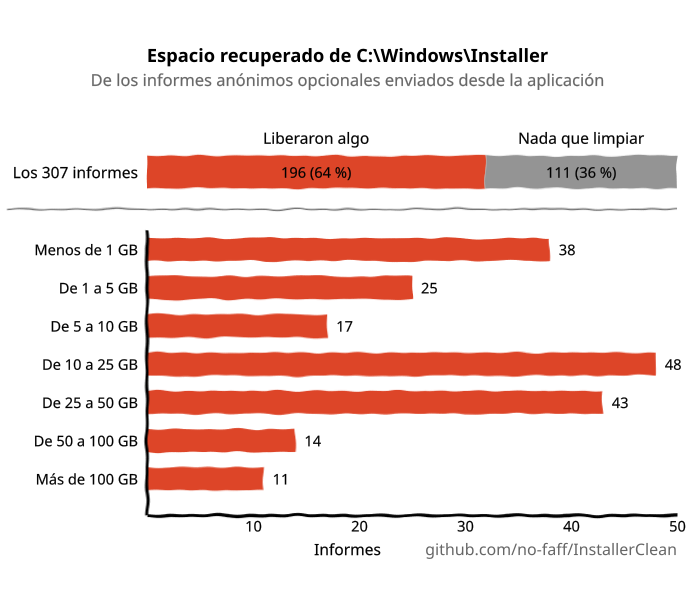
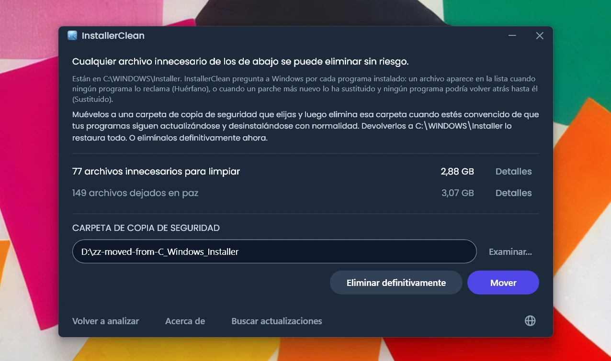
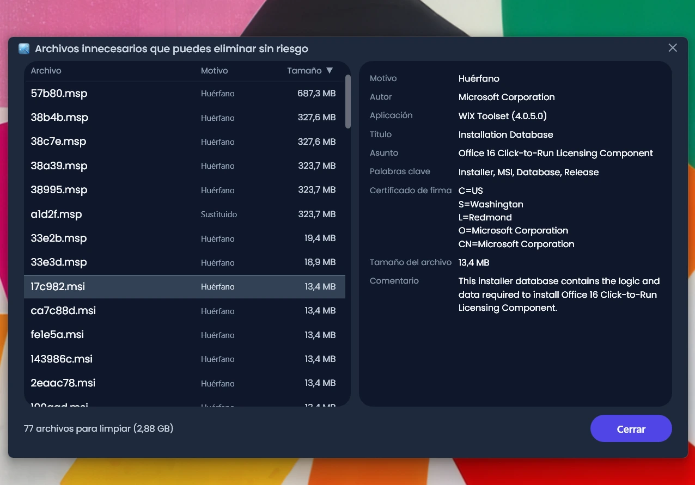
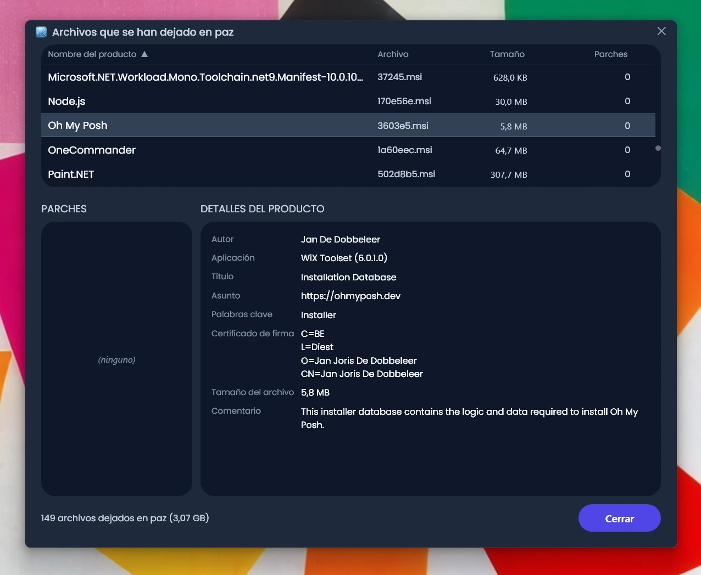
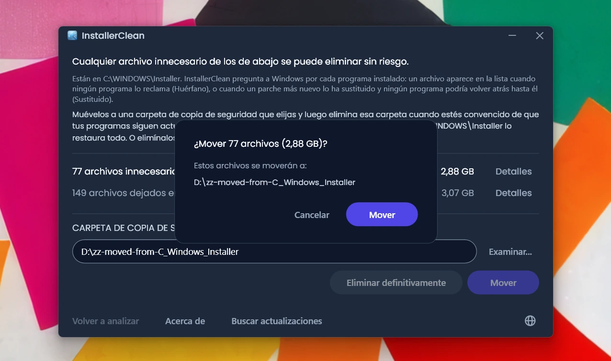
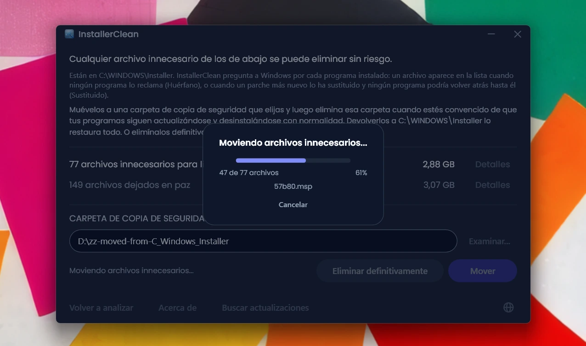
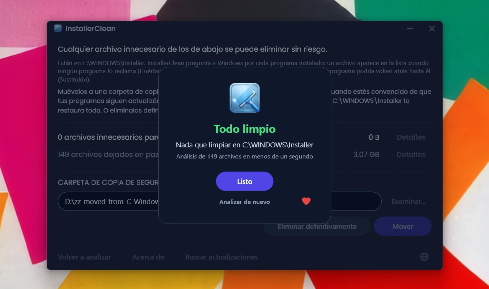
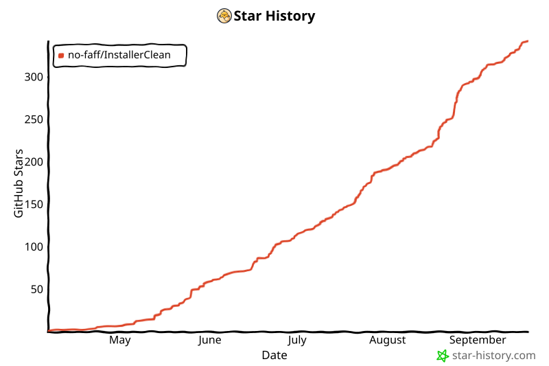

<p align="center">
  <a href="README.md">English</a> · <a href="README.zh-CN.md">简体中文</a> · <a href="README.ru.md">Русский</a> · <strong>Español</strong> · <a href="README.ar.md">العربية</a> · <a href="README.ja.md">日本語</a> · <a href="README.pt-BR.md">Português (BR)</a> · <a href="README.pl.md">Polski</a> · <a href="README.tr.md">Türkçe</a> · <a href="README.ko.md">한국어</a> · <a href="README.fr.md">Français</a> · <a href="README.it.md">Italiano</a> · <a href="README.de.md">Deutsch</a> · <a href="README.id.md">Bahasa Indonesia</a> · <a href="README.vi.md">Tiếng Việt</a> · <a href="README.uk.md">Українська</a> · <a href="README.nl.md">Nederlands</a>
</p>

<p align="center">
  
</p>

<p align="center"><em>🎶 What's my line? I'm happy <a href="https://www.youtube.com/watch?v=HM-jHhUZfFI">cleaning Windows</a></em></p>

<h1 align="center">InstallerClean</h1>

<p align="center"><strong>Una herramienta de código abierto para limpiar con seguridad <code>C:\Windows\Installer</code>, la carpeta oculta de Windows que se va comiendo tu espacio en disco sin que te des cuenta.</strong></p>

<p align="center"><em>Úsala de Pascuas a Ramos. Quizá liberes algo de espacio. Sigue adelante, todo limpio.</em></p>

<p align="center">
  <a href="LICENSE"></a>
  <a href="https://dotnet.microsoft.com/download/dotnet/10.0"></a>
  <a href="https://github.com/no-faff/InstallerClean/actions/workflows/ci.yml"></a>
  <a href="https://github.com/no-faff/InstallerClean/releases"></a>
  <a href="https://github.com/no-faff/InstallerClean/releases/latest"></a>
  <a href="https://github.com/no-faff/InstallerClean/releases"></a>
</p>

<a id="reports-stats"></a>

<!-- reports-stats-start chart-only (generated; do not hand-edit between these markers) -->
<p align="center">
  <picture>
    <source media="(prefers-color-scheme: dark)" srcset="docs/reports-es-dark.svg" />
    <source media="(prefers-color-scheme: light)" srcset="docs/reports-es-light.svg" />
    
  </picture>
</p>
<!-- reports-stats-end -->

- **Qué hace:** InstallerClean hace una sola cosa: quita los archivos innecesarios de `C:\Windows\Installer`, una carpeta oculta que se va llenando a medida que instalas y actualizas software. Tras un análisis rápido te dice si tienes alguno, muestra más detalle para los curiosos y te deja moverlos a otro sitio o eliminarlos para liberar espacio en tu unidad C:.
- **Quizá estés aquí porque:** Usaste [WinDirStat](https://github.com/windirstat/windirstat), WizTree o TreeSize, viste que `C:\Windows\Installer` ocupaba mucho espacio y no sabías qué había dentro. En ese caso, InstallerClean es justo lo que necesitas. Sabe qué contienen esos archivos con nombres que parecen aleatorios, como `9f05cba.msi`, y te dice enseguida cuáles puedes quitar sin riesgo.
- **Cuánto espacio:** El gráfico de arriba muestra los resultados de los informes opcionales que van llegando poco a poco desde la v1.8.0. (Gracias a todos los que han pulsado el botón. Sin ellos, ese gráfico no existiría.) Del <!-- reports-freedpct-start -->65 %<!-- reports-freedpct-end --> que liberó espacio, la mediana liberada es de <!-- reports-median-start -->15,8 GB<!-- reports-median-end -->. <!-- reports-biggest-start -->Un equipo recuperó nada menos que 464 GB.<!-- reports-biggest-end --> El otro <!-- reports-nothingpct-start -->35 %<!-- reports-nothingpct-end --> no liberó nada, así que depende del equipo: una instalación limpia de Windows 11 sin software adicional no tiene nada que quitar. Los que más archivos innecesarios tendrán son los equipos que llevan años en marcha, cualquiera con software pesado basado en MSI (Acrobat, Office, LibreOffice, grandes herramientas de desarrollo) y quien instala y desinstala mucho software. Verás exactamente cuánto en cuanto lo ejecutes.
- **¿Es seguro?** Sí. Lo único que InstallerClean toca son archivos de `C:\Windows\Installer`. Le pregunta a Windows Installer qué sigue haciendo falta, y además lee esos mismos datos directamente del Registro de Windows. Solo ofrece un archivo cuando nada de lo instalado en el equipo lo reclama, o cuando un parche más nuevo lo ha sustituido y ningún programa presente podría volver al antiguo. Todo aquello sobre lo que no consigue una respuesta clara, lo retiene. [Más abajo](#cómo-funciona).
- **Nada sobre ti:** Código abierto (Apache 2.0). Sin cuenta, sin anuncios, sin seguimiento, sin telemetría, nada corriendo en segundo plano. Lo único que hace en línea por su cuenta es comprobar en GitHub si hay una versión más reciente cuando lo ejecutas, y eso puedes desactivarlo.
- **Cómo obtenerlo:** [Descarga la última versión](../../releases/latest). Ejecútala; pasa [el aviso que muestre Windows](#unknown-publisher) y [la solicitud de administrador](#admin). Lo que encuentre, muévelo o elimínalo. Listo.

## Contenido

- [La carpeta de la que nadie te habla](#la-carpeta-de-la-que-nadie-te-habla)
- [La búsqueda de ayuda](#la-búsqueda-de-ayuda)
- [Qué hace InstallerClean](#qué-hace-installerclean)
- [Capturas de pantalla](#capturas-de-pantalla)
- [Cómo funciona](#cómo-funciona)
- [Descarga](#descarga)
  - [Comprobar la descarga en sí](#comprobar-la-descarga-en-sí)
- [Preguntas frecuentes](#preguntas-frecuentes)
- [Línea de comandos](#línea-de-comandos)
- [Accesibilidad](#accesibilidad)
- [Política de firma de código](#política-de-firma-de-código)
- [Privacidad](#privacidad)
- [Lo que no hace](#lo-que-no-hace)
- [Alternativas](#alternativas)
- [Si te llega a faltar un archivo de C:\Windows\Installer](#recovery)
- [Requisitos](#requisitos)
- [Compilar desde el código fuente](#compilar-desde-el-código-fuente)
- [Contribuir](#contribuir)
- [Apoyar el proyecto](#apoyar-el-proyecto)
- [Historial de estrellas](#historial-de-estrellas)
- [Licencia](#licencia)

---

## La carpeta de la que nadie te habla

En todo PC con Windows existe una carpeta oculta llamada `C:\Windows\Installer`. Cada vez que instalas software que usa el sistema Windows Installer, o aplicas un parche a Microsoft Office, Adobe Acrobat, Visual Studio o cualquier otra aplicación basada en `.msi`, una copia de ese instalador o de ese archivo de parche `.msp` va a parar a esta carpeta, y allí se queda.

Cuando un parche más nuevo sustituye a uno antiguo, los dos se quedan. Igual que los instaladores del software que desinstalaste hace mucho. El Liberador de espacio en disco no toca nada de eso, y el Sensor de almacenamiento tampoco. DISM se ocupa de otra carpeta distinta. Con el tiempo, la carpeta crece: 1 GB, 5 GB, 20 GB, 50 GB. En equipos con software pesado basado en MSI (Acrobat es un culpable frecuente), puede [superar los 100 GB](https://www.reddit.com/r/sysadmin/comments/1oxcrmh/acrobat_filling_up_the_cwindowsinstaller_folder/).

No son archivos temporales que vuelvan por su cuenta. Son peso muerto de verdad: instaladores antiguos de software que desinstalaste hace años y parches que se han sustituido varias veces. Una vez fuera, no vuelven.

**Si buscas una manera sencilla de liberar espacio en disco en Windows, esta carpeta es un buen sitio por donde empezar.** InstallerClean encuentra los archivos innecesarios y los quita sin riesgo.

## La búsqueda de ayuda

Si alguna vez has buscado ayuda con esta carpeta, seguramente ya sabes cómo va la cosa. Alguien con 180 GB en `C:\Windows\Installer` pregunta cómo limpiarla. Le [dicen que ejecute el Liberador de espacio en disco](https://learn.microsoft.com/en-us/answers/questions/4238108/windows-installer-folder-has-occupied-180gb). Lo prueba. Libera 600 MB, ninguno de esa carpeta (porque el Liberador de espacio en disco no toca `C:\Windows\Installer`). El hilo se apaga.

> *«Todos los hilos que he encontrado suelen recomendar las mismas cosas, que no resuelven el problema, y luego mueren.»*
>
> [ksparks519, r/Windows10](https://www.reddit.com/r/Windows10/comments/1bt8c5p/anyone_ever_figure_out_giant_installer_folders/) (traducido del inglés)

O bien le dicen que ni la toque. En un hilo, a alguien con una carpeta Installer de 60 GB le dijeron que [«no la toques»](https://www.reddit.com/r/techsupport/comments/1hw4suq/my_windows_installer_folder_is_like_60gb_so_i/). Cuando preguntó qué debía hacer en su lugar, la respuesta fue: *«Acabo de decírtelo.»*

El consejo habitual confunde dos cosas distintas. Borrar archivos al azar te deja sin poder actualizar ni desinstalar los programas a los que pertenecían esos archivos. Quitar solo los archivos que nada del equipo reclama, o que Windows anota como sustituidos, no. InstallerClean hace lo segundo.

## Qué hace InstallerClean

1. **Analiza** `C:\Windows\Installer` en busca de archivos `.msi` y `.msp`
2. **Le pregunta** a Windows Installer qué sigue haciendo falta, y lee además esos mismos datos directamente del Registro de Windows
3. **Retiene** todo lo que las dos lecturas no consiguen resolver entre ellas
4. **Te dice cuánto puedes liberar**, y cuánto está dejando en paz, con ventanas de detalle opcionales que enumeran cada archivo
5. **Quita los archivos innecesarios**: muévelos a una carpeta de copia de seguridad que tú elijas, o elimínalos definitivamente

## Capturas de pantalla

<p>
  <br>
  <em>Análisis inicial. Es muy rápido.</em>
  <br><br>
</p>

<p>
  <br>
  <em>Resultados: cuánto se puede quitar, cuánto se ha dejado en paz.</em>
  <br><br>
</p>

<p>
  <br>
  <em>Detalle de los archivos que pueden irse: el motivo por el que cada uno ya no hace falta, y lo que el archivo dice de sí mismo.</em>
  <br><br>
</p>

<p>
  <br>
  <em>Detalle de los archivos dejados en paz: el programa al que Windows dice que pertenece cada uno, y lo que el archivo dice de sí mismo.</em>
  <br><br>
</p>

<p>
  <br>
  <em>Una confirmación antes de cualquiera de las dos acciones. Mover hace una copia de seguridad de los archivos en la carpeta que tú elijas. O elimínalos definitivamente.</em>
  <br><br>
</p>

<p>
  <br>
  <em>El movimiento en curso. A la misma unidad es instantáneo. A otra unidad, cuantos más GB, más tarda.</em>
  <br><br>
</p>

<p>
  <br>
  <em>Listo. Espacio recuperado. Archivos a buen recaudo hasta que te convenzas de que todo va bien. Después, elimina la carpeta de copia de seguridad.</em>
  <br><br>
</p>

<p>
  <br>
  <em>Tras volver a analizar. No queda nada que limpiar.</em>
  <br><br>
</p>

<a id="is-it-safe"></a>
## Cómo funciona

Cuando Windows Installer instala un programa, guarda una copia del instalador en `C:\Windows\Installer`, y cuando se registra un parche para un programa, guarda también una copia de ese parche. Esas copias son las que usa después para reparar, actualizar o desinstalar el software, y por eso siguen ahí mucho después de que la instalación haya terminado. Los dos tipos de copia acaban en la carpeta: instaladores `.msi`; y parches `.msp`, que actualizan un programa que ya tienes en lugar de sustituirlo.

InstallerClean ofrece un archivo por uno de dos motivos.

**Huérfano** significa que el archivo no lo reclama nada de lo que hay en el equipo. No lo nombra ningún producto instalado ni ningún parche registrado.

**Sustituido** significa que Windows ha anotado que un parche más nuevo sustituyó a este, y ha conservado el archivo de todas formas. Un parche se borra solo cuando se han desinstalado todos los programas a los que está registrado, o cuando se quita de todos ellos. Que llegue otro más nuevo no es ninguna de esas dos cosas, así que el archivo se queda. Adobe Acrobat funciona así en Windows: sus actualizaciones llegan como parches sobre una instalación base en lugar de como instaladores nuevos, de modo que un equipo que lleve un tiempo con él puede estar guardando varios.

InstallerClean resuelve los dos en direcciones opuestas, y solo en el primero se llega a mirar dentro de la carpeta.

**Enumerar la carpeta.** InstallerClean enumera los archivos `.msi` y `.msp` que están directamente en `C:\Windows\Installer`. No entra en las subcarpetas.

**Leer los registros, dos veces.** InstallerClean le pide a Windows Installer todos los productos instalados y todos los parches registrados, y los archivos en caché que cada uno nombra, llamando a la API de Windows Installer de `msi.dll`. Luego lee esos mismos datos de una segunda forma, directamente del Registro, porque la petición puede quedarse corta sin decirlo: Windows va entregando los registros de uno en uno hasta que dice que ya no quedan más, y una lectura que se detiene en el tercero de doscientos tiene exactamente el mismo aspecto que otra que llegó al final. Una clave del Registro entrega su lista entera de nombres de una vez, así que una lista corta no puede parecer completa. Después, cada producto que el Registro nombra y que la petición se había dejado se vuelve a consultar a Windows por su nombre, de uno en uno. Esta segunda lectura solo puede pasar un archivo al lado de los que «siguen haciendo falta». No hay ninguna vía por la que ponga uno en la lista de archivos que quitar.

**Emparejar un registro con su archivo.** Un registro nombra su archivo en caché como una ruta, y esa misma carpeta no siempre aparece escrita igual de un registro a otro. Así que, en lugar de fiarse de cómo esté escrita, InstallerClean le pregunta a Windows adónde apunta realmente cada ruta anotada, y lo compara con los archivos que enumeró en la carpeta. Todo lo que siga sin que nada lo reclame recibe una segunda comparación que no pasa por los nombres en absoluto: abre el archivo y le pide a Windows que lo identifique, de modo que dos nombres distintos del mismo archivo se reconozcan como un solo archivo.

**Registros que no se pueden emparejar.** Si Windows no dice adónde apunta una ruta anotada, o el archivo que hay al final de una no se puede identificar, InstallerClean no sabe de qué archivo hablaba ese registro, y cualquiera de los que enumeró podría ser el suyo. Lo mismo ocurre si un programa puede haberse instalado más de una vez, porque entonces no puede saber qué archivo en caché pertenece a qué copia. En cualquiera de esos casos no ofrece nada de lo que encontró al enumerar la carpeta esa vez. Un registro que apunta a un archivo que ya no está es otra cosa: no queda nada de lo que pudiera hablar, así que no puede referirse a ninguno de los archivos que siguen en la carpeta.

**Preguntar desde el otro extremo.** Un huérfano se decide por una ausencia, y una ausencia también puede significar que la aplicación no encontró el registro. Así que, antes de ofrecer un instalador `.msi`, InstallerClean abre el archivo, lee el código de producto que el propio archivo lleva dentro y le pregunta a Windows si ese producto está instalado. Si lo está, el archivo se queda, sea lo que sea lo que haya encontrado el resto del análisis. Esa comprobación solo puede quitar un archivo de la lista. Nada de lo que pueda responder pone uno en ella.

**Qué decide un parche `.msp`.** A un parche no se le abre para preguntarle a qué programa pertenece. Lo que lo resuelve en su lugar es que el registro de un parche nombra su archivo en caché en dos sitios: los parches registrados para cada producto; y una única lista, en el Registro, de todos los registros de parches del equipo. Un parche se ofrece como huérfano solo cuando no lo nombra ninguno de los dos.

**En qué se diferencia un parche sustituido.** No pasa por nada de lo anterior, porque no es un archivo sin reclamar. Windows tiene un registro de él, y ese registro es justo lo que dice que ha sido sustituido. El riesgo es otro: un parche puede estar registrado para varios programas, y solo uno de ellos ha terminado con él. Así que un parche sustituido se ofrece solo cuando Windows anota que no se puede desinstalar, se ha preguntado por todos los programas para los que está registrado, ninguno de ellos lo tiene ya aplicado y ninguno tiene ningún parche que Windows diga que se puede desinstalar. Esto último está ahí porque deshacer un parche en un programa puede echar mano del archivo antiguo. Si algo de eso no se puede responder, el archivo se queda.

<details>
<summary>Las llamadas a Windows Installer que usa</summary>

- `MsiEnumProductsEx` para enumerar todos los productos instalados, y otra vez con un solo código de producto para preguntar si un producto concreto está instalado
- `MsiEnumPatchesEx` para enumerar los parches registrados, tanto por producto como en todo el equipo
- `MsiGetProductInfoEx` para leer el nombre de un producto, el archivo en caché que ese producto nombra y si es una de varias instalaciones del mismo producto
- `MsiGetPatchInfoEx` para leer el estado de un parche, si Windows puede desinstalarlo y el archivo en caché que ese parche nombra
- `MsiGetSummaryInformation` y `MsiSummaryInfoGetProperty` para leer de un archivo de parche a qué programas se puede aplicar
- `MsiOpenDatabase`, `MsiDatabaseOpenView`, `MsiViewExecute`, `MsiViewFetch` y `MsiRecordGetString` para leer de un archivo de instalación el código de producto que ese archivo declara

</details>

Dicho todo esto, la aplicación te anima a mover los archivos a una carpeta de copia de seguridad (en otra unidad o partición si lo que buscas es liberar espacio en C). Así tienes ocasión de convencerte de que de verdad todo va bien antes de eliminar definitivamente los archivos innecesarios.

## Descarga

Tres variantes, elige una:

- **Portable** (`InstallerClean-3.0.0-portable.exe`): un solo archivo, con el runtime de .NET 10 dentro. Sin instalación, sin desinstalador: haz doble clic y funciona. Guárdalo en algún sitio para la próxima vez, o bórralo cuando termines.
- **Setup** (`InstallerClean-3.0.0-setup.exe`): un instalador clásico de Windows con el runtime de .NET 10 incluido. Añade una entrada al menú Inicio y se desinstala sin dejar rastro. Bien guardado en Programas, fácil de encontrar dentro de seis meses, o de ejecutar más a menudo si instalas y desinstalas mucho software.
- **CLI** (`installerclean-cli.exe`): la versión de línea de comandos por sí sola, un solo archivo con el runtime dentro. Sin instalación, sin desinstalador. Déjalo en un equipo cliente, ejecuta un análisis o una limpieza, y bórralo. Pensado para scripting, tareas programadas y despliegue masivo, cuando quieres las operaciones sin una aplicación de escritorio en el cliente. Consulta [Línea de comandos](#línea-de-comandos) para los argumentos y los códigos de salida.

Desde la 2.2.0, los nombres de archivo del instalador y de la versión portátil llevan su número de versión, así que una copia descargada siempre dice lo que es; la versión de línea de comandos conserva su nombre llano `installerclean-cli.exe` para que las tareas programadas y los scripts que apuntan a ella sigan funcionando entre actualizaciones.

Descárgala desde la [página de versiones](../../releases/latest) y ejecútala. No está firmada, así que Windows muestra un aviso de «editor desconocido»; las [preguntas frecuentes](#unknown-publisher) explican lo que verás y por qué es seguro.

La aplicación analiza automáticamente al arrancar. Revisa los resultados y pulsa **Mover** o **Eliminar definitivamente**.

O instálalo con [winget](https://learn.microsoft.com/windows/package-manager/winget/):

```
winget install NoFaff.InstallerClean
```

O instálalo con [Scoop](https://scoop.sh):

```
scoop install installerclean
```

### Comprobar la descarga en sí

InstallerClean no está firmado. Esto es lo que puedes comprobar antes de ejecutarlo:

- El SHA-256 de cada descarga está en su página de versión.
- VirusTotal: cada build se analiza antes de salir, y la página de la versión lleva el resultado completo por motor de cada descarga.
- El código fuente está aquí, en [github.com/no-faff/InstallerClean](https://github.com/no-faff/InstallerClean). Los servicios de análisis, consulta, movimiento, eliminación, configuración y comprobación de reinicio pendiente están cubiertos por una batería de pruebas automatizadas que se ejecuta en Windows en cada push a `main` y en cada pull request, y la insignia de CI de arriba informa del resultado.
- Las versiones publicadas se compilan de forma determinista: el mismo código fuente, el mismo SDK y los mismos parámetros de publicación producen los mismos bytes, y una versión no se puede etiquetar si algún elemento de la compilación no coincide con el código fuente de esa etiqueta. Así que puedes hacer checkout de la etiqueta, compilarla tú mismo y comparar los hashes con los publicados. Las notas de cada versión llevan lo que hace falta para eso: la versión del SDK con la que se compiló, y los parámetros de publicación de cualquier descarga que no se compilara con los valores por defecto. El instalador es la excepción: lo compila Inno Setup y no el SDK, y estampa el año de compilación dentro de sí mismo, así que reproducir su hash necesita además la misma versión de Inno y el mismo año natural.
- <!-- downloads-start -->81.000+<!-- downloads-end --> descargas entre GitHub, MajorGeeks y Softpedia.
- [MajorGeeks](https://www.majorgeeks.com/files/details/installerclean.html) prueba cada envío en una máquina virtual y solo lo publica si pasa su revisión.<br><a href="https://www.majorgeeks.com/files/details/installerclean.html"></a>
- [Softpedia](https://www.softpedia.com/get/System/Hard-Disk-Utils/InstallerClean.shtml) lo revisó y lo certificó libre de spyware, adware y virus.<br><a href="https://www.softpedia.com/get/System/Hard-Disk-Utils/InstallerClean.shtml"></a>

## Preguntas frecuentes

<a id="admin"></a>

**¿Por qué pide Administrador?** Por dos razones. `C:\Windows\Installer` está restringido a los administradores, así que leerlo, consultar a Windows Installer y mover o eliminar archivos lo necesitan. Y un administrador puede preguntarle a Windows por los programas instalados bajo cualquier cuenta del equipo, cosa que no puede hacer quien no lo sea: sin permisos de administrador, Windows diría que un programa no está instalado cuando sí lo está, justo dentro de la comprobación que decide si un archivo sigue haciendo falta.

<a id="unknown-publisher"></a>

**¿Por qué dice Windows «Editor desconocido»?** InstallerClean no está firmado digitalmente y Windows marca los archivos descargados de internet, así que en la primera ejecución SmartScreen suele mostrar «Windows protegió su PC» con el editor como desconocido. Un certificado de firma de pago cuesta dinero todos los años y prefiero mantener la aplicación gratuita antes que pagar por uno, así que solicité el de la SignPath Foundation, que firma software de código abierto sin cobrar nada, e InstallerClean ha sido aceptado (consulta [Política de firma de código](#política-de-firma-de-código)). El certificado todavía no se ha emitido, así que, por ahora, pulsa **Más información** y luego **Ejecutar de todas formas**. Hacerlo es seguro: el código fuente es público, y cada versión lleva enlaces a VirusTotal y hashes SHA-256 que puedes comprobar antes.

**¿Funciona en Windows 7 u 8?** No. Necesita Windows 10 versión 1607 o posterior, que es la compilación más antigua que admite el runtime de .NET 10. El instalador se niega a instalarse en algo anterior y la versión portátil no arranca.

## Línea de comandos

`installerclean-cli.exe` es un ejecutable de consola aparte, que se instala junto a la interfaz gráfica. El mismo análisis, el mismo movimiento, la misma eliminación, sin ventana. Bloquea el símbolo del sistema hasta que termina, así que un script o una tarea programada pueden esperar a que acabe.

### Opciones

| Opción | Qué hace | También acepta |
|---|---|---|
| `/s` | Solo analiza. Enumera lo que quitaría, con el nombre, el tamaño y el motivo de cada archivo. No cambia nada. | |
| `/d` | Analiza y luego elimina definitivamente los archivos innecesarios. | |
| `/m` | Analiza y luego los mueve a la carpeta guardada en la interfaz gráfica. | |
| `/m RUTA` | Analiza y luego los mueve a `RUTA`. Ponla entre comillas si tiene algún espacio. | |
| `--help` | Muestra el uso y sale con `0`. | `/?`, `-h` |
| `--version` | Muestra la versión y sale con `0`. | `-v` |

Las opciones no distinguen mayúsculas de minúsculas, así que `/S` y `/D` funcionan igual que `/s` y `/d`. Una sola opción por ejecución: no se pueden combinar, y `/s` y `/d` no llevan nada detrás.

Ejecutado sin ningún argumento, muestra el uso y sale con `1`, de modo que una tarea programada que pierda su opción falla de forma visible en lugar de no hacer nada en silencio. Una opción que no reconoce imprime una línea de error, luego el uso, y también sale con `1`. Una ruta de destino con un espacio y sin comillas se rechaza de la misma forma, en lugar de truncarse en silencio, y el mensaje te dice que la pongas entre comillas.

### Códigos de salida

Estos son los códigos que la propia herramienta documenta en `--help`:

| Código | Significa |
|---|---|
| `0` | Éxito. La ejecución hizo lo que se le pidió y nada falló. |
| `1` | Nada procesado. La ejecución falló, o se rechazó. |
| `2` | Parcial. Una parte procesada y otra no, incluido un Ctrl+C a mitad de camino. |
| `75` | Transitorio. Una condición temporal bloqueó la ejecución; el mensaje que se imprime dice cuál. |
| `130` | Cancelado con Ctrl+C antes de procesar nada. |

`1` cubre tanto un rechazo como un fallo, y un rechazo no es un defecto: un destino que simplemente está lleno, o un valor del Registro que la aplicación no pudo leer antes de tocar nada, acaban los dos aquí. `0` significa que nada falló, no que no quede nada: `--help`, `--version` y una ejecución de solo análisis salen los tres con `0`, tanto si el análisis encontró sesenta y ocho archivos como si no encontró ninguno.

### El registro de eventos

Cada ejecución escribe una entrada de resultado en el registro de aplicaciones, y puede añadir uno o más avisos junto a ella. El identificador de evento es un contrato estable para las máquinas, así que un RMM puede filtrar por el número sin analizar ningún texto:

| ID | Significa |
|---|---|
| `1000` | Éxito |
| `1002` | Parcial |
| `2000` | Omitido, transitorio |
| `4000` | Fallo grave |
| `3000` | Aviso: el análisis no pudo abarcar todos los productos instalados |
| `3001` | Aviso: faltan en la carpeta archivos que Windows espera encontrar |
| `3002` | Aviso: se retuvieron archivos en lugar de ofrecerlos |

La banda `3000` es un aviso y no un resultado, y no cuenta como resultado de la ejecución. El tipo de entrada es Información cuando nada salió mal en la ejecución, y Advertencia cuando sí. **El registro de eventos siempre está en inglés**, sea cual sea el idioma en el que esté el equipo, para que una búsqueda de una expresión conocida tenga un objetivo estable. Lo que sí está traducido es la consola: sigue el idioma del propio equipo, y da los tamaños y las fechas según su región.

### Recetas

Guardar una auditoría en un archivo, sin cambiar nada:

```
installerclean-cli /s > audit.txt
```

Movimiento mensual a `D:\InstallerBackup`, con la CLI dejada en `C:\Tools`:

```
schtasks /create /tn "InstallerClean monthly" /tr "C:\Tools\installerclean-cli.exe /m D:\InstallerBackup" /sc monthly /ru SYSTEM /rl highest
```

La tarea espera a que la ejecución termine y anota el código de salida como su Resultado de la última ejecución, así que un RMM puede guiarse por los códigos de arriba.

Desde PowerShell:

```powershell
& 'C:\Tools\installerclean-cli.exe' /m D:\InstallerBackup
switch ($LASTEXITCODE) {
    0       { 'Limpio' }
    2       { 'Parcial, revisa la salida' }
    75      { 'Bloqueado, inténtalo más tarde' }
    default { "Fallo ($LASTEXITCODE)" }
}
```

### Antes de meterlo en un script

- **Necesita elevación.** Todos los modos, `/s` incluido. Desde un símbolo del sistema sin elevar, Windows se niega a iniciarlo y le devuelve `740` a tu shell.
- **La carpeta guardada en la interfaz gráfica es por usuario.** Una tarea que se ejecute como SYSTEM o con una cuenta de servicio no la verá, así que esas ejecuciones tienen que pasar `/m RUTA`.
- **SYSTEM llega a la red como la cuenta del equipo**, así que un destino `\\servidor\recurso` necesita que se le den derechos a esa cuenta.
- **`/s` nunca bloquea.** Es de solo lectura y no toma ningún bloqueo, así que puedes analizar con la aplicación de escritorio abierta. `/d` y `/m` toman un bloqueo de todo el equipo y salen con `75` si otra ejecución de InstallerClean lo tiene.
- **Todo va a stdout**, los errores incluidos; no hay stderr. Guíate por el código de salida en lugar de analizar el texto.
- **Mover rechaza en lugar de renombrar.** Si el destino ya tiene un archivo con ese nombre, ese archivo se queda en la caché y se nombra en la salida, y el resto del lote se mueve igualmente. Una ejecución en la que todos los archivos chocan no procesa nada y sale con `1`.
- **Nada vacía la carpeta de copia de seguridad.** `/m` solo añade. Vaciarla te toca a ti.
- **`taskkill /pid` no es una cancelación limpia.** La siguiente ejecución recupera el bloqueo de instancia única.
- **La primera ejecución da de alta un origen del registro de eventos**, en `HKLM\SYSTEM\CurrentControlSet\Services\EventLog\Application\InstallerClean`. Déjalo ahí: el Visor de eventos lee la descripción de una entrada a través de su origen, así que quitarlo convierte cada entrada que la herramienta ya ha escrito en un error de origen desconocido.

### Por qué `installerclean-cli` y no `installerclean.exe`

`InstallerClean.exe` es la ventana y no hace caso de los argumentos de línea de comandos. `installerclean-cli.exe` es un proceso de consola de verdad, así que bloquea el símbolo del sistema hasta que termina, y se redirige y se canaliza como cualquier otra cosa. El instalador instala los dos. La descarga portátil es solo la interfaz gráfica; descarga `installerclean-cli.exe` por separado desde la [página de versiones](../../releases/latest) si quieres la línea de comandos sin la ventana.

## Accesibilidad

InstallerClean está hecho para ser plenamente utilizable con el teclado y con un lector de pantalla.

- **Manejable por completo con el teclado.** Todo lo que hace la aplicación se alcanza desde el teclado, y las columnas de las ventanas de detalle también se ordenan desde el teclado, así que aquí nada necesita ratón. Los botones de la barra de título se comportan como los de Windows y se alcanzan con Alt+Espacio o Alt+F4. El foco del teclado permanece visible dondequiera que esté.
- **Narrador y Acceso por voz.** Cada control está etiquetado, y la palabra visible en un botón es la palabra que lo activa por voz. Cuando termina un Mover o un Eliminar, el resultado se lee en voz alta.
- **Hecho para leerse.** El texto cumple el contraste WCAG AA en todo el tema oscuro.

Si algo de aquí te estorba, [abre un issue](../../issues). Los problemas de accesibilidad son bugs, no casos límite.

## Política de firma de código

InstallerClean ha sido aceptado por la [SignPath Foundation](https://signpath.org) para la firma de código gratuita, un programa que firma software de código abierto para que deje de llegar a tu equipo de un editor desconocido. El certificado en sí todavía no se ha emitido, así que hoy las descargas de aquí no están firmadas y Windows avisará de ello.

Cuando se emita, cada versión llevará la línea que pide SignPath: «free code signing provided by SignPath.io, certificate by SignPath Foundation». El certificado pertenece a la fundación y no a mí, porque un certificado tiene que emitirse a nombre de una entidad jurídica y un proyecto de una sola persona no lo es. Eso no significa que InstallerClean sea suyo, ni que participen en él más allá de la firma.

**Roles.** InstallerClean tiene un solo responsable. Quienes hacen commits y quienes revisan, es decir, quién puede meter código en el proyecto: yo. Quienes aprueban, es decir, quién puede autorizar que se firme una versión: yo.

## Privacidad

El informe opcional es lo único que llega a enviar algo sobre una ejecución, y solo sale cuando pulsas el botón. Dice qué encontró el análisis, qué retuvo y por qué, si moviste o eliminaste, cuánto espacio liberó eso, cuánto tardó y lo que haya fallado, junto con la versión de la aplicación, el idioma en el que la lees y tu versión de Windows. Ningún nombre de archivo, ningún nombre de carpeta, ningún nombre de cuenta, nada que identifique tu equipo y nada que permita relacionar dos informes entre sí. Es así como me entero de si la aplicación funciona, y de qué está reteniendo, en equipos que no son el mío.

Sin anuncios, sin telemetría. Las únicas otras conexiones son una comprobación de versión al arrancar la aplicación (una petición a GitHub que puedes desactivar en la ventana Acerca de) y los botones que enlazan a GitHub y a una página donde puedes donar si te sientes generoso. La [política de privacidad](PRIVACY.md) completa (en inglés).

## Lo que no hace

- WinSxS (`C:\Windows\WinSxS`) es una carpeta distinta con reglas distintas. Para esa, ejecuta `Dism /Online /Cleanup-Image /StartComponentCleanup` desde un símbolo del sistema elevado.
- Sin servicio en segundo plano, sin tarea programada, sin limpieza automática. La aplicación se ejecuta cuando tú la inicias.
- No cambia tus programas instalados ni la base de datos de Windows Installer, solo los lee. Lo único que llega a escribir en el Registro es el alta única del origen de eventos que la herramienta de línea de comandos necesita para que sus ejecuciones aparezcan en el registro de eventos de Windows.
- Hace un solo tipo de conexión por su cuenta: una comprobación rápida de la página de versiones de GitHub para ver si hay una más reciente cuando lo ejecutas, que puedes desactivar en Acerca de. Todo lo demás solo ocurre cuando se lo pides: el informe anónimo opcional (números sobre la ejecución, nada que te nombre a ti ni a tus archivos) y enlaces a la documentación de GitHub y a una página de donaciones, que se abren en tu navegador si los pulsas. Nunca descarga nada por su cuenta.
- Sin barras de herramientas, sin software incluido, sin adware.

## Alternativas

Si ya has buscado esta carpeta antes, la herramienta que con más probabilidad habrás encontrado es [PatchCleaner](https://www.homedev.com.au/free/patchcleaner). Hizo este trabajo primero, lo hizo durante una década antes de que InstallerClean existiera, sigue funcionando bien, e InstallerClean no existiría sin él.

Hice InstallerClean porque PatchCleaner es de código cerrado, no se actualiza desde marzo de 2016 y excluye los archivos de Adobe por defecto. Esa exclusión está ahí por un buen motivo, y HomeDev lo dijo claramente en las notas de la versión de entonces:

> *«Hay un problema conocido en versiones anteriores por el que PatchCleaner identifica erróneamente los parches de Adobe Acrobat Reader como no necesarios. Adobe hace algo propio en su actualización automática, de modo que, si PatchCleaner quita los parches "huérfanos" del directorio del instalador, las actualizaciones automáticas de Adobe Reader ya no se instalan correctamente.»*
>
> [Notas de la versión 1.4.0.0 de PatchCleaner](https://www.homedev.com.au/free/patchcleaner) (traducido del inglés)

El filtro que entró con esa versión busca la palabra «Acrobat» en los metadatos de un archivo y en su firma. En los equipos donde Acrobat es el mayor responsable, ahí puede estar la mayor parte del espacio:

> *«He descargado PatchCleaner para borrar los archivos `.msp` huérfanos, pero al parecer esto solo liberaría 250 MB de espacio. 29 GB de los archivos están "excluidos por filtros", así que PatchCleaner no parece servir de ayuda.»*
>
> HeatherBunny1111, [r/techsupport](https://www.reddit.com/r/techsupport/comments/1qc4tcf/how_to_delete_msp_files_safely/) (traducido del inglés)

La diferencia entre las dos herramientas está en lo que cada una le pide a Windows, no en una diferencia de opinión sobre Adobe. La lista que Windows lleva de los parches *aplicados* de un producto deja fuera los que un parche más nuevo ha sustituido, así que una herramienta que lea esa lista se encuentra el archivo de un parche sustituido como un archivo sin reclamar, igual que cualquier otro. El filtro de exclusión es lo que atrapa los de Adobe por el nombre. InstallerClean le pregunta a Windows por el estado de los parches en su lugar, de modo que un parche sustituido llega etiquetado como tal, y lo que se hace con él se decide por lo que Windows anota sobre él y no por lo que diga su nombre. Así es como se comparan las dos:

| | **InstallerClean** | **PatchCleaner** |
|---|---|---|
| Última actualización | 2026 (activo) | 3 de marzo de 2016 |
| Código fuente | Código abierto (Apache 2.0) | Código cerrado |
| Runtime | .NET 10 (autónomo) | .NET Framework 4.5.2 + VBScript |
| API | API de Windows Installer de `msi.dll` (en proceso) | COM de Windows Installer (fuera de proceso, mediante VBScript) |
| Parches sustituidos | Se identifican a partir de los registros de parches de Windows | No se distinguen de los archivos sin reclamar |
| Archivos de Adobe | Los parches sustituidos se detectan y se etiquetan | Excluidos por un filtro de nombre, activado por defecto |

> **Nota sobre `Win32_Product`:** El enfoque común pero defectuoso para enumerar los productos instalados es `Win32_Product` (WMI), que [desencadena operaciones de reparación de MSI](https://gregramsey.net/2012/02/20/win32_product-is-evil/) en cada producto durante la enumeración. Tanto InstallerClean como PatchCleaner lo evitan. InstallerClean llama a la API de Windows Installer de `msi.dll`; PatchCleaner ejecuta un script auxiliar que usa el objeto COM de Windows Installer. Ese script se llama `WMIProducts.vbs`, lo que hace pensar lo contrario, pero el archivo es el script de ejemplo de la propia Microsoft con una modificación, y pregunta a Windows Installer y no a WMI. Su nombre es lo único engañoso que tiene.

El Liberador de espacio en disco, el Sensor de almacenamiento, CCleaner y BleachBit no limpian `C:\Windows\Installer`.

<a id="recovery"></a>
## Si te llega a faltar un archivo de `C:\Windows\Installer`

Si te falta un archivo de esa carpeta, el programa al que pertenecía sigue funcionando con normalidad. Pero cuando intentes actualizar o desinstalar ese programa lo más probable es que falle. Windows va a buscar el archivo, no lo encuentra, y el paso se detiene.

Todo el propósito de InstallerClean es ofrecer, para mover o eliminar, solo archivos que *no* hacen falta, pero la aplicación sí sabe cuándo falta un archivo, así que señala los que encuentra con un triángulo de advertencia y un enlace que apunta aquí. Esto es lo que hay que hacer para intentar reparar el programa:

- Averigua el número de versión de tu programa instalado (Configuración, Aplicaciones, Aplicaciones instaladas)
- Descarga el instalador **de esa versión** de su fabricante. Uno más nuevo no servirá, y desinstalar primero tampoco: los dos tienen que quitar lo que está instalado antes de poder seguir, y quitarlo es justo el paso que necesita el archivo que falta.
- Ejecuta ese instalador
- Eso debería restaurar el archivo y dejar tu configuración intacta. Vuelve a analizar en InstallerClean y, si ha funcionado, el aviso habrá desaparecido.

Microsoft no garantiza que vaya a funcionar. Lo que sigue es su propia versión, más completa:

<details>
<summary>La posición más completa de Microsoft</summary>

*Las citas de Microsoft que aparecen a continuación se reproducen en su versión original en inglés.*

Guía completa: [Restore missing Windows Installer cache files](https://learn.microsoft.com/en-us/troubleshoot/windows-client/application-management/missing-windows-installer-cache), KB 2667628.

*Puede que no se manifieste de inmediato:*
> "If the installer cache is compromised, you may not immediately see problems until you take an action such as uninstalling, repairing, or updating a product."

*Los archivos son únicos en cada equipo, así que no puedes copiar uno desde otro PC:*
> "Missing files cannot be copied between computers because the files are unique."

*Si tienes una copia de seguridad hecha antes de que el archivo desapareciera, Microsoft enumera cuatro vías, en este orden:*
> - System Restore points (available only on client operating systems)
> - Restoreable system state backup
> - Failure recovery methods that can restore the full system state backup
> - Reinstallation of the operating system and all applications

*Y el pero de las cuatro. Esto va de una copia de seguridad del sistema, no de una carpeta a la que hayas movido archivos tú: esos puedes volver a copiarlos sin más, confirmando la solicitud de administrador que Windows muestra al copiar dentro de la carpeta.*
> "To restore the missing files, a full system state restoration is required. It is not possible to replace only the missing files from a previous backup."

*La recuperación recomendada, y sus límites sin rodeos:*
> "If application files are missing from the Windows Installer Cache, ask the vendor or support team for the application about the missing files. You must follow the procedures or steps recommended by the application vendor to restore the files. In some cases, you may have to rebuild the operating system and reinstall the application to fix the problem."
>
> "Windows support engineers cannot help you recover missing application files from the Windows Installer cache."

</details>

Si InstallerClean llega a ser el motivo de que falte un archivo, quiero saberlo. [Abre un issue](../../issues) y lo arreglaré.

## Requisitos

- Windows 10 (versión 1607 / compilación 14393 o posterior, la más antigua que admite el runtime de .NET 10) o Windows 11
- Windows de 64 bits. El instalador no se instalará en 32 bits y te lo dirá.
- Privilegios de administrador, para el instalador y para la aplicación (a `C:\Windows\Installer` solo pueden acceder los administradores)

Consulta [Descarga](#descarga) para las variantes setup, portable y CLI.

## Compilar desde el código fuente

```
git clone https://github.com/no-faff/InstallerClean.git
cd InstallerClean
dotnet build src/InstallerClean.sln
```

Ejecutar las pruebas:

```
dotnet test src/InstallerClean.Tests/
```

## Contribuir

¿Has encontrado un bug o tienes una sugerencia? [Abre un issue](../../issues) o inicia una [discusión](../../discussions). Las pull requests son bienvenidas. Ejecuta `dotnet test` antes de enviar.

InstallerClean está en 16 idiomas, y cada uno lo cubre entero: la aplicación, el instalador, la línea de comandos y este README. En la aplicación, el instalador y la línea de comandos, el japonés y el neerlandés los aportaron completos coolvitto y RijckAlex, y el italiano es una traducción automática mía corregida y aprobada por bovirus, los tres hablantes nativos; el resto son traducciones automáticas mías. Todos los README son míos, en todos los idiomas. Les he dedicado mucho esfuerzo, pero no serán perfectos, y decidí publicarlos tal cual en lugar de retenerlos hasta que un hablante nativo pudiera revisar cada uno. Si hablas inglés y uno de estos idiomas y ves algo que se pueda mejorar, me encantaría saberlo, en un [issue](../../issues/new?template=translation_review.md), una pull request o una [discusión](../../discussions).

## Apoyar el proyecto

Si InstallerClean te libera algo de espacio y te sientes generoso, agradecería mucho una [pequeña donación](https://nofaff.netlify.app/support). Hay un botón ❤️ en la aplicación que lleva al mismo sitio. Cualquier cantidad se recibirá con gratitud. Muchísimas gracias a todos los que han donado hasta ahora. Ha sido una enorme cantidad de trabajo y me alegra que haya merecido la pena.

## Historial de estrellas

<picture>
  <source media="(prefers-color-scheme: dark)" srcset="docs/star-history-dark.svg" />
  <source media="(prefers-color-scheme: light)" srcset="docs/star-history-light.svg" />
  
</picture>

## Licencia

[Apache 2.0](LICENSE)

---

🎶 [George Formby - When I'm Cleaning Windows](https://www.youtube.com/watch?v=P183Uo5Ust4). ¡A disfrutarla!
