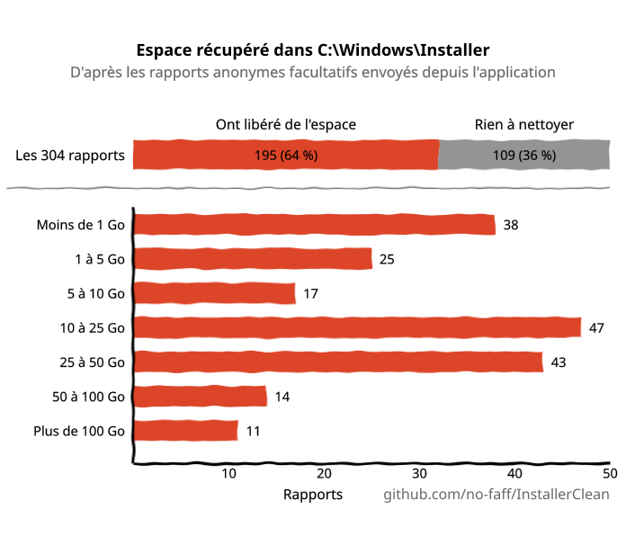
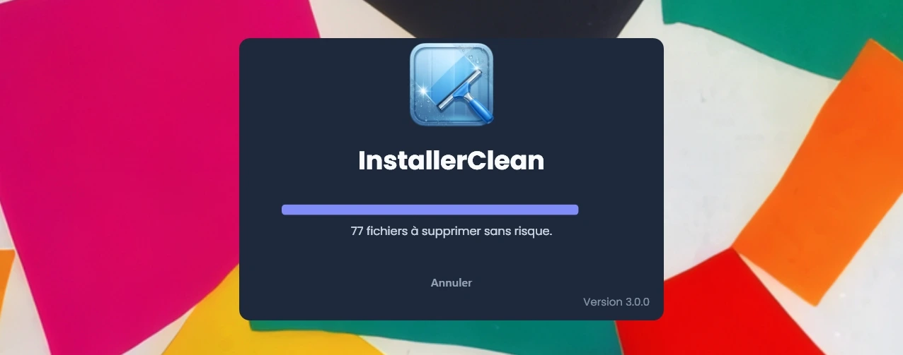
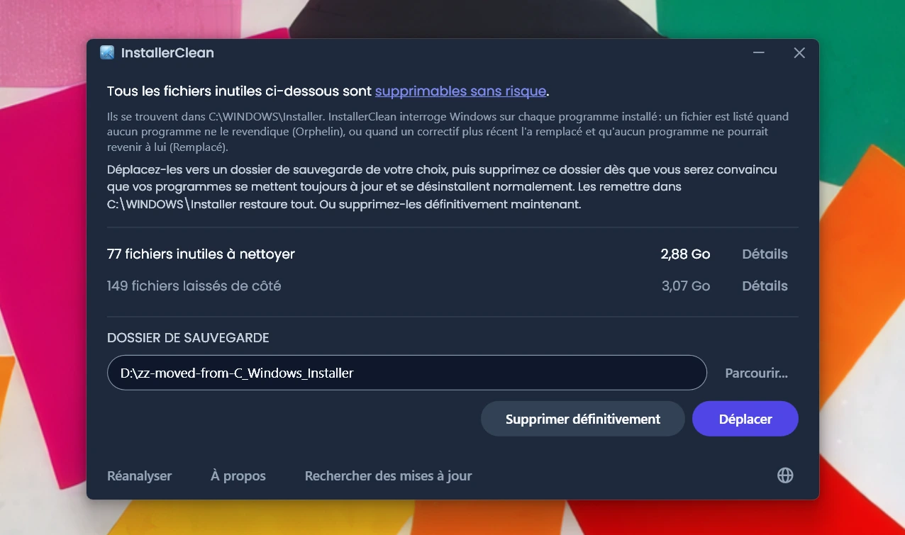
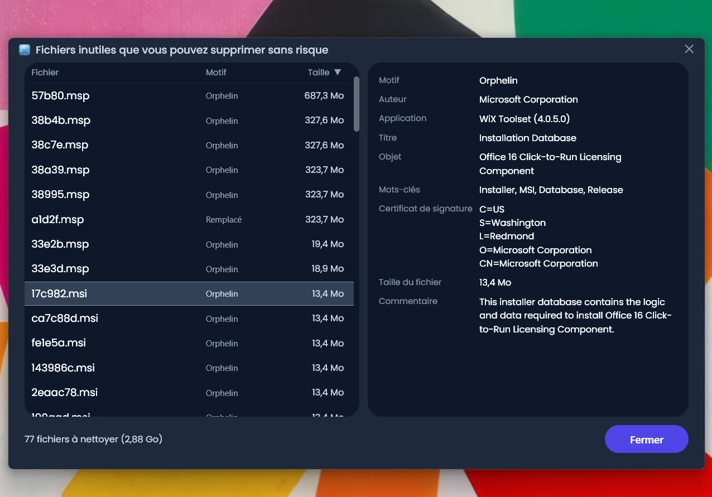
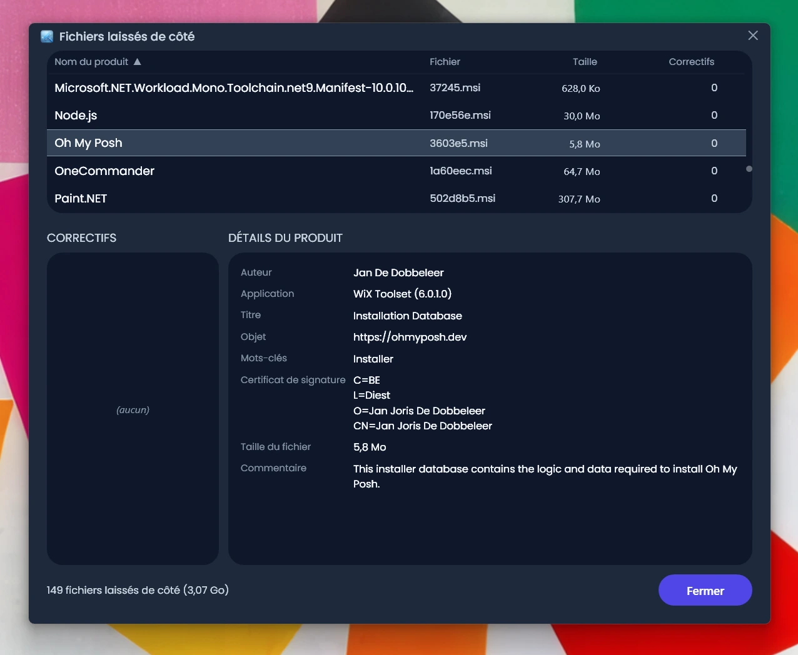
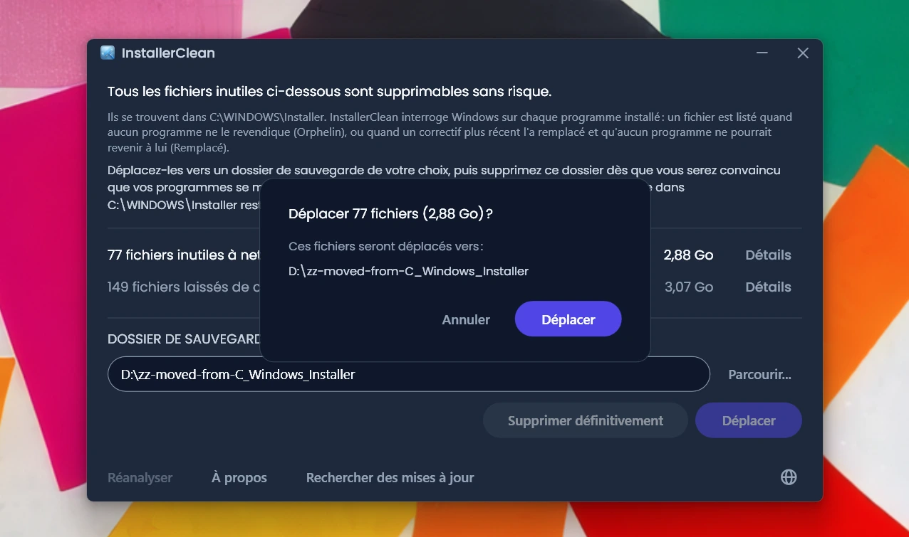
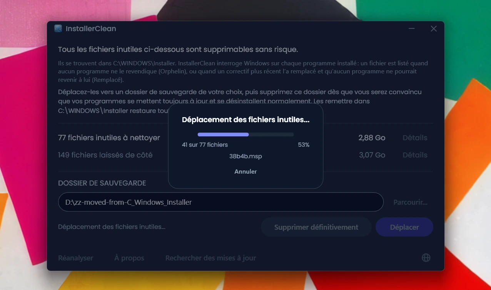
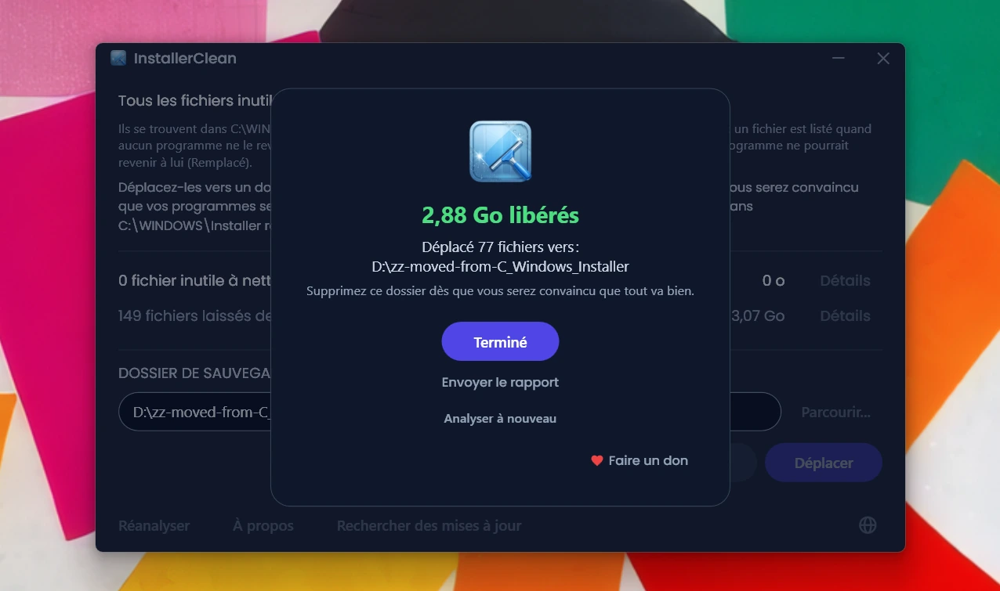

<p align="center">
  <a href="README.md">English</a> · <a href="README.zh-CN.md">简体中文</a> · <a href="README.ru.md">Русский</a> · <a href="README.es.md">Español</a> · <a href="README.ar.md">العربية</a> · <a href="README.ja.md">日本語</a> · <a href="README.pt-BR.md">Português (BR)</a> · <a href="README.pl.md">Polski</a> · <a href="README.tr.md">Türkçe</a> · <a href="README.ko.md">한국어</a> · <strong>Français</strong> · <a href="README.it.md">Italiano</a> · <a href="README.de.md">Deutsch</a> · <a href="README.id.md">Bahasa Indonesia</a> · <a href="README.vi.md">Tiếng Việt</a> · <a href="README.uk.md">Українська</a> · <a href="README.nl.md">Nederlands</a>
</p>

<p align="center">
  
</p>

<p align="center"><em>🎶 What's my line? I'm happy <a href="https://www.youtube.com/watch?v=HM-jHhUZfFI">cleaning Windows</a></em></p>

<h1 align="center">InstallerClean</h1>

<p align="center"><strong>Un outil open source pour nettoyer en toute sécurité <code>C:\Windows\Installer</code>, le dossier caché de Windows qui grignote silencieusement votre espace disque.</strong></p>

<p align="center"><em>Servez-vous-en tous les trente-six du mois. Gagnez peut-être un peu d'espace. Repartez, tout propre.</em></p>

<p align="center">
  <a href="LICENSE"></a>
  <a href="https://dotnet.microsoft.com/download/dotnet/10.0"></a>
  <a href="https://github.com/no-faff/InstallerClean/actions/workflows/ci.yml"></a>
  <a href="https://github.com/no-faff/InstallerClean/releases"></a>
  <a href="https://github.com/no-faff/InstallerClean/releases/latest"></a>
  <a href="https://github.com/no-faff/InstallerClean/releases"></a>
</p>

<a id="reports-stats"></a>

<!-- reports-stats-start chart-only (generated; do not hand-edit between these markers) -->
<p align="center">
  <picture>
    <source media="(prefers-color-scheme: dark)" srcset="docs/reports-fr-dark.svg" />
    <source media="(prefers-color-scheme: light)" srcset="docs/reports-fr-light.svg" />
    
  </picture>
</p>
<!-- reports-stats-end -->

- **En bref :** InstallerClean fait une seule chose : il retire les fichiers inutiles de `C:\Windows\Installer`, un dossier caché qui se remplit à mesure que vous installez et mettez à jour des logiciels. Après une analyse rapide, il vous dit si vous en avez, donne plus de détails pour les curieux, et vous permet de les déplacer ailleurs ou de les supprimer pour libérer de l'espace sur votre disque C:.
- **Vous êtes peut-être ici parce que :** vous avez utilisé [WinDirStat](https://github.com/windirstat/windirstat), WizTree ou TreeSize, vous avez vu que `C:\Windows\Installer` occupait beaucoup de place et vous ne saviez pas ce qu'il y avait dedans. Dans ce cas, InstallerClean est exactement ce qu'il vous faut. Il sait ce que contiennent ces fichiers aux noms apparemment aléatoires comme `9f05cba.msi` et vous dit rapidement lesquels vous pouvez retirer sans risque.
- **Combien d'espace :** Le graphique ci-dessus montre les résultats des rapports facultatifs qui nous parviennent régulièrement depuis la v1.8.0. (Merci à toutes les personnes qui ont cliqué sur le bouton. Sans vous, ce graphique n'existerait pas.) Sur les <!-- reports-freedpct-start -->64 %<!-- reports-freedpct-end --> qui ont libéré de l'espace, la médiane libérée est de <!-- reports-median-start -->15,5 Go<!-- reports-median-end -->. <!-- reports-biggest-start -->Une machine a récupéré la bagatelle de 462 Go.<!-- reports-biggest-end --> Les <!-- reports-nothingpct-start -->36 %<!-- reports-nothingpct-end --> restants n'ont rien libéré : tout dépend donc de la machine, et une installation neuve de Windows 11 sans logiciel supplémentaire n'a rien à retirer. Celles qui auront le plus de fichiers inutiles sont les machines qui tournent depuis des années, tout ce qui porte de gros logiciels basés sur MSI (Acrobat, Office, LibreOffice, gros outils de développement), et les personnes qui installent et désinstallent beaucoup de logiciels. Vous verrez exactement combien dès que vous le lancerez.
- **Est-ce sûr :** Oui. Il ne touche qu'aux fichiers de `C:\Windows\Installer`. Il demande à Windows Installer ce qui est encore nécessaire, et lit en plus les mêmes enregistrements dans le registre. Il ne propose un fichier que si rien de ce qui est installé sur la machine ne le revendique, ou si un correctif plus récent l'a remplacé et qu'aucun programme présent ne pourrait revenir à l'ancien. Tout ce sur quoi il n'obtient pas de réponse claire, il le retient. [Plus de détails ci-dessous](#comment-ça-marche).
- **Rien sur vous :** Open source (Apache 2.0). Pas de compte, pas de publicité, pas de pistage, pas de télémétrie, rien qui tourne en arrière-plan. La seule chose qu'il fait en ligne de lui-même, c'est vérifier sur GitHub s'il existe une version plus récente quand vous le lancez, et cela peut se désactiver.
- **Comment l'obtenir :** [Téléchargez la dernière version](../../releases/latest). Lancez-la ; passez [l'avertissement que Windows peut afficher](#unknown-publisher) et [l'invite d'administrateur](#admin). Déplacez ou supprimez ce qu'il trouve. C'est tout.

## Sommaire

- [Le dossier dont personne ne vous parle](#le-dossier-dont-personne-ne-vous-parle)
- [La recherche d'aide](#la-recherche-daide)
- [Ce que fait InstallerClean](#ce-que-fait-installerclean)
- [Captures d'écran](#captures-décran)
- [Comment ça marche](#comment-ça-marche)
- [Téléchargement](#téléchargement)
  - [Vérifier le téléchargement lui-même](#vérifier-le-téléchargement-lui-même)
- [FAQ](#faq)
- [Ligne de commande](#ligne-de-commande)
- [Accessibilité](#accessibilité)
- [Politique de signature de code](#politique-de-signature-de-code)
- [Confidentialité](#confidentialité)
- [Ce qu'il ne fait pas](#ce-quil-ne-fait-pas)
- [Les autres outils](#les-autres-outils)
- [Si un fichier manque bel et bien dans C:\Windows\Installer](#recovery)
- [Prérequis](#prérequis)
- [Compilation depuis les sources](#compilation-depuis-les-sources)
- [Contribuer](#contribuer)
- [Soutenir le projet](#soutenir-le-projet)
- [Historique des étoiles](#historique-des-étoiles)
- [Licence](#licence)

---

## Le dossier dont personne ne vous parle

Il existe un dossier caché sur tout PC Windows, nommé `C:\Windows\Installer`. Chaque fois que vous installez un logiciel qui utilise le système Windows Installer, ou que vous appliquez un correctif à Microsoft Office, Adobe Acrobat, Visual Studio ou toute autre application basée sur `.msi`, une copie de ce programme d'installation ou de ce fichier de correctif `.msp` atterrit dans ce dossier, et y reste.

Quand un correctif plus récent en remplace un ancien, les deux restent. Les programmes d'installation des logiciels que vous avez désinstallés il y a longtemps restent eux aussi. Le Nettoyage de disque n'y touche pas, l'Assistant Stockage non plus. DISM concerne un tout autre dossier. Au fil du temps, le dossier grossit : 1 Go, 5 Go, 20 Go, 50 Go. Sur les machines chargées de gros logiciels MSI (Acrobat est un coupable récurrent), il peut [dépasser les 100 Go](https://www.reddit.com/r/sysadmin/comments/1oxcrmh/acrobat_filling_up_the_cwindowsinstaller_folder/).

Ce ne sont pas des fichiers temporaires qui reviennent d'eux-mêmes. C'est du véritable poids mort : de vieux programmes d'installation de logiciels désinstallés depuis des années, et des correctifs remplacés plusieurs fois. Une fois partis, ils ne reviennent pas.

**Si vous cherchez un moyen simple de libérer de l'espace disque sous Windows, ce dossier est un bon point de départ.** InstallerClean repère les fichiers inutiles et les retire sans risque.

## La recherche d'aide

Si vous avez déjà cherché de l'aide pour ce dossier, vous savez sans doute comment ça se passe. Une personne ayant 180 Go dans `C:\Windows\Installer` demande comment le nettoyer. On lui [répond de lancer le Nettoyage de disque](https://learn.microsoft.com/en-us/answers/questions/4238108/windows-installer-folder-has-occupied-180gb). Elle essaie. Ça libère 600 Mo, mais rien de ce dossier (parce que le Nettoyage de disque ne touche pas à `C:\Windows\Installer`). Et le fil de discussion retombe dans le silence.

> *« Tous les fils que j'ai trouvés ont tendance à recommander les mêmes choses, qui ne résolvent pas le problème, avant de s'éteindre. »*
>
> [ksparks519, r/Windows10](https://www.reddit.com/r/Windows10/comments/1bt8c5p/anyone_ever_figure_out_giant_installer_folders/) (traduit de l'anglais)

Ou bien on lui dit de ne surtout pas y toucher. Dans un fil, une personne dont le dossier Installer pesait 60 Go s'est vu répondre [« n'y touchez pas »](https://www.reddit.com/r/techsupport/comments/1hw4suq/my_windows_installer_folder_is_like_60gb_so_i/). Quand elle a demandé ce qu'elle devait faire à la place, la réponse a été : *« Je viens de te le dire. »*

Le conseil habituel confond deux choses différentes. Supprimer des fichiers au hasard vous empêche de mettre à jour ou de désinstaller les programmes auxquels ces fichiers appartenaient. Ne retirer que les fichiers que rien sur la machine ne revendique, ou que Windows enregistre comme remplacés, n'a pas cet effet. InstallerClean, lui, fait la seconde.

## Ce que fait InstallerClean

1. **Analyse** `C:\Windows\Installer` à la recherche de fichiers `.msi` et `.msp`
2. **Interroge** Windows Installer sur ce qui est encore nécessaire, et lit en plus les mêmes enregistrements dans le registre
3. **Retient** tout ce que les deux lectures ne parviennent pas à trancher entre elles
4. **Vous dit combien vous pouvez libérer**, et combien il laisse de côté, avec des fenêtres de détail facultatives qui listent chaque fichier
5. **Retire les fichiers inutiles** : déplacez-les vers un dossier de sauvegarde de votre choix, ou supprimez-les définitivement

## Captures d'écran

<p>
  <br>
  <em>Analyse initiale. C'est très rapide.</em>
  <br><br>
</p>

<p>
  <br>
  <em>Résultats : ce qui peut être retiré, ce qui a été laissé de côté.</em>
  <br><br>
</p>

<p>
  <br>
  <em>Détails des fichiers qui peuvent partir : le motif pour lequel chacun n'est plus nécessaire, et ce que le fichier dit de lui-même.</em>
  <br><br>
</p>

<p>
  <br>
  <em>Détails des fichiers laissés de côté : le programme auquel Windows dit que chacun appartient, et ce que le fichier dit de lui-même.</em>
  <br><br>
</p>

<p>
  <br>
  <em>Une confirmation avant l'une ou l'autre action. Déplacer sauvegarde les fichiers dans un dossier de votre choix. Ou supprimez-les définitivement.</em>
  <br><br>
</p>

<p>
  <br>
  <em>Le déplacement en cours. Vers le même disque, il est instantané. Vers un autre disque, plus il y a de Go, plus il est long.</em>
  <br><br>
</p>

<p>
  <br>
  <em>Terminé. Espace récupéré. Fichiers sauvegardés jusqu'à ce que vous soyez convaincu que tout va bien. Supprimez ensuite le dossier de sauvegarde.</em>
  <br><br>
</p>

<p>
  <br>
  <em>Après une nouvelle analyse. Plus rien à nettoyer.</em>
  <br><br>
</p>

<a id="is-it-safe"></a>
## Comment ça marche

Quand Windows Installer installe un programme, il garde une copie du programme d'installation dans `C:\Windows\Installer`, et quand un correctif est enregistré pour un programme, il en garde une copie également. Ce sont ces copies qui lui servent quand il répare, met à jour ou désinstalle le logiciel par la suite, et c'est pourquoi elles restent là longtemps après la fin de l'installation. Les deux sortes de copies finissent dans le dossier : les programmes d'installation `.msi` ; et les correctifs `.msp`, qui mettent à jour un programme que vous avez déjà au lieu de le remplacer.

InstallerClean propose un fichier pour l'une des deux raisons suivantes.

**Orphelin** signifie que rien sur la machine ne revendique le fichier. Aucun produit installé et aucun correctif enregistré ne le nomme.

**Remplacé** signifie que Windows a enregistré qu'un correctif plus récent a remplacé celui-ci, et qu'il a gardé le fichier malgré tout. Un correctif n'est supprimé qu'une fois que tous les programmes pour lesquels il est enregistré ont été désinstallés, ou qu'il a été retiré de tous. Être remplacé par un plus récent n'est ni l'un ni l'autre, donc le fichier reste. Adobe Acrobat fonctionne ainsi sous Windows : ses mises à jour arrivent sous forme de correctifs appliqués à une installation de base plutôt que sous forme de nouveaux programmes d'installation, si bien qu'une machine qui l'a depuis un moment peut en conserver plusieurs.

InstallerClean établit ces deux cas en sens inverse l'un de l'autre, et seul le premier suppose de regarder dans le dossier.

**Lister le dossier.** InstallerClean liste les fichiers `.msi` et `.msp` qui se trouvent directement dans `C:\Windows\Installer`. Il n'entre pas dans les sous-dossiers.

**Lire les enregistrements, deux fois.** InstallerClean interroge Windows Installer sur chaque produit installé et chaque correctif enregistré, ainsi que sur le fichier en cache que chacun nomme, en appelant l'API Windows Installer de `msi.dll`. Puis il lit les mêmes enregistrements d'une seconde manière, directement dans le registre, parce que cette interrogation peut rester incomplète sans le dire : Windows transmet les enregistrements un par un jusqu'à annoncer qu'il n'y en a plus, et une énumération qui s'arrête au troisième sur deux cents ressemble exactement à une énumération arrivée au bout. Une clé de registre livre toute sa liste de noms d'un coup, si bien qu'une liste écourtée ne peut pas passer pour complète. Chaque produit que le registre nomme et que l'interrogation a manqué est alors soumis à Windows par son nom, un par un. Cette seconde lecture ne peut que faire passer un fichier du côté « encore nécessaire ». Il n'existe aucun chemin par lequel elle en ajouterait un à la liste des fichiers à retirer.

**Rattacher un enregistrement à son fichier.** Un enregistrement nomme son fichier en cache sous forme de chemin, et le même dossier n'y est pas toujours orthographié de la même façon. Plutôt que de se fier à l'orthographe, InstallerClean demande donc à Windows où chaque chemin enregistré pointe réellement, et compare cela aux fichiers qu'il a listés dans le dossier. Tout ce qui reste non revendiqué fait l'objet d'une seconde comparaison qui ne passe pas du tout par les noms : InstallerClean ouvre le fichier et demande à Windows de l'identifier, de sorte que deux noms différents pour un même fichier soient reconnus comme un seul fichier.

**Les enregistrements impossibles à rattacher.** Si Windows refuse de dire où pointe un chemin enregistré, ou si le fichier au bout de ce chemin ne peut pas être identifié, InstallerClean ne sait pas de quel fichier cet enregistrement parlait, et n'importe lequel des fichiers qu'il a listés pourrait être celui-là. Il en va de même si un programme a pu être installé plusieurs fois, car InstallerClean ne peut alors pas dire quel fichier en cache appartient à quelle copie. Dans chacun de ces cas, il ne propose rien de ce qu'il a trouvé en listant le dossier cette fois-là. Un enregistrement qui pointe vers un fichier déjà parti est différent : il ne reste rien qu'il ait pu désigner, il ne peut donc concerner aucun des fichiers encore présents dans le dossier.

**Poser la question par l'autre bout.** Un orphelin se décide par une absence, et une absence peut aussi vouloir dire que l'application n'a pas trouvé l'enregistrement. Avant de proposer un programme d'installation `.msi`, InstallerClean ouvre donc le fichier, lit le code produit que le fichier porte lui-même, et demande à Windows si ce produit est installé. S'il l'est, le fichier reste, quoi qu'ait trouvé le reste de l'analyse. Cette vérification ne peut que retirer un fichier de la liste. Aucune de ses réponses ne peut en ajouter un.

**Ce qui décide d'un correctif `.msp`.** Un correctif n'est pas ouvert pour lui demander à quel programme il appartient. Ce qui tranche à la place, c'est qu'un enregistrement de correctif nomme son fichier en cache à deux endroits : les correctifs enregistrés pour chaque produit ; et une unique liste, dans le registre, de tous les enregistrements de correctifs de la machine. Un correctif n'est proposé comme orphelin que si aucun de ces deux endroits ne nomme ce fichier en cache.

**En quoi un correctif remplacé diffère.** Il ne passe par rien de ce qui précède, car ce n'est pas un fichier non revendiqué. Windows en a un enregistrement, et c'est cet enregistrement qui dit que le correctif a été remplacé. Le risque est d'un autre ordre : un correctif peut être enregistré pour plusieurs programmes, et un seul d'entre eux en a fini avec lui. Un correctif remplacé n'est donc proposé que si Windows enregistre que ce correctif ne peut pas être désinstallé, que tous les programmes pour lesquels il est enregistré ont été interrogés, qu'aucun ne l'a encore appliqué, et qu'aucun ne détient de correctif que Windows déclare désinstallable. Ce dernier point est là parce qu'annuler un correctif sur un programme peut aller rechercher l'ancien fichier. Si l'un de ces points ne peut pas être établi, le fichier reste.

<details>
<summary>Les appels Windows Installer utilisés ici</summary>

- `MsiEnumProductsEx` pour lister chaque produit installé, et à nouveau avec un seul code produit pour demander si un produit donné est installé
- `MsiEnumPatchesEx` pour lister les correctifs enregistrés, aussi bien par produit que pour la machine entière
- `MsiGetProductInfoEx` pour lire le nom d'un produit, le fichier en cache qu'il nomme, et s'il s'agit de l'une de plusieurs installations du même produit
- `MsiGetPatchInfoEx` pour lire l'état d'un correctif, si Windows peut le désinstaller, et le fichier en cache qu'il nomme
- `MsiGetSummaryInformation` et `MsiSummaryInfoGetProperty` pour lire dans un fichier de correctif les programmes auxquels il peut s'appliquer
- `MsiOpenDatabase`, `MsiDatabaseOpenView`, `MsiViewExecute`, `MsiViewFetch` et `MsiRecordGetString` pour lire dans un fichier d'installation le code produit qu'il déclare

</details>

Cela dit, l'application vous encourage à déplacer les fichiers vers un dossier de sauvegarde (sur un autre disque ou une autre partition si vous cherchez à libérer de l'espace sur C:). Vous avez ainsi l'occasion de vous convaincre que tout va effectivement bien avant de supprimer pour de bon les fichiers inutiles.

## Téléchargement

Trois variantes, choisissez-en une :

- **Portable** (`InstallerClean-3.0.0-portable.exe`) : un seul fichier, avec le runtime .NET 10 à l'intérieur. Pas d'installation, pas de désinstallation : double-cliquez dessus et il se lance. Gardez le fichier quelque part pour la prochaine fois, ou supprimez-le quand vous avez terminé.
- **Setup** (`InstallerClean-3.0.0-setup.exe`) : un programme d'installation Windows classique, avec le runtime .NET 10 intégré. Ajoute une entrée au menu Démarrer et se désinstalle proprement. Bien rangé dans les Programmes, facile à retrouver dans six mois, ou à lancer plus souvent que cela si vous installez et désinstallez beaucoup de logiciels.
- **CLI** (`installerclean-cli.exe`) : la version en ligne de commande seule, un seul fichier avec le runtime à l'intérieur. Pas d'installation, pas de désinstallation. Déposez-le sur un poste client, lancez une analyse ou un nettoyage, supprimez-le. Conçu pour le scripting, les tâches planifiées et le déploiement de masse, quand vous voulez les opérations sans application de bureau sur le poste client. Voir [Ligne de commande](#ligne-de-commande) pour les arguments et les codes de sortie.

Depuis la 2.2.0, les noms de fichier du programme d'installation et de la version portable comportent leur numéro de version, si bien qu'une copie téléchargée dit toujours ce qu'elle est ; l'outil en ligne de commande garde son nom simple `installerclean-cli.exe`, pour que les tâches planifiées et les scripts qui pointent vers lui continuent de fonctionner d'une mise à jour à l'autre.

Téléchargez depuis la [page des versions](../../releases/latest), puis lancez le fichier. Il n'est pas signé, donc Windows affiche un avertissement « Éditeur inconnu » ; la [FAQ](#unknown-publisher) explique ce que vous verrez et pourquoi c'est sans danger.

L'application analyse automatiquement au démarrage. Examinez les résultats, puis cliquez sur **Déplacer** ou **Supprimer définitivement**.

Ou installez via [winget](https://learn.microsoft.com/windows/package-manager/winget/) :

```
winget install NoFaff.InstallerClean
```

Ou installez via [Scoop](https://scoop.sh) :

```
scoop install installerclean
```

### Vérifier le téléchargement lui-même

InstallerClean n'est pas signé. Voici ce que vous pouvez vérifier avant de le lancer :

- L'empreinte SHA-256 de chaque téléchargement figure sur la page de sa version, à la fois dans les notes et dans un fichier `.sha256` distinct, à côté du téléchargement.
- VirusTotal : chaque build est analysé avant d'être publié, et la page de la version porte le résultat complet, moteur par moteur, pour chaque téléchargement.
- Le code source est ici, sur [github.com/no-faff/InstallerClean](https://github.com/no-faff/InstallerClean). Les services d'analyse, de requête, de déplacement, de suppression, de réglages et de redémarrage en attente sont couverts par une suite de tests automatisés qui s'exécute sous Windows à chaque push sur `main` et à chaque pull request, et le badge CI en haut de cette page en donne le résultat.
- Les builds de publication sont déterministes : les mêmes sources, le même SDK et les mêmes options de publication produisent les mêmes octets, et une version ne peut pas être taguée si chacune des entrées du build ne correspond pas aux sources à ce tag. Vous pouvez donc basculer sur le tag, compiler vous-même et comparer les empreintes à celles publiées. Les notes de chaque version portent ce qu'il faut pour cela : la version du SDK avec laquelle elle a été compilée, et les options de publication de tout téléchargement qui n'a pas été compilé avec les valeurs par défaut. Le setup fait exception : il est compilé par Inno Setup et non par le SDK, et y inscrit l'année de compilation, si bien que reproduire son empreinte demande en plus la même version d'Inno et la même année civile.
- <!-- downloads-start -->78 000+<!-- downloads-end --> téléchargements sur GitHub, MajorGeeks et Softpedia.
- [MajorGeeks](https://www.majorgeeks.com/files/details/installerclean.html) teste chaque soumission dans une machine virtuelle et ne la référence que si elle passe son contrôle.<br><a href="https://www.majorgeeks.com/files/details/installerclean.html"></a>
- [Softpedia](https://www.softpedia.com/get/System/Hard-Disk-Utils/InstallerClean.shtml) l'a testé et l'a certifié exempt de logiciels espions, de publiciels et de virus.<br><a href="https://www.softpedia.com/get/System/Hard-Disk-Utils/InstallerClean.shtml"></a>

## FAQ

<a id="admin"></a>

**Pourquoi demande-t-il les droits d'administrateur ?** Deux raisons. `C:\Windows\Installer` est verrouillé pour tout le monde sauf les administrateurs : le lire, interroger Windows Installer et déplacer ou supprimer des fichiers demandent tous ces droits. Et un administrateur peut interroger Windows sur les programmes installés sous n'importe quel compte de la machine, là où un non-administrateur ne le peut pas : sans ces droits, Windows dirait qu'un programme n'est pas installé alors qu'il l'est, à l'intérieur même de la vérification qui décide si un fichier est encore nécessaire.

<a id="unknown-publisher"></a>

**Pourquoi Windows affiche-t-il « Éditeur inconnu » ?** InstallerClean n'est pas signé numériquement, et Windows marque les fichiers téléchargés depuis Internet ; au premier lancement, SmartScreen affiche donc généralement « Windows a protégé votre ordinateur », avec l'éditeur indiqué comme inconnu. Un certificat de signature payant coûte de l'argent chaque année et je préfère garder l'application gratuite plutôt que d'en payer un, alors j'ai déposé une demande auprès de la SignPath Foundation, qui signe gratuitement les logiciels open source, et InstallerClean a été accepté (voir [Politique de signature de code](#politique-de-signature-de-code)). Le certificat n'a pas encore été délivré : pour l'instant, cliquez donc sur **Informations complémentaires**, puis sur **Exécuter quand même**. C'est sans danger : le code source est public, et chaque version est accompagnée de liens VirusTotal et d'empreintes SHA-256 que vous pouvez vérifier au préalable.

**Fonctionne-t-il sous Windows 7 ou 8 ?** Non. Il lui faut Windows 10 version 1607 ou ultérieure, la plus ancienne build prise en charge par le runtime .NET 10. Le programme d'installation refuse de s'installer sur plus ancien, et la version portable ne démarre pas.

## Ligne de commande

`installerclean-cli.exe` est un exécutable console distinct, installé à côté de l'interface graphique. Même analyse, même déplacement, même suppression, sans fenêtre. Il bloque l'invite jusqu'à la fin de son exécution, de sorte qu'un script ou une tâche planifiée peut l'attendre.

### Options

| Option | Ce qu'elle fait | Accepte aussi |
|---|---|---|
| `/s` | Analyse seule. Liste ce qu'il retirerait, avec le nom, la taille et le motif de chacun. Ne change rien. | |
| `/d` | Analyse, puis supprime définitivement les fichiers inutiles. | |
| `/m` | Analyse, puis les déplace vers le dossier enregistré dans l'interface graphique. | |
| `/m CHEMIN` | Analyse, puis les déplace vers `CHEMIN`. Mettez-le entre guillemets s'il contient une espace. | |
| `--help` | Affiche l'aide et se termine avec le code `0`. | `/?`, `-h` |
| `--version` | Affiche la version et se termine avec le code `0`. | `-v` |

Les options ne tiennent pas compte de la casse : `/S` et `/D` fonctionnent aussi bien que `/s` et `/d`. Une seule option par exécution : elles ne se combinent pas, et `/s` et `/d` ne prennent rien après elles.

Lancé sans argument, il affiche l'aide et se termine avec le code `1` : une tâche planifiée qui perd son option échoue ainsi de façon visible, au lieu de ne rien faire en silence. Une option qu'il ne reconnaît pas affiche une ligne d'erreur, puis l'aide, et se termine elle aussi avec le code `1`. Un chemin de déplacement contenant une espace et laissé sans guillemets est refusé de la même façon, plutôt que tronqué en silence, et le message vous dit de le mettre entre guillemets.

### Codes de sortie

Ce sont les codes que l'outil documente lui-même dans `--help` :

| Code | Signification |
|---|---|
| `0` | Succès. L'exécution a fait ce qui lui était demandé, et rien n'a échoué. |
| `1` | Rien de traité. L'exécution a échoué, ou a été refusée. |
| `2` | Partiel. Une partie traitée, l'autre non, y compris après un Ctrl+C en cours de route. |
| `75` | Transitoire. Une condition temporaire a bloqué l'exécution ; le message affiché dit laquelle. |
| `130` | Annulé par Ctrl+C avant que quoi que ce soit ait été traité. |

Le code `1` couvre un refus autant qu'un échec, et un refus n'est pas un défaut : une destination simplement pleine, ou une valeur de registre que l'application n'a pas pu lire avant de toucher à quoi que ce soit, aboutissent toutes deux ici. Le code `0` veut dire que rien n'a échoué, pas qu'il ne reste rien : `--help`, `--version` et une analyse seule se terminent tous avec `0`, que l'analyse ait trouvé soixante-huit fichiers ou aucun.

### Le journal des événements

Chaque exécution écrit une entrée de résultat dans le journal des applications, et peut y ajouter un ou plusieurs avis. L'ID d'événement est un contrat machine stable : un RMM peut donc filtrer sur le numéro sans analyser le moindre texte :

| ID | Signification |
|---|---|
| `1000` | Succès |
| `1002` | Partiel |
| `2000` | Ignoré, transitoire |
| `4000` | Échec net |
| `3000` | Avis : l'analyse n'a pas pu rendre compte de chaque produit installé |
| `3001` | Avis : des fichiers que Windows attend manquent dans le dossier |
| `3002` | Avis : des fichiers ont été retenus plutôt que proposés |

La plage `3000` est un avis et non un résultat, et ne compte pas comme résultat d'exécution. Le type d'entrée est Information quand rien n'a mal tourné dans l'exécution, et Avertissement dans le cas contraire. **Le journal des événements est toujours en anglais**, quelle que soit la langue d'affichage de la machine, pour qu'une recherche sur une expression connue ait une cible stable. La partie traduite, c'est la console : elle suit la langue de la machine, et écrit les tailles et les dates selon sa région.

### Exemples

Auditer dans un fichier, sans rien changer :

```
installerclean-cli /s > audit.txt
```

Déplacement mensuel vers `D:\InstallerBackup`, avec la CLI déposée dans `C:\Tools` :

```
schtasks /create /tn "InstallerClean monthly" /tr "C:\Tools\installerclean-cli.exe /m D:\InstallerBackup" /sc monthly /ru SYSTEM /rl highest
```

La tâche bloque jusqu'à la fin de l'exécution et enregistre le code de sortie comme Résultat de la dernière exécution : un RMM peut donc se fonder sur les codes ci-dessus.

Depuis PowerShell :

```powershell
& 'C:\Tools\installerclean-cli.exe' /m D:\InstallerBackup
switch ($LASTEXITCODE) {
    0       { 'Propre' }
    2       { 'Partiel, vérifiez la sortie' }
    75      { 'Bloqué, réessayez plus tard' }
    default { "Échec ($LASTEXITCODE)" }
}
```

### Avant de l'intégrer à un script

- **Il lui faut l'élévation.** Tout, `/s` compris. Depuis une invite non élevée, Windows refuse de le démarrer et renvoie `740` à votre shell.
- **Le dossier enregistré dans l'interface graphique est propre à l'utilisateur.** Une tâche qui s'exécute sous SYSTEM ou sous un compte de service ne voit pas ce dossier : ces exécutions doivent donc passer `/m CHEMIN`.
- **SYSTEM accède au réseau sous le compte de la machine** : une destination `\\serveur\partage` demande donc des droits accordés à ce compte.
- **`/s` ne bloque jamais.** Cette option est en lecture seule et ne prend aucun verrou : vous pouvez donc analyser pendant que l'application de bureau est ouverte. `/d` et `/m` prennent un verrou à l'échelle de la machine et se terminent avec `75` si une autre exécution d'InstallerClean le détient.
- **Tout va sur stdout**, erreurs comprises ; il n'y a pas de stderr. Fondez-vous sur le code de sortie plutôt que sur l'analyse du texte.
- **Le déplacement refuse plutôt que de renommer.** Si la destination contient déjà un fichier de ce nom, ce fichier est laissé dans le cache et nommé dans la sortie, et le reste du lot est tout de même déplacé. Une exécution où tous les fichiers entrent en collision ne traite rien et se termine avec `1`.
- **Rien ne vide le dossier de sauvegarde.** `/m` ne fait qu'ajouter. C'est à vous de le vider.
- **`taskkill /pid` n'est pas une annulation propre.** L'exécution suivante récupère le verrou d'instance unique.
- **La première exécution enregistre une source de journal d'événements**, sous `HKLM\SYSTEM\CurrentControlSet\Services\EventLog\Application\InstallerClean`. Laissez-la en place : l'Observateur d'événements lit la description d'une entrée à travers sa source, et la retirer transformerait chaque entrée déjà écrite par l'outil en erreur de source inconnue.

### Pourquoi `installerclean-cli` et pas `installerclean.exe`

`InstallerClean.exe` est l'interface graphique, et elle ignore les arguments de ligne de commande. `installerclean-cli.exe` est un véritable processus console : il bloque donc l'invite jusqu'à sa fin, et vous pouvez rediriger sa sortie ou la passer dans un tube, comme pour n'importe quel autre exécutable console. Le programme d'installation installe les deux. Le téléchargement portable ne contient que l'interface graphique ; téléchargez `installerclean-cli.exe` seul depuis la [page des versions](../../releases/latest) si vous voulez la ligne de commande sans la fenêtre.

## Accessibilité

InstallerClean est conçu pour être pleinement utilisable au clavier et avec un lecteur d'écran.

- **Entièrement utilisable au clavier.** Tout ce que fait l'application est accessible au clavier, et les colonnes des fenêtres de détail se trient au clavier elles aussi : rien ici n'exige la souris. Les boutons de la barre de titre se comportent comme ceux de Windows et s'atteignent avec Alt+Espace ou Alt+F4. Le focus clavier reste visible où qu'il se pose.
- **Narrateur et Accès vocal.** Chaque contrôle est étiqueté, et le mot affiché sur un bouton est exactement celui qui l'active à la voix. Quand un déplacement ou une suppression se termine, le résultat est annoncé à voix haute.
- **Pensé pour être lu.** Le texte respecte le contraste WCAG AA sur tout le thème sombre.

Si quelque chose ici vous gêne, [ouvrez un ticket](../../issues). Les problèmes d'accessibilité sont des bugs, pas des cas marginaux.

## Politique de signature de code

InstallerClean a été accepté par la [SignPath Foundation](https://signpath.org) pour une signature de code gratuite, un programme qui signe les logiciels open source afin qu'ils cessent d'arriver sur votre machine avec un éditeur inconnu. Le certificat lui-même n'a pas encore été délivré : les téléchargements proposés ici ne sont donc pas signés aujourd'hui, et Windows vous mettra en garde à leur sujet.

Une fois délivré, chaque version portera la ligne que SignPath demande : « free code signing provided by SignPath.io, certificate by SignPath Foundation ». Le certificat appartient à la fondation et non à moi, parce qu'un certificat doit être délivré à une personne morale, et un projet d'une seule personne n'en est pas une. Cela ne veut pas dire qu'InstallerClean lui appartient, ni qu'elle y participe au-delà de la signature.

**Rôles.** InstallerClean a un seul mainteneur. Ceux qui écrivent le code et ceux qui le relisent, c'est-à-dire qui peut faire entrer du code dans le projet : moi. Ceux qui approuvent, c'est-à-dire qui peut autoriser la signature d'une version : moi.

## Confidentialité

Le rapport facultatif est la seule chose qui envoie quoi que ce soit au sujet d'une exécution, et il ne part que si vous appuyez sur le bouton. Il dit ce que l'analyse a trouvé, ce qu'elle a retenu et pourquoi, si vous avez déplacé ou supprimé, combien cela a libéré, combien de temps cela a pris, et tout ce qui a échoué, avec la version de l'application, la langue dans laquelle vous la lisez et votre version de Windows. Aucun nom de fichier, aucun nom de dossier, aucun nom de compte, rien qui identifie votre machine et rien qui permette de relier deux rapports entre eux. C'est ainsi que je découvre si l'application fonctionne, et ce qu'elle retient, sur d'autres machines que la mienne.

Pas de publicité, pas de télémétrie. Les seules autres connexions sont la vérification de version au démarrage de l'application (une requête vers GitHub, que vous pouvez désactiver dans la fenêtre À propos) et des boutons renvoyant vers GitHub et vers une page où vous pouvez faire un don si le cœur vous en dit. [Politique de confidentialité](PRIVACY.md) complète (en anglais).

## Ce qu'il ne fait pas

- WinSxS (`C:\Windows\WinSxS`) est un dossier différent, avec des règles différentes. Pour celui-là, exécutez `Dism /Online /Cleanup-Image /StartComponentCleanup` depuis une invite élevée.
- Aucun service en arrière-plan, aucune tâche planifiée, aucun nettoyage automatique. L'application s'exécute quand vous la lancez.
- Il ne modifie ni vos programmes installés ni la base de données de Windows Installer, il ne fait que les lire. La seule chose qu'il écrit dans le registre est l'enregistrement unique de la source d'événements dont l'outil en ligne de commande a besoin pour que ses exécutions apparaissent dans le journal des événements de Windows.
- Il n'établit de lui-même qu'un seul type de connexion : une vérification rapide de la page des versions de GitHub, pour voir s'il en existe une plus récente, quand vous le lancez ; vous pouvez la désactiver dans À propos. Tout le reste n'arrive que lorsque vous le lui demandez : le rapport anonyme facultatif (des chiffres sur l'exécution, rien qui vous nomme ni qui nomme vos fichiers) et des liens vers la documentation GitHub et une page de dons, qui s'ouvrent dans votre navigateur si vous cliquez dessus. Il ne télécharge jamais rien de lui-même.
- Pas de barres d'outils, pas de logiciels groupés, pas de publiciels.

## Les autres outils

Si vous avez déjà cherché des informations sur ce dossier, l'outil que vous aurez le plus probablement trouvé est [PatchCleaner](https://www.homedev.com.au/free/patchcleaner). Il a fait ce travail le premier, il l'a fait pendant une décennie avant qu'InstallerClean existe, il tient toujours bon, et InstallerClean n'existerait pas sans lui.

J'ai créé InstallerClean parce que PatchCleaner est à code fermé, n'a pas été mis à jour depuis mars 2016 et exclut les fichiers Adobe par défaut. Cette exclusion est là pour une bonne raison, et HomeDev l'a dit clairement dans les notes de version de l'époque :

> *« Un problème connu des versions précédentes fait que PatchCleaner identifie à tort les correctifs d'Adobe Acrobat Reader comme n'étant pas nécessaires. Adobe emploie un mécanisme propriétaire pour ses mises à jour automatiques, si bien que, si PatchCleaner retire les correctifs “orphelins” du répertoire Installer, les mises à jour automatiques d'Adobe Reader ne s'installent plus. »*
>
> [Notes de version de PatchCleaner, version 1.4.0.0](https://www.homedev.com.au/free/patchcleaner) (traduit de l'anglais)

Le filtre mis en place avec cette exclusion cherche le mot « Acrobat » dans les métadonnées d'un fichier et dans sa signature. Sur les machines où Acrobat est le pire coupable, cela peut représenter l'essentiel de l'espace :

> *« J'ai téléchargé PatchCleaner pour supprimer les fichiers `.msp` orphelins, mais apparemment ça ne libérerait que 250 Mo d'espace. 29 Go de fichiers sont “exclus par les filtres”, donc PatchCleaner ne semble pas d'une grande aide. »*
>
> HeatherBunny1111, [r/techsupport](https://www.reddit.com/r/techsupport/comments/1qc4tcf/how_to_delete_msp_files_safely/) (traduit de l'anglais)

La différence entre les deux outils tient ici à ce que chacun demande à Windows, et non à un désaccord au sujet d'Adobe. La liste que Windows tient des correctifs *appliqués* d'un produit laisse de côté ceux qu'un correctif plus récent a remplacés : un outil qui lit cette liste rencontre donc le fichier d'un correctif remplacé comme un fichier que rien ne revendique, au même titre que n'importe quel autre. C'est le filtre d'exclusion qui attrape ceux d'Adobe par leur nom. InstallerClean interroge plutôt Windows sur l'état des correctifs : un correctif remplacé arrive donc étiqueté comme tel, et ce qu'il advient de lui se décide sur ce que Windows enregistre à son sujet plutôt que sur ce que son nom indique. Voici comment les deux se comparent :

| | **InstallerClean** | **PatchCleaner** |
|---|---|---|
| Dernière mise à jour | 2026 (actif) | 3 mars 2016 |
| Code source | Open source (Apache 2.0) | Code fermé |
| Runtime | .NET 10 (autonome) | .NET Framework 4.5.2 + VBScript |
| API | API Windows Installer de `msi.dll` (intra-processus) | Windows Installer COM (hors processus, via VBScript) |
| Correctifs remplacés | Identifiés d'après les enregistrements de correctifs de Windows | Non distingués des fichiers non revendiqués |
| Fichiers Adobe | Correctifs remplacés détectés et étiquetés | Exclus par un filtre sur le nom, actif par défaut |

> **À propos de `Win32_Product` :** L'approche courante mais boguée pour lister les produits installés est `Win32_Product` (WMI), qui [déclenche des opérations de réparation MSI](https://gregramsey.net/2012/02/20/win32_product-is-evil/) sur chaque produit pendant l'énumération. InstallerClean comme PatchCleaner l'évitent. InstallerClean appelle l'API Windows Installer de `msi.dll` ; PatchCleaner exécute un script auxiliaire qui utilise l'objet COM de Windows Installer. Ce script s'appelle `WMIProducts.vbs`, ce qui donne à penser le contraire, mais le fichier est le script d'exemple de Microsoft lui-même, à une modification près, et il interroge Windows Installer et non WMI. Son nom est la seule chose trompeuse à son sujet.

Le Nettoyage de disque, l'Assistant Stockage, CCleaner et BleachBit ne nettoient pas `C:\Windows\Installer`.

<a id="recovery"></a>
## Si un fichier manque bel et bien dans `C:\Windows\Installer`

Si un fichier manque effectivement dans ce dossier, le programme auquel il appartenait continue de fonctionner normalement. Mais quand vous essaierez de mettre à jour ou de désinstaller ce programme, cela échouera probablement. Windows part chercher le fichier, ne le trouve pas, et l'étape s'arrête.

Tout le propos d'InstallerClean est de ne proposer au déplacement ou à la suppression que des fichiers qui ne sont *pas* nécessaires, mais l'application sait reconnaître un fichier manquant : elle signale donc chacun de ceux qu'elle trouve par un triangle d'avertissement et un lien qui renvoie ici. Voici quoi faire pour essayer de réparer le programme :

- Relevez le numéro de version du programme installé (Paramètres, Applications, Applications installées)
- Téléchargez chez son éditeur le programme d'installation **de cette version-là**. Un plus récent ne marchera pas, et désinstaller d'abord non plus : l'un comme l'autre doivent retirer ce qui est installé avant de pouvoir continuer, et ce retrait est justement l'étape qui a besoin du fichier manquant.
- Lancez ce programme d'installation
- Cela devrait rétablir le fichier sans toucher à vos réglages. Relancez une analyse dans InstallerClean : si cela a marché, l'avertissement aura disparu.

Microsoft ne garantit pas pour autant que cela marchera. Ce qui suit est son propre exposé, plus complet :

<details>
<summary>La position complète de Microsoft</summary>

*Les citations de Microsoft ci-dessous sont reproduites dans leur version anglaise d'origine.*

Guide complet : [Restore missing Windows Installer cache files](https://learn.microsoft.com/en-us/troubleshoot/windows-client/application-management/missing-windows-installer-cache), KB 2667628.

*Le problème peut ne pas apparaître tout de suite :*
> "If the installer cache is compromised, you may not immediately see problems until you take an action such as uninstalling, repairing, or updating a product."

*Les fichiers sont uniques à chaque machine, vous ne pouvez donc pas en copier un depuis un autre PC :*
> "Missing files cannot be copied between computers because the files are unique."

*Si vous disposez d'une sauvegarde faite avant la disparition du fichier, Microsoft indique quatre voies, dans cet ordre :*
> - System Restore points (available only on client operating systems)
> - Restoreable system state backup
> - Failure recovery methods that can restore the full system state backup
> - Reinstallation of the operating system and all applications

*Et la limite commune aux quatre. Il s'agit ici d'une sauvegarde de l'état du système, et non d'un dossier vers lequel vous avez vous-même déplacé des fichiers : ceux-là, vous pouvez les recopier directement, en confirmant l'invite d'administrateur que Windows affiche quand vous copiez dans le dossier.*
> "To restore the missing files, a full system state restoration is required. It is not possible to replace only the missing files from a previous backup."

*La récupération recommandée, et ses limites sans détour :*
> "If application files are missing from the Windows Installer Cache, ask the vendor or support team for the application about the missing files. You must follow the procedures or steps recommended by the application vendor to restore the files. In some cases, you may have to rebuild the operating system and reinstall the application to fix the problem."
>
> "Windows support engineers cannot help you recover missing application files from the Windows Installer cache."

</details>

Si InstallerClean est un jour la raison pour laquelle un fichier manque, je veux le savoir. [Ouvrez un ticket](../../issues) et je corrigerai.

## Prérequis

- Windows 10 (version 1607 / build 14393 ou ultérieure, la plus ancienne prise en charge par le runtime .NET 10) ou Windows 11
- Windows 64 bits. Le programme d'installation ne s'installe pas en 32 bits et vous le dira.
- Des privilèges d'administrateur, pour le programme d'installation comme pour l'application (`C:\Windows\Installer` est réservé aux administrateurs)

Voir [Téléchargement](#téléchargement) pour les variantes setup, portable et CLI.

## Compilation depuis les sources

```
git clone https://github.com/no-faff/InstallerClean.git
cd InstallerClean
dotnet build src/InstallerClean.sln
```

Lancer les tests :

```
dotnet test src/InstallerClean.Tests/
```

## Contribuer

Vous avez trouvé un bug ou vous avez une suggestion ? [Ouvrez un ticket](../../issues) ou démarrez une [discussion](../../discussions). Les pull requests sont les bienvenues. Lancez `dotnet test` avant de soumettre.

InstallerClean existe en 16 langues, chacune couvrant l'ensemble : l'application, le programme d'installation, la ligne de commande et ce README. Dans l'application, le programme d'installation et la ligne de commande, le japonais et le néerlandais ont été fournis complets par coolvitto et RijckAlex, et l'italien est ma propre traduction automatique corrigée et approuvée par bovirus, tous trois locuteurs natifs ; le reste est constitué de mes propres traductions automatiques. Tous les README sont les miens, dans toutes les langues. J'y ai mis beaucoup de soin, mais ils ne seront pas parfaits, et j'ai choisi de les publier tels quels plutôt que de les retenir jusqu'à ce qu'un locuteur natif puisse les vérifier un par un. Si vous parlez l'anglais et l'une de ces langues et que vous repérez quoi que ce soit qui pourrait être amélioré, je serais ravi de le savoir, dans un [ticket](../../issues/new?template=translation_review.md), une pull request ou une [discussion](../../discussions).

## Soutenir le projet

Si InstallerClean vous libère de l'espace et que le cœur vous en dit, un [petit don](https://nofaff.netlify.app/support) me ferait vraiment plaisir. Il y a un bouton ❤️ dans l'application, qui mène au même endroit. Toute somme sera reçue avec gratitude. Un grand merci à toutes les personnes qui ont déjà donné. Cela a représenté énormément de travail et je suis heureux que cela en ait valu la peine.

## Historique des étoiles

<picture>
  <source media="(prefers-color-scheme: dark)" srcset="docs/star-history-dark.svg" />
  <source media="(prefers-color-scheme: light)" srcset="docs/star-history-light.svg" />
  
</picture>

## Licence

[Apache 2.0](LICENSE)

---

🎶 [George Formby - When I'm Cleaning Windows](https://www.youtube.com/watch?v=P183Uo5Ust4). Régalez-vous !
