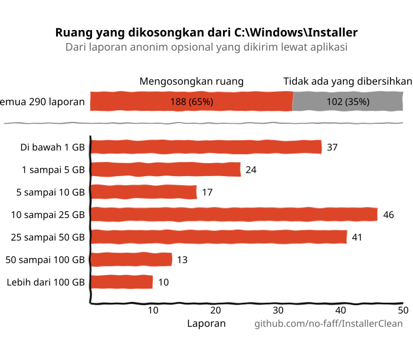
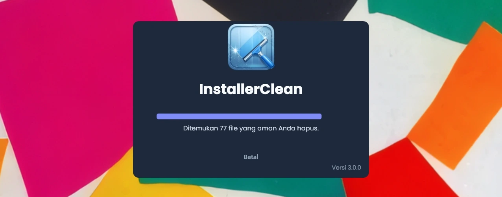
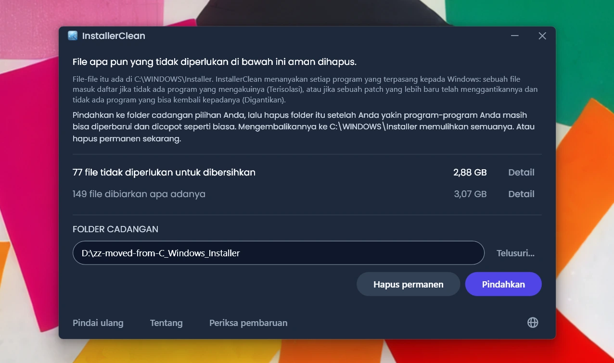
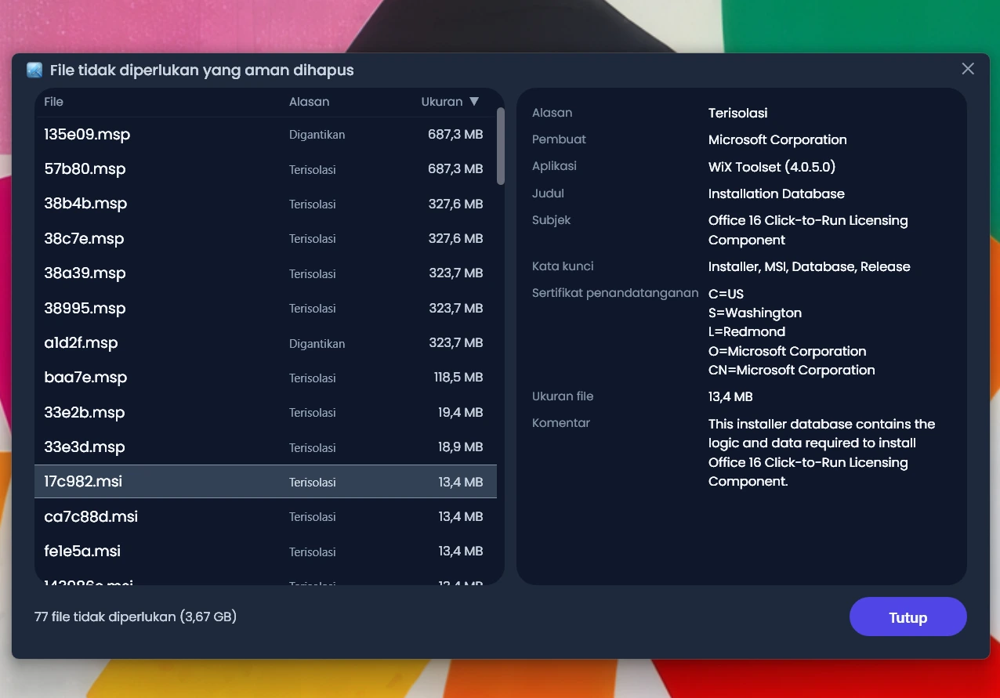
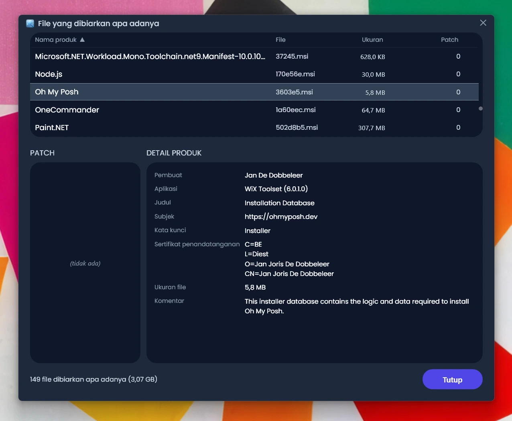
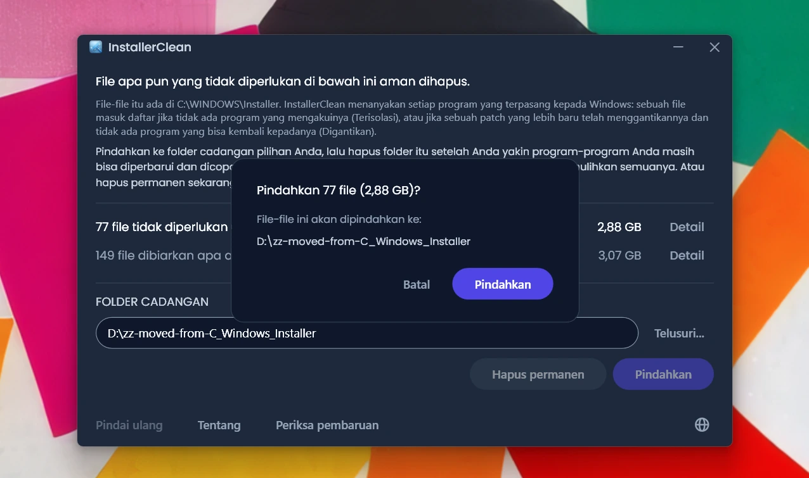
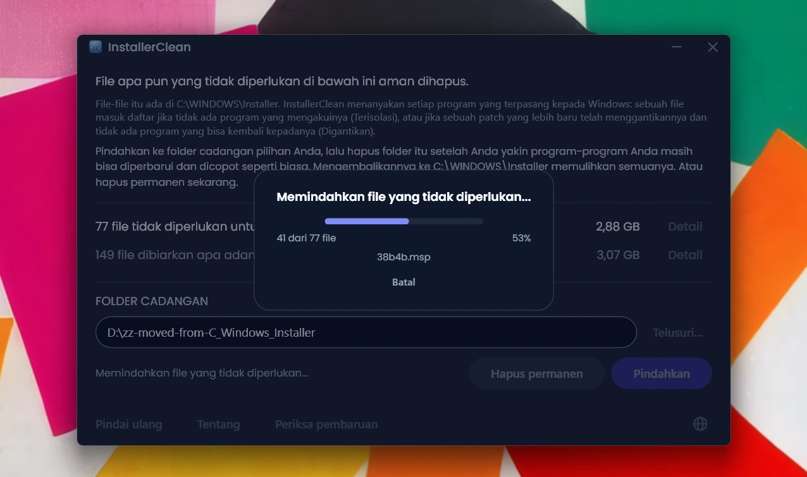
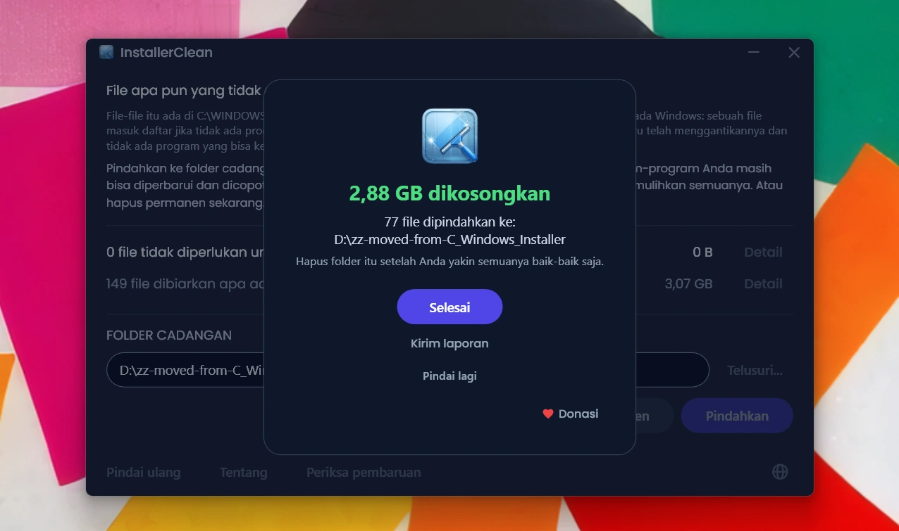

<p align="center">
  <a href="README.md">English</a> · <a href="README.zh-CN.md">简体中文</a> · <a href="README.ru.md">Русский</a> · <a href="README.es.md">Español</a> · <a href="README.ar.md">العربية</a> · <a href="README.ja.md">日本語</a> · <a href="README.pt-BR.md">Português (BR)</a> · <a href="README.pl.md">Polski</a> · <a href="README.tr.md">Türkçe</a> · <a href="README.ko.md">한국어</a> · <a href="README.fr.md">Français</a> · <a href="README.it.md">Italiano</a> · <a href="README.de.md">Deutsch</a> · <strong>Bahasa Indonesia</strong> · <a href="README.vi.md">Tiếng Việt</a> · <a href="README.uk.md">Українська</a> · <a href="README.nl.md">Nederlands</a>
</p>

<p align="center">
  
</p>

<p align="center"><em>🎶 What's my line? I'm happy <a href="https://www.youtube.com/watch?v=HM-jHhUZfFI">cleaning Windows</a></em></p>

<h1 align="center">InstallerClean</h1>

<p align="center"><strong>Alat sumber terbuka untuk membersihkan <code>C:\Windows\Installer</code> dengan aman, folder Windows tersembunyi yang diam-diam menggerogoti ruang disk Anda.</strong></p>

<p align="center"><em>Pakai sesekali saja. Mungkin sedikit ruang jadi lega. Lalu lanjutkan harimu, terasa bersih.</em></p>

<p align="center">
  <a href="LICENSE"></a>
  <a href="https://dotnet.microsoft.com/download/dotnet/10.0"></a>
  <a href="https://github.com/no-faff/InstallerClean/actions/workflows/ci.yml"></a>
  <a href="https://github.com/no-faff/InstallerClean/releases"></a>
  <a href="https://github.com/no-faff/InstallerClean/releases/latest"></a>
  <a href="https://github.com/no-faff/InstallerClean/releases"></a>
</p>

<a id="reports-stats"></a>

<!-- reports-stats-start chart-only (generated; do not hand-edit between these markers) -->
<p align="center">
  <picture>
    <source media="(prefers-color-scheme: dark)" srcset="docs/reports-id-dark.svg" />
    <source media="(prefers-color-scheme: light)" srcset="docs/reports-id-light.svg" />
    
  </picture>
</p>
<!-- reports-stats-end -->

- **Apa:** InstallerClean melakukan satu hal: menghapus file yang tidak diperlukan dari `C:\Windows\Installer`, folder tersembunyi yang terus terisi saat Anda memasang dan memperbarui perangkat lunak. Setelah pemindaian singkat, aplikasi memberi tahu Anda apakah ada file seperti itu, menampilkan detail lebih lanjut bagi yang penasaran, dan memungkinkan Anda memindahkannya ke tempat lain atau menghapusnya untuk mengosongkan ruang di drive C: Anda.
- **Mungkin Anda di sini karena:** Anda memakai [WinDirStat](https://github.com/windirstat/windirstat), WizTree atau TreeSize, melihat `C:\Windows\Installer` memakan banyak ruang, dan tidak tahu apa isinya. Kalau begitu, InstallerClean justru yang Anda butuhkan. Aplikasi ini tahu isi file dengan nama yang tampak acak seperti `9f05cba.msi` dan dengan cepat memberi tahu Anda mana yang aman untuk dihapus.
- **Berapa banyak ruang:** Diagram di atas menunjukkan hasil laporan opsional yang terus berdatangan sejak v1.8.0. (Terima kasih kepada semua yang sudah mengeklik tombolnya. Tanpa Anda, diagram di atas tidak akan ada.) Dari <!-- reports-freedpct-start -->64%<!-- reports-freedpct-end --> yang mengosongkan ruang, median yang dikosongkan adalah <!-- reports-median-start -->15,5 GB<!-- reports-median-end -->. <!-- reports-biggest-start -->Satu mesin bahkan mengosongkan 462 GB.<!-- reports-biggest-end --> Sisanya, <!-- reports-nothingpct-start -->36%<!-- reports-nothingpct-end -->, tidak mengosongkan apa pun, jadi hasilnya tergantung mesinnya: pemasangan Windows 11 yang masih bersih tanpa perangkat lunak tambahan tidak punya apa pun untuk dihapus. Yang paling banyak menyimpan file tidak diperlukan adalah mesin yang sudah bertahun-tahun dipakai, mesin dengan perangkat lunak berbasis MSI yang berat (Acrobat, Office, LibreOffice, alat pengembangan besar), dan siapa pun yang sering memasang dan mencopot perangkat lunak. Anda akan melihat persis berapa banyak begitu menjalankannya.
- **Apakah aman:** Ya. Yang disentuhnya hanya file di `C:\Windows\Installer`. Aplikasi menanyakan kepada Windows Installer apa yang masih diperlukan, dan membaca catatan yang sama dari registri juga. InstallerClean baru menawarkan sebuah file kalau tidak ada program terpasang di mesin ini yang mengakuinya, atau kalau patch yang lebih baru sudah menggantikannya dan tidak ada program di sini yang bisa kembali ke yang lama. Apa pun yang tidak bisa dijawab dengan jelas, ditahannya. [Selengkapnya di bawah](#cara-kerjanya).
- **Tidak ada apa pun soal Anda:** Sumber terbuka (Apache 2.0). Tanpa akun, tanpa iklan, tanpa pelacakan, tanpa telemetri, tidak ada yang berjalan di latar belakang. Satu-satunya hal yang dilakukannya secara daring atas inisiatifnya sendiri adalah memeriksa GitHub untuk versi yang lebih baru saat Anda menjalankannya, dan itu bisa Anda matikan.
- **Dapatkan:** [Unduh rilis terbaru](../../releases/latest). Jalankan; lewati [peringatan apa pun yang ditampilkan Windows](#unknown-publisher) dan [permintaan administrator](#admin). Pindahkan atau hapus apa yang ditemukannya. Selesai.

## Daftar isi

- [Folder yang tak pernah diberitahukan kepada Anda](#folder-yang-tak-pernah-diberitahukan-kepada-anda)
- [Mencari bantuan](#mencari-bantuan)
- [Apa yang dilakukan InstallerClean](#apa-yang-dilakukan-installerclean)
- [Tangkapan layar](#tangkapan-layar)
- [Cara kerjanya](#cara-kerjanya)
- [Unduh](#unduh)
  - [Memeriksa unduhannya sendiri](#memeriksa-unduhannya-sendiri)
- [FAQ](#faq)
- [Baris perintah](#baris-perintah)
- [Aksesibilitas](#aksesibilitas)
- [Kebijakan penandatanganan kode](#kebijakan-penandatanganan-kode)
- [Privasi](#privasi)
- [Apa yang tidak dilakukannya](#apa-yang-tidak-dilakukannya)
- [Alternatif](#alternatif)
- [Jika ada file yang hilang dari C:\Windows\Installer](#recovery)
- [Persyaratan](#persyaratan)
- [Membangun dari kode sumber](#membangun-dari-kode-sumber)
- [Berkontribusi](#berkontribusi)
- [Dukung proyek ini](#dukung-proyek-ini)
- [Riwayat bintang](#riwayat-bintang)
- [Lisensi](#lisensi)

---

## Folder yang tak pernah diberitahukan kepada Anda

Di setiap PC Windows ada folder tersembunyi bernama `C:\Windows\Installer`. Setiap kali Anda memasang perangkat lunak yang menggunakan sistem Windows Installer, atau menerapkan patch untuk Microsoft Office, Adobe Acrobat, Visual Studio atau aplikasi berbasis `.msi` lainnya, satu salinan penginstal atau file patch `.msp` itu masuk ke folder ini, dan menetap di sana.

Saat patch yang lebih baru menggantikan yang lama, keduanya tetap ada. Begitu pula penginstal perangkat lunak yang sudah lama Anda copot. Pembersihan Disk tidak menyentuh satu pun dari semua itu, begitu juga Sensor Penyimpanan. DISM ditujukan untuk folder yang sama sekali berbeda. Seiring waktu, folder ini membesar: 1 GB, 5 GB, 20 GB, 50 GB. Pada mesin dengan perangkat lunak berbasis MSI yang berat (Acrobat sering jadi biang keladinya), ukurannya bisa [melampaui 100 GB](https://www.reddit.com/r/sysadmin/comments/1oxcrmh/acrobat_filling_up_the_cwindowsinstaller_folder/).

Ini bukan file sementara yang muncul kembali dengan sendirinya. Ini benar-benar cuma beban mati: penginstal lama dari perangkat lunak yang Anda copot bertahun-tahun lalu dan patch yang sudah diganti berkali-kali. Begitu hilang, file-file ini tidak akan kembali.

**Jika Anda mencari cara mudah untuk mengosongkan ruang disk di Windows, folder ini tempat yang baik untuk memulai.** InstallerClean menemukan file yang tidak diperlukan dan menghapusnya dengan aman.

## Mencari bantuan

Jika Anda pernah mencari bantuan soal folder ini, Anda mungkin tahu bagaimana ceritanya. Seseorang dengan 180 GB di `C:\Windows\Installer` bertanya cara membersihkannya. Dia [disuruh menjalankan Pembersihan Disk](https://learn.microsoft.com/en-us/answers/questions/4238108/windows-installer-folder-has-occupied-180gb). Dia mencobanya. Cara itu mengosongkan 600 MB, tidak satu pun dari folder tersebut (karena Pembersihan Disk tidak menyentuh `C:\Windows\Installer`). Utasnya pun sepi.

> *"Semua utas yang saya temukan cenderung menyarankan hal-hal yang sama yang tidak menyelesaikan masalah, lalu mati begitu saja."*
>
> [ksparks519, r/Windows10](https://www.reddit.com/r/Windows10/comments/1bt8c5p/anyone_ever_figure_out_giant_installer_folders/) (diterjemahkan dari teks asli bahasa Inggris)

Atau mereka disuruh untuk tidak menyentuhnya sama sekali. Di satu utas, seseorang dengan folder Installer 60 GB disuruh untuk ["jangan utak-atik."](https://www.reddit.com/r/techsupport/comments/1hw4suq/my_windows_installer_folder_is_like_60gb_so_i/) Ketika dia bertanya apa yang sebaiknya dilakukan, jawabannya: *"Barusan sudah saya bilang."*

Nasihat standar mencampuradukkan dua hal yang berbeda. Menghapus file secara sembarangan membuat Anda tidak lagi bisa memperbarui atau mencopot program mana pun yang memiliki file-file itu. Menghapus hanya file yang tidak diakui oleh apa pun di mesin ini, atau yang dicatat Windows sudah digantikan, tidak begitu. InstallerClean melakukan yang kedua.

## Apa yang dilakukan InstallerClean

1. **Memindai** `C:\Windows\Installer` untuk mencari file `.msi` dan `.msp`
2. **Menanyakan** kepada Windows Installer apa yang masih diperlukan, dan membaca catatan yang sama dari registri juga
3. **Menahan** apa pun yang tidak bisa dipastikan oleh kedua pembacaan itu
4. **Memberi tahu berapa banyak yang bisa Anda kosongkan**, dan berapa banyak yang dibiarkannya apa adanya, dengan jendela detail opsional yang mendaftar setiap file
5. **Menghapus file yang tidak diperlukan**: pindahkan ke folder cadangan pilihan Anda, atau hapus permanen

## Tangkapan layar

<p>
  <br>
  <em>Pemindaian awal. Ini sangat cepat.</em>
  <br><br>
</p>

<p>
  <br>
  <em>Hasil: berapa banyak yang bisa dihapus, berapa banyak yang dibiarkan apa adanya.</em>
  <br><br>
</p>

<p>
  <br>
  <em>Detail file yang bisa dihapus: alasan tiap file tidak lagi diperlukan, dan apa yang dikatakan file itu tentang dirinya sendiri.</em>
  <br><br>
</p>

<p>
  <br>
  <em>Detail file yang dibiarkan apa adanya: program yang menurut Windows memiliki tiap file, dan apa yang dikatakan file itu tentang dirinya sendiri.</em>
  <br><br>
</p>

<p>
  <br>
  <em>Konfirmasi sebelum kedua tindakan. Pindahkan mencadangkan file ke folder pilihan Anda. Atau hapus permanen.</em>
  <br><br>
</p>

<p>
  <br>
  <em>Pemindahan sedang berjalan. Ke drive yang sama prosesnya seketika. Ke drive lain, makin besar GB-nya makin lama.</em>
  <br><br>
</p>

<p>
  <br>
  <em>Selesai. Ruangnya kembali. File tercadangkan sampai Anda yakin semuanya baik-baik saja. Setelah itu hapus folder cadangannya.</em>
  <br><br>
</p>

<p>
  <br>
  <em>Setelah pemindaian ulang. Tidak ada lagi yang perlu dibersihkan.</em>
  <br><br>
</p>

<a id="is-it-safe"></a>
## Cara kerjanya

Ketika Windows Installer memasang sebuah program, ia menyimpan salinan penginstalnya di `C:\Windows\Installer`, dan ketika sebuah patch didaftarkan untuk sebuah program, ia menyimpan salinan patch itu juga. Salinan-salinan itulah yang dipakainya ketika kelak ia memperbaiki, memperbarui atau mencopot perangkat lunak tersebut, dan karena itulah semuanya tetap ada lama setelah pemasangan selesai. Kedua jenis salinan berakhir di folder ini: penginstal `.msi`; dan patch `.msp`, yang memperbarui program yang sudah Anda punya alih-alih menggantinya.

InstallerClean menawarkan sebuah file karena salah satu dari dua alasan.

**Terisolasi** berarti tidak ada apa pun di mesin ini yang mengakui file tersebut. Tidak ada satu pun produk terpasang atau patch terdaftar yang menyebutnya.

**Digantikan** berarti Windows sudah mencatat bahwa sebuah patch yang lebih baru menggantikan patch ini, dan tetap menyimpan file-nya. Sebuah patch baru dihapus setelah setiap program yang mendaftarkannya dicopot, atau setelah patch itu dilepas dari semuanya. Digantikan oleh yang lebih baru bukan salah satu dari keduanya, jadi file-nya tetap ada. Adobe Acrobat bekerja seperti ini di Windows: pembaruannya datang sebagai patch atas pemasangan dasar, bukan sebagai penginstal baru, sehingga mesin yang sudah lama memakainya bisa menyimpan beberapa sekaligus.

InstallerClean menyelesaikan keduanya dari arah yang berlawanan, dan hanya yang pertama yang sampai perlu melihat ke dalam folder itu.

**Mendaftar isi folder.** InstallerClean mendaftar file `.msi` dan `.msp` yang berada langsung di dalam `C:\Windows\Installer`. Aplikasi tidak masuk ke subfoldernya.

**Membaca catatan, dua kali.** Aplikasi menanyakan kepada Windows Installer setiap produk yang terpasang dan setiap patch yang terdaftar, berikut file cache yang disebut masing-masing, dengan memanggil Windows Installer API di `msi.dll`. Lalu ia membaca catatan yang sama dengan cara kedua, langsung dari registri, karena pertanyaan tadi bisa kembali kurang lengkap tanpa mengatakannya: Windows menyerahkan catatannya satu per satu sampai ia mengatakan tidak ada lagi, dan proses yang berhenti di catatan ketiga dari dua ratus tampak persis seperti proses yang sampai ke ujung. Sebuah kunci registri menyerahkan seluruh daftar namanya sekaligus, jadi daftar yang pendek tidak mungkin tampak lengkap. Setiap produk yang disebut registri dan terlewat oleh pertanyaan tadi kemudian diajukan kembali ke Windows berdasarkan namanya, satu per satu. Pembacaan kedua ini hanya bisa memindahkan file ke sisi "masih diperlukan". Tidak ada jalur yang membuat pembacaan itu menaruh sebuah file ke dalam daftar yang akan dihapus.

**Mencocokkan sebuah catatan dengan file-nya.** Sebuah catatan menyebut file cache-nya sebagai sebuah jalur, dan folder yang sama tidak selalu dieja sama di dalam catatan-catatan itu. Jadi alih-alih memercayai ejaannya, InstallerClean bertanya kepada Windows ke mana sebenarnya setiap jalur yang tercatat itu menunjuk, lalu membandingkannya dengan file yang sudah didaftar InstallerClean di folder tadi. Apa pun yang masih tak diakui mendapat perbandingan kedua yang sama sekali tidak lewat nama: aplikasi membuka file-nya dan meminta Windows mengidentifikasinya, sehingga dua nama berbeda untuk satu file yang sama dikenali sebagai satu file.

**Catatan yang tidak bisa dicocokkan.** Kalau Windows tidak mau mengatakan ke mana sebuah jalur yang tercatat menunjuk, atau file di ujung jalur itu tidak bisa diidentifikasi, InstallerClean tidak tahu file mana yang dimaksud catatan tersebut, dan file mana pun yang sudah didaftar InstallerClean bisa jadi file itu. Hal yang sama berlaku kalau sebuah program mungkin dipasang lebih dari sekali, karena aplikasi lalu tidak bisa membedakan file cache mana milik salinan yang mana. Kalau salah satu keadaan itu terjadi, aplikasi tidak menawarkan satu pun file yang ditemukannya dengan mendaftar folder pada kesempatan tersebut. Catatan yang menunjuk ke file yang sudah hilang berbeda halnya: tidak ada lagi yang tersisa untuk dimaksudkannya, jadi catatan itu tidak mungkin berbicara tentang file mana pun yang masih ada di folder.

**Bertanya dari ujung yang lain.** File terisolasi ditentukan oleh sebuah ketiadaan, dan sebuah ketiadaan juga bisa berarti aplikasi gagal menemukan catatannya. Jadi sebelum menawarkan sebuah penginstal `.msi`, InstallerClean membuka file-nya, membaca kode produk yang dibawa file itu sendiri, dan menanyakan kepada Windows apakah produk tersebut terpasang. Kalau terpasang, file-nya tetap, apa pun yang ditemukan sisa pemindaian. Pemeriksaan itu hanya bisa mengeluarkan file dari daftar. Tidak ada jawaban yang bisa memasukkannya.

**Apa yang menentukan sebuah patch `.msp`.** Sebuah patch tidak dibuka lalu ditanya milik program mana. Yang menentukannya justru bahwa sebuah pendaftaran patch menyebut file cache-nya di dua tempat: patch yang terdaftar untuk tiap produk; dan satu daftar registri berisi setiap pendaftaran patch di mesin ini. Sebuah patch baru ditawarkan sebagai terisolasi kalau tidak satu pun dari kedua tempat itu menyebut file cache tersebut.

**Bedanya pada patch yang digantikan.** Patch itu tidak melalui satu pun dari semua di atas, karena ia bukan file yang tak diakui. Windows punya catatan tentangnya, dan catatan itulah yang mengatakan bahwa ia sudah diganti. Risikonya berbeda: sebuah patch bisa terdaftar untuk beberapa program sekaligus, dan baru satu di antaranya yang selesai dengannya. Jadi sebuah patch yang digantikan baru ditawarkan kalau Windows mencatat bahwa patch itu tidak bisa dicopot, setiap program yang mendaftarkannya sudah ditanya, tidak satu pun dari program itu masih menerapkannya, dan tidak satu pun memegang patch yang menurut Windows bisa dicopot. Syarat terakhir ada di sana karena membatalkan sebuah patch pada sebuah program bisa mencari kembali file yang lama. Kalau ada satu saja dari itu yang tidak bisa dijawab, file-nya tetap.

<details>
<summary>Panggilan Windows Installer yang dipakainya</summary>

- `MsiEnumProductsEx` untuk mendaftar setiap produk yang terpasang, dan sekali lagi dengan satu kode produk untuk menanyakan apakah satu produk tertentu terpasang
- `MsiEnumPatchesEx` untuk mendaftar patch yang terdaftar, baik per produk maupun untuk seluruh mesin
- `MsiGetProductInfoEx` untuk membaca nama sebuah produk, file cache yang disebutnya, dan apakah ia salah satu dari beberapa pemasangan produk yang sama
- `MsiGetPatchInfoEx` untuk membaca keadaan sebuah patch, apakah Windows bisa mencopotnya, dan file cache yang disebutnya
- `MsiGetSummaryInformation` dan `MsiSummaryInfoGetProperty` untuk membaca dari sebuah file patch program mana saja yang bisa menerapkannya
- `MsiOpenDatabase`, `MsiDatabaseOpenView`, `MsiViewExecute`, `MsiViewFetch` dan `MsiRecordGetString` untuk membaca dari sebuah file penginstal kode produk yang dinyatakannya

</details>

Meski begitu, aplikasi menganjurkan Anda memindahkan file ke folder cadangan (di drive atau partisi lain kalau yang Anda cari adalah ruang kosong di C). Dengan begitu Anda punya kesempatan meyakinkan diri bahwa semuanya memang baik-baik saja sebelum akhirnya menghapus file yang tidak diperlukan itu.

## Unduh

Tiga varian, pilih salah satu:

- **Portable** (`InstallerClean-3.0.0-portable.exe`): satu file, dengan runtime .NET 10 di dalamnya. Tanpa pemasangan, tanpa pencopotan: klik dua kali dan aplikasi berjalan. Simpan file-nya di suatu tempat untuk lain kali, atau hapus setelah Anda selesai.
- **Setup** (`InstallerClean-3.0.0-setup.exe`): penginstal Windows biasa dengan runtime .NET 10 di dalamnya. Menambahkan entri di menu Mulai dan bisa dicopot dengan bersih. Tertata rapi di daftar Program agar mudah ditemukan enam bulan dari sekarang, atau dijalankan lebih sering dari itu kalau Anda banyak memasang dan mencopot perangkat lunak.
- **CLI** (`installerclean-cli.exe`): versi baris perintah tersendiri, satu file dengan runtime di dalamnya. Tanpa pemasangan, tanpa pencopotan. Taruh di sebuah komputer klien, jalankan pemindaian atau pembersihan, lalu hapus. Dibuat untuk skrip, tugas terjadwal dan penyebaran massal, ketika yang Anda inginkan adalah operasinya tanpa aplikasi desktop di klien. Lihat [Baris perintah](#baris-perintah) untuk argumen dan kode keluar.

Mulai 2.2.0, nama file setup dan portabel memuat nomor versinya, sehingga salinan yang diunduh selalu menyebutkan dirinya apa; CLI tetap memakai nama polos `installerclean-cli.exe` agar tugas terjadwal dan skrip yang menunjuk ke sana tetap berjalan dari satu pembaruan ke pembaruan berikutnya.

Unduh dari [halaman rilis](../../releases/latest), lalu jalankan. Aplikasi ini tidak ditandatangani, jadi Windows menampilkan peringatan "unknown publisher"; [FAQ](#unknown-publisher) menjelaskan apa yang akan Anda lihat dan mengapa itu aman.

Aplikasi memindai secara otomatis saat dimulai. Tinjau hasilnya, lalu klik **Pindahkan** atau **Hapus permanen**.

Atau pasang melalui [winget](https://learn.microsoft.com/windows/package-manager/winget/):

```
winget install NoFaff.InstallerClean
```

Atau pasang melalui [Scoop](https://scoop.sh):

```
scoop install installerclean
```

### Memeriksa unduhannya sendiri

InstallerClean tidak ditandatangani. Berikut yang bisa Anda periksa sebelum menjalankannya:

- SHA-256 setiap unduhan ada di halaman rilisnya, baik di catatan rilis maupun sebagai file `.sha256` terpisah di samping unduhannya.
- VirusTotal: setiap build dipindai sebelum dirilis, dan halaman rilis memuat hasil lengkap per mesin pemindai untuk tiap unduhan.
- Kode sumbernya ada di sini, di [github.com/no-faff/InstallerClean](https://github.com/no-faff/InstallerClean). Layanan pindai, kueri, pindah, hapus, pengaturan dan mulai-ulang-tertunda dicakup oleh rangkaian pengujian otomatis yang berjalan di Windows pada setiap push ke `main` dan pada setiap pull request, dan lencana CI di bagian atas halaman ini melaporkan hasilnya.
- Build rilis bersifat deterministik: kode sumber yang sama, SDK yang sama dan flag publish yang sama menghasilkan byte yang sama, dan sebuah rilis tidak bisa diberi tag kecuali setiap masukan build cocok dengan kode sumber pada tag tersebut. Jadi Anda bisa checkout tag itu, membangunnya sendiri, lalu membandingkan hash-nya dengan yang dipublikasikan. Catatan tiap rilis memuat apa yang Anda perlukan untuk itu: versi SDK yang dipakai membangunnya, dan flag publish untuk unduhan mana pun yang tidak dibangun dengan flag bawaan. Setup adalah pengecualiannya: ia dikompilasi oleh Inno Setup dan bukan oleh SDK, dan menanamkan tahun pembuatan ke dalam dirinya sendiri, jadi mereproduksi hash-nya juga memerlukan versi Inno yang sama dan tahun kalender yang sama.
- <!-- downloads-start -->78.000+<!-- downloads-end --> unduhan di GitHub, MajorGeeks dan Softpedia.
- [MajorGeeks](https://www.majorgeeks.com/files/details/installerclean.html) menguji tiap kiriman di mesin virtual dan hanya mendaftarkannya kalau lolos tinjauan mereka.<br><a href="https://www.majorgeeks.com/files/details/installerclean.html"></a>
- [Softpedia](https://www.softpedia.com/get/System/Hard-Disk-Utils/InstallerClean.shtml) meninjaunya dan menyatakannya bebas spyware, adware dan virus.<br><a href="https://www.softpedia.com/get/System/Hard-Disk-Utils/InstallerClean.shtml"></a>

## FAQ

<a id="admin"></a>

**Mengapa aplikasi meminta hak Administrator?** Dua alasan. `C:\Windows\Installer` dikunci hanya untuk administrator, jadi membacanya, menanyai Windows Installer dan memindahkan atau menghapus file semuanya memerlukan hak itu. Dan seorang administrator boleh menanyakan kepada Windows tentang program yang terpasang di bawah akun mana pun di mesin ini, sementara yang bukan administrator tidak boleh: jalankan tanpa hak itu dan Windows akan mengatakan sebuah program tidak terpasang padahal terpasang, tepat di dalam pemeriksaan yang menentukan apakah sebuah file masih diperlukan.

<a id="unknown-publisher"></a>

**Mengapa Windows mengatakan "Unknown publisher"?** InstallerClean tidak ditandatangani secara digital, dan Windows menandai file yang diunduh dari internet, sehingga pada kali pertama dijalankan SmartScreen biasanya menampilkan "Windows protected your PC" dengan penerbit tertera sebagai tidak dikenal. Sertifikat penandatanganan berbayar memakan biaya setiap tahun dan saya lebih memilih aplikasinya tetap gratis daripada membayarnya, jadi saya mengajukan permohonan ke SignPath Foundation, yang menandatangani perangkat lunak sumber terbuka secara cuma-cuma, dan InstallerClean sudah diterima (lihat [Kebijakan penandatanganan kode](#kebijakan-penandatanganan-kode)). Sertifikatnya belum diterbitkan jadi, untuk sekarang, klik **More info**, lalu **Run anyway**. Aman untuk dilakukan: kode sumbernya publik, dan tiap rilis punya tautan VirusTotal serta hash SHA-256 yang bisa Anda periksa lebih dulu.

**Apakah berfungsi di Windows 7 atau 8?** Tidak. Aplikasi memerlukan Windows 10 versi 1607 atau yang lebih baru, build tertua yang didukung runtime .NET 10. Setup menolak memasang di versi yang lebih lama dan build portabel tidak akan mau dijalankan.

## Baris perintah

`installerclean-cli.exe` adalah executable konsol terpisah, dipasang berdampingan dengan GUI. Pemindaian yang sama, pemindahan yang sama, penghapusan yang sama, tanpa jendela. Ia menahan prompt sampai selesai, jadi sebuah skrip atau tugas terjadwal bisa menunggunya.

### Flag

| Flag | Fungsinya | Juga menerima |
|---|---|---|
| `/s` | Pindai saja. Mendaftar apa yang akan dihapusnya, dengan nama, ukuran dan alasan untuk tiap file. Tidak mengubah apa pun. | |
| `/d` | Pindai, lalu hapus file yang tidak diperlukan secara permanen. | |
| `/m` | Pindai, lalu pindahkan ke folder yang tersimpan di GUI. | |
| `/m JALUR` | Pindai, lalu pindahkan ke `JALUR`. Apit dengan tanda kutip kalau ada spasi di dalamnya. | |
| `--help` | Cetak cara pakai lalu keluar dengan `0`. | `/?`, `-h` |
| `--version` | Cetak versi lalu keluar dengan `0`. | `-v` |

Flag tidak membedakan huruf besar dan kecil, jadi `/S` dan `/D` berfungsi sama seperti `/s` dan `/d`. Hanya satu flag per proses: flag tidak bisa digabungkan, dan `/s` serta `/d` tidak menerima apa pun sesudahnya.

Jalankan tanpa argumen dan ia mencetak cara pakai lalu keluar dengan `1`, sehingga tugas terjadwal yang kehilangan flag-nya gagal secara kasatmata alih-alih diam-diam tidak melakukan apa-apa. Flag yang tidak dikenalinya mencetak satu baris kesalahan, lalu cara pakai, dan juga keluar dengan `1`. Jalur pemindahan yang mengandung spasi tanpa tanda kutip ditolak dengan cara yang sama alih-alih dipotong diam-diam, dan pesannya memberi tahu Anda untuk mengapitnya dengan tanda kutip.

### Kode keluar

Ini kode-kode yang didokumentasikan alat itu sendiri di `--help`:

| Kode | Artinya |
|---|---|
| `0` | Berhasil. Proses melakukan apa yang diminta dan tidak ada yang gagal. |
| `1` | Tidak ada yang diproses. Proses gagal, atau ditolak. |
| `2` | Sebagian. Sebagian diproses, sebagian tidak, termasuk Ctrl+C di tengah jalan. |
| `75` | Sementara. Sebuah kondisi sementara memblokir proses; pesan yang dicetak menyebutkan yang mana. |
| `130` | Dibatalkan dengan Ctrl+C sebelum ada apa pun yang diproses. |

`1` mencakup penolakan sekaligus kegagalan, dan penolakan bukanlah sebuah cacat: tujuan yang kebetulan penuh, atau nilai registri yang tidak bisa dibaca aplikasi sebelum menyentuh apa pun, keduanya berakhir di sini. `0` berarti tidak ada yang gagal, bukan berarti tidak ada yang tersisa: `--help`, `--version` dan proses pindai-saja semuanya keluar dengan `0` entah pemindaiannya menemukan enam puluh delapan file atau tidak sama sekali.

### Log peristiwa

Setiap proses menulis satu entri hasil ke log Application, dan bisa menambahkan satu atau beberapa pemberitahuan di sampingnya. Event ID adalah kontrak mesin yang stabil, jadi sebuah RMM bisa menyaring berdasarkan angkanya tanpa mengurai teks apa pun:

| ID | Artinya |
|---|---|
| `1000` | Berhasil |
| `1002` | Sebagian |
| `2000` | Dilewati, sementara |
| `4000` | Kegagalan total |
| `3000` | Pemberitahuan: pemindaian tidak bisa mendata setiap produk yang terpasang |
| `3001` | Pemberitahuan: file yang diharapkan Windows tidak ada di folder |
| `3002` | Pemberitahuan: ada file yang ditahan alih-alih ditawarkan |

Rentang `3000` adalah pemberitahuan dan bukan hasil, dan tidak dihitung sebagai hasil proses. Jenis entrinya adalah Information kalau tidak ada yang salah dengan prosesnya dan Warning kalau ada. **Log peristiwa selalu dalam bahasa Inggris**, apa pun bahasa tampilan mesinnya, sehingga pencarian pada frasa yang sudah diketahui punya sasaran yang stabil. Yang diterjemahkan adalah konsolnya: ia mengikuti bahasa mesin itu sendiri, dan menulis ukuran serta tanggal menurut wilayahnya.

### Contoh penggunaan

Mengaudit ke sebuah file, tanpa mengubah apa pun:

```
installerclean-cli /s > audit.txt
```

Pemindahan bulanan ke `D:\InstallerBackup`, dengan CLI ditaruh di `C:\Tools`:

```
schtasks /create /tn "InstallerClean monthly" /tr "C:\Tools\installerclean-cli.exe /m D:\InstallerBackup" /sc monthly /ru SYSTEM /rl highest
```

Tugas itu menahan sampai prosesnya selesai dan mencatat kode keluar sebagai Last Run Result miliknya, jadi sebuah RMM bisa berpatokan pada kode-kode di atas.

Dari PowerShell:

```powershell
& 'C:\Tools\installerclean-cli.exe' /m D:\InstallerBackup
switch ($LASTEXITCODE) {
    0       { 'Bersih' }
    2       { 'Sebagian, periksa keluarannya' }
    75      { 'Terblokir, coba lagi nanti' }
    default { "Gagal ($LASTEXITCODE)" }
}
```

### Sebelum Anda memasukkannya ke dalam skrip

- **Ia memerlukan elevasi.** Semuanya, termasuk `/s`. Dari prompt yang tidak ditinggikan, Windows menolak menjalankannya dan menyerahkan `740` ke shell Anda.
- **Folder yang tersimpan di GUI bersifat per-pengguna.** Tugas yang berjalan sebagai SYSTEM atau akun layanan tidak akan melihatnya, jadi proses seperti itu harus menyertakan `/m JALUR`.
- **SYSTEM menjangkau jaringan sebagai akun mesin**, jadi tujuan `\\server\share` memerlukan hak yang diberikan kepada akun itu.
- **`/s` tidak pernah memblokir.** Ia hanya membaca dan tidak mengambil kunci, jadi Anda bisa memindai selagi aplikasi desktop terbuka. `/d` dan `/m` mengambil kunci untuk seluruh mesin dan keluar dengan `75` kalau proses InstallerClean lain sedang memegangnya.
- **Semuanya masuk ke stdout**, termasuk kesalahan; tidak ada stderr. Berpatokanlah pada kode keluar alih-alih mengurai teksnya.
- **Pemindahan menolak alih-alih mengganti nama.** Kalau tujuan sudah berisi file dengan nama itu, file tersebut dibiarkan di cache dan disebut dalam keluarannya, dan sisa batch tetap dipindahkan. Proses yang setiap file-nya bertabrakan tidak memproses apa pun dan keluar dengan `1`.
- **Tidak ada yang mengosongkan folder cadangan.** `/m` hanya pernah menambah. Folder itu perlu Anda bersihkan sendiri.
- **`taskkill /pid` bukan pembatalan yang mulus.** Proses berikutnya memulihkan kunci instans-tunggal.
- **Proses pertama mendaftarkan sebuah sumber log peristiwa**, di `HKLM\SYSTEM\CurrentControlSet\Services\EventLog\Application\InstallerClean`. Biarkan di sana: Pemantau Peristiwa membaca deskripsi sebuah entri melalui sumbernya, jadi menghapusnya mengubah setiap entri yang sudah ditulis alat ini menjadi kesalahan sumber-tidak-dikenal.

### Mengapa `installerclean-cli` dan bukan `installerclean.exe`

`InstallerClean.exe` adalah jendelanya, dan ia mengabaikan argumen baris perintah. `installerclean-cli.exe` adalah proses konsol sungguhan, jadi ia menahan prompt sampai selesai dan bisa dialihkan serta disalurkan seperti executable konsol lainnya. Setup memasang keduanya. Unduhan portabel hanya berisi GUI; unduh `installerclean-cli.exe` tersendiri dari [halaman rilis](../../releases/latest) kalau Anda ingin baris perintah tanpa jendela.

## Aksesibilitas

InstallerClean dibuat agar sepenuhnya bisa digunakan dari keyboard dan dengan pembaca layar.

- **Bisa dioperasikan sepenuhnya dengan keyboard.** Semua yang dilakukan aplikasi bisa dijangkau dari keyboard, dan kolom jendela detail juga bisa diurutkan dari keyboard, jadi tidak ada di sini yang memerlukan mouse. Tombol-tombol di bilah judul berperilaku seperti milik Windows dan dijangkau dengan Alt+Space atau Alt+F4. Fokus keyboard tetap terlihat di mana pun ia berada.
- **Narator dan Akses Suara.** Setiap kontrol diberi label, dan kata yang terlihat pada sebuah tombol adalah kata yang mengaktifkannya lewat suara. Saat Pindahkan atau Hapus selesai, hasilnya dibacakan.
- **Dirancang untuk dibaca.** Teks memenuhi kontras WCAG AA di seluruh tema gelap.

Jika ada sesuatu di sini yang menghalangi Anda, [buka sebuah issue](../../issues). Masalah aksesibilitas adalah bug, bukan kasus pinggiran.

## Kebijakan penandatanganan kode

InstallerClean sudah diterima oleh [SignPath Foundation](https://signpath.org) untuk penandatanganan kode gratis, sebuah program yang menandatangani perangkat lunak sumber terbuka supaya perangkat lunak itu tidak lagi sampai ke mesin Anda dari penerbit yang tidak dikenal. Sertifikatnya sendiri belum diterbitkan, jadi unduhan di sini hari ini belum ditandatangani dan Windows akan memperingatkan Anda soal itu.

Setelah diterbitkan, tiap rilis akan mencantumkan baris yang diminta SignPath: free code signing provided by SignPath.io, certificate by SignPath Foundation. Sertifikatnya milik yayasan dan bukan milik saya, karena sertifikat harus diterbitkan atas nama sebuah badan hukum, dan proyek satu orang bukan badan hukum. Ini bukan berarti InstallerClean milik mereka, atau bahwa mereka terlibat di dalamnya lebih jauh dari sekadar penandatanganan.

**Peran.** InstallerClean punya satu pengelola. Yang menulis dan meninjau kode, yaitu siapa yang bisa memasukkan kode ke dalam proyek ini: saya. Yang menyetujui, yaitu siapa yang bisa mengizinkan sebuah rilis ditandatangani: saya.

## Privasi

Laporan opsional adalah satu-satunya hal yang pernah mengirimkan apa pun tentang sebuah proses, dan ia baru berangkat kalau Anda menekan tombolnya. Isinya: apa yang ditemukan pemindaian, apa yang ditahannya dan mengapa, apakah Anda memindahkan atau menghapus, berapa banyak yang dikosongkan, berapa lama waktunya, dan apa pun yang gagal, berikut versi aplikasi, bahasa yang Anda pakai membacanya dan versi Windows Anda. Tanpa nama file, tanpa nama folder, tanpa nama akun, tidak ada yang mengidentifikasi mesin Anda dan tidak ada yang bisa mengaitkan dua laporan satu sama lain. Begitulah cara saya tahu apakah aplikasinya berfungsi, dan apa yang ditahannya, di mesin selain milik saya sendiri.

Tanpa iklan, tanpa telemetri. Satu-satunya sambungan lain adalah pemeriksaan versi saat aplikasi dimulai (satu permintaan ke GitHub yang bisa Anda matikan di jendela Tentang) dan tombol-tombol yang menautkan ke GitHub dan ke halaman tempat Anda bisa berdonasi kalau sedang berbaik hati. [Kebijakan privasi](PRIVACY.md) selengkapnya (dalam bahasa Inggris).

## Apa yang tidak dilakukannya

- WinSxS (`C:\Windows\WinSxS`) adalah folder berbeda dengan aturan berbeda. Untuk folder itu, jalankan `Dism /Online /Cleanup-Image /StartComponentCleanup` dari prompt yang ditinggikan.
- Tanpa layanan latar belakang, tanpa tugas terjadwal, tanpa pembersihan otomatis. Aplikasi berjalan ketika Anda menjalankannya.
- Aplikasi tidak mengubah program yang terpasang atau basis data Windows Installer, hanya membacanya. Satu-satunya hal yang pernah ditulisnya ke registri adalah pendaftaran sumber peristiwa sekali saja yang dibutuhkan alat baris perintah agar prosesnya bisa muncul di Log Peristiwa Windows.
- Ada satu jenis sambungan yang dibuatnya atas inisiatifnya sendiri: pemeriksaan cepat ke halaman rilis GitHub untuk versi yang lebih baru saat Anda menjalankannya, yang bisa Anda matikan di jendela Tentang. Selebihnya hanya terjadi ketika Anda memerintahkannya: laporan anonim opsional (angka-angka tentang prosesnya, tidak ada yang menyebut nama Anda atau file Anda) serta tautan ke dokumentasi GitHub dan halaman donasi, yang terbuka di peramban Anda kalau Anda mengekliknya. Aplikasi tidak pernah mengunduh apa pun dengan sendirinya.
- Tanpa bilah alat, tanpa perangkat lunak yang dibundel, tanpa adware.

## Alternatif

Kalau Anda pernah mencari-cari soal folder ini sebelumnya, alat yang paling mungkin Anda temukan adalah [PatchCleaner](https://www.homedev.com.au/free/patchcleaner). Alat itu mengerjakan pekerjaan ini lebih dulu, mengerjakannya selama satu dekade sebelum InstallerClean ada, sampai sekarang masih bertahan kuat, dan InstallerClean tidak akan ada tanpanya.

Saya membuat InstallerClean karena PatchCleaner bersumber tertutup, tidak mendapat pembaruan sejak Maret 2016, dan mengecualikan file Adobe secara bawaan. Pengecualian itu ada karena alasan yang baik, dan HomeDev mengatakannya dengan gamblang di catatan rilis saat itu:

> *"Ada masalah yang diketahui pada versi-versi sebelumnya, yaitu PatchCleaner keliru mengidentifikasi patch Adobe Acrobat Reader sebagai tidak diperlukan. Adobe melakukan sesuatu yang sifatnya proprietary dalam pembaruan otomatis mereka, sehingga kalau PatchCleaner menghapus patch 'yatim' dari direktori Installer, pembaruan otomatis Adobe Reader tidak akan berhasil dipasang lagi."*
>
> [Catatan rilis PatchCleaner, versi 1.4.0.0](https://www.homedev.com.au/free/patchcleaner) (diterjemahkan dari teks asli bahasa Inggris)

Filter yang dipasang bersama pengecualian itu mencari kata "Acrobat" di metadata sebuah file dan di tanda tangannya. Pada mesin di mana Acrobat adalah biang keladi terparah, itu bisa berarti sebagian besar ruangnya:

> *"Saya sudah mengunduh Patchcleaner untuk menghapus file .msp yang yatim, tetapi tampaknya ini hanya akan mengosongkan 250 MB ruang. 29 GB dari file-nya 'dikecualikan oleh filter', jadi Patchcleaner sepertinya tidak membantu."*
>
> HeatherBunny1111, [r/techsupport](https://www.reddit.com/r/techsupport/comments/1qc4tcf/how_to_delete_msp_files_safely/) (diterjemahkan dari teks asli bahasa Inggris)

Perbedaan antara kedua alat di sini adalah apa yang masing-masing tanyakan kepada Windows, bukan perbedaan pendapat tentang Adobe. Daftar yang dipegang Windows tentang patch mana saja yang *diterapkan* pada sebuah produk tidak memuat patch yang sudah digantikan oleh yang lebih baru, jadi alat yang membaca daftar itu bertemu file sebuah patch yang digantikan sebagai file yang tidak diakui apa pun, sama seperti file mana pun lainnya. Filter pengecualian itulah yang menangkap patch Adobe berdasarkan namanya. InstallerClean justru menanyakan keadaan patch kepada Windows, jadi sebuah patch yang digantikan datang dengan label itu, dan apa yang terjadi padanya ditentukan oleh apa yang dicatat Windows tentangnya alih-alih oleh apa yang dikatakan namanya. Berikut perbandingan keduanya:

| | **InstallerClean** | **PatchCleaner** |
|---|---|---|
| Terakhir diperbarui | 2026 (aktif) | 3 Maret 2016 |
| Kode sumber | Sumber terbuka (Apache 2.0) | Sumber tertutup |
| Runtime | .NET 10 (mandiri) | .NET Framework 4.5.2 + VBScript |
| API | Windows Installer API di `msi.dll` (dalam proses) | Windows Installer COM (di luar proses, via VBScript) |
| Patch yang digantikan | Dikenali dari catatan patch milik Windows | Tidak dibedakan dari file yang tidak diakui |
| File Adobe | Patch yang digantikan dideteksi dan dilabeli | Dikecualikan oleh filter nama, aktif secara bawaan |

> **Catatan tentang `Win32_Product`:** Pendekatan yang umum tetapi cacat untuk mendaftar produk yang terpasang adalah `Win32_Product` (WMI), yang [memicu operasi perbaikan MSI](https://gregramsey.net/2012/02/20/win32_product-is-evil/) pada setiap produk selama enumerasi. Baik InstallerClean maupun PatchCleaner menghindarinya. InstallerClean memanggil Windows Installer API di `msi.dll`; PatchCleaner menjalankan skrip bantu yang memakai objek COM Windows Installer. Skrip itu bernama `WMIProducts.vbs`, yang membuatnya tampak sebaliknya, tetapi file itu adalah skrip contoh Microsoft sendiri dengan satu perubahan, dan ia menanyai Windows Installer alih-alih WMI. Namanya adalah satu-satunya hal yang menyesatkan tentangnya.

Pembersihan Disk, Sensor Penyimpanan, CCleaner dan BleachBit tidak membersihkan `C:\Windows\Installer`.

<a id="recovery"></a>
## Jika ada file yang hilang dari `C:\Windows\Installer`

Kalau memang ada file yang hilang dari folder itu, program pemiliknya tetap berjalan normal. Tetapi ketika Anda mencoba memperbarui atau mencopot program tersebut, kemungkinan besar prosesnya gagal. Windows mencari file itu, tidak menemukannya, dan langkahnya berhenti.

Seluruh tujuan InstallerClean adalah hanya menawarkan pemindahan atau penghapusan file yang *tidak* diperlukan, tetapi aplikasi memang tahu kapan sebuah file hilang, jadi ia menandai setiap file yang ditemukannya dengan segitiga peringatan dan tautan yang menunjuk ke sini. Inilah yang harus dilakukan untuk mencoba memperbaiki programnya:

- Cari tahu nomor versi program yang terpasang itu (Pengaturan, Aplikasi, Aplikasi terinstal)
- Unduh penginstal **untuk versi itu** dari pembuatnya. Yang lebih baru tidak akan berhasil, begitu pula mencopot lebih dulu: keduanya harus menghapus apa yang terpasang sebelum bisa melanjutkan, dan penghapusan itulah langkah yang membutuhkan file yang hilang tadi.
- Jalankan penginstal itu
- Itu semestinya memulihkan file tersebut dan membiarkan pengaturan Anda apa adanya. Pindai ulang di InstallerClean dan peringatannya akan hilang kalau berhasil.

Namun Microsoft tidak menjamin cara itu akan berhasil. Berikut penjelasan Microsoft sendiri yang lebih lengkap:

<details>
<summary>Penjelasan Microsoft yang lebih lengkap</summary>

*Kutipan Microsoft berikut tetap dalam teks asli bahasa Inggris.*

Panduan lengkap: [Restore missing Windows Installer cache files](https://learn.microsoft.com/en-us/troubleshoot/windows-client/application-management/missing-windows-installer-cache), KB 2667628.

*Mungkin tidak langsung muncul:*
> "If the installer cache is compromised, you may not immediately see problems until you take an action such as uninstalling, repairing, or updating a product."

*File bersifat unik per mesin, jadi Anda tidak bisa menyalinnya dari PC lain:*
> "Missing files cannot be copied between computers because the files are unique."

*Kalau Anda punya cadangan yang dibuat sebelum file itu hilang, Microsoft menyebutkan empat jalan, dengan urutan ini:*
> - System Restore points (available only on client operating systems)
> - Restoreable system state backup
> - Failure recovery methods that can restore the full system state backup
> - Reinstallation of the operating system and all applications

*Dan jebakan pada keempatnya. Ini soal cadangan status sistem, bukan soal folder tempat Anda sendiri memindahkan file: yang itu bisa Anda salin kembali langsung, dengan menyetujui permintaan administrator yang ditampilkan Windows saat Anda menyalin ke dalam folder tersebut.*
> "To restore the missing files, a full system state restoration is required. It is not possible to replace only the missing files from a previous backup."

*Pemulihan yang disarankan, dan batas-batasnya yang gamblang:*
> "If application files are missing from the Windows Installer Cache, ask the vendor or support team for the application about the missing files. You must follow the procedures or steps recommended by the application vendor to restore the files. In some cases, you may have to rebuild the operating system and reinstall the application to fix the problem."
>
> "Windows support engineers cannot help you recover missing application files from the Windows Installer cache."

</details>

Kalau InstallerClean suatu hari menjadi penyebab hilangnya sebuah file, saya ingin tahu. [Buka sebuah issue](../../issues) dan akan saya perbaiki.

## Persyaratan

- Windows 10 (versi 1607 / build 14393 atau lebih baru, yang tertua yang didukung runtime .NET 10) atau Windows 11
- Windows 64-bit. Setup tidak akan mau memasang di Windows 32-bit dan akan memberi tahu Anda.
- Hak istimewa administrator, untuk setup dan untuk aplikasinya (`C:\Windows\Installer` hanya untuk admin)

Lihat [Unduh](#unduh) untuk opsi build setup, portable dan CLI.

## Membangun dari kode sumber

```
git clone https://github.com/no-faff/InstallerClean.git
cd InstallerClean
dotnet build src/InstallerClean.sln
```

Jalankan pengujian:

```
dotnet test src/InstallerClean.Tests/
```

## Berkontribusi

Menemukan bug atau punya saran? [Buka sebuah issue](../../issues) atau mulai [diskusi](../../discussions). Pull request dipersilakan. Mohon jalankan `dotnet test` sebelum mengirim.

InstallerClean tersedia dalam 16 bahasa, masing-masing mencakup keseluruhannya: aplikasi, pemasang, baris perintah dan README ini. Di aplikasi, pemasang dan baris perintah, bahasa Jepang dan Belanda disumbangkan lengkap oleh coolvitto dan RijckAlex, dan bahasa Italia adalah terjemahan mesin saya sendiri yang dikoreksi dan disetujui oleh bovirus, ketiganya penutur asli; sisanya adalah terjemahan mesin saya sendiri. Setiap README adalah buatan saya, dalam semua bahasa. Saya mencurahkan banyak usaha ke dalamnya, tetapi hasilnya tidak akan sempurna, dan saya memutuskan merilisnya apa adanya daripada menahannya sampai seorang penutur asli sempat memeriksa satu per satu. Kalau Anda berbahasa Inggris dan salah satu bahasa ini, lalu menemukan apa pun yang bisa diperbaiki, saya akan dengan senang hati mendengarnya, lewat [issue](../../issues/new?template=translation_review.md), pull request atau [diskusi](../../discussions).

## Dukung proyek ini

Kalau InstallerClean mengosongkan sedikit ruang dan Anda sedang berbaik hati, saya akan sangat menghargai [donasi kecil](https://nofaff.netlify.app/support). Ada tombol ❤️ di dalam aplikasi yang menuju ke tempat yang sama. Berapa pun jumlahnya akan diterima dengan penuh syukur. Terima kasih banyak kepada semua yang sudah berdonasi sejauh ini. Ini pekerjaan yang sangat besar dan saya senang ternyata sepadan.

## Riwayat bintang

<picture>
  <source media="(prefers-color-scheme: dark)" srcset="docs/star-history-dark.svg" />
  <source media="(prefers-color-scheme: light)" srcset="docs/star-history-light.svg" />
  
</picture>

## Lisensi

[Apache 2.0](LICENSE)

---

🎶 [George Formby - When I'm Cleaning Windows](https://www.youtube.com/watch?v=P183Uo5Ust4). Selamat menikmati!
