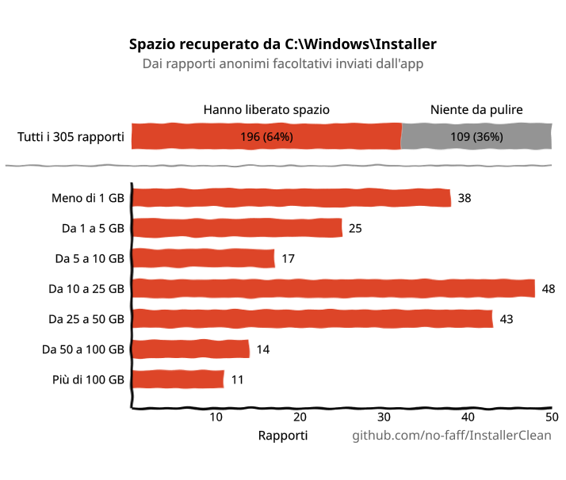
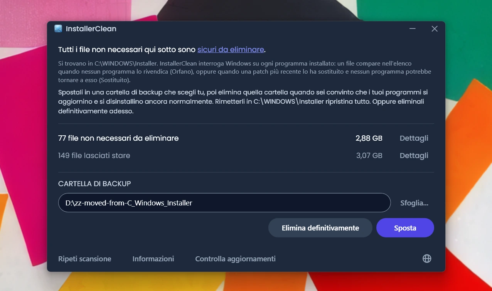
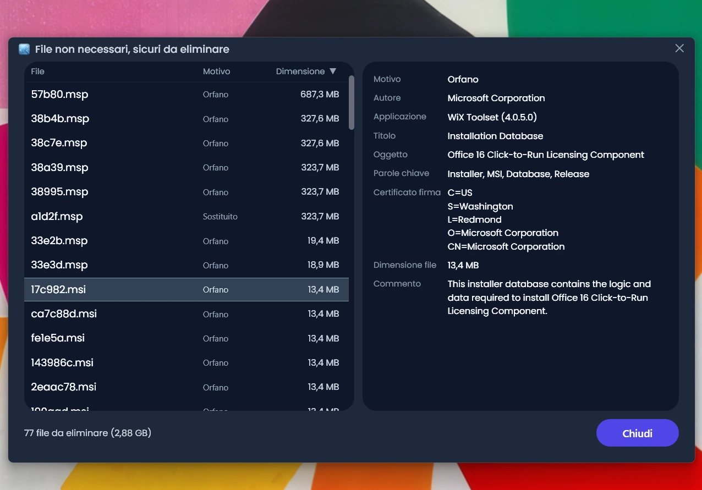
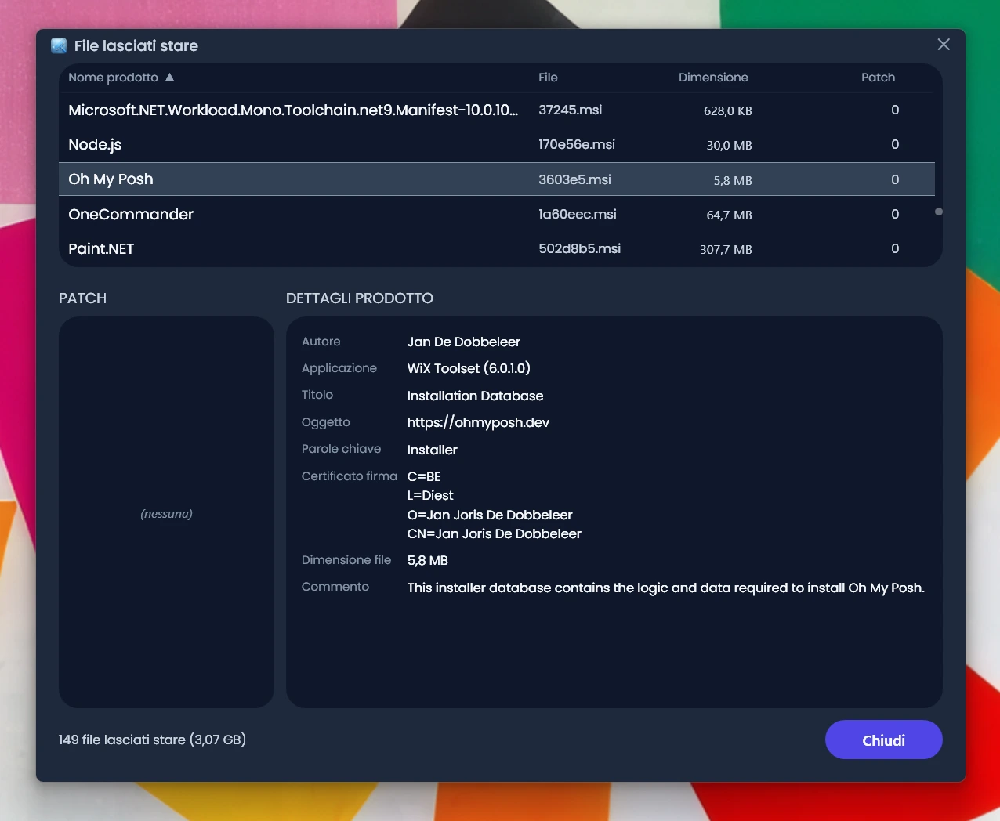
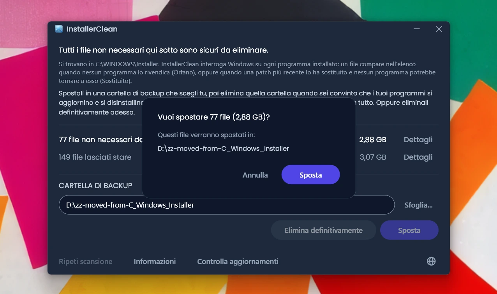
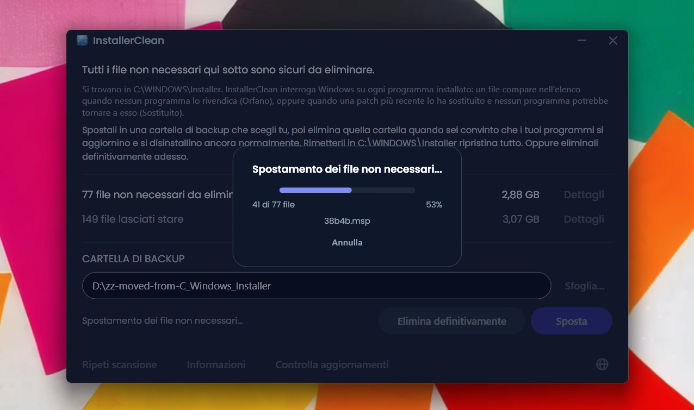
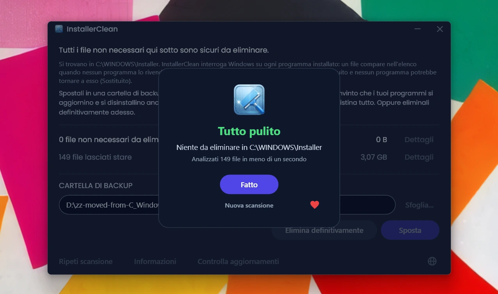

<p align="center">
  <a href="README.md">English</a> · <a href="README.zh-CN.md">简体中文</a> · <a href="README.ru.md">Русский</a> · <a href="README.es.md">Español</a> · <a href="README.ar.md">العربية</a> · <a href="README.ja.md">日本語</a> · <a href="README.pt-BR.md">Português (BR)</a> · <a href="README.pl.md">Polski</a> · <a href="README.tr.md">Türkçe</a> · <a href="README.ko.md">한국어</a> · <a href="README.fr.md">Français</a> · <strong>Italiano</strong> · <a href="README.de.md">Deutsch</a> · <a href="README.id.md">Bahasa Indonesia</a> · <a href="README.vi.md">Tiếng Việt</a> · <a href="README.uk.md">Українська</a> · <a href="README.nl.md">Nederlands</a>
</p>

<p align="center">
  
</p>

<p align="center"><em>🎶 What's my line? I'm happy <a href="https://www.youtube.com/watch?v=HM-jHhUZfFI">cleaning Windows</a></em></p>

<h1 align="center">InstallerClean</h1>

<p align="center"><strong>Uno strumento open source per pulire in sicurezza <code>C:\Windows\Installer</code>, la cartella nascosta di Windows che si mangia in silenzio il tuo spazio su disco.</strong></p>

<p align="center"><em>Usala ogni morte di papa. Magari liberi un po' di spazio. Passa oltre, tutto pulito.</em></p>

<p align="center">
  <a href="LICENSE"></a>
  <a href="https://dotnet.microsoft.com/download/dotnet/10.0"></a>
  <a href="https://github.com/no-faff/InstallerClean/actions/workflows/ci.yml"></a>
  <a href="https://github.com/no-faff/InstallerClean/releases"></a>
  <a href="https://github.com/no-faff/InstallerClean/releases/latest"></a>
  <a href="https://github.com/no-faff/InstallerClean/releases"></a>
</p>

<a id="reports-stats"></a>

<!-- reports-stats-start chart-only (generated; do not hand-edit between these markers) -->
<p align="center">
  <picture>
    <source media="(prefers-color-scheme: dark)" srcset="docs/reports-it-dark.svg" />
    <source media="(prefers-color-scheme: light)" srcset="docs/reports-it-light.svg" />
    
  </picture>
</p>
<!-- reports-stats-end -->

- **Cosa fa:** InstallerClean fa una cosa sola: rimuove i file non necessari da `C:\Windows\Installer`, una cartella nascosta che si riempie man mano che installi e aggiorni software. Dopo una scansione rapida ti dice se ne hai, mostra qualche dettaglio in più per i curiosi e ti lascia spostarli altrove oppure eliminarli per liberare spazio sull'unità C:.
- **Forse sei qui perché:** Hai usato [WinDirStat](https://github.com/windirstat/windirstat), WizTree o TreeSize, hai visto che `C:\Windows\Installer` occupava un sacco di spazio e non sapevi cosa ci fosse dentro. In quel caso InstallerClean è proprio quello che ti serve. Sa cosa contengono quei file dai nomi all'apparenza casuali come `9f05cba.msi` e ti dice rapidamente quali puoi rimuovere in sicurezza.
- **Quanto spazio:** Il grafico qui sopra mostra i risultati dei rapporti facoltativi che arrivano alla spicciolata dalla v1.8.0. (Grazie a tutti quelli che hanno cliccato il pulsante. Senza di voi quel grafico non esisterebbe.) Del <!-- reports-freedpct-start -->64%<!-- reports-freedpct-end --> che ha liberato spazio, la mediana liberata è di <!-- reports-median-start -->15,8 GB<!-- reports-median-end -->. <!-- reports-biggest-start -->Un computer ha recuperato ben 464 GB.<!-- reports-biggest-end --> Il restante <!-- reports-nothingpct-start -->36%<!-- reports-nothingpct-end --> non ha liberato niente, quindi dipende dal computer: un'installazione pulita di Windows 11 senza software aggiuntivo non ha niente da rimuovere. Quelli che avranno più file non necessari sono i computer che vanno avanti da anni, qualunque macchina con sopra grossi programmi basati su MSI (Acrobat, Office, LibreOffice, grandi strumenti di sviluppo) e chiunque installi e disinstalli molto software. Vedrai esattamente quanto nel momento in cui lo esegui.
- **È sicuro:** Sì. Tocca soltanto i file dentro `C:\Windows\Installer`. Chiede a Windows Installer cosa serve ancora e legge gli stessi record anche dal registro di sistema. Propone un file solo quando niente di installato sul computer lo rivendica, oppure quando una patch più recente lo ha sostituito e nessun programma qui presente potrebbe tornare a quella vecchia. Tutto ciò su cui non ottiene una risposta chiara, lo trattiene. [Più sotto i dettagli](#come-funziona).
- **Niente su di te:** Open source (Apache 2.0). Nessun account, nessuna pubblicità, nessun tracciamento, nessuna telemetria, niente che giri in background. L'unica cosa che fa online di sua iniziativa è controllare su GitHub se c'è una versione più recente quando lo avvii, e puoi disattivarla.
- **Come ottenerlo:** [Scarica l'ultima versione](../../releases/latest). Avvialo; supera [l'eventuale avviso di Windows](#unknown-publisher) e [la richiesta di amministratore](#admin). Sposta o elimina quello che trova. Fatto.

## Indice

- [La cartella di cui nessuno ti parla](#la-cartella-di-cui-nessuno-ti-parla)
- [La ricerca di aiuto](#la-ricerca-di-aiuto)
- [Cosa fa InstallerClean](#cosa-fa-installerclean)
- [Schermate](#schermate)
- [Come funziona](#come-funziona)
- [Download](#download)
  - [Controllare il file scaricato](#controllare-il-file-scaricato)
- [Domande frequenti](#domande-frequenti)
- [Riga di comando](#riga-di-comando)
- [Accessibilità](#accessibilità)
- [Politica di firma del codice](#politica-di-firma-del-codice)
- [Privacy](#privacy)
- [Cosa non fa](#cosa-non-fa)
- [Le alternative](#le-alternative)
- [Se ti manca un file da C:\Windows\Installer](#recovery)
- [Requisiti](#requisiti)
- [Compilare dal codice sorgente](#compilare-dal-codice-sorgente)
- [Contribuire](#contribuire)
- [Sostieni il progetto](#sostieni-il-progetto)
- [Cronologia delle stelle](#cronologia-delle-stelle)
- [Licenza](#licenza)

---

## La cartella di cui nessuno ti parla

Su ogni PC Windows c'è una cartella nascosta chiamata `C:\Windows\Installer`. Ogni volta che installi un software che usa il sistema Windows Installer, o applichi una patch a Microsoft Office, Adobe Acrobat, Visual Studio o a qualunque altra applicazione basata su `.msi`, una copia di quell'installer o di quel file di patch `.msp` finisce in questa cartella, e lì resta.

Quando una patch più recente ne sostituisce una vecchia, restano entrambe. E restano anche gli installer del software che hai disinstallato tempo fa. Pulizia disco non tocca niente di tutto questo, e nemmeno Sensore memoria. DISM si occupa di tutt'altra cartella. Col tempo la cartella cresce: 1 GB, 5 GB, 20 GB, 50 GB. Sui computer con molto software basato su MSI (Acrobat è un colpevole frequente), può [superare i 100 GB](https://www.reddit.com/r/sysadmin/comments/1oxcrmh/acrobat_filling_up_the_cwindowsinstaller_folder/).

Non sono file temporanei che ritornano da soli. Sono peso morto a tutti gli effetti: vecchi installer di software che hai disinstallato anni fa e patch sostituite più volte. Una volta spariti, non tornano più.

**Se cerchi un modo semplice per liberare spazio su disco in Windows, questa cartella è un buon punto di partenza.** InstallerClean trova i file non necessari e li rimuove in sicurezza.

## La ricerca di aiuto

Se hai mai cercato aiuto per questa cartella, probabilmente sai come va a finire. Qualcuno con 180 GB in `C:\Windows\Installer` chiede come pulirla. Gli [dicono di eseguire Pulizia disco](https://learn.microsoft.com/en-us/answers/questions/4238108/windows-installer-folder-has-occupied-180gb). Ci prova. Libera 600 MB, nessuno dei quali da quella cartella (perché Pulizia disco non tocca `C:\Windows\Installer`). La discussione si spegne.

> *«Tutte le discussioni che ho trovato tendono a consigliare le stesse cose, che non risolvono il problema, e poi muoiono.»*
>
> [ksparks519, r/Windows10](https://www.reddit.com/r/Windows10/comments/1bt8c5p/anyone_ever_figure_out_giant_installer_folders/) (tradotto dall'inglese)

Oppure gli dicono di non toccarla affatto. In una discussione, a qualcuno con una cartella Installer da 60 GB è stato detto di [«non metterci mano».](https://www.reddit.com/r/techsupport/comments/1hw4suq/my_windows_installer_folder_is_like_60gb_so_i/) Quando ha chiesto cosa avrebbe dovuto fare invece, la risposta è stata: *«Te l'ho appena detto.»*

Il consiglio abituale confonde due cose diverse. Eliminare file a caso ti impedisce di aggiornare o disinstallare i programmi a cui quei file appartenevano. Rimuovere soltanto i file che niente sul computer rivendica, o che Windows registra come sostituiti, no. InstallerClean fa la seconda cosa.

## Cosa fa InstallerClean

1. **Scansiona** `C:\Windows\Installer` alla ricerca di file `.msi` e `.msp`
2. **Chiede** a Windows Installer cosa serve ancora, e legge gli stessi record anche dal registro di sistema
3. **Trattiene** tutto quello che le due letture non riescono a chiarire fra loro
4. **Ti dice quanto puoi liberare**, e quanto sta lasciando stare, con finestre di dettaglio opzionali che elencano ogni file
5. **Rimuove i file non necessari**: li sposta in una cartella di backup che scegli tu, oppure li elimina definitivamente

## Schermate

<p>
  <br>
  <em>Scansione iniziale. È molto rapida.</em>
  <br><br>
</p>

<p>
  <br>
  <em>Risultati: quanto è rimovibile, quanto è stato lasciato stare.</em>
  <br><br>
</p>

<p>
  <br>
  <em>Dettagli dei file che possono sparire: il motivo per cui ciascuno non serve, e quello che il file dice di sé.</em>
  <br><br>
</p>

<p>
  <br>
  <em>Dettagli dei file lasciati stare: il programma a cui Windows dice che ciascuno appartiene, e quello che il file dice di sé.</em>
  <br><br>
</p>

<p>
  <br>
  <em>Conferma prima di entrambe le azioni. Sposta mette i file al sicuro in una cartella che scegli tu. Oppure eliminali definitivamente.</em>
  <br><br>
</p>

<p>
  <br>
  <em>Lo spostamento in corso. Sulla stessa unità è immediato. Su un'altra unità, più GB ci sono più tempo ci vuole.</em>
  <br><br>
</p>

<p>
  <br>
  <em>Fatto. Spazio recuperato. File al sicuro nel backup finché non sei convinto che vada tutto bene. Poi elimina la cartella di backup.</em>
  <br><br>
</p>

<p>
  <br>
  <em>Dopo una nuova scansione. Non resta niente da pulire.</em>
  <br><br>
</p>

<a id="is-it-safe"></a>
## Come funziona

Quando Windows Installer installa un programma tiene una copia dell'installer in `C:\Windows\Installer`, e quando una patch viene registrata su un programma tiene una copia anche di quella. Sono quelle copie a servirgli quando più avanti ripara, aggiorna o disinstalla il software, ed è per questo che restano lì molto tempo dopo la fine dell'installazione. Nella cartella finiscono entrambi i tipi di copia: gli installer `.msi`; e le patch `.msp`, che aggiornano un programma che hai già invece di sostituirlo.

InstallerClean propone un file per uno di due motivi.

**Orfano** significa che niente sul computer rivendica il file. Nessun prodotto installato e nessuna patch registrata lo nomina.

**Sostituito** significa che Windows ha registrato che una patch più recente ha rimpiazzato questa, e ha tenuto il file lo stesso. Una patch viene eliminata solo quando ogni programma su cui è registrata è stato disinstallato, oppure quando la patch viene rimossa da tutti quanti. Essere rimpiazzata da una più recente non è né l'una né l'altra cosa, quindi il file resta. Adobe Acrobat su Windows funziona così: i suoi aggiornamenti arrivano come patch applicate a un'installazione di base e non come nuovi installer, così un computer che ce l'ha da un po' può averne parecchie.

InstallerClean arriva ai due per vie opposte, e di guardare dentro la cartella c'è bisogno solo per il primo.

**Elencare la cartella.** InstallerClean elenca i file `.msi` e `.msp` che stanno direttamente in `C:\Windows\Installer`. Non entra nelle sottocartelle.

**Leggere i record, due volte.** InstallerClean chiede a Windows Installer ogni prodotto installato e ogni patch registrata, e il file in cache che ciascuno nomina, chiamando l'API di Windows Installer in `msi.dll`. Poi legge gli stessi record in un secondo modo, direttamente dal registro di sistema, perché la domanda può restituire meno del dovuto senza dirlo: Windows consegna i record uno alla volta finché non dichiara che non ce ne sono altri, e un'esecuzione che si ferma al terzo di duecento è identica a una che è arrivata in fondo. Una chiave del registro consegna tutto il suo elenco di nomi in una volta sola, quindi un elenco corto non può sembrare completo. Ogni prodotto che il registro nomina e che la domanda ha mancato viene poi ripresentato a Windows per nome, uno alla volta. Questa seconda lettura può soltanto spostare un file dalla parte di quelli ancora necessari. Non c'è nessuna via per cui ne metta uno nell'elenco dei file da rimuovere.

**Far combaciare un record con il suo file.** Un record nomina il proprio file in cache come percorso, e in quei percorsi la stessa cartella non è sempre scritta allo stesso modo. Perciò, invece di fidarsi di come è scritta, InstallerClean chiede a Windows dove punta davvero ogni percorso registrato e confronta la risposta con i file che ha elencato nella cartella. Tutto quello che resta non rivendicato passa per un secondo confronto che non tocca affatto i nomi: apre il file e chiede a Windows di identificarlo, così due nomi diversi dello stesso file vengono riconosciuti come un unico file.

**Record che non si riescono a far combaciare.** Se Windows non dice dove punta un percorso registrato, oppure se il file in fondo a uno dei percorsi registrati non si riesce a identificare, InstallerClean non sa di quale file parlasse quel record, e potrebbe essere uno qualunque di quelli che ha elencato. Lo stesso vale se un programma potrebbe essere stato installato più di una volta, perché allora non può dire quale file in cache appartiene a quale copia. In tutti questi casi non propone niente di quello che quella volta ha trovato elencando la cartella. Un record che punta a un file già sparito è un caso diverso: non è rimasto niente a cui potesse riferirsi, quindi non può riguardare nessuno dei file ancora nella cartella.

**Chiedere dall'altro capo.** Un orfano è deciso da un'assenza, e un'assenza può anche voler dire che l'app non è riuscita a trovare il record. Perciò, prima di proporre un installer `.msi`, InstallerClean apre il file, legge il codice prodotto che il file stesso porta con sé e chiede a Windows se quel prodotto è installato. Se lo è, il file resta, qualunque cosa abbia trovato il resto della scansione. Quel controllo può solo togliere un file dall'elenco. Nessuna risposta che possa dare ne aggiunge uno.

**Cosa decide una patch `.msp`.** Una patch non viene aperta per chiederle a quale programma appartiene. A deciderlo è invece il fatto che una registrazione di patch nomina il proprio file in cache in due posti: le patch registrate su ciascun prodotto; e un unico elenco, nel registro di sistema, di tutte le registrazioni di patch presenti sul computer. Una patch viene proposta come orfana solo quando il suo file in cache non è nominato in nessuno dei due.

**In cosa è diversa una patch sostituita.** Non passa per niente di tutto questo, perché non è un file non rivendicato. Windows ne ha un record, ed è quel record a dire che è stata rimpiazzata. Il rischio è un altro: una patch può essere registrata su più programmi, e solo uno di essi ha finito di usarla. Perciò una patch sostituita viene proposta solo quando Windows registra che non è disinstallabile, ogni programma su cui è registrata è stato interrogato, in nessuno di essi è ancora applicata e nessuno di essi ha una patch che Windows dice disinstallabile. L'ultima condizione c'è perché annullare una patch su un programma può andare a ripescare il file più vecchio. Se anche una sola di queste risposte manca, il file resta.

<details>
<summary>Le chiamate a Windows Installer che usa</summary>

- `MsiEnumProductsEx` per elencare ogni prodotto installato, e di nuovo con un singolo codice prodotto per chiedere se un determinato prodotto è installato
- `MsiEnumPatchesEx` per elencare le patch registrate, sia per singolo prodotto sia su tutto il computer
- `MsiGetProductInfoEx` per leggere il nome di un prodotto, il file in cache che nomina e se è una fra più installazioni dello stesso prodotto
- `MsiGetPatchInfoEx` per leggere lo stato di una patch, se Windows può disinstallarla e il file in cache che nomina
- `MsiGetSummaryInformation` e `MsiSummaryInfoGetProperty` per leggere da un file di patch a quali programmi può essere applicata
- `MsiOpenDatabase`, `MsiDatabaseOpenView`, `MsiViewExecute`, `MsiViewFetch` e `MsiRecordGetString` per leggere da un file di installazione il codice prodotto che dichiara

</details>

Detto tutto questo, l'app ti invita a spostare i file in una cartella di backup (su un'altra unità o partizione, se quello che vuoi è liberare spazio su C:). Così hai modo di convincerti che vada davvero tutto bene prima di eliminare per sempre i file non necessari.

## Download

Tre varianti, scegline una:

- **Portable** (`InstallerClean-3.0.0-portable.exe`): un solo file, con dentro il runtime .NET 10. Nessuna installazione, nessun programma di disinstallazione: doppio clic e parte. Tieni il file da qualche parte per la prossima volta, oppure eliminalo quando hai finito.
- **Setup** (`InstallerClean-3.0.0-setup.exe`): un normale programma di installazione di Windows con il runtime .NET 10 incluso. Aggiunge una voce nel menu Start e si disinstalla in modo pulito. Sistemato fra i programmi, così è facile da ritrovare fra sei mesi, o da usare più spesso se installi e disinstalli molto software.
- **CLI** (`installerclean-cli.exe`): la versione a riga di comando da sola, un solo file con dentro il runtime. Nessuna installazione, nessun programma di disinstallazione. Mettilo su un client, esegui una scansione o una pulizia, eliminalo. Pensato per lo scripting, le attività pianificate e la distribuzione di massa, quando vuoi le operazioni senza un'app desktop sul client. Vedi [Riga di comando](#riga-di-comando) per gli argomenti e i codici di uscita.

Dalla 2.2.0 i nomi dei file del setup e della versione portable contengono il numero di versione, così una copia scaricata dice sempre cos'è; la CLI mantiene il suo nome semplice `installerclean-cli.exe`, perché le attività pianificate e gli script che la richiamano continuino a funzionare da un aggiornamento all'altro.

Scaricalo dalla [pagina delle release](../../releases/latest), poi eseguilo. Non è firmato, quindi Windows mostra un avviso di «autore sconosciuto»; le [Domande frequenti](#unknown-publisher) spiegano cosa vedrai e perché è sicuro.

L'app esegue la scansione automaticamente all'avvio. Esamina i risultati, poi clicca su **Sposta** o **Elimina definitivamente**.

Oppure installalo tramite [winget](https://learn.microsoft.com/windows/package-manager/winget/):

```
winget install NoFaff.InstallerClean
```

Oppure installalo tramite [Scoop](https://scoop.sh):

```
scoop install installerclean
```

### Controllare il file scaricato

InstallerClean non è firmato. Ecco cosa puoi controllare prima di eseguirlo:

- L'hash SHA-256 di ogni file scaricabile è sulla pagina della sua versione.
- VirusTotal: ogni build viene analizzata prima di uscire, e la pagina della versione riporta il risultato completo motore per motore di ogni file scaricabile.
- Il codice sorgente è qui, su [github.com/no-faff/InstallerClean](https://github.com/no-faff/InstallerClean). I servizi di scansione, interrogazione, spostamento, eliminazione, impostazioni e riavvio in sospeso sono coperti da una suite di test automatici che gira su Windows a ogni push su `main` e a ogni pull request, e il badge CI in cima a questa pagina ne riporta l'esito.
- Le build di rilascio sono deterministiche: lo stesso codice sorgente, lo stesso SDK e gli stessi parametri di pubblicazione producono gli stessi byte, e non si può assegnare il tag a una versione a meno che ogni elemento in ingresso della build non corrisponda al codice sorgente di quel tag. Puoi quindi fare il checkout del tag, compilare tu stesso e confrontare gli hash con quelli pubblicati. Le note di ogni versione portano quello che ti serve per farlo: la versione dell'SDK con cui è stata compilata, e i parametri di pubblicazione di ogni file scaricabile che non sia stato compilato con quelli predefiniti. Il setup è l'eccezione: lo compila Inno Setup e non l'SDK, e ci stampa dentro l'anno di compilazione, quindi per riprodurne l'hash servono anche la stessa versione di Inno e lo stesso anno di calendario.
- <!-- downloads-start -->84.000+<!-- downloads-end --> download tra GitHub, MajorGeeks e Softpedia.
- [MajorGeeks](https://www.majorgeeks.com/files/details/installerclean.html) prova ogni invio in una macchina virtuale e pubblica solo quelli che superano la loro revisione.<br><a href="https://www.majorgeeks.com/files/details/installerclean.html"></a>
- [Softpedia](https://www.softpedia.com/get/System/Hard-Disk-Utils/InstallerClean.shtml) lo ha esaminato e lo ha certificato privo di spyware, adware e virus.<br><a href="https://www.softpedia.com/get/System/Hard-Disk-Utils/InstallerClean.shtml"></a>

## Domande frequenti

<a id="admin"></a>

**Perché richiede i diritti di amministratore?** Per due motivi. `C:\Windows\Installer` è riservata agli amministratori, quindi leggerla, interrogare Windows Installer e spostare o eliminare file lo richiedono tutti. E un amministratore può chiedere a Windows dei programmi installati sotto qualunque account del computer, mentre chi non lo è non può: senza quei diritti Windows direbbe che un programma non è installato quando invece lo è, proprio dentro il controllo che decide se un file serve ancora.

<a id="unknown-publisher"></a>

**Perché Windows dice «Autore sconosciuto»?** InstallerClean non è firmato digitalmente e Windows contrassegna i file scaricati da internet, quindi al primo avvio SmartScreen di solito mostra «PC protetto da Windows» con l'autore indicato come sconosciuto. Un certificato di firma a pagamento ha un costo ogni anno e preferisco tenere l'app gratuita piuttosto che pagarne uno, così ho fatto domanda alla SignPath Foundation, che firma gratuitamente il software open source, e InstallerClean è stato accettato (vedi [Politica di firma del codice](#politica-di-firma-del-codice)). Il certificato non è ancora stato emesso, quindi per ora clicca su **Ulteriori informazioni**, poi su **Esegui comunque**. Farlo è sicuro: il codice sorgente è pubblico, e ogni versione ha link a VirusTotal e hash SHA-256 che puoi controllare prima.

**Funziona su Windows 7 o 8?** No. Serve Windows 10 versione 1607 o successiva, la build più vecchia supportata dal runtime .NET 10. Il setup si rifiuta di installarsi su qualcosa di più vecchio e la versione portable non parte.

## Riga di comando

`installerclean-cli.exe` è un eseguibile da console separato, installato accanto alla GUI. Stessa scansione, stesso spostamento, stessa eliminazione, senza finestra. Blocca il prompt finché non termina, così uno script o un'attività pianificata possono aspettarlo.

### Opzioni

| Opzione | Cosa fa | Accetta anche |
|---|---|---|
| `/s` | Solo scansione. Elenca quello che rimuoverebbe, con nome, dimensione e motivo di ciascun file. Non cambia niente. | |
| `/d` | Scansiona, poi elimina definitivamente i file non necessari. | |
| `/m` | Scansiona, poi li sposta nella cartella salvata nella GUI. | |
| `/m PERCORSO` | Scansiona, poi li sposta in `PERCORSO`. Mettilo fra virgolette se contiene uno spazio. | |
| `--help` | Stampa le istruzioni d'uso ed esce con `0`. | `/?`, `-h` |
| `--version` | Stampa la versione ed esce con `0`. | `-v` |

Le opzioni non fanno distinzione fra maiuscole e minuscole, quindi `/S` e `/D` funzionano quanto `/s` e `/d`. Una sola opzione per esecuzione: non si possono combinare, e `/s` e `/d` non vogliono niente dopo di sé.

Eseguito senza argomenti stampa le istruzioni d'uso ed esce con `1`, così un'attività pianificata che perde la sua opzione fallisce in modo visibile invece di non fare niente in silenzio. Un'opzione che non riconosce stampa una riga di errore, poi le istruzioni d'uso, ed esce anch'essa con `1`. Un percorso di spostamento con uno spazio dentro e senza virgolette viene rifiutato allo stesso modo, invece di essere troncato in silenzio, e il messaggio ti dice di metterlo fra virgolette.

### Codici di uscita

Sono i codici che lo strumento stesso documenta in `--help`:

| Codice | Significato |
|---|---|
| `0` | Successo. L'esecuzione ha fatto quello che le è stato chiesto e niente è fallito. |
| `1` | Niente elaborato. L'esecuzione è fallita, oppure è stata rifiutata. |
| `2` | Parziale. Alcuni file elaborati, altri no, compreso un Ctrl+C a metà strada. |
| `75` | Transitorio. Una condizione temporanea ha bloccato l'esecuzione; il messaggio stampato dice quale. |
| `130` | Annullato con Ctrl+C prima che venisse elaborato qualcosa. |

`1` copre tanto un rifiuto quanto un fallimento, e un rifiuto non è un difetto: una destinazione semplicemente piena, o un valore del registro che l'app non è riuscita a leggere prima di toccare qualsiasi cosa, finiscono entrambi qui. `0` significa che niente è fallito, non che non è rimasto niente: `--help`, `--version` e un'esecuzione di sola scansione escono tutte con `0`, che la scansione abbia trovato sessantotto file o nessuno.

### Il registro eventi

Ogni esecuzione scrive una voce di esito nel registro applicazioni, e può aggiungerci accanto uno o più avvisi. L'ID evento è un contratto stabile leggibile dalla macchina, così un RMM può filtrare sul numero senza analizzare nessun testo:

| ID | Significato |
|---|---|
| `1000` | Successo |
| `1002` | Parziale |
| `2000` | Ignorato, transitorio |
| `4000` | Errore grave |
| `3000` | Avviso: la scansione non è riuscita a tenere conto di ogni prodotto installato |
| `3001` | Avviso: nella cartella mancano file che Windows si aspetta |
| `3002` | Avviso: alcuni file sono stati trattenuti invece che proposti |

La fascia `3000` è un avviso e non un esito, e non conta come risultato dell'esecuzione. Il tipo di voce è Informazioni quando nell'esecuzione non è andato storto niente e Avviso quando invece sì. **Il registro eventi è sempre in inglese**, qualunque sia la lingua di visualizzazione del computer, così una ricerca su una frase nota ha un bersaglio stabile. È la console a essere tradotta: segue la lingua del computer, e formatta dimensioni e date secondo la sua area geografica.

### Esempi

Un controllo scritto su file, senza cambiare niente:

```
installerclean-cli /s > audit.txt
```

Spostamento mensile in `D:\InstallerBackup`, con la CLI messa in `C:\Tools`:

```
schtasks /create /tn "InstallerClean monthly" /tr "C:\Tools\installerclean-cli.exe /m D:\InstallerBackup" /sc monthly /ru SYSTEM /rl highest
```

L'attività resta in attesa finché l'esecuzione non termina, e ne registra il codice di uscita come proprio Risultato ultima esecuzione, così un RMM può basarsi sui codici qui sopra.

Da PowerShell:

```powershell
& 'C:\Tools\installerclean-cli.exe' /m D:\InstallerBackup
switch ($LASTEXITCODE) {
    0       { 'Pulito' }
    2       { "Parziale, controlla l'output" }
    75      { 'Bloccato, riprova più tardi' }
    default { "Non riuscito ($LASTEXITCODE)" }
}
```

### Prima di metterlo in uno script

- **Gli serve l'elevazione.** Tutto quanto, `/s` compreso. Da un prompt non elevato Windows si rifiuta di avviarlo e consegna `740` alla tua shell.
- **La cartella salvata dalla GUI è per utente.** Un'attività che gira come SYSTEM o con un account di servizio non la vede, quindi quelle esecuzioni devono passare `/m PERCORSO`.
- **SYSTEM raggiunge la rete come account del computer**, quindi una destinazione `\\server\condivisione` richiede diritti concessi a quell'account.
- **`/s` non blocca mai.** È in sola lettura e non prende nessun lock, quindi puoi fare una scansione mentre l'app desktop è aperta. `/d` e `/m` prendono un lock valido per tutto il computer ed escono con `75` se un'altra esecuzione di InstallerClean lo tiene.
- **Tutto va su stdout**, errori compresi; non esiste stderr. Basati sul codice di uscita invece di analizzare il testo.
- **Lo spostamento rifiuta invece di rinominare.** Se la destinazione contiene già un file con quel nome, quel file resta nella cache e viene nominato nell'output, e il resto del lotto si sposta lo stesso. Un'esecuzione in cui ogni file va in conflitto non elabora niente ed esce con `1`.
- **Niente svuota la cartella di backup.** `/m` non fa che aggiungere. Sei tu a doverla ripulire.
- **`taskkill /pid` non è un annullamento pulito.** L'esecuzione successiva recupera il lock di istanza singola.
- **La prima esecuzione registra un'origine per il registro eventi**, in `HKLM\SYSTEM\CurrentControlSet\Services\EventLog\Application\InstallerClean`. Lasciala dov'è: il Visualizzatore eventi legge la descrizione di una voce attraverso la sua origine, quindi rimuoverla trasforma ogni voce già scritta dallo strumento in un errore di origine sconosciuta.

### Perché `installerclean-cli` e non `installerclean.exe`

`InstallerClean.exe` è la finestra e ignora gli argomenti da riga di comando. `installerclean-cli.exe` è un vero processo da console, quindi blocca il prompt finché non termina, e puoi redirigerne l'output o mandarlo in pipe come faresti con qualunque altro eseguibile da console. Il setup li installa entrambi. Il download portable è solo la GUI; se vuoi la riga di comando senza la finestra, scarica `installerclean-cli.exe` da solo dalla [pagina delle release](../../releases/latest).

## Accessibilità

InstallerClean è realizzato per essere pienamente utilizzabile da tastiera e con uno screen reader.

- **Utilizzabile interamente da tastiera.** Tutto quello che l'app fa si raggiunge da tastiera, e anche le colonne delle finestre di dettaglio si ordinano da tastiera: qui niente richiede il mouse. I pulsanti della barra del titolo si comportano come quelli di Windows e si raggiungono con Alt+Barra spaziatrice o Alt+F4. Il focus della tastiera resta visibile ovunque si trovi.
- **Assistente vocale e Accesso vocale.** Ogni controllo è etichettato, e la parola visibile su un pulsante è quella che lo attiva con la voce. Quando uno spostamento o un'eliminazione si conclude, l'esito viene letto ad alta voce.
- **Fatto per essere letto.** Il testo rispetta il contrasto WCAG AA in tutto il tema scuro.

Se qualcosa qui ti ostacola, [apri un issue](../../issues). I problemi di accessibilità sono bug, non casi limite.

## Politica di firma del codice

InstallerClean è stato accettato dalla [SignPath Foundation](https://signpath.org) per la firma del codice gratuita, un programma che firma il software open source perché smetta di arrivare sul tuo computer da un autore sconosciuto. Il certificato non è ancora stato emesso, quindi oggi i file scaricabili qui non sono firmati e Windows ti avviserà a riguardo.

Una volta emesso, ogni versione porterà la riga che SignPath chiede di riportare: «free code signing provided by SignPath.io, certificate by SignPath Foundation». Il certificato appartiene alla fondazione e non a me, perché un certificato deve essere intestato a un soggetto giuridico e un progetto di una persona sola non lo è. Questo non significa che InstallerClean sia loro, né che partecipino al progetto oltre alla firma.

**Ruoli.** InstallerClean ha un solo manutentore. Chi scrive il codice e chi lo revisiona, cioè chi può inserire codice nel progetto: io. Chi approva, cioè chi può autorizzare la firma di una versione: io.

## Privacy

Il rapporto facoltativo è l'unica cosa che invii mai qualcosa su un'esecuzione, e parte solo quando premi il pulsante. Dice cosa ha trovato la scansione, cosa ha trattenuto e perché, se hai spostato o eliminato, quanto spazio ha liberato quell'operazione, quanto tempo ci ha messo e tutto quello che è fallito, insieme alla versione dell'app, alla lingua in cui la leggi e alla tua versione di Windows. Nessun nome di file, nessun nome di cartella, nessun nome di account, niente che identifichi il tuo computer e niente che permetta di collegare fra loro due rapporti. È così che scopro se l'app funziona, e cosa sta trattenendo, su computer diversi dal mio.

Nessuna pubblicità, nessuna telemetria. Le uniche altre connessioni sono il controllo della versione all'avvio dell'app (una sola richiesta a GitHub, che puoi disattivare nella finestra Informazioni) e i pulsanti che rimandano a GitHub e a una pagina dove puoi fare una donazione, se ti va. L'[informativa sulla privacy](PRIVACY.md) completa (in inglese).

## Cosa non fa

- WinSxS (`C:\Windows\WinSxS`) è una cartella diversa con regole diverse. Per quella, esegui `Dism /Online /Cleanup-Image /StartComponentCleanup` da un prompt con privilegi elevati.
- Nessun servizio in background, nessuna attività pianificata, nessuna pulizia automatica. L'app gira quando la avvii tu.
- Non modifica i tuoi programmi installati né il database di Windows Installer, li legge soltanto. L'unica cosa che l'app scrive mai nel registro di sistema è la registrazione una tantum dell'origine eventi, che serve allo strumento da riga di comando perché le sue esecuzioni compaiano nel registro eventi di Windows.
- Di sua iniziativa fa un solo tipo di collegamento: un rapido controllo sulla pagina delle release di GitHub per vedere se c'è una versione più recente quando lo avvii, che puoi disattivare in Informazioni. Tutto il resto succede solo quando glielo dici tu: il rapporto anonimo facoltativo (numeri sull'esecuzione, niente che nomini te o i tuoi file) e i link alla documentazione su GitHub e a una pagina per le donazioni, che si aprono nel tuo browser se li clicchi. Non scarica mai nulla da solo.
- Niente barre degli strumenti, niente software incluso, niente adware.

## Le alternative

Se hai già cercato informazioni su questa cartella, lo strumento che con ogni probabilità avrai trovato è [PatchCleaner](https://www.homedev.com.au/free/patchcleaner). Ha fatto questo lavoro per primo, lo ha fatto per un decennio prima che InstallerClean esistesse, va ancora forte, e InstallerClean non esisterebbe senza di lui.

Ho creato InstallerClean perché PatchCleaner è a codice chiuso, non riceve aggiornamenti da marzo 2016 ed esclude i file Adobe per impostazione predefinita. Quell'esclusione c'è per un buon motivo, e HomeDev lo disse chiaramente nelle note di versione dell'epoca:

> *«Nelle versioni precedenti c'è un problema noto per cui PatchCleaner identifica erroneamente le patch di Adobe Acrobat Reader come non necessarie. Adobe fa qualcosa di proprietario nel suo aggiornamento automatico, tanto che se PatchCleaner rimuove le patch "orfane" dalla cartella Installer, gli aggiornamenti automatici di Adobe Reader non si installano più correttamente.»*
>
> [Note di versione di PatchCleaner, versione 1.4.0.0](https://www.homedev.com.au/free/patchcleaner) (tradotto dall'inglese)

Il filtro introdotto insieme all'esclusione cerca la parola "Acrobat" nei metadati di un file e nella sua firma. Sui computer dove Acrobat è il peggior colpevole, può essere lì la maggior parte dello spazio:

> *«Ho scaricato PatchCleaner per eliminare i file `.msp` orfani, ma a quanto pare questo libererebbe solo 250 MB di spazio. 29 GB dei file sono "esclusi dai filtri", quindi PatchCleaner non sembra essere d'aiuto.»*
>
> HeatherBunny1111, [r/techsupport](https://www.reddit.com/r/techsupport/comments/1qc4tcf/how_to_delete_msp_files_safely/) (tradotto dall'inglese)

La differenza fra i due strumenti sta in cosa ciascuno chiede a Windows, non in un parere diverso su Adobe. L'elenco che Windows tiene delle patch *applicate* di un prodotto lascia fuori quelle che una patch più recente ha sostituito, così uno strumento che legge quell'elenco incontra il file di una patch sostituita come un file che niente rivendica, esattamente come qualunque altro. È il filtro di esclusione a intercettare per nome quelli di Adobe. InstallerClean chiede invece a Windows lo stato delle patch, così una patch sostituita arriva etichettata come tale, e quello che ne viene fatto si decide su quello che Windows registra a suo riguardo e non su quello che dice il suo nome. Ecco come si confrontano i due:

| | **InstallerClean** | **PatchCleaner** |
|---|---|---|
| Ultimo aggiornamento | 2026 (attivo) | 3 marzo 2016 |
| Codice sorgente | Open source (Apache 2.0) | Codice chiuso |
| Runtime | .NET 10 (autonomo) | .NET Framework 4.5.2 + VBScript |
| API | API di Windows Installer in `msi.dll` (nello stesso processo) | Windows Installer COM (in un processo separato, tramite VBScript) |
| Patch sostituite | Individuate dai record delle patch di Windows | Non distinte dai file non rivendicati |
| File Adobe | Patch sostituite rilevate ed etichettate | Esclusi da un filtro sul nome, attivo per impostazione predefinita |

> **Una nota su `Win32_Product`:** L'approccio comune ma difettoso per elencare i prodotti installati è `Win32_Product` (WMI), che [scatena operazioni di riparazione MSI](https://gregramsey.net/2012/02/20/win32_product-is-evil/) su ogni prodotto durante l'enumerazione. Sia InstallerClean sia PatchCleaner lo evitano. InstallerClean chiama l'API di Windows Installer in `msi.dll`; PatchCleaner esegue uno script ausiliario che usa l'oggetto COM di Windows Installer. Quello script si chiama `WMIProducts.vbs`, il che fa pensare il contrario, ma il file è lo script di esempio di Microsoft stessa con una modifica, e interroga Windows Installer e non WMI. Il nome è l'unica cosa fuorviante che lo riguarda.

Pulizia disco, Sensore memoria, CCleaner e BleachBit non puliscono `C:\Windows\Installer`.

<a id="recovery"></a>
## Se ti manca un file da `C:\Windows\Installer`

Se ti manca davvero un file da quella cartella, il programma a cui apparteneva continua a funzionare normalmente. Ma quando proverai ad aggiornare o disinstallare quel programma, con ogni probabilità fallirà. Windows va a cercare il file, non lo trova, e il passaggio si ferma.

Tutto lo scopo di InstallerClean è proporre lo spostamento o l'eliminazione solo di file che *non* servono, ma l'app sa riconoscere un file mancante, quindi segnala ognuno di quelli che trova con un triangolo di avviso e un link che porta qui. Ecco cosa fare per provare a riparare il programma:

- Scopri il numero di versione del programma che hai installato (Impostazioni, App, App installate)
- Scarica dal produttore il programma di installazione **di quella versione**. Uno più recente non funzionerà, e nemmeno disinstallare prima: entrambe le strade devono rimuovere quello che è installato prima di poter proseguire, e rimuoverlo è proprio il passaggio che ha bisogno del file mancante.
- Esegui quel programma di installazione
- Questo dovrebbe rimettere a posto il file e lasciare intatte le tue impostazioni. Esegui di nuovo la scansione in InstallerClean e, se ha funzionato, l'avviso sarà sparito.

Microsoft però non garantisce che funzioni. Quello che segue è il suo resoconto, più completo:

<details>
<summary>La posizione più completa di Microsoft</summary>

*Le citazioni di Microsoft qui sotto sono riportate nella loro versione originale in inglese.*

Guida completa: [Restore missing Windows Installer cache files](https://learn.microsoft.com/en-us/troubleshoot/windows-client/application-management/missing-windows-installer-cache), KB 2667628.

*Potrebbe non manifestarsi subito:*
> "If the installer cache is compromised, you may not immediately see problems until you take an action such as uninstalling, repairing, or updating a product."

*I file sono unici per ogni computer, quindi non puoi copiarne uno da un altro PC:*
> "Missing files cannot be copied between computers because the files are unique."

*Se hai un backup fatto prima che il file sparisse, Microsoft elenca quattro strade, in quest'ordine:*
> - System Restore points (available only on client operating systems)
> - Restoreable system state backup
> - Failure recovery methods that can restore the full system state backup
> - Reinstallation of the operating system and all applications

*E il vincolo che vale per tutte e quattro. Qui si parla di un backup dello stato del sistema, non di una cartella in cui hai spostato tu stesso dei file: quelli puoi ricopiarli direttamente, confermando la richiesta di amministratore che Windows mostra quando copi dentro la cartella.*
> "To restore the missing files, a full system state restoration is required. It is not possible to replace only the missing files from a previous backup."

*Il ripristino consigliato, e i suoi limiti senza giri di parole:*
> "If application files are missing from the Windows Installer Cache, ask the vendor or support team for the application about the missing files. You must follow the procedures or steps recommended by the application vendor to restore the files. In some cases, you may have to rebuild the operating system and reinstall the application to fix the problem."
>
> "Windows support engineers cannot help you recover missing application files from the Windows Installer cache."

</details>

Se InstallerClean fosse mai il motivo per cui manca un file, voglio saperlo. [Apri un issue](../../issues) e lo sistemo.

## Requisiti

- Windows 10 (versione 1607 / build 14393 o successiva, la più vecchia supportata dal runtime .NET 10) o Windows 11
- Windows a 64 bit. Il setup non si installa su un sistema a 32 bit e te lo dirà.
- Privilegi di amministratore, per il setup e per l'app (`C:\Windows\Installer` è riservata agli amministratori)

Vedi [Download](#download) per le varianti setup, portable e CLI.

## Compilare dal codice sorgente

```
git clone https://github.com/no-faff/InstallerClean.git
cd InstallerClean
dotnet build src/InstallerClean.sln
```

Esegui i test:

```
dotnet test src/InstallerClean.Tests/
```

## Contribuire

Hai trovato un bug o hai un suggerimento? [Apri un issue](../../issues) o avvia una [discussione](../../discussions). Le pull request sono benvenute. Esegui `dotnet test` prima di inviare.

InstallerClean esiste in 16 lingue, ognuna delle quali lo copre tutto: l'app, il programma di installazione, la riga di comando e questo README. Nell'app, nel programma di installazione e nella riga di comando, il giapponese e l'olandese sono stati forniti completi da coolvitto e RijckAlex, e l'italiano è una mia traduzione automatica corretta e approvata da bovirus, tutti e tre madrelingua; il resto sono mie traduzioni automatiche. Ogni README è opera mia, in ogni lingua. Ci ho messo molto impegno, ma non saranno perfetti, e ho deciso di pubblicarli così come sono piuttosto che tenerli fermi finché un madrelingua non potesse controllarli uno per uno. Se parli inglese e una di queste lingue e noti qualcosa che si può migliorare, sarò felice di saperlo, in un [issue](../../issues/new?template=translation_review.md), una pull request o una [discussione](../../discussions).

## Sostieni il progetto

Se InstallerClean ti libera un po' di spazio e ti va di essere generoso, un [piccolo contributo](https://nofaff.netlify.app/support) mi farebbe davvero piacere. Nell'app c'è un pulsante ❤️ che porta allo stesso posto. Qualunque cifra sarà accolta con gratitudine. Grazie mille a tutti quelli che hanno già donato. È stato un lavoro enorme e sono contento che ne sia valsa la pena.

## Cronologia delle stelle

<picture>
  <source media="(prefers-color-scheme: dark)" srcset="docs/star-history-dark.svg" />
  <source media="(prefers-color-scheme: light)" srcset="docs/star-history-light.svg" />
  
</picture>

## Licenza

[Apache 2.0](LICENSE)

---

🎶 [George Formby - When I'm Cleaning Windows](https://www.youtube.com/watch?v=P183Uo5Ust4). Buon ascolto!
