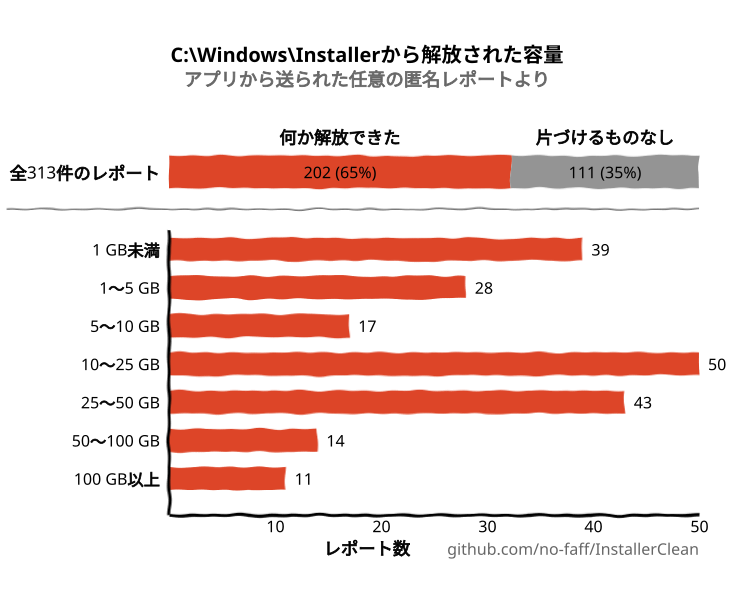
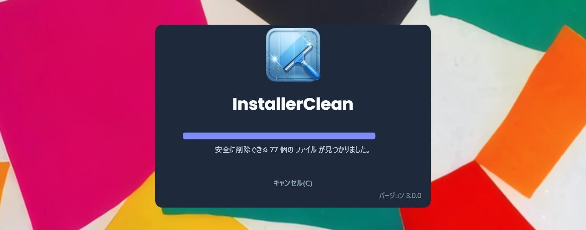
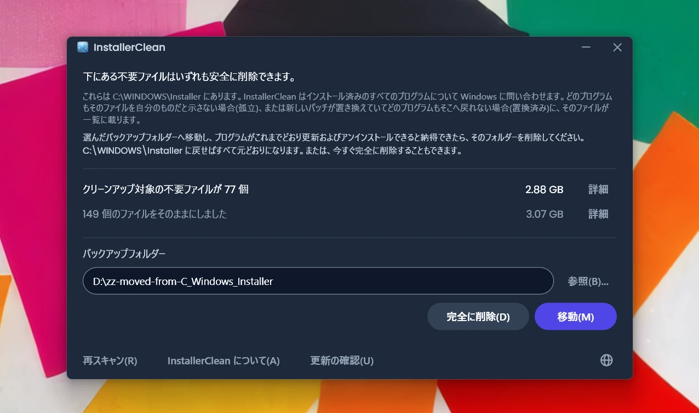
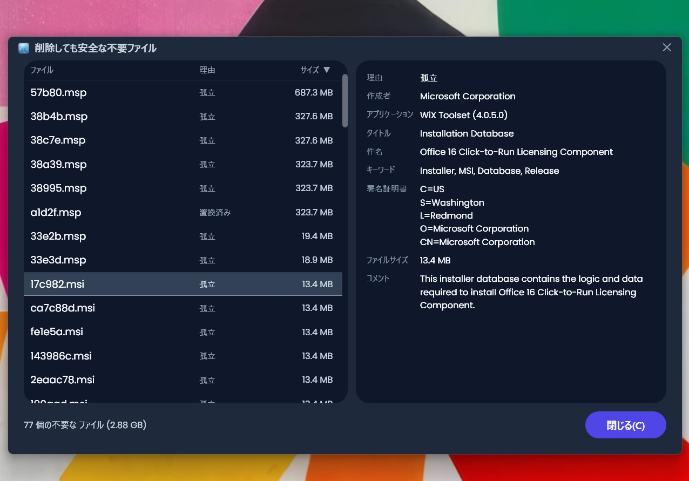
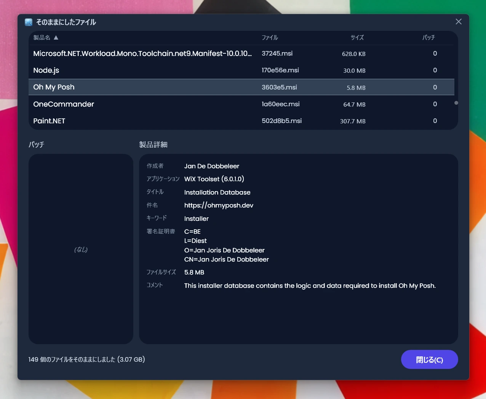
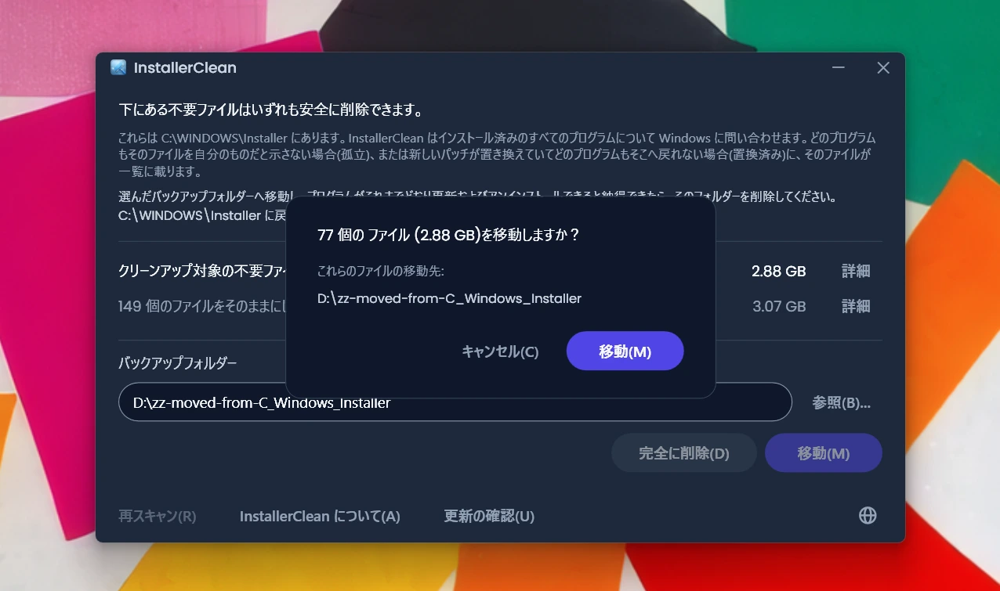
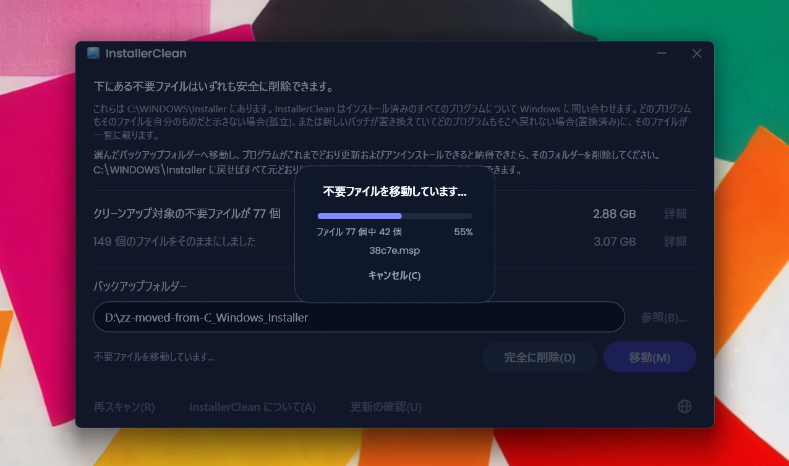
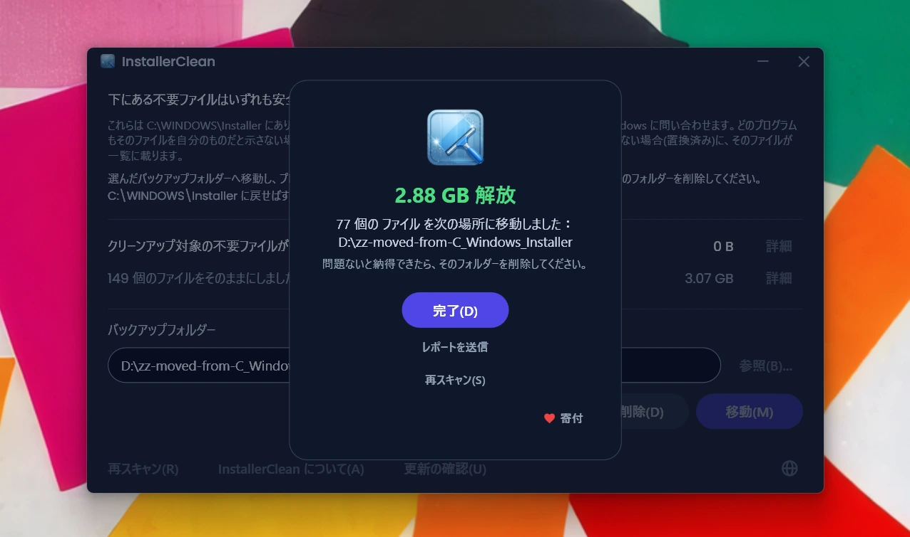
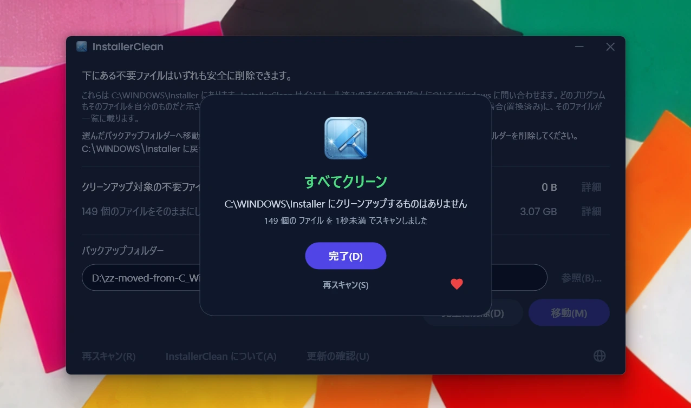

<p align="center">
  <a href="README.md">English</a> · <a href="README.zh-CN.md">简体中文</a> · <a href="README.ru.md">Русский</a> · <a href="README.es.md">Español</a> · <a href="README.ar.md">العربية</a> · <strong>日本語</strong> · <a href="README.pt-BR.md">Português (BR)</a> · <a href="README.pl.md">Polski</a> · <a href="README.tr.md">Türkçe</a> · <a href="README.ko.md">한국어</a> · <a href="README.fr.md">Français</a> · <a href="README.it.md">Italiano</a> · <a href="README.de.md">Deutsch</a> · <a href="README.id.md">Bahasa Indonesia</a> · <a href="README.vi.md">Tiếng Việt</a> · <a href="README.uk.md">Українська</a> · <a href="README.nl.md">Nederlands</a>
</p>

<p align="center">
  
</p>

<p align="center"><em>🎶 What's my line? I'm happy <a href="https://www.youtube.com/watch?v=HM-jHhUZfFI">cleaning Windows</a></em></p>

<h1 align="center">InstallerClean</h1>

<p align="center"><strong><code>C:\Windows\Installer</code>、つまり気づかないうちにディスク容量を食いつぶしていく Windows の隠しフォルダーを、安全にクリーンアップするためのオープンソースツールです。</strong></p>

<p align="center"><em>思い出した頃に使う。少し容量が空くかも。すっきりして、また日常へ。</em></p>

<p align="center">
  <a href="LICENSE"></a>
  <a href="https://dotnet.microsoft.com/download/dotnet/10.0"></a>
  <a href="https://github.com/no-faff/InstallerClean/actions/workflows/ci.yml"></a>
  <a href="https://github.com/no-faff/InstallerClean/releases"></a>
  <a href="https://github.com/no-faff/InstallerClean/releases/latest"></a>
  <a href="https://github.com/no-faff/InstallerClean/releases"></a>
</p>

<a id="reports-stats"></a>

<!-- reports-stats-start chart-only (generated; do not hand-edit between these markers) -->
<p align="center">
  <picture>
    <source media="(prefers-color-scheme: dark)" srcset="docs/reports-ja-dark.svg" />
    <source media="(prefers-color-scheme: light)" srcset="docs/reports-ja-light.svg" />
    
  </picture>
</p>
<!-- reports-stats-end -->

- **概要：** InstallerClean がすることは 1 つだけです。ソフトウェアをインストールしたり更新したりするたびに膨らんでいく隠しフォルダー `C:\Windows\Installer` から、不要なファイルを取り除きます。ほぼ一瞬で終わるスキャンのあと、不要なファイルがあるかどうかを知らせ、詳しく知りたい人にはさらに詳細を示し、それらを別の場所へ移動するか削除して C: ドライブの空き容量を増やせるようにします。
- **こんな覚えはありませんか：** [WinDirStat](https://github.com/windirstat/windirstat)、WizTree、TreeSize などを使っていて、`C:\Windows\Installer` が大量の容量を占めているのに気づいたものの、中に何が入っているのか分からなかった。InstallerClean は、まさにそんなあなたのためのツールです。`9f05cba.msi` のような一見ランダムな名前のファイルの中身を把握していて、どれなら安全に取り除けるのかをすぐに教えてくれます。
- **どれくらい空くか：** 上のグラフは、v1.8.0 以降ぽつぽつと届き続けている任意のレポートの結果です。（ボタンを押してくださったみなさん、ありがとうございます。みなさんがいなければ、上のグラフは存在しません。）レポートのうち容量を解放できたのは <!-- reports-freedpct-start -->64%<!-- reports-freedpct-end --> で、その中央値は <!-- reports-median-start -->15.5 GB<!-- reports-median-end --> です。<!-- reports-biggest-start -->1 台はなんと 462 GB を取り戻しました。<!-- reports-biggest-end -->残りの <!-- reports-nothingpct-start -->36%<!-- reports-nothingpct-end --> は何も解放できませんでした。つまりマシン次第で、追加のソフトを入れていないまっさらな Windows 11 には取り除くものがありません。不要なファイルがいちばん多いのは、何年も動き続けているマシン、MSI ベースの大きなソフトが入っているマシン（Acrobat、Office、LibreOffice、大規模な開発ツール）、そしてソフトウェアのインストールとアンインストールを繰り返す人です。実行した瞬間に、どれだけ空くかが正確にわかります。
- **安全ですか：** はい。触れるのは `C:\Windows\Installer` の中のファイルだけです。何がまだ必要かを Windows Installer に問い合わせ、同じ登録情報をレジストリからも読み取ります。ファイルを提示するのは、このマシンにあるどのプログラムもそのファイルを自分のものだと示さないとき、または新しいパッチが置き換えていて、ここにあるどのプログラムも古いほうへ戻れないときだけです。はっきりした答えが得られないものは、InstallerClean がすべて保留します。[詳しくは下をご覧ください](#仕組み)。
- **あなたについては何も：** オープンソース（Apache 2.0）です。アカウントも、広告も、追跡も、テレメトリもなく、バックグラウンドで動くものもありません。自分からオンラインで行うのは、起動したときに GitHub で新しいバージョンがないか確認することだけで、これはオフにできます。
- **入手方法：** [最新リリースをダウンロード](../../releases/latest)してください。実行し、[Windows が出す警告](#unknown-publisher)と[管理者権限の確認](#admin)をクリックして進みます。見つかったものを移動するか削除します。これで完了です。

## 目次

- [誰も教えてくれないフォルダー](#誰も教えてくれないフォルダー)
- [助けを求めて](#助けを求めて)
- [InstallerClean がすること](#installerclean-がすること)
- [スクリーンショット](#スクリーンショット)
- [仕組み](#仕組み)
- [ダウンロード](#ダウンロード)
  - [ダウンロードしたファイルを自分で確かめる](#ダウンロードしたファイルを自分で確かめる)
- [よくある質問](#よくある質問)
- [コマンドライン](#コマンドライン)
- [アクセシビリティ](#アクセシビリティ)
- [コード署名のポリシー](#コード署名のポリシー)
- [プライバシー](#プライバシー)
- [このアプリがしないこと](#このアプリがしないこと)
- [ほかの選択肢](#ほかの選択肢)
- [万一 C:\Windows\Installer のファイルが失われてしまったら](#recovery)
- [動作要件](#動作要件)
- [ソースからのビルド](#ソースからのビルド)
- [貢献](#貢献)
- [プロジェクトを応援する](#プロジェクトを応援する)
- [スター履歴](#スター履歴)
- [ライセンス](#ライセンス)

---

## 誰も教えてくれないフォルダー

どの Windows PC にも `C:\Windows\Installer` という隠しフォルダーがあります。Windows Installer の仕組みを使うソフトウェアをインストールしたり、Microsoft Office、Adobe Acrobat、Visual Studio などの `.msi` ベースのアプリケーションにパッチを適用したりするたびに、そのインストーラーや `.msp` パッチファイルのコピーがこのフォルダーに入り、そのまま残り続けます。

新しいパッチが古いパッチを置き換えても、両方とも残ります。ずっと前にアンインストールしたソフトウェアのインストーラーも残ります。ディスク クリーンアップはそのどれにも手をつけませんし、ストレージ センサーも同じです。DISM はまったく別のフォルダー用のツールです。時間とともに、フォルダーは膨らんでいきます。1 GB、5 GB、20 GB、50 GB と。MSI を多用するソフトウェアが入ったマシン（Acrobat が代表的な原因です）では、[100 GB を超える](https://www.reddit.com/r/sysadmin/comments/1oxcrmh/acrobat_filling_up_the_cwindowsinstaller_folder/)こともあります。

これらは、ひとりでに戻ってくるような一時ファイルではありません。正真正銘のお荷物です。何年も前にアンインストールしたソフトの古いインストーラーや、すでに何度も置き換えられたパッチです。一度消してしまえば、戻ってくることはありません。

**Windows でディスク容量を手軽に空けたいなら、このフォルダーは手始めにちょうどよい場所です。** InstallerClean は不要なファイルを見つけ出し、安全に取り除きます。

## 助けを求めて

このフォルダーについて一度でも調べたことがあるなら、お決まりの流れをご存じでしょう。`C:\Windows\Installer` に 180 GB を抱えた誰かが、掃除の仕方を尋ねる。[ディスク クリーンアップを使うよう言われる](https://learn.microsoft.com/en-us/answers/questions/4238108/windows-installer-folder-has-occupied-180gb)。試してみる。600 MB は片づきますが、そのフォルダーからは何も減りません（ディスク クリーンアップは `C:\Windows\Installer` に手を触れないからです）。そしてスレッドは静かになります。

> *「見つかるスレッドはどれも、問題を解決しない同じ対処法ばかりを勧めてきて、そのまま書き込みが途絶えてしまうんです。」*
>
> [ksparks519, r/Windows10](https://www.reddit.com/r/Windows10/comments/1bt8c5p/anyone_ever_figure_out_giant_installer_folders/)（英語原文からの翻訳）

あるいは、まったく触るなと言われることもあります。あるスレッドでは、60 GB の Installer フォルダーを抱えた人が[「いじるな」](https://www.reddit.com/r/techsupport/comments/1hw4suq/my_windows_installer_folder_is_like_60gb_so_i/)と言われました。では代わりにどうすればいいのかと尋ねると、返ってきた答えは*「さっき言っただろう」*でした。

世間で言われる定番のアドバイスは、二つの違うものを混同しています。ファイルを手当たり次第に削除すると、それらのファイルが属していたプログラムを更新することもアンインストールすることもできなくなります。マシンにあるどのプログラムからも名指しされていないファイル、または Windows が置き換え済みと記録しているファイルだけを取り除くのであれば、そうはなりません。InstallerClean が行うのは後者です。

## InstallerClean がすること

1. `C:\Windows\Installer` 内の `.msi` と `.msp` ファイルを**スキャン**します。
2. 何がまだ必要かを Windows Installer に**問い合わせ**、同じ登録情報をレジストリからも読み取ります。
3. 二つの読み取りのあいだで決着がつかないものを、すべて**保留**します。
4. どれだけ解放できるか、どれだけをそのままにしたかを**表示**します。すべてのファイルを一覧する詳細ウィンドウも、必要に応じて開けます。
5. 不要なファイルを**取り除き**ます。選んだバックアップフォルダーへ移動するか、完全に削除します。

## スクリーンショット

<p>
  <br>
  <em>最初のスキャン。とても高速です。</em>
  <br><br>
</p>

<p>
  <br>
  <em>結果の画面。どれだけ取り除けるか、どれだけをそのままにしたかがわかります。</em>
  <br><br>
</p>

<p>
  <br>
  <em>取り除けるファイルの詳細。それぞれがなぜ不要なのかと、そのファイル自身が名乗っている内容です。</em>
  <br><br>
</p>

<p>
  <br>
  <em>そのままにしたファイルの詳細。それぞれが Windows のいうどのプログラムのものなのかと、そのファイル自身が名乗っている内容です。</em>
  <br><br>
</p>

<p>
  <br>
  <em>どちらの操作の前にも確認があります。「移動」はお好みのフォルダーへファイルをバックアップします。あるいは完全に削除することもできます。</em>
  <br><br>
</p>

<p>
  <br>
  <em>移動の実行中。同じドライブへならすぐに終わります。別のドライブへなら、GB が多いほど時間がかかります。</em>
  <br><br>
</p>

<p>
  <br>
  <em>完了です。容量が戻りました。問題ないと納得できるまで、ファイルはバックアップされたままです。納得できたら、バックアップフォルダーを削除してください。</em>
  <br><br>
</p>

<p>
  <br>
  <em>再スキャン後。もうクリーンアップするものはありません。</em>
  <br><br>
</p>

<a id="is-it-safe"></a>
## 仕組み

Windows Installer はプログラムをインストールするとき、そのインストーラーのコピーを `C:\Windows\Installer` に保存します。パッチがプログラムに対して登録されたときも、そのコピーを保存します。あとでそのソフトウェアを修復・更新・アンインストールするときに使うのがこのコピーで、だからこそインストールが終わったあともずっと残り続けます。どちらの種類のコピーもこのフォルダーに入ります。`.msi` のインストーラーと、すでに入っているプログラムを置き換えるのではなく更新する `.msp` のパッチです。

InstallerClean がファイルを提示する理由は、二つのうちのどちらかです。

**孤立**とは、そのファイルを自分のものだと示すものが、マシン上に何もないということです。インストール済みのどの製品も、登録されたどのパッチも、そのファイルを名指ししていません。

**置換済み**とは、新しいパッチがこのパッチを置き換えたと Windows が記録していながら、それでもファイルを残しているということです。パッチが削除されるのは、そのパッチが登録されているすべてのプログラムがアンインストールされたときか、そのすべてからパッチが取り除かれたときだけです。新しいパッチに置き換えられることはそのどちらでもないので、ファイルは残ります。Windows 上の Adobe Acrobat はこの仕組みで動いています。更新が新しいインストーラーとしてではなく、元のインストールに当てるパッチとして届くため、しばらく使っているマシンはいくつも抱えていることがあります。

InstallerClean は、この二つを逆の向きから突き止めます。そもそもフォルダーの中を見るのは、前者だけです。

**フォルダーを一覧する。** InstallerClean は、`C:\Windows\Installer` の直下にある `.msi` と `.msp` のファイルを一覧します。サブフォルダーの中へは入りません。

**登録情報を二通りで読む。** `msi.dll` にある Windows Installer の API を呼び出して、インストール済みのすべての製品と登録されたすべてのパッチ、そしてそれぞれが名指しするキャッシュ内のファイルを Windows Installer に尋ねます。次に、同じ登録情報をレジストリから直接、二通り目の方法で読み取ります。尋ねる方法は、何も言わないまま足りない答えを返すことがあるからです。Windows は登録情報を一件ずつ渡し、もうないと言うまでそれを続けます。二百件のうち三件目で止まった実行は、最後まで届いた実行とまったく同じに見えます。レジストリのキーは名前の一覧をまるごと一度に渡すので、足りない一覧が揃って見えることはありません。レジストリが名指ししていて尋ねる方法が取りこぼした製品は、そのあと InstallerClean が名前を指定して一件ずつ Windows に問い直します。この二通り目の読み取りは、ファイルを「まだ必要」の側へ移すことしかできません。取り除くファイルの一覧にファイルを載せる経路はありません。

**登録情報をファイルに突き合わせる。** 登録情報はキャッシュ内のファイルをパスとして名指ししますが、同じフォルダーがいつも同じつづりで書かれているとはかぎりません。そこで InstallerClean は、つづりを信用せずに、記録された各パスが実際にどこを指しているのかを Windows に尋ね、それをフォルダーで一覧したファイルと突き合わせます。それでもどこからも要求されていないものには、名前をいっさい通さない二度目の突き合わせを行います。ファイルを開いて、それが何かを Windows に識別させるので、同じファイルに対する二つの違う名前が一つのファイルとして認識されます。

**突き合わせられなかった登録情報。** 記録されたパスがどこを指しているのかを Windows が答えない場合、あるいはその先にあるファイルを識別できない場合、InstallerClean はその登録情報がどのファイルについてのものだったのか分からず、一覧したどのファイルもそれでありえます。同じプログラムが複数回インストールされている可能性があるときも同じで、キャッシュ内のどのファイルがどのコピーのものかを区別できません。いずれの場合も、そのときフォルダーを一覧して見つけたものを、何ひとつ提示しません。すでになくなっているファイルを指す登録情報は別です。それが指しえたものはもう残っていないので、フォルダーにまだあるどのファイルについてのものでもありえません。

**反対の端から尋ねる。** 孤立は不在によって決まりますが、不在は登録情報をアプリが見つけられなかったことを意味する場合もあります。そこで InstallerClean は、`.msi` のインストーラーを提示する前にそのファイルを開き、ファイル自身が持っている製品コードを読み取って、その製品がインストールされているかどうかを Windows に尋ねます。インストールされていれば、スキャンの残りが何を見つけていようと、そのファイルは残ります。この確認はファイルを一覧から外すことしかできません。この確認がどう答えても、ファイルが一覧に載ることはありません。

**`.msp` のパッチを決めるもの。** パッチは、どのプログラムのものかを尋ねるために開かれることはありません。代わりに決め手になるのは、パッチの登録がキャッシュ内のファイルを二か所で名指ししていることです。各製品に対して登録されたパッチの一覧と、マシン上のすべてのパッチ登録を集めたレジストリの一覧です。パッチが孤立として提示されるのは、そのどちらもそのファイルを名指ししていないときだけです。

**置換済みのパッチが違うところ。** 置換済みのパッチは、以上のどれも通りません。どこからも要求されていないファイルではないからです。Windows はその登録情報を持っていて、置き換えられたと言っているのが、まさにその登録情報です。危険は別のところにあります。パッチは複数のプログラムに対して登録されていることがあり、そのうちの一つだけが使い終えている、ということが起こりえます。そこで置換済みのパッチが提示されるのは、アンインストールできないと Windows が記録していて、それが登録されているすべてのプログラムに問い合わせ済みで、そのどれもそれを適用したままではなく、そのどれも、アンインストールできると Windows がいうパッチを持っていない、というときだけです。最後の条件があるのは、あるプログラムでパッチを取り消すと、古いほうのファイルが必要になることがあるからです。このうちどれか一つでも答えが得られなければ、そのファイルは残ります。

<details>
<summary>ここで使っている Windows Installer の呼び出し</summary>

- `MsiEnumProductsEx`：インストール済みのすべての製品を一覧します。製品コードを一つ指定して、ある製品がインストールされているかどうかを尋ねるのにも使います
- `MsiEnumPatchesEx`：登録されたパッチを、製品ごとにも、マシン全体にわたっても一覧します
- `MsiGetProductInfoEx`：製品の名前、その製品が名指しするキャッシュ内のファイル、そして同じ製品の複数のインストールのうちの一つかどうかを読み取ります
- `MsiGetPatchInfoEx`：パッチの状態、Windows がそれをアンインストールできるかどうか、そしてそれが名指しするキャッシュ内のファイルを読み取ります
- `MsiGetSummaryInformation` と `MsiSummaryInfoGetProperty`：パッチファイルから、どのプログラムに適用できるのかを読み取ります
- `MsiOpenDatabase`、`MsiDatabaseOpenView`、`MsiViewExecute`、`MsiViewFetch`、`MsiRecordGetString`：インストーラーファイルから、それが宣言している製品コードを読み取ります

</details>

とはいえアプリは、ファイルをバックアップフォルダーへ移動することを勧めています（C ドライブの空き容量を増やしたいのであれば、別のドライブやパーティション上のフォルダーにしてください）。そうすれば、不要なファイルを最終的に削除する前に、本当に問題ないかどうかを自分で確かめる機会が持てます。

## ダウンロード

3 つのビルドがあります。お好みのものを選んでください。

- **Portable**（`InstallerClean-3.0.0-portable.exe`）：.NET 10 ランタイムを中に収めた、ファイル 1 つだけのビルドです。インストールもアンインストーラーもありません。ダブルクリックすれば動きます。次に使うときのためにどこかへ置いておくのも、使い終わったら削除するのも自由です。
- **Setup**（`InstallerClean-3.0.0-setup.exe`）：.NET 10 ランタイムを同梱した、ごく普通の Windows のインストーラーです。スタート メニューに項目を追加し、きれいにアンインストールできます。プログラムの一覧に収まるので、半年後でも見つけやすく、ソフトウェアのインストールとアンインストールを頻繁にするなら、もっと短い間隔で実行するのにも向いています。
- **CLI**（`installerclean-cli.exe`）：コマンドライン版だけを単体にしたもので、ランタイムを中に収めたファイル 1 つです。インストールもアンインストーラーもありません。クライアント機に置いて、スキャンやクリーンアップを実行し、削除するだけ。スクリプト、スケジュールされたタスク、大規模展開のために作られており、クライアントにデスクトップアプリを置かずに操作だけを行いたい場合に向いています。引数と終了コードについては[コマンドライン](#コマンドライン)をご覧ください。

2.2.0 から、セットアップ版とポータブル版のファイル名にはバージョン番号が入るので、ダウンロードしたファイルが何なのかは名前を見れば必ずわかります。CLI は `installerclean-cli.exe` という素のままの名前を保つので、それを指しているスケジュールされたタスクやスクリプトは更新をまたいでも動き続けます。

[リリースページ](../../releases/latest)からダウンロードして、実行してください。署名がないため、Windows は「不明な発行元」という警告を表示します。何が表示され、なぜ安全なのかは[よくある質問](#unknown-publisher)で説明しています。

アプリは起動時に自動でスキャンします。結果を確認したら、**移動**または**完全に削除**をクリックしてください。

または [winget](https://learn.microsoft.com/windows/package-manager/winget/) でインストールできます。

```
winget install NoFaff.InstallerClean
```

または [Scoop](https://scoop.sh) でインストールできます。

```
scoop install installerclean
```

### ダウンロードしたファイルを自分で確かめる

InstallerClean には署名がありません。実行する前に確かめられることは、次のとおりです。

- ダウンロードごとの SHA-256 は、そのリリースページに載っています。
- VirusTotal：ビルドはどれも公開前にスキャンしており、リリースページにはダウンロードごとのエンジン別の結果が全部載っています。
- ソースコードは [github.com/no-faff/InstallerClean](https://github.com/no-faff/InstallerClean) にあります。スキャン、クエリ、移動、削除、設定、再起動保留の各サービスは自動テストで覆われており、そのテストは `main` へのプッシュごと、プルリクエストごとに Windows 上で実行されます。結果はこのページ上部の CI バッジが伝えています。
- リリースビルドは決定論的です。同じソース、同じ SDK、同じ publish のフラグからは同じバイト列が生成されますし、ビルドの入力がすべてそのタグ時点のソースと一致していなければ、リリースにタグを打つことはできません。ですからタグをチェックアウトしてご自身でビルドし、公開されているハッシュと突き合わせられます。そのために必要なものを、各リリースのノートに載せています。どの SDK バージョンでビルドしたか、そして既定のままでビルドしていないダウンロードについては、その publish のフラグです。セットアップ版だけは例外で、SDK ではなく Inno Setup がコンパイルするうえ、セットアップ版自身がビルドした年を刻み込むため、ハッシュを再現するには Inno のバージョンと暦の年も揃える必要があります。
- GitHub、MajorGeeks、Softpedia を合わせて <!-- downloads-start -->78,000+<!-- downloads-end --> 回ダウンロードされています。
- [MajorGeeks](https://www.majorgeeks.com/files/details/installerclean.html) は提出物を一つずつ仮想マシンでテストし、審査を通過したものだけを掲載します。<br><a href="https://www.majorgeeks.com/files/details/installerclean.html"></a>
- [Softpedia](https://www.softpedia.com/get/System/Hard-Disk-Utils/InstallerClean.shtml) は InstallerClean をレビューし、スパイウェア・アドウェア・ウイルスがないことを認定しました。<br><a href="https://www.softpedia.com/get/System/Hard-Disk-Utils/InstallerClean.shtml"></a>

## よくある質問

<a id="admin"></a>

**なぜ管理者権限が必要なのですか？** 理由は二つあります。`C:\Windows\Installer` は管理者だけに許されたフォルダーなので、読み取ることも、Windows Installer に問い合わせることも、ファイルを移動したり削除したりすることも、すべて管理者権限が要ります。もう一つは、マシン上のどのアカウントでインストールされたプログラムについても Windows に尋ねられるのは管理者だけで、管理者でなければ尋ねられないからです。管理者権限なしで実行すると、ファイルがまだ必要かどうかを決める確認の中で、インストールされているプログラムを Windows がインストールされていないと答えてしまいます。

<a id="unknown-publisher"></a>

**なぜ Windows は「不明な発行元」と表示するのですか？** InstallerClean がコード署名されておらず、Windows はインターネットからダウンロードしたファイルに印を付けるためです。そのため初回実行時には、SmartScreen が「WindowsによってPCが保護されました」と表示し、発行元は不明と示されるのが普通です。有料の署名証明書は毎年費用がかかり、お金を払うよりアプリを無料のままにしておきたいので、オープンソースソフトウェアに無償で署名してくれる SignPath Foundation に申請し、InstallerClean は受理されました（[コード署名のポリシー](#コード署名のポリシー)を参照）。証明書はまだ発行されていないので、今のところは**詳細情報**、続いて**実行**をクリックしてください。これは安全です。ソースコードは公開されていますし、各リリースには先に確認できる VirusTotal のリンクと SHA-256 ハッシュが付いています。

**Windows 7 や 8 で動きますか？** いいえ。Windows 10 バージョン 1607 以降が必要で、これは .NET 10 ランタイムが対応する最も古いビルドです。それより古いものには、セットアップ版がインストールを拒否し、ポータブル版は起動しません。

## コマンドライン

`installerclean-cli.exe` は、GUI と並べてインストールされる独立したコンソール実行ファイルです。スキャンも移動も削除も同じで、ウィンドウがありません。終わるまでプロンプトをブロックするので、スクリプトやスケジュールされたタスクが完了を待てます。

### フラグ

| フラグ | 動作 | 別の書き方 |
|---|---|---|
| `/s` | スキャンのみ。取り除くはずのものを、それぞれの名前・サイズ・理由とともに一覧します。何も変更しません。 | |
| `/d` | スキャンしてから、不要なファイルを完全に削除します。 | |
| `/m` | スキャンしてから、GUI に保存されたフォルダーへ移動します。 | |
| `/m PATH` | スキャンしてから、`PATH` へ移動します。空白が含まれる場合は引用符で囲んでください。 | |
| `--help` | 使い方を表示して `0` で終了します。 | `/?`、`-h` |
| `--version` | バージョンを表示して `0` で終了します。 | `-v` |

フラグは大文字と小文字を区別しないので、`/s` や `/d` と同じように `/S` や `/D` も使えます。1 回の実行につきフラグは 1 つだけです。組み合わせることはできず、`/s` と `/d` はうしろに何も取りません。

引数なしで実行すると使い方を表示して `1` で終了するので、フラグを取りこぼしたスケジュールされたタスクは、黙って何もしないのではなく、はっきりと失敗します。認識できないフラグを付けた場合はエラー行を表示し、続いて使い方を表示して、やはり `1` で終了します。引用符で囲んでいない、空白を含む移動先のパスも、黙って途中で切られるのではなく同じように拒否され、引用符で囲むようメッセージが伝えます。

### 終了コード

ツール自身が `--help` に記載しているコードです。

| コード | 意味 |
|---|---|
| `0` | 成功。実行は指示されたとおりに動き、何も失敗しませんでした。 |
| `1` | 何も処理されませんでした。実行が失敗したか、拒否されました。 |
| `2` | 一部のみ。処理されたものとされなかったものがあります。途中での Ctrl+C もここに入ります。 |
| `75` | 一時的な状態。一時的な条件が実行を妨げました。どの条件かは、表示されるメッセージが伝えます。 |
| `130` | 何も処理されないうちに Ctrl+C でキャンセルされました。 |

`1` は失敗だけでなく拒否も含みますし、拒否は不具合ではありません。移動先がただ満杯だった場合も、何かに触れる前にアプリがレジストリの値を読み取れなかった場合も、どちらもここに来ます。`0` は何も失敗しなかったという意味であって、何も残っていないという意味ではありません。`--help`、`--version`、スキャンのみの実行はいずれも `0` で終了します。スキャンが 68 個のファイルを見つけても、一つも見つけなくても同じです。

### イベント ログ

実行するたびに、結果の項目をアプリケーション ログに書き込みます。その隣に一つ以上の注意を書き添えることもあります。イベント ID は機械向けの安定した取り決めなので、RMM はテキストをいっさい解析せずに番号で絞り込めます。

| ID | 意味 |
|---|---|
| `1000` | 成功 |
| `1002` | 一部のみ |
| `2000` | スキップ、一時的な状態 |
| `4000` | 重大な失敗 |
| `3000` | 注意：スキャンがインストール済みのすべての製品を把握しきれませんでした |
| `3001` | 注意：Windows が想定しているファイルがフォルダーにありません |
| `3002` | 注意：ファイルが提示されずに保留されました |

`3000` 番台は結果ではなく注意で、実行の結果としては数えられません。項目の種類は、実行に問題がなければ「情報」、問題があれば「警告」です。**イベント ログは、マシンの表示言語が何であっても常に英語です。**ですから、決まった語句を grep するときの対象は動きません。翻訳されているのはコンソールのほうで、マシン自身の言語に従い、サイズと日付はその地域の書き方になります。

### レシピ

何も変更せずに、監査の結果をファイルへ書き出す場合：

```
installerclean-cli /s > audit.txt
```

CLI を `C:\Tools` に置いて、毎月 `D:\InstallerBackup` へ移動する場合：

```
schtasks /create /tn "InstallerClean monthly" /tr "C:\Tools\installerclean-cli.exe /m D:\InstallerBackup" /sc monthly /ru SYSTEM /rl highest
```

タスクは実行が終わるまで待機し、終了コードを「前回の実行結果」として記録するので、RMM は上のコードを手がかりにできます。

PowerShell からの場合：

```powershell
& 'C:\Tools\installerclean-cli.exe' /m D:\InstallerBackup
switch ($LASTEXITCODE) {
    0       { 'クリーン' }
    2       { '一部のみ。出力を確認してください' }
    75      { 'ブロックされました。あとでやり直してください' }
    default { "失敗 ($LASTEXITCODE)" }
}
```

### スクリプトにする前に

- **昇格が必要です。** `/s` も含めて、すべてそうです。昇格していないプロンプトからは Windows が起動を拒否し、シェルに `740` を返します。
- **GUI に保存されたフォルダーはユーザーごとです。** SYSTEM やサービスアカウントで動くタスクからは見えないので、そうした実行では `/m PATH` を渡す必要があります。
- **SYSTEM はマシンアカウントとしてネットワークに出る**ので、`\\server\share` を移動先にするなら、そのアカウントに権限を与える必要があります。
- **`/s` はブロックしません。** 読み取りだけでロックを取らないので、デスクトップアプリを開いたままスキャンできます。`/d` と `/m` はマシン全体のロックを取り、別の InstallerClean の実行がそれを持っていれば `75` で終了します。
- **出力はすべて標準出力（stdout）へ行きます。** エラーも含めてです。標準エラー出力（stderr）はありません。テキストを解析するのではなく、終了コードを手がかりにしてください。
- **移動は、名前を付け替えるのではなく拒否します。** 移動先に同じ名前のファイルがすでにあれば、そのファイルはキャッシュに残され、出力に名前が出ます。バッチの残りはそのまま移動します。すべてのファイルがぶつかった実行は、何も処理せずに `1` で終了します。
- **バックアップフォルダーを空にするものはありません。** `/m` は足すだけです。中身は自分で片づける必要があります。
- **`taskkill /pid` は行儀のよいキャンセルではありません。** 単一インスタンスのロックは、次回の実行で回復されます。
- **最初の実行でイベント ログのソースが登録されます。** 場所は `HKLM\SYSTEM\CurrentControlSet\Services\EventLog\Application\InstallerClean` です。そのままにしておいてください。イベント ビューアーは項目の説明をそのソースを通じて読むので、取り除くと、このツールがすでに書き込んだ項目がすべて、ソース不明のエラーになります。

### なぜ `installerclean.exe` ではなく `installerclean-cli` なのか

`InstallerClean.exe` はウィンドウのほうで、コマンドラインの引数を無視します。`installerclean-cli.exe` は本物のコンソールプロセスなので、終わるまでプロンプトをブロックし、ほかのものと同じようにリダイレクトもパイプも効きます。セットアップ版は両方をインストールします。ポータブル版のダウンロードに含まれるのは GUI だけです。ウィンドウなしでコマンドラインだけがほしい場合は、[リリースページ](../../releases/latest)から `installerclean-cli.exe` を単体でダウンロードしてください。

## アクセシビリティ

InstallerClean は、キーボードだけでも、スクリーンリーダーと併用しても、完全に使えるように作られています。

- **すべてキーボードで操作できます。** アプリができることはすべてキーボードから届きますし、詳細ウィンドウの列もキーボードで並べ替えられるので、ここにマウスを必要とする操作はありません。タイトルバーのボタンは Windows のものと同じようにふるまい、Alt+Space か Alt+F4 で届きます。キーボードフォーカスは、どこに移っても見えたままです。
- **ナレーターと音声アクセス。** すべてのコントロールにラベルが付いており、ボタンに見えている言葉が、そのまま音声で操作するときの言葉です。「移動」や「完全に削除」が終わると、その結果が読み上げられます。
- **読めるように作ってあります。** ダークテーマ全体を通じて、テキストは WCAG AA のコントラスト基準を満たしています。

もし使いづらい点があれば、[Issue を立ててください](../../issues)。アクセシビリティの問題は、些細な例外ではなくバグです。

## コード署名のポリシー

InstallerClean は、[SignPath Foundation](https://signpath.org) の無償のコード署名に受理されました。オープンソースソフトウェアに署名して、それが発行元不明のままあなたのマシンに届くことをなくす取り組みです。証明書そのものはまだ発行されていないので、ここにあるダウンロードは今のところ署名されておらず、Windows はそれについて警告します。

発行されたあとは、SignPath が求めている一文が各リリースに入ります。free code signing provided by SignPath.io, certificate by SignPath Foundation。証明書は私ではなく財団のものです。証明書は法人に対して発行しなければならず、一人だけのプロジェクトは法人ではないからです。だからといって InstallerClean が財団のものになるわけではありませんし、署名以外の部分で財団が関わっているわけでもありません。

**役割。** InstallerClean の保守担当は一人です。コミットする人とレビューする人、つまりプロジェクトにコードを入れられるのは誰か：私です。承認する人、つまりリリースへの署名を許可できるのは誰か：私です。

## プライバシー

実行について何かを送るのは任意のレポートだけで、それもボタンを押したときにだけ送られます。中身は、スキャンが何を見つけたか、何をなぜ保留したか、移動と削除のどちらをしたか、それでどれだけ解放できたか、どれだけ時間がかかったか、失敗したものがあればそれ、そしてアプリのバージョン、あなたが読んでいる言語、お使いの Windows のバージョンです。ファイル名もフォルダー名もアカウント名も含まれません。あなたのマシンを特定できるものも、二つのレポートを結びつけられるものも含まれません。自分のマシン以外でアプリがきちんと動いているか、何を保留しているかを私が知る方法が、これです。

広告もテレメトリもありません。ほかに通信するのは、アプリ起動時のバージョン確認（GitHub への 1 回のリクエストで、「InstallerClean について」の画面からオフにできます）と、GitHub や、気が向いたら寄付できるページへのリンクになっているボタンだけです。[プライバシーポリシー](PRIVACY.md)の全文はこちらです（英語）。

## このアプリがしないこと

- WinSxS（`C:\Windows\WinSxS`）は、別のルールが適用される別のフォルダーです。そちらには、昇格したプロンプトから `Dism /Online /Cleanup-Image /StartComponentCleanup` を実行してください。
- バックグラウンドサービスも、スケジュールされたタスクも、自動クリーンアップもありません。アプリは、あなたが起動したときに動きます。
- インストール済みのプログラムや Windows Installer のデータベースを変更することはなく、読み取るだけです。レジストリに書き込むのは、コマンドラインツールの実行が Windows イベント ログに表示されるために必要な、一度だけのイベントソースの登録だけです。
- アプリが自分から行う通信は一種類だけです。起動したときに GitHub のリリースページを見て、新しいバージョンがないか手早く確認するもので、これは「InstallerClean について」の画面からオフにできます。それ以外は、あなたが指示したときにだけ起こります。任意の匿名レポート（実行についての数値で、あなたやあなたのファイルを名指しするものは含まれません）と、GitHub のドキュメントや寄付ページへのリンクで、クリックするとブラウザーで開きます。自分から何かをダウンロードすることは一切ありません。
- ツールバーも、バンドルされたソフトウェアも、アドウェアもありません。

## ほかの選択肢

このフォルダーについて以前に調べたことがあるなら、たどり着いた可能性が最も高いツールは [PatchCleaner](https://www.homedev.com.au/free/patchcleaner) でしょう。この仕事を最初にやったのは PatchCleaner で、InstallerClean が現れるまでの 10 年間、ずっとそれをやっていました。今も健在ですし、PatchCleaner がなければ InstallerClean は存在しません。

私が InstallerClean を作ったのは、PatchCleaner がクローズドソースで、2016 年 3 月以降は更新されておらず、既定で Adobe のファイルを除外するからです。この除外にはもっともな理由があり、HomeDev は当時のリリースノートでそれをはっきり書いています。

> *「以前のバージョンには、PatchCleaner が Adobe Acrobat Reader のパッチを不要だと誤って判定してしまう既知の問題があります。Adobe は自動更新に関して独自のことをしており、PatchCleaner が installer ディレクトリから「孤立した」パッチを取り除くと、Adobe Reader の自動更新が正常にインストールされなくなります。」*
>
> [PatchCleaner のリリースノート、バージョン 1.4.0.0](https://www.homedev.com.au/free/patchcleaner)（英語原文からの翻訳）

この修正と一緒に入ったフィルターは、ファイルのメタデータと署名の中から「Acrobat」という語を探します。Acrobat が最大の容量の食い手になっているマシンでは、そうしたファイルが容量の大半を占めることがあります。

> *「孤立した .msp ファイルを削除しようと PatchCleaner をダウンロードしたのですが、どうやらこれでは 250 MB しか空かないようです。ファイルのうち 29 GB が『フィルターで除外』されているので、PatchCleaner は役に立たないようです。」*
>
> HeatherBunny1111, [r/techsupport](https://www.reddit.com/r/techsupport/comments/1qc4tcf/how_to_delete_msp_files_safely/)（英語原文からの翻訳）

ここでの二つのツールの違いは、それぞれが Windows に何を尋ねるかであって、Adobe についての意見の違いではありません。ある製品に*適用済み*のパッチを Windows が挙げる一覧には、新しいパッチが置き換えたものが載りません。ですからその一覧を読むツールは、置換済みのパッチのファイルを、ほかと変わらない、どこからも要求されていないファイルとして目にすることになります。Adobe のものを名前で捕まえているのが、あの除外フィルターです。InstallerClean は代わりにパッチの状態を Windows に尋ねるので、置換済みのパッチはそういうものとして印が付いた状態で届き、それをどうするかは、名前が何と言っているかではなく、Windows がそれについて記録している内容で決まります。両者を比べると、次のようになります。

| | **InstallerClean** | **PatchCleaner** |
|---|---|---|
| 最終更新 | 2026 年（活動中） | 2016 年 3 月 3 日 |
| ソースコード | オープンソース（Apache 2.0） | クローズドソース |
| ランタイム | .NET 10（自己完結型） | .NET Framework 4.5.2 + VBScript |
| API | `msi.dll` にある Windows Installer の API（プロセス内） | Windows Installer の COM（VBScript 経由でプロセス外） |
| 置換済みのパッチ | Windows のパッチの登録情報から見分けます | どこからも要求されていないファイルと区別しません |
| Adobe のファイル | 置換済みのパッチを検出し、印を付けます | 名前のフィルターで除外。既定で有効 |

> **`Win32_Product` についての補足：** インストール済みの製品を一覧する方法として広く使われていながら壊れているのが `Win32_Product`（WMI）で、これは列挙のあいだ[製品ごとに MSI の修復処理を引き起こします](https://gregramsey.net/2012/02/20/win32_product-is-evil/)。InstallerClean も PatchCleaner も、これを避けています。InstallerClean は `msi.dll` にある Windows Installer の API を呼び出し、PatchCleaner は Windows Installer の COM オブジェクトを使う補助スクリプトを実行します。そのスクリプトの名前は `WMIProducts.vbs` なので WMI を使っているように見えますが、ファイルの中身は Microsoft 自身のサンプルスクリプトに手を入れたもので、WMI ではなく Windows Installer に尋ねています。紛らわしいのは名前だけです。

ディスク クリーンアップ、ストレージ センサー、CCleaner、BleachBit は `C:\Windows\Installer` をクリーンアップしません。

<a id="recovery"></a>
## 万一 `C:\Windows\Installer` のファイルが失われてしまったら

そのフォルダーからファイルが失われている場合でも、そのファイルが属していたプログラムは普段どおり動きます。ただ、そのプログラムを更新したりアンインストールしたりしようとすると、おそらく失敗します。Windows がそのファイルを探しに行き、見つからず、そこで処理が止まるからです。

InstallerClean の目的は、必要*でない*ファイルだけを移動または削除の対象として提示することに尽きますが、ファイルが失われていることは分かるので、見つけたものには警告の三角印とここへのリンクを付けます。プログラムの修復を試みるには、次のようにします。

- インストールされているプログラムのバージョン番号を調べます（設定、アプリ、インストール済みアプリ）
- **そのバージョンの**インストーラーを、提供元からダウンロードします。新しいものでは動きませんし、先にアンインストールしても同じです。どちらも先へ進む前にインストール済みのものを取り除く必要があり、その取り除く手順こそが、失われたファイルを必要とする手順だからです。
- そのインストーラーを実行します
- これでファイルが元に戻り、設定はそのまま残るはずです。InstallerClean で再スキャンして、うまくいっていれば警告は消えています。

もっとも、それでうまくいくと Microsoft が保証しているわけではありません。以下は Microsoft 自身による、より詳しい説明です。

<details>
<summary>Microsoft のより詳しい見解</summary>

*以下の Microsoft の引用は、英語の原文のまま掲載しています。*

詳しい案内の全文：[Restore missing Windows Installer cache files](https://learn.microsoft.com/en-us/troubleshoot/windows-client/application-management/missing-windows-installer-cache)、KB 2667628。

*すぐには表面化しないことがあります：*
> "If the installer cache is compromised, you may not immediately see problems until you take an action such as uninstalling, repairing, or updating a product."

*ファイルはマシンごとに固有なので、別の PC からコピーすることはできません：*
> "Missing files cannot be copied between computers because the files are unique."

*ファイルが失われる前に作ったバックアップがある場合、Microsoft は次の順で四つの方法を挙げています：*
> - System Restore points (available only on client operating systems)
> - Restoreable system state backup
> - Failure recovery methods that can restore the full system state backup
> - Reinstallation of the operating system and all applications

*そして四つすべてに共通する落とし穴です。これはシステムのバックアップについての話で、自分でファイルを移動した先のフォルダーについての話ではありません。そちらはそのままコピーして戻せます。フォルダーへコピーするときに Windows が出す管理者の確認に応じてください。*
> "To restore the missing files, a full system state restoration is required. It is not possible to replace only the missing files from a previous backup."

*推奨される復旧方法と、その率直な限界：*
> "If application files are missing from the Windows Installer Cache, ask the vendor or support team for the application about the missing files. You must follow the procedures or steps recommended by the application vendor to restore the files. In some cases, you may have to rebuild the operating system and reinstall the application to fix the problem."
>
> "Windows support engineers cannot help you recover missing application files from the Windows Installer cache."

</details>

ファイルが失われた原因が InstallerClean であったなら、私はそれを知りたいと思っています。[Issue を立てて](../../issues)ください。直します。

## 動作要件

- Windows 10（バージョン 1607 / ビルド 14393 以降。.NET 10 ランタイムが対応する最も古いものです）または Windows 11
- 64 ビットの Windows。セットアップ版は 32 ビットにはインストールされず、その旨を伝えます。
- 管理者権限。セットアップ版にもアプリにも必要です（`C:\Windows\Installer` は管理者専用です）

Setup、Portable、CLI の各ビルドの選択肢については[ダウンロード](#ダウンロード)をご覧ください。

## ソースからのビルド

```
git clone https://github.com/no-faff/InstallerClean.git
cd InstallerClean
dotnet build src/InstallerClean.sln
```

テストを実行する場合：

```
dotnet test src/InstallerClean.Tests/
```

## 貢献

バグを見つけた、あるいは提案があるという場合は、[Issue を立てる](../../issues)か、[ディスカッション](../../discussions)を始めてください。プルリクエストも歓迎します。送る前に `dotnet test` を実行してください。

InstallerClean は 16 の言語に対応しており、そのどれもが全体を覆っています。アプリ、インストーラー、コマンドライン、そしてこの README です。アプリとインストーラーとコマンドラインについては、日本語とオランダ語を coolvitto さんと RijckAlex さんが完成した形で寄贈してくださいました。イタリア語は私の機械翻訳を bovirus さんが直して承認したものです。三名ともネイティブスピーカーです。残りは私自身の機械翻訳です。README はどの言語も私自身のものです。かなりの手間をかけましたが完璧ではないでしょうし、ネイティブスピーカーが一つずつ確認できるまで出さずにおくより、このまま出すことにしました。英語とこれらの言語のどれかが分かる方で、改善できそうな点に気づかれたら、[Issue](../../issues/new?template=translation_review.md)、プルリクエスト、[ディスカッション](../../discussions)のいずれでもかまいませんので、ぜひお聞かせください。

## プロジェクトを応援する

InstallerClean で容量が空いて、気前のよい気分でしたら、[少額の寄付](https://nofaff.netlify.app/support)をいただけるととてもありがたいです。アプリの中にも、同じ場所へのリンクになっている ❤️ ボタンがあります。金額はいくらでもありがたく頂戴します。これまでに寄付してくださったみなさん、どうもありがとうございます。とても大きな手間のかかった仕事でしたが、その甲斐があったと思えてうれしいです。

## スター履歴

<picture>
  <source media="(prefers-color-scheme: dark)" srcset="docs/star-history-dark.svg" />
  <source media="(prefers-color-scheme: light)" srcset="docs/star-history-light.svg" />
  
</picture>

## ライセンス

[Apache 2.0](LICENSE)

---

🎶 [George Formby - When I'm Cleaning Windows](https://www.youtube.com/watch?v=P183Uo5Ust4). ぜひどうぞ
