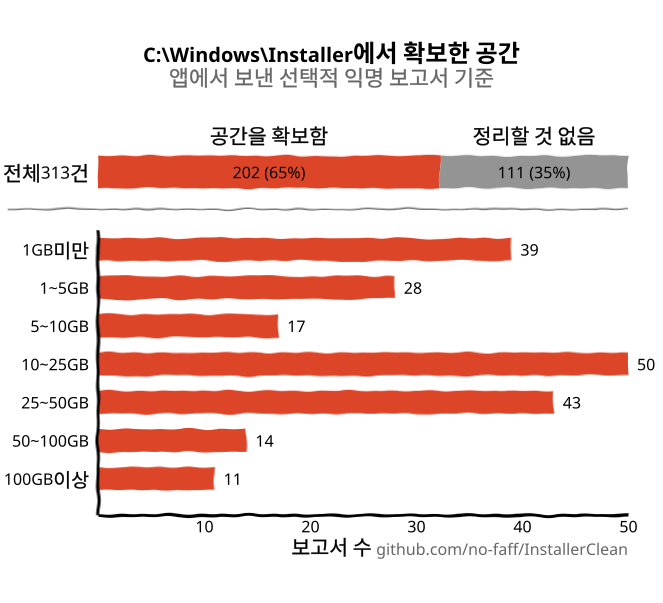
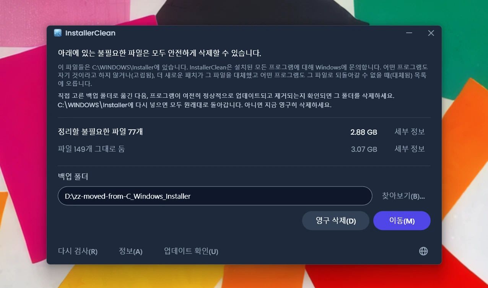
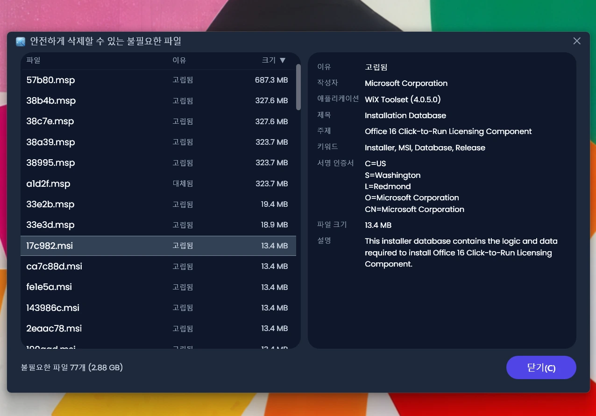
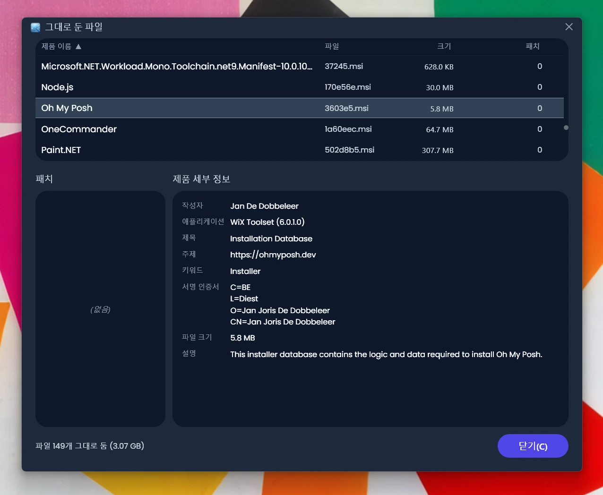
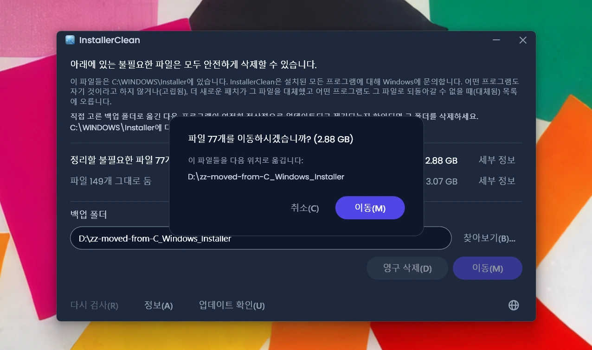
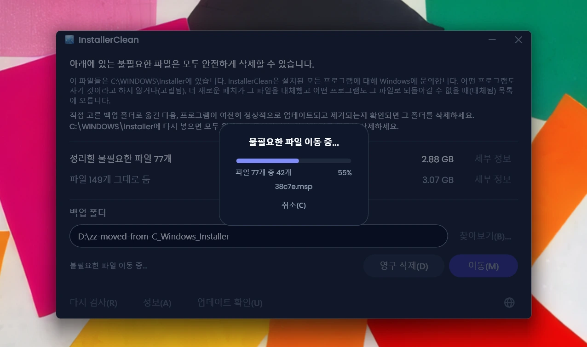
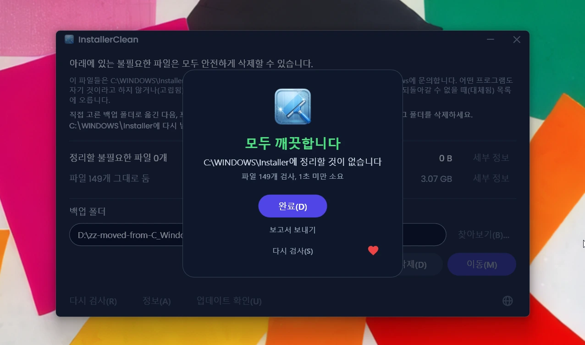

<p align="center">
  <a href="README.md">English</a> · <a href="README.zh-CN.md">简体中文</a> · <a href="README.ru.md">Русский</a> · <a href="README.es.md">Español</a> · <a href="README.ar.md">العربية</a> · <a href="README.ja.md">日本語</a> · <a href="README.pt-BR.md">Português (BR)</a> · <a href="README.pl.md">Polski</a> · <a href="README.tr.md">Türkçe</a> · <strong>한국어</strong> · <a href="README.fr.md">Français</a> · <a href="README.it.md">Italiano</a> · <a href="README.de.md">Deutsch</a> · <a href="README.id.md">Bahasa Indonesia</a> · <a href="README.vi.md">Tiếng Việt</a> · <a href="README.uk.md">Українська</a> · <a href="README.nl.md">Nederlands</a>
</p>

<p align="center">
  
</p>

<p align="center"><em>🎶 What's my line? I'm happy <a href="https://www.youtube.com/watch?v=HM-jHhUZfFI">cleaning Windows</a></em></p>

<h1 align="center">InstallerClean</h1>

<p align="center"><strong>디스크 공간을 소리 없이 갉아먹는 숨겨진 Windows 폴더 <code>C:\Windows\Installer</code>를 안전하게 정리하는 오픈 소스 도구입니다.</strong></p>

<p align="center"><em>쓸 일은 가뭄에 콩 나듯. 어쩌면 공간이 좀 생길지도. 개운하게 떠나세요.</em></p>

<p align="center">
  <a href="LICENSE"></a>
  <a href="https://dotnet.microsoft.com/download/dotnet/10.0"></a>
  <a href="https://github.com/no-faff/InstallerClean/actions/workflows/ci.yml"></a>
  <a href="https://github.com/no-faff/InstallerClean/releases"></a>
  <a href="https://github.com/no-faff/InstallerClean/releases/latest"></a>
  <a href="https://github.com/no-faff/InstallerClean/releases"></a>
</p>

<a id="reports-stats"></a>

<!-- reports-stats-start chart-only (generated; do not hand-edit between these markers) -->
<p align="center">
  <picture>
    <source media="(prefers-color-scheme: dark)" srcset="docs/reports-ko-dark.svg" />
    <source media="(prefers-color-scheme: light)" srcset="docs/reports-ko-light.svg" />
    
  </picture>
</p>
<!-- reports-stats-end -->

- **개요:** InstallerClean은 한 가지 일만 합니다. 소프트웨어를 설치하고 업데이트하는 동안 점점 차오르는 숨겨진 폴더 `C:\Windows\Installer`에서 불필요한 파일을 제거합니다. 빠른 검사를 마치면 그런 파일이 있는지 알려 주고, 궁금한 분께는 더 자세한 내용을 보여 주며, 그 파일을 다른 곳으로 옮기거나 삭제해 C: 드라이브 공간을 확보할 수 있게 합니다.
- **이래서 오셨을지도 모릅니다:** [WinDirStat](https://github.com/windirstat/windirstat)나 WizTree, TreeSize를 써 보니 `C:\Windows\Installer`가 공간을 많이 차지하고 있는데, 그 안에 무엇이 들어 있는지는 알 수 없으셨을 겁니다. 그렇다면 InstallerClean이 바로 필요한 도구입니다. `9f05cba.msi`처럼 알 수 없는 이름의 파일 안에 무엇이 들어 있는지 알고 있어서, 어느 것을 안전하게 제거할 수 있는지 빠르게 알려 줍니다.
- **얼마나 비워지나:** 위 그래프는 v1.8.0부터 꾸준히 들어오고 있는 선택적 보고서의 결과입니다. (버튼을 눌러 주신 모든 분께 감사드립니다. 여러분이 아니었다면 위 그래프는 없었을 겁니다.) 공간을 확보한 <!-- reports-freedpct-start -->64%<!-- reports-freedpct-end --> 가운데, 확보된 공간의 중앙값은 <!-- reports-median-start -->15.5GB<!-- reports-median-end -->입니다. <!-- reports-biggest-start -->한 대는 무려 462GB를 되찾았습니다.<!-- reports-biggest-end --> 나머지 <!-- reports-nothingpct-start -->36%<!-- reports-nothingpct-end -->는 아무것도 확보하지 못했으니, 결국 컴퓨터에 따라 다릅니다. 추가 소프트웨어 없이 갓 설치한 Windows 11에는 제거할 것이 없습니다. 불필요한 파일이 가장 많은 쪽은 몇 년째 돌아가고 있는 컴퓨터, 덩치 큰 MSI 기반 소프트웨어가 깔린 컴퓨터(Acrobat, Office, LibreOffice, 대형 개발 도구), 그리고 소프트웨어를 자주 설치하고 제거하는 분들입니다. 정확히 얼마인지는 실행하는 순간 보입니다.
- **안전한가요:** 네. InstallerClean은 `C:\Windows\Installer` 안의 파일만 건드립니다. 무엇이 아직 필요한지를 Windows Installer에 물어보고, 같은 기록을 레지스트리에서도 읽습니다. 컴퓨터에 설치된 어떤 것도 그 파일을 자기 것이라고 하지 않을 때, 또는 더 새로운 패치가 그 파일을 대체했고 여기 있는 어떤 프로그램도 옛 파일로 되돌아갈 수 없을 때에만 그 파일을 제시합니다. 분명한 답을 얻지 못한 것을 모두 보류합니다. [자세한 내용은 아래](#작동-방식)에 있습니다.
- **사용자에 대해서는 아무것도 모릅니다:** 오픈 소스(Apache 2.0)입니다. 계정도, 광고도, 추적도, 텔레메트리도 없고, 백그라운드에서 도는 것도 없습니다. 스스로 온라인으로 하는 일은 실행할 때 GitHub에 새 버전이 있는지 확인하는 것 하나뿐이고, 그마저도 끌 수 있습니다.
- **받기:** [최신 릴리스를 다운로드하세요](../../releases/latest). 실행하고, [Windows가 표시하는 경고](#unknown-publisher)와 [관리자 권한 요청](#admin)을 클릭해 넘어가세요. 찾아낸 파일을 이동하거나 삭제하세요. 끝입니다.

## 목차

- [아무도 알려주지 않는 폴더](#아무도-알려주지-않는-폴더)
- [도움을 찾아서](#도움을-찾아서)
- [InstallerClean이 하는 일](#installerclean이-하는-일)
- [스크린샷](#스크린샷)
- [작동 방식](#작동-방식)
- [다운로드](#다운로드)
  - [내려받은 파일을 직접 확인하기](#내려받은-파일을-직접-확인하기)
- [자주 묻는 질문](#자주-묻는-질문)
- [명령줄](#명령줄)
- [접근성](#접근성)
- [코드 서명 정책](#코드-서명-정책)
- [개인정보](#개인정보)
- [하지 않는 일](#하지-않는-일)
- [다른 선택지](#다른-선택지)
- [C:\Windows\Installer에서 파일이 사라졌다면](#recovery)
- [요구 사항](#요구-사항)
- [소스에서 빌드](#소스에서-빌드)
- [기여](#기여)
- [프로젝트 후원](#프로젝트-후원)
- [스타 히스토리](#스타-히스토리)
- [라이선스](#라이선스)

---

## 아무도 알려주지 않는 폴더

모든 Windows PC에는 `C:\Windows\Installer`라는 숨겨진 폴더가 있습니다. Windows Installer 방식을 사용하는 소프트웨어를 설치하거나, Microsoft Office, Adobe Acrobat, Visual Studio를 비롯한 `.msi` 기반 애플리케이션에 패치를 적용할 때마다, 그 설치 관리자나 `.msp` 패치 파일의 사본이 이 폴더에 들어가 그대로 남습니다.

새 패치가 옛 패치를 대체해도 둘 다 남습니다. 오래전에 제거한 소프트웨어의 설치 관리자도 마찬가지입니다. 디스크 정리도 저장 공간 센스도 이 파일들을 건드리지 않습니다. DISM은 전혀 다른 폴더를 위한 도구입니다. 시간이 지나면서 폴더는 1 GB, 5 GB, 20 GB, 50 GB로 점점 커집니다. MSI를 많이 쓰는 소프트웨어가 깔린 컴퓨터(Acrobat이 흔한 원인입니다)에서는 [100 GB를 넘기기도](https://www.reddit.com/r/sysadmin/comments/1oxcrmh/acrobat_filling_up_the_cwindowsinstaller_folder/) 합니다.

이들은 알아서 다시 생기는 임시 파일이 아닙니다. 몇 년 전 제거한 소프트웨어의 오래된 설치 관리자, 여러 번에 걸쳐 대체된 패치 같은, 말 그대로 군더더기입니다. 한 번 사라지면 다시 돌아오지 않습니다.

**Windows에서 디스크 공간을 손쉽게 확보할 방법을 찾고 있다면, 이 폴더가 좋은 출발점입니다.** InstallerClean은 불필요한 파일을 찾아 안전하게 제거합니다.

## 도움을 찾아서

이 폴더에 관해 한 번이라도 도움을 찾아본 적이 있다면, 그 과정이 어떻게 흘러가는지 아실 겁니다. `C:\Windows\Installer`에 180 GB를 떠안은 누군가가 정리 방법을 묻습니다. [디스크 정리를 돌려 보라는 답을 듣습니다](https://learn.microsoft.com/en-us/answers/questions/4238108/windows-installer-folder-has-occupied-180gb). 해 봅니다. 600 MB가 비워지지만 그 폴더에서 나온 건 하나도 없습니다(디스크 정리는 `C:\Windows\Installer`를 건드리지 않으니까요). 그러고는 글타래가 조용해집니다.

> *“제가 찾은 글타래는 하나같이 문제를 해결하지 못하는 똑같은 방법만 권하다가, 그대로 대화가 끊겨 버립니다.”*
>
> [ksparks519, r/Windows10](https://www.reddit.com/r/Windows10/comments/1bt8c5p/anyone_ever_figure_out_giant_installer_folders/) (영어 원문에서 번역)

아니면 아예 건드리지 말라는 말을 듣기도 합니다. 어떤 글타래에서는 60 GB짜리 Installer 폴더를 가진 사람이 [“건드리지 마세요.”](https://www.reddit.com/r/techsupport/comments/1hw4suq/my_windows_installer_folder_is_like_60gb_so_i/)라는 말을 들었습니다. 그럼 대신 어떻게 해야 하느냐고 묻자, 돌아온 답은 *“방금 말했잖아요.”*였습니다.

흔한 조언은 서로 다른 두 가지를 혼동합니다. 파일을 마구잡이로 지우면 그 파일이 속한 프로그램을 업데이트하거나 제거할 수 없게 됩니다. 컴퓨터에 설치된 어느 것에도 속하지 않는 파일, 또는 Windows가 대체되었다고 기록해 둔 파일만 제거하는 것은 그렇지 않습니다. InstallerClean이 하는 것은 후자입니다.

## InstallerClean이 하는 일

1. `C:\Windows\Installer`에서 `.msi`와 `.msp` 파일을 **검사**합니다
2. 무엇이 아직 필요한지 Windows Installer에 **물어보고**, 같은 기록을 레지스트리에서도 읽습니다
3. 두 읽기가 서로 결론을 내지 못한 것을 **보류합니다**
4. **얼마를 확보할 수 있는지**와 얼마를 그대로 두는지 알려 줍니다. 모든 파일을 나열하는 세부 정보 창도 선택적으로 열 수 있습니다
5. 불필요한 파일을 **제거합니다**. 직접 고른 백업 폴더로 이동하거나, 영구 삭제합니다

## 스크린샷

<p>
  <br>
  <em>첫 검사. 아주 빠릅니다.</em>
  <br><br>
</p>

<p>
  <br>
  <em>결과: 얼마를 제거할 수 있고, 얼마를 그대로 두었는지.</em>
  <br><br>
</p>

<p>
  <br>
  <em>제거할 수 있는 파일의 세부 정보. 각 파일이 필요 없는 이유와, 그 파일이 스스로 밝히는 내용.</em>
  <br><br>
</p>

<p>
  <br>
  <em>그대로 둔 파일의 세부 정보. Windows가 각 파일의 주인이라고 말하는 프로그램과, 그 파일이 스스로 밝히는 내용.</em>
  <br><br>
</p>

<p>
  <br>
  <em>어느 작업이든 실행 전에 확인을 거칩니다. 이동은 직접 고른 폴더에 파일을 백업해 둡니다. 아니면 영구 삭제하세요.</em>
  <br><br>
</p>

<p>
  <br>
  <em>이동이 진행 중일 때. 같은 드라이브 안이라면 즉시 끝납니다. 다른 드라이브로 옮기면 GB가 클수록 오래 걸립니다.</em>
  <br><br>
</p>

<p>
  <br>
  <em>끝. 공간을 되찾았습니다. 모든 것이 괜찮다고 확신하실 때까지 파일은 백업되어 있습니다. 그런 다음 백업 폴더를 삭제하세요.</em>
  <br><br>
</p>

<p>
  <br>
  <em>다시 검사한 뒤. 정리할 것이 남아 있지 않습니다.</em>
  <br><br>
</p>

<a id="is-it-safe"></a>
## 작동 방식

Windows Installer는 프로그램을 설치할 때 그 설치 관리자의 사본을 `C:\Windows\Installer`에 보관하고, 프로그램에 패치가 등록되면 그 사본도 함께 보관합니다. 나중에 소프트웨어를 복구하거나 업데이트하거나 제거할 때 바로 이 사본을 가지고 작업하며, 그래서 설치가 끝난 뒤로도 한참 동안 그대로 남습니다. 두 종류의 사본이 모두 이 폴더에 들어갑니다. `.msi` 설치 관리자, 그리고 이미 있는 프로그램을 교체하는 대신 업데이트하는 `.msp` 패치입니다.

InstallerClean이 파일을 제시하는 이유는 둘 중 하나입니다.

**고립됨**은 컴퓨터의 어떤 것도 그 파일을 자기 것이라고 하지 않는다는 뜻입니다. 설치된 어떤 제품도, 등록된 어떤 패치도 그 파일을 가리키지 않습니다.

**대체됨**은 더 새로운 패치가 이 패치를 교체했다고 Windows가 기록해 두고도 파일은 그대로 남겨 두었다는 뜻입니다. 패치가 삭제되는 것은 그 패치가 등록된 모든 프로그램이 제거되었을 때, 또는 그 모든 프로그램에서 패치가 제거되었을 때뿐입니다. 더 새로운 패치에 교체되는 것은 둘 중 어느 쪽도 아니므로 파일은 남습니다. Windows의 Adobe Acrobat이 이런 식으로 동작합니다. 업데이트가 새 설치 관리자가 아니라 기본 설치에 얹는 패치로 나오기 때문에, 한동안 써 온 컴퓨터에는 여러 개가 쌓여 있을 수 있습니다.

InstallerClean은 이 둘을 서로 반대 방향에서 알아내며, 폴더 안을 들여다보는 것은 그중 첫 번째뿐입니다.

**폴더 나열하기.** InstallerClean은 `C:\Windows\Installer` 바로 아래에 있는 `.msi`와 `.msp` 파일을 나열합니다. 하위 폴더 안으로는 들어가지 않습니다.

**기록을 두 번 읽기.** InstallerClean은 `msi.dll`에 있는 Windows Installer API를 호출해, 설치된 모든 제품과 등록된 모든 패치, 그리고 각각이 가리키는 캐시 파일을 Windows Installer에 물어봅니다. 그런 다음 같은 기록을 두 번째 방법으로, 레지스트리에서 곧바로 읽습니다. 물어보는 쪽이 아무 말 없이 덜 돌려줄 수 있기 때문입니다. Windows는 더 없다고 할 때까지 기록을 하나씩 건네주는데, 이백 개 중 세 번째에서 멈춘 실행은 끝까지 간 실행과 똑같아 보입니다. 레지스트리 키는 이름 목록 전체를 한 번에 건네주므로, 짧은 목록이 완전해 보일 수가 없습니다. 레지스트리에는 있는데 물어보는 쪽이 놓친 제품이 있으면, InstallerClean이 그 이름을 하나씩 다시 Windows에 넣어 확인합니다. 이 두 번째 읽기는 파일을 ‘아직 필요함’ 쪽으로 옮길 수만 있습니다. 이 읽기가 파일을 제거 목록에 올리는 경로는 없습니다.

**기록과 파일 맞추기.** 기록은 캐시 파일을 경로로 가리키는데, 같은 폴더라도 기록마다 표기가 늘 같지는 않습니다. 그래서 InstallerClean은 표기를 믿는 대신, 기록된 각 경로가 실제로 어디를 가리키는지 Windows에 물어보고, 그 답을 폴더에서 나열한 파일과 맞춰 봅니다. 그래도 주인이 나오지 않은 파일은 이름을 거치지 않는 두 번째 비교를 받습니다. 파일을 열어 Windows에 무엇인지 식별해 달라고 해서, 같은 파일을 가리키는 서로 다른 두 이름이 한 파일로 인식되게 합니다.

**맞출 수 없는 기록.** 기록된 경로가 어디를 가리키는지 Windows가 답하지 않거나, 그 경로 끝에 있는 파일을 식별할 수 없으면, InstallerClean은 그 기록이 어느 파일에 관한 것인지 알지 못하며, 나열한 파일 가운데 어느 것이든 그 파일일 수 있습니다. 프로그램이 두 번 이상 설치되었을 수 있는 경우도 마찬가지입니다. 그때는 어느 캐시 파일이 어느 설치본의 것인지 가릴 수 없기 때문입니다. 이 가운데 어느 경우든, 그 실행에서 폴더를 나열해 찾은 것을 하나도 제시하지 않습니다. 이미 사라진 파일을 가리키는 기록은 다릅니다. 그 기록이 뜻했을 만한 것이 남아 있지 않으므로, 아직 폴더에 있는 어떤 파일에 관한 것일 수도 없습니다.

**반대편에서 물어보기.** 고립됨은 무언가가 없다는 사실로 판정되는데, 없다는 것은 앱이 기록을 찾아내지 못했다는 뜻일 수도 있습니다. 그래서 `.msi` 설치 관리자를 제시하기 전에, InstallerClean은 파일을 열어 그 파일이 스스로 지니고 있는 제품 코드를 읽고, 그 제품이 설치되어 있는지 Windows에 물어봅니다. 설치되어 있다면, 검사의 나머지가 무엇을 찾았든 그 파일은 남습니다. 이 확인은 파일을 목록에서 빼기만 할 수 있습니다. 이 확인이 내놓는 어떤 답도 파일을 목록에 올리지는 못합니다.

**`.msp` 패치를 정하는 것.** 패치를 열어서 어느 프로그램의 것인지 묻지는 않습니다. 대신 판정을 내리는 것은, 패치 등록이 자신의 캐시 파일을 두 군데에서 가리킨다는 점입니다. 각 제품에 등록된 패치 목록, 그리고 컴퓨터의 모든 패치 등록을 담은 레지스트리 목록 하나입니다. 패치가 고립됨으로 제시되는 것은 그 두 곳 어디에서도 가리켜지지 않을 때뿐입니다.

**대체된 패치가 다른 점.** 위의 어느 과정도 거치지 않습니다. 주인이 없는 파일이 아니기 때문입니다. Windows에 그 기록이 있고, 교체되었다고 말해 주는 것이 바로 그 기록입니다. 위험은 다른 데 있습니다. 패치는 여러 프로그램에 등록될 수 있고, 그중 한 프로그램만 그 패치를 다 썼을 수 있습니다. 그래서 대체된 패치는 다음이 모두 갖추어졌을 때만 제시됩니다. Windows가 그 패치를 제거할 수 없다고 기록해 두었고, InstallerClean이 그 패치가 등록된 모든 프로그램에 물어보았고, 그 가운데 어느 프로그램도 패치를 여전히 적용하고 있지 않으며, 그 가운데 어느 프로그램도 Windows가 제거할 수 있다고 말하는 패치를 지니고 있지 않을 때입니다. 마지막 조건이 있는 이유는, 프로그램에 적용된 패치를 되돌리는 과정이 옛 파일을 다시 찾을 수 있기 때문입니다. 이 가운데 어느 하나라도 답할 수 없으면 파일은 남습니다.

<details>
<summary>이 앱이 사용하는 Windows Installer 호출</summary>

- `MsiEnumProductsEx`로 설치된 모든 제품을 나열하고, 제품 코드 하나를 주어 특정 제품이 설치되어 있는지 묻기도 합니다
- `MsiEnumPatchesEx`로 등록된 패치를 나열합니다. 제품별로도, 컴퓨터 전체로도 나열합니다
- `MsiGetProductInfoEx`로 제품의 이름, 그 제품이 가리키는 캐시 파일, 그리고 같은 제품이 여러 번 설치된 것 중 하나인지를 읽습니다
- `MsiGetPatchInfoEx`로 패치의 상태, Windows가 그 패치를 제거할 수 있는지, 그리고 그 패치가 가리키는 캐시 파일을 읽습니다
- `MsiGetSummaryInformation`과 `MsiSummaryInfoGetProperty`로 패치 파일에서 어떤 프로그램에 적용할 수 있는지를 읽습니다
- `MsiOpenDatabase`, `MsiDatabaseOpenView`, `MsiViewExecute`, `MsiViewFetch`, `MsiRecordGetString`으로 설치 관리자 파일에서 그 파일이 선언한 제품 코드를 읽습니다

</details>

그렇게 해 두고도, 앱은 파일을 백업 폴더로 이동하시기를 권합니다(C 드라이브 공간을 확보하는 것이 목적이라면 다른 드라이브나 파티션에 두세요). 그러면 불필요한 파일을 최종적으로 삭제하기 전에, 정말로 아무 문제가 없는지 직접 확인해 볼 기회가 생깁니다.

## 다운로드

세 가지 빌드 중 하나를 고르세요:

- **Portable**(`InstallerClean-3.0.0-portable.exe`): .NET 10 런타임을 안에 담은 파일 하나입니다. 설치도, 제거 관리자도 없습니다. 두 번 클릭하면 실행됩니다. 다음을 위해 어딘가에 두셔도 되고, 다 쓰셨으면 지우셔도 됩니다.
- **Setup**(`InstallerClean-3.0.0-setup.exe`): .NET 10 런타임을 함께 담은 일반 Windows 설치 관리자입니다. 시작 메뉴에 항목을 추가하고 깔끔하게 제거됩니다. 프로그램 목록에 자리 잡고 있으니 여섯 달 뒤에도 찾기 쉽고, 소프트웨어를 자주 설치하고 제거하신다면 그보다 자주 실행하기에도 좋습니다.
- **CLI**(`installerclean-cli.exe`): 명령줄 버전만 따로 떼어 낸, 런타임을 안에 담은 파일 하나입니다. 설치도, 제거 관리자도 없습니다. 클라이언트에 올려 검사나 정리를 실행하고 지우세요. 클라이언트에 데스크톱 앱을 두지 않고 작업만 하고 싶을 때를 위한, 스크립트와 예약 작업과 대규모 배포용입니다. 인수와 종료 코드는 [명령줄](#명령줄)을 참고하세요.

2.2.0부터 setup과 portable 파일 이름에 버전 번호가 들어가므로, 내려받은 파일이 무엇인지 이름만 봐도 늘 알 수 있습니다. CLI는 `installerclean-cli.exe`라는 평범한 이름을 그대로 유지하므로, 그 경로를 가리키는 예약 작업과 스크립트는 업데이트를 거쳐도 계속 동작합니다.

[릴리스 페이지](../../releases/latest)에서 내려받아 실행하세요. 서명되어 있지 않아 Windows가 “알 수 없는 게시자” 경고를 표시합니다. 무엇이 보이고 왜 안전한지는 [자주 묻는 질문](#unknown-publisher)에서 설명합니다.

앱은 시작할 때 자동으로 검사합니다. 결과를 살펴본 다음 **이동**이나 **영구 삭제**를 클릭하세요.

또는 [winget](https://learn.microsoft.com/windows/package-manager/winget/)으로 설치하세요:

```
winget install NoFaff.InstallerClean
```

또는 [Scoop](https://scoop.sh)으로 설치하세요:

```
scoop install installerclean
```

### 내려받은 파일을 직접 확인하기

InstallerClean은 서명되어 있지 않습니다. 실행하기 전에 확인해 보실 수 있는 것은 다음과 같습니다:

- 내려받는 파일마다 SHA-256이 해당 릴리스 페이지에 있습니다. 릴리스 노트 안에도, 파일 옆의 별도 `.sha256` 파일로도 있습니다.
- VirusTotal: 모든 빌드는 나가기 전에 검사하며, 릴리스 페이지에 파일별 엔진 전체 결과가 실려 있습니다.
- 소스는 [github.com/no-faff/InstallerClean](https://github.com/no-faff/InstallerClean)에 있습니다. 검사, 질의, 이동, 삭제, 설정, 재부팅 대기 확인 서비스는 `main`에 푸시할 때마다, 그리고 풀 리퀘스트마다 Windows에서 실행되는 자동화된 테스트 모음이 검증하며, 이 페이지 위쪽의 CI 배지가 그 결과를 알려 줍니다.
- 릴리스 빌드는 결정적입니다. 같은 소스, 같은 SDK, 같은 게시 플래그는 같은 바이트를 냅니다. 그리고 모든 빌드 입력이 해당 태그의 소스와 일치하지 않으면 릴리스에 태그를 달 수 없습니다. 그래서 태그를 체크아웃해 직접 빌드한 뒤 공개된 해시와 비교해 보실 수 있습니다. 그러는 데 필요한 것은 각 릴리스의 노트에 있습니다. 빌드에 쓴 SDK 버전, 그리고 기본값이 아닌 플래그로 빌드한 파일이 있다면 그 게시 플래그입니다. Setup은 예외입니다. SDK가 아니라 Inno Setup이 컴파일하고 빌드 연도를 스스로 새겨 넣으므로, 해시를 재현하려면 같은 Inno 버전과 같은 연도까지 필요합니다.
- GitHub, MajorGeeks, Softpedia를 통틀어 <!-- downloads-start -->77,000+<!-- downloads-end --> 회 내려받았습니다.
- [MajorGeeks](https://www.majorgeeks.com/files/details/installerclean.html)는 제출된 각 파일을 가상 머신에서 테스트하고, 자체 검토를 통과한 경우에만 목록에 올립니다.<br><a href="https://www.majorgeeks.com/files/details/installerclean.html"></a>
- [Softpedia](https://www.softpedia.com/get/System/Hard-Disk-Utils/InstallerClean.shtml)는 검토한 뒤 스파이웨어와 애드웨어, 바이러스가 없음을 인증했습니다.<br><a href="https://www.softpedia.com/get/System/Hard-Disk-Utils/InstallerClean.shtml"></a>

## 자주 묻는 질문

<a id="admin"></a>

**왜 관리자 권한이 필요한가요?** 두 가지 이유가 있습니다. `C:\Windows\Installer`는 관리자만 접근할 수 있도록 잠겨 있어서, 이 폴더를 읽고, Windows Installer에 질의하고, 파일을 이동하거나 삭제하는 일 모두에 관리자 권한이 필요합니다. 그리고 관리자는 컴퓨터의 어느 계정으로 설치된 프로그램이든 Windows에 물어볼 수 있지만, 관리자가 아니면 그럴 수 없습니다. 관리자 권한 없이 실행하면, 파일이 아직 필요한지 판정하는 확인 안에서 Windows가 설치되어 있는 프로그램을 설치되어 있지 않다고 답하게 됩니다.

<a id="unknown-publisher"></a>

**왜 Windows가 “알 수 없는 게시자”라고 하나요?** InstallerClean이 코드 서명되어 있지 않은 데다, Windows는 인터넷에서 내려받은 파일에 표시를 남기기 때문입니다. 그래서 처음 실행할 때 SmartScreen이 “Windows의 PC를 보호했습니다”라고 표시하고 게시자를 알 수 없음으로 내놓는 것이 보통입니다. 유료 서명 인증서는 해마다 비용이 들고, 저는 그 돈을 내느니 앱을 무료로 유지하고 싶습니다. 그래서 오픈 소스 소프트웨어에 무료로 서명해 주는 SignPath Foundation에 신청했고, InstallerClean은 승인되었습니다([코드 서명 정책](#코드-서명-정책) 참고). 인증서는 아직 발급되지 않았으니, 당분간은 **추가 정보**를 클릭한 다음 **실행**을 클릭하세요. 그렇게 해도 안전합니다. 소스 코드가 공개되어 있고, 모든 릴리스에 미리 확인해 보실 수 있는 VirusTotal 링크와 SHA-256 해시가 있습니다.

**Windows 7이나 8에서 동작하나요?** 아니요. Windows 10 버전 1607 이상이 필요합니다. .NET 10 런타임이 지원하는 가장 오래된 빌드입니다. 그보다 오래된 버전에는 Setup이 설치를 거부하고, Portable 빌드는 시작되지 않습니다.

## 명령줄

`installerclean-cli.exe`는 GUI와 나란히 설치되는 별도의 콘솔 실행 파일입니다. 같은 검사, 같은 이동, 같은 삭제를 창 없이 합니다. 끝날 때까지 프롬프트를 붙잡으므로, 스크립트나 예약 작업이 실행을 기다릴 수 있습니다.

### 플래그

| 플래그 | 하는 일 | 함께 받는 형태 |
|---|---|---|
| `/s` | 검사만 합니다. 제거할 파일을 이름, 크기, 이유와 함께 나열합니다. 아무것도 바꾸지 않습니다. | |
| `/d` | 검사한 다음 불필요한 파일을 영구 삭제합니다. | |
| `/m` | 검사한 다음 GUI에 저장된 폴더로 이동합니다. | |
| `/m 경로` | 검사한 다음 `경로`로 이동합니다. 공백이 들어 있으면 따옴표로 묶으세요. | |
| `--help` | 사용법을 출력하고 `0`으로 종료합니다. | `/?`, `-h` |
| `--version` | 버전을 출력하고 `0`으로 종료합니다. | `-v` |

플래그는 대소문자를 가리지 않으므로 `/s`와 `/d`뿐 아니라 `/S`와 `/D`도 됩니다. 한 번 실행에 플래그는 하나뿐입니다. 여러 개를 함께 쓸 수 없고, `/s`와 `/d` 뒤에는 아무것도 오지 않습니다.

인수 없이 실행하면 사용법을 출력하고 `1`로 종료하므로, 플래그를 잃어버린 예약 작업은 아무 일도 안 하면서 조용히 넘어가는 대신 눈에 띄게 실패합니다. 인식하지 못하는 플래그는 오류 한 줄과 사용법을 출력하고 역시 `1`로 종료합니다. 따옴표로 묶지 않아 공백이 들어간 이동 경로도 조용히 잘려 나가는 대신 같은 방식으로 거부되며, 따옴표로 묶으라고 메시지가 알려 줍니다.

### 종료 코드

도구가 `--help`에서 직접 설명하는 코드입니다:

| 코드 | 뜻 |
|---|---|
| `0` | 성공. 실행이 시킨 일을 했고 실패한 것이 없습니다. |
| `1` | 처리된 것 없음. 실행이 실패했거나 거부되었습니다. |
| `2` | 부분 처리. 일부는 처리되고 일부는 처리되지 않았습니다. 도중에 들어온 Ctrl+C도 여기에 들어갑니다. |
| `75` | 일시적 상태. 일시적인 상황이 실행을 막았습니다. 출력된 메시지가 어떤 상황인지 알려 줍니다. |
| `130` | 아무것도 처리하기 전에 Ctrl+C로 취소되었습니다. |

`1`은 실패뿐 아니라 거부도 포함하며, 거부는 잘못이 아닙니다. 그저 가득 차 있는 대상 폴더나, 아무것도 건드리기 전에 앱이 읽지 못한 레지스트리 값이 모두 여기에 들어옵니다. `0`은 실패한 것이 없다는 뜻이지 남은 것이 없다는 뜻이 아닙니다. `--help`와 `--version`, 그리고 검사만 하는 실행은 검사가 파일 예순여덟 개를 찾았든 하나도 찾지 못했든 모두 `0`으로 종료합니다.

### 이벤트 로그

실행할 때마다 결과 항목 하나를 응용 프로그램 로그에 기록하고, 그 옆에 알림을 하나 이상 덧붙이기도 합니다. 이벤트 ID는 기계가 믿고 쓸 수 있는 고정된 약속이므로, RMM은 텍스트를 분석하지 않고 번호만으로 거를 수 있습니다:

| ID | 뜻 |
|---|---|
| `1000` | 성공 |
| `1002` | 부분 처리 |
| `2000` | 건너뜀, 일시적 상태 |
| `4000` | 심각한 실패 |
| `3000` | 알림: 검사가 설치된 모든 제품을 다루지는 못했습니다 |
| `3001` | 알림: Windows가 있다고 보는 파일이 폴더에 없습니다 |
| `3002` | 알림: 제시하지 않고 보류한 파일이 있습니다 |

`3000`번대는 결과가 아니라 알림이며, 실행 결과로 치지 않습니다. 항목 종류는 실행에 아무 문제가 없었으면 정보, 문제가 있었으면 경고입니다. **이벤트 로그는 컴퓨터의 표시 언어가 무엇이든 언제나 영어입니다.** 그래서 알고 있는 문구로 거르면 대상이 일정합니다. 번역되는 쪽은 콘솔입니다. 콘솔은 컴퓨터 자체의 언어를 따르고, 크기와 날짜는 그 지역의 방식으로 적습니다.

### 사용 예

아무것도 바꾸지 않고 검사 결과를 파일로 남기기:

```
installerclean-cli /s > audit.txt
```

CLI를 `C:\Tools`에 두고 매월 `D:\InstallerBackup`으로 이동하기:

```
schtasks /create /tn "InstallerClean monthly" /tr "C:\Tools\installerclean-cli.exe /m D:\InstallerBackup" /sc monthly /ru SYSTEM /rl highest
```

작업은 실행이 끝날 때까지 기다렸다가 종료 코드를 마지막 실행 결과로 기록하므로, RMM은 위의 코드를 기준으로 삼을 수 있습니다.

PowerShell에서는:

```powershell
& 'C:\Tools\installerclean-cli.exe' /m D:\InstallerBackup
switch ($LASTEXITCODE) {
    0       { '깨끗함' }
    2       { '부분 처리, 출력을 확인하세요' }
    75      { '차단됨, 나중에 다시 시도하세요' }
    default { "실패 ($LASTEXITCODE)" }
}
```

### 스크립트로 만들기 전에

- **권한 상승이 필요합니다.** `/s`를 포함해 전부 그렇습니다. 권한이 상승되지 않은 프롬프트에서는 Windows가 시작을 거부하고 셸에 `740`을 돌려줍니다.
- **GUI에 저장된 폴더는 사용자별입니다.** SYSTEM이나 서비스 계정으로 도는 작업에는 보이지 않으므로, 그런 실행에서는 `/m 경로`를 넘겨야 합니다.
- **SYSTEM은 컴퓨터 계정으로 네트워크에 접근하므로**, `\\server\share` 같은 대상에는 그 계정에 권한을 주어야 합니다.
- **`/s`는 아무것도 막지 않습니다.** 읽기 전용이고 잠금을 잡지 않으므로, 데스크톱 앱이 열려 있는 동안에도 검사할 수 있습니다. `/d`와 `/m`은 컴퓨터 전체에 걸리는 잠금을 잡으며, 다른 InstallerClean 실행이 그 잠금을 쥐고 있으면 `75`로 종료합니다.
- **모든 출력이 stdout으로 나가며** 오류도 마찬가지입니다. stderr는 없습니다. 텍스트를 분석하지 말고 종료 코드를 기준으로 삼으세요.
- **이동은 이름을 바꾸는 대신 거부합니다.** 대상 폴더에 같은 이름의 파일이 이미 있으면 그 파일은 캐시에 남고 출력에 이름이 나오며, 나머지는 그대로 이동합니다. 모든 파일의 이름이 겹치는 실행은 아무것도 처리하지 못하고 `1`로 종료합니다.
- **백업 폴더를 비워 주는 것은 아무것도 없습니다.** `/m`은 더하기만 합니다. 그 폴더는 직접 따로 치워 주셔야 합니다.
- **`taskkill /pid`는 정상적인 취소가 아닙니다.** 단일 인스턴스 잠금은 다음 실행 때 복구됩니다.
- **첫 실행은 이벤트 로그 원본을 등록합니다.** 위치는 `HKLM\SYSTEM\CurrentControlSet\Services\EventLog\Application\InstallerClean`입니다. 그대로 두세요. 이벤트 뷰어는 항목의 설명을 그 원본을 통해 읽으므로, 원본을 지우면 도구가 이미 기록해 둔 모든 항목이 원본을 알 수 없다는 오류로 바뀝니다.

### 왜 `installerclean.exe`가 아니라 `installerclean-cli`인가요

`InstallerClean.exe`는 창이며 명령줄 인수를 무시합니다. `installerclean-cli.exe`는 진짜 콘솔 프로세스라서, 끝날 때까지 프롬프트를 붙잡고 다른 프로그램과 똑같이 출력을 리디렉션하거나 파이프로 넘길 수 있습니다. Setup은 둘 다 설치합니다. Portable 다운로드에는 GUI만 들어 있습니다. 창 없이 명령줄만 원하신다면 [릴리스 페이지](../../releases/latest)에서 `installerclean-cli.exe`만 따로 내려받으세요.

## 접근성

InstallerClean은 키보드만으로도, 스크린 리더와 함께도 완전히 사용할 수 있도록 만들어졌습니다.

- **전체를 키보드로 조작할 수 있습니다.** 앱이 하는 모든 일에 키보드로 닿을 수 있고, 세부 정보 창의 열도 키보드로 정렬할 수 있어서 마우스가 필요한 곳이 없습니다. 제목 표시줄 버튼은 Windows의 것과 똑같이 동작하며 Alt+Space나 Alt+F4로 닿습니다. 키보드 포커스는 어디로 가든 항상 보입니다.
- **내레이터와 음성 액세스.** 모든 컨트롤에 레이블이 붙어 있고, 버튼에 보이는 단어가 곧 음성으로 그 버튼을 실행하는 단어입니다. 이동이나 삭제가 끝나면 그 결과를 소리 내어 읽어 줍니다.
- **읽기 좋게 만들어졌습니다.** 텍스트는 어두운 테마 전반에서 WCAG AA 명암 대비 기준을 충족합니다.

여기서 무언가 불편을 준다면 [이슈를 열어 주세요](../../issues). 접근성 문제는 사소한 예외가 아니라 버그입니다.

## 코드 서명 정책

InstallerClean은 [SignPath Foundation](https://signpath.org)의 무료 코드 서명 대상으로 승인되었습니다. 오픈 소스 소프트웨어에 서명을 해 주어, 그 소프트웨어가 알 수 없는 게시자로부터 여러분의 컴퓨터에 도착하는 일이 없도록 해 주는 프로그램입니다. 인증서 자체는 아직 발급되지 않아서, 지금 여기 있는 파일들은 서명되어 있지 않고 Windows가 경고를 냅니다.

발급되면 각 릴리스에는 SignPath가 요청하는 문구가 붙습니다. free code signing provided by SignPath.io, certificate by SignPath Foundation입니다. 인증서는 제 것이 아니라 재단의 것입니다. 인증서는 법인에 발급되어야 하는데, 한 사람이 만드는 프로젝트는 법인이 아니기 때문입니다. 그렇다고 InstallerClean이 재단의 것이 되는 것도 아니고, 서명 말고 다른 부분에 재단이 관여하는 것도 아닙니다.

**역할.** InstallerClean의 관리자는 한 사람입니다. 커밋하는 사람과 검토하는 사람, 곧 프로젝트에 코드를 넣을 수 있는 사람은 접니다. 승인하는 사람, 곧 릴리스에 서명하도록 허가할 수 있는 사람도 접니다.

## 개인정보

실행에 관해 무언가를 보내는 것은 선택적인 보고서 하나뿐이고, 그것도 버튼을 누르셨을 때만 나갑니다. 검사가 무엇을 찾았는지, 무엇을 왜 보류했는지, 이동하셨는지 삭제하셨는지, 그래서 얼마가 확보되었는지, 얼마나 걸렸는지, 실패한 것이 있는지, 그리고 앱의 버전과 읽으신 언어와 Windows 버전이 담깁니다. 파일 이름도, 폴더 이름도, 계정 이름도, 컴퓨터를 식별할 수 있는 것도, 보고서 두 건을 서로 엮을 수 있는 것도 들어가지 않습니다. 제 것이 아닌 컴퓨터에서 앱이 제대로 돌아가는지, 그리고 무엇을 보류하고 있는지 제가 알게 되는 길이 이것입니다.

광고도, 텔레메트리도 없습니다. 그 밖의 연결은 앱을 시작할 때의 버전 확인(GitHub에 보내는 요청 한 번으로, 정보 창에서 끌 수 있습니다), 그리고 GitHub과 마음이 내키면 후원하실 수 있는 페이지로 이어지는 버튼뿐입니다. 전체 [개인정보 처리방침](PRIVACY.md)은 여기 있습니다(영어).

## 하지 않는 일

- WinSxS(`C:\Windows\WinSxS`)는 규칙이 다른 별개의 폴더입니다. 그 폴더는 권한이 상승된 프롬프트에서 `Dism /Online /Cleanup-Image /StartComponentCleanup`을 실행하세요.
- 백그라운드 서비스도, 예약 작업도, 자동 정리도 없습니다. 앱은 직접 실행하실 때만 동작합니다.
- 설치된 프로그램이나 Windows Installer 데이터베이스를 바꾸지 않고 읽기만 합니다. 레지스트리에 쓰는 것이라고는, 명령줄 도구의 실행이 Windows 이벤트 로그에 나타나도록 하는 데 필요한 일회성 이벤트 원본 등록 하나뿐입니다.
- 앱이 스스로 맺는 연결은 한 가지뿐입니다. 실행할 때 GitHub 릴리스 페이지에 새 버전이 있는지 잠깐 확인하는 것으로, 정보 창에서 끌 수 있습니다. 나머지는 모두 사용자가 시키실 때만 일어납니다. 선택적인 익명 보고서(실행에 관한 숫자이며, 사용자나 파일의 이름은 들어가지 않습니다), 그리고 GitHub 문서와 후원 페이지로 가는 링크(클릭하면 브라우저에서 열립니다)입니다. 스스로 무언가를 내려받는 일은 절대 없습니다.
- 툴바도, 끼워 파는 소프트웨어도, 애드웨어도 없습니다.

## 다른 선택지

이 폴더를 전에 검색해 본 적이 있다면, 십중팔구 찾으셨을 도구는 [PatchCleaner](https://www.homedev.com.au/free/patchcleaner)일 겁니다. 이 일을 먼저 했고, InstallerClean이 있기 전 십 년 동안 해 왔고, 지금도 잘 돌아가고 있으며, PatchCleaner가 없었다면 InstallerClean도 없었을 겁니다.

제가 InstallerClean을 만든 것은 PatchCleaner가 비공개 소스이고, 2016년 3월 이후로 업데이트가 없으며, 기본적으로 Adobe 파일을 제외하기 때문입니다. 그 제외에는 그럴 만한 이유가 있고, HomeDev는 당시 릴리스 노트에 그 이유를 분명하게 밝혔습니다:

> *“PatchCleaner의 이전 버전에는 Adobe Acrobat Reader 패치를 필요 없는 것으로 잘못 판정하는 알려진 문제가 있습니다. Adobe는 자동 업데이트에 자체적인 방식을 쓰기 때문에, PatchCleaner가 설치 관리자 디렉터리에서 ‘고아’ 패치를 제거하면 Adobe Reader 자동 업데이트가 더 이상 제대로 설치되지 않습니다.”*
>
> [PatchCleaner 릴리스 노트, 버전 1.4.0.0](https://www.homedev.com.au/free/patchcleaner) (영어 원문에서 번역)

그와 함께 들어간 필터는 파일의 메타데이터와 서명에서 “Acrobat”이라는 단어를 찾습니다. Acrobat이 가장 큰 골칫거리인 컴퓨터에서는, 바로 그것이 공간의 대부분일 수 있습니다:

> *“고아가 된 `.msp` 파일을 지우려고 PatchCleaner를 받았는데, 이걸로는 250 MB밖에 못 비운다네요. 파일 중 29 GB가 ‘필터로 제외’되어서, PatchCleaner는 별 도움이 안 되는 것 같습니다.”*
>
> HeatherBunny1111, [r/techsupport](https://www.reddit.com/r/techsupport/comments/1qc4tcf/how_to_delete_msp_files_safely/) (영어 원문에서 번역)

여기서 두 도구의 차이는 각자 Windows에 무엇을 물어보는가이지, Adobe를 두고 의견이 다른 것이 아닙니다. 제품에 *적용된* 패치를 담은 Windows의 목록에는 더 새로운 패치가 교체한 패치가 빠져 있습니다. 그래서 그 목록을 읽는 도구에게는 대체된 패치의 파일이 다른 파일과 똑같이, 어느 것에도 속하지 않는 파일로 보입니다. Adobe 것을 이름으로 붙잡는 것이 바로 그 제외 필터입니다. InstallerClean은 대신 Windows에 패치의 상태를 물어보므로, 대체된 패치는 대체됨이라는 이름표를 달고 나오며, 그 파일을 어떻게 할지는 이름이 무엇이냐가 아니라 Windows가 그 패치에 관해 기록해 둔 내용으로 정해집니다. 둘을 비교하면 다음과 같습니다:

| | **InstallerClean** | **PatchCleaner** |
|---|---|---|
| 최종 업데이트 | 2026년(활발히 개발 중) | 2016년 3월 3일 |
| 소스 코드 | 오픈 소스(Apache 2.0) | 비공개 소스 |
| 런타임 | .NET 10(자체 포함) | .NET Framework 4.5.2 + VBScript |
| API | `msi.dll`의 Windows Installer API(프로세스 내) | Windows Installer COM(VBScript를 통한 프로세스 외부) |
| 대체된 패치 | Windows의 패치 기록으로 식별 | 주인 없는 파일과 구분하지 않음 |
| Adobe 파일 | 대체된 패치를 감지하고 이름표를 붙임 | 이름 필터로 제외, 기본으로 켜져 있음 |

> **`Win32_Product`에 관한 참고:** 설치된 제품을 나열하는 흔하지만 결함 있는 방법이 `Win32_Product`(WMI)이며, 이는 열거 도중 [모든 제품에 대해 MSI 복구 작업을 일으킵니다](https://gregramsey.net/2012/02/20/win32_product-is-evil/). InstallerClean과 PatchCleaner 둘 다 이를 피합니다. InstallerClean은 `msi.dll`에 있는 Windows Installer API를 호출하고, PatchCleaner는 Windows Installer COM 개체를 쓰는 도우미 스크립트를 실행합니다. 그 스크립트의 이름이 `WMIProducts.vbs`라서 달리 보이지만, 그 파일은 Microsoft가 내놓은 예제 스크립트를 고친 것이고, WMI가 아니라 Windows Installer에 물어봅니다. 오해를 부르는 것은 그 이름뿐입니다.

디스크 정리와 저장 공간 센스, CCleaner, BleachBit은 `C:\Windows\Installer`를 정리하지 않습니다.

<a id="recovery"></a>
## `C:\Windows\Installer`에서 파일이 사라졌다면

그 폴더에서 파일이 사라졌더라도, 그 파일이 속한 프로그램은 여전히 정상적으로 실행됩니다. 하지만 그 프로그램을 업데이트하거나 제거하려고 하면 십중팔구 실패합니다. Windows가 그 파일을 찾으러 갔다가 찾지 못하고, 그 단계에서 멈추기 때문입니다.

InstallerClean은 필요 *없는* 파일만 이동하거나 삭제하도록 제시하려고 존재하지만, 파일이 사라진 것을 알아볼 수는 있습니다. 그래서 그런 파일을 찾으면 경고 삼각형과 이곳으로 오는 링크를 함께 표시합니다. 프로그램을 복구해 보려면 다음과 같이 하세요:

- 설치된 프로그램의 버전 번호를 확인하세요(설정, 앱, 설치된 앱)
- 제작사에서 **그 버전의** 설치 관리자를 내려받으세요. 더 새로운 것으로는 되지 않고, 먼저 제거해 보는 것도 마찬가지입니다. 둘 다 계속 진행하려면 설치되어 있는 것을 먼저 없애야 하는데, 없애는 그 단계가 바로 사라진 파일을 필요로 하는 단계이기 때문입니다.
- 그 설치 관리자를 실행하세요
- 그러면 파일이 되돌아오고 설정은 그대로 남을 것입니다. InstallerClean에서 다시 검사해 보면, 제대로 됐을 경우 경고가 사라져 있을 겁니다.

다만 Microsoft는 그렇게 하면 된다고 보장하지 않습니다. 아래는 Microsoft가 직접 내놓은 더 자세한 설명입니다:

<details>
<summary>Microsoft의 더 자세한 입장</summary>

*아래 Microsoft 인용문은 영어 원문 그대로 싣습니다.*

전체 안내: [Restore missing Windows Installer cache files](https://learn.microsoft.com/en-us/troubleshoot/windows-client/application-management/missing-windows-installer-cache), KB 2667628.

*바로 드러나지 않을 수 있습니다:*
> "If the installer cache is compromised, you may not immediately see problems until you take an action such as uninstalling, repairing, or updating a product."

*파일은 컴퓨터마다 고유하므로 다른 PC에서 복사해 올 수 없습니다:*
> "Missing files cannot be copied between computers because the files are unique."

*파일이 사라지기 전에 만들어 둔 백업이 있다면, Microsoft는 네 가지 경로를 이 순서로 제시합니다:*
> - System Restore points (available only on client operating systems)
> - Restoreable system state backup
> - Failure recovery methods that can restore the full system state backup
> - Reinstallation of the operating system and all applications

*그리고 네 가지 모두에 걸리는 조건입니다. 이것은 시스템 백업에 관한 이야기이지, 직접 파일을 옮겨 두신 폴더에 관한 이야기가 아닙니다. 그쪽은 그대로 다시 복사해 넣으시면 되고, 폴더에 복사할 때 Windows가 표시하는 관리자 권한 요청을 확인해 주시면 됩니다.*
> "To restore the missing files, a full system state restoration is required. It is not possible to replace only the missing files from a previous backup."

*권장되는 복구 방법과, 그 가차 없는 한계:*
> "If application files are missing from the Windows Installer Cache, ask the vendor or support team for the application about the missing files. You must follow the procedures or steps recommended by the application vendor to restore the files. In some cases, you may have to rebuild the operating system and reinstall the application to fix the problem."
>
> "Windows support engineers cannot help you recover missing application files from the Windows Installer cache."

</details>

InstallerClean 때문에 파일이 사라진 것이라면, 저는 그 사실을 알고 싶습니다. [이슈를 열어 주시면](../../issues) 고치겠습니다.

## 요구 사항

- Windows 10(버전 1607 / 빌드 14393 이상, .NET 10 런타임이 지원하는 가장 오래된 버전) 또는 Windows 11
- 64비트 Windows. Setup은 32비트에 설치되지 않으며, 그렇다고 알려 줍니다.
- 관리자 권한. Setup에도 앱에도 필요합니다(`C:\Windows\Installer`는 관리자 전용입니다)

setup과 portable, CLI 빌드 선택지는 [다운로드](#다운로드)를 참고하세요.

## 소스에서 빌드

```
git clone https://github.com/no-faff/InstallerClean.git
cd InstallerClean
dotnet build src/InstallerClean.sln
```

테스트를 실행하려면:

```
dotnet test src/InstallerClean.Tests/
```

## 기여

버그를 찾았거나 제안할 것이 있나요? [이슈를 열](../../issues)거나 [토론](../../discussions)을 시작하세요. 풀 리퀘스트는 환영합니다. 제출하기 전에 `dotnet test`를 실행해 주세요.

InstallerClean은 16개 언어로 나오며, 각 언어가 앱과 설치 관리자, 명령줄, 그리고 이 README까지 전부를 덮습니다. 앱과 설치 관리자와 명령줄에서, 일본어와 네덜란드어는 coolvitto와 RijckAlex가 완성본을 기여해 주셨고, 이탈리아어는 제 기계 번역을 bovirus가 고치고 승인해 주신 것입니다. 세 분 모두 원어민입니다. 나머지는 제 기계 번역입니다. README는 모든 언어에서 제가 직접 썼습니다. 공을 많이 들였지만 완벽하지는 않을 것이고, 원어민이 하나하나 확인해 줄 때까지 붙들어 두기보다 있는 그대로 내보내기로 했습니다. 영어와 이 언어들 가운데 하나를 하실 줄 알고 더 나아질 만한 부분을 발견하셨다면, [이슈](../../issues/new?template=translation_review.md)나 풀 리퀘스트, 또는 [토론](../../discussions)으로 알려 주시면 정말 감사하겠습니다.

## 프로젝트 후원

InstallerClean이 공간을 좀 비워 주었고 마음이 내키신다면, [작은 후원](https://nofaff.netlify.app/support)은 정말 큰 힘이 됩니다. 앱 안에 같은 곳으로 이어지는 ❤️ 버튼이 있습니다. 금액이 얼마든 감사히 받겠습니다. 지금까지 후원해 주신 모든 분께 정말 감사드립니다. 아주 많은 품이 든 일이었고, 그만한 값어치가 있었다니 기쁩니다.

## 스타 히스토리

<picture>
  <source media="(prefers-color-scheme: dark)" srcset="docs/star-history-dark.svg" />
  <source media="(prefers-color-scheme: light)" srcset="docs/star-history-light.svg" />
  
</picture>

## 라이선스

[Apache 2.0](LICENSE)

---

🎶 [George Formby - When I'm Cleaning Windows](https://www.youtube.com/watch?v=P183Uo5Ust4). 즐겨 보세요!
