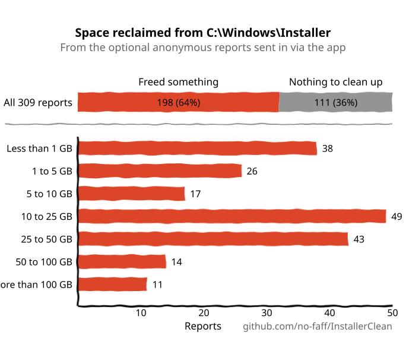

<p align="center">
  <strong>English</strong> · <a href="README.zh-CN.md">简体中文</a> · <a href="README.ru.md">Русский</a> · <a href="README.es.md">Español</a> · <a href="README.ar.md">العربية</a> · <a href="README.ja.md">日本語</a> · <a href="README.pt-BR.md">Português (BR)</a> · <a href="README.pl.md">Polski</a> · <a href="README.tr.md">Türkçe</a> · <a href="README.ko.md">한국어</a> · <a href="README.fr.md">Français</a> · <a href="README.it.md">Italiano</a> · <a href="README.de.md">Deutsch</a> · <a href="README.id.md">Bahasa Indonesia</a> · <a href="README.vi.md">Tiếng Việt</a> · <a href="README.uk.md">Українська</a> · <a href="README.nl.md">Nederlands</a>
</p>

<p align="center">
  
</p>

<p align="center"><em>🎶 What's my line? I'm happy <a href="https://www.youtube.com/watch?v=HM-jHhUZfFI">cleaning Windows</a></em></p>

<h1 align="center">InstallerClean</h1>

<p align="center"><strong>An open-source tool to safely clean up <code>C:\Windows\Installer</code>, the hidden Windows folder that quietly eats your disk space.</strong></p>

<p align="center"><em>Use it once in a blue moon. Maybe save some space. Move on, feeling clean.</em></p>

<p align="center">
  <a href="LICENSE"></a>
  <a href="https://dotnet.microsoft.com/download/dotnet/10.0"></a>
  <a href="https://github.com/no-faff/InstallerClean/actions/workflows/ci.yml"></a>
  <a href="https://github.com/no-faff/InstallerClean/releases"></a>
  <a href="https://github.com/no-faff/InstallerClean/releases/latest"></a>
  <a href="https://github.com/no-faff/InstallerClean/releases"></a>
</p>

<a id="reports-stats"></a>

<!-- reports-stats-start chart-only (generated; do not hand-edit between these markers) -->
<p align="center">
  <picture>
    <source media="(prefers-color-scheme: dark)" srcset="docs/reports-en-dark.svg" />
    <source media="(prefers-color-scheme: light)" srcset="docs/reports-en-light.svg" />
    
  </picture>
</p>
<!-- reports-stats-end -->

- **What:** InstallerClean does one thing: it removes unneeded files from `C:\Windows\Installer`, a hidden folder that fills up as you install and update software. After a quick scan it tells you whether you have any, shows more detail for the curious, and lets you move them somewhere else or delete them to free up space on your C: drive.
- **You might be here because:** You used [WinDirStat](https://github.com/windirstat/windirstat), WizTree or TreeSize, saw `C:\Windows\Installer` taking up a lot of space and didn't know what was in there. In that case, InstallerClean is just what you need. It knows what's in those files with random-looking names like `9f05cba.msi` and quickly tells you which ones you can safely remove.
- **How much space:** The chart above shows the results of the optional reports that have been steadily trickling in since v1.8.0. (Thank you to everyone who's clicked the button. Without you, the chart above wouldn't exist.) Of the <!-- reports-freedpct-start -->64%<!-- reports-freedpct-end --> that freed space, the median freed is <!-- reports-median-start -->16.1 GB<!-- reports-median-end -->. <!-- reports-biggest-start -->One machine reclaimed a whopping 464 GB.<!-- reports-biggest-end --> The other <!-- reports-nothingpct-start -->36%<!-- reports-nothingpct-end --> freed nothing, so it depends on the machine: a clean Windows 11 install with no extra software has nothing to remove. The ones that will have the most unneeded files are machines that have been going for years, anything with heavy MSI-based software on it (Acrobat, Office, LibreOffice, large dev tools), and anyone who installs and uninstalls a lot of software. You'll see exactly how much the moment you run it.
- **Is it safe:** Yes. All it touches is files in `C:\Windows\Installer`. It asks Windows Installer what's still needed, and reads the same records out of the registry as well. It offers a file only when nothing installed on the machine claims it, or a newer patch has replaced it and no program here could go back to the old one. Anything it can't get a straight answer about, it holds back. [More below](#how-it-works).
- **Nothing about you:** Open source (Apache 2.0). No account, no ads, no tracking, no telemetry, nothing running in the background. The only thing it does online by itself is check GitHub for a newer version when you run it, and you can turn that off.
- **Get it:** [Download the latest release](../../releases/latest). Run it; click through [any warning Windows shows](#unknown-publisher) and [the admin prompt](#admin). Move or delete what it finds. Done.

## Contents

- [The folder nobody tells you about](#the-folder-nobody-tells-you-about)
- [The search for help](#the-search-for-help)
- [What InstallerClean does](#what-installerclean-does)
- [Screenshots](#screenshots)
- [How it works](#how-it-works)
- [Download](#download)
  - [Checking the download itself](#checking-the-download-itself)
- [FAQ](#faq)
- [Command line](#command-line)
- [Accessibility](#accessibility)
- [Code signing policy](#code-signing-policy)
- [Privacy](#privacy)
- [What it doesn't do](#what-it-doesnt-do)
- [Alternatives](#alternatives)
- [If a file is ever missing from C:\Windows\Installer](#recovery)
- [Requirements](#requirements)
- [Building from source](#building-from-source)
- [Contributing](#contributing)
- [Support the project](#support-the-project)
- [Star history](#star-history)
- [Licence](#licence)

---

## The folder nobody tells you about

There's a hidden folder on every Windows PC called `C:\Windows\Installer`. Every time you install software that uses the Windows Installer system, or apply a patch to Microsoft Office, Adobe Acrobat, Visual Studio or any other `.msi`-based application, a copy of that installer or `.msp` patch file goes into this folder, and stays there.

When a newer patch replaces an older one, both stay. So do the installers of software you uninstalled long ago. Disk Cleanup doesn't touch any of it, and neither does Storage Sense. DISM is for a different folder entirely. Over time, the folder grows: 1 GB, 5 GB, 20 GB, 50 GB. On machines with heavy MSI-using software (Acrobat is a frequent culprit), it can [pass 100 GB](https://www.reddit.com/r/sysadmin/comments/1oxcrmh/acrobat_filling_up_the_cwindowsinstaller_folder/).

These aren't temp files that come back on their own. They're genuine dead weight: old installers from software you uninstalled years ago and patches that have been replaced several times over. Once they're gone, they don't come back.

**If you're looking for an easy way to free up disk space on Windows, this folder is a good place to start.** InstallerClean finds the unneeded files and removes them safely.

## The search for help

If you've ever searched for help with this folder, you probably know how it goes. Someone with 180 GB in `C:\Windows\Installer` asks how to clean it. They're [told to run Disk Cleanup](https://learn.microsoft.com/en-us/answers/questions/4238108/windows-installer-folder-has-occupied-180gb). They try it. It clears 600 MB, none of it from that folder (because Disk Cleanup doesn't touch `C:\Windows\Installer`). The thread goes quiet.

> *"All of the threads I've found tend to recommend the same things which don't solve the problem, and then go dead."*
>
> [ksparks519, r/Windows10](https://www.reddit.com/r/Windows10/comments/1bt8c5p/anyone_ever_figure_out_giant_installer_folders/)

Or they're told not to touch it at all. In one thread, someone with a 60 GB Installer folder was told ["don't mess with it."](https://www.reddit.com/r/techsupport/comments/1hw4suq/my_windows_installer_folder_is_like_60gb_so_i/) When they asked what they should do instead, the reply was: *"I just told you."*

The standard advice confuses two different things. Deleting files at random stops you being able to update or uninstall any programs those files belonged to. Removing only the files that nothing on the machine claims, or that Windows records as replaced, doesn't. InstallerClean does the second.

## What InstallerClean does

1. **Scans** `C:\Windows\Installer` for `.msi` and `.msp` files
2. **Asks** Windows Installer what's still needed, and reads the same records out of the registry as well
3. **Holds back** anything the two readings can't settle between them
4. **Tells you how much you can free**, and how much it's leaving alone, with optional detail windows listing every file
5. **Removes the unneeded files**: move them to a backup folder you choose, or delete them permanently

## Screenshots

<p>
  <br>
  <em>Initial scan. This is very quick.</em>
  <br><br>
</p>

<p>
  <br>
  <em>Results: how much is removable, how much has been left alone.</em>
  <br><br>
</p>

<p>
  <br>
  <em>Details of the files that can go: the reason each one isn't needed, and what the file says about itself.</em>
  <br><br>
</p>

<p>
  <br>
  <em>Details of the files left alone: the program Windows says each one belongs to, and what the file says about itself.</em>
  <br><br>
</p>

<p>
  <br>
  <em>Confirmation before either action. Move backs the files up to a folder of your choice. Or delete them permanently.</em>
  <br><br>
</p>

<p>
  <br>
  <em>The move running. To the same drive it's instant. To another drive, the more GB the longer it takes.</em>
  <br><br>
</p>

<p>
  <br>
  <em>Done. Space reclaimed. Files backed up until you're satisfied all's well. Then delete the backup folder.</em>
  <br><br>
</p>

<p>
  <br>
  <em>After scanning again. Nothing left to clean.</em>
  <br><br>
</p>

<a id="is-it-safe"></a>
## How it works

When Windows Installer installs a program it keeps a copy of the installer in `C:\Windows\Installer`, and when a patch is registered against a program it keeps a copy of that too. Those copies are what it works from when it repairs, updates or uninstalls the software later, which is why they stay there long after the installation has finished. Both kinds of copy end up in the folder: `.msi` installers; and `.msp` patches, which update a program you already have rather than replacing it.

InstallerClean offers a file for one of two reasons.

**Orphaned** means nothing on the machine claims the file. No installed product and no registered patch names it.

**Superseded** means Windows has recorded that a newer patch replaced this one, and has kept the file anyway. A patch is deleted only once every program it is registered to has been uninstalled, or the patch is removed from all of them. Being replaced by a newer one is neither of those, so the file stays. Adobe Acrobat works this way on Windows: its updates arrive as patches against a base installation rather than as fresh installers, so a machine that has had it a while can be holding several.

InstallerClean works the two out in opposite directions, and only the first involves looking in the folder at all.

**Listing the folder.** InstallerClean lists the `.msi` and `.msp` files sitting directly in `C:\Windows\Installer`. It does not go into the subfolders.

**Reading the records, twice.** It asks Windows Installer for every installed product and every registered patch, and for the cached file each one names, by calling the Windows Installer API in `msi.dll`. Then it reads the same records a second way, straight out of the registry, because the asking can come up short without saying so: Windows hands the records over one at a time until it says there are no more, and a run that stops at the third of two hundred looks exactly like one that reached the end. A registry key hands over its whole list of names at once, so a list that is short cannot look complete. Any product the registry names and the asking missed is then put back to Windows by name, one at a time. This second reading can only move a file onto the "still needed" side. There is no path by which it puts one on the list of files to remove.

**Matching a record to its file.** A record names its cached file as a path, and the same folder does not always get spelt the same way in them. So rather than trust the spelling, InstallerClean asks Windows where each recorded path really points, and compares that against the files it listed in the folder. Anything still unclaimed gets a second comparison that does not go through names at all: it opens the file and asks Windows to identify it, so that two different names for the same file are recognised as one file.

**Records that cannot be matched.** If Windows will not say where a recorded path points, or the file at the end of one cannot be identified, InstallerClean does not know which file that record was about, and any of the files it listed could be the one. The same follows if a program may have been installed more than once, because then it cannot tell which cached file belongs to which copy. In any of those cases it offers nothing it found by listing the folder that time. A record pointing at a file that has already gone is different: there is nothing left for it to have meant, so it cannot be about any of the files still in the folder.

**Asking from the other end.** An orphan is decided by an absence, and an absence can also mean the app failed to find the record. So before offering an `.msi` installer, InstallerClean opens the file, reads the product code the file itself carries, and asks Windows whether that product is installed. If it is, the file stays, whatever the rest of the scan found. That check can only take a file off the list. Nothing it can answer puts one on.

**What decides an `.msp` patch.** A patch is not opened and asked which program it belongs to. What settles it instead is that a patch registration names its cached file in two places: the patches registered against each product; and a single registry list of every patch registration on the machine. A patch is offered as an orphan only when neither of those names it.

**Where a superseded patch differs.** It goes through none of the above, because it is not an unclaimed file. Windows has a record of it, and that record is what says it has been replaced. The risk is a different one: a patch can be registered against several programs, and only one of them has finished with it. So a superseded patch is offered only when Windows records that it cannot be uninstalled, every program it is registered against has been asked, none of them still has it applied, and none of them holds any patch that Windows says can be uninstalled. The last of those is there because undoing a patch on a program can reach back for the older file. If any of that cannot be answered, the file stays.

<details>
<summary>The Windows Installer calls this uses</summary>

- `MsiEnumProductsEx` to list every installed product, and again with a single product code to ask whether one particular product is installed
- `MsiEnumPatchesEx` to list registered patches, both per product and across the whole machine
- `MsiGetProductInfoEx` to read a product's name, the cached file it names, and whether it is one of several installations of the same product
- `MsiGetPatchInfoEx` to read a patch's state, whether Windows can uninstall it, and the cached file it names
- `MsiGetSummaryInformation` and `MsiSummaryInfoGetProperty` to read out of a patch file which programs it can be applied to
- `MsiOpenDatabase`, `MsiDatabaseOpenView`, `MsiViewExecute`, `MsiViewFetch` and `MsiRecordGetString` to read out of an installer file the product code it declares

</details>

Having said all that, the app encourages you to move the files to a backup folder (on another drive/partition if you're looking to free up space on C). That way you get a chance to satisfy yourself that all really is well before you finally delete the unneeded files.

## Download

Three builds, choose one:

- **Portable** (`InstallerClean-3.0.0-portable.exe`): one file, with the .NET 10 runtime inside it. No install, no uninstaller: double-click it and it runs. Keep the file somewhere for next time, or delete it when you're done.
- **Setup** (`InstallerClean-3.0.0-setup.exe`): a regular Windows installer with the .NET 10 runtime bundled. Adds a Start Menu entry and uninstalls cleanly. Tucked into Programs so it's easy to find six months from now, or to run more often than that if you install and uninstall a lot of software.
- **CLI** (`installerclean-cli.exe`): the command-line version on its own, one file with the runtime inside it. No install, no uninstaller. Drop it on a client, run a scan or a clean, delete it. Built for scripting, scheduled tasks and mass deployment, where you want the operations without a desktop app on the client. See [Command line](#command-line) for the arguments and exit codes.

From 2.2.0 the setup and portable filenames carry their version number, so a downloaded copy always says what it is; the CLI keeps its plain `installerclean-cli.exe` name so scheduled tasks and scripts that point at it keep working across updates.

Download from the [releases page](../../releases/latest), then run. It's unsigned, so Windows shows an "unknown publisher" warning; the [FAQ](#unknown-publisher) explains what you'll see and why it's safe.

The app scans automatically on startup. Review the results, then click **Move** or **Delete permanently**.

Or install via [winget](https://learn.microsoft.com/windows/package-manager/winget/):

```
winget install NoFaff.InstallerClean
```

Or install via [Scoop](https://scoop.sh):

```
scoop install installerclean
```

### Checking the download itself

InstallerClean is unsigned. Here's what you can check before you run it:

- Every download's SHA-256 is on its release page.
- VirusTotal: every build is scanned before it goes out, and the release page carries the full per-engine result for each download.
- Source is here at [github.com/no-faff/InstallerClean](https://github.com/no-faff/InstallerClean). The scan, query, move, delete, settings and pending-reboot services are covered by an automated test suite that runs on Windows on every push to `main` and on every pull request, and the CI badge at the top of this page reports the result.
- Release builds are deterministic: the same source, the same SDK and the same publish flags produce the same bytes, and a release can't be tagged unless every build input matches the source at that tag. So you can check out the tag, build it yourself and compare hashes with the published ones. Each release's notes carry what you need for that: the SDK version it was built with, and the publish flags for any download that wasn't built with the defaults. The setup is the exception: it's compiled by Inno Setup rather than by the SDK and stamps the build year into itself, so reproducing its hash needs the same Inno version and the same calendar year as well.
- <!-- downloads-start -->81,000+<!-- downloads-end --> downloads across GitHub, MajorGeeks and Softpedia.
- [MajorGeeks](https://www.majorgeeks.com/files/details/installerclean.html) test each submission in a virtual machine and list it only if it passes their review.<br><a href="https://www.majorgeeks.com/files/details/installerclean.html"></a>
- [Softpedia](https://www.softpedia.com/get/System/Hard-Disk-Utils/InstallerClean.shtml) reviewed it and certified it free of spyware, adware and viruses.<br><a href="https://www.softpedia.com/get/System/Hard-Disk-Utils/InstallerClean.shtml"></a>

## FAQ

<a id="admin"></a>

**Why does it want Administrator?** Two reasons. `C:\Windows\Installer` is locked down to administrators, so reading it, querying Windows Installer and moving or deleting files all need that. And an administrator may ask Windows about programs installed under any account on the machine, where a non-administrator may not: run it without, and Windows would say a program isn't installed when it is, inside the check that decides whether a file is still needed.

<a id="unknown-publisher"></a>

**Why does Windows say "Unknown publisher"?** InstallerClean isn't code-signed, and Windows marks files downloaded from the internet, so on first run SmartScreen usually shows "Windows protected your PC" with the publisher listed as unknown. A paid signing certificate costs money every year and I'd rather keep the app free than pay for one, so I applied to SignPath Foundation, who sign open source software for nothing, and InstallerClean has been accepted (see [Code signing policy](#code-signing-policy)). The certificate hasn't been issued yet so, for now, click **More info**, then **Run anyway**. It's safe to do: the source code is public, and every release has VirusTotal links and SHA-256 hashes you can check first.

**Does it work on Windows 7 or 8?** No. It needs Windows 10 version 1607 or later, which is the oldest build the .NET 10 runtime supports. The setup refuses to install on anything older and the portable build won't start.

## Command line

`installerclean-cli.exe` is a separate console executable, installed beside the GUI. Same scan, same move, same delete, no window. It blocks the prompt until it finishes, so a script or a scheduled task can wait on it.

### Flags

| Flag | What it does | Also accepts |
|---|---|---|
| `/s` | Scan only. Lists what it would remove, with the name, size and reason for each. Changes nothing. | |
| `/d` | Scan, then delete the unneeded files permanently. | |
| `/m` | Scan, then move them to the folder saved in the GUI. | |
| `/m PATH` | Scan, then move them to `PATH`. Quote it if it has a space in it. | |
| `--help` | Print the usage and exit `0`. | `/?`, `-h` |
| `--version` | Print the version and exit `0`. | `-v` |

Flags are case-insensitive, so `/S` and `/D` work as well as `/s` and `/d`. Only one flag per run: they can't be combined, and `/s` and `/d` take nothing after them.

Run with no argument and it prints the usage and exits `1`, so a scheduled task that loses its flag fails visibly instead of quietly doing nothing. A flag it doesn't recognise prints an error line, then the usage, and also exits `1`. An unquoted move path with a space in it is refused the same way rather than silently truncated, and the message tells you to quote it.

### Exit codes

These are the codes the tool itself documents in `--help`:

| Code | Means |
|---|---|
| `0` | Success. The run did what it was asked and nothing failed. |
| `1` | Nothing processed. The run failed, or was refused. |
| `2` | Partial. Some processed, some not, including a Ctrl+C part way through. |
| `75` | Transient. A temporary condition blocked the run; the printed message says which. |
| `130` | Cancelled with Ctrl+C before anything was processed. |

`1` covers a refusal as well as a failure, and a refusal is not a fault: a destination that's simply full, or a registry value the app couldn't read before touching anything, both land here. `0` means nothing failed, not that nothing is left: `--help`, `--version` and a scan-only run all exit `0` whether the scan found sixty-eight files or none.

### The event log

Every run writes an outcome entry to the Application log, and may add one or more notices beside it. The Event ID is a stable machine contract, so an RMM can filter on the number without parsing any text:

| ID | Means |
|---|---|
| `1000` | Success |
| `1002` | Partial |
| `2000` | Skipped, transient |
| `4000` | Hard failure |
| `3000` | Notice: the scan couldn't account for every installed product |
| `3001` | Notice: files Windows expects are missing from the folder |
| `3002` | Notice: files were held back rather than offered |

The `3000` band is a notice rather than an outcome, and doesn't count as a run result. Entry type is Information where nothing went wrong with the run and Warning where it did. **The event log is always in English**, whatever the machine's display language, so a grep on a known phrase has a stable target. The console is the translated surface: it follows the machine's own language, and sizes and dates its region.

### Recipes

Audit to a file, changing nothing:

```
installerclean-cli /s > audit.txt
```

Monthly move to `D:\InstallerBackup`, with the CLI dropped at `C:\Tools`:

```
schtasks /create /tn "InstallerClean monthly" /tr "C:\Tools\installerclean-cli.exe /m D:\InstallerBackup" /sc monthly /ru SYSTEM /rl highest
```

The task blocks until the run finishes and records the exit code as its Last Run Result, so an RMM can key off the codes above.

From PowerShell:

```powershell
& 'C:\Tools\installerclean-cli.exe' /m D:\InstallerBackup
switch ($LASTEXITCODE) {
    0       { 'Clean' }
    2       { 'Partial, check the output' }
    75      { 'Blocked, try again later' }
    default { "Failed ($LASTEXITCODE)" }
}
```

### Before you script it

- **It needs elevation.** All of it does, `/s` included. From a prompt that isn't elevated, Windows refuses to start it and hands your shell `740`.
- **The GUI's saved folder is per-user.** A task running as SYSTEM or a service account won't see it, so those runs have to pass `/m PATH`.
- **SYSTEM reaches the network as the machine account**, so a `\\server\share` destination needs rights given to that account.
- **`/s` never blocks.** It's read-only and takes no lock, so you can scan while the desktop app is open. `/d` and `/m` take a machine-wide lock and exit `75` if another InstallerClean run holds it.
- **Everything goes to stdout**, errors included; there is no stderr. Key off the exit code rather than parsing the text.
- **Move refuses rather than renames.** If the destination already holds a file of that name, that file is left in the cache and named in the output, and the rest of the batch still moves. A run where every file collides processes nothing and exits `1`.
- **Nothing empties the backup folder.** `/m` only ever adds. It wants its own clear-out.
- **`taskkill /pid` is not a graceful cancel.** The next run recovers the single-instance lock.
- **The first run registers an event-log source**, at `HKLM\SYSTEM\CurrentControlSet\Services\EventLog\Application\InstallerClean`. Leave it there: Event Viewer reads an entry's description through its source, so removing it turns every entry the tool has already written into an unknown-source error.

### Why `installerclean-cli` and not `installerclean.exe`

`InstallerClean.exe` is the window and ignores command-line arguments. `installerclean-cli.exe` is a real console process, so it blocks the prompt until it finishes and redirects and pipes like anything else. The setup installs both. The portable download is the GUI only; download `installerclean-cli.exe` on its own from the [releases page](../../releases/latest) if you want the command line without the window.

## Accessibility

InstallerClean is built to be fully usable from the keyboard and with a screen reader.

- **Keyboard-operable throughout.** Everything the app does is reachable from the keyboard, and the detail-window columns sort from the keyboard too, so nothing here needs a mouse. The title-bar buttons behave like the Windows ones and are reached with Alt+Space or Alt+F4. Keyboard focus stays visible wherever it lands.
- **Narrator and Voice Access.** Every control is labelled, and the visible word on a button is the word that activates it by voice. When a Move or Delete finishes, the outcome is read aloud.
- **Built to be read.** Text meets WCAG AA contrast throughout the dark theme.

If anything here gets in your way, [open an issue](../../issues). Accessibility problems are bugs, not edge cases.

## Code signing policy

InstallerClean has been accepted by [SignPath Foundation](https://signpath.org) for free code signing, a programme that signs open source software so it stops arriving on your machine from an unknown publisher. The certificate itself hasn't been issued yet, so the downloads here are unsigned today and Windows will warn about them.

Once it's issued, releases will carry the line SignPath ask for: free code signing provided by SignPath.io, certificate by SignPath Foundation. The certificate belongs to the foundation rather than to me, because a certificate has to be issued to a legal entity and a one-person project isn't one. It doesn't mean InstallerClean is theirs, or that they're involved in it beyond the signing.

**Roles.** InstallerClean has one maintainer. Committers and reviewers, meaning who can put code into the project: me. Approvers, meaning who can authorise a release to be signed: me.

## Privacy

The optional report is the only thing that ever sends anything about a run, and it goes only when you press the button. It says what the scan found, what it held back and why, whether you moved or deleted, how much that freed, how long it took, and anything that failed, along with the app's version, the language you read it in and your Windows version. No file names, no folder names, no account name, nothing that identifies your machine and nothing that could tie two reports together. It is how I find out whether the app is working, and what it is holding back, on machines other than my own.

No ads, no telemetry. The only other connections are a version check when the app starts (one request to GitHub which you can turn off in the About window) and buttons linking to GitHub and a page where you can donate if you're feeling generous. Full [privacy policy](PRIVACY.md).

## What it doesn't do

- WinSxS (`C:\Windows\WinSxS`) is a different folder with different rules. For that one, run `Dism /Online /Cleanup-Image /StartComponentCleanup` from an elevated prompt.
- No background service, no scheduled task, no auto-clean. The app runs when you launch it.
- It doesn't change your installed programs or the Windows Installer database, only reads them. The only thing it ever writes to the registry is the one-time event-source registration the command-line tool needs so its runs can appear in the Windows Event Log.
- It makes one kind of connection off its own bat: a quick check of GitHub's releases page for a newer version when you run it, which you can switch off in About. Everything else only happens when you tell it to: the optional anonymous report (numbers about the run, nothing that names you or your files) and links to the GitHub docs and a donate page, which open in your browser if you click them. It never downloads anything by itself.
- No toolbars, no bundled software, no adware.

## Alternatives

If you've searched for this folder before, the tool you'll most likely have found is [PatchCleaner](https://www.homedev.com.au/free/patchcleaner). It did this job first, it did it for a decade before InstallerClean existed, it's still going strong, and InstallerClean would not exist without it.

I made InstallerClean because PatchCleaner is closed source, hasn't had an update since March 2016, and excludes Adobe files by default. That exclusion is there for a good reason, and HomeDev said so plainly in the release notes at the time:

> *"There is a known issue in previous versions where PatchCleaner falsely identifies Adobe Acrobat Reader patches as not being required. Adobe do something proprietary when it comes to their automatic updating such that if PatchCleaner removes the 'orphaned' patches from the installer directory, Adobe Reader automatic updates will no longer successfully install."*
>
> [PatchCleaner release notes, version 1.4.0.0](https://www.homedev.com.au/free/patchcleaner)

The filter that went in with it looks for the word "Acrobat" in a file's metadata and in its signature. On the machines where Acrobat is the worst offender, that can be most of the space:

> *"I've downloaded Patchcleaner to delete the orphaned .msp files, but apparently this would only free up 250 MB of space. 29 GB of the files are 'excluded by filters', so Patchcleaner doesn't seem to help."*
>
> HeatherBunny1111, [r/techsupport](https://www.reddit.com/r/techsupport/comments/1qc4tcf/how_to_delete_msp_files_safely/)

The difference between the two tools here is what each asks Windows for, not a difference of opinion about Adobe. Windows' list of a product's *applied* patches leaves out the ones a newer patch has replaced, so a tool reading that list meets a superseded patch's file as a file nothing claims, the same as any other. The exclusion filter is what catches the Adobe ones by name. InstallerClean asks Windows about patch state instead, so a superseded patch arrives labelled as one, and what happens to it is decided on what Windows records about it rather than on what its name says. Here's how the two compare:

| | **InstallerClean** | **PatchCleaner** |
|---|---|---|
| Last updated | 2026 (active) | 3 March 2016 |
| Source code | Open source (Apache 2.0) | Closed source |
| Runtime | .NET 10 (self-contained) | .NET Framework 4.5.2 + VBScript |
| API | Windows Installer API in `msi.dll` (in-process) | Windows Installer COM (out-of-process via VBScript) |
| Superseded patches | Identified from Windows' patch records | Not told apart from unclaimed files |
| Adobe files | Superseded patches detected and labelled | Excluded by a name filter, on by default |

> **A note on `Win32_Product`:** The common-but-broken approach for listing installed products is `Win32_Product` (WMI), which [triggers MSI repair operations](https://gregramsey.net/2012/02/20/win32_product-is-evil/) on every product during enumeration. Both InstallerClean and PatchCleaner avoid it. InstallerClean calls the Windows Installer API in `msi.dll`; PatchCleaner runs a helper script that uses the Windows Installer COM object. That script is called `WMIProducts.vbs`, which makes it look otherwise, but the file is Microsoft's own sample script with an edit, and it asks Windows Installer rather than WMI. The name is the only misleading thing about it.

Disk Cleanup, Storage Sense, CCleaner and BleachBit don't clean `C:\Windows\Installer`.

<a id="recovery"></a>
## If a file is ever missing from `C:\Windows\Installer`

If you do have a file missing from that folder, the program it belonged to still runs normally. But when you try to update or uninstall that program it will probably fail. Windows goes looking for the file, doesn't find it, and the step stops.

InstallerClean's whole purpose is to only offer to move or delete files that are *not* needed, but it does know when a file is missing, so it flags any it finds with a warning triangle and a link pointing here. This is what to do to try and repair the program:

- Find out your installed program's version number (Settings, Apps, Installed apps)
- Download the installer **for that version** from its maker. A newer one won't work, and neither will uninstalling first: both have to remove what's installed before they can go on, and removing it is the step that needs the missing file.
- Run that installer
- That should restore the file and leave your settings alone. Re-scan in InstallerClean and the warning will be gone if it worked.

Microsoft doesn't guarantee that will work, though. What follows is its own, fuller account:

<details>
<summary>Microsoft's fuller position</summary>

Full guidance: [Restore missing Windows Installer cache files](https://learn.microsoft.com/en-us/troubleshoot/windows-client/application-management/missing-windows-installer-cache), KB 2667628.

*It may not show up straight away:*
> "If the installer cache is compromised, you may not immediately see problems until you take an action such as uninstalling, repairing, or updating a product."

*The files are unique per machine, so you can't copy one from another PC:*
> "Missing files cannot be copied between computers because the files are unique."

*If you have a backup made before the file went missing, Microsoft lists four routes, in this order:*
> - System Restore points (available only on client operating systems)
> - Restoreable system state backup
> - Failure recovery methods that can restore the full system state backup
> - Reinstallation of the operating system and all applications

*And the catch on all four. This is about a system backup, not about a folder you moved files to yourself: those you can copy straight back, confirming the administrator prompt Windows shows when you copy into the folder.*
> "To restore the missing files, a full system state restoration is required. It is not possible to replace only the missing files from a previous backup."

*The recommended recovery, and its blunt limits:*
> "If application files are missing from the Windows Installer Cache, ask the vendor or support team for the application about the missing files. You must follow the procedures or steps recommended by the application vendor to restore the files. In some cases, you may have to rebuild the operating system and reinstall the application to fix the problem."
>
> "Windows support engineers cannot help you recover missing application files from the Windows Installer cache."

</details>

If InstallerClean is ever the reason a file is missing, I want to know. [Open an issue](../../issues) and I'll fix it.

## Requirements

- Windows 10 (version 1607 / build 14393 or later, the oldest the .NET 10 runtime supports) or Windows 11
- 64-bit Windows. The setup won't install on 32-bit and will tell you so.
- Administrator privileges, for the setup and for the app (`C:\Windows\Installer` is admin-only)

See [Download](#download) for setup, portable and CLI build options.

## Building from source

```
git clone https://github.com/no-faff/InstallerClean.git
cd InstallerClean
dotnet build src/InstallerClean.sln
```

Run the tests:

```
dotnet test src/InstallerClean.Tests/
```

## Contributing

Found a bug or have a suggestion? [Open an issue](../../issues) or start a [discussion](../../discussions). Pull requests welcome. Please run `dotnet test` before submitting.

InstallerClean comes in 16 languages, each covering the whole of it: the app, the installer, the command line and this README. In the app, the installer and the command line, the Japanese and the Dutch were contributed complete by coolvitto and RijckAlex, and the Italian is my own machine translation corrected and approved by bovirus, all three native speakers; the rest are my own machine translations. Every README is my own, in every language. I put a lot of effort into them, but they won't be perfect, and I decided to ship them as they are rather than hold them back until a native speaker could check each one. If you speak English and one of these languages and spot anything that could be improved, I'd be glad to hear it, in an [issue](../../issues/new?template=translation_review.md), a pull request or a [discussion](../../discussions).

## Support the project

If InstallerClean frees some space and you're feeling generous, I'd really appreciate a [small donation](https://nofaff.netlify.app/support). There's a ❤️ button in the app which links to the same place. Any amount will be gratefully accepted. Thanks very much to everyone who's donated so far. It's been a huge amount of work and I'm happy it's been worth it.

## Star History

<picture>
  <source media="(prefers-color-scheme: dark)" srcset="docs/star-history-dark.svg" />
  <source media="(prefers-color-scheme: light)" srcset="docs/star-history-light.svg" />
  
</picture>

## Licence

[Apache 2.0](LICENSE)

---

🎶 [George Formby - When I'm Cleaning Windows](https://www.youtube.com/watch?v=P183Uo5Ust4). Enjoy!
