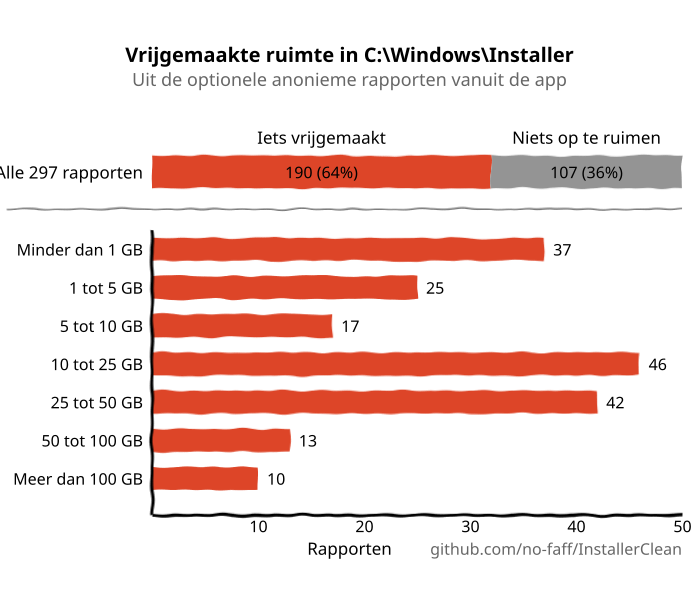
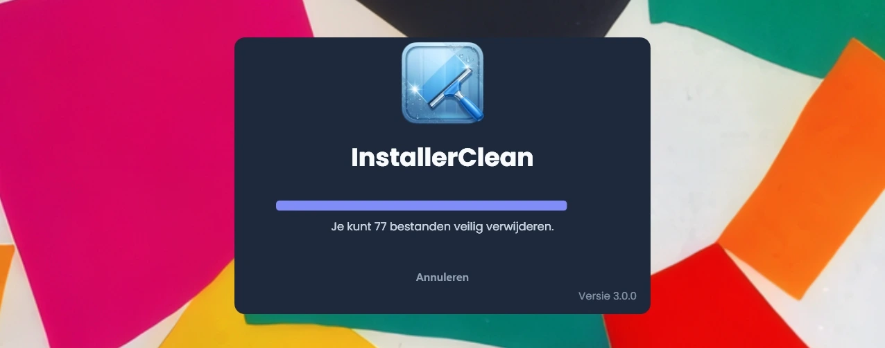
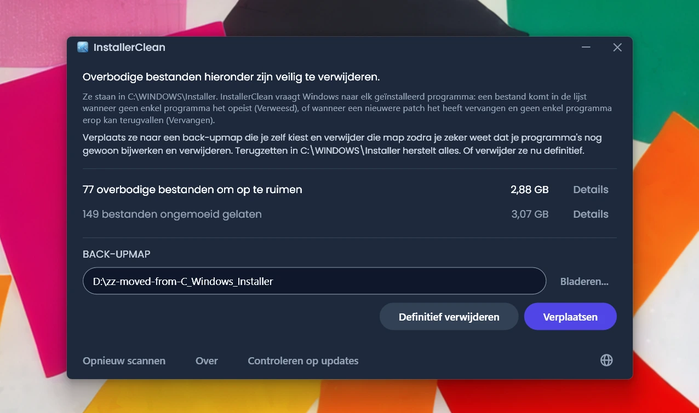
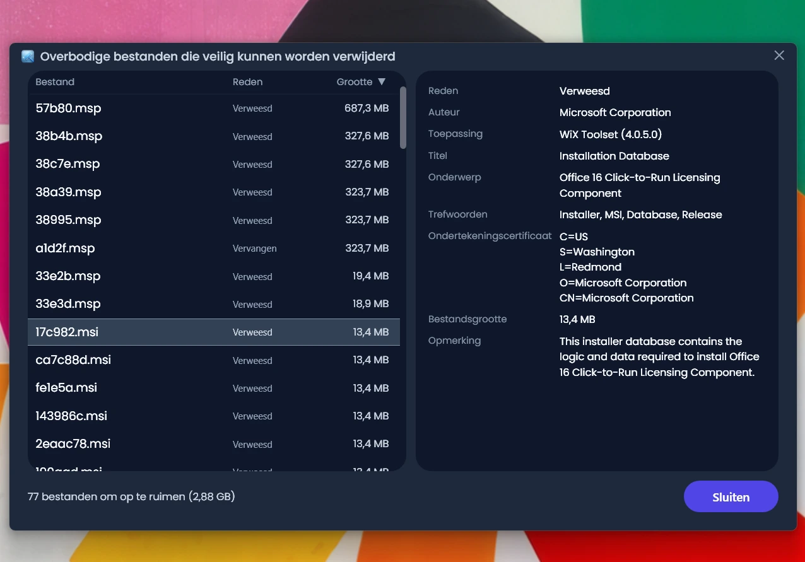
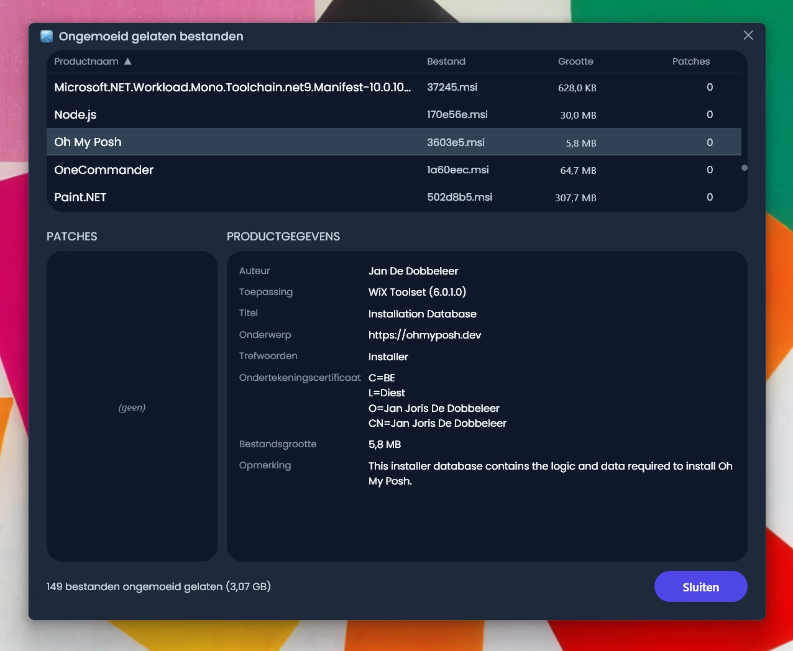
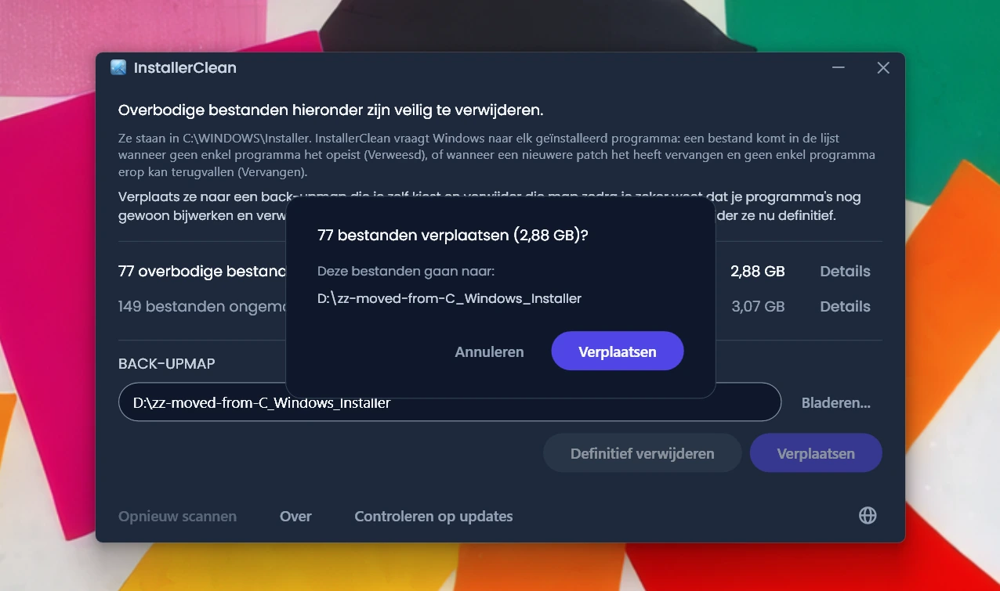
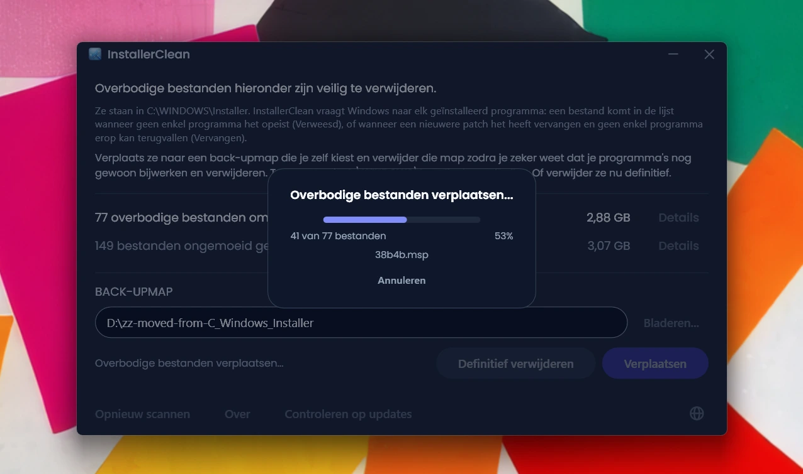
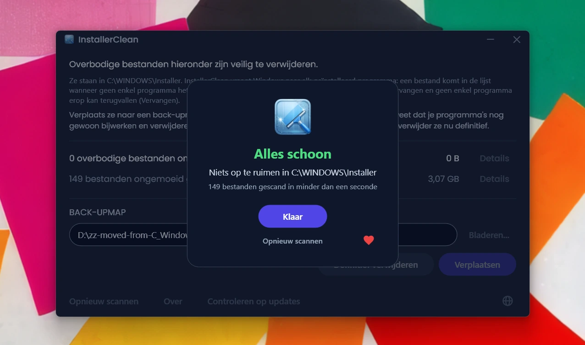

<p align="center">
  <a href="README.md">English</a> · <a href="README.zh-CN.md">简体中文</a> · <a href="README.ru.md">Русский</a> · <a href="README.es.md">Español</a> · <a href="README.ar.md">العربية</a> · <a href="README.ja.md">日本語</a> · <a href="README.pt-BR.md">Português (BR)</a> · <a href="README.pl.md">Polski</a> · <a href="README.tr.md">Türkçe</a> · <a href="README.ko.md">한국어</a> · <a href="README.fr.md">Français</a> · <a href="README.it.md">Italiano</a> · <a href="README.de.md">Deutsch</a> · <a href="README.id.md">Bahasa Indonesia</a> · <a href="README.vi.md">Tiếng Việt</a> · <a href="README.uk.md">Українська</a> · <strong>Nederlands</strong>
</p>

<p align="center">
  
</p>

<p align="center"><em>🎶 What's my line? I'm happy <a href="https://www.youtube.com/watch?v=HM-jHhUZfFI">cleaning Windows</a></em></p>

<h1 align="center">InstallerClean</h1>

<p align="center"><strong>Een opensourcetool om <code>C:\Windows\Installer</code> veilig op te schonen, de verborgen Windows-map die stilletjes je schijfruimte opvreet.</strong></p>

<p align="center"><em>Gebruik het eens in de zoveel tijd. Wie weet levert het wat ruimte op. En dan weer door, lekker opgeruimd.</em></p>

<p align="center">
  <a href="LICENSE"></a>
  <a href="https://dotnet.microsoft.com/download/dotnet/10.0"></a>
  <a href="https://github.com/no-faff/InstallerClean/actions/workflows/ci.yml"></a>
  <a href="https://github.com/no-faff/InstallerClean/releases"></a>
  <a href="https://github.com/no-faff/InstallerClean/releases/latest"></a>
  <a href="https://github.com/no-faff/InstallerClean/releases"></a>
</p>

<a id="reports-stats"></a>

<!-- reports-stats-start chart-only (generated; do not hand-edit between these markers) -->
<p align="center">
  <picture>
    <source media="(prefers-color-scheme: dark)" srcset="docs/reports-nl-dark.svg" />
    <source media="(prefers-color-scheme: light)" srcset="docs/reports-nl-light.svg" />
    
  </picture>
</p>
<!-- reports-stats-end -->

- **Wat:** InstallerClean doet één ding: het verwijdert overbodige bestanden uit `C:\Windows\Installer`, een verborgen map die voller wordt naarmate je software installeert en bijwerkt. Na een snelle scan vertelt het je of je die hebt, laat het meer detail zien voor wie nieuwsgierig is, en kun je ze ergens anders naartoe verplaatsen of verwijderen om ruimte vrij te maken op je C:-schijf.
- **Je bent hier misschien omdat:** je [WinDirStat](https://github.com/windirstat/windirstat), WizTree of TreeSize hebt gebruikt, zag dat `C:\Windows\Installer` veel ruimte innam en niet wist wat erin zat. In dat geval is InstallerClean precies wat je nodig hebt. Het weet wat er in die bestanden met willekeurig ogende namen als `9f05cba.msi` zit en vertelt je snel welke je veilig kunt verwijderen.
- **Hoeveel ruimte:** De grafiek hierboven toont de uitkomsten van de optionele rapporten die sinds v1.8.0 gestaag binnendruppelen. (Dank aan iedereen die op de knop heeft geklikt. Zonder jullie zou die grafiek niet bestaan.) Van de <!-- reports-freedpct-start -->64%<!-- reports-freedpct-end --> die ruimte heeft vrijgemaakt, is de mediaan van wat er vrijkwam <!-- reports-median-start -->15,5 GB<!-- reports-median-end -->. <!-- reports-biggest-start -->Eén machine haalde er maar liefst 462 GB uit.<!-- reports-biggest-end --> De overige <!-- reports-nothingpct-start -->36%<!-- reports-nothingpct-end --> maakte niets vrij, dus het hangt van de machine af: een schone Windows 11-installatie zonder extra software heeft niets te verwijderen. De meeste overbodige bestanden zitten op machines die al jaren meegaan, op alles waar zware MSI-software op staat (Acrobat, Office, LibreOffice, grote ontwikkeltools), en bij iedereen die veel software installeert en weer verwijdert. Hoeveel het bij jou is, zie je meteen als je het draait.
- **Is het veilig:** Ja. Het komt alleen aan bestanden in `C:\Windows\Installer`. Het vraagt Windows Installer wat er nog nodig is, en leest dezelfde records ook uit het register. Het biedt een bestand alleen aan wanneer niets wat op de machine geïnstalleerd is het opeist, of wanneer een nieuwere patch het heeft vervangen en geen enkel programma hier op het oude terug zou kunnen vallen. Alles waar het geen helder antwoord over krijgt, houdt het achter. [Meer hieronder](#hoe-het-werkt).
- **Niets over jou:** Open source (Apache 2.0). Geen account, geen advertenties, geen tracking, geen telemetrie, niets dat op de achtergrond draait. Het enige wat het uit zichzelf online doet, is bij het starten op GitHub kijken of er een nieuwere versie is, en dat kun je uitzetten.
- **Downloaden:** [Download de nieuwste versie](../../releases/latest). Voer hem uit; klik je door [een eventuele waarschuwing van Windows](#unknown-publisher) en [de beheerdersvraag](#admin) heen. Verplaats of verwijder wat het vindt. Klaar.

## Inhoud

- [De map waar niemand het over heeft](#de-map-waar-niemand-het-over-heeft)
- [De zoektocht naar hulp](#de-zoektocht-naar-hulp)
- [Wat InstallerClean doet](#wat-installerclean-doet)
- [Screenshots](#screenshots)
- [Hoe het werkt](#hoe-het-werkt)
- [Download](#download)
  - [De download zelf controleren](#de-download-zelf-controleren)
- [FAQ](#faq)
- [Opdrachtregel](#opdrachtregel)
- [Toegankelijkheid](#toegankelijkheid)
- [Beleid voor code-ondertekening](#beleid-voor-code-ondertekening)
- [Privacy](#privacy)
- [Wat het niet doet](#wat-het-niet-doet)
- [Alternatieven](#alternatieven)
- [Als er ooit een bestand ontbreekt in C:\Windows\Installer](#recovery)
- [Vereisten](#vereisten)
- [Bouwen vanaf de broncode](#bouwen-vanaf-de-broncode)
- [Bijdragen](#bijdragen)
- [Het project steunen](#het-project-steunen)
- [Sterrengeschiedenis](#sterrengeschiedenis)
- [Licentie](#licentie)

---

## De map waar niemand het over heeft

Op elke Windows-pc staat een verborgen map met de naam `C:\Windows\Installer`. Elke keer dat je software installeert die het Windows Installer-systeem gebruikt, of een patch toepast op Microsoft Office, Adobe Acrobat, Visual Studio of een andere toepassing op `.msi`-basis, gaat er een kopie van die installer of dat `.msp`-patchbestand naar deze map, en daar blijft hij.

Als een nieuwere patch een oudere vervangt, blijven ze allebei staan. Net als de installers van software die je lang geleden hebt verwijderd. Schijfopruiming komt er niet aan, en Opslaginzicht evenmin. DISM is voor een heel andere map. Na verloop van tijd groeit de map: 1 GB, 5 GB, 20 GB, 50 GB. Op machines met zware MSI-software (Acrobat is een veelvoorkomende boosdoener) kan hij [de 100 GB passeren](https://www.reddit.com/r/sysadmin/comments/1oxcrmh/acrobat_filling_up_the_cwindowsinstaller_folder/).

Dit zijn geen tijdelijke bestanden die vanzelf terugkomen. Het is echte dode last: oude installers van software die je jaren geleden hebt verwijderd en patches die al meerdere keren zijn vervangen. Eenmaal weg komen ze niet terug.

**Zoek je een makkelijke manier om schijfruimte vrij te maken op Windows, dan is deze map een goed beginpunt.** InstallerClean vindt de overbodige bestanden en verwijdert ze veilig.

## De zoektocht naar hulp

Als je ooit hulp hebt gezocht bij deze map, weet je waarschijnlijk hoe dat gaat. Iemand met 180 GB in `C:\Windows\Installer` vraagt hoe je die opruimt. Diegene krijgt [het advies om Schijfopruiming te draaien](https://learn.microsoft.com/en-us/answers/questions/4238108/windows-installer-folder-has-occupied-180gb). Dat probeert diegene. Het levert 600 MB op, waarvan niets uit die map (want Schijfopruiming komt niet aan `C:\Windows\Installer`). De discussie valt stil.

> *“Alle discussies die ik vind, raden steeds dezelfde dingen aan, die het probleem niet oplossen, en daarna bloeden ze dood.”*
>
> [ksparks519, r/Windows10](https://www.reddit.com/r/Windows10/comments/1bt8c5p/anyone_ever_figure_out_giant_installer_folders/) (vertaald uit het Engels)

Of ze krijgen te horen dat ze er helemaal vanaf moeten blijven. In één discussie kreeg iemand met een Installer-map van 60 GB te horen: [“niet aankomen.”](https://www.reddit.com/r/techsupport/comments/1hw4suq/my_windows_installer_folder_is_like_60gb_so_i/) Toen diegene vroeg wat je dan wél moest doen, was het antwoord: *“Dat zei ik je net.”*

Het standaardadvies haalt twee dingen door elkaar. Lukraak bestanden verwijderen zorgt ervoor dat je de programma's waar die bestanden bij hoorden niet meer kunt bijwerken of verwijderen. Alleen die bestanden weghalen die door niets op de machine worden opgeëist, of die door Windows als vervangen zijn vastgelegd, doet dat niet. InstallerClean doet het tweede.

## Wat InstallerClean doet

1. **Scant** `C:\Windows\Installer` op `.msi`- en `.msp`-bestanden
2. **Vraagt** Windows Installer wat er nog nodig is, en leest dezelfde records ook uit het register
3. **Houdt achter** wat de twee lezingen samen niet kunnen uitmaken
4. **Vertelt je hoeveel je kunt vrijmaken**, en hoeveel het ongemoeid laat, met optionele detailvensters die elk bestand op een rij zetten
5. **Haalt de overbodige bestanden weg**: verplaats ze naar een back-upmap die je zelf kiest, of verwijder ze definitief

## Screenshots

<p>
  <br>
  <em>De eerste scan. Dit gaat heel snel.</em>
  <br><br>
</p>

<p>
  <br>
  <em>De resultaten: hoeveel er weg kan, hoeveel er ongemoeid is gelaten.</em>
  <br><br>
</p>

<p>
  <br>
  <em>Details van de bestanden die weg kunnen: de reden waarom elk ervan niet meer nodig is, en wat het bestand over zichzelf zegt.</em>
  <br><br>
</p>

<p>
  <br>
  <em>Details van de bestanden die ongemoeid zijn gelaten: het programma waar Windows zegt dat elk bestand bij hoort, en wat het bestand over zichzelf zegt.</em>
  <br><br>
</p>

<p>
  <br>
  <em>Bevestiging vóór beide acties. Verplaatsen zet de bestanden als back-up in een map naar keuze. Of verwijder ze definitief.</em>
  <br><br>
</p>

<p>
  <br>
  <em>Het verplaatsen loopt. Naar dezelfde schijf gaat het in één keer. Naar een andere schijf duurt het langer naarmate er meer GB's zijn.</em>
  <br><br>
</p>

<p>
  <br>
  <em>Klaar. Ruimte terug. De bestanden staan veilig in de back-up tot je ervan overtuigd bent dat alles goed is. Verwijder daarna de back-upmap.</em>
  <br><br>
</p>

<p>
  <br>
  <em>Na opnieuw scannen. Niets meer op te ruimen.</em>
  <br><br>
</p>

<a id="is-it-safe"></a>
## Hoe het werkt

Als Windows Installer een programma installeert, bewaart het een kopie van de installer in `C:\Windows\Installer`, en als er een patch bij een programma wordt geregistreerd, bewaart het daar ook een kopie van. Met die kopieën werkt het later wanneer het de software repareert, bijwerkt of deïnstalleert, en daarom blijven ze nog lang na de installatie staan. Beide soorten kopieën komen in de map terecht: `.msi`-installers en `.msp`-patches, die een programma dat je al hebt bijwerken in plaats van het te vervangen.

InstallerClean biedt een bestand om een van twee redenen aan.

**Verweesd** betekent dat niets op de machine het bestand opeist. Het wordt door geen enkel geïnstalleerd product en geen enkele geregistreerde patch genoemd.

**Vervangen** betekent dat Windows heeft vastgelegd dat een nieuwere patch deze patch heeft vervangen, en het bestand toch heeft bewaard. Een patch wordt pas verwijderd zodra elk programma waarbij hij geregistreerd staat is gedeïnstalleerd, of de patch bij al die programma's is verwijderd. Vervangen worden door een nieuwere is geen van beide, dus blijft het bestand staan. Adobe Acrobat werkt zo op Windows: de updates komen binnen als patches op een basisinstallatie en niet als nieuwe installers, dus een machine die het al een tijd heeft, kan er meerdere bewaren.

InstallerClean werkt de twee in tegengestelde richtingen uit, en alleen bij het eerste wordt er überhaupt in de map gekeken.

**De map inventariseren.** InstallerClean somt de `.msi`- en `.msp`-bestanden op die direct in `C:\Windows\Installer` staan. Het gaat de submappen niet in.

**De records twee keer lezen.** Het vraagt Windows Installer om elk geïnstalleerd product en elke geregistreerde patch, en om het bestand in de cache dat door elk daarvan wordt genoemd, via de Windows Installer-API in `msi.dll`. Daarna leest het diezelfde records op een tweede manier, rechtstreeks uit het register, want die navraag kan tekortschieten zonder dat te melden: Windows geeft de records één voor één door tot het zegt dat er geen meer zijn, en een run die bij de derde van tweehonderd stopt, ziet er precies zo uit als een run die het eind heeft gehaald. Een registersleutel geeft zijn hele lijst met namen in één keer door, dus een lijst die te kort is, kan er niet volledig uitzien. Elk product dat door het register wordt genoemd en door de navraag is gemist, wordt daarna op naam één voor één opnieuw aan Windows voorgelegd. Die tweede lezing kan een bestand alleen naar de kant “nog nodig” verplaatsen. Er is geen route waarlangs die lezing een bestand op de lijst met te verwijderen bestanden zet.

**Een record aan zijn bestand koppelen.** Een record noemt het bestand in de cache als een pad, en dezelfde map wordt daarin niet altijd hetzelfde gespeld. In plaats van op de spelling te vertrouwen vraagt InstallerClean daarom aan Windows waar elk vastgelegd pad werkelijk naartoe wijst, en vergelijkt dat met de bestanden die het in de map heeft gevonden. Alles wat dan nog niet is opgeëist, krijgt een tweede vergelijking die helemaal niet via namen loopt: het opent het bestand en vraagt Windows om het te identificeren, zodat twee verschillende namen voor hetzelfde bestand als één bestand worden herkend.

**Records die niet te koppelen zijn.** Zegt Windows niet waar een vastgelegd pad naartoe wijst, of is het bestand aan het eind daarvan niet te identificeren, dan weet InstallerClean niet over welk bestand dat record ging, en kan elk van de bestanden die het heeft gevonden het bedoelde bestand zijn. Hetzelfde geldt als een programma mogelijk meer dan één keer is geïnstalleerd, want dan valt niet te zeggen welk bestand in de cache bij welke kopie hoort. In al die gevallen biedt het die keer niets aan van wat het in de map heeft gevonden. Een record dat naar een bestand wijst dat al weg is, ligt anders: er is niets meer over waar het over kán zijn gegaan, dus het kan niet over een van de bestanden gaan die nog in de map staan.

**Vanaf de andere kant vragen.** Een verweesd bestand wordt bepaald door een afwezigheid, en een afwezigheid kan ook betekenen dat de app het record niet heeft gevonden. Voordat InstallerClean een `.msi`-installer aanbiedt, opent het daarom het bestand, leest het de productcode die het bestand zelf bij zich draagt, en vraagt het aan Windows of dat product geïnstalleerd is. Is dat zo, dan blijft het bestand staan, wat de rest van de scan ook heeft gevonden. Die controle kan een bestand alleen van de lijst halen. Geen enkel antwoord dat die controle kan geven, zet er een op.

**Wat een `.msp`-patch bepaalt.** Een patch wordt niet geopend om te vragen bij welk programma hij hoort. Wat het in plaats daarvan uitmaakt, is dat een patchregistratie het bestand in de cache op twee plaatsen noemt: bij de patches die per product geregistreerd staan, en in één registerlijst van elke patchregistratie op de machine. Een patch wordt pas als verweesd aangeboden wanneer geen van beide hem noemt.

**Waar een vervangen patch van afwijkt.** Die doorloopt niets van het bovenstaande, want het gaat niet om een onopgeëist bestand. Windows heeft er een record van, en dat record is juist wat zegt dat hij is vervangen. Het risico is een ander: een patch kan bij meerdere programma's geregistreerd staan, terwijl er maar één klaar mee is. Een vervangen patch wordt daarom pas aangeboden wanneer Windows vastlegt dat hij niet te deïnstalleren is, elk programma waarbij hij geregistreerd staat is geraadpleegd, geen ervan hem nog heeft toegepast, en geen ervan een patch bevat waarvan Windows zegt dat die te deïnstalleren is. Dat laatste staat er omdat het ongedaan maken van een patch op een programma naar het oudere bestand kan teruggrijpen. Kan een van die dingen niet worden beantwoord, dan blijft het bestand staan.

<details>
<summary>De Windows Installer-aanroepen die hiervoor worden gebruikt</summary>

- `MsiEnumProductsEx` om elk geïnstalleerd product op te sommen, en nog eens met één productcode om te vragen of dat ene product geïnstalleerd is
- `MsiEnumPatchesEx` om geregistreerde patches op te sommen, zowel per product als over de hele machine
- `MsiGetProductInfoEx` om de naam van een product te lezen, het bestand in de cache dat door dat product wordt genoemd, en of het een van meerdere installaties van hetzelfde product is
- `MsiGetPatchInfoEx` om de status van een patch te lezen, of Windows hem kan deïnstalleren, en het bestand in de cache dat door die patch wordt genoemd
- `MsiGetSummaryInformation` en `MsiSummaryInfoGetProperty` om uit een patchbestand te lezen op welke programma's het kan worden toegepast
- `MsiOpenDatabase`, `MsiDatabaseOpenView`, `MsiViewExecute`, `MsiViewFetch` en `MsiRecordGetString` om uit een installerbestand de productcode te lezen die het opgeeft

</details>

Dat alles gezegd hebbende, moedigt de app je aan om de bestanden naar een back-upmap te verplaatsen (op een andere schijf of partitie als je ruimte op C: wilt vrijmaken). Zo krijg je de kans om je ervan te overtuigen dat alles echt goed is voordat je de overbodige bestanden definitief verwijdert.

## Download

Drie varianten, kies er een:

- **Portable** (`InstallerClean-3.0.0-portable.exe`): één bestand, met de .NET 10-runtime erin. Geen installatie, geen de-installatieprogramma: dubbelklikken en het draait. Bewaar het bestand ergens voor de volgende keer, of verwijder het als je klaar bent.
- **Setup** (`InstallerClean-3.0.0-setup.exe`): een gewone Windows-installer met de .NET 10-runtime meegeleverd. Voegt een vermelding in het Startmenu toe en deïnstalleert netjes. Staat tussen je programma's, zodat je het over een half jaar zo terugvindt, of je het vaker draait als je veel software installeert en verwijdert.
- **CLI** (`installerclean-cli.exe`): de opdrachtregelversie op zichzelf, één bestand met de runtime erin. Geen installatie, geen de-installatieprogramma. Zet hem op een client, draai een scan of een opschoning, verwijder hem weer. Gemaakt voor scripts, geplande taken en massa-uitrol, waar je de bewerkingen wilt zonder desktopapp op de client. Zie [Opdrachtregel](#opdrachtregel) voor de argumenten en afsluitcodes.

Sinds 2.2.0 dragen de bestandsnamen van de setup en de portable hun versienummer, zodat een gedownloade kopie altijd zegt wat hij is; de CLI houdt zijn kale naam `installerclean-cli.exe`, zodat geplande taken en scripts die ernaar wijzen over updates heen blijven werken.

Download vanaf de [releasepagina](../../releases/latest) en voer het uit. Het is niet ondertekend, dus Windows toont een waarschuwing over een onbekende uitgever; de [FAQ](#unknown-publisher) legt uit wat je te zien krijgt en waarom het veilig is.

De app scant automatisch bij het starten. Bekijk de resultaten en klik dan op **Verplaatsen** of **Definitief verwijderen**.

Of installeer via [winget](https://learn.microsoft.com/windows/package-manager/winget/):

```
winget install NoFaff.InstallerClean
```

Of installeer via [Scoop](https://scoop.sh):

```
scoop install installerclean
```

### De download zelf controleren

InstallerClean is niet ondertekend. Dit kun je controleren voordat je het uitvoert:

- De SHA-256 van elke download staat op de bijbehorende releasepagina.
- VirusTotal: elke build wordt gescand voordat hij uitgaat, en op de releasepagina staat voor elke download het volledige resultaat per engine.
- De broncode staat hier op [github.com/no-faff/InstallerClean](https://github.com/no-faff/InstallerClean). De services voor scannen, opvragen, verplaatsen, verwijderen, instellingen en een openstaande herstart worden gedekt door een geautomatiseerde testsuite die op Windows draait bij elke push naar `main` en bij elke pull request, en de CI-badge boven aan deze pagina meldt de uitkomst.
- Release-builds zijn deterministisch: dezelfde broncode, dezelfde SDK en dezelfde publicatieopties leveren dezelfde bytes op, en een release kan pas worden getagd als elke bouwinvoer overeenkomt met de broncode op die tag. Je kunt de tag dus uitchecken, zelf bouwen en de hashes vergelijken met de gepubliceerde. De release-notes van elke versie dragen wat je daarvoor nodig hebt: de SDK-versie waarmee is gebouwd, en de publicatieopties voor elke download die niet met de standaardopties is gebouwd. De setup is de uitzondering: die wordt door Inno Setup gecompileerd in plaats van door de SDK en stempelt het bouwjaar in zichzelf, dus om die hash te reproduceren heb je ook dezelfde Inno-versie en hetzelfde kalenderjaar nodig.
- <!-- downloads-start -->78.000+<!-- downloads-end --> downloads via GitHub, MajorGeeks en Softpedia.
- [MajorGeeks](https://www.majorgeeks.com/files/details/installerclean.html) test elke inzending in een virtuele machine en neemt haar alleen op als ze hun beoordeling doorstaat.<br><a href="https://www.majorgeeks.com/files/details/installerclean.html"></a>
- [Softpedia](https://www.softpedia.com/get/System/Hard-Disk-Utils/InstallerClean.shtml) heeft het beoordeeld en gecertificeerd als vrij van spyware, adware en virussen.<br><a href="https://www.softpedia.com/get/System/Hard-Disk-Utils/InstallerClean.shtml"></a>

## FAQ

<a id="admin"></a>

**Waarom wil het beheerdersrechten?** Twee redenen. `C:\Windows\Installer` is voor iedereen behalve beheerders afgeschermd, dus de map lezen, Windows Installer bevragen en bestanden verplaatsen of verwijderen vragen daar allemaal om. En een beheerder mag Windows vragen naar programma's die onder elk account op de machine geïnstalleerd zijn, terwijl iemand zonder beheerdersrechten dat niet mag: draai je het zonder, dan zou Windows zeggen dat een programma niet geïnstalleerd is terwijl het dat wel is, en wel midden in de controle die bepaalt of een bestand nog nodig is.

<a id="unknown-publisher"></a>

**Waarom zegt Windows “Onbekende uitgever”?** InstallerClean is niet code-ondertekend, en Windows markeert bestanden die van internet komen, dus bij de eerste start toont SmartScreen meestal de melding dat Windows je pc heeft beschermd, met de uitgever als onbekend. Een betaald certificaat om te ondertekenen kost elk jaar geld, en ik houd de app liever gratis dan daarvoor te betalen, dus heb ik me aangemeld bij de SignPath Foundation, die opensourcesoftware gratis ondertekent, en InstallerClean is aangenomen (zie [Beleid voor code-ondertekening](#beleid-voor-code-ondertekening)). Het certificaat is nog niet uitgegeven, dus klik voorlopig op **Meer informatie** en dan op **Toch uitvoeren**. Dat kan met een gerust hart: de broncode is openbaar, en elke release heeft VirusTotal-links en SHA-256-hashes die je vooraf kunt controleren.

**Werkt het op Windows 7 of 8?** Nee. Het heeft Windows 10 versie 1607 of nieuwer nodig, de oudste build die de .NET 10-runtime ondersteunt. De setup weigert op iets ouders te installeren en de portable start niet.

## Opdrachtregel

`installerclean-cli.exe` is een aparte console-executable, geïnstalleerd naast de GUI. Dezelfde scan, hetzelfde verplaatsen, hetzelfde verwijderen, geen venster. Het blokkeert de prompt tot het klaar is, zodat een script of een geplande taak erop kan wachten.

### Opties

| Optie | Wat het doet | Accepteert ook |
|---|---|---|
| `/s` | Alleen scannen. Somt op wat het zou weghalen, met per bestand de naam, de grootte en de reden. Verandert niets. | |
| `/d` | Scant en verwijdert daarna de overbodige bestanden definitief. | |
| `/m` | Scant en verplaatst ze daarna naar de map die in de GUI is opgeslagen. | |
| `/m PAD` | Scant en verplaatst ze daarna naar `PAD`. Zet het tussen aanhalingstekens als er een spatie in staat. | |
| `--help` | Drukt de helptekst af en sluit af met `0`. | `/?`, `-h` |
| `--version` | Drukt de versie af en sluit af met `0`. | `-v` |

Opties zijn niet hoofdlettergevoelig, dus `/S` en `/D` werken net zo goed als `/s` en `/d`. Eén optie per run: ze zijn niet te combineren, en `/s` en `/d` nemen niets achter zich aan.

Draai je het zonder argument, dan drukt het de helptekst af en sluit het af met `1`, zodat een geplande taak die zijn optie kwijtraakt zichtbaar faalt in plaats van stilletjes niets te doen. Een optie die het niet herkent, levert een foutregel op, daarna de helptekst, en eveneens afsluitcode `1`. Een verplaatspad met een spatie erin dat niet tussen aanhalingstekens staat, wordt op dezelfde manier geweigerd in plaats van stilletjes afgekapt, en de melding zegt je het tussen aanhalingstekens te zetten.

### Afsluitcodes

Dit zijn de codes die het programma zelf in `--help` documenteert:

| Code | Betekent |
|---|---|
| `0` | Geslaagd. De run deed wat hem gevraagd was en er is niets misgegaan. |
| `1` | Niets verwerkt. De run is mislukt of is geweigerd. |
| `2` | Gedeeltelijk. Een deel verwerkt, een deel niet, ook bij een Ctrl+C halverwege. |
| `75` | Tijdelijk. Iets tijdelijks blokkeerde de run; de afgedrukte melding zegt wat. |
| `130` | Geannuleerd met Ctrl+C voordat er iets was verwerkt. |

`1` dekt zowel een weigering als een mislukking, en een weigering is geen fout: een bestemming die simpelweg vol is, of een registerwaarde die de app niet kon lezen voordat het ergens aan kwam, komen allebei hier terecht. `0` betekent dat er niets is misgegaan, niet dat er niets meer over is: `--help`, `--version` en een run die alleen scant sluiten alle drie af met `0`, of de scan nu achtenzestig bestanden vond of geen.

### Het gebeurtenislogboek

Elke run schrijft een vermelding met de uitkomst naar het toepassingslogboek, en kan daar een of meer meldingen naast zetten. De gebeurtenis-id is een vast machinecontract, dus een RMM kan op het nummer filteren zonder ook maar één tekst te parsen:

| ID | Betekent |
|---|---|
| `1000` | Geslaagd |
| `1002` | Gedeeltelijk |
| `2000` | Overgeslagen, tijdelijk |
| `4000` | Harde fout |
| `3000` | Melding: de scan kreeg niet elk geïnstalleerd programma in beeld |
| `3001` | Melding: er ontbreken bestanden in de map die Windows wel verwacht |
| `3002` | Melding: er zijn bestanden achtergehouden in plaats van aangeboden |

De `3000`-reeks is een melding en geen uitkomst, en telt niet als resultaat van de run. Het type vermelding is Informatie waar er niets is misgegaan met de run, en Waarschuwing waar dat wel zo is. **Het gebeurtenislogboek is altijd in het Engels**, wat de weergavetaal van de machine ook is, zodat een zoekactie op een bekende zin een vast doelwit heeft. Vertaald is de console: die volgt de taal van de machine zelf, en schrijft groottes en datums volgens de regio ervan.

### Voorbeelden

Een audit naar een bestand, zonder iets te veranderen:

```
installerclean-cli /s > audit.txt
```

Maandelijks verplaatsen naar `D:\InstallerBackup`, met de CLI neergezet op `C:\Tools`:

```
schtasks /create /tn "InstallerClean monthly" /tr "C:\Tools\installerclean-cli.exe /m D:\InstallerBackup" /sc monthly /ru SYSTEM /rl highest
```

De taak blokkeert tot de run klaar is en legt de afsluitcode vast als het laatste uitvoeringsresultaat, dus een RMM kan afgaan op de codes hierboven.

Vanuit PowerShell:

```powershell
& 'C:\Tools\installerclean-cli.exe' /m D:\InstallerBackup
switch ($LASTEXITCODE) {
    0       { 'Schoon' }
    2       { 'Gedeeltelijk, controleer de uitvoer' }
    75      { 'Geblokkeerd, probeer het later opnieuw' }
    default { "Mislukt ($LASTEXITCODE)" }
}
```

### Voordat je het in een script zet

- **Het heeft beheerdersrechten nodig.** Alles ervan, `/s` inbegrepen. Vanuit een prompt zonder beheerdersrechten weigert Windows het te starten en geeft het `740` terug aan je shell.
- **De map die in de GUI is opgeslagen, geldt per gebruiker.** Een taak die als SYSTEM of onder een serviceaccount draait, ziet hem niet, dus zulke runs moeten `/m PAD` meegeven.
- **SYSTEM bereikt het netwerk als het machineaccount**, dus een bestemming `\\server\share` vraagt om rechten die aan dat account zijn gegeven.
- **`/s` blokkeert nooit.** Het leest alleen en neemt geen vergrendeling, dus je kunt scannen terwijl de desktopapp openstaat. `/d` en `/m` nemen een vergrendeling voor de hele machine en sluiten af met `75` als een andere run van InstallerClean hem vasthoudt.
- **Alles gaat naar stdout**, fouten inbegrepen; er is geen stderr. Ga af op de afsluitcode in plaats van de tekst te parsen.
- **Verplaatsen weigert in plaats van te hernoemen.** Staat er op de bestemming al een bestand met die naam, dan blijft dat bestand in de cache staan en wordt het in de uitvoer genoemd, en de rest van de batch wordt gewoon verplaatst. Een run waarin elk bestand botst, verwerkt niets en sluit af met `1`.
- **Niets leegt de back-upmap.** `/m` voegt alleen maar toe. Die map moet je zelf opruimen.
- **`taskkill /pid` is geen nette annulering.** De volgende run herstelt de vergrendeling die maar één instantie toelaat.
- **De eerste run registreert een bron voor het gebeurtenislogboek**, op `HKLM\SYSTEM\CurrentControlSet\Services\EventLog\Application\InstallerClean`. Laat die staan: Logboeken leest de beschrijving van een vermelding via de bron ervan, dus als je hem weghaalt, wordt elke vermelding die het programma al heeft geschreven een fout over een onbekende bron.

### Waarom `installerclean-cli` en niet `installerclean.exe`

`InstallerClean.exe` is het venster en negeert opdrachtregelargumenten. `installerclean-cli.exe` is een echt consoleproces, dus het blokkeert de prompt tot het klaar is en laat zich omleiden en doorsluizen als elk ander programma. De setup installeert allebei. De portable download is alleen de GUI; download `installerclean-cli.exe` apart van de [releasepagina](../../releases/latest) als je de opdrachtregel zonder venster wilt.

## Toegankelijkheid

InstallerClean is gebouwd om volledig bruikbaar te zijn met het toetsenbord en met een schermlezer.

- **Overal met het toetsenbord te bedienen.** Alles wat de app doet is vanaf het toetsenbord te bereiken, en ook de kolommen van de detailvensters sorteer je vanaf het toetsenbord, dus niets hier heeft een muis nodig. De knoppen in de titelbalk gedragen zich als die van Windows en bereik je met Alt+Spatie of Alt+F4. De toetsenbordfocus blijft zichtbaar, waar hij ook landt.
- **Verteller en spraaktoegang.** Elk element heeft een label, en het zichtbare woord op een knop is het woord waarmee je hem met je stem activeert. Wanneer een verplaatsing of verwijdering klaar is, wordt de uitkomst voorgelezen.
- **Gemaakt om te lezen.** De tekst haalt overal in het donkere thema het WCAG AA-contrast.

Zit iets je hier in de weg, [open dan een issue](../../issues). Toegankelijkheidsproblemen zijn bugs, geen randgevallen.

## Beleid voor code-ondertekening

InstallerClean is aangenomen door de [SignPath Foundation](https://signpath.org) voor gratis code-ondertekening, een programma dat opensourcesoftware ondertekent zodat ze niet langer van een onbekende uitgever op je machine aankomt. Het certificaat zelf is nog niet uitgegeven, dus de downloads hier zijn vandaag niet ondertekend en Windows zal ervoor waarschuwen.

Zodra het is uitgegeven, draagt elke release de regel waar SignPath om vraagt: free code signing provided by SignPath.io, certificate by SignPath Foundation. Het certificaat is van de stichting en niet van mij, want een certificaat moet op naam van een rechtspersoon staan, en een project van één persoon is dat niet. Dat betekent niet dat InstallerClean van hen is, of dat ze er verder iets mee te maken hebben dan het ondertekenen.

**Rollen.** InstallerClean heeft één onderhouder. Wie commit en wie nakijkt, oftewel wie er code in het project mag zetten: ik. Wie goedkeurt, oftewel wie toestemming mag geven om een release te laten ondertekenen: ik.

## Privacy

Het optionele rapport is het enige dat ooit iets over een run verstuurt, en het gaat alleen weg als je op de knop drukt. Er staat in wat de scan heeft gevonden, wat het heeft achtergehouden en waarom, of je hebt verplaatst of verwijderd, hoeveel dat heeft vrijgemaakt, hoe lang het duurde, en wat er is mislukt, samen met de versie van de app, de taal waarin je hem leest en je Windows-versie. Geen bestandsnamen, geen mapnamen, geen accountnaam, niets dat je machine identificeert en niets waarmee twee rapporten aan elkaar te knopen zijn. Zo kom ik erachter of de app werkt, en wat hij achterhoudt, op andere machines dan de mijne.

Geen advertenties, geen telemetrie. De enige andere verbindingen zijn de versiecontrole bij het starten van de app (één verzoek aan GitHub, dat je in het venster Over kunt uitzetten) en knoppen met links naar GitHub en naar een pagina waar je kunt doneren als je je gul voelt. Het volledige [privacybeleid](PRIVACY.md) (in het Engels).

## Wat het niet doet

- WinSxS (`C:\Windows\WinSxS`) is een andere map met andere regels. Draai daarvoor `Dism /Online /Cleanup-Image /StartComponentCleanup` vanaf een opdrachtprompt met beheerdersrechten.
- Geen achtergrondservice, geen geplande taak, geen automatisch opruimen. De app draait wanneer jij hem start.
- Het verandert niets aan je geïnstalleerde programma's of aan de Windows Installer-database, het leest ze alleen. Het enige wat het ooit naar het register schrijft, is de eenmalige registratie van de gebeurtenisbron die het opdrachtregelprogramma nodig heeft om zijn runs in het Windows-gebeurtenislogboek te laten verschijnen.
- Het maakt uit zichzelf maar één soort verbinding: een korte blik op de releasepagina van GitHub bij het starten, om te zien of er een nieuwere versie is, en dat zet je uit in Over. Al het andere gebeurt alleen als jij het zegt: het optionele anonieme rapport (getallen over de run, niets dat jou of je bestanden noemt) en links naar de GitHub-documentatie en een donatiepagina, die in je browser openen als je erop klikt. Het downloadt nooit iets uit zichzelf.
- Geen werkbalken, geen meegeleverde software, geen adware.

## Alternatieven

Als je al eens naar deze map hebt gezocht, is de tool die je waarschijnlijk hebt gevonden [PatchCleaner](https://www.homedev.com.au/free/patchcleaner). Die deed dit werk als eerste, deed het al tien jaar voordat InstallerClean bestond, draait nog altijd prima, en zonder die tool zou InstallerClean er niet zijn.

Ik heb InstallerClean gemaakt omdat PatchCleaner closed source is, sinds maart 2016 geen update meer heeft gehad en Adobe-bestanden standaard uitsluit. Die uitsluiting heeft een goede reden, en HomeDev zei dat destijds onomwonden in de release-notes:

> *“In eerdere versies zit een bekend probleem waarbij PatchCleaner patches van Adobe Acrobat Reader ten onrechte aanmerkt als niet nodig. Adobe doet bij het automatisch bijwerken iets eigens, waardoor de automatische updates van Adobe Reader niet meer goed installeren als PatchCleaner de ‘verweesde’ patches uit de installermap weghaalt.”*
>
> [Release-notes van PatchCleaner, versie 1.4.0.0](https://www.homedev.com.au/free/patchcleaner) (vertaald uit het Engels)

Het filter dat daarmee inging, zoekt naar het woord “Acrobat” in de metadata van een bestand en in de handtekening ervan. Op de machines waar Acrobat de grootste boosdoener is, kan daar juist de meeste ruimte zitten:

> *“Ik heb PatchCleaner gedownload om de verweesde .msp-bestanden te verwijderen, maar dat zou blijkbaar maar 250 MB aan ruimte vrijmaken. 29 GB aan bestanden is ‘uitgesloten door filters’, dus PatchCleaner lijkt niet te helpen.”*
>
> HeatherBunny1111, [r/techsupport](https://www.reddit.com/r/techsupport/comments/1qc4tcf/how_to_delete_msp_files_safely/) (vertaald uit het Engels)

Het verschil tussen de twee tools zit hier in wat elk aan Windows vraagt, niet in een meningsverschil over Adobe. De lijst die Windows bijhoudt van de patches die op een product zijn *toegepast*, laat de patches weg die door een nieuwere patch zijn vervangen, dus een tool die die lijst leest, komt het bestand van een vervangen patch tegen als een bestand dat door niets wordt opgeëist, net als elk ander. Het uitsluitfilter is wat de Adobe-bestanden op naam onderschept. InstallerClean vraagt Windows in plaats daarvan naar de status van een patch, dus komt een vervangen patch als zodanig gelabeld binnen, en wat ermee gebeurt, wordt beslist op wat Windows erover heeft vastgelegd en niet op wat de naam zegt. Zo verhouden de twee zich:

| | **InstallerClean** | **PatchCleaner** |
|---|---|---|
| Laatst bijgewerkt | 2026 (actief) | 3 maart 2016 |
| Broncode | Open source (Apache 2.0) | Closed source |
| Runtime | .NET 10 (op zichzelf staand) | .NET Framework 4.5.2 + VBScript |
| API | Windows Installer-API in `msi.dll` (in-process) | Windows Installer-COM (out-of-process via VBScript) |
| Vervangen patches | Herkend aan de patchrecords van Windows | Niet onderscheiden van onopgeëiste bestanden |
| Adobe-bestanden | Vervangen patches worden herkend en gelabeld | Uitgesloten door een naamfilter, standaard aan |

> **Een opmerking over `Win32_Product`:** De gangbare maar kapotte aanpak om geïnstalleerde producten op te sommen is `Win32_Product` (WMI), dat tijdens het opsommen [op elk product MSI-reparaties start](https://gregramsey.net/2012/02/20/win32_product-is-evil/). InstallerClean en PatchCleaner vermijden het allebei. InstallerClean roept de Windows Installer-API in `msi.dll` aan; PatchCleaner draait een hulpscript dat het Windows Installer-COM-object gebruikt. Dat script heet `WMIProducts.vbs`, waardoor het anders lijkt, maar het bestand is Microsofts eigen voorbeeldscript met een aanpassing, en het vraagt het aan Windows Installer en niet aan WMI. De naam is het enige misleidende eraan.

Schijfopruiming, Opslaginzicht, CCleaner en BleachBit ruimen `C:\Windows\Installer` niet op.

<a id="recovery"></a>
## Als er ooit een bestand ontbreekt in `C:\Windows\Installer`

Ontbreekt er inderdaad een bestand in die map, dan draait het programma waar het bij hoorde gewoon door. Maar probeer je dat programma bij te werken of te verwijderen, dan mislukt dat waarschijnlijk. Windows gaat het bestand zoeken, vindt het niet, en de stap loopt vast.

Het hele doel van InstallerClean is om alleen bestanden aan te bieden om te verplaatsen of te verwijderen die *niet* nodig zijn, maar het merkt wel wanneer er een bestand ontbreekt, dus markeert het elk ontbrekend bestand dat het tegenkomt met een waarschuwingsdriehoek en een link naar deze plek. Zo probeer je het programma te repareren:

- Zoek het versienummer op van het programma zoals je het hebt geïnstalleerd (Instellingen, Apps, Geïnstalleerde apps)
- Download de installer **voor die versie** bij de maker. Een nieuwere werkt niet, en eerst deïnstalleren ook niet: allebei moeten ze weghalen wat er geïnstalleerd staat voordat ze verder kunnen, en juist die stap heeft het ontbrekende bestand nodig.
- Voer die installer uit
- Dat zou het bestand moeten terugzetten en je instellingen ongemoeid moeten laten. Scan opnieuw in InstallerClean; is de waarschuwing weg, dan is het gelukt.

Microsoft garandeert echter niet dat dat werkt. Wat volgt is het eigen, uitgebreidere verhaal van Microsoft:

<details>
<summary>Het uitgebreidere standpunt van Microsoft</summary>

*De volgende Microsoft-citaten staan in het Engelse origineel.*

Volledige uitleg: [Restore missing Windows Installer cache files](https://learn.microsoft.com/en-us/troubleshoot/windows-client/application-management/missing-windows-installer-cache), KB 2667628.

*Het hoeft niet meteen zichtbaar te zijn:*
> "If the installer cache is compromised, you may not immediately see problems until you take an action such as uninstalling, repairing, or updating a product."

*De bestanden zijn per machine uniek, dus je kunt er geen van een andere pc kopiëren:*
> "Missing files cannot be copied between computers because the files are unique."

*Heb je een back-up van voordat het bestand verdween, dan noemt Microsoft vier routes, in deze volgorde:*
> - System Restore points (available only on client operating systems)
> - Restoreable system state backup
> - Failure recovery methods that can restore the full system state backup
> - Reinstallation of the operating system and all applications

*En de adder onder het gras bij alle vier. Dit gaat over een back-up van de systeemstatus, niet over een map waar je zelf bestanden naartoe hebt verplaatst: die kun je zo terugkopiëren, waarbij je de beheerdersvraag bevestigt die Windows toont als je in de map kopieert.*
> "To restore the missing files, a full system state restoration is required. It is not possible to replace only the missing files from a previous backup."

*De aanbevolen route, en de nuchtere grenzen ervan:*
> "If application files are missing from the Windows Installer Cache, ask the vendor or support team for the application about the missing files. You must follow the procedures or steps recommended by the application vendor to restore the files. In some cases, you may have to rebuild the operating system and reinstall the application to fix the problem."
>
> "Windows support engineers cannot help you recover missing application files from the Windows Installer cache."

</details>

Is InstallerClean ooit de reden dat een bestand ontbreekt, dan wil ik dat weten. [Open een issue](../../issues) en ik los het op.

## Vereisten

- Windows 10 (versie 1607 / build 14393 of nieuwer, de oudste die de .NET 10-runtime ondersteunt) of Windows 11
- 64-bits Windows. De setup installeert niet op 32-bits en zegt dat ook.
- Beheerdersrechten, voor de setup en voor de app (`C:\Windows\Installer` is alleen voor beheerders)

Zie [Download](#download) voor de varianten setup, portable en CLI.

## Bouwen vanaf de broncode

```
git clone https://github.com/no-faff/InstallerClean.git
cd InstallerClean
dotnet build src/InstallerClean.sln
```

Draai de tests:

```
dotnet test src/InstallerClean.Tests/
```

## Bijdragen

Een bug gevonden of een suggestie? [Open een issue](../../issues) of begin een [discussie](../../discussions). Pull requests zijn welkom. Draai `dotnet test` voordat je iets instuurt.

InstallerClean is er in 16 talen, die elk het geheel dekken: de app, de installer, de opdrachtregel en dit README-bestand. In de app, de installer en de opdrachtregel zijn het Japans en het Nederlands compleet bijgedragen door coolvitto en RijckAlex, en is het Italiaans mijn eigen machinevertaling die door bovirus is gecorrigeerd en goedgekeurd, alle drie moedertaalsprekers; de rest is mijn eigen machinevertaling. Elk README-bestand is van mijzelf, in elke taal. Ik heb er veel werk in gestoken, maar perfect zullen ze niet zijn, en ik heb besloten ze te leveren zoals ze zijn in plaats van ze vast te houden tot een moedertaalspreker er stuk voor stuk naar kon kijken. Spreek je Engels en een van deze talen en zie je iets dat beter kan, dan hoor ik het graag, in een [issue](../../issues/new?template=translation_review.md), een pull request of een [discussie](../../discussions).

## Het project steunen

Maakt InstallerClean wat ruimte vrij en voel je je gul, dan stel ik een [kleine donatie](https://nofaff.netlify.app/support) erg op prijs. In de app zit een ❤️-knop die naar dezelfde plek verwijst. Elk bedrag wordt dankbaar aanvaard. Hartelijk dank aan iedereen die tot nu toe heeft gedoneerd. Het is een enorme hoop werk geweest en ik ben blij dat het de moeite waard is gebleken.

## Sterrengeschiedenis

<picture>
  <source media="(prefers-color-scheme: dark)" srcset="docs/star-history-dark.svg" />
  <source media="(prefers-color-scheme: light)" srcset="docs/star-history-light.svg" />
  
</picture>

## Licentie

[Apache 2.0](LICENSE)

---

🎶 [George Formby - When I'm Cleaning Windows](https://www.youtube.com/watch?v=P183Uo5Ust4). Veel plezier!
