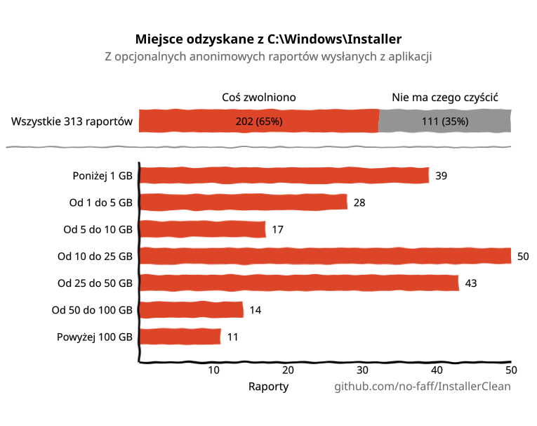
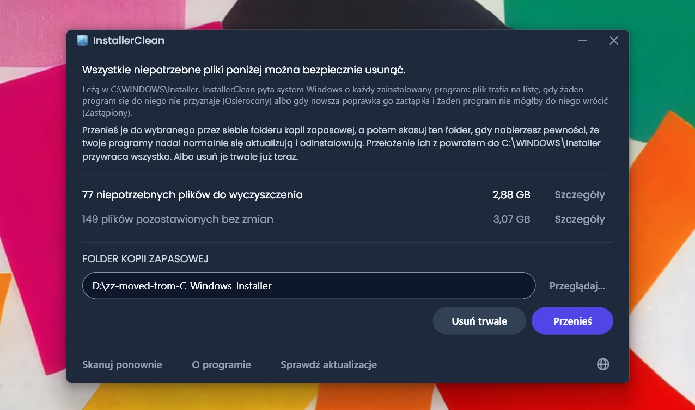
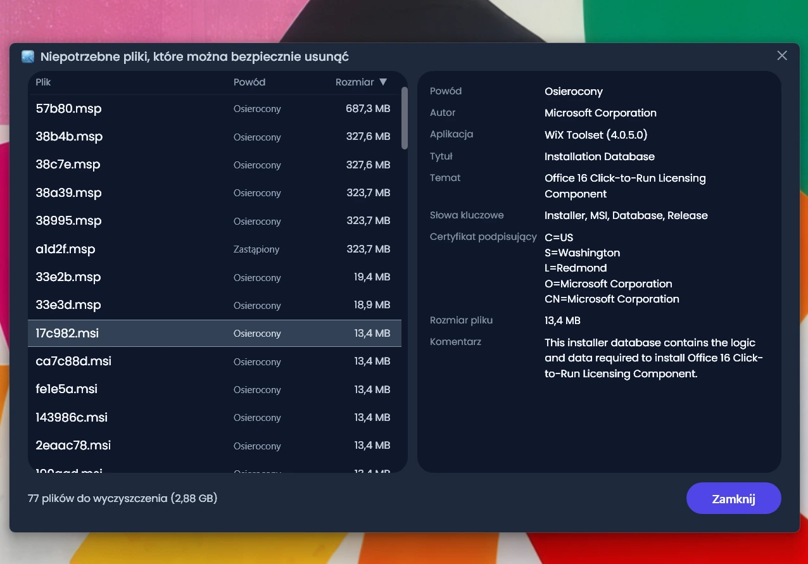
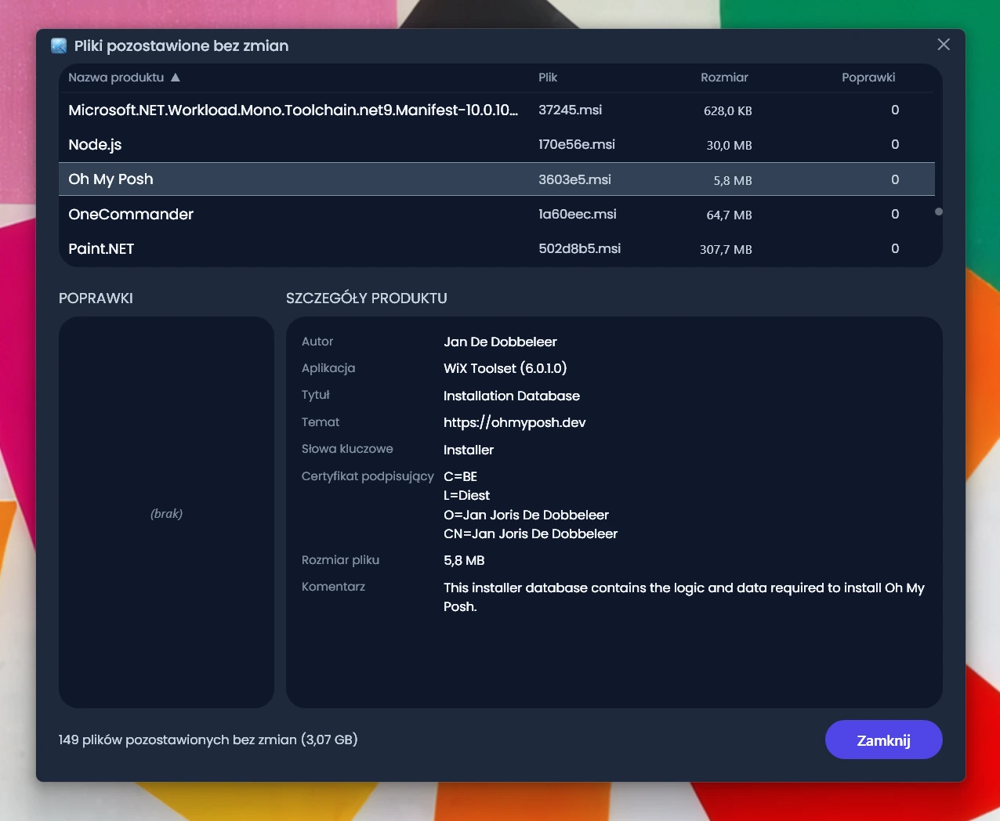
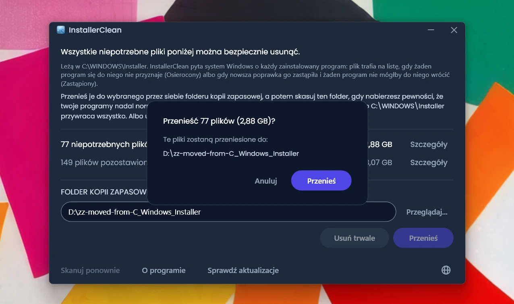
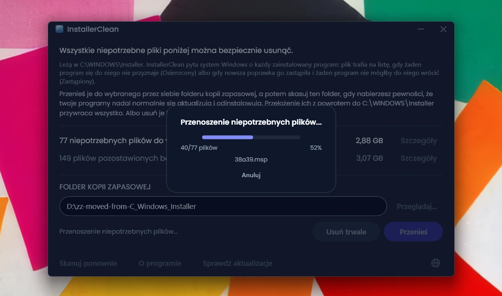
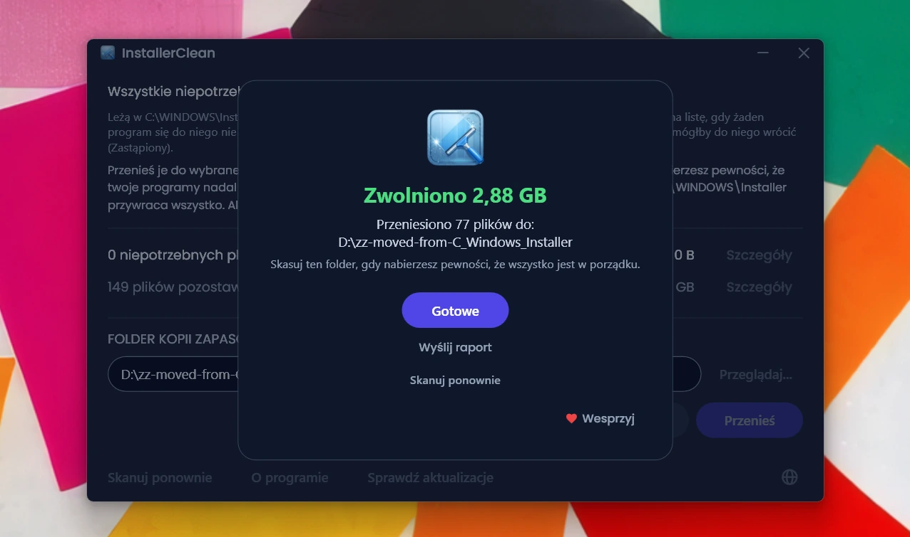

<p align="center">
  <a href="README.md">English</a> · <a href="README.zh-CN.md">简体中文</a> · <a href="README.ru.md">Русский</a> · <a href="README.es.md">Español</a> · <a href="README.ar.md">العربية</a> · <a href="README.ja.md">日本語</a> · <a href="README.pt-BR.md">Português (BR)</a> · <strong>Polski</strong> · <a href="README.tr.md">Türkçe</a> · <a href="README.ko.md">한국어</a> · <a href="README.fr.md">Français</a> · <a href="README.it.md">Italiano</a> · <a href="README.de.md">Deutsch</a> · <a href="README.id.md">Bahasa Indonesia</a> · <a href="README.vi.md">Tiếng Việt</a> · <a href="README.uk.md">Українська</a> · <a href="README.nl.md">Nederlands</a>
</p>

<p align="center">
  
</p>

<p align="center"><em>🎶 What's my line? I'm happy <a href="https://www.youtube.com/watch?v=HM-jHhUZfFI">cleaning Windows</a></em></p>

<h1 align="center">InstallerClean</h1>

<p align="center"><strong>Otwartoźródłowe narzędzie do bezpiecznego oczyszczania <code>C:\Windows\Installer</code>, ukrytego folderu systemu Windows, który po cichu pożera miejsce na dysku.</strong></p>

<p align="center"><em>Uruchamiaj go od wielkiego dzwonu. Może zwolnisz trochę miejsca. Ruszaj dalej, wszystko czyste.</em></p>

<p align="center">
  <a href="LICENSE"></a>
  <a href="https://dotnet.microsoft.com/download/dotnet/10.0"></a>
  <a href="https://github.com/no-faff/InstallerClean/actions/workflows/ci.yml"></a>
  <a href="https://github.com/no-faff/InstallerClean/releases"></a>
  <a href="https://github.com/no-faff/InstallerClean/releases/latest"></a>
  <a href="https://github.com/no-faff/InstallerClean/releases"></a>
</p>

<a id="reports-stats"></a>

<!-- reports-stats-start chart-only (generated; do not hand-edit between these markers) -->
<p align="center">
  <picture>
    <source media="(prefers-color-scheme: dark)" srcset="docs/reports-pl-dark.svg" />
    <source media="(prefers-color-scheme: light)" srcset="docs/reports-pl-light.svg" />
    
  </picture>
</p>
<!-- reports-stats-end -->

- **Co:** InstallerClean robi jedną rzecz: usuwa niepotrzebne pliki z `C:\Windows\Installer`, ukrytego folderu, który zapełnia się, gdy instalujesz i aktualizujesz oprogramowanie. Po szybkim skanowaniu mówi ci, czy w ogóle jakieś masz, pokazuje więcej szczegółów ciekawskim i pozwala przenieść je gdzie indziej albo usunąć, żeby zwolnić miejsce na dysku C:.
- **Może jesteś tu, bo:** Użyłeś [WinDirStat](https://github.com/windirstat/windirstat), WizTree albo TreeSize, zobaczyłeś, że `C:\Windows\Installer` zajmuje mnóstwo miejsca, i nie wiedziałeś, co w nim siedzi. W takim razie InstallerClean to dokładnie to, czego potrzebujesz. Wie, co kryje się w tych plikach o pozornie przypadkowych nazwach, jak `9f05cba.msi`, i szybko mówi ci, które z nich możesz bezpiecznie usunąć.
- **Ile miejsca:** Wykres powyżej pokazuje wyniki opcjonalnych raportów, które powoli, ale stale napływają od wersji v1.8.0. (Dziękuję wszystkim, którzy kliknęli ten przycisk. Bez was tego wykresu by nie było.) Wśród tych <!-- reports-freedpct-start -->65%<!-- reports-freedpct-end -->, które zwolniły miejsce, mediana zwolnionego miejsca to <!-- reports-median-start -->15,8 GB<!-- reports-median-end -->. <!-- reports-biggest-start -->Jedna maszyna odzyskała bagatela 464 GB.<!-- reports-biggest-end --> Pozostałe <!-- reports-nothingpct-start -->35%<!-- reports-nothingpct-end --> nie zwolniły nic, więc wszystko zależy od maszyny: czysta instalacja Windows 11 bez dodatkowego oprogramowania nie ma czego usuwać. Najwięcej niepotrzebnych plików mają maszyny działające od lat, te z rozbudowanym oprogramowaniem opartym na MSI (Acrobat, Office, LibreOffice, duże narzędzia deweloperskie) i komputery osób, które dużo instalują i odinstalowują. Dokładnie zobaczysz ile, w chwili gdy go uruchomisz.
- **Czy to bezpieczne:** Tak. InstallerClean rusza wyłącznie pliki w `C:\Windows\Installer`, pyta Windows Installer, co jest jeszcze potrzebne, i czyta te same rekordy również wprost z rejestru. Proponuje plik tylko wtedy, gdy żaden program na komputerze się do niego nie przyznaje albo gdy zastąpiła go nowsza poprawka i żaden program nie mógłby do niego wrócić. Wszystko, co do czego nie dostaje jasnej odpowiedzi, zatrzymuje. [Więcej niżej](#jak-to-działa).
- **Nic o tobie:** Otwarty kod (Apache 2.0). Bez konta, bez reklam, bez śledzenia, bez telemetrii, bez niczego działającego w tle. Jedyne, co robi w sieci z własnej inicjatywy, to sprawdza przy uruchomieniu, czy na GitHubie jest nowsza wersja, a to możesz wyłączyć.
- **Pobierz:** [Pobierz najnowszą wersję](../../releases/latest). Uruchom; przeklikaj się przez [ostrzeżenie, jakie pokaże Windows](#unknown-publisher) i [monit administratora](#admin). Przenieś albo usuń to, co znajdzie. Gotowe.

## Spis treści

- [Folder, o którym nikt ci nie mówi](#folder-o-którym-nikt-ci-nie-mówi)
- [W poszukiwaniu pomocy](#w-poszukiwaniu-pomocy)
- [Co robi InstallerClean](#co-robi-installerclean)
- [Zrzuty ekranu](#zrzuty-ekranu)
- [Jak to działa](#jak-to-działa)
- [Pobieranie](#pobieranie)
  - [Sprawdzanie samego pobranego pliku](#sprawdzanie-samego-pobranego-pliku)
- [FAQ](#faq)
- [Wiersz poleceń](#wiersz-poleceń)
- [Dostępność](#dostępność)
- [Polityka podpisywania kodu](#polityka-podpisywania-kodu)
- [Prywatność](#prywatność)
- [Czego nie robi](#czego-nie-robi)
- [Alternatywy](#alternatywy)
- [Jeśli kiedykolwiek zabraknie pliku w C:\Windows\Installer](#recovery)
- [Wymagania](#wymagania)
- [Kompilacja ze źródeł](#kompilacja-ze-źródeł)
- [Współtworzenie](#współtworzenie)
- [Wesprzyj projekt](#wesprzyj-projekt)
- [Historia gwiazdek](#historia-gwiazdek)
- [Licencja](#licencja)

---

## Folder, o którym nikt ci nie mówi

Na każdym komputerze z Windowsem jest ukryty folder o nazwie `C:\Windows\Installer`. Za każdym razem, gdy instalujesz oprogramowanie korzystające z systemu Windows Installer albo nakładasz poprawkę na Microsoft Office, Adobe Acrobat, Visual Studio czy dowolną inną aplikację opartą na `.msi`, kopia tego instalatora lub pliku poprawki `.msp` trafia do tego folderu i tam zostaje.

Gdy nowsza poprawka zastępuje starszą, zostają obie. Zostają też instalatory oprogramowania odinstalowanego dawno temu. Oczyszczanie dysku nie rusza niczego z tego, Czujnik pamięci również nie. DISM służy do zupełnie innego folderu. Z czasem folder rośnie: 1 GB, 5 GB, 20 GB, 50 GB. Na maszynach z dużą ilością oprogramowania korzystającego z MSI (częstym winowajcą jest Acrobat) może [przekroczyć 100 GB](https://www.reddit.com/r/sysadmin/comments/1oxcrmh/acrobat_filling_up_the_cwindowsinstaller_folder/).

To nie są pliki tymczasowe, które same wrócą. To prawdziwy balast: stare instalatory oprogramowania odinstalowanego lata temu i poprawki zastępowane już wielokrotnie. Gdy raz znikną, nie wracają.

**Jeśli szukasz łatwego sposobu na zwolnienie miejsca na dysku w Windowsie, ten folder to dobry punkt wyjścia.** InstallerClean znajduje niepotrzebne pliki i bezpiecznie je usuwa.

## W poszukiwaniu pomocy

Jeśli kiedykolwiek szukałeś pomocy w sprawie tego folderu, pewnie wiesz, jak to wygląda. Ktoś ze 180 GB w `C:\Windows\Installer` pyta, jak go wyczyścić. [Radzą mu uruchomić Oczyszczanie dysku](https://learn.microsoft.com/en-us/answers/questions/4238108/windows-installer-folder-has-occupied-180gb). Próbuje. Zwalnia 600 MB, ale nic z tego folderu (bo Oczyszczanie dysku nie rusza `C:\Windows\Installer`). Wątek cichnie.

> *„Wszystkie wątki, które udało mi się znaleźć, zwykle polecają te same rzeczy, które nie rozwiązują problemu, a potem zamierają.”*
>
> [ksparks519, r/Windows10](https://www.reddit.com/r/Windows10/comments/1bt8c5p/anyone_ever_figure_out_giant_installer_folders/) (przetłumaczono z angielskiego oryginału)

Albo radzą im w ogóle go nie ruszać. W jednym z wątków komuś z folderem Installer o rozmiarze 60 GB powiedziano, żeby [„nie ruszał tego.”](https://www.reddit.com/r/techsupport/comments/1hw4suq/my_windows_installer_folder_is_like_60gb_so_i/) Gdy zapytał, co w takim razie ma zrobić, odpowiedź brzmiała: *„Przecież dopiero co ci powiedziałem.”*

Standardowa porada myli dwie różne rzeczy. Usuwanie plików na chybił trafił odbiera ci możliwość aktualizowania i odinstalowywania programów, do których te pliki należały. Usuwanie wyłącznie tych plików, do których nic na komputerze się nie przyznaje albo które Windows ma zapisane jako zastąpione, tej możliwości nie odbiera. InstallerClean robi to drugie.

## Co robi InstallerClean

1. **Skanuje** `C:\Windows\Installer` w poszukiwaniu plików `.msi` i `.msp`
2. **Pyta** Windows Installer, co jest jeszcze potrzebne, i czyta te same rekordy również wprost z rejestru
3. **Zatrzymuje** wszystko, czego te dwa odczyty nie rozstrzygają między sobą
4. **Mówi, ile możesz zwolnić** i ile zostawia bez zmian, z opcjonalnymi oknami szczegółów wymieniającymi każdy plik
5. **Usuwa niepotrzebne pliki**: przenosi je do wybranego przez ciebie folderu kopii zapasowej albo usuwa trwale

## Zrzuty ekranu

<p>
  <br>
  <em>Pierwsze skanowanie. Idzie bardzo szybko.</em>
  <br><br>
</p>

<p>
  <br>
  <em>Wyniki: ile można usunąć, ile zostało bez zmian.</em>
  <br><br>
</p>

<p>
  <br>
  <em>Szczegóły plików, które mogą zniknąć: powód, dla którego każdy z nich jest zbędny, i to, co plik mówi sam o sobie.</em>
  <br><br>
</p>

<p>
  <br>
  <em>Szczegóły plików pozostawionych bez zmian: program, do którego według Windows należy każdy z nich, i to, co plik mówi sam o sobie.</em>
  <br><br>
</p>

<p>
  <br>
  <em>Potwierdzenie przed każdą z akcji. Przenieś robi kopię zapasową plików w wybranym przez ciebie folderze. Albo usuń je trwale.</em>
  <br><br>
</p>

<p>
  <br>
  <em>Przenoszenie w toku. Na ten sam dysk jest natychmiastowe. Na inny dysk trwa tym dłużej, im więcej GB.</em>
  <br><br>
</p>

<p>
  <br>
  <em>Gotowe. Miejsce odzyskane. Pliki w kopii zapasowej, dopóki nie nabierzesz pewności, że wszystko jest w porządku. Potem skasuj folder kopii zapasowej.</em>
  <br><br>
</p>

<p>
  <br>
  <em>Po ponownym skanowaniu. Nic już do wyczyszczenia.</em>
  <br><br>
</p>

<a id="is-it-safe"></a>
## Jak to działa

Gdy Windows Installer instaluje program, zachowuje kopię instalatora w `C:\Windows\Installer`, a gdy przy programie zostaje zarejestrowana poprawka, zachowuje również jej kopię. Te kopie są tym, na czym Windows Installer pracuje później, gdy naprawia, aktualizuje lub odinstalowuje oprogramowanie, i dlatego leżą tam długo po zakończeniu instalacji. W folderze lądują oba rodzaje kopii: instalatory `.msi` oraz poprawki `.msp`, które aktualizują program już zainstalowany, zamiast go zastępować.

InstallerClean proponuje plik z jednego z dwóch powodów.

**Osierocony** oznacza, że nic na komputerze nie przyznaje się do tego pliku. Nie wskazuje go ani żaden zainstalowany produkt, ani żadna zarejestrowana poprawka.

**Zastąpiony** oznacza, że Windows zapisał, iż tę poprawkę zastąpiła nowsza, i mimo to zachował plik. Poprawka zostaje usunięta dopiero wtedy, gdy odinstalowano każdy program, przy którym jest zarejestrowana, albo gdy wycofano ją ze wszystkich. Zastąpienie przez nowszą nie jest ani jednym, ani drugim, więc plik zostaje. Adobe Acrobat działa w Windows właśnie tak: jego aktualizacje przychodzą jako poprawki do podstawowej instalacji, a nie jako nowe instalatory, więc maszyna, która ma go od dłuższego czasu, może trzymać ich kilka.

InstallerClean ustala jedno i drugie, idąc w przeciwne strony, i tylko w pierwszym przypadku w ogóle zagląda do folderu.

**Spisanie folderu.** InstallerClean wypisuje pliki `.msi` i `.msp` leżące bezpośrednio w `C:\Windows\Installer`. Do podfolderów nie wchodzi.

**Odczyt rekordów, dwa razy.** InstallerClean pyta Windows Installer o każdy zainstalowany produkt i każdą zarejestrowaną poprawkę oraz o plik w pamięci podręcznej, który każde z nich wskazuje, wywołując API Windows Installer w `msi.dll`. Potem czyta te same rekordy drugim sposobem, wprost z rejestru, bo odpytywanie może wrócić niekompletne, nic o tym nie mówiąc: Windows wydaje rekordy po jednym, aż zasygnalizuje, że nie ma już nic więcej, a przebieg, który urywa się na trzecim z dwustu, wygląda dokładnie tak samo jak ten, który doszedł do końca. Klucz rejestru wydaje całą swoją listę nazw naraz, więc lista, której czegoś brakuje, nie może wyglądać na kompletną. Każdy produkt, którego nazwę podaje rejestr, a którego odpytywanie nie znalazło, trafia potem z powrotem do Windows, po nazwie, jeden po drugim. Ten drugi odczyt może przesunąć plik wyłącznie na stronę „nadal potrzebnych”. Nie ma drogi, którą dopisałby plik do listy do usunięcia.

**Dopasowanie rekordu do jego pliku.** Rekord wskazuje swój plik w pamięci podręcznej jako ścieżkę, a ten sam folder nie zawsze jest w nich zapisany tak samo. Zamiast ufać zapisowi, InstallerClean pyta więc Windows, dokąd naprawdę prowadzi każda zapisana ścieżka, i porównuje to z plikami, które wypisał w folderze. Wszystko, do czego nadal nic się nie przyznaje, przechodzi drugie porównanie, które w ogóle nie idzie przez nazwy: InstallerClean otwiera plik i prosi Windows o jego identyfikację, żeby dwie różne nazwy tego samego pliku zostały rozpoznane jako jeden plik.

**Rekordy, których nie da się dopasować.** Jeśli Windows nie powie, dokąd prowadzi zapisana ścieżka, albo pliku na jej końcu nie da się zidentyfikować, InstallerClean nie wie, którego pliku dotyczył ten rekord, a chodzić może o którykolwiek z wypisanych. Tak samo jest, gdy program mógł zostać zainstalowany więcej niż raz, bo wtedy nie da się stwierdzić, który plik w pamięci podręcznej należy do której instalacji. W każdym z tych przypadków InstallerClean nie proponuje niczego, co znalazł wtedy przez spisanie folderu. Rekord wskazujący plik, którego już nie ma, to co innego: nie zostało nic, czego mógłby dotyczyć, więc nie może dotyczyć żadnego z plików nadal leżących w folderze.

**Pytanie z drugiej strony.** O sieroctwie rozstrzyga brak, a brak może też oznaczać, że aplikacja nie zdołała znaleźć rekordu. Zanim więc zaproponuje instalator `.msi`, InstallerClean otwiera plik, odczytuje kod produktu, który niesie sam plik, i pyta Windows, czy ten produkt jest zainstalowany. Jeśli jest, plik zostaje, cokolwiek znalazła reszta skanowania. Ta kontrola może plik wyłącznie zdjąć z listy. Żadna jej odpowiedź nie może go na nią dopisać.

**Co rozstrzyga o poprawce `.msp`.** Poprawki nie otwiera się po to, żeby zapytać ją, do którego programu należy. Rozstrzyga zamiast tego to, że rejestracja poprawki wskazuje jej plik w pamięci podręcznej w dwóch miejscach: wśród poprawek zarejestrowanych przy każdym produkcie oraz na jednej liście w rejestrze, obejmującej wszystkie rejestracje poprawek na komputerze. Poprawka jest proponowana jako osierocona tylko wtedy, gdy nie wskazuje jej żadne z tych dwóch miejsc.

**Czym różni się poprawka zastąpiona.** Nie przechodzi nic z powyższego, bo nie jest plikiem, do którego nic się nie przyznaje. Windows ma jej rekord i to ten rekord mówi, że została zastąpiona. Ryzyko jest tu inne: poprawka może być zarejestrowana przy kilku programach, a tylko jeden z nich już jej nie potrzebuje. Poprawka zastąpiona jest więc proponowana tylko wtedy, gdy Windows ma zapisane, że nie da się jej odinstalować, gdy zapytano każdy program, przy którym jest zarejestrowana, gdy żaden z nich nadal nie ma jej zastosowanej i gdy żaden z nich nie trzyma poprawki, o której Windows mówi, że da się ją odinstalować. To ostatnie jest tu dlatego, że wycofanie poprawki z programu może sięgnąć po starszy plik. Jeśli na cokolwiek z tego nie da się odpowiedzieć, plik zostaje.

<details>
<summary>Wywołania Windows Installer, z których korzysta</summary>

- `MsiEnumProductsEx`, aby wypisać każdy zainstalowany produkt, i ponownie, z pojedynczym kodem produktu, aby zapytać, czy ten konkretny produkt jest zainstalowany
- `MsiEnumPatchesEx`, aby wypisać zarejestrowane poprawki, zarówno dla pojedynczego produktu, jak i w obrębie całego komputera
- `MsiGetProductInfoEx`, aby odczytać nazwę produktu, wskazywany przez niego plik w pamięci podręcznej i to, czy jest jedną z kilku instalacji tego samego produktu
- `MsiGetPatchInfoEx`, aby odczytać stan poprawki, to, czy Windows potrafi ją odinstalować, oraz wskazywany przez nią plik w pamięci podręcznej
- `MsiGetSummaryInformation` i `MsiSummaryInfoGetProperty`, aby odczytać z pliku poprawki, do których programów można ją zastosować
- `MsiOpenDatabase`, `MsiDatabaseOpenView`, `MsiViewExecute`, `MsiViewFetch` i `MsiRecordGetString`, aby odczytać z pliku instalatora zadeklarowany w nim kod produktu

</details>

Mimo wszystko aplikacja zachęca, żeby przenieść pliki do folderu kopii zapasowej (na innym dysku lub innej partycji, jeśli chcesz zwolnić miejsce na C). Wtedy masz okazję upewnić się, że naprawdę wszystko jest w porządku, zanim ostatecznie usuniesz niepotrzebne pliki.

## Pobieranie

Trzy warianty, wybierz jeden:

- **Portable** (`InstallerClean-3.0.0-portable.exe`): jeden plik ze środowiskiem uruchomieniowym .NET 10 w środku. Bez instalacji, bez deinstalatora: kliknij dwa razy i działa. Zachowaj plik na następny raz albo usuń go, gdy skończysz.
- **Setup** (`InstallerClean-3.0.0-setup.exe`): zwykły instalator Windows z dołączonym środowiskiem uruchomieniowym .NET 10. Dodaje wpis w menu Start i odinstalowuje się czysto. Schowany wśród programów, więc łatwo go znaleźć za pół roku albo uruchamiać częściej, jeśli dużo instalujesz i odinstalowujesz.
- **CLI** (`installerclean-cli.exe`): sama wersja wiersza poleceń, jeden plik ze środowiskiem uruchomieniowym w środku. Bez instalacji, bez deinstalatora. Wrzuć go na komputer kliencki, uruchom skanowanie albo czyszczenie, usuń. Stworzony do skryptowania, zaplanowanych zadań i masowego wdrażania, gdy chcesz wykonać operacje bez aplikacji desktopowej na komputerze klienta. Zob. [Wiersz poleceń](#wiersz-poleceń), aby poznać argumenty i kody wyjścia.

Od wersji 2.2.0 nazwy plików instalatora i wersji przenośnej zawierają numer wersji, więc pobrana kopia zawsze mówi, czym jest; wersja wiersza poleceń zachowuje zwykłą nazwę `installerclean-cli.exe`, żeby zaplanowane zadania i skrypty, które na nią wskazują, działały dalej mimo aktualizacji.

Pobierz ze [strony wydań](../../releases/latest), a następnie uruchom. Jest niepodpisany, więc Windows pokazuje ostrzeżenie o „nieznanym wydawcy”; [FAQ](#unknown-publisher) wyjaśnia, co zobaczysz i dlaczego jest to bezpieczne.

Aplikacja skanuje automatycznie przy starcie. Przejrzyj wyniki, a następnie kliknij **Przenieś** lub **Usuń trwale**.

Albo zainstaluj przez [winget](https://learn.microsoft.com/windows/package-manager/winget/):

```
winget install NoFaff.InstallerClean
```

Albo zainstaluj przez [Scoop](https://scoop.sh):

```
scoop install installerclean
```

### Sprawdzanie samego pobranego pliku

InstallerClean jest niepodpisany. Oto, co możesz sprawdzić, zanim go uruchomisz:

- Skrót SHA-256 każdego pliku do pobrania jest na stronie jego wydania.
- VirusTotal: każdy build jest skanowany przed publikacją, a strona wydania zawiera pełny wynik dla każdego silnika i każdego pliku.
- Kod źródłowy jest tutaj: [github.com/no-faff/InstallerClean](https://github.com/no-faff/InstallerClean). Usługi skanowania, odpytywania, przenoszenia, usuwania, ustawień i oczekującego ponownego uruchomienia są objęte automatycznym zestawem testów, który uruchamia się w Windows przy każdym pushu do `main` i przy każdym pull requeście, a plakietka CI u góry tej strony pokazuje wynik.
- Buildy wydań są deterministyczne: ten sam kod źródłowy, ten sam SDK i te same flagi publikowania dają te same bajty, a wydania nie da się otagować, jeśli którykolwiek składnik buildu nie zgadza się ze źródłem na tym tagu. Możesz więc przełączyć się na ten tag, zbudować go samodzielnie i porównać skróty z opublikowanymi. Opis każdego wydania zawiera to, co jest do tego potrzebne: wersję SDK, którą je zbudowano, oraz flagi publikowania dla każdego pliku, którego nie zbudowano z ustawieniami domyślnymi. Wyjątkiem jest instalator: kompiluje go Inno Setup, a nie SDK, i wpisuje w siebie rok, w którym powstał, więc odtworzenie jego skrótu wymaga także tej samej wersji Inno i tego samego roku kalendarzowego.
- <!-- downloads-start -->83 000+<!-- downloads-end --> pobrań w serwisach GitHub, MajorGeeks i Softpedia.
- [MajorGeeks](https://www.majorgeeks.com/files/details/installerclean.html) testuje każde zgłoszenie w maszynie wirtualnej i umieszcza je na liście tylko wtedy, gdy przejdzie ich kontrolę.<br><a href="https://www.majorgeeks.com/files/details/installerclean.html"></a>
- [Softpedia](https://www.softpedia.com/get/System/Hard-Disk-Utils/InstallerClean.shtml) sprawdziła aplikację i wystawiła certyfikat potwierdzający brak programów szpiegujących, adware i wirusów.<br><a href="https://www.softpedia.com/get/System/Hard-Disk-Utils/InstallerClean.shtml"></a>

## FAQ

<a id="admin"></a>

**Dlaczego wymaga uprawnień administratora?** Z dwóch powodów. `C:\Windows\Installer` jest zastrzeżony dla administratorów, więc odczyt folderu, odpytywanie Windows Installer oraz przenoszenie i usuwanie plików wymagają tych uprawnień. Poza tym administrator może zapytać Windows o programy zainstalowane na dowolnym koncie na tym komputerze, a zwykły użytkownik nie: bez tych uprawnień Windows odpowiedziałby, że program nie jest zainstalowany, choć jest, i to w kontroli, która rozstrzyga, czy plik jest jeszcze potrzebny.

<a id="unknown-publisher"></a>

**Dlaczego Windows pisze „Nieznany wydawca”?** InstallerClean nie jest podpisany cyfrowo, a Windows oznacza pliki pobrane z internetu, więc przy pierwszym uruchomieniu SmartScreen zwykle pokazuje „System Windows ochronił ten komputer”, a wydawca figuruje jako nieznany. Płatny certyfikat do podpisywania kosztuje co roku, a wolę, żeby aplikacja pozostała darmowa, niż za niego płacić, więc złożyłem wniosek do SignPath Foundation, która podpisuje oprogramowanie open source za darmo, i InstallerClean został przyjęty (zob. [Polityka podpisywania kodu](#polityka-podpisywania-kodu)). Certyfikat nie został jeszcze wystawiony, więc na razie kliknij **Więcej informacji**, a potem **Uruchom mimo to**. Można to zrobić bez obaw: kod źródłowy jest publiczny, a każde wydanie ma linki do VirusTotal i skróty SHA-256, które możesz wcześniej sprawdzić.

**Czy działa na Windows 7 lub 8?** Nie. Wymaga Windows 10 w wersji 1607 lub nowszej, najstarszej obsługiwanej przez środowisko uruchomieniowe .NET 10. Instalator odmawia instalacji na czymkolwiek starszym, a wersja przenośna się nie uruchomi.

## Wiersz poleceń

`installerclean-cli.exe` to osobny program konsolowy, instalowany obok GUI. To samo skanowanie, to samo przenoszenie, to samo usuwanie, bez okna. Program blokuje wiersz poleceń do czasu zakończenia, więc skrypt albo zaplanowane zadanie może na niego zaczekać.

### Flagi

| Flaga | Co robi | Przyjmuje też |
|---|---|---|
| `/s` | Tylko skanowanie. Wypisuje, co by usunął, z nazwą, rozmiarem i powodem dla każdego pliku. Niczego nie zmienia. | |
| `/d` | Skanuje, a następnie trwale usuwa niepotrzebne pliki. | |
| `/m` | Skanuje, a następnie przenosi je do folderu zapisanego w GUI. | |
| `/m ŚCIEŻKA` | Skanuje, a następnie przenosi je do folderu `ŚCIEŻKA`. Ujmij ścieżkę w cudzysłów, jeśli zawiera spację. | |
| `--help` | Wypisuje sposób użycia i kończy się kodem `0`. | `/?`, `-h` |
| `--version` | Wypisuje wersję i kończy się kodem `0`. | `-v` |

Wielkość liter we flagach nie ma znaczenia, więc `/S` i `/D` działają tak samo jak `/s` i `/d`. Jedna flaga na przebieg: nie można ich łączyć, a po `/s` i `/d` nic nie występuje.

Uruchomiony bez argumentu wypisuje sposób użycia i kończy się kodem `1`, więc zaplanowane zadanie, które zgubi swoją flagę, zawodzi w widoczny sposób, zamiast po cichu nie robić nic. Nierozpoznana flaga daje wiersz z błędem, potem sposób użycia, i również kod `1`. Ścieżka przeniesienia ze spacją, nieujęta w cudzysłów, jest odrzucana tak samo, zamiast zostać po cichu ucięta, a komunikat mówi, żeby ująć ją w cudzysłów.

### Kody wyjścia

To kody, które samo narzędzie opisuje w `--help`:

| Kod | Znaczenie |
|---|---|
| `0` | Sukces. Przebieg zrobił to, o co go poproszono, i nic nie zawiodło. |
| `1` | Nic nie przetworzono. Przebieg zawiódł albo został odrzucony. |
| `2` | Częściowo. Część przetworzono, część nie, w tym po Ctrl+C w połowie. |
| `75` | Stan przejściowy. Przebieg zablokował warunek tymczasowy; wypisany komunikat mówi jaki. |
| `130` | Anulowano przez Ctrl+C, zanim cokolwiek przetworzono. |

Kod `1` obejmuje zarówno odmowę, jak i awarię, a odmowa nie jest usterką: po prostu zapełniony folder docelowy i wartość rejestru, której aplikacja nie zdołała odczytać, zanim czegokolwiek dotknęła, trafiają tutaj tak samo. Kod `0` oznacza, że nic nie zawiodło, a nie że nic nie zostało: `--help`, `--version` i przebieg z samym skanowaniem kończą się kodem `0` niezależnie od tego, czy skanowanie znalazło sześćdziesiąt osiem plików, czy ani jednego.

### Dziennik zdarzeń

Każdy przebieg zapisuje wpis z wynikiem w dzienniku aplikacji i może dołożyć obok jedno lub więcej powiadomień. Identyfikator zdarzenia jest stabilnym kontraktem dla maszyn, więc system RMM może filtrować po numerze, nie analizując żadnego tekstu:

| ID | Znaczenie |
|---|---|
| `1000` | Sukces |
| `1002` | Częściowo |
| `2000` | Pominięto, stan przejściowy |
| `4000` | Twarda awaria |
| `3000` | Powiadomienie: skanowanie nie objęło wszystkich zainstalowanych produktów |
| `3001` | Powiadomienie: w folderze brakuje plików, których oczekuje Windows |
| `3002` | Powiadomienie: pliki zostały zatrzymane, a nie zaproponowane |

Pasmo `3000` to powiadomienie, a nie wynik, i nie liczy się jako rezultat przebiegu. Typ wpisu to Informacje, gdy w przebiegu nic nie poszło źle, i Ostrzeżenie w przeciwnym razie. **Dziennik zdarzeń jest zawsze po angielsku**, niezależnie od języka wyświetlania na komputerze, więc wyszukiwanie znanej frazy ma stały cel. Przetłumaczona jest za to konsola: podąża za językiem samego komputera, a rozmiary i daty zapisuje zgodnie z jego regionem.

### Przykłady użycia

Audyt do pliku, bez żadnych zmian:

```
installerclean-cli /s > audit.txt
```

Comiesięczne przeniesienie do `D:\InstallerBackup`, z kopią CLI umieszczoną w `C:\Tools`:

```
schtasks /create /tn "InstallerClean monthly" /tr "C:\Tools\installerclean-cli.exe /m D:\InstallerBackup" /sc monthly /ru SYSTEM /rl highest
```

Zadanie czeka na zakończenie przebiegu i zapisuje kod wyjścia jako swój Wynik ostatniego uruchomienia, więc system RMM może opierać się na powyższych kodach.

Z poziomu PowerShell:

```powershell
& 'C:\Tools\installerclean-cli.exe' /m D:\InstallerBackup
switch ($LASTEXITCODE) {
    0       { 'Czysto' }
    2       { 'Częściowo, sprawdź wynik' }
    75      { 'Zablokowane, spróbuj ponownie później' }
    default { "Niepowodzenie ($LASTEXITCODE)" }
}
```

### Zanim wstawisz to do skryptu

- **Wymaga podniesionych uprawnień.** Wszystko, `/s` włącznie. Z wiersza poleceń bez podniesionych uprawnień Windows odmawia uruchomienia i przekazuje twojej powłoce `740`.
- **Folder zapisany w GUI jest osobny dla każdego użytkownika.** Zadanie działające jako SYSTEM albo na koncie usługi go nie zobaczy, więc takie przebiegi muszą podać `/m ŚCIEŻKA`.
- **SYSTEM sięga do sieci jako konto komputera**, więc folder docelowy `\\serwer\udział` wymaga nadania uprawnień temu kontu.
- **`/s` nigdy nie blokuje.** Tylko czyta i nie zakłada blokady, więc możesz skanować przy otwartej aplikacji desktopowej. `/d` i `/m` zakładają blokadę obejmującą cały komputer i kończą się kodem `75`, jeśli trzyma ją inny przebieg InstallerClean.
- **Wszystko idzie na stdout**, łącznie z błędami; nie ma stderr. Opieraj się na kodzie wyjścia, a nie na analizowaniu tekstu.
- **Przenoszenie odmawia, zamiast zmieniać nazwę.** Jeśli w folderze docelowym jest już plik o tej nazwie, ten plik zostaje w pamięci podręcznej i zostaje wymieniony z nazwy w wyniku, a reszta partii i tak się przenosi. Przebieg, w którym każdy plik trafia na kolizję, nie przetwarza nic i kończy się kodem `1`.
- **Nic nie opróżnia folderu kopii zapasowej.** `/m` tylko dodaje. Opróżnianie go należy do ciebie.
- **`taskkill /pid` to nie jest łagodne anulowanie.** Blokadę pojedynczej instancji odzyskuje następny przebieg.
- **Pierwszy przebieg rejestruje źródło dziennika zdarzeń**, w `HKLM\SYSTEM\CurrentControlSet\Services\EventLog\Application\InstallerClean`. Zostaw je: Podgląd zdarzeń odczytuje opis wpisu przez jego źródło, więc usunięcie go zamienia każdy wpis, który narzędzie już zapisało, w błąd o nieznanym źródle.

### Dlaczego `installerclean-cli`, a nie `installerclean.exe`

`InstallerClean.exe` to okno i ignoruje argumenty wiersza poleceń. `installerclean-cli.exe` to prawdziwy proces konsolowy, więc blokuje wiersz poleceń do czasu zakończenia, a jego wyjście przekierowuje się i przekazuje potokiem jak każde inne. Instalator Setup instaluje oba. Pobranie Portable zawiera tylko GUI; jeśli chcesz wiersz poleceń bez okna, pobierz sam `installerclean-cli.exe` ze [strony wydań](../../releases/latest).

## Dostępność

InstallerClean jest zaprojektowany tak, aby dało się go w pełni obsługiwać z klawiatury i za pomocą czytnika ekranu.

- **W całości obsługiwany z klawiatury.** Wszystko, co aplikacja robi, da się osiągnąć z klawiatury, a kolumny w oknach szczegółów sortuje się również z klawiatury, więc nic tutaj nie wymaga myszy. Przyciski paska tytułu zachowują się jak te w Windows, a dociera się do nich klawiszami Alt+Spacja lub Alt+F4. Fokus klawiatury pozostaje widoczny wszędzie tam, gdzie się znajdzie.
- **Narrator i Dostęp głosowy.** Każdy element sterujący ma etykietę, a widoczne słowo na przycisku to słowo, które uruchamia go głosem. Gdy przenoszenie lub usuwanie się zakończy, wynik jest odczytywany na głos.
- **Stworzony do czytania.** Tekst spełnia wymogi kontrastu WCAG AA w całym ciemnym motywie.

Jeśli cokolwiek tutaj ci przeszkadza, [zgłoś problem](../../issues). Problemy z dostępnością to błędy, a nie przypadki brzegowe.

## Polityka podpisywania kodu

InstallerClean został przyjęty przez [SignPath Foundation](https://signpath.org) do bezpłatnego podpisywania kodu. To program, który podpisuje oprogramowanie open source, żeby przestało trafiać na twój komputer od nieznanego wydawcy. Sam certyfikat nie został jeszcze wystawiony, więc pliki do pobrania są dziś niepodpisane i Windows będzie przed nimi ostrzegał.

Gdy zostanie wystawiony, każde wydanie będzie opatrzone wierszem, o który prosi SignPath: free code signing provided by SignPath.io, certificate by SignPath Foundation. Certyfikat należy do fundacji, a nie do mnie, bo certyfikat musi zostać wystawiony na podmiot prawny, a jednoosobowy projekt nim nie jest. Nie znaczy to, że InstallerClean jest ich ani że mają z nim coś wspólnego poza podpisem.

**Role.** InstallerClean ma jednego opiekuna. Autorzy commitów i recenzenci, czyli kto może wprowadzać kod do projektu: ja. Zatwierdzający, czyli kto może zezwolić na podpisanie wydania: ja.

## Prywatność

Opcjonalny raport to jedyna rzecz, która w ogóle wysyła cokolwiek o przebiegu, i idzie wyłącznie wtedy, gdy naciśniesz przycisk. Mówi, co skanowanie znalazło, co zostało zatrzymane i dlaczego, czy przeniosłeś, czy usunąłeś, ile to zwolniło, ile trwało i co się nie udało, a do tego wersję aplikacji, język, w którym ją czytasz, i wersję twojego Windows. Bez nazw plików, bez nazw folderów, bez nazwy konta, bez niczego, co identyfikuje twój komputer, i bez niczego, co pozwoliłoby powiązać ze sobą dwa raporty. Tak dowiaduję się, czy aplikacja działa i co zatrzymuje, na komputerach innych niż mój własny.

Bez reklam, bez telemetrii. Poza tym z siecią łączy się tylko po to, żeby przy uruchomieniu sprawdzić wersję (jedno zapytanie do GitHuba, które możesz wyłączyć w oknie O programie); są jeszcze przyciski z odnośnikami do GitHuba i do strony, na której możesz przekazać darowiznę, jeśli masz ochotę. Pełna [polityka prywatności](PRIVACY.md) (po angielsku).

## Czego nie robi

- WinSxS (`C:\Windows\WinSxS`) to inny folder o innych zasadach. Do niego użyj `Dism /Online /Cleanup-Image /StartComponentCleanup` z wiersza poleceń z podwyższonymi uprawnieniami.
- Brak usługi w tle, brak zaplanowanego zadania, brak automatycznego czyszczenia. Aplikacja działa wtedy, gdy ją uruchomisz.
- Nie zmienia ani twoich zainstalowanych programów, ani bazy danych Windows Installer, tylko je odczytuje. Jedyne, co w ogóle zapisuje do rejestru, to jednorazowa rejestracja źródła zdarzeń, której narzędzie wiersza poleceń potrzebuje, aby jego uruchomienia pojawiały się w dzienniku zdarzeń systemu Windows.
- Z własnej inicjatywy aplikacja nawiązuje tylko jedno połączenie: przy uruchomieniu szybko sprawdza na stronie wydań GitHuba, czy jest nowsza wersja, co możesz wyłączyć w oknie O programie. Cała reszta dzieje się tylko wtedy, gdy mu każesz: opcjonalny anonimowy raport (liczby o przebiegu, nic, co nazywa ciebie albo twoje pliki) oraz odnośniki do dokumentacji na GitHubie i do strony z darowiznami, które otwierają się w twojej przeglądarce, jeśli je klikniesz. Sam nigdy niczego nie pobiera.
- Bez pasków narzędzi, bez dołączanego oprogramowania, bez adware.

## Alternatywy

Jeśli szukałeś już wcześniej informacji o tym folderze, narzędziem, na które najpewniej trafiłeś, jest [PatchCleaner](https://www.homedev.com.au/free/patchcleaner). To on robił tę robotę pierwszy, robił ją przez dekadę przed powstaniem InstallerClean, wciąż radzi sobie dobrze, a bez niego InstallerClean by nie istniał.

Zrobiłem InstallerClean, bo PatchCleaner ma zamknięty kod, nie był aktualizowany od marca 2016 roku i domyślnie wyklucza pliki Adobe. To wykluczenie ma dobry powód, a HomeDev powiedział to wprost w ówczesnym opisie wydania:

> *„We wcześniejszych wersjach występuje znany problem: PatchCleaner błędnie uznaje poprawki Adobe Acrobat Reader za niepotrzebne. Adobe stosuje w swoim automatycznym aktualizowaniu jakieś własne, zastrzeżone rozwiązanie, przez co jeśli PatchCleaner usunie »osierocone« poprawki z katalogu instalatora, automatyczne aktualizacje Adobe Reader przestaną się poprawnie instalować.”*
>
> [Opis wydania PatchCleaner, wersja 1.4.0.0](https://www.homedev.com.au/free/patchcleaner) (przetłumaczono z angielskiego oryginału)

Filtr, który wszedł razem z tym, szuka słowa „Acrobat” w metadanych pliku i w jego podpisie. Na maszynach, gdzie Acrobat jest największym winowajcą, może to być większość miejsca:

> *„Pobrałem Patchcleaner, żeby usunąć osierocone pliki `.msp`, ale podobno zwolniłoby to tylko 250 MB miejsca. 29 GB plików jest »wykluczonych przez filtry«, więc Patchcleaner chyba nie pomaga.”*
>
> HeatherBunny1111, [r/techsupport](https://www.reddit.com/r/techsupport/comments/1qc4tcf/how_to_delete_msp_files_safely/) (przetłumaczono z angielskiego oryginału)

Różnica między tymi narzędziami polega tu na tym, z jakim pytaniem każde z nich zwraca się do Windows, a nie na odmiennym zdaniu o Adobe. Prowadzona przez Windows lista poprawek *zastosowanych* do danego produktu pomija te, które zastąpiła nowsza poprawka, więc narzędzie czytające tę listę napotyka plik poprawki zastąpionej jako plik, do którego nic się nie przyznaje, tak samo jak każdy inny. To filtr wykluczający wyłapuje te od Adobe po nazwie. InstallerClean pyta zamiast tego Windows o stan poprawki, więc poprawka zastąpiona przychodzi z taką właśnie etykietą, a o tym, co się z nią stanie, rozstrzyga to, co Windows ma o niej zapisane, a nie to, co mówi jej nazwa. Oto jak wypada porównanie obu:

| | **InstallerClean** | **PatchCleaner** |
|---|---|---|
| Ostatnia aktualizacja | 2026 (aktywny) | 3 marca 2016 |
| Kod źródłowy | Otwarty kod (Apache 2.0) | Zamknięty kod |
| Środowisko uruchomieniowe | .NET 10 (samodzielne) | .NET Framework 4.5.2 + VBScript |
| API | API Windows Installer w `msi.dll` (w procesie) | Windows Installer COM (poza procesem, przez VBScript) |
| Poprawki zastąpione | Rozpoznawane z rekordów poprawek Windows | Nieodróżniane od plików, do których nic się nie przyznaje |
| Pliki Adobe | Poprawki zastąpione wykrywane i oznaczane | Wykluczane filtrem nazw, domyślnie włączonym |

> **Uwaga o `Win32_Product`:** Powszechnym, lecz wadliwym sposobem wypisywania zainstalowanych produktów jest `Win32_Product` (WMI), które podczas wyliczania [wyzwala operacje naprawy MSI](https://gregramsey.net/2012/02/20/win32_product-is-evil/) na każdym produkcie. Zarówno InstallerClean, jak i PatchCleaner tego unikają. InstallerClean wywołuje API Windows Installer w `msi.dll`; PatchCleaner uruchamia skrypt pomocniczy korzystający z obiektu COM Windows Installer. Skrypt ten nazywa się `WMIProducts.vbs`, co sugeruje co innego, ale plik to własny przykładowy skrypt Microsoftu z jedną poprawką i odpytuje Windows Installer, a nie WMI. Nazwa jest w nim jedyną rzeczą, która wprowadza w błąd.

Oczyszczanie dysku, Czujnik pamięci, CCleaner i BleachBit nie czyszczą `C:\Windows\Installer`.

<a id="recovery"></a>
## Jeśli kiedykolwiek zabraknie pliku w `C:\Windows\Installer`

Jeśli w tym folderze rzeczywiście brakuje pliku, program, do którego należał, nadal działa normalnie. Ale gdy spróbujesz ten program zaktualizować albo odinstalować, prawdopodobnie się nie uda. Windows szuka pliku, nie znajduje go i krok się zatrzymuje.

Cały sens InstallerClean polega na tym, żeby proponować przeniesienie lub usunięcie wyłącznie plików, które *nie* są potrzebne, ale aplikacja rozpoznaje brakujący plik, więc każdy znaleziony oznacza trójkątem ostrzegawczym i odnośnikiem prowadzącym tutaj. Oto, co zrobić, żeby spróbować naprawić program:

- Sprawdź numer wersji zainstalowanego programu (Ustawienia, Aplikacje, Zainstalowane aplikacje)
- Pobierz od producenta instalator **tej właśnie wersji**. Nowszy nie zadziała i odinstalowanie najpierw też nie: jedno i drugie musi usunąć to, co jest zainstalowane, zanim pójdzie dalej, a to właśnie ten krok potrzebuje brakującego pliku.
- Uruchom ten instalator
- To powinno przywrócić plik i zostawić twoje ustawienia w spokoju. Przeskanuj ponownie w InstallerClean, a ostrzeżenie zniknie, jeśli się udało.

Microsoft nie gwarantuje jednak, że to zadziała. Poniżej jego własne, pełniejsze stanowisko:

<details>
<summary>Pełniejsze stanowisko Microsoftu</summary>

*Poniższe cytaty Microsoftu pozostają w angielskim oryginale.*

Pełna instrukcja: [Restore missing Windows Installer cache files](https://learn.microsoft.com/en-us/troubleshoot/windows-client/application-management/missing-windows-installer-cache), KB 2667628.

*Może nie ujawnić się od razu:*
> "If the installer cache is compromised, you may not immediately see problems until you take an action such as uninstalling, repairing, or updating a product."

*Pliki są unikalne dla każdego komputera, więc nie skopiujesz żadnego z innego PC:*
> "Missing files cannot be copied between computers because the files are unique."

*Jeśli masz kopię zapasową zrobioną, zanim plik zniknął, Microsoft wymienia cztery drogi, w tej kolejności:*
> - System Restore points (available only on client operating systems)
> - Restoreable system state backup
> - Failure recovery methods that can restore the full system state backup
> - Reinstallation of the operating system and all applications

*I haczyk dotyczący wszystkich czterech. Chodzi o kopię zapasową stanu systemu, a nie o folder, do którego sam przeniosłeś pliki: te możesz po prostu skopiować z powrotem, potwierdzając monit administratora, który Windows pokazuje przy kopiowaniu do tego folderu.*
> "To restore the missing files, a full system state restoration is required. It is not possible to replace only the missing files from a previous backup."

*Zalecany sposób odzyskania i jego bezlitosne ograniczenia:*
> "If application files are missing from the Windows Installer Cache, ask the vendor or support team for the application about the missing files. You must follow the procedures or steps recommended by the application vendor to restore the files. In some cases, you may have to rebuild the operating system and reinstall the application to fix the problem."
>
> "Windows support engineers cannot help you recover missing application files from the Windows Installer cache."

</details>

Jeśli InstallerClean kiedykolwiek okaże się powodem braku pliku, chcę o tym wiedzieć. [Zgłoś problem](../../issues), a naprawię to.

## Wymagania

- Windows 10 (wersja 1607 / kompilacja 14393 lub nowsza, najstarsza obsługiwana przez środowisko uruchomieniowe .NET 10) lub Windows 11
- 64-bitowy Windows. Instalator nie zainstaluje się na 32-bitowym i powie ci o tym.
- Uprawnienia administratora, dla instalatora i dla aplikacji (`C:\Windows\Installer` jest tylko dla administratorów)

Zob. [Pobieranie](#pobieranie), aby poznać warianty Setup, Portable i CLI.

## Kompilacja ze źródeł

```
git clone https://github.com/no-faff/InstallerClean.git
cd InstallerClean
dotnet build src/InstallerClean.sln
```

Uruchom testy:

```
dotnet test src/InstallerClean.Tests/
```

## Współtworzenie

Znalazłeś błąd albo masz sugestię? [Zgłoś problem](../../issues) lub rozpocznij [dyskusję](../../discussions). Pull requesty mile widziane. Przed zgłoszeniem uruchom `dotnet test`.

InstallerClean jest dostępny w 16 językach, a każdy z nich obejmuje całość: aplikację, instalator, wiersz poleceń i ten plik README. W aplikacji, instalatorze i wierszu poleceń japoński i niderlandzki przekazali w całości coolvitto i RijckAlex, a włoski to moje tłumaczenie maszynowe, które poprawił i zatwierdził bovirus, wszyscy trzej to rodzimi użytkownicy tych języków; resztę przetłumaczyłem maszynowo sam. Każdy plik README jest mój, w każdym języku. Włożyłem w nie dużo pracy, ale nie będą idealne, i postanowiłem wydać je w takiej postaci, zamiast trzymać je, aż każdy z nich sprawdzi rodzimy użytkownik. Jeśli znasz angielski i jeden z tych języków i zauważysz coś, co dałoby się poprawić, chętnie o tym usłyszę, przez [zgłoszenie](../../issues/new?template=translation_review.md), pull request lub [dyskusję](../../discussions).

## Wesprzyj projekt

Jeśli InstallerClean zwolni trochę miejsca, a ty masz ochotę, będę bardzo wdzięczny za [drobną darowiznę](https://nofaff.netlify.app/support). W aplikacji jest przycisk ❤️, który prowadzi w to samo miejsce. Każda kwota zostanie przyjęta z wdzięcznością. Wielkie dzięki wszystkim, którzy do tej pory wsparli projekt. To był ogrom pracy i cieszę się, że się opłaciła.

## Historia gwiazdek

<picture>
  <source media="(prefers-color-scheme: dark)" srcset="docs/star-history-dark.svg" />
  <source media="(prefers-color-scheme: light)" srcset="docs/star-history-light.svg" />
  
</picture>

## Licencja

[Apache 2.0](LICENSE)

---

🎶 [George Formby - When I'm Cleaning Windows](https://www.youtube.com/watch?v=P183Uo5Ust4). Miłego słuchania!
