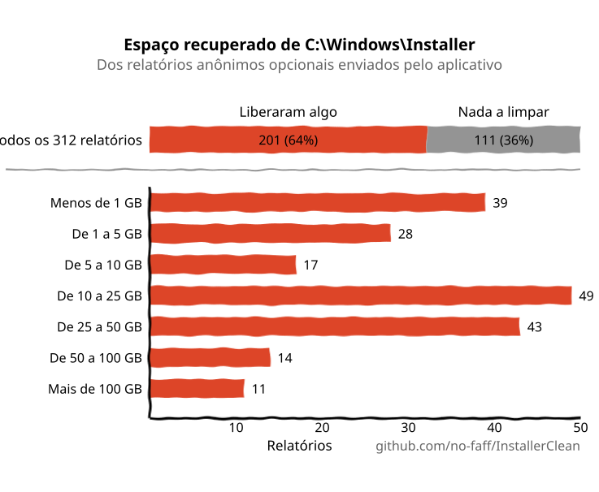
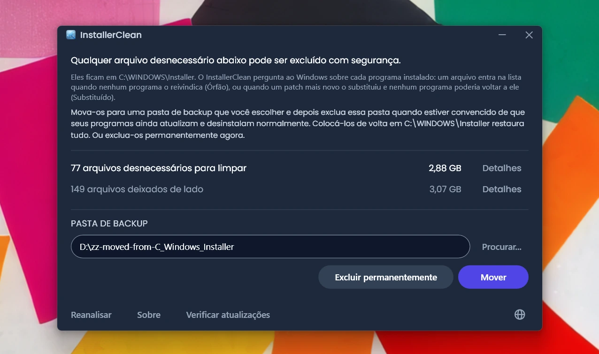
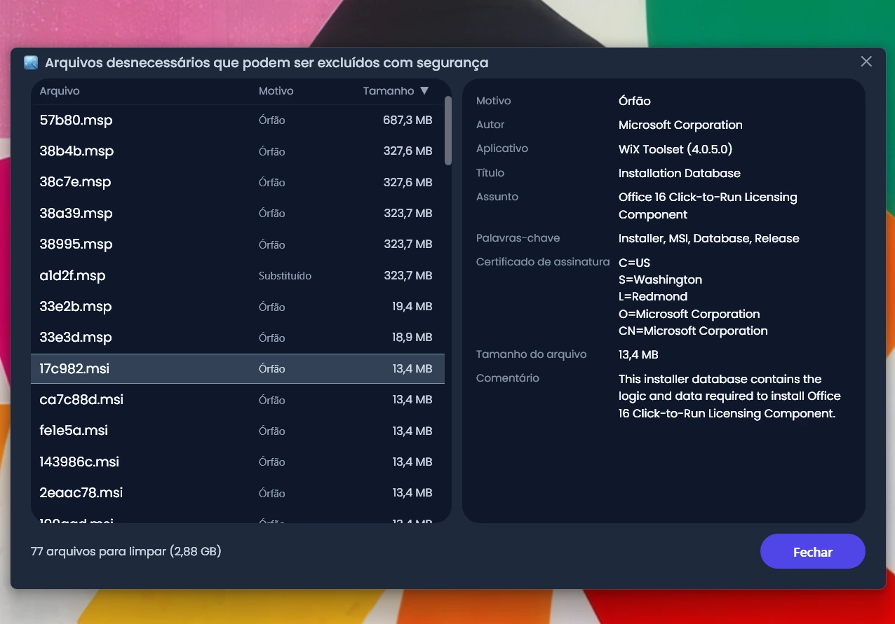
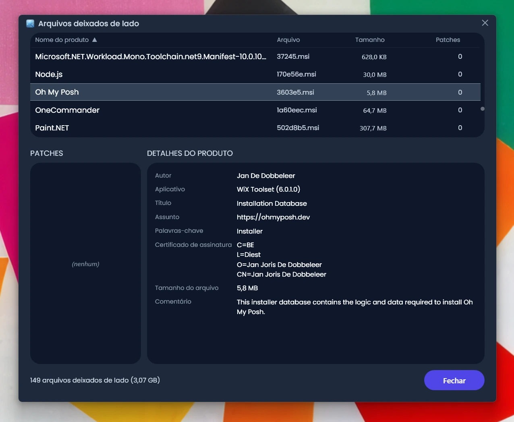
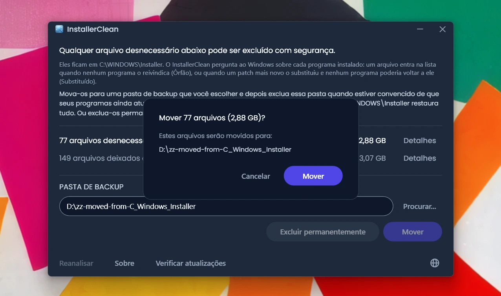
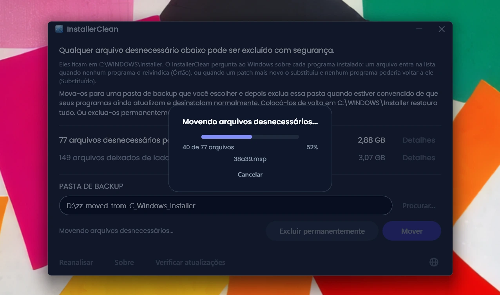
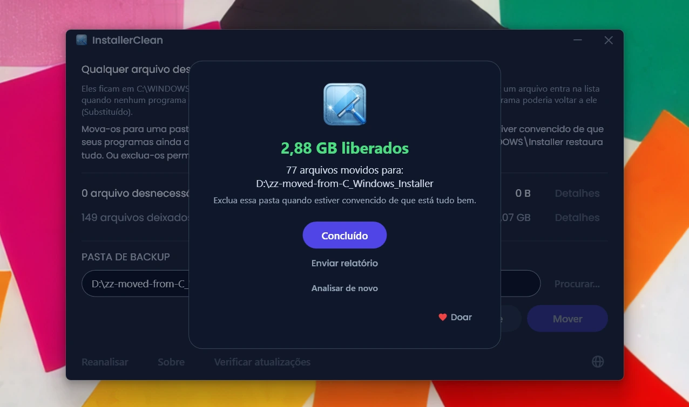

<p align="center">
  <a href="README.md">English</a> · <a href="README.zh-CN.md">简体中文</a> · <a href="README.ru.md">Русский</a> · <a href="README.es.md">Español</a> · <a href="README.ar.md">العربية</a> · <a href="README.ja.md">日本語</a> · <strong>Português (BR)</strong> · <a href="README.pl.md">Polski</a> · <a href="README.tr.md">Türkçe</a> · <a href="README.ko.md">한국어</a> · <a href="README.fr.md">Français</a> · <a href="README.it.md">Italiano</a> · <a href="README.de.md">Deutsch</a> · <a href="README.id.md">Bahasa Indonesia</a> · <a href="README.vi.md">Tiếng Việt</a> · <a href="README.uk.md">Українська</a> · <a href="README.nl.md">Nederlands</a>
</p>

<p align="center">
  
</p>

<p align="center"><em>🎶 What's my line? I'm happy <a href="https://www.youtube.com/watch?v=HM-jHhUZfFI">cleaning Windows</a></em></p>

<h1 align="center">InstallerClean</h1>

<p align="center"><strong>Uma ferramenta de código aberto para limpar com segurança o <code>C:\Windows\Installer</code>, a pasta oculta do Windows que consome silenciosamente o seu espaço em disco.</strong></p>

<p align="center"><em>Use uma vez na vida e outra na morte. Talvez libere um espaço. Siga em frente, leve e limpo.</em></p>

<p align="center">
  <a href="LICENSE"></a>
  <a href="https://dotnet.microsoft.com/download/dotnet/10.0"></a>
  <a href="https://github.com/no-faff/InstallerClean/actions/workflows/ci.yml"></a>
  <a href="https://github.com/no-faff/InstallerClean/releases"></a>
  <a href="https://github.com/no-faff/InstallerClean/releases/latest"></a>
  <a href="https://github.com/no-faff/InstallerClean/releases"></a>
</p>

<a id="reports-stats"></a>

<!-- reports-stats-start chart-only (generated; do not hand-edit between these markers) -->
<p align="center">
  <picture>
    <source media="(prefers-color-scheme: dark)" srcset="docs/reports-pt-BR-dark.svg" />
    <source media="(prefers-color-scheme: light)" srcset="docs/reports-pt-BR-light.svg" />
    
  </picture>
</p>
<!-- reports-stats-end -->

- **O que faz:** O InstallerClean faz uma coisa só: remove arquivos desnecessários de `C:\Windows\Installer`, uma pasta oculta que vai enchendo conforme você instala e atualiza programas. Depois de uma análise rápida, ele diz se você tem algum, mostra mais detalhes para os curiosos e deixa você movê-los para outro lugar ou excluí-los para liberar espaço no seu disco C:.
- **Talvez você esteja aqui porque:** Você usou o [WinDirStat](https://github.com/windirstat/windirstat), o WizTree ou o TreeSize, viu que o `C:\Windows\Installer` estava ocupando muito espaço e não sabia o que tinha ali dentro. Nesse caso, o InstallerClean é exatamente o que você precisa. Ele sabe o que há naqueles arquivos com nomes que parecem aleatórios, como `9f05cba.msi`, e diz rapidamente quais você pode remover com segurança.
- **Quanto espaço:** O gráfico acima mostra os resultados dos relatórios opcionais que vêm chegando aos poucos desde a v1.8.0. (Obrigado a todo mundo que clicou no botão. Sem vocês, esse gráfico não existiria.) Dos <!-- reports-freedpct-start -->64%<!-- reports-freedpct-end --> que liberaram espaço, a mediana liberada é <!-- reports-median-start -->15,8 GB<!-- reports-median-end -->. <!-- reports-biggest-start -->Uma máquina recuperou nada menos que 464 GB.<!-- reports-biggest-end --> Os outros <!-- reports-nothingpct-start -->36%<!-- reports-nothingpct-end --> não liberaram nada, então depende da máquina: uma instalação limpa do Windows 11, sem programas extras, não tem nada a remover. As que mais vão ter arquivos desnecessários são as máquinas que rodam há anos, qualquer uma com programas pesados baseados em MSI (Acrobat, Office, LibreOffice, ferramentas de desenvolvimento grandes) e quem instala e desinstala muito programa. Você vê exatamente quanto no momento em que executa.
- **É seguro:** Sim. O InstallerClean só mexe em arquivos de `C:\Windows\Installer`. Ele pergunta ao Windows Installer o que ainda é necessário e ele próprio lê esses mesmos dados também no Registro do Windows. Ele só oferece um arquivo quando nada instalado na máquina o reivindica, ou quando um patch mais novo o substituiu e nenhum programa daqui poderia voltar ao antigo. Tudo aquilo sobre o que ele não consegue uma resposta clara, ele retém. [Mais detalhes abaixo](#como-funciona).
- **Nada sobre você:** Código aberto (Apache 2.0). Sem conta, sem anúncios, sem rastreamento, sem telemetria, nada rodando em segundo plano. A única coisa que ele faz na internet por conta própria é consultar o GitHub em busca de uma versão mais recente quando você o executa, e isso você pode desligar.
- **Como obter:** [Baixe a versão mais recente](../../releases/latest). Execute; passe [por qualquer aviso que o Windows mostrar](#unknown-publisher) e [pelo prompt de administrador](#admin). Mova ou exclua o que o InstallerClean encontrar. Pronto.

## Conteúdo

- [A pasta que ninguém te conta](#a-pasta-que-ninguém-te-conta)
- [A busca por ajuda](#a-busca-por-ajuda)
- [O que o InstallerClean faz](#o-que-o-installerclean-faz)
- [Capturas de tela](#capturas-de-tela)
- [Como funciona](#como-funciona)
- [Download](#download)
  - [Conferir o próprio download](#conferir-o-próprio-download)
- [Perguntas frequentes](#perguntas-frequentes)
- [Linha de comando](#linha-de-comando)
- [Acessibilidade](#acessibilidade)
- [Política de assinatura de código](#política-de-assinatura-de-código)
- [Privacidade](#privacidade)
- [O que ele não faz](#o-que-ele-não-faz)
- [Alternativas](#alternativas)
- [Se algum dia faltar um arquivo em C:\Windows\Installer](#recovery)
- [Requisitos](#requisitos)
- [Compilar a partir do código-fonte](#compilar-a-partir-do-código-fonte)
- [Contribuir](#contribuir)
- [Apoie o projeto](#apoie-o-projeto)
- [Histórico de estrelas](#histórico-de-estrelas)
- [Licença](#licença)

---

## A pasta que ninguém te conta

Existe uma pasta oculta em todo PC com Windows chamada `C:\Windows\Installer`. Toda vez que você instala um programa que usa o sistema Windows Installer, ou aplica um patch ao Microsoft Office, Adobe Acrobat, Visual Studio ou a qualquer outro aplicativo baseado em `.msi`, uma cópia desse instalador ou desse arquivo de patch `.msp` vai parar nessa pasta, e fica lá.

Quando um patch mais novo substitui um antigo, os dois ficam. Os instaladores de programas que você desinstalou há muito tempo também ficam. A Limpeza de Disco não toca em nada disso, e o Sensor de Armazenamento também não. O DISM cuida de outra pasta, completamente diferente. Com o tempo, a pasta cresce: 1 GB, 5 GB, 20 GB, 50 GB. Em máquinas com muito programa pesado baseado em MSI (o Acrobat é um culpado frequente), ela pode [passar de 100 GB](https://www.reddit.com/r/sysadmin/comments/1oxcrmh/acrobat_filling_up_the_cwindowsinstaller_folder/).

Não são arquivos temporários que voltam sozinhos. São peso morto de verdade: instaladores antigos de programas que você desinstalou anos atrás e patches que já foram substituídos várias vezes. Uma vez removidos, não voltam.

**Se você procura um jeito fácil de liberar espaço em disco no Windows, essa pasta é um bom lugar para começar.** O InstallerClean encontra os arquivos desnecessários e os remove com segurança.

## A busca por ajuda

Se você já procurou ajuda com essa pasta, provavelmente sabe como é. Alguém com 180 GB em `C:\Windows\Installer` pergunta como limpá-la. [Mandam rodar a Limpeza de Disco](https://learn.microsoft.com/en-us/answers/questions/4238108/windows-installer-folder-has-occupied-180gb). A pessoa tenta. Ela libera 600 MB, nenhum deles dessa pasta (porque a Limpeza de Disco não toca em `C:\Windows\Installer`). E o tópico morre.

> *"Todos os tópicos que encontrei tendem a recomendar as mesmas coisas, que não resolvem o problema, e depois morrem."*
>
> [ksparks519, r/Windows10](https://www.reddit.com/r/Windows10/comments/1bt8c5p/anyone_ever_figure_out_giant_installer_folders/) (traduzido do inglês)

Ou então mandam não mexer nela de jeito nenhum. Em um tópico, disseram a alguém com uma pasta Installer de 60 GB para [não mexer nisso](https://www.reddit.com/r/techsupport/comments/1hw4suq/my_windows_installer_folder_is_like_60gb_so_i/). Quando essa pessoa perguntou o que deveria fazer no lugar, a resposta foi: *"Acabei de te dizer."*

O conselho padrão confunde duas coisas diferentes. Apagar arquivos a esmo tira de você a possibilidade de atualizar ou desinstalar os programas a que esses arquivos pertenciam. Remover só os arquivos que nada na máquina reivindica, ou que o Windows registra como substituídos, não tira. O InstallerClean faz a segunda coisa.

## O que o InstallerClean faz

1. **Analisa** o `C:\Windows\Installer` em busca de arquivos `.msi` e `.msp`
2. **Pergunta** ao Windows Installer o que ainda é necessário e o próprio InstallerClean lê esses mesmos registros também no Registro do Windows
3. **Retém** tudo o que as duas leituras não conseguem resolver entre si
4. **Diz quanto você pode liberar**, e quanto ele está deixando de lado, com janelas de detalhes opcionais que listam cada arquivo
5. **Remove os arquivos desnecessários**: move para uma pasta de backup que você escolher, ou exclui permanentemente

## Capturas de tela

<p>
  <br>
  <em>Análise inicial. Muito rápida.</em>
  <br><br>
</p>

<p>
  <br>
  <em>Resultados: quanto dá para remover, quanto ficou de lado.</em>
  <br><br>
</p>

<p>
  <br>
  <em>Detalhes dos arquivos que podem sair: o motivo de cada um não ser necessário e o que o arquivo diz sobre si mesmo.</em>
  <br><br>
</p>

<p>
  <br>
  <em>Detalhes dos arquivos deixados de lado: o programa a que o Windows diz que cada um pertence e o que o arquivo diz sobre si mesmo.</em>
  <br><br>
</p>

<p>
  <br>
  <em>Confirmação antes de qualquer uma das duas ações. Mover faz um backup dos arquivos em uma pasta que você escolher. Ou exclua-os permanentemente.</em>
  <br><br>
</p>

<p>
  <br>
  <em>A movimentação em andamento. Para a mesma unidade é instantânea. Para outra unidade, quanto mais GB, mais demora.</em>
  <br><br>
</p>

<p>
  <br>
  <em>Pronto. Espaço recuperado. Os arquivos ficam em backup até você se convencer de que está tudo bem. Depois, exclua a pasta de backup.</em>
  <br><br>
</p>

<p>
  <br>
  <em>Depois de uma nova análise. Nada mais para limpar.</em>
  <br><br>
</p>

<a id="is-it-safe"></a>
## Como funciona

Quando o Windows Installer instala um programa, ele guarda uma cópia do instalador em `C:\Windows\Installer`, e quando um patch é registrado para um programa, ele guarda uma cópia desse patch também. É dessas cópias que ele parte quando vai reparar, atualizar ou desinstalar o programa mais tarde, e é por isso que elas continuam lá muito depois de a instalação ter terminado. Os dois tipos de cópia vão parar na pasta: instaladores `.msi`; e patches `.msp`, que atualizam um programa que você já tem em vez de substituí-lo.

O InstallerClean oferece um arquivo por um de dois motivos.

**Órfão** quer dizer que nada na máquina reivindica o arquivo. Nenhum produto instalado e nenhum patch registrado o nomeia.

**Substituído** quer dizer que o Windows registrou que um patch mais novo substituiu este e, mesmo assim, manteve o arquivo. Um patch só é excluído depois que todos os programas em que ele está registrado forem desinstalados, ou depois que o patch for removido de todos eles. Ser substituído por um mais novo não é nenhuma das duas coisas, então o arquivo fica. O Adobe Acrobat funciona assim no Windows: as atualizações dele chegam como patches aplicados a uma instalação base, e não como instaladores novos, então uma máquina que o tem há um tempo pode estar guardando vários.

O InstallerClean resolve esses dois por caminhos opostos, e só o primeiro chega a olhar dentro da pasta.

**Listar a pasta.** O InstallerClean lista os arquivos `.msi` e `.msp` que estão diretamente em `C:\Windows\Installer`. Ele não entra nas subpastas.

**Ler os registros, duas vezes.** O InstallerClean pede ao Windows Installer cada produto instalado e cada patch registrado, e o arquivo em cache que cada um nomeia, chamando a API do Windows Installer em `msi.dll`. Depois ele próprio lê esses mesmos registros de uma segunda maneira, direto do Registro do Windows, porque a consulta pode vir incompleta sem avisar: o Windows entrega os registros um de cada vez até dizer que não há mais nenhum, e uma execução que para no terceiro de duzentos é idêntica a uma que chegou ao fim. Uma chave do Registro entrega a lista inteira de nomes de uma vez, então uma lista curta não tem como parecer completa. Todo produto que o Registro nomeia e a consulta deixou passar é então devolvido ao Windows pelo nome, um de cada vez. Essa segunda leitura só consegue mover um arquivo para o lado dos "ainda necessários". Não há caminho pelo qual ela coloque um arquivo na lista dos que devem sair.

**Casar um registro com o arquivo dele.** Um registro nomeia o arquivo em cache como um caminho, e a mesma pasta nem sempre vem escrita da mesma forma nesses caminhos. Então, em vez de confiar na escrita, o InstallerClean pergunta ao Windows para onde cada caminho registrado aponta de verdade, e compara isso com os arquivos que ele listou na pasta. Tudo o que continuar sem dono passa por uma segunda comparação, que não depende de nomes: ele abre o arquivo e pede ao Windows que o identifique, para que dois nomes diferentes do mesmo arquivo sejam reconhecidos como um arquivo só.

**Registros que não dá para casar.** Se o Windows não diz para onde um caminho registrado aponta, ou se o arquivo no fim desse caminho não pode ser identificado, o InstallerClean não sabe de que arquivo aquele registro falava, e qualquer um dos arquivos que ele listou pode ser o tal. O mesmo vale se um programa pode ter sido instalado mais de uma vez, porque aí não dá para dizer qual arquivo em cache pertence a qual cópia. Em qualquer um desses casos, ele não oferece nada do que encontrou ao listar a pasta naquela vez. Um registro que aponta para um arquivo que já sumiu é outra coisa: não sobrou nada a que ele pudesse se referir, então ele não pode ser sobre nenhum dos arquivos que ainda estão na pasta.

**Perguntar pelo outro lado.** Um órfão é decidido por uma ausência, e uma ausência também pode querer dizer que o aplicativo não conseguiu achar o registro. Então, antes de oferecer um instalador `.msi`, o InstallerClean abre o arquivo, lê o código de produto que o próprio arquivo carrega e pergunta ao Windows se aquele produto está instalado. Se estiver, o arquivo fica, não importa o que o resto da análise tenha encontrado. Essa checagem só consegue tirar um arquivo da lista. Nada que ela responda coloca um arquivo nela.

**O que decide um patch `.msp`.** O patch não é aberto nem consultado sobre a que programa pertence. O que resolve isso é que um registro de patch nomeia o arquivo em cache dele em dois lugares: os patches registrados para cada produto; e uma única lista, no Registro, de todos os registros de patch da máquina. Um patch só é oferecido como órfão quando o arquivo em cache dele não é nomeado em nenhum dos dois.

**Onde um patch substituído é diferente.** Ele não passa por nada do que está acima, porque não é um arquivo sem dono. O Windows tem um registro dele, e é esse registro que diz que ele foi substituído. O risco é outro: um patch pode estar registrado para vários programas, e só um deles já não precisar mais dele. Então um patch substituído só é oferecido quando o Windows registra que ele não pode ser desinstalado, todos os programas para os quais ele está registrado foram consultados, nenhum deles ainda o tem aplicado e nenhum deles guarda qualquer patch que o Windows diga que pode ser desinstalado. O último item está aí porque desfazer um patch em um programa pode ir buscar o arquivo antigo. Se qualquer uma dessas perguntas não puder ser respondida, o arquivo fica.

<details>
<summary>As chamadas do Windows Installer que o InstallerClean usa</summary>

- `MsiEnumProductsEx` para listar cada produto instalado e, de novo, com um único código de produto, para perguntar se um produto específico está instalado
- `MsiEnumPatchesEx` para listar os patches registrados, tanto por produto quanto em toda a máquina
- `MsiGetProductInfoEx` para ler o nome de um produto, o arquivo em cache que ele nomeia e se ele é uma de várias instalações do mesmo produto
- `MsiGetPatchInfoEx` para ler o estado de um patch, se o Windows consegue desinstalá-lo e o arquivo em cache que ele nomeia
- `MsiGetSummaryInformation` e `MsiSummaryInfoGetProperty` para ler, de dentro de um arquivo de patch, a quais programas ele pode ser aplicado
- `MsiOpenDatabase`, `MsiDatabaseOpenView`, `MsiViewExecute`, `MsiViewFetch` e `MsiRecordGetString` para ler, de dentro de um arquivo de instalador, o código de produto que ele declara

</details>

Dito tudo isso, o aplicativo recomenda que você mova os arquivos para uma pasta de backup (em outra unidade ou partição, se o que você quer é liberar espaço no C:). Assim você tem a chance de se convencer de que está tudo certo mesmo antes de excluir de vez os arquivos desnecessários.

## Download

Três builds, escolha um:

- **Portable** (`InstallerClean-3.0.0-portable.exe`): um arquivo só, com o runtime do .NET 10 dentro dele. Sem instalação, sem desinstalador: dois cliques e ele roda. Guarde o arquivo em algum lugar para a próxima vez, ou apague quando terminar.
- **Setup** (`InstallerClean-3.0.0-setup.exe`): um instalador comum do Windows com o runtime do .NET 10 embutido. Adiciona um item no menu Iniciar e desinstala sem deixar resíduos. Fica guardadinho nos Programas, fácil de achar daqui a seis meses, ou de rodar com mais frequência do que isso se você instala e desinstala muito programa.
- **CLI** (`installerclean-cli.exe`): a versão de linha de comando sozinha, um arquivo só com o runtime dentro dele. Sem instalação, sem desinstalador. Largue num cliente, rode uma análise ou uma limpeza, apague. Feito para scripting, tarefas agendadas e implantação em massa, quando você quer as operações sem um aplicativo de desktop no cliente. Veja [Linha de comando](#linha-de-comando) para os argumentos e códigos de saída.

A partir da 2.2.0, os nomes de arquivo do setup e da versão portátil trazem o número da versão, então uma cópia baixada sempre diz o que é; a CLI mantém o nome simples `installerclean-cli.exe`, para que tarefas agendadas e scripts que apontam para ela continuem funcionando entre atualizações.

Baixe na [página de versões](../../releases/latest) e execute. O aplicativo não é assinado, então o Windows mostra um aviso de "editor desconhecido"; as [Perguntas frequentes](#unknown-publisher) explicam o que você vai ver e por que é seguro.

O aplicativo analisa automaticamente ao iniciar. Veja os resultados e clique em **Mover** ou **Excluir permanentemente**.

Ou instale pelo [winget](https://learn.microsoft.com/windows/package-manager/winget/):

```
winget install NoFaff.InstallerClean
```

Ou instale pelo [Scoop](https://scoop.sh):

```
scoop install installerclean
```

### Conferir o próprio download

O InstallerClean não é assinado. Veja o que dá para conferir antes de executá-lo:

- O SHA-256 de cada download está na página da versão correspondente.
- VirusTotal: cada build é escaneado antes de sair, e a página da versão traz o resultado completo, mecanismo por mecanismo, de cada download.
- O código-fonte está aqui em [github.com/no-faff/InstallerClean](https://github.com/no-faff/InstallerClean). Os serviços de análise, consulta, movimentação, exclusão, configurações e reinicialização pendente são cobertos por uma suíte de testes automatizados que roda no Windows a cada push para a `main` e a cada pull request, e o selo de CI no topo desta página mostra o resultado.
- As versões publicadas são compiladas de forma determinística: o mesmo código-fonte, o mesmo SDK e as mesmas opções de publicação produzem os mesmos bytes, e uma versão não pode receber tag a menos que tudo o que entrou na compilação corresponda ao código-fonte naquela tag. Então você pode fazer checkout da tag, compilar você mesmo e comparar os hashes com os publicados. As notas de cada versão trazem o que você precisa para isso: a versão do SDK com que ela foi compilada e as opções de publicação de qualquer download que não tenha sido compilado com os padrões. O setup é a exceção: ele é compilado pelo Inno Setup, e não pelo SDK, e carimba o ano da compilação dentro de si, então reproduzir o hash dele exige também a mesma versão do Inno e o mesmo ano do calendário.
- <!-- downloads-start -->81.000+<!-- downloads-end --> downloads entre o GitHub, o MajorGeeks e a Softpedia.
- O [MajorGeeks](https://www.majorgeeks.com/files/details/installerclean.html) testa cada envio em uma máquina virtual e só publica se passar na avaliação deles.<br><a href="https://www.majorgeeks.com/files/details/installerclean.html"></a>
- A [Softpedia](https://www.softpedia.com/get/System/Hard-Disk-Utils/InstallerClean.shtml) avaliou o aplicativo e o certificou livre de spyware, adware e vírus.<br><a href="https://www.softpedia.com/get/System/Hard-Disk-Utils/InstallerClean.shtml"></a>

## Perguntas frequentes

<a id="admin"></a>

**Por que ele pede Administrador?** Por dois motivos. O `C:\Windows\Installer` é restrito a administradores, então ler a pasta, consultar o Windows Installer e mover ou excluir arquivos exigem isso. E um administrador pode perguntar ao Windows sobre programas instalados em qualquer conta da máquina, coisa que quem não é administrador não pode: sem isso, o Windows diria que um programa não está instalado quando está, justamente dentro da checagem que decide se um arquivo ainda é necessário.

<a id="unknown-publisher"></a>

**Por que o Windows diz "Editor desconhecido"?** O InstallerClean não tem assinatura de código, e o Windows marca os arquivos baixados da internet, então na primeira execução o SmartScreen normalmente mostra "O Windows protegeu o seu PC", com o editor listado como desconhecido. Um certificado de assinatura pago custa dinheiro todo ano e eu prefiro manter o aplicativo gratuito a pagar por um, então me candidatei à SignPath Foundation, que assina software de código aberto de graça, e o InstallerClean foi aceito (veja [Política de assinatura de código](#política-de-assinatura-de-código)). O certificado ainda não foi emitido, então, por enquanto, clique em **Mais informações** e depois em **Executar assim mesmo**. Pode fazer sem medo: o código-fonte é público, e cada versão tem links do VirusTotal e hashes SHA-256 que você pode conferir antes.

**Funciona no Windows 7 ou 8?** Não. Ele precisa do Windows 10 versão 1607 ou posterior, que é o build mais antigo compatível com o runtime do .NET 10. O setup se recusa a instalar em qualquer coisa mais antiga e a versão portátil não inicia.

## Linha de comando

O `installerclean-cli.exe` é um executável de console separado, instalado ao lado da interface gráfica. Mesma análise, mesma movimentação, mesma exclusão, sem janela. Ele bloqueia o prompt até terminar, então um script ou uma tarefa agendada pode esperar por ele.

### Opções

| Opção | O que faz | Também aceita |
|---|---|---|
| `/s` | Apenas análise. Lista o que seria removido, com o nome, o tamanho e o motivo de cada arquivo. Não altera nada. | |
| `/d` | Analisa e depois exclui permanentemente os arquivos desnecessários. | |
| `/m` | Analisa e depois move os arquivos para a pasta salva na interface gráfica. | |
| `/m CAMINHO` | Analisa e depois move os arquivos para `CAMINHO`. Use aspas se houver espaço nele. | |
| `--help` | Mostra o modo de uso e sai com `0`. | `/?`, `-h` |
| `--version` | Mostra a versão e sai com `0`. | `-v` |

As opções não diferenciam maiúsculas de minúsculas, então `/S` e `/D` funcionam tanto quanto `/s` e `/d`. Só uma opção por execução: elas não podem ser combinadas, e `/s` e `/d` não recebem nada depois delas.

Executado sem argumento, ele mostra o modo de uso e sai com `1`, para que uma tarefa agendada que perca a opção falhe de forma visível em vez de não fazer nada em silêncio. Uma opção que ele não reconhece imprime uma linha de erro, depois o modo de uso, e também sai com `1`. Um caminho de movimentação com espaço e sem aspas é recusado do mesmo jeito, em vez de ser truncado em silêncio, e a mensagem manda você colocar aspas.

### Códigos de saída

Estes são os códigos que a própria ferramenta documenta no `--help`:

| Código | Significa |
|---|---|
| `0` | Sucesso. A execução fez o que foi pedido e nada falhou. |
| `1` | Nada processado. A execução falhou ou foi recusada. |
| `2` | Parcial. Alguns arquivos foram processados, outros não, incluindo um Ctrl+C no meio do caminho. |
| `75` | Transitório. Uma condição temporária bloqueou a execução; a mensagem exibida diz qual. |
| `130` | Cancelado com Ctrl+C antes de qualquer arquivo ser processado. |

O `1` cobre tanto uma recusa quanto uma falha, e uma recusa não é um defeito: um destino que está simplesmente cheio, ou um valor do Registro que o aplicativo não conseguiu ler antes de tocar em nada, caem os dois aqui. O `0` quer dizer que nada falhou, não que não sobrou nada: `--help`, `--version` e uma execução só de análise saem todos com `0`, tenha a análise encontrado sessenta e oito arquivos ou nenhum.

### O log de eventos

Toda execução grava uma entrada de resultado no log do aplicativo e pode acrescentar um ou mais avisos ao lado dela. O ID do Evento é um contrato estável para máquinas, então um RMM pode filtrar pelo número sem analisar texto nenhum:

| ID | Significa |
|---|---|
| `1000` | Sucesso |
| `1002` | Parcial |
| `2000` | Ignorado, transitório |
| `4000` | Falha grave |
| `3000` | Aviso: a análise não conseguiu cobrir todos os produtos instalados |
| `3001` | Aviso: faltam na pasta arquivos que o Windows espera encontrar |
| `3002` | Aviso: arquivos foram retidos em vez de oferecidos |

A faixa do `3000` é um aviso, e não um desfecho, e não conta como resultado de execução. O tipo da entrada é Informações quando nada deu errado na execução e Aviso quando deu. **O log de eventos está sempre em inglês**, seja qual for o idioma de exibição da máquina, para que um grep em uma frase conhecida tenha um alvo estável. Quem é traduzido é o console: ele segue o idioma da própria máquina, e os tamanhos e as datas seguem a região dela.

### Exemplos

Gerar uma auditoria em um arquivo, sem alterar nada:

```
installerclean-cli /s > audit.txt
```

Movimentação mensal para `D:\InstallerBackup`, com a CLI largada em `C:\Tools`:

```
schtasks /create /tn "InstallerClean monthly" /tr "C:\Tools\installerclean-cli.exe /m D:\InstallerBackup" /sc monthly /ru SYSTEM /rl highest
```

A tarefa fica bloqueada até a execução terminar, e registra o código de saída como o Resultado da Última Execução dela, então um RMM pode se orientar pelos códigos acima.

No PowerShell:

```powershell
& 'C:\Tools\installerclean-cli.exe' /m D:\InstallerBackup
switch ($LASTEXITCODE) {
    0       { 'Limpo' }
    2       { 'Parcial, confira a saída' }
    75      { 'Bloqueado, tente de novo mais tarde' }
    default { "Falhou ($LASTEXITCODE)" }
}
```

### Antes de colocar num script

- **O `installerclean-cli` precisa de elevação.** Tudo nele precisa, inclusive o `/s`. A partir de um prompt que não esteja elevado, o Windows se recusa a iniciá-lo e devolve `740` ao seu shell.
- **A pasta salva na interface gráfica é por usuário.** Uma tarefa rodando como SYSTEM ou com uma conta de serviço não enxerga essa pasta, então essas execuções têm que informar `/m CAMINHO`.
- **A conta SYSTEM alcança a rede como a conta da máquina**, então um destino `\\servidor\compartilhamento` precisa de permissões dadas a essa conta.
- **O `/s` nunca bloqueia.** Ele é somente leitura e não toma nenhum bloqueio, então dá para analisar com o aplicativo de desktop aberto. O `/d` e o `/m` tomam um bloqueio válido para a máquina inteira e saem com `75` se outra execução do InstallerClean estiver com ele.
- **Tudo vai para o stdout**, inclusive os erros; não existe stderr. Oriente-se pelo código de saída em vez de analisar o texto.
- **Mover recusa em vez de renomear.** Se o destino já tem um arquivo com aquele nome, esse arquivo fica no cache e é nomeado na saída, e o resto do lote é movido do mesmo jeito. Uma execução em que todos os arquivos colidem não processa nada e sai com `1`.
- **Nada esvazia a pasta de backup.** O `/m` só acrescenta. Quem precisa limpá-la de tempos em tempos é você.
- **O `taskkill /pid` não é um cancelamento limpo.** A execução seguinte recupera o bloqueio de instância única.
- **A primeira execução cadastra uma fonte de log de eventos**, em `HKLM\SYSTEM\CurrentControlSet\Services\EventLog\Application\InstallerClean`. Deixe onde está: o Visualizador de Eventos lê a descrição de uma entrada através da fonte dela, então remover essa fonte transforma toda entrada que a ferramenta já gravou num erro de fonte desconhecida.

### Por que `installerclean-cli` e não `installerclean.exe`?

O `InstallerClean.exe` é a janela e ignora argumentos de linha de comando. O `installerclean-cli.exe` é um processo de console de verdade, então bloqueia o prompt até terminar e aceita redirecionamento e pipes como qualquer outro. O setup instala os dois. O download portátil traz só a interface gráfica; baixe o `installerclean-cli.exe` sozinho na [página de versões](../../releases/latest) se você quer a linha de comando sem a janela.

## Acessibilidade

O InstallerClean foi feito para ser totalmente utilizável pelo teclado e com leitor de tela.

- **Operável inteiramente pelo teclado.** Tudo o que o aplicativo faz é alcançável pelo teclado, e as colunas das janelas de detalhes também são ordenadas pelo teclado, então nada aqui precisa de mouse. Os botões da barra de título se comportam como os do Windows e são alcançados com Alt+Espaço ou Alt+F4. O foco do teclado fica sempre visível onde quer que ele caia.
- **Narrador e Acesso por Voz.** Todos os controles têm rótulo, e a palavra visível em um botão é a palavra que o aciona por voz. Quando um Mover ou um Excluir termina, o resultado é lido em voz alta.
- **Feito para ser lido.** O texto atende ao contraste WCAG AA em todo o tema escuro.

Se algo aqui atrapalhar você, [abra uma issue](../../issues). Problemas de acessibilidade são bugs, não casos isolados.

## Política de assinatura de código

O InstallerClean foi aceito pela [SignPath Foundation](https://signpath.org) para assinatura de código gratuita, um programa que assina software de código aberto para que ele deixe de chegar à sua máquina vindo de um editor desconhecido. O certificado em si ainda não foi emitido, então hoje os downloads daqui não têm assinatura e o Windows vai avisar sobre eles.

Assim que ele for emitido, cada versão vai trazer a linha que a SignPath pede: free code signing provided by SignPath.io, certificate by SignPath Foundation. O certificado é da fundação, e não meu, porque um certificado precisa ser emitido para uma pessoa jurídica, e um projeto de uma pessoa só não é uma. Isso não quer dizer que o InstallerClean seja deles, nem que eles participem dele além da assinatura.

**Papéis.** O InstallerClean tem um mantenedor só. Quem faz commits e quem revisa, ou seja, quem pode colocar código no projeto: eu. Quem aprova, ou seja, quem pode autorizar a assinatura de uma versão: eu.

## Privacidade

O relatório opcional é a única coisa que chega a enviar qualquer informação sobre uma execução, e ele só vai quando você aperta o botão. Ele diz o que a análise encontrou, o que ela reteve e por quê, se você moveu ou excluiu, quanto isso liberou, quanto tempo levou e o que falhou, junto com a versão do aplicativo, o idioma em que você o lê e a sua versão do Windows. Nenhum nome de arquivo, nenhum nome de pasta, nenhum nome de conta, nada que identifique a sua máquina e nada que possa ligar dois relatórios um ao outro. É assim que eu fico sabendo se o aplicativo está funcionando, e o que ele está retendo, em máquinas que não são a minha.

Sem anúncios, sem telemetria. As únicas outras conexões são a checagem de versão quando o aplicativo abre (uma requisição ao GitHub que você pode desligar na janela Sobre) e os botões que levam ao GitHub e a uma página onde você pode doar, se estiver se sentindo generoso. A [política de privacidade](PRIVACY.md) completa (em inglês).

## O que ele não faz

- O WinSxS (`C:\Windows\WinSxS`) é uma pasta diferente, com regras diferentes. Para essa, rode `Dism /Online /Cleanup-Image /StartComponentCleanup` em um prompt elevado.
- Sem serviço em segundo plano, sem tarefa agendada, sem limpeza automática. O aplicativo roda quando você o abre.
- Ele não altera seus programas instalados nem o banco de dados do Windows Installer, apenas os consulta. A única coisa que ele chega a escrever no Registro é o cadastro, feito uma única vez, da fonte de eventos de que a ferramenta de linha de comando precisa para que as execuções dela apareçam no log de eventos do Windows.
- Ele faz um único tipo de conexão por conta própria: uma consulta rápida à página de versões do GitHub em busca de uma versão mais recente quando você o executa, que dá para desligar em Sobre. Todo o resto só acontece quando você manda: o relatório anônimo opcional (números sobre a execução, nada que nomeie você ou os seus arquivos) e links para a documentação no GitHub e para uma página de doação, que abrem no seu navegador se você clicar. Ele nunca baixa nada sozinho.
- Sem barras de ferramentas, sem software empacotado, sem adware.

## Alternativas

Se você já procurou por essa pasta antes, a ferramenta que você provavelmente encontrou é o [PatchCleaner](https://www.homedev.com.au/free/patchcleaner). Ele fez esse trabalho primeiro, fez por uma década antes de o InstallerClean existir, continua firme, e o InstallerClean não existiria sem ele.

Eu fiz o InstallerClean porque o PatchCleaner tem código fechado, não recebe atualização desde março de 2016 e, por padrão, deixa os arquivos da Adobe de fora. Esse filtro existe por um bom motivo, e a HomeDev disse isso com todas as letras nas notas de versão da época:

> *"Existe um problema conhecido em versões anteriores em que o PatchCleaner identifica por engano os patches do Adobe Acrobat Reader como não sendo necessários. A Adobe faz algo proprietário na atualização automática dos seus produtos, de modo que, se o PatchCleaner remover os patches 'órfãos' do diretório do instalador, as atualizações automáticas do Adobe Reader deixam de ser instaladas com sucesso."*
>
> [Notas de versão do PatchCleaner, versão 1.4.0.0](https://www.homedev.com.au/free/patchcleaner) (traduzido do inglês)

O filtro que entrou junto procura a palavra "Acrobat" nos metadados de um arquivo e na assinatura dele. Nas máquinas em que o Acrobat é o maior responsável, isso pode ser a maior parte do espaço:

> *"Baixei o PatchCleaner para excluir os arquivos .msp órfãos, mas aparentemente isso só liberaria 250 MB de espaço. 29 GB dos arquivos estão 'excluídos por filtros', então o PatchCleaner não parece ajudar."*
>
> HeatherBunny1111, [r/techsupport](https://www.reddit.com/r/techsupport/comments/1qc4tcf/how_to_delete_msp_files_safely/) (traduzido do inglês)

A diferença entre as duas ferramentas aqui é o que cada uma pergunta ao Windows, e não uma divergência de opinião sobre a Adobe. A lista que o Windows mantém dos patches *aplicados* a um produto deixa de fora aqueles que um patch mais novo substituiu, então uma ferramenta que lê essa lista encontra o arquivo de um patch substituído como um arquivo que ninguém reivindica, igual a qualquer outro. Quem pega os da Adobe pelo nome é o filtro. O InstallerClean, em vez disso, pergunta ao Windows o estado do patch, então um patch substituído chega rotulado como tal, e o que acontece com ele é decidido pelo que o Windows registra sobre ele, e não pelo que o nome dele diz. Veja como os dois se comparam:

| | **InstallerClean** | **PatchCleaner** |
|---|---|---|
| Última atualização | 2026 (ativo) | 3 de março de 2016 |
| Código-fonte | Código aberto (Apache 2.0) | Código fechado |
| Runtime | .NET 10 (autônomo) | .NET Framework 4.5.2 + VBScript |
| API | API do Windows Installer em `msi.dll` (no próprio processo) | COM do Windows Installer (fora do processo, via VBScript) |
| Patches substituídos | Identificados pelos registros de patch do Windows | Não são distinguidos dos arquivos sem dono |
| Arquivos da Adobe | Patches substituídos detectados e rotulados | Deixados de fora por um filtro de nome, ligado por padrão |

> **Uma observação sobre o `Win32_Product`:** A abordagem comum, mas problemática, para listar produtos instalados é o `Win32_Product` (WMI), que [dispara operações de reparo do MSI](https://gregramsey.net/2012/02/20/win32_product-is-evil/) em cada produto durante a enumeração. Tanto o InstallerClean quanto o PatchCleaner evitam isso. O InstallerClean chama a API do Windows Installer em `msi.dll`; o PatchCleaner roda um script auxiliar que usa o objeto COM do Windows Installer. Esse script se chama `WMIProducts.vbs`, o que faz parecer outra coisa, mas o arquivo é o próprio script de exemplo da Microsoft com uma edição, e ele pergunta ao Windows Installer, não ao WMI. O nome é a única coisa enganosa nele.

A Limpeza de Disco, o Sensor de Armazenamento, o CCleaner e o BleachBit não limpam o `C:\Windows\Installer`.

<a id="recovery"></a>
## Se algum dia faltar um arquivo em `C:\Windows\Installer`

Se você está mesmo com um arquivo faltando nessa pasta, o programa a que ele pertencia continua rodando normalmente. Mas, quando você for atualizar ou desinstalar esse programa, a operação provavelmente vai falhar. O Windows procura o arquivo, não encontra, e a etapa para ali.

O propósito inteiro do InstallerClean é oferecer para mover ou excluir apenas os arquivos que *não* são necessários, mas ele sabe quando um arquivo está faltando, então sinaliza cada um que encontra com um triângulo de aviso e um link apontando para cá. Veja o que fazer para tentar reparar o programa:

- Descubra o número da versão do programa instalado (Configurações, Aplicativos, Aplicativos instalados)
- Baixe o instalador **daquela versão** no site do fabricante. Um mais novo não funciona, e desinstalar antes também não: os dois precisam remover o que está instalado antes de poder seguir, e remover é justamente a etapa que precisa do arquivo que falta.
- Execute esse instalador
- Isso deve restaurar o arquivo e deixar as suas configurações intactas. Analise de novo no InstallerClean e o aviso terá sumido, se o reparo tiver funcionado.

A Microsoft não garante que isso vá funcionar, no entanto. O que vem a seguir é o relato mais completo dela própria:

<details>
<summary>A posição mais completa da Microsoft</summary>

*As citações da Microsoft a seguir estão no original em inglês.*

Orientação completa: [Restore missing Windows Installer cache files](https://learn.microsoft.com/en-us/troubleshoot/windows-client/application-management/missing-windows-installer-cache), KB 2667628.

*Pode não aparecer de imediato:*
> "If the installer cache is compromised, you may not immediately see problems until you take an action such as uninstalling, repairing, or updating a product."

*Os arquivos são únicos por máquina, então você não pode copiar um de outro PC:*
> "Missing files cannot be copied between computers because the files are unique."

*Se você tem um backup feito antes de o arquivo sumir, a Microsoft lista quatro caminhos, nesta ordem:*
> - System Restore points (available only on client operating systems)
> - Restoreable system state backup
> - Failure recovery methods that can restore the full system state backup
> - Reinstallation of the operating system and all applications

*E a pegadinha que vale para os quatro. Isto é sobre um backup do sistema, não sobre uma pasta para onde você mesmo moveu arquivos: esses você pode copiar de volta direto, confirmando o prompt de administrador que o Windows mostra quando você copia para dentro da pasta.*
> "To restore the missing files, a full system state restoration is required. It is not possible to replace only the missing files from a previous backup."

*A recuperação recomendada, e os limites dela, sem rodeios:*
> "If application files are missing from the Windows Installer Cache, ask the vendor or support team for the application about the missing files. You must follow the procedures or steps recommended by the application vendor to restore the files. In some cases, you may have to rebuild the operating system and reinstall the application to fix the problem."
>
> "Windows support engineers cannot help you recover missing application files from the Windows Installer cache."

</details>

Se algum dia o InstallerClean for o motivo de um arquivo estar faltando, eu quero saber. [Abra uma issue](../../issues) e eu conserto.

## Requisitos

- Windows 10 (versão 1607 / build 14393 ou posterior, a mais antiga compatível com o runtime do .NET 10) ou Windows 11
- Windows de 64 bits. O setup não instala em 32 bits e avisa você.
- Privilégios de administrador, para o setup e para o aplicativo (`C:\Windows\Installer` é restrito a administradores)

Veja [Download](#download) para as opções de setup, portable e CLI.

## Compilar a partir do código-fonte

```
git clone https://github.com/no-faff/InstallerClean.git
cd InstallerClean
dotnet build src/InstallerClean.sln
```

Rodar os testes:

```
dotnet test src/InstallerClean.Tests/
```

## Contribuir

Encontrou um bug ou tem uma sugestão? [Abra uma issue](../../issues) ou comece uma [discussão](../../discussions). Pull requests são bem-vindas. Por favor, rode `dotnet test` antes de enviar.

O InstallerClean vem em 16 idiomas, cada um cobrindo o programa inteiro: o aplicativo, o instalador, a linha de comando e este README. No aplicativo, no instalador e na linha de comando, o japonês e o holandês vieram completos, de coolvitto e RijckAlex, e o italiano é a minha própria tradução automática corrigida e aprovada por bovirus, os três falantes nativos; o resto são traduções automáticas minhas. Todos os READMEs são meus, em todos os idiomas. Me esforcei muito neles, mas não vão ser perfeitos, e decidi publicá-los como estão em vez de segurá-los até que um falante nativo pudesse revisar cada um. Se você fala inglês e um destes idiomas e nota qualquer coisa que dê para melhorar, eu vou adorar saber, seja em uma [issue](../../issues/new?template=translation_review.md), um pull request ou uma [discussão](../../discussions).

## Apoie o projeto

Se o InstallerClean liberar algum espaço e você estiver se sentindo generoso, eu agradeceria muito uma [pequena doação](https://nofaff.netlify.app/support). Tem um botão ❤️ no aplicativo que leva para o mesmo lugar. Qualquer valor será recebido com gratidão. Muito obrigado a todo mundo que já doou. Foi uma quantidade enorme de trabalho e fico feliz que tenha valido a pena.

## Histórico de estrelas

<picture>
  <source media="(prefers-color-scheme: dark)" srcset="docs/star-history-dark.svg" />
  <source media="(prefers-color-scheme: light)" srcset="docs/star-history-light.svg" />
  
</picture>

## Licença

[Apache 2.0](LICENSE)

---

🎶 [George Formby - When I'm Cleaning Windows](https://www.youtube.com/watch?v=P183Uo5Ust4). Aproveite!
