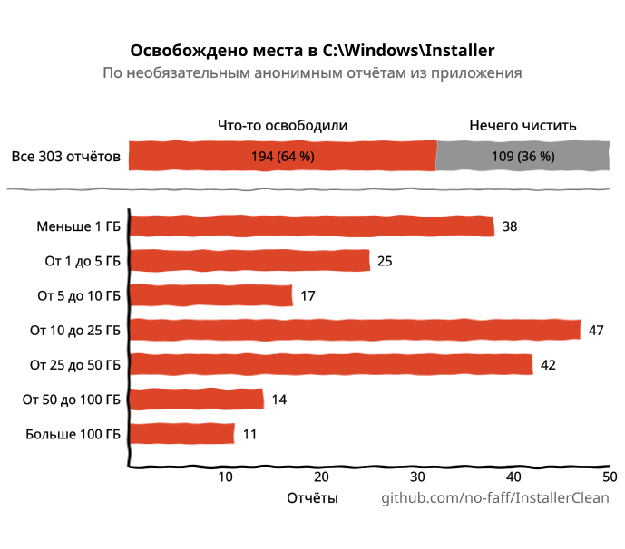
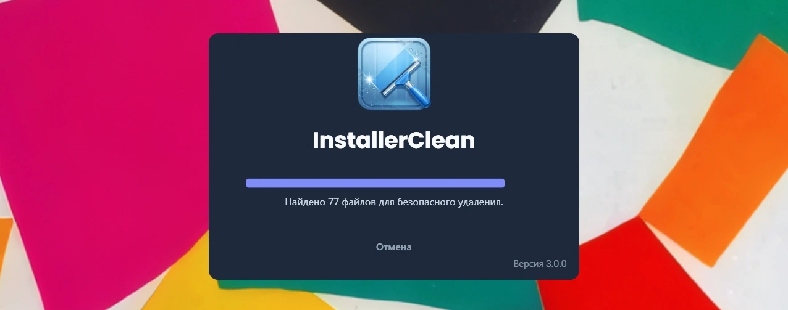
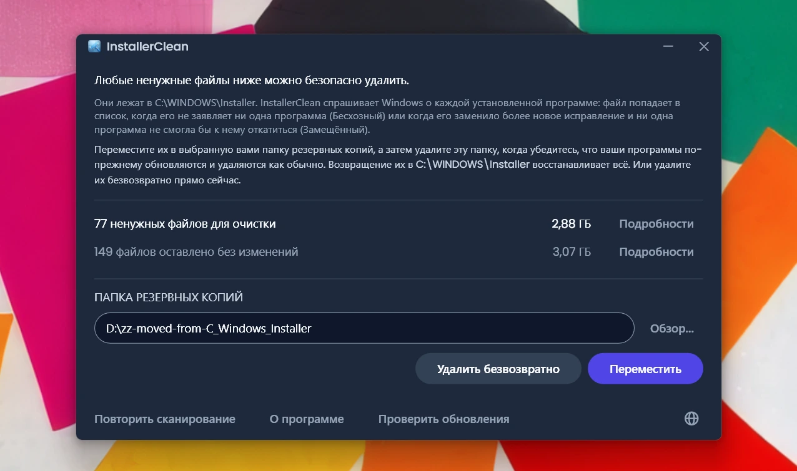
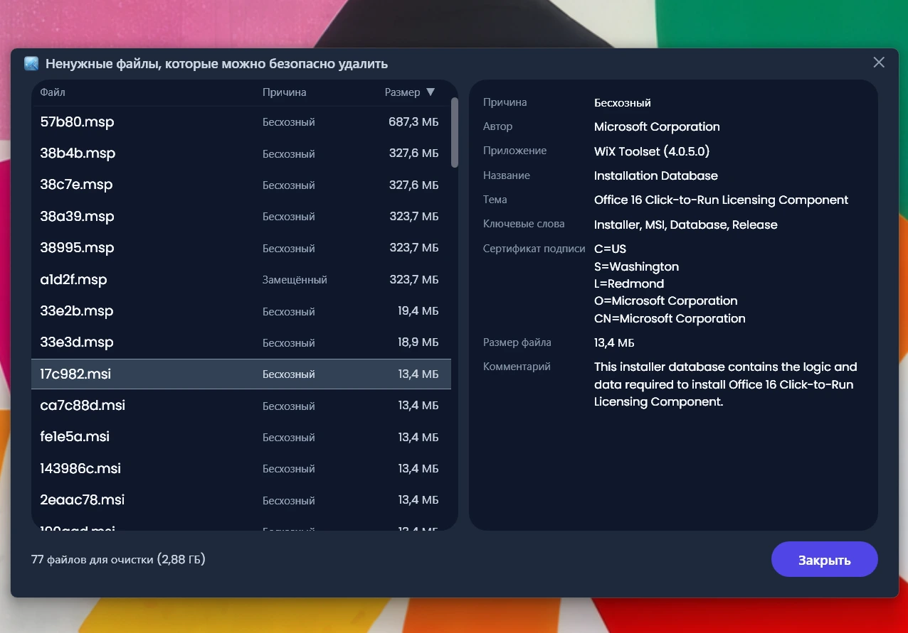
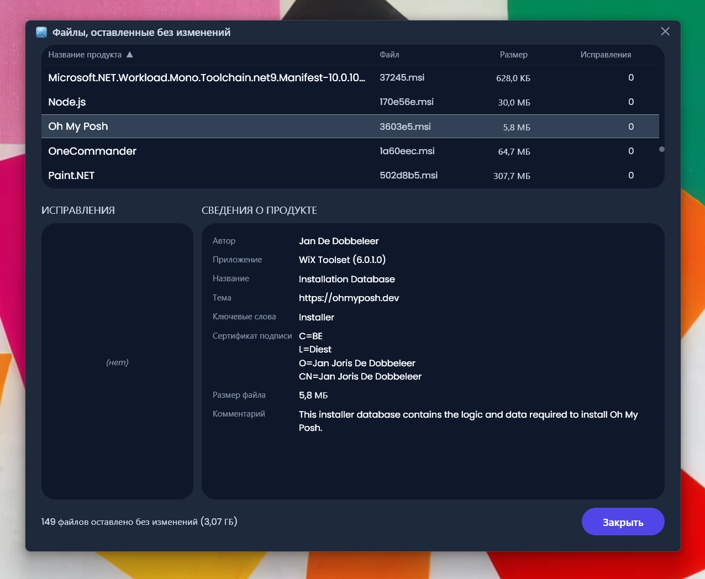
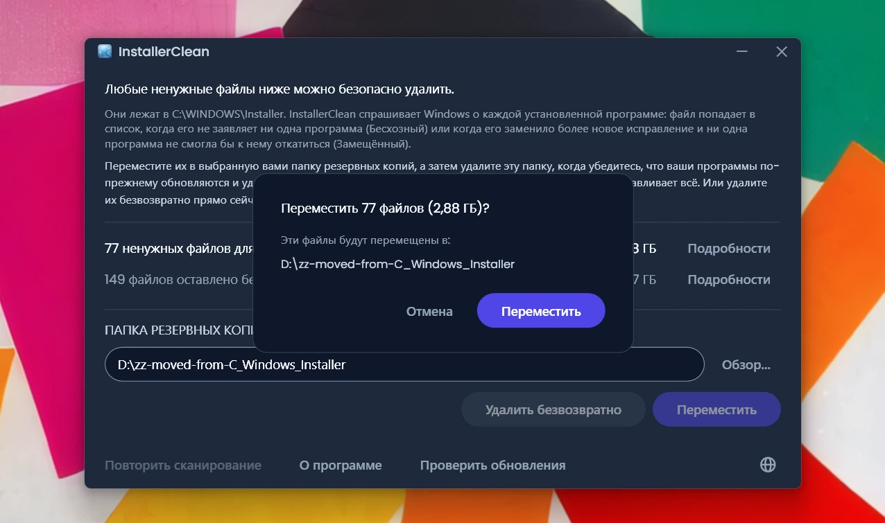
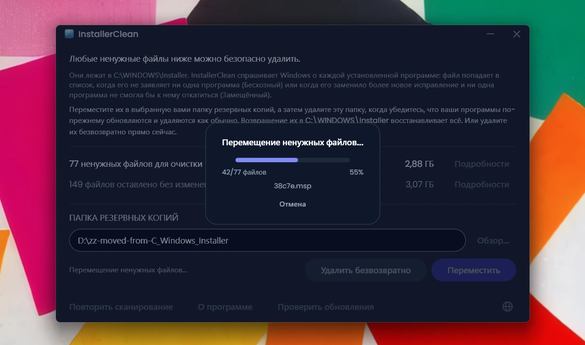
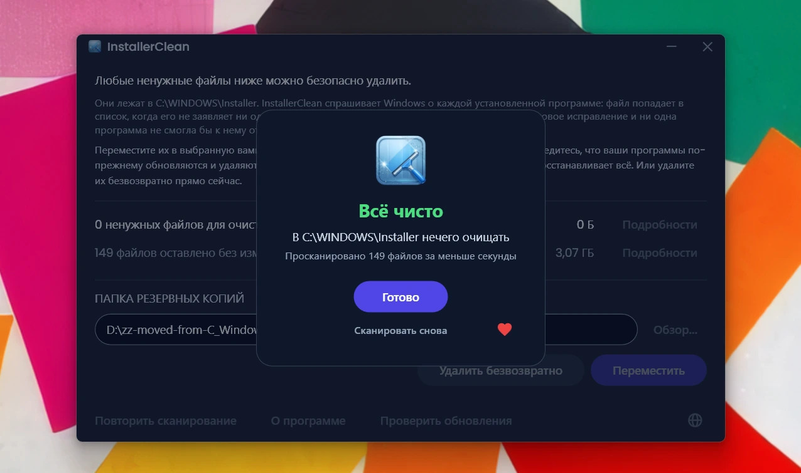

<p align="center">
  <a href="README.md">English</a> · <a href="README.zh-CN.md">简体中文</a> · <strong>Русский</strong> · <a href="README.es.md">Español</a> · <a href="README.ar.md">العربية</a> · <a href="README.ja.md">日本語</a> · <a href="README.pt-BR.md">Português (BR)</a> · <a href="README.pl.md">Polski</a> · <a href="README.tr.md">Türkçe</a> · <a href="README.ko.md">한국어</a> · <a href="README.fr.md">Français</a> · <a href="README.it.md">Italiano</a> · <a href="README.de.md">Deutsch</a> · <a href="README.id.md">Bahasa Indonesia</a> · <a href="README.vi.md">Tiếng Việt</a> · <a href="README.uk.md">Українська</a> · <a href="README.nl.md">Nederlands</a>
</p>

<p align="center">
  
</p>

<p align="center"><em>🎶 What's my line? I'm happy <a href="https://www.youtube.com/watch?v=HM-jHhUZfFI">cleaning Windows</a></em></p>

<h1 align="center">InstallerClean</h1>

<p align="center"><strong>Инструмент с открытым исходным кодом для безопасной очистки <code>C:\Windows\Installer</code> — скрытой папки Windows, которая незаметно съедает место на диске.</strong></p>

<p align="center"><em>Запускайте раз в кои-то веки. Может, освободите немного места. Идите дальше, налегке.</em></p>

<p align="center">
  <a href="LICENSE"></a>
  <a href="https://dotnet.microsoft.com/download/dotnet/10.0"></a>
  <a href="https://github.com/no-faff/InstallerClean/actions/workflows/ci.yml"></a>
  <a href="https://github.com/no-faff/InstallerClean/releases"></a>
  <a href="https://github.com/no-faff/InstallerClean/releases/latest"></a>
  <a href="https://github.com/no-faff/InstallerClean/releases"></a>
</p>

<a id="reports-stats"></a>

<!-- reports-stats-start chart-only (generated; do not hand-edit between these markers) -->
<p align="center">
  <picture>
    <source media="(prefers-color-scheme: dark)" srcset="docs/reports-ru-dark.svg" />
    <source media="(prefers-color-scheme: light)" srcset="docs/reports-ru-light.svg" />
    
  </picture>
</p>
<!-- reports-stats-end -->

- **Что это:** InstallerClean делает одно дело: убирает ненужные файлы из `C:\Windows\Installer` — скрытой папки, которая наполняется по мере того, как вы устанавливаете и обновляете программы. После быстрого сканирования он говорит, есть ли у вас такие файлы, показывает подробности для любопытных и позволяет переместить их в другое место или удалить, чтобы освободить место на диске C:.
- **Возможно, вы здесь вот почему:** вы пользовались [WinDirStat](https://github.com/windirstat/windirstat), WizTree или TreeSize, увидели, что `C:\Windows\Installer` занимает много места, и не знали, что там внутри. Тогда InstallerClean — как раз то, что вам нужно. Он знает, что содержится в этих файлах со случайными на вид именами вроде `9f05cba.msi`, и быстро подскажет, какие из них можно безопасно убрать.
- **Сколько места:** На диаграмме выше — результаты необязательных отчётов, которые понемногу приходят с версии v1.8.0. (Спасибо всем, кто нажал эту кнопку. Без вас этой диаграммы не было бы.) Среди тех <!-- reports-freedpct-start -->64 %<!-- reports-freedpct-end -->, у которых место освободилось, медиана освобождённого — <!-- reports-median-start -->15,8 ГБ<!-- reports-median-end -->. <!-- reports-biggest-start -->На одной машине освободилось аж 464 ГБ.<!-- reports-biggest-end --> Остальные <!-- reports-nothingpct-start -->36 %<!-- reports-nothingpct-end --> не освободили ничего, так что всё зависит от машины: на чистой установке Windows 11 без лишних программ убирать нечего. Больше всего ненужных файлов набирается на машинах, которые работают годами, на всём, где стоят тяжёлые программы на основе MSI (Acrobat, Office, LibreOffice, крупные средства разработки), и у тех, кто много ставит и удаляет программ. Точную цифру вы увидите сразу, как только запустите InstallerClean.
- **Это безопасно:** Да. InstallerClean трогает только файлы в `C:\Windows\Installer`. Он спрашивает у Windows Installer, что ещё нужно, и читает те же записи ещё и из реестра. Файл попадает в список, только когда его на машине ничто не заявляет или когда его заменило более новое исправление и ни одна программа здесь не смогла бы вернуться к старому. Всё, о чём InstallerClean не может получить внятного ответа, он придерживает. [Подробнее ниже](#как-это-работает).
- **Ничего о вас:** Открытый исходный код (Apache 2.0). Ни учётной записи, ни рекламы, ни слежки, ни телеметрии, ничего работающего в фоне. В сети по своей инициативе InstallerClean делает только одно: при запуске проверяет на GitHub, нет ли более новой версии, и это можно отключить.
- **Как получить:** [Скачайте последнюю версию](../../releases/latest). Запустите; согласитесь с [предупреждением, которое покажет Windows](#unknown-publisher), и с [запросом прав администратора](#admin). Переместите или удалите то, что нашёл InstallerClean. Готово.

## Содержание

- [Папка, о которой вам никто не рассказывает](#папка-о-которой-вам-никто-не-рассказывает)
- [В поисках помощи](#в-поисках-помощи)
- [Что делает InstallerClean](#что-делает-installerclean)
- [Скриншоты](#скриншоты)
- [Как это работает](#как-это-работает)
- [Загрузка](#загрузка)
  - [Как проверить сам скачанный файл](#как-проверить-сам-скачанный-файл)
- [Частые вопросы](#частые-вопросы)
- [Командная строка](#командная-строка)
- [Доступность](#доступность)
- [Политика подписи кода](#политика-подписи-кода)
- [Конфиденциальность](#конфиденциальность)
- [Чего он не делает](#чего-он-не-делает)
- [Альтернативы](#альтернативы)
- [Если из C:\Windows\Installer всё-таки пропал файл](#recovery)
- [Требования](#требования)
- [Сборка из исходного кода](#сборка-из-исходного-кода)
- [Участие в разработке](#участие-в-разработке)
- [Поддержать проект](#поддержать-проект)
- [История звёзд](#история-звёзд)
- [Лицензия](#лицензия)

---

## Папка, о которой вам никто не рассказывает

На каждом компьютере с Windows есть скрытая папка `C:\Windows\Installer`. Каждый раз, когда вы устанавливаете программу, использующую систему Windows Installer, или ставите исправление для Microsoft Office, Adobe Acrobat, Visual Studio или любого другого приложения на основе `.msi`, копия этого установщика или файла исправления `.msp` попадает в эту папку — и остаётся там.

Когда новое исправление приходит на смену старому, остаются оба. Остаются и установщики программ, которые вы удалили давным-давно. «Очистка диска» не трогает ничего из этого, и «Контроль памяти» тоже. DISM работает совсем с другой папкой. Со временем папка растёт: 1 ГБ, 5 ГБ, 20 ГБ, 50 ГБ. На машинах с обилием программ, использующих MSI (Acrobat — частый виновник), она может [перевалить за 100 ГБ](https://www.reddit.com/r/sysadmin/comments/1oxcrmh/acrobat_filling_up_the_cwindowsinstaller_folder/).

Это не временные файлы, которые возвращаются сами собой. Это настоящий балласт: старые установщики программ, удалённых много лет назад, и исправления, которые успели сменить друг друга уже по нескольку раз. Стоит их убрать — и обратно они уже не вернутся.

**Если вы ищете простой способ освободить место на диске в Windows, эта папка — хорошее начало.** InstallerClean находит ненужные файлы и безопасно их убирает.

## В поисках помощи

Если вы когда-нибудь искали помощь по этой папке, то, наверное, знаете, как это бывает. Кто-то с 180 ГБ в `C:\Windows\Installer` спрашивает, как её очистить. Ему [советуют запустить «Очистку диска»](https://learn.microsoft.com/en-us/answers/questions/4238108/windows-installer-folder-has-occupied-180gb). Он пробует. Очищается 600 МБ, и ни байта из той самой папки (потому что «Очистка диска» не трогает `C:\Windows\Installer`). И на этом обсуждение замирает.

> *«Во всех ветках, которые мне попадались, обычно советуют одно и то же, и это не решает проблему, а потом обсуждение глохнет.»*
>
> [ksparks519, r/Windows10](https://www.reddit.com/r/Windows10/comments/1bt8c5p/anyone_ever_figure_out_giant_installer_folders/) (перевод с английского)

Или же ему советуют вообще её не трогать. В одной из веток человеку с папкой Installer на 60 ГБ ответили: [«не трогай её»](https://www.reddit.com/r/techsupport/comments/1hw4suq/my_windows_installer_folder_is_like_60gb_so_i/). Когда он спросил, что же тогда делать, ответ был: *«Я же только что сказал».*

Стандартный совет путает две разные вещи. Если удалять файлы наугад, вы больше не сможете обновить или удалить те программы, которым эти файлы принадлежали. Если убирать только те файлы, которых не заявляет ничто на машине или которые Windows записала как заменённые, — сможете. InstallerClean занимается вторым.

## Что делает InstallerClean

1. **Сканирует** `C:\Windows\Installer` в поисках файлов `.msi` и `.msp`
2. **Спрашивает** у Windows Installer, что ещё нужно, и читает те же записи ещё и из реестра
3. **Придерживает** всё, о чём два чтения не могут договориться между собой
4. **Показывает, сколько можно освободить** и сколько остаётся без изменений, с необязательными окнами подробностей, где перечислен каждый файл
5. **Убирает ненужные файлы**: перемещает их в выбранную вами папку резервных копий или удаляет безвозвратно

## Скриншоты

<p>
  <br>
  <em>Первичное сканирование. Проходит очень быстро.</em>
  <br><br>
</p>

<p>
  <br>
  <em>Результаты: сколько можно убрать и сколько оставлено без изменений.</em>
  <br><br>
</p>

<p>
  <br>
  <em>Подробности о файлах, которые можно убрать: почему каждый из них не нужен и что файл сообщает о себе.</em>
  <br><br>
</p>

<p>
  <br>
  <em>Подробности о файлах, оставленных без изменений: программа, которой, по данным Windows, принадлежит каждый из них, и что файл сообщает о себе.</em>
  <br><br>
</p>

<p>
  <br>
  <em>Подтверждение перед любым из двух действий. Перемещение складывает файлы в выбранную вами папку резервных копий. Или удалите файлы безвозвратно.</em>
  <br><br>
</p>

<p>
  <br>
  <em>Перемещение в процессе. На тот же диск оно мгновенно. На другой диск — чем больше гигабайт, тем дольше.</em>
  <br><br>
</p>

<p>
  <br>
  <em>Готово. Место возвращено. Файлы лежат в резервной копии, пока вы не убедитесь, что всё в порядке. После этого удалите папку резервных копий.</em>
  <br><br>
</p>

<p>
  <br>
  <em>После повторного сканирования. Очищать больше нечего.</em>
  <br><br>
</p>

<a id="is-it-safe"></a>
## Как это работает

Когда Windows Installer устанавливает программу, он оставляет копию установщика в `C:\Windows\Installer`, а когда за программой регистрируется исправление, он точно так же оставляет его копию. Именно с этих копий Windows Installer и работает, когда позже восстанавливает, обновляет или удаляет программу, поэтому они и лежат там ещё долго после того, как установка закончилась. В папку попадают копии обоих видов: установщики `.msi` и исправления `.msp`, причём последние обновляют уже установленную у вас программу, а не заменяют её.

Файл попадает в список по одной из двух причин.

**Бесхозный** значит, что этого файла не заявляет ничто на машине. Его не называет ни один установленный продукт и ни одно зарегистрированное исправление.

**Замещённый** значит, что Windows записала, что это исправление заменено более новым, и всё равно сохранила файл. Исправление удаляется, только когда удалены все программы, за которыми оно зарегистрировано, или когда его сняли со всех них. Замена более новым — ни то и ни другое, поэтому файл остаётся. Adobe Acrobat в Windows устроен именно так: его обновления приходят как исправления к базовой установке, а не как новые установщики, поэтому на машине, где он стоит давно, таких исправлений может лежать несколько.

К этим двум InstallerClean идёт с противоположных сторон, и только в первом случае он вообще заглядывает в саму папку.

**Список файлов в папке.** InstallerClean перечисляет файлы `.msi` и `.msp`, лежащие непосредственно в `C:\Windows\Installer`. В подпапки он не заходит.

**Чтение записей, дважды.** InstallerClean запрашивает у Windows Installer каждый установленный продукт и каждое зарегистрированное исправление, а для каждого из них — названный им файл в кэше; делается это вызовами API Windows Installer в `msi.dll`. Затем InstallerClean читает те же записи вторым способом, прямо из реестра, потому что запрос может вернуться неполным и не сказать об этом: Windows выдаёт записи по одной, пока не сообщит, что больше их нет, и проход, остановившийся на третьей записи из двухсот, выглядит в точности как дошедший до конца. Раздел реестра выдаёт весь свой список имён разом, поэтому неполный список не может выглядеть полным. Каждый продукт, который реестр назвал, а запрос пропустил, затем возвращается к Windows по имени, по одному. Это второе чтение способно только перевести файл на сторону «ещё нужен». Пути, которым оно добавило бы файл в список на удаление, не существует.

**Сопоставление записи с её файлом.** Запись называет свой файл в кэше как путь, и одна и та же папка не всегда записана одинаково в разных записях. Поэтому InstallerClean не доверяет написанию, а спрашивает у Windows, куда на самом деле ведёт каждый записанный путь, и сверяет это со списком файлов, который он составил по папке. Всё, что осталось незаявленным, проходит вторую сверку, которая вообще не идёт через имена: приложение открывает файл и просит Windows его опознать, чтобы два разных имени одного и того же файла были узнаны как один файл.

**Записи, которые не удалось сопоставить.** Если Windows не говорит, куда ведёт записанный путь, или файл в конце такого пути не удаётся опознать, InstallerClean не знает, о каком файле была эта запись, и им мог бы оказаться любой из перечисленных файлов. То же самое, если программа могла быть установлена больше одного раза: тогда он не может сказать, какой файл в кэше какой копии принадлежит. В любом из этих случаев он не предлагает ничего из того, что нашёл в папке в этот раз. Запись, ведущая на файл, которого уже нет, — другое дело: иметь в виду ей больше нечего, поэтому она не может относиться ни к одному из файлов, которые ещё лежат в папке.

**Вопрос с другого конца.** Бесхозность определяется отсутствием, а отсутствие может означать и то, что приложение не нашло запись. Поэтому, прежде чем предложить установщик `.msi`, InstallerClean открывает файл, читает код продукта, который файл несёт в себе, и спрашивает у Windows, установлен ли этот продукт. Если установлен — файл остаётся, что бы ни нашло остальное сканирование. Эта проверка способна только убрать файл из списка. Никакой её ответ не может файл туда добавить.

**Что решает судьбу исправления `.msp`.** Исправление не открывают, чтобы спросить у него, какой программе оно принадлежит. Решает другое: регистрация исправления называет свой файл в кэше в двух местах — среди исправлений, зарегистрированных за каждым продуктом, и в одном общем списке реестра, где перечислены все регистрации исправлений на машине. Исправление попадает в список как бесхозное, только когда ни то ни другое не называет его файл в кэше.

**Чем отличается замещённое исправление.** Ничего из перечисленного к нему не применяется, потому что оно не из числа незаявленных файлов. У Windows есть запись о нём, и именно эта запись говорит, что оно заменено. Риск здесь другой: исправление может быть зарегистрировано за несколькими программами, а закончила с ним только одна. Поэтому замещённое исправление попадает в список, только когда Windows записала, что удалить его нельзя, когда опрошена каждая программа, за которой оно зарегистрировано, когда ни у одной из них оно больше не применено и когда ни одна из них не держит исправления, которое, по данным Windows, удалить можно. Последнее условие здесь потому, что отмена исправления на программе может потянуться за старым файлом. Если хоть на что-то из этого ответа нет, файл остаётся.

<details>
<summary>Какие вызовы Windows Installer здесь используются</summary>

- `MsiEnumProductsEx` — чтобы перечислить все установленные продукты, и он же с одним кодом продукта — чтобы спросить, установлен ли этот конкретный продукт
- `MsiEnumPatchesEx` — чтобы перечислить зарегистрированные исправления, и по каждому продукту, и по всей машине
- `MsiGetProductInfoEx` — чтобы прочитать имя продукта, названный им файл в кэше и то, не одна ли это из нескольких установок одного и того же продукта
- `MsiGetPatchInfoEx` — чтобы прочитать состояние исправления, может ли Windows его удалить и какой файл в кэше называет само исправление
- `MsiGetSummaryInformation` и `MsiSummaryInfoGetProperty` — чтобы прочитать из файла исправления, к каким программам его можно применить
- `MsiOpenDatabase`, `MsiDatabaseOpenView`, `MsiViewExecute`, `MsiViewFetch` и `MsiRecordGetString` — чтобы прочитать из файла установщика объявленный в нём код продукта

</details>

При всём сказанном приложение советует переместить файлы в папку резервных копий (на другой диск или раздел, если вы хотите освободить место на C). Так у вас будет возможность убедиться, что всё действительно в порядке, прежде чем окончательно удалить ненужные файлы.

## Загрузка

Три сборки на выбор:

- **Portable** (`InstallerClean-3.0.0-portable.exe`): один файл со средой выполнения .NET 10 внутри. Без установки, без деинсталлятора: щёлкните дважды — и он запустится. Сохраните файл на следующий раз или удалите, когда закончите.
- **Setup** (`InstallerClean-3.0.0-setup.exe`): обычный установщик Windows со встроенной средой выполнения .NET 10. Добавляет пункт в меню «Пуск» и аккуратно удаляется. Лежит среди установленных программ, так что его легко найти и через полгода — или запускать чаще, если вы много ставите и удаляете программ.
- **CLI** (`installerclean-cli.exe`): только версия для командной строки, один файл со средой выполнения внутри. Без установки, без деинсталлятора. Закиньте его на клиентскую машину, запустите сканирование или очистку, удалите. Создан для скриптов, запланированных задач и массового развёртывания — когда нужны сами операции, но без настольного приложения на клиенте. Аргументы и коды выхода см. в разделе [Командная строка](#командная-строка).

С версии 2.2.0 в именах файлов установщика и портативной сборки есть номер версии, так что скачанная копия всегда говорит, что она такое; у консольного инструмента остаётся простое имя `installerclean-cli.exe`, чтобы запланированные задачи и скрипты, которые на него ссылаются, продолжали работать после обновлений.

Скачайте со [страницы выпусков](../../releases/latest), затем запустите. Приложение не подписано, поэтому Windows показывает предупреждение о «неизвестном издателе»; в разделе [Частые вопросы](#unknown-publisher) объясняется, что вы увидите и почему это безопасно.

Приложение сканирует автоматически при запуске. Просмотрите результаты и нажмите **Переместить** или **Удалить безвозвратно**.

Или установите через [winget](https://learn.microsoft.com/windows/package-manager/winget/):

```
winget install NoFaff.InstallerClean
```

Или установите через [Scoop](https://scoop.sh):

```
scoop install installerclean
```

### Как проверить сам скачанный файл

InstallerClean не подписан. Вот что можно проверить, прежде чем его запускать:

- Хеш SHA-256 каждой загрузки есть на странице её выпуска.
- VirusTotal: каждая сборка сканируется перед выпуском, и на странице выпуска есть полный результат по каждому движку для каждой загрузки.
- Исходный код здесь, на [github.com/no-faff/InstallerClean](https://github.com/no-faff/InstallerClean). Службы сканирования, запросов, перемещения, удаления, настроек и проверки отложенной перезагрузки покрыты набором автоматических тестов, который выполняется на Windows при каждой отправке в `main` и при каждом пул-реквесте, а значок CI вверху этой страницы показывает результат.
- Сборки выпусков детерминированы: одни и те же исходники, тот же SDK и те же флаги публикации дают одни и те же байты, а поставить тег на выпуск нельзя, пока все входные данные сборки не совпадают с исходным кодом на этом теге. Так что вы можете переключиться на тег, собрать всё сами и сверить хеши с опубликованными. В примечаниях к каждому выпуску есть всё, что для этого нужно: версия SDK, с которой собран выпуск, и флаги публикации для любой загрузки, собранной не со значениями по умолчанию. Исключение — установщик: его компилирует Inno Setup, а не SDK, и год сборки установщик вписывает в себя сам, поэтому для воспроизведения его хеша нужны ещё и та же версия Inno, и тот же календарный год.
- <!-- downloads-start -->81 000+<!-- downloads-end --> загрузок на GitHub, MajorGeeks и Softpedia.
- [MajorGeeks](https://www.majorgeeks.com/files/details/installerclean.html) тестирует каждую присланную сборку в виртуальной машине и публикует её, только если она прошла их проверку.<br><a href="https://www.majorgeeks.com/files/details/installerclean.html"></a>
- [Softpedia](https://www.softpedia.com/get/System/Hard-Disk-Utils/InstallerClean.shtml) проверила InstallerClean и подтвердила, что в нём нет ни шпионского, ни рекламного ПО, ни вирусов.<br><a href="https://www.softpedia.com/get/System/Hard-Disk-Utils/InstallerClean.shtml"></a>

## Частые вопросы

<a id="admin"></a>

**Почему он требует прав администратора?** По двум причинам. Папка `C:\Windows\Installer` закрыта для всех, кроме администраторов, поэтому эти права нужны и чтобы её прочитать, и чтобы опросить Windows Installer, и чтобы перемещать или удалять файлы. И администратор может спросить Windows о программах, установленных под любой учётной записью на машине, а пользователь без прав администратора — нет: без этих прав Windows сказала бы, что программа не установлена, хотя она установлена, и сказала бы это внутри той самой проверки, которая решает, нужен ли ещё файл.

<a id="unknown-publisher"></a>

**Почему Windows пишет «Неизвестный издатель»?** InstallerClean не подписан сертификатом, а Windows помечает файлы, скачанные из интернета, поэтому при первом запуске SmartScreen обычно показывает «Система Windows защитила ваш компьютер», а издатель значится как неизвестный. Платный сертификат для подписи стоит денег каждый год, и я предпочитаю, чтобы приложение оставалось бесплатным, а не платить за такой сертификат, поэтому я подал заявку в SignPath Foundation, которые подписывают открытое программное обеспечение бесплатно, — и InstallerClean приняли (см. [Политику подписи кода](#политика-подписи-кода)). Сертификат ещё не выдан, так что пока нажмите **Подробнее**, затем **Выполнить в любом случае**. Это безопасно: исходный код открыт, а у каждого выпуска есть ссылки на VirusTotal и хеши SHA-256, которые можно проверить заранее.

**Работает ли он на Windows 7 или 8?** Нет. Нужна Windows 10 версии 1607 или новее — это самая старая сборка, которую поддерживает среда выполнения .NET 10. Установщик откажется ставиться на что-либо более старое, а портативная сборка не запустится.

## Командная строка

`installerclean-cli.exe` — отдельный консольный исполняемый файл, который ставится рядом с графическим интерфейсом. То же сканирование, то же перемещение, то же удаление, только без окна. Он занимает командную строку до самого конца работы, так что скрипт или запланированная задача могут его дождаться.

### Флаги

| Флаг | Что он делает | Также принимает |
|---|---|---|
| `/s` | Только сканирование. Перечисляет то, что было бы убрано, с именем, размером и причиной для каждого файла. Ничего не меняет. | |
| `/d` | Сканирует, затем удаляет ненужные файлы безвозвратно. | |
| `/m` | Сканирует, затем перемещает их в папку, сохранённую в графическом интерфейсе. | |
| `/m ПУТЬ` | Сканирует, затем перемещает их в `ПУТЬ`. Возьмите его в кавычки, если в нём есть пробел. | |
| `--help` | Выводит справку и завершается с кодом `0`. | `/?`, `-h` |
| `--version` | Выводит версию и завершается с кодом `0`. | `-v` |

Регистр во флагах не важен, так что `/S` и `/D` работают наравне с `/s` и `/d`. За один запуск — только один флаг: комбинировать их нельзя, а после `/s` и `/d` ничего не ставится.

Запущенный без аргументов, инструмент выводит справку и завершается с кодом `1`, так что запланированная задача, потерявшая свой флаг, завершится с заметной ошибкой, а не сделает тихо ничего. Нераспознанный флаг даёт строку с ошибкой, затем справку и тот же код `1`. Путь перемещения с пробелом, не взятый в кавычки, так же отклоняется, а не обрезается молча, и в сообщении сказано, что его нужно взять в кавычки.

### Коды выхода

Это те коды, которые сам инструмент описывает в `--help`:

| Код | Значит |
|---|---|
| `0` | Успех. Запуск сделал то, о чём его просили, и ничего не сорвалось. |
| `1` | Ничего не обработано. Запуск не удался или был отклонён. |
| `2` | Частично. Что-то обработано, что-то нет, включая Ctrl+C посреди работы. |
| `75` | Временное состояние. Запуску помешало временное условие; в выведенном сообщении сказано, какое. |
| `130` | Отменено по Ctrl+C до того, как было обработано хоть что-нибудь. |

`1` покрывает и отказ, и сбой, а отказ — это не неисправность: и папка назначения, на которой просто кончилось место, и значение реестра, которое приложение не смогло прочитать, ещё ничего не тронув, дают именно этот код. `0` значит, что ничего не сорвалось, а не что ничего не осталось: `--help`, `--version` и запуск с одним сканированием завершаются с кодом `0` независимо от того, нашло сканирование шестьдесят восемь файлов или ни одного.

### Журнал событий

Каждый запуск оставляет в журнале приложений запись о результате и может добавить рядом одно или несколько уведомлений. Код события — устойчивый машинный контракт, поэтому RMM-система может фильтровать по номеру, не разбирая текст:

| Код | Значит |
|---|---|
| `1000` | Успех |
| `1002` | Частично |
| `2000` | Пропущено, временное состояние |
| `4000` | Серьёзный сбой |
| `3000` | Уведомление: сканирование охватило не все установленные программы |
| `3001` | Уведомление: в папке нет файлов, которые Windows там ожидает |
| `3002` | Уведомление: файлы были придержаны, а не предложены |

Диапазон `3000` — это уведомление, а не итог, и результатом запуска он не считается. Тип записи — «Сведения», когда с запуском ничего не случилось, и «Предупреждение», когда случилось. **Журнал событий всегда на английском**, каким бы ни был язык интерфейса машины, так что поиск по известной фразе имеет устойчивую цель. Переведена именно консоль: она следует языку самой машины, а размеры и даты пишет по её региону.

### Рецепты

Аудит в файл, ничего не меняя:

```
installerclean-cli /s > audit.txt
```

Ежемесячное перемещение в `D:\InstallerBackup`, когда CLI лежит в `C:\Tools`:

```
schtasks /create /tn "InstallerClean monthly" /tr "C:\Tools\installerclean-cli.exe /m D:\InstallerBackup" /sc monthly /ru SYSTEM /rl highest
```

Задание ждёт завершения запуска и записывает код выхода как «Результат последнего запуска», так что RMM-система может опираться на приведённые выше коды.

Из PowerShell:

```powershell
& 'C:\Tools\installerclean-cli.exe' /m D:\InstallerBackup
switch ($LASTEXITCODE) {
    0       { 'Чисто' }
    2       { 'Частично, проверьте вывод' }
    75      { 'Заблокировано, повторите позже' }
    default { "Сбой ($LASTEXITCODE)" }
}
```

### Прежде чем писать скрипт

- **Нужны повышенные права.** Всему, `/s` включительно. Из командной строки без повышения Windows откажется его запускать и вернёт вашей оболочке `740`.
- **Папка, сохранённая в графическом интерфейсе, хранится отдельно для каждого пользователя.** Задача, работающая от имени SYSTEM или учётной записи службы, эту папку не увидит, поэтому таким запускам нужно передавать `/m ПУТЬ`.
- **В сеть SYSTEM выходит под учётной записью компьютера**, поэтому папке назначения вида `\\server\share` нужно дать права именно этой учётной записи.
- **`/s` никогда не блокирует.** Он только читает и не берёт блокировку, так что сканировать можно и при открытом настольном приложении. `/d` и `/m` берут блокировку на всю машину и завершаются с кодом `75`, если эту блокировку держит другой запуск InstallerClean.
- **Всё идёт в stdout**, ошибки в том числе; отдельного stderr нет. Опирайтесь на код выхода, а не на разбор текста.
- **Перемещение отказывается, а не переименовывает.** Если в папке назначения уже лежит файл с таким именем, этот файл остаётся в кэше и называется в выводе, а остальная партия всё равно перемещается. Запуск, где такое совпадение имён случилось со всеми файлами до одного, не обрабатывает ничего и завершается с кодом `1`.
- **Папку резервных копий никто не очищает.** `/m` только добавляет. Разбирать её придётся вам.
- **`taskkill /pid` — это не корректная отмена.** Блокировку единственного экземпляра восстановит следующий запуск.
- **Первый запуск регистрирует источник журнала событий**, в `HKLM\SYSTEM\CurrentControlSet\Services\EventLog\Application\InstallerClean`. Оставьте его на месте: «Просмотр событий» читает описание записи через её источник, поэтому, если его убрать, каждая уже записанная инструментом запись превратится в ошибку о неизвестном источнике.

### Почему `installerclean-cli`, а не `installerclean.exe`

`InstallerClean.exe` — это окно, и аргументы командной строки он не читает. `installerclean-cli.exe` — настоящий консольный процесс, поэтому он занимает командную строку до конца работы, а его вывод перенаправляется и передаётся по конвейеру, как у любой другой программы. Установщик ставит оба. В портативной загрузке только графический интерфейс; если вам нужна командная строка без окна, скачайте `installerclean-cli.exe` отдельно со [страницы выпусков](../../releases/latest).

## Доступность

InstallerClean сделан так, чтобы им можно было полноценно пользоваться с клавиатуры и с программой чтения с экрана.

- **Полностью управляется с клавиатуры.** Всё, что делает приложение, достижимо с клавиатуры, и столбцы в окнах подробностей сортируются с неё же, так что мышь здесь нигде не нужна. Кнопки в заголовке окна ведут себя как обычные кнопки Windows, и до них можно добраться через Alt+Space или Alt+F4. Фокус клавиатуры остаётся видимым, куда бы он ни попал.
- **«Экранный диктор» и «Голосовой доступ».** У каждого элемента управления есть метка, и слово, написанное на кнопке, — то же самое слово, которым она активируется голосом. Когда перемещение или удаление завершается, результат зачитывается вслух.
- **Рассчитано на чтение.** Текст во всей тёмной теме соответствует уровню контраста WCAG AA.

Если что-то здесь вам мешает, [откройте issue](../../issues). Проблемы доступности — это баги, а не редкие пограничные случаи.

## Политика подписи кода

InstallerClean принят в [SignPath Foundation](https://signpath.org) на бесплатную подпись кода. Это программа, которая подписывает открытое программное обеспечение, чтобы оно перестало приходить на ваш компьютер от неизвестного издателя. Сам сертификат пока не выдан, поэтому загрузки здесь сегодня не подписаны и Windows будет о них предупреждать.

Когда его выдадут, каждый выпуск будет нести строку, которую просит указывать SignPath: free code signing provided by SignPath.io, certificate by SignPath Foundation. Сертификат принадлежит фонду, а не мне: сертификат обязан быть выдан юридическому лицу, а проект одного человека таковым не является. Это не значит, что InstallerClean принадлежит им или что они как-то участвуют в нём помимо подписи.

**Роли.** У InstallerClean один сопровождающий. Коммитеры и рецензенты, то есть кто может добавлять код в проект, — это я. Утверждающие, то есть кто может разрешить подписать выпуск, — это я.

## Конфиденциальность

Необязательный отчёт — единственное, что вообще что-либо сообщает о запуске, и уходит он, только когда вы нажмёте кнопку. В нём сказано, что нашло сканирование, что оно придержало и почему, переместили вы файлы или удалили, сколько это освободило, сколько заняло времени и что не удалось, а вместе с этим — версия приложения, язык, на котором вы его читаете, и версия вашей Windows. Ни имён файлов, ни имён папок, ни имени учётной записи, ничего, что опознавало бы вашу машину, и ничего, по чему можно было бы связать два отчёта между собой. Так я и узнаю, работает ли приложение и что оно придерживает, на машинах кроме своей.

Ни рекламы, ни телеметрии. Кроме этого приложение выходит в сеть только за проверкой версии при запуске (один запрос к GitHub, его можно отключить в окне «О программе») и по кнопкам со ссылками на GitHub и на страницу, где можно сделать пожертвование, если вам того захочется. Полная [политика конфиденциальности](PRIVACY.md) (на английском).

## Чего он не делает

- WinSxS (`C:\Windows\WinSxS`) — другая папка с другими правилами. Для неё запустите `Dism /Online /Cleanup-Image /StartComponentCleanup` из командной строки с повышенными правами.
- Никакой фоновой службы, никакого запланированного задания, никакой автоочистки. Приложение работает тогда, когда вы его запускаете.
- InstallerClean не меняет ни установленные программы, ни базу данных Windows Installer, а только читает их. Единственное, что он вообще записывает в реестр, — разовая регистрация источника событий, которая нужна инструменту командной строки, чтобы его запуски появлялись в журнале событий Windows.
- Сам, по своей инициативе, InstallerClean устанавливает соединение только одного рода: при запуске быстро смотрит на странице выпусков GitHub, нет ли более новой версии, и это можно отключить в окне «О программе». Всё остальное происходит, только когда вы сами этого захотите: необязательный анонимный отчёт (цифры о запуске, ничего, что называло бы вас или ваши файлы) и ссылки на документацию на GitHub и на страницу пожертвований, которые открываются в браузере, если вы по ним нажмёте. Сам он ничего не скачивает.
- Ни панелей инструментов, ни стороннего ПО в комплекте, ни рекламы.

## Альтернативы

Если вы уже искали что-то по этой папке, то, скорее всего, наткнулись на [PatchCleaner](https://www.homedev.com.au/free/patchcleaner). Он делал эту работу первым, делал её десять лет до того, как появился InstallerClean, и работает по сей день, а без него InstallerClean бы не было.

Я сделал InstallerClean потому, что у PatchCleaner закрытый исходный код, сам он не обновлялся с марта 2016 года и по умолчанию исключает файлы Adobe. У этого исключения есть веская причина, и в HomeDev прямо написали о ней в примечаниях к выпуску того времени:

> *«В предыдущих версиях есть известная проблема: PatchCleaner ошибочно определяет исправления Adobe Acrobat Reader как ненужные. Adobe делает со своим автоматическим обновлением нечто своё, и из-за этого, если PatchCleaner уберёт „бесхозные“ исправления из каталога installer, автоматические обновления Adobe Reader перестанут успешно устанавливаться.»*
>
> [Примечания к выпуску PatchCleaner, версия 1.4.0.0](https://www.homedev.com.au/free/patchcleaner) (перевод с английского)

Фильтр, появившийся вместе с этим, ищет слово «Acrobat» в метаданных файла и в его подписи. На машинах, где Acrobat — главный нарушитель, это может быть большая часть места:

> *«Скачала PatchCleaner, чтобы удалить бесхозные файлы .msp, но, судя по всему, это освободит лишь 250 МБ. 29 ГБ файлов „исключены фильтрами“, так что PatchCleaner, похоже, не помогает.»*
>
> HeatherBunny1111, [r/techsupport](https://www.reddit.com/r/techsupport/comments/1qc4tcf/how_to_delete_msp_files_safely/) (перевод с английского)

Разница между двумя инструментами здесь в том, о чём каждый из них спрашивает Windows, а не в разном мнении об Adobe. В списке *применённых* к программе исправлений, который ведёт Windows, нет тех, что заменены более новым исправлением, поэтому инструмент, читающий этот список, встречает файл замещённого исправления как файл, который никто не заявляет, — точно так же, как любой другой. Ловит файлы Adobe по имени именно фильтр исключений. InstallerClean вместо этого спрашивает у Windows состояние исправления, поэтому замещённое исправление приходит уже помеченным как таковое, и его судьба решается по тому, что записала о нём Windows, а не по тому, что говорит его имя. Вот как соотносятся эти два инструмента:

| | **InstallerClean** | **PatchCleaner** |
|---|---|---|
| Последнее обновление | 2026 (активная разработка) | 3 марта 2016 |
| Исходный код | Открытый (Apache 2.0) | Закрытый |
| Среда выполнения | .NET 10 (автономная) | .NET Framework 4.5.2 + VBScript |
| API | API Windows Installer в `msi.dll` (внутри процесса) | COM Windows Installer (вне процесса, через VBScript) |
| Замещённые исправления | Определяются по записям Windows об исправлениях | Не отличаются от незаявленных файлов |
| Файлы Adobe | Замещённые исправления обнаруживаются и помечаются | Исключаются фильтром по имени, включённым по умолчанию |

> **Замечание о `Win32_Product`:** Распространённый, но негодный способ получить список установленных продуктов — это `Win32_Product` (WMI), который [при перечислении запускает операции восстановления MSI](https://gregramsey.net/2012/02/20/win32_product-is-evil/) для каждого продукта. И InstallerClean, и PatchCleaner его избегают. InstallerClean вызывает API Windows Installer в `msi.dll`; PatchCleaner запускает вспомогательный скрипт, который использует COM-объект Windows Installer. Скрипт называется `WMIProducts.vbs`, из-за чего кажется, будто дело обстоит иначе, но этот файл — собственный пример Microsoft с правкой, и спрашивает он Windows Installer, а не WMI. Имя — единственное, что в нём вводит в заблуждение.

«Очистка диска», «Контроль памяти», CCleaner и BleachBit не очищают `C:\Windows\Installer`.

<a id="recovery"></a>
## Если из `C:\Windows\Installer` всё-таки пропал файл

Если из этой папки у вас всё-таки пропал файл, программа, которой он принадлежал, продолжает работать как обычно. Но при попытке обновить или удалить эту программу дело, скорее всего, сорвётся. Windows идёт за файлом, не находит его, и шаг останавливается.

Весь смысл InstallerClean в том, чтобы предлагать к перемещению или удалению только те файлы, которые *не* нужны, но пропажу приложение замечать умеет, поэтому помечает каждый такой файл предупреждающим треугольником и ссылкой сюда. Вот что можно сделать, чтобы попробовать починить программу:

- Узнайте номер версии установленной программы («Параметры», «Приложения», «Установленные приложения»)
- Скачайте установщик **именно этой версии** у разработчика программы. Более новый не подойдёт, и предварительное удаление программы тоже: и тому и другому нужно сначала убрать установленное, а убрать его — это как раз тот шаг, которому нужен пропавший файл.
- Запустите этот установщик
- Это должно вернуть файл на место и не тронуть ваши настройки. Запустите сканирование в InstallerClean заново — и, если получилось, предупреждение исчезнет.

Впрочем, Microsoft не гарантирует, что это сработает. Дальше идёт её собственное, более полное изложение:

<details>
<summary>Более полная позиция Microsoft</summary>

*Цитаты Microsoft ниже приведены в оригинале, на английском языке.*

Полное руководство: [Restore missing Windows Installer cache files](https://learn.microsoft.com/en-us/troubleshoot/windows-client/application-management/missing-windows-installer-cache), KB 2667628.

*Проблема может проявиться не сразу:*
> "If the installer cache is compromised, you may not immediately see problems until you take an action such as uninstalling, repairing, or updating a product."

*Файлы уникальны для каждой машины, поэтому скопировать такой файл с другого компьютера нельзя:*
> "Missing files cannot be copied between computers because the files are unique."

*Если у вас есть резервная копия, сделанная до пропажи файла, Microsoft называет четыре пути, именно в таком порядке:*
> - System Restore points (available only on client operating systems)
> - Restoreable system state backup
> - Failure recovery methods that can restore the full system state backup
> - Reinstallation of the operating system and all applications

*И оговорка, которая касается всех четырёх. Речь о резервной копии системы, а не о папке, в которую вы сами переместили файлы: эти можно просто скопировать обратно, подтвердив запрос прав администратора, который Windows показывает при копировании в эту папку.*
> "To restore the missing files, a full system state restoration is required. It is not possible to replace only the missing files from a previous backup."

*Рекомендуемый способ восстановления и его суровые ограничения:*
> "If application files are missing from the Windows Installer Cache, ask the vendor or support team for the application about the missing files. You must follow the procedures or steps recommended by the application vendor to restore the files. In some cases, you may have to rebuild the operating system and reinstall the application to fix the problem."
>
> "Windows support engineers cannot help you recover missing application files from the Windows Installer cache."

</details>

Если из-за InstallerClean когда-нибудь пропадёт файл, я хочу об этом знать. [Откройте issue](../../issues), и я это исправлю.

## Требования

- Windows 10 (версия 1607 / сборка 14393 или новее — самая старая, которую поддерживает среда выполнения .NET 10) или Windows 11
- 64-разрядная Windows. На 32-разрядную установщик не поставится и скажет об этом.
- Права администратора — и для установщика, и для приложения (`C:\Windows\Installer` доступна только администраторам)

Варианты сборок setup, portable и CLI см. в разделе [Загрузка](#загрузка).

## Сборка из исходного кода

```
git clone https://github.com/no-faff/InstallerClean.git
cd InstallerClean
dotnet build src/InstallerClean.sln
```

Запуск тестов:

```
dotnet test src/InstallerClean.Tests/
```

## Участие в разработке

Нашли баг или есть предложение? [Откройте issue](../../issues) или начните [обсуждение](../../discussions). Пул-реквесты приветствуются. Перед отправкой запустите `dotnet test`.

InstallerClean выходит на 16 языках, и каждый охватывает его целиком: приложение, установщик, командную строку и этот README. В приложении, установщике и командной строке японский и нидерландский целиком прислали coolvitto и RijckAlex, а итальянский — мой машинный перевод, выправленный и одобренный bovirus; все трое носители языка. Остальные — мои машинные переводы. Все README на всех языках — мои. Я вложил в них много труда, но идеальными они не будут, и я решил выпустить их как есть, а не придерживать, пока каждый не проверит носитель языка. Если вы говорите по-английски и на одном из этих языков и заметите, что можно улучшить, буду рад услышать — в [issue](../../issues/new?template=translation_review.md), пул-реквесте или [обсуждении](../../discussions).

## Поддержать проект

Если InstallerClean освободил вам немного места и вам не жалко, буду очень признателен за [небольшое пожертвование](https://nofaff.netlify.app/support). В приложении есть кнопка ❤️, которая ведёт туда же. Любая сумма будет принята с благодарностью. Большое спасибо всем, кто уже поддержал. Работы вложено очень много, и я рад, что она того стоила.

## История звёзд

<picture>
  <source media="(prefers-color-scheme: dark)" srcset="docs/star-history-dark.svg" />
  <source media="(prefers-color-scheme: light)" srcset="docs/star-history-light.svg" />
  
</picture>

## Лицензия

[Apache 2.0](LICENSE)

---

🎶 [George Formby - When I'm Cleaning Windows](https://www.youtube.com/watch?v=P183Uo5Ust4). Приятного просмотра!
