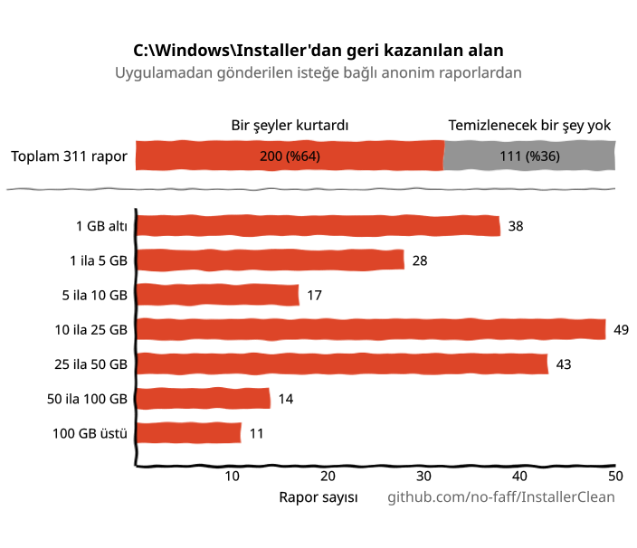
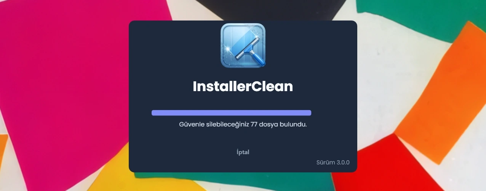
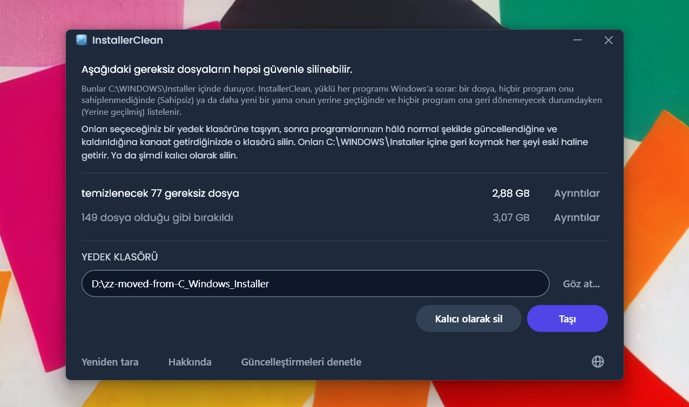
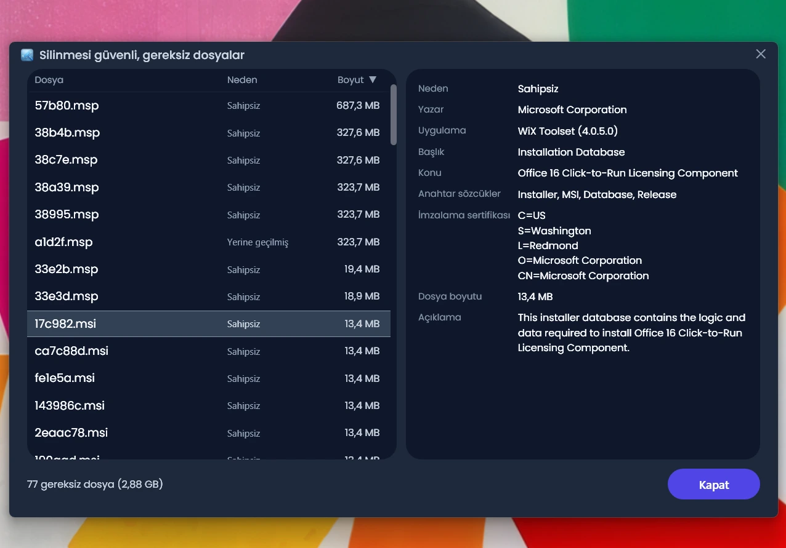
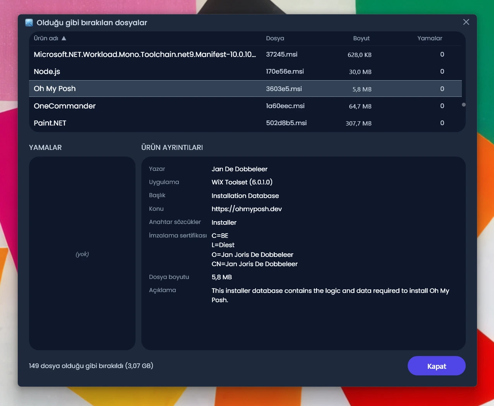
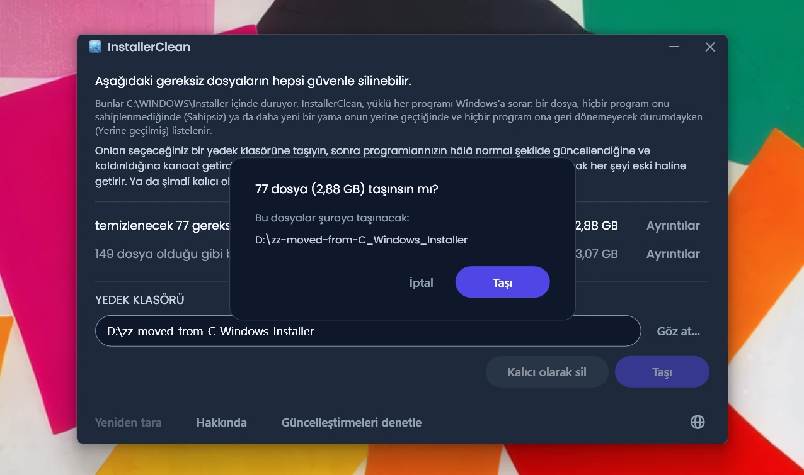
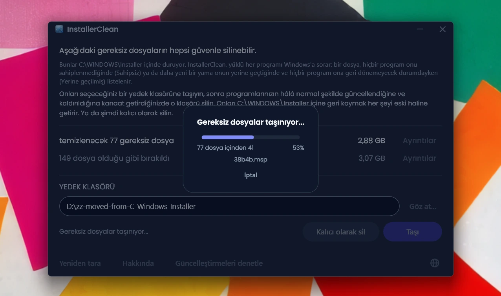
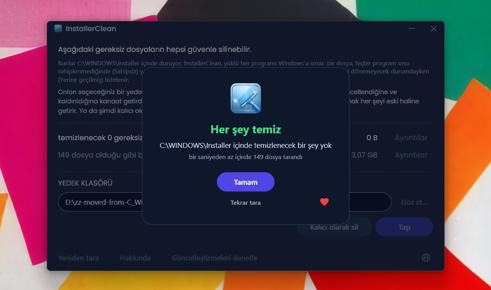

<p align="center">
  <a href="README.md">English</a> · <a href="README.zh-CN.md">简体中文</a> · <a href="README.ru.md">Русский</a> · <a href="README.es.md">Español</a> · <a href="README.ar.md">العربية</a> · <a href="README.ja.md">日本語</a> · <a href="README.pt-BR.md">Português (BR)</a> · <a href="README.pl.md">Polski</a> · <strong>Türkçe</strong> · <a href="README.ko.md">한국어</a> · <a href="README.fr.md">Français</a> · <a href="README.it.md">Italiano</a> · <a href="README.de.md">Deutsch</a> · <a href="README.id.md">Bahasa Indonesia</a> · <a href="README.vi.md">Tiếng Việt</a> · <a href="README.uk.md">Українська</a> · <a href="README.nl.md">Nederlands</a>
</p>

<p align="center">
  
</p>

<p align="center"><em>🎶 What's my line? I'm happy <a href="https://www.youtube.com/watch?v=HM-jHhUZfFI">cleaning Windows</a></em></p>

<h1 align="center">InstallerClean</h1>

<p align="center"><strong><code>C:\Windows\Installer</code> klasörünü, yani disk alanınızı sessizce yiyip bitiren gizli Windows klasörünü güvenle temizlemek için açık kaynaklı bir araç.</strong></p>

<p align="center"><em>Kırk yılda bir çalıştırın. Belki biraz yer açarsınız. Tertemiz, yolunuza devam edin.</em></p>

<p align="center">
  <a href="LICENSE"></a>
  <a href="https://dotnet.microsoft.com/download/dotnet/10.0"></a>
  <a href="https://github.com/no-faff/InstallerClean/actions/workflows/ci.yml"></a>
  <a href="https://github.com/no-faff/InstallerClean/releases"></a>
  <a href="https://github.com/no-faff/InstallerClean/releases/latest"></a>
  <a href="https://github.com/no-faff/InstallerClean/releases"></a>
</p>

<a id="reports-stats"></a>

<!-- reports-stats-start chart-only (generated; do not hand-edit between these markers) -->
<p align="center">
  <picture>
    <source media="(prefers-color-scheme: dark)" srcset="docs/reports-tr-dark.svg" />
    <source media="(prefers-color-scheme: light)" srcset="docs/reports-tr-light.svg" />
    
  </picture>
</p>
<!-- reports-stats-end -->

- **Ne yapar:** InstallerClean tek bir iş yapar: yazılım kurdukça ve güncelledikçe dolan gizli bir klasör olan `C:\Windows\Installer` içindeki gereksiz dosyaları kaldırır. Kısa bir taramanın ardından böyle dosyalarınız olup olmadığını size söyler, merak edenler için daha fazla ayrıntı gösterir ve C: sürücünüzde yer açmak için onları başka bir yere taşımanıza ya da silmenize olanak tanır.
- **Buraya gelme nedeniniz belki de şu:** [WinDirStat](https://github.com/windirstat/windirstat), WizTree ya da TreeSize kullandınız, `C:\Windows\Installer`'ın çok yer kapladığını gördünüz ama içinde ne olduğunu bilmiyordunuz. Öyleyse InstallerClean tam da ihtiyacınız olan şey. `9f05cba.msi` gibi rastgele görünen adlara sahip o dosyaların içinde ne olduğunu bilir ve hangilerini güvenle kaldırabileceğinizi size hızlıca söyler.
- **Ne kadar yer:** Yukarıdaki grafik, v1.8.0'dan beri damla damla gelmeyi sürdüren isteğe bağlı raporların sonuçlarını gösteriyor. (Düğmeye tıklayan herkese teşekkürler. Siz olmasaydınız yukarıdaki grafik de olmazdı.) Yer açan raporların oranı <!-- reports-freedpct-start -->%64<!-- reports-freedpct-end -->; bunlarda kurtarılan alanın ortancası <!-- reports-median-start -->15,3 GB<!-- reports-median-end -->. <!-- reports-biggest-start -->Bir makine koskoca 462 GB geri kazandı.<!-- reports-biggest-end --> Geri kalan <!-- reports-nothingpct-start -->%36<!-- reports-nothingpct-end --> hiç yer açmadı; yani makineye bağlı: ek yazılımı olmayan temiz bir Windows 11 kurulumunda kaldırılacak bir şey yoktur. En çok gereksiz dosya, yıllardır çalışan makinelerde, MSI tabanlı ağır yazılım barındıran her makinede (Acrobat, Office, LibreOffice, büyük geliştirme araçları) ve bol bol yazılım kurup kaldıran herkeste birikir. Ne kadar olduğunu, çalıştırdığınız anda tam olarak görürsünüz.
- **Güvenli mi:** Evet. InstallerClean yalnızca `C:\Windows\Installer` içindeki dosyalara dokunur. Hâlâ nelerin gerekli olduğunu Windows Installer'a sorar, aynı kayıtları bir de kayıt defterinden okur. Bir dosyayı ancak makinede kurulu hiçbir şey onu sahiplenmiyorsa ya da daha yeni bir yama onun yerine geçmişse ve buradaki hiçbir program eskisine geri dönemiyorsa sunar. Net bir yanıt alamadığı her şeyi geri tutar. [Daha fazlası aşağıda](#nasıl-çalışır).
- **InstallerClean sizinle ilgili hiçbir şey öğrenmez:** Açık kaynak (Apache 2.0). Hesap yok, reklam yok, takip yok, telemetri yok, arka planda çalışan hiçbir şey yok. Kendiliğinden çevrimiçi olarak yaptığı tek şey, siz çalıştırdığınızda GitHub'da daha yeni bir sürüm olup olmadığına bakmaktır; bunu da kapatabilirsiniz.
- **Edinme:** [En son sürümü indirin](../../releases/latest). Çalıştırın; [Windows'un göstereceği uyarıya](#unknown-publisher) ve [yönetici istemine](#admin) tıklayıp geçin. Bulduklarını taşıyın ya da silin. Bu kadar.

## İçindekiler

- [Kimsenin size bahsetmediği klasör](#kimsenin-size-bahsetmediği-klasör)
- [Yardım arayışı](#yardım-arayışı)
- [InstallerClean ne yapar](#installerclean-ne-yapar)
- [Ekran görüntüleri](#ekran-görüntüleri)
- [Nasıl çalışır](#nasıl-çalışır)
- [İndirme](#indirme)
  - [Dosyanın kendisini denetleme](#dosyanın-kendisini-denetleme)
- [SSS](#sss)
- [Komut satırı](#komut-satırı)
- [Erişilebilirlik](#erişilebilirlik)
- [Kod imzalama politikası](#kod-imzalama-politikası)
- [Gizlilik](#gizlilik)
- [Neleri yapmaz](#neleri-yapmaz)
- [Alternatifler](#alternatifler)
- [C:\Windows\Installer içinde bir dosya eksik kalırsa](#recovery)
- [Gereksinimler](#gereksinimler)
- [Kaynaktan derleme](#kaynaktan-derleme)
- [Katkıda bulunma](#katkıda-bulunma)
- [Projeyi destekleyin](#projeyi-destekleyin)
- [Yıldız geçmişi](#yıldız-geçmişi)
- [Lisans](#lisans)

---

## Kimsenin size bahsetmediği klasör

Her Windows bilgisayarında `C:\Windows\Installer` adlı gizli bir klasör vardır. Windows Installer sistemini kullanan bir yazılım her kurduğunuzda ya da Microsoft Office, Adobe Acrobat, Visual Studio veya `.msi` tabanlı başka bir uygulamaya bir yama uyguladığınızda, o yükleyicinin veya `.msp` yama dosyasının bir kopyası bu klasöre düşer ve orada kalır.

Daha yeni bir yama eskisinin yerine geçtiğinde ikisi de kalır. Uzun zaman önce kaldırdığınız yazılımların yükleyicileri de öyle. Disk Temizleme bunların hiçbirine dokunmaz, Akıllı Depolama da dokunmaz. DISM ise bambaşka bir klasör içindir. Zamanla klasör büyür: 1 GB, 5 GB, 20 GB, 50 GB. MSI kullanan ağır yazılımların bulunduğu makinelerde (Acrobat sık rastlanan bir suçludur) [100 GB'ı geçebilir](https://www.reddit.com/r/sysadmin/comments/1oxcrmh/acrobat_filling_up_the_cwindowsinstaller_folder/).

Bunlar kendiliğinden geri gelen geçici dosyalar değildir. Gerçek bir ölü yüktürler: yıllar önce kaldırdığınız yazılımlardan kalma eski yükleyiciler ve defalarca yerine yenisi gelmiş yamalar. Bir kez gittiklerinde geri gelmezler.

**Windows'ta disk alanı açmanın kolay bir yolunu arıyorsanız, bu klasör başlamak için iyi bir yer.** InstallerClean gereksiz dosyaları bulup güvenle kaldırır.

## Yardım arayışı

Bu klasörle ilgili daha önce hiç yardım aradıysanız, gidişatı muhtemelen bilirsiniz. `C:\Windows\Installer` klasöründe 180 GB olan biri nasıl temizleneceğini sorar. Ona [Disk Temizleme'yi çalıştırması söylenir](https://learn.microsoft.com/en-us/answers/questions/4238108/windows-installer-folder-has-occupied-180gb). Dener. 600 MB açar, hiçbiri o klasörden değil (çünkü Disk Temizleme `C:\Windows\Installer` klasörüne dokunmaz). Başlık sessizliğe gömülür.

> *“Bulduğum bütün başlıklar genelde sorunu çözmeyen aynı şeyleri öneriyor, sonra da ölüp gidiyor.”*
>
> [ksparks519, r/Windows10](https://www.reddit.com/r/Windows10/comments/1bt8c5p/anyone_ever_figure_out_giant_installer_folders/) (İngilizce orijinalinden çevrilmiştir)

Ya da hiç dokunmamaları söylenir. Bir başlıkta, 60 GB'lık bir Installer klasörü olan birine [“ona dokunma.”](https://www.reddit.com/r/techsupport/comments/1hw4suq/my_windows_installer_folder_is_like_60gb_so_i/) denmiş. Bunun yerine ne yapması gerektiğini sorduğunda ise yanıt şu olmuş: *“Az önce söyledim ya.”*

Sıradan tavsiyeler iki ayrı şeyi birbirine karıştırır. Dosyaları gelişigüzel silmek, o dosyaların ait olduğu programları güncellemenizi ya da kaldırmanızı engeller. Yalnızca makinedeki hiçbir şeyin sahiplenmediği ya da Windows'un yerine geçilmiş olarak kaydettiği dosyaları kaldırmak engellemez. InstallerClean ikincisini yapar.

## InstallerClean ne yapar

1. `C:\Windows\Installer` klasörünü `.msi` ve `.msp` dosyaları için **tarar**
2. Hâlâ nelerin gerekli olduğunu Windows Installer'a **sorar**, aynı kayıtları bir de kayıt defterinden okur
3. İki okumanın kendi aralarında karara bağlayamadığı her şeyi **geri tutar**
4. Ne kadar yer açabileceğinizi ve ne kadarını olduğu gibi bıraktığını, her dosyayı listeleyen isteğe bağlı ayrıntı pencereleriyle **gösterir**
5. Gereksiz dosyaları **kaldırır**: seçtiğiniz bir yedek klasörüne taşıyın ya da kalıcı olarak silin

## Ekran görüntüleri

<p>
  <br>
  <em>İlk tarama. Bu çok hızlıdır.</em>
  <br><br>
</p>

<p>
  <br>
  <em>Sonuçlar: ne kadarı kaldırılabilir, ne kadarı olduğu gibi bırakıldı.</em>
  <br><br>
</p>

<p>
  <br>
  <em>Gidebilecek dosyaların ayrıntıları: her birinin neden gerekli olmadığı ve dosyanın kendisi hakkında söyledikleri.</em>
  <br><br>
</p>

<p>
  <br>
  <em>Olduğu gibi bırakılan dosyaların ayrıntıları: Windows'un her birinin hangi programa ait olduğunu söylediği bilgi ve dosyanın kendisi hakkında söyledikleri.</em>
  <br><br>
</p>

<p>
  <br>
  <em>Her iki işlemden önce onay. Taşı, dosyaları seçtiğiniz bir klasöre yedekler. Ya da onları kalıcı olarak silin.</em>
  <br><br>
</p>

<p>
  <br>
  <em>Taşıma işlemi sürerken. Aynı sürücüye anında olur. Başka bir sürücüye ise GB arttıkça daha uzun sürer.</em>
  <br><br>
</p>

<p>
  <br>
  <em>Bitti. Yer geri kazanıldı. Her şeyin yolunda olduğuna kanaat getirene kadar dosyalar yedekte. Sonra yedek klasörünü silin.</em>
  <br><br>
</p>

<p>
  <br>
  <em>Yeniden tarandıktan sonra. Temizlenecek bir şey kalmadı.</em>
  <br><br>
</p>

<a id="is-it-safe"></a>
## Nasıl çalışır

Windows Installer bir programı kurduğunda yükleyicinin bir kopyasını `C:\Windows\Installer` içinde tutar; bir yama bir programa kaydedildiğinde o yamanın da bir kopyasını tutar. Yazılımı sonradan onarırken, güncellerken ya da kaldırırken çalıştığı şey bu kopyalardır; kurulum bittikten çok sonra bile orada durmalarının nedeni budur. Klasöre iki tür kopya da düşer: `.msi` yükleyiciler ve zaten sahip olduğunuz bir programı değiştirmek yerine güncelleyen `.msp` yamalar.

InstallerClean bir dosyayı iki nedenden biriyle sunar.

**Sahipsiz**, makinedeki hiçbir şeyin o dosyayı sahiplenmediği anlamına gelir. Ne kurulu bir ürün ne de kayıtlı bir yama o dosyanın adını verir.

**Yerine geçilmiş**, Windows'un bu yamanın yerine daha yenisinin geçtiğini kaydettiği, dosyayı ise yine de tuttuğu anlamına gelir. Bir yama ancak kayıtlı olduğu her program kaldırıldığında ya da yama hepsinden sökülüp alındığında silinir. Yerine daha yenisinin geçmesi bunların ikisi de değildir, dolayısıyla dosya kalır. Adobe Acrobat Windows'ta böyle çalışır: güncelleştirmeleri yepyeni birer yükleyici olarak değil, bir asıl kuruluma uygulanan yamalar olarak gelir; dolayısıyla Acrobat'ı bir süredir barındıran bir makinede bunlardan birkaç tane birikmiş olabilir.

InstallerClean bu ikisini birbirinin tersi yönlerden saptar ve klasörün içine bakmak yalnızca birincisinde devreye girer.

**Klasörü listeleme.** InstallerClean, doğrudan `C:\Windows\Installer` içinde duran `.msi` ve `.msp` dosyalarını listeler. Alt klasörlere girmez.

**Kayıtları iki kez okuma.** InstallerClean, `msi.dll` içindeki Windows Installer API'sini çağırarak Windows Installer'dan kurulu her ürünü, kayıtlı her yamayı ve her birinin adını verdiği önbellek dosyasını ister. Sonra aynı kayıtları ikinci bir yoldan, doğrudan kayıt defterinden okur; çünkü sorma işi hiç belli etmeden eksik dönebilir: Windows kayıtları, artık kalmadığını söyleyene kadar birer birer verir ve iki yüz kaydın üçüncüsünde duran bir çalıştırma, sona ulaşmış olanla birebir aynı görünür. Bir kayıt defteri anahtarı ise adların tamamını tek seferde verir, dolayısıyla eksik bir liste tam görünemez. Kayıt defterinin adını verdiği, sormanın ise atladığı her ürün, sonra adıyla ve birer birer Windows'a geri sorulur. Bu ikinci okuma bir dosyayı yalnızca “hâlâ gerekli” tarafına geçirebilir. Onu kaldırılacak dosyalar listesine koyabileceği bir yol yoktur.

**Bir kaydı dosyasıyla eşleştirme.** Bir kayıt, önbellekteki dosyasının adını bir yol olarak verir ve aynı klasör bu yollarda her zaman aynı şekilde yazılmaz. Bu yüzden InstallerClean yazılışa güvenmek yerine, kayıtlı her yolun gerçekte nereyi gösterdiğini Windows'a sorar ve bunu klasörde listelediği dosyalarla karşılaştırır. Hâlâ sahiplenilmemiş olan her şey, adların hiç işe karışmadığı ikinci bir karşılaştırmadan geçer: InstallerClean dosyayı açıp Windows'tan onu tanımlamasını ister, böylece aynı dosyanın iki farklı adı tek bir dosya olarak tanınır.

**Eşleştirilemeyen kayıtlar.** Windows kayıtlı bir yolun nereyi gösterdiğini söylemezse ya da yolun ucundaki dosya tanımlanamazsa, InstallerClean o kaydın hangi dosyayla ilgili olduğunu bilmez ve listelediği dosyaların herhangi biri o dosya olabilir. Bir program birden fazla kez kurulmuş olabiliyorsa da aynısı geçerlidir, çünkü o zaman InstallerClean hangi önbellek dosyasının hangi kuruluma ait olduğunu ayırt edemez. Bu durumların herhangi birinde, o seferki klasör listelemesinde bulduklarının hiçbirini sunmaz. Çoktan gitmiş bir dosyayı gösteren kayıt farklıdır: kastetmiş olabileceği bir şey kalmamıştır, dolayısıyla klasörde hâlâ duran dosyaların hiçbiriyle ilgili olamaz.

**Öbür uçtan sorma.** Sahipsizliğe bir yokluk karar verir ve bir yokluk, uygulamanın kaydı bulamamış olması anlamına da gelebilir. Bu yüzden InstallerClean bir `.msi` yükleyiciyi sunmadan önce dosyayı açar, dosyanın kendi taşıdığı ürün kodunu okur ve o ürünün kurulu olup olmadığını Windows'a sorar. Kuruluysa, taramanın geri kalanı ne bulmuş olursa olsun dosya kalır. Bu denetim bir dosyayı listeden yalnızca çıkarabilir. Verebileceği hiçbir yanıt listeye dosya eklemez.

**Bir `.msp` yamaya neyin karar verdiği.** Bir yama açılıp hangi programa ait olduğu kendisine sorulmaz. Bunun yerine işi bağlayan şey, bir yama kaydının önbellekteki dosyasının adını iki yerde vermesidir: her ürüne kayıtlı yamalar; makinedeki her yama kaydını içeren tek bir kayıt defteri listesi. Bir yama, ancak bu iki yerden hiçbiri o yamanın önbellekteki dosyasının adını vermiyorsa sahipsiz olarak sunulur.

**Yerine geçilmiş bir yamanın farkı.** Böyle bir yama bunların hiçbirinden geçmez, çünkü sahiplenilmemiş bir dosya değildir. Windows'un o yamaya dair bir kaydı vardır ve yerine başkasının geçtiğini söyleyen de o kayıttır. Buradaki risk başkadır: bir yama birkaç programa birden kayıtlı olabilir ve bunlardan yalnızca birinin onunla işi bitmiştir. Bu yüzden yerine geçilmiş bir yama ancak şu durumda sunulur: Windows onun kaldırılamayacağını kaydetmişse, kayıtlı olduğu her programa sorulmuşsa, hiçbirinde hâlâ uygulanmış değilse ve hiçbiri Windows'un kaldırılabilir dediği bir yama barındırmıyorsa. Sonuncusu şunun için var: bir programdaki bir yamayı geri almak, eski dosyaya kadar uzanabilir. Bunların herhangi biri yanıtlanamazsa dosya kalır.

<details>
<summary>Bunun kullandığı Windows Installer çağrıları</summary>

- Kurulu her ürünü listelemek için `MsiEnumProductsEx`; belirli bir ürünün kurulu olup olmadığını sormak için de tek bir ürün koduyla yine o
- Kayıtlı yamaları hem ürün başına hem de makinenin tamamında listelemek için `MsiEnumPatchesEx`
- Bir ürünün adını, adını verdiği önbellek dosyasını ve aynı ürünün birkaç kurulumundan biri olup olmadığını okumak için `MsiGetProductInfoEx`
- Bir yamanın durumunu, Windows'un onu kaldırıp kaldıramayacağını ve o yamanın adını verdiği önbellek dosyasını okumak için `MsiGetPatchInfoEx`
- Bir yama dosyasının içinden hangi programlara uygulanabileceğini okumak için `MsiGetSummaryInformation` ve `MsiSummaryInfoGetProperty`
- Bir yükleyici dosyasının içinden, o dosyanın bildirdiği ürün kodunu okumak için `MsiOpenDatabase`, `MsiDatabaseOpenView`, `MsiViewExecute`, `MsiViewFetch` ve `MsiRecordGetString`

</details>

Bütün bunlara rağmen uygulama sizi dosyaları bir yedek klasörüne taşımaya yönlendirir (C'de yer açmak istiyorsanız başka bir sürücüde/bölümde olsun). Böylece gereksiz dosyaları en sonunda silmeden önce her şeyin gerçekten yolunda olduğuna kanaat getirme fırsatınız olur.

<a id="indirme"></a>
## İndirme

Üç yapı, birini seçin:

- **Taşınabilir** (`InstallerClean-3.0.0-portable.exe`): .NET 10 çalışma zamanı içinde, tek bir dosya. Kurulum yok, kaldırıcı yok: çift tıklayın, çalışır. Dosyayı bir sonraki sefer için bir yerde tutun ya da işiniz bitince silin.
- **Kurulum** (`InstallerClean-3.0.0-setup.exe`): .NET 10 çalışma zamanı paketlenmiş, sıradan bir Windows yükleyicisi. Başlat menüsüne bir giriş ekler ve temizce kaldırılır. Programların arasına yerleşir, böylece altı ay sonra bulması kolay olur; bol bol yazılım kurup kaldırıyorsanız daha sık çalıştırmak da kolay olur.
- **CLI** (`installerclean-cli.exe`): komut satırı sürümü tek başına, çalışma zamanı içinde tek bir dosya. Kurulum yok, kaldırıcı yok. Bir istemciye bırakın, bir tarama ya da temizlik çalıştırın, silin. Betik yazma, zamanlanmış görevler ve istemcide bir masaüstü uygulaması istemediğiniz toplu dağıtım için yapıldı. Argümanlar ve çıkış kodları için [Komut satırı](#komut-satırı) bölümüne bakın.

2.2.0'dan itibaren kurulum ve taşınabilir sürümlerin dosya adları sürüm numarasını taşıyor, böylece indirilen bir kopya ne olduğunu her zaman söylüyor; komut satırı aracı ise sade `installerclean-cli.exe` adını koruyor, ki ona işaret eden zamanlanmış görevler ve betikler güncellemeler boyunca çalışmayı sürdürsün.

[Sürümler sayfasından](../../releases/latest) indirin, sonra çalıştırın. İmzasızdır, dolayısıyla Windows “bilinmeyen yayımcı” uyarısı gösterir; [SSS](#unknown-publisher) ne göreceğinizi ve neden güvenli olduğunu açıklar.

Uygulama başlangıçta otomatik tarar. Sonuçları gözden geçirin, sonra **Taşı** ya da **Kalıcı olarak sil**'e tıklayın.

Ya da [winget](https://learn.microsoft.com/windows/package-manager/winget/) ile kurun:

```
winget install NoFaff.InstallerClean
```

Ya da [Scoop](https://scoop.sh) ile kurun:

```
scoop install installerclean
```

### Dosyanın kendisini denetleme

InstallerClean imzasızdır. Çalıştırmadan önce neleri denetleyebileceğiniz şöyle:

- Her indirmenin SHA-256 karması, hem notların içinde hem de indirmenin yanındaki ayrı bir `.sha256` dosyası olarak sürüm sayfasındadır.
- VirusTotal: her yapı çıkmadan önce taranır ve sürüm sayfası her indirme için motor motor tam sonucu taşır.
- Kaynak kod burada, [github.com/no-faff/InstallerClean](https://github.com/no-faff/InstallerClean) adresinde. Tarama, sorgulama, taşıma, silme, ayarlar ve bekleyen yeniden başlatma hizmetleri, `main` dalına her gönderimde ve her çekme isteğinde Windows üzerinde çalışan otomatik bir test paketiyle kapsanır; bu sayfanın başındaki CI rozeti de sonucu bildirir.
- Sürüm yapıları deterministiktir: aynı kaynak, aynı SDK ve aynı yayımlama bayrakları aynı baytları üretir; ayrıca her yapı girdisi o etiketteki kaynakla eşleşmedikçe bir sürüme etiket konulamaz. Yani etikete geçip kendiniz derleyebilir, karmaları yayımlananlarla karşılaştırabilirsiniz. Bunun için gerekenler her sürümün notlarındadır: hangi SDK sürümüyle derlendiği ve varsayılanlarla derlenmemiş indirmeler için yayımlama bayrakları. Kurulum bunun dışındadır: SDK ile değil Inno Setup ile derlenir ve yapım yılını kendi içine damgalar, dolayısıyla karmasını yeniden üretmek aynı Inno sürümünü ve aynı takvim yılını da gerektirir.
- GitHub, MajorGeeks ve Softpedia üzerinden <!-- downloads-start -->72.000+<!-- downloads-end --> indirme.
- [MajorGeeks](https://www.majorgeeks.com/files/details/installerclean.html) her gönderimi bir sanal makinede test eder ve yalnızca incelemelerinden geçerse listeler.<br><a href="https://www.majorgeeks.com/files/details/installerclean.html"></a>
- [Softpedia](https://www.softpedia.com/get/System/Hard-Disk-Utils/InstallerClean.shtml) inceledi ve casus yazılım, reklam yazılımı ile virüs içermediğini onayladı.<br><a href="https://www.softpedia.com/get/System/Hard-Disk-Utils/InstallerClean.shtml"></a>

## SSS

<a id="admin"></a>

**Neden Yönetici istiyor?** İki nedenle. `C:\Windows\Installer` yöneticilere kilitlidir; onu okumak, Windows Installer'ı sorgulamak ve dosyaları taşımak ya da silmek bunu gerektirir. Bir de yönetici, makinedeki herhangi bir hesap altında kurulu programları Windows'a sorabilirken yönetici olmayan soramaz: yönetici olmadan çalıştırın, bir dosyanın hâlâ gerekli olup olmadığına karar veren denetimin içinde Windows, kurulu olan bir programa kurulu değil diyecektir.

<a id="unknown-publisher"></a>

**Windows neden “Bilinmeyen yayımcı” diyor?** InstallerClean kod imzalı değil ve Windows internetten indirilen dosyaları işaretliyor; bu yüzden ilk çalıştırmada SmartScreen genellikle “Windows kişisel bilgisayarınızı korudu” gösterir ve yayımcıyı bilinmeyen olarak listeler. Ücretli bir imzalama sertifikası her yıl para tutar ve ben bunun için ödeme yapmaktansa uygulamayı ücretsiz tutmayı yeğliyorum; bu yüzden açık kaynak yazılımları karşılıksız imzalayan SignPath Foundation'a başvurdum ve InstallerClean kabul edildi (bkz. [Kod imzalama politikası](#kod-imzalama-politikası)). Sertifika henüz düzenlenmedi, dolayısıyla şimdilik **Ek bilgi**'ye, ardından **Yine de çalıştır**'a tıklayın. Bunu yapmak güvenlidir: kaynak kod herkese açık ve her sürümde önceden kontrol edebileceğiniz VirusTotal bağlantıları ile SHA-256 karmaları var.

**Windows 7 veya 8'de çalışır mı?** Hayır. .NET 10 çalışma zamanının desteklediği en eski yapı olan Windows 10 sürüm 1607 ya da üzerini gerektirir. Kurulum daha eskisine kurulmayı reddeder, taşınabilir yapı da başlamaz.

## Komut satırı

`installerclean-cli.exe`, GUI'nin yanına kurulan ayrı bir konsol yürütülebilir dosyasıdır. Aynı tarama, aynı taşıma, aynı silme, penceresiz. Bitene kadar komut istemini bloke eder, böylece bir betik ya da zamanlanmış görev onu bekleyebilir.

### Bayraklar

| Bayrak | Ne yapar | Ayrıca kabul ettiği |
|---|---|---|
| `/s` | Yalnızca tarar. Kaldıracaklarını, her birinin adı, boyutu ve nedeniyle listeler. Hiçbir şeyi değiştirmez. | |
| `/d` | Tarar, sonra gereksiz dosyaları kalıcı olarak siler. | |
| `/m` | Tarar, sonra onları GUI'de kaydedilmiş klasöre taşır. | |
| `/m YOL` | Tarar, sonra onları `YOL` konumuna taşır. İçinde boşluk varsa tırnak içine alın. | |
| `--help` | Kullanımı yazdırır ve `0` ile çıkar. | `/?`, `-h` |
| `--version` | Sürümü yazdırır ve `0` ile çıkar. | `-v` |

Bayraklar büyük/küçük harfe duyarsızdır, dolayısıyla `/S` ve `/D` de `/s` ve `/d` kadar iyi çalışır. Çalıştırma başına tek bayrak: birleştirilemezler ve `/s` ile `/d` kendilerinden sonra bir şey almaz.

Argümansız çalıştırın, kullanımı yazdırır ve `1` ile çıkar; böylece bayrağını düşüren zamanlanmış bir görev, sessizce hiçbir şey yapmak yerine görünür biçimde başarısız olur. Tanımadığı bir bayrak için bir hata satırı, ardından kullanımı yazdırır ve yine `1` ile çıkar. İçinde boşluk olan, tırnağa alınmamış bir taşıma yolu da sessizce kırpılmak yerine aynı şekilde geri çevrilir ve ileti size tırnak içine almanızı söyler.

### Çıkış kodları

Aracın `--help` içinde kendi belgelediği kodlar şunlar:

| Kod | Anlamı |
|---|---|
| `0` | Başarılı. Çalıştırma isteneni yaptı ve hiçbir şey başarısız olmadı. |
| `1` | Hiçbir şey işlenmedi. Çalıştırma başarısız oldu ya da geri çevrildi. |
| `2` | Kısmi. Bir kısmı işlendi, bir kısmı işlenmedi; yarıda basılan bir Ctrl+C de buraya girer. |
| `75` | Geçici. Geçici bir durum çalıştırmayı engelledi; yazdırılan ileti hangisi olduğunu söyler. |
| `130` | Hiçbir şey işlenmeden önce Ctrl+C ile iptal edildi. |

`1`, başarısızlığın yanı sıra geri çevrilmeyi de kapsar ve geri çevrilme bir kusur değildir: yalnızca dolu olan bir hedef de, uygulamanın hiçbir şeye dokunmadan önce okuyamadığı bir kayıt defteri değeri de buraya düşer. `0`, hiçbir şeyin başarısız olmadığı anlamına gelir, geriye bir şey kalmadığı değil: `--help`, `--version` ve yalnızca tarama çalıştırması, tarama altmış sekiz dosya bulmuş da olsa hiç bulmamış da olsa `0` ile çıkar.

### Olay günlüğü

Her çalıştırma uygulama günlüğüne bir sonuç girişi yazar ve yanına bir ya da daha fazla bildirim ekleyebilir. Olay kimliği makineler için kararlı bir sözleşmedir, dolayısıyla bir RMM hiçbir metni ayrıştırmadan numaraya göre süzebilir:

| Kimlik | Anlamı |
|---|---|
| `1000` | Başarılı |
| `1002` | Kısmi |
| `2000` | Atlandı, geçici |
| `4000` | Ağır başarısızlık |
| `3000` | Bildirim: tarama kurulu her ürünü kapsayamadı |
| `3001` | Bildirim: Windows'un beklediği dosyalar klasörde yok |
| `3002` | Bildirim: dosyalar sunulmak yerine geri tutuldu |

`3000` bandı bir sonuç değil bir bildirimdir ve çalıştırma sonucu sayılmaz. Giriş türü, çalıştırmada ters giden bir şey olmadığında Bilgi, olduğunda Uyarı'dır. **Olay günlüğü her zaman İngilizcedir**, makinenin görüntü dili ne olursa olsun; böylece bilinen bir ifadeye yapılan bir grep'in kararlı bir hedefi olur. Çevrilen kısım konsoldur: makinenin kendi dilini izler, boyutları ve tarihleri de kendi bölgesine göre biçimlendirir.

### Örnekler

Hiçbir şeyi değiştirmeden bir dosyaya denetim çıkarmak:

```
installerclean-cli /s > audit.txt
```

CLI'nin bir kopyası `C:\Tools` içindeyken `D:\InstallerBackup` klasörüne aylık taşıma:

```
schtasks /create /tn "InstallerClean monthly" /tr "C:\Tools\installerclean-cli.exe /m D:\InstallerBackup" /sc monthly /ru SYSTEM /rl highest
```

Görev, çalıştırma bitene kadar bloke olur ve çıkış kodunu Son Çalıştırma Sonucu olarak kaydeder; böylece bir RMM yukarıdaki kodlara dayanabilir.

PowerShell'den:

```powershell
& 'C:\Tools\installerclean-cli.exe' /m D:\InstallerBackup
switch ($LASTEXITCODE) {
    0       { 'Temiz' }
    2       { 'Kısmi, çıktıyı denetleyin' }
    75      { 'Engellendi, sonra yeniden deneyin' }
    default { "Başarısız ($LASTEXITCODE)" }
}
```

### Betik yazmadan önce

- **Yükseltme gerektirir.** Hepsi gerektirir, `/s` dahil. Yükseltilmemiş bir komut isteminden Windows onu başlatmayı reddeder ve kabuğunuza `740` verir.
- **GUI'nin kaydettiği klasör kullanıcı başınadır.** SYSTEM ya da bir hizmet hesabı olarak çalışan bir görev onu göremez, dolayısıyla o çalıştırmaların `/m YOL` vermesi gerekir.
- **SYSTEM ağa makine hesabı olarak erişir**, dolayısıyla bir `\\sunucu\paylaşım` hedefi için o hesaba hak verilmesi gerekir.
- **`/s` hiçbir zaman bloke etmez.** Salt okunurdur ve kilit almaz, dolayısıyla masaüstü uygulaması açıkken tarama yapabilirsiniz. `/d` ve `/m` makine genelinde bir kilit alır ve kilidi başka bir InstallerClean çalıştırması tutuyorsa `75` ile çıkar.
- **Her şey stdout'a gider**, hatalar dahil; stderr yoktur. Metni ayrıştırmak yerine çıkış koduna dayanın.
- **Taşıma, yeniden adlandırmak yerine geri çevirir.** Hedefte o adda bir dosya zaten varsa, o dosya önbellekte bırakılır ve çıktıda adı verilir; toplu işin geri kalanı yine taşınır. Her dosyanın çakıştığı bir çalıştırma hiçbir şey işlemez ve `1` ile çıkar.
- **Yedek klasörünü boşaltan hiçbir şey yok.** `/m` yalnızca ekler. Onu ayrıca sizin temizlemeniz gerekir.
- **`taskkill /pid` düzgün bir iptal değildir.** Tek örnek kilidini bir sonraki çalıştırma kurtarır.
- **İlk çalıştırma bir olay günlüğü kaynağı kaydeder**, şurada: `HKLM\SYSTEM\CurrentControlSet\Services\EventLog\Application\InstallerClean`. Onu yerinde bırakın: Olay Görüntüleyicisi bir girişin açıklamasını kaynağı üzerinden okur, dolayısıyla kaynağı kaldırmak, aracın daha önce yazdığı her girişi bilinmeyen kaynak hatasına çevirir.

### Neden `installerclean-cli`, `installerclean.exe` değil

`InstallerClean.exe` penceredir ve komut satırı argümanlarını yok sayar. `installerclean-cli.exe` gerçek bir konsol sürecidir, dolayısıyla bitene kadar komut istemini bloke eder, diğer her şey gibi yönlendirilir ve boruyla aktarılır. Kurulum ikisini de kurar. Taşınabilir indirme yalnızca GUI'dir; komut satırını penceresiz istiyorsanız `installerclean-cli.exe` dosyasını [sürümler sayfasından](../../releases/latest) tek başına indirin.

## Erişilebilirlik

InstallerClean, tümüyle klavyeden ve bir ekran okuyucusuyla kullanılabilecek şekilde yapılmıştır.

- **Baştan sona klavyeyle kullanılabilir.** Uygulamanın yaptığı her şeye klavyeden ulaşılır ve ayrıntı pencerelerinin sütunları da klavyeden sıralanır, dolayısıyla burada hiçbir şey fare gerektirmez. Başlık çubuğu düğmeleri Windows'unkiler gibi davranır ve Alt+Boşluk ya da Alt+F4 ile açılır. Klavye odağı, nereye giderse gitsin görünür kalır.
- **Ekran Okuyucusu ve Sesli erişim.** Her denetim etiketlidir ve bir düğmenin üzerinde görünen sözcük, onu sesle çalıştıran sözcüktür. Bir Taşı veya Sil işlemi bittiğinde sonuç sesli okunur.
- **Okunmak için yapıldı.** Metin, koyu temanın her yerinde WCAG AA kontrastını karşılar.

Burada bir şey size engel oluyorsa, [bir konu açın](../../issues). Erişilebilirlik sorunları uç durumlar değil, hatalardır.

## Kod imzalama politikası

InstallerClean, ücretsiz kod imzalama için [SignPath Foundation](https://signpath.org) tarafından kabul edildi; bu, açık kaynak yazılımları imzalayarak onların makinenize bilinmeyen bir yayımcıdan gelmesine son veren bir program. Sertifikanın kendisi henüz düzenlenmedi, dolayısıyla buradaki indirmeler bugün imzasız ve Windows onlar için uyarı verecek.

Düzenlendiğinde her sürüm, SignPath'in istediği şu satırı taşıyacak: “free code signing provided by SignPath.io, certificate by SignPath Foundation”. Sertifika bana değil vakfa ait, çünkü bir sertifikanın tüzel bir kişiliğe düzenlenmesi gerekir ve tek kişilik bir proje tüzel kişilik değildir. Bu, InstallerClean'in onlara ait olduğu ya da imzalamanın ötesinde projeye karıştıkları anlamına gelmez.

**Roller.** InstallerClean'in bakımını tek bir kişi üstleniyor. Commit edenler ve gözden geçirenler, yani projeye kimin kod ekleyebileceği: ben. Onaylayanlar, yani bir sürümün imzalanmasına kimin izin verebileceği: ben.

## Gizlilik

Bir çalıştırma hakkında herhangi bir şey gönderen tek şey isteğe bağlı rapordur ve o da yalnızca siz düğmeye bastığınızda gider. İçinde şunlar var: taramanın ne bulduğu, neyi neden geri tuttuğu, taşıdınız mı sildiniz mi, bunun ne kadar yer açtığı, ne kadar sürdüğü ve başarısız olan her şey; yanında uygulamanın sürümü, onu hangi dilde okuduğunuz ve Windows sürümünüz. Dosya adı yok, klasör adı yok, hesap adı yok, makinenizi tanımlayan hiçbir şey yok ve iki raporu birbirine bağlayabilecek hiçbir şey yok. Uygulamanın kendi makinem dışındaki makinelerde çalışıp çalışmadığını ve neyi geri tuttuğunu böyle öğreniyorum.

Reklam yok, telemetri yok. Bunun dışındaki tek bağlantılar, uygulama açılırken yapılan sürüm denetimi (GitHub'a tek bir istek; Hakkında penceresinden kapatabilirsiniz) ve GitHub'a ve cömert hissederseniz bağış yapabileceğiniz bir sayfaya götüren düğmeler. [Gizlilik politikasının](PRIVACY.md) tamamı (İngilizce).

## Neleri yapmaz

- WinSxS (`C:\Windows\WinSxS`) farklı kurallara sahip farklı bir klasördür. Onun için, yükseltilmiş bir komut isteminden `Dism /Online /Cleanup-Image /StartComponentCleanup` komutunu çalıştırın.
- Arka plan hizmeti yok, zamanlanmış görev yok, otomatik temizlik yok. Uygulama yalnızca siz başlattığınızda çalışır.
- Yüklü programlarınızı ya da Windows Installer veritabanını değiştirmez, yalnızca okur. Kayıt defterine yazdığı tek şey, komut satırı aracının çalıştırmalarının Windows Olay Günlüğü'nde görünebilmesi için ihtiyaç duyduğu tek seferlik olay kaynağı kaydıdır.
- Kendiliğinden kurduğu tek bir bağlantı türü var: siz çalıştırdığınızda GitHub'ın sürümler sayfasında daha yeni bir sürüm olup olmadığına hızlıca bakması; bunu Hakkında penceresinden kapatabilirsiniz. Geri kalan her şey yalnızca siz söylediğinizde olur: isteğe bağlı anonim rapor (çalıştırmaya dair sayılar; sizi ya da dosyalarınızı adlandıran hiçbir şey yok) ve GitHub belgelerine ve bir bağış sayfasına giden, tıklarsanız tarayıcınızda açılan bağlantılar. Kendi başına hiçbir şey indirmez.
- Araç çubuğu yok, paketlenmiş yazılım yok, reklam yazılımı yok.

## Alternatifler

Bu klasörü daha önce arattıysanız, büyük olasılıkla karşınıza çıkmış olan araç [PatchCleaner](https://www.homedev.com.au/free/patchcleaner) olacaktır. Bu işi ilk o yaptı, InstallerClean var olmadan önce on yıl boyunca yaptı, hâlâ gayet iyi gidiyor ve InstallerClean onsuz var olmazdı.

InstallerClean'i yaptım, çünkü PatchCleaner kapalı kaynaklı, Mart 2016'dan beri güncelleme almadı ve Adobe dosyalarını varsayılan olarak hariç tutuyor. Bu hariç tutmanın iyi bir nedeni var ve HomeDev bunu o zamanki sürüm notlarında açıkça söyledi:

> *“Önceki sürümlerde, PatchCleaner'ın Adobe Acrobat Reader yamalarını yanlışlıkla gerekli değilmiş gibi tanımladığı bilinen bir sorun var. Adobe, otomatik güncelleme konusunda kendine özgü bir şey yapıyor; öyle ki PatchCleaner ‘yetim’ yamaları yükleyici dizininden kaldırırsa, Adobe Reader'ın otomatik güncelleştirmeleri artık başarıyla kurulamıyor.”*
>
> [PatchCleaner sürüm notları, sürüm 1.4.0.0](https://www.homedev.com.au/free/patchcleaner) (İngilizce orijinalinden çevrilmiştir)

Onunla birlikte gelen filtre, bir dosyanın meta verisinde ve imzasında “Acrobat” sözcüğünü arar. Acrobat'ın en büyük suçlu olduğu makinelerde bu, alanın çoğu olabilir:

> *“Yetim `.msp` dosyalarını silmek için Patchcleaner'ı indirdim, ama görünüşe göre bu yalnızca 250 MB yer açacakmış. Dosyaların 29 GB'ı ‘filtreler tarafından hariç tutulmuş’, yani Patchcleaner pek işe yaramıyor gibi.”*
>
> HeatherBunny1111, [r/techsupport](https://www.reddit.com/r/techsupport/comments/1qc4tcf/how_to_delete_msp_files_safely/) (İngilizce orijinalinden çevrilmiştir)

İki araç arasındaki fark burada, her birinin Windows'tan ne istediğidir; Adobe hakkında bir görüş ayrılığı değil. Windows'un, bir ürüne *uygulanmış* yamaları veren listesi, yerine daha yeni bir yama geçmiş olanları dışarıda bırakır; dolayısıyla bu listeyi okuyan bir araç, yerine geçilmiş bir yamanın dosyasıyla, diğerleri gibi hiçbir şeyin sahiplenmediği bir dosya olarak karşılaşır. Adobe'ninkileri adından yakalayan şey, hariç tutma filtresidir. InstallerClean ise Windows'a yama durumunu sorar, dolayısıyla yerine geçilmiş bir yama öyle etiketlenmiş olarak gelir ve ona ne olacağına, adının ne dediğine değil Windows'un onun hakkında kaydettiğine bakılarak karar verilir. İkisi şöyle karşılaştırılır:

| | **InstallerClean** | **PatchCleaner** |
|---|---|---|
| Son güncelleme | 2026 (etkin) | 3 Mart 2016 |
| Kaynak kod | Açık kaynak (Apache 2.0) | Kapalı kaynak |
| Çalışma zamanı | .NET 10 (kendi kendine yeten) | .NET Framework 4.5.2 + VBScript |
| API | `msi.dll` içindeki Windows Installer API'si (süreç içi) | Windows Installer COM (VBScript ile süreç dışı) |
| Yerine geçilmiş yamalar | Windows'un yama kayıtlarından saptanır | Sahiplenilmemiş dosyalardan ayırt edilmez |
| Adobe dosyaları | Yerine geçilmiş yamalar saptanır ve etiketlenir | Varsayılan olarak açık bir ad filtresiyle hariç tutulur |

> **`Win32_Product` hakkında bir not:** Kurulu ürünleri listelemek için yaygın ama bozuk olan yaklaşım, sayım sırasında [her üründe MSI onarım işlemlerini tetikleyen](https://gregramsey.net/2012/02/20/win32_product-is-evil/) `Win32_Product` (WMI) yaklaşımıdır. Hem InstallerClean hem de PatchCleaner ondan kaçınır. InstallerClean `msi.dll` içindeki Windows Installer API'sini çağırır; PatchCleaner ise Windows Installer COM nesnesini kullanan bir yardımcı betik çalıştırır. O betiğin adı `WMIProducts.vbs`, bu da onu başka türlü gösteriyor; ama dosya, Microsoft'un kendi örnek betiğinin düzenlenmiş hâli ve WMI'ya değil Windows Installer'a soruyor. Onunla ilgili yanıltıcı olan tek şey adı.

Disk Temizleme, Akıllı Depolama, CCleaner ve BleachBit `C:\Windows\Installer` klasörünü temizlemez.

<a id="recovery"></a>
## `C:\Windows\Installer` içinde bir dosya eksik kalırsa

O klasörden bir dosya gerçekten eksikse, ait olduğu program yine de normal çalışır. Ama o programı güncellemeye ya da kaldırmaya çalıştığınızda büyük olasılıkla başarısız olur. Windows dosyayı aramaya gider, bulamaz ve adım durur.

InstallerClean'in bütün amacı, yalnızca gerekli *olmayan* dosyaları taşımayı ya da silmeyi önermektir; ama bir dosyanın eksik olduğunu da anlar, dolayısıyla bulduklarını bir uyarı üçgeni ve buraya götüren bir bağlantıyla işaretler. Programı onarmayı denemek için yapılacaklar şunlar:

- Kurulu programınızın sürüm numarasını öğrenin (Ayarlar, Uygulamalar, Yüklü uygulamalar)
- **O sürümün** yükleyicisini üreticisinden indirin. Daha yenisi işe yaramaz, önce kaldırmak da yaramaz: ikisi de devam edebilmek için kurulu olanı kaldırmak zorundadır ve eksik dosyaya ihtiyaç duyan adım tam da o kaldırma adımıdır.
- O yükleyiciyi çalıştırın
- Bu, dosyayı geri getirmeli ve ayarlarınıza dokunmamalı. InstallerClean'de yeniden tarayın; işe yaradıysa uyarı kaybolmuş olacak.

Yine de Microsoft bunun işe yarayacağını garanti etmiyor. Aşağıdaki, onun kendi daha ayrıntılı açıklaması:

<details>
<summary>Microsoft'un daha ayrıntılı görüşü</summary>

*Aşağıdaki Microsoft alıntıları İngilizce orijinalindedir.*

Tam kılavuz: [Restore missing Windows Installer cache files](https://learn.microsoft.com/en-us/troubleshoot/windows-client/application-management/missing-windows-installer-cache), KB 2667628.

*Sorun hemen ortaya çıkmayabilir:*
> "If the installer cache is compromised, you may not immediately see problems until you take an action such as uninstalling, repairing, or updating a product."

*Dosyalar her makineye özgüdür, bu yüzden başka bir bilgisayardan kopyalayamazsınız:*
> "Missing files cannot be copied between computers because the files are unique."

*Dosya eksilmeden önce alınmış bir yedeğiniz varsa, Microsoft şu sırayla dört yol sayıyor:*
> - System Restore points (available only on client operating systems)
> - Restoreable system state backup
> - Failure recovery methods that can restore the full system state backup
> - Reinstallation of the operating system and all applications

*Ve dördünün de püf noktası. Bu, bir sistem yedeği için geçerli; dosyaları kendinizin taşıdığı bir klasör için değil: onları doğrudan geri kopyalayabilirsiniz, klasöre kopyalarken Windows'un gösterdiği yönetici istemini onaylamanız yeter.*
> "To restore the missing files, a full system state restoration is required. It is not possible to replace only the missing files from a previous backup."

*Önerilen kurtarma yöntemi ve onun açık sınırları:*
> "If application files are missing from the Windows Installer Cache, ask the vendor or support team for the application about the missing files. You must follow the procedures or steps recommended by the application vendor to restore the files. In some cases, you may have to rebuild the operating system and reinstall the application to fix the problem."
>
> "Windows support engineers cannot help you recover missing application files from the Windows Installer cache."

</details>

Bir dosyanın eksik olmasının nedeni InstallerClean ise bunu bilmek isterim. [Bir konu açın](../../issues), düzelteyim.

## Gereksinimler

- Windows 10 (sürüm 1607 / derleme 14393 veya üzeri, .NET 10 çalışma zamanının desteklediği en eskisi) ya da Windows 11
- 64 bit Windows. Kurulum 32 bit sistemlere kurulmaz ve bunu size söyler.
- Kurulum için ve uygulama için yönetici ayrıcalıkları (`C:\Windows\Installer` yalnızca yöneticilere açıktır)

Kurulum, taşınabilir ve CLI yapı seçenekleri için [İndirme](#indirme) bölümüne bakın.

## Kaynaktan derleme

```
git clone https://github.com/no-faff/InstallerClean.git
cd InstallerClean
dotnet build src/InstallerClean.sln
```

Testleri çalıştırın:

```
dotnet test src/InstallerClean.Tests/
```

## Katkıda bulunma

Bir hata mı buldunuz ya da bir öneriniz mi var? [Bir konu açın](../../issues) ya da bir [tartışma](../../discussions) başlatın. Çekme istekleri memnuniyetle karşılanır. Lütfen göndermeden önce `dotnet test` çalıştırın.

InstallerClean 16 dilde geliyor ve her biri onun tamamını kapsıyor: uygulama, kurulum, komut satırı ve bu README. Uygulamada, kurulumda ve komut satırında Japoncanın ve Felemenkçenin tamamı coolvitto ile RijckAlex'ten geldi, İtalyanca ise kendi makine çevirimin bovirus tarafından düzeltilip onaylanmış hâli; üçü de anadili konuşuru. Geri kalanı kendi makine çevirilerim. Her dildeki her README benim. Onlara epey emek verdim, ama kusursuz olmayacaklar; her birini anadili konuşuru biri denetleyene kadar bekletmektense oldukları gibi yayımlamaya karar verdim. İngilizceyi ve bu dillerden birini biliyorsanız ve geliştirilebilecek bir şey fark ederseniz, bunu bir [konu](../../issues/new?template=translation_review.md), bir çekme isteği ya da bir [tartışma](../../discussions) yoluyla duymaktan memnuniyet duyarım.

## Projeyi destekleyin

InstallerClean biraz yer açarsa ve cömert hissediyorsanız, [küçük bir bağış](https://nofaff.netlify.app/support) beni gerçekten mutlu eder. Uygulamada aynı yere götüren bir ❤️ düğmesi var. Her miktar minnetle kabul edilir. Şimdiye dek bağış yapan herkese çok teşekkürler. Çok büyük bir emek oldu ve buna değdiğine sevindim.

## Yıldız geçmişi

<picture>
  <source media="(prefers-color-scheme: dark)" srcset="docs/star-history-dark.svg" />
  <source media="(prefers-color-scheme: light)" srcset="docs/star-history-light.svg" />
  
</picture>

## Lisans

[Apache 2.0](LICENSE)

---

🎶 [George Formby - When I'm Cleaning Windows](https://www.youtube.com/watch?v=P183Uo5Ust4). Keyfini çıkarın!
