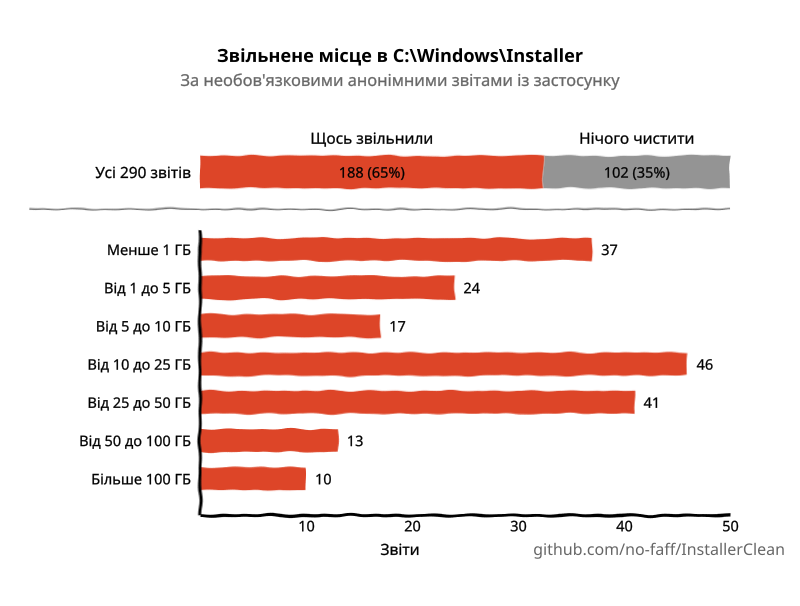
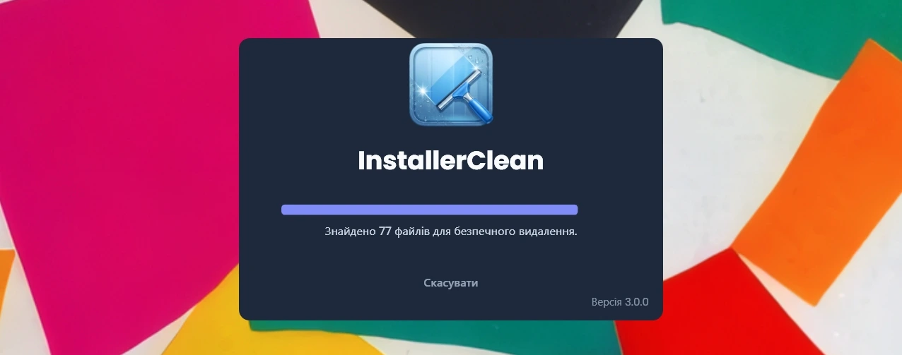
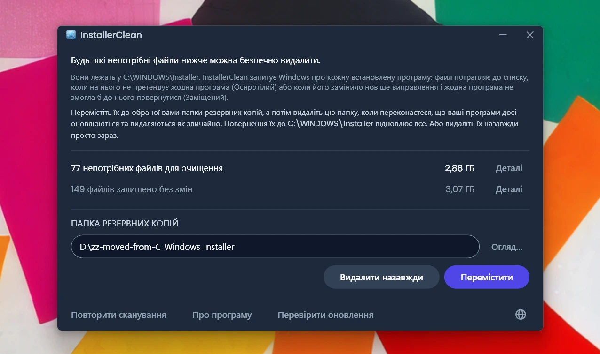
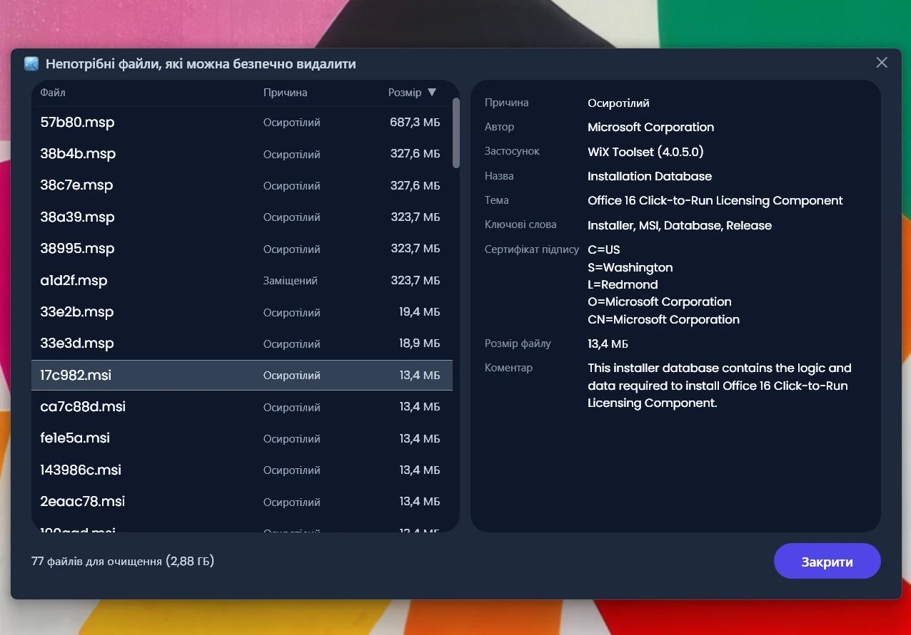
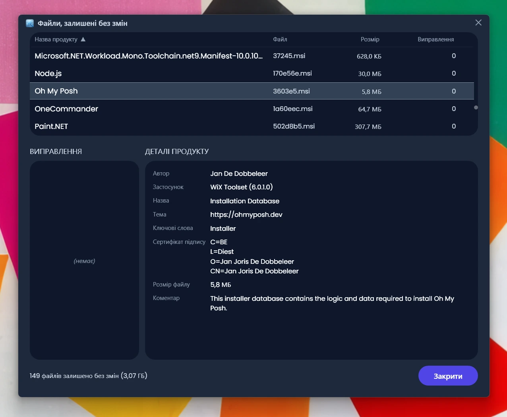
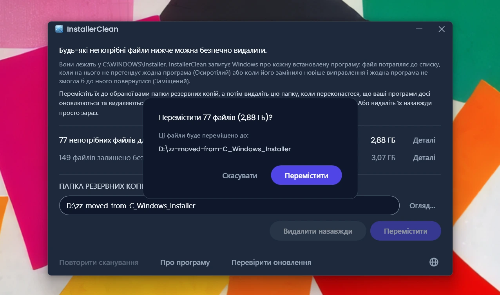
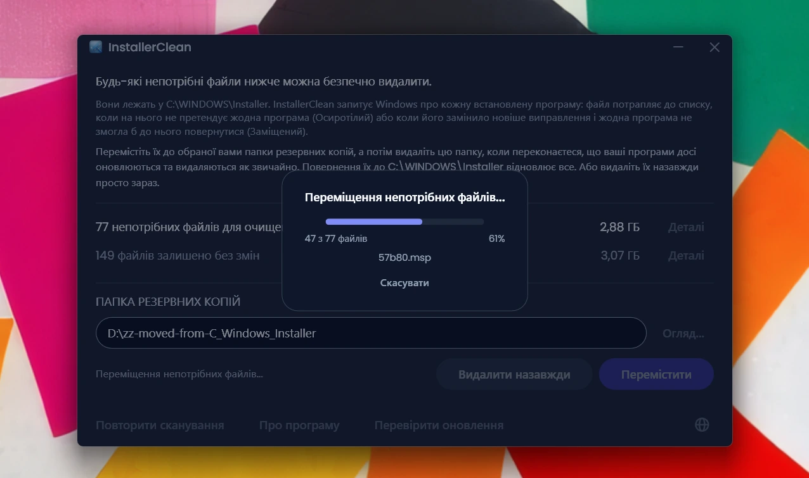
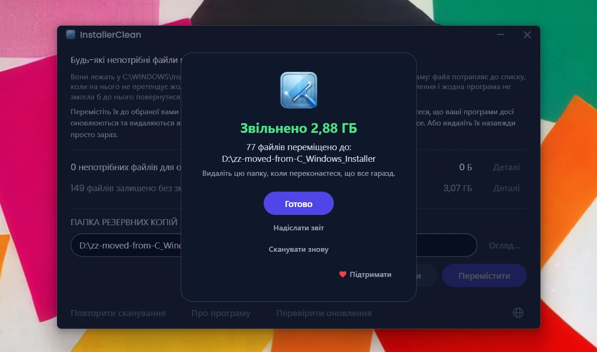

<p align="center">
  <a href="README.md">English</a> · <a href="README.zh-CN.md">简体中文</a> · <a href="README.ru.md">Русский</a> · <a href="README.es.md">Español</a> · <a href="README.ar.md">العربية</a> · <a href="README.ja.md">日本語</a> · <a href="README.pt-BR.md">Português (BR)</a> · <a href="README.pl.md">Polski</a> · <a href="README.tr.md">Türkçe</a> · <a href="README.ko.md">한국어</a> · <a href="README.fr.md">Français</a> · <a href="README.it.md">Italiano</a> · <a href="README.de.md">Deutsch</a> · <a href="README.id.md">Bahasa Indonesia</a> · <a href="README.vi.md">Tiếng Việt</a> · <strong>Українська</strong> · <a href="README.nl.md">Nederlands</a>
</p>

<p align="center">
  
</p>

<p align="center"><em>🎶 What's my line? I'm happy <a href="https://www.youtube.com/watch?v=HM-jHhUZfFI">cleaning Windows</a></em></p>

<h1 align="center">InstallerClean</h1>

<p align="center"><strong>Інструмент з відкритим кодом для безпечного очищення <code>C:\Windows\Installer</code>, прихованої папки Windows, яка тихцем з'їдає місце на вашому диску.</strong></p>

<p align="center"><em>Запускайте вряди-годи. Може, звільните трохи місця. Рушайте далі, чисто й легко.</em></p>

<p align="center">
  <a href="LICENSE"></a>
  <a href="https://dotnet.microsoft.com/download/dotnet/10.0"></a>
  <a href="https://github.com/no-faff/InstallerClean/actions/workflows/ci.yml"></a>
  <a href="https://github.com/no-faff/InstallerClean/releases"></a>
  <a href="https://github.com/no-faff/InstallerClean/releases/latest"></a>
  <a href="https://github.com/no-faff/InstallerClean/releases"></a>
</p>

<a id="reports-stats"></a>

<!-- reports-stats-start chart-only (generated; do not hand-edit between these markers) -->
<p align="center">
  <picture>
    <source media="(prefers-color-scheme: dark)" srcset="docs/reports-uk-dark.svg" />
    <source media="(prefers-color-scheme: light)" srcset="docs/reports-uk-light.svg" />
    
  </picture>
</p>
<!-- reports-stats-end -->

- **Що це:** InstallerClean робить одну річ: видаляє непотрібні файли з `C:\Windows\Installer`, прихованої папки, яка наповнюється, поки ви встановлюєте та оновлюєте програми. Після швидкого сканування він повідомляє, чи є у вас такі файли, показує більше деталей для допитливих і дає змогу перемістити їх деінде або видалити, щоб звільнити місце на диску C:.
- **Можливо, ви тут ось чому:** ви скористалися [WinDirStat](https://github.com/windirstat/windirstat), WizTree чи TreeSize, побачили, як багато місця займає `C:\Windows\Installer`, і не знали, що там усередині. У такому разі InstallerClean — це саме те, що вам потрібно. Він знає, що міститься в тих файлах із випадковими на вигляд іменами на кшталт `9f05cba.msi`, і швидко підкаже, які з них можна безпечно прибрати.
- **Скільки місця:** Діаграма вище показує результати необов'язкових звітів, які потроху надходять починаючи з v1.8.0. (Дякуємо всім, хто натиснув цю кнопку. Без вас діаграми вище не було б.) Серед тих <!-- reports-freedpct-start -->64%<!-- reports-freedpct-end -->, що звільнили місце, медіана звільненого — <!-- reports-median-start -->16,1 ГБ<!-- reports-median-end -->. <!-- reports-biggest-start -->На одній машині звільнилося аж 464 ГБ.<!-- reports-biggest-end --> Решта <!-- reports-nothingpct-start -->36%<!-- reports-nothingpct-end --> не звільнили нічого, тож усе залежить від машини: на чистій інсталяції Windows 11 без додаткових програм видаляти нічого. Найбільше непотрібних файлів буде на машинах, які працюють роками, на всьому, де стоять великі програми на основі MSI (Acrobat, Office, LibreOffice, великі інструменти розробки), і в тих, хто багато встановлює та видаляє програм. Скільки саме у вас, ви побачите тієї ж миті, щойно запустите.
- **Чи це безпечно:** Так. InstallerClean чіпає лише файли в `C:\Windows\Installer`. Він запитує у Windows Installer, що ще потрібно, і читає ті самі записи ще й з реєстру. InstallerClean пропонує файл лише тоді, коли на нього не претендує жодна встановлена тут програма, або коли його замінило новіше виправлення і жодна програма тут не змогла б повернутися до старого. Усе, щодо чого InstallerClean не дістає прямої відповіді, він притримує. [Докладніше нижче](#як-це-працює).
- **Нічого про вас:** Відкритий код (Apache 2.0). Без облікового запису, без реклами, без стеження, без телеметрії, нічого не працює у фоні. Єдине, що InstallerClean робить в інтернеті з власної ініціативи, — під час запуску перевіряє на GitHub, чи немає новішої версії, і це можна вимкнути.
- **Звідки взяти:** [Завантажте найновіший реліз](../../releases/latest). Запустіть; пройдіть через [будь-яке попередження Windows](#unknown-publisher) і [запит на права адміністратора](#admin). Перемістіть або видаліть те, що InstallerClean знайде. Готово.

## Зміст

- [Папка, про яку вам ніхто не розповідає](#папка-про-яку-вам-ніхто-не-розповідає)
- [Пошук допомоги](#пошук-допомоги)
- [Що робить InstallerClean](#що-робить-installerclean)
- [Знімки екрана](#знімки-екрана)
- [Як це працює](#як-це-працює)
- [Завантаження](#завантаження)
  - [Перевірка самого завантаження](#перевірка-самого-завантаження)
- [FAQ](#faq)
- [Командний рядок](#командний-рядок)
- [Доступність](#доступність)
- [Політика підписування коду](#політика-підписування-коду)
- [Приватність](#приватність)
- [Чого InstallerClean не робить](#чого-installerclean-не-робить)
- [Альтернативи](#альтернативи)
- [Якщо колись бракуватиме файлу в C:\Windows\Installer](#recovery)
- [Вимоги](#вимоги)
- [Збирання з вихідного коду](#збирання-з-вихідного-коду)
- [Внесок](#внесок)
- [Підтримати проєкт](#підтримати-проєкт)
- [Історія зірок](#історія-зірок)
- [Ліцензія](#ліцензія)

---

## Папка, про яку вам ніхто не розповідає

На кожному ПК з Windows є прихована папка з назвою `C:\Windows\Installer`. Щоразу, коли ви встановлюєте програму, яка використовує систему Windows Installer, або застосовуєте виправлення до Microsoft Office, Adobe Acrobat, Visual Studio чи будь-якого іншого застосунку на основі `.msi`, копія того інсталятора або файлу виправлення `.msp` потрапляє до цієї папки, і лишається там.

Коли на зміну старішому виправленню приходить новіше, лишаються обидва. Лишаються й інсталятори програм, які ви давно видалили. Очищення диска не чіпає нічого з цього, і Датчик сховища теж. DISM призначений для зовсім іншої папки. З часом папка росте: 1 ГБ, 5 ГБ, 20 ГБ, 50 ГБ. На машинах із великими програмами на основі MSI (Acrobat — частий винуватець) вона може [перевищити 100 ГБ](https://www.reddit.com/r/sysadmin/comments/1oxcrmh/acrobat_filling_up_the_cwindowsinstaller_folder/).

Це не тимчасові файли, що повертаються самі собою. Це справжній мертвий вантаж: старі інсталятори програм, які ви видалили багато років тому, і виправлення, замінені вже по кілька разів. Щойно вони зникають, назад не повертаються.

**Якщо ви шукаєте простий спосіб звільнити місце на диску у Windows, ця папка — гарне місце, щоб почати.** InstallerClean знаходить непотрібні файли й безпечно їх прибирає.

## Пошук допомоги

Якщо ви колись шукали допомоги з цією папкою, то, мабуть, знаєте, як це буває. Хтось зі 180 ГБ у `C:\Windows\Installer` запитує, як її очистити. Йому [радять запустити Очищення диска](https://learn.microsoft.com/en-us/answers/questions/4238108/windows-installer-folder-has-occupied-180gb). Він пробує. Воно звільняє 600 МБ, і жодного байта з тієї папки (бо Очищення диска не чіпає `C:\Windows\Installer`). Гілка стихає.

> *«Усі гілки, які я знаходив, зазвичай радять те саме, що не вирішує проблеми, а потім завмирають.»*
>
> [ksparks519, r/Windows10](https://www.reddit.com/r/Windows10/comments/1bt8c5p/anyone_ever_figure_out_giant_installer_folders/) (перекладено з англійського оригіналу)

Або ж їм радять взагалі її не чіпати. В одній гілці комусь із папкою Installer на 60 ГБ сказали [«не чіпай її»](https://www.reddit.com/r/techsupport/comments/1hw4suq/my_windows_installer_folder_is_like_60gb_so_i/). Коли він запитав, що ж робити натомість, відповідь була: *«Я ж тобі щойно сказав».*

Звичайна порада плутає дві різні речі. Видалення файлів навмання позбавляє вас змоги оновити чи видалити ті програми, яким ці файли належали. Прибирання лише тих файлів, на які не претендує ніщо на машині або які Windows записала як замінені, такого не робить. InstallerClean робить друге.

## Що робить InstallerClean

1. **Сканує** `C:\Windows\Installer` у пошуках файлів `.msi` та `.msp`
2. **Запитує** у Windows Installer, що ще потрібно, і читає ті самі записи ще й з реєстру
3. **Притримує** все, що два читання не можуть узгодити між собою
4. **Каже, скільки ви можете звільнити** і скільки лишає без змін, з необов'язковими вікнами деталей, які перелічують кожен файл
5. **Прибирає непотрібні файли**: перемістіть їх до обраної вами папки резервних копій або видаліть назавжди

## Знімки екрана

<p>
  <br>
  <em>Початкове сканування. Це дуже швидко.</em>
  <br><br>
</p>

<p>
  <br>
  <em>Результати: скільки можна прибрати, скільки залишено без змін.</em>
  <br><br>
</p>

<p>
  <br>
  <em>Деталі файлів, яких можна позбутися: причина, чому кожен із них не потрібен, і що файл каже сам про себе.</em>
  <br><br>
</p>

<p>
  <br>
  <em>Деталі файлів, залишених без змін: програма, якій, за словами Windows, належить кожен із них, і що файл каже сам про себе.</em>
  <br><br>
</p>

<p>
  <br>
  <em>Підтвердження перед будь-якою дією. «Перемістити» робить резервну копію файлів у папці на ваш вибір. Або видаліть їх назавжди.</em>
  <br><br>
</p>

<p>
  <br>
  <em>Переміщення триває. На той самий диск воно миттєве. На інший диск — що більше гігабайтів, то довше.</em>
  <br><br>
</p>

<p>
  <br>
  <em>Готово. Місце повернуто. Файли лежать у резервній копії, доки ви не переконаєтеся, що все гаразд. Тоді видаліть папку резервних копій.</em>
  <br><br>
</p>

<p>
  <br>
  <em>Після повторного сканування. Прибирати більше нічого.</em>
  <br><br>
</p>

<a id="is-it-safe"></a>
## Як це працює

Коли Windows Installer встановлює програму, він зберігає копію інсталятора в `C:\Windows\Installer`, а коли до програми реєструється виправлення, він так само зберігає його копію. Саме з цих копій він працює, коли пізніше відновлює, оновлює чи видаляє програму, і саме тому вони лишаються там ще довго після того, як встановлення завершилося. Обидва види копій опиняються в цій папці: інсталятори `.msi`; і виправлення `.msp`, які оновлюють програму, що у вас уже є, а не замінюють її.

InstallerClean пропонує файл з однієї з двох причин.

**Осиротілий** означає, що на файл не претендує ніщо на машині. Жоден встановлений продукт і жодне зареєстроване виправлення не називають цього файлу.

**Заміщений** означає, що Windows записала, що це виправлення замінене новішим, і все одно лишила файл. Виправлення видаляється лише тоді, коли видалено кожну програму, до якої воно зареєстроване, або коли його знято з усіх них. Заміна новішим не є ні тим, ні тим, тож файл лишається. Adobe Acrobat у Windows працює саме так: його оновлення приходять як виправлення до початкової інсталяції, а не як нові інсталятори, тож на машині, де він стоїть уже якийсь час, їх може лежати кілька.

InstallerClean визначає ці дві причини з протилежних боків, і зазирати в саму папку доводиться лише для першої з них.

**Перелік папки.** InstallerClean перелічує файли `.msi` та `.msp`, які лежать безпосередньо в `C:\Windows\Installer`. У підпапки він не заходить.

**Читання записів, двічі.** Він запитує у Windows Installer про кожен встановлений продукт і кожне зареєстроване виправлення, а також про кешований файл, що його називає кожен із них, звертаючись до Windows Installer API в `msi.dll`. Потім InstallerClean читає ті самі записи в інший спосіб, просто з реєстру, бо запит може повернути неповний результат і не сказати про це: Windows віддає записи по одному, доки не повідомить, що більше немає, а запуск, який спинився на третьому з двохсот, виглядає точно так само, як той, що дійшов до кінця. Ключ реєстру віддає весь свій список імен одразу, тож короткий список не може виглядати повним. Кожен продукт, названий у реєстрі й пропущений запитом, потім подається назад до Windows на ім'я, по одному. Це друге читання може лише перемістити файл на бік «ще потрібних». Немає шляху, яким воно могло б додати файл до списку на видалення.

**Зіставлення запису з його файлом.** Запис називає свій кешований файл як шлях, і в різних записах та сама папка не завжди записана однаково. Тож замість того щоб довіряти написанню, InstallerClean запитує у Windows, куди насправді вказує кожен записаний шлях, і порівнює це з файлами, які він перелічив у папці. Усе, на що досі ніхто не претендує, проходить друге порівняння, яке зовсім не спирається на імена: він відкриває файл і просить Windows його ідентифікувати, щоб два різні імена того самого файлу були розпізнані як один файл.

**Записи, які не вдається зіставити.** Якщо Windows не каже, куди вказує записаний шлях, або якщо файл у кінці такого шляху не вдається ідентифікувати, InstallerClean не знає, про який файл ішлося в тому записі, і ним міг би бути будь-який із перелічених файлів. Те саме випливає, якщо програму могли встановити більше ніж один раз, бо тоді він не може сказати, який кешований файл належить якій копії. У будь-якому з цих випадків він того разу не пропонує нічого з того, що знайшов, перелічуючи папку. Запис, який вказує на файл, що вже зник, — це інша річ: не лишилося нічого, що цей запис міг би означати, тож він не може стосуватися жодного з файлів, які ще є в папці.

**Запит з іншого кінця.** Осиротілість визначається відсутністю, а відсутність може також означати, що застосунок не зміг знайти запис. Тож перед тим, як запропонувати інсталятор `.msi`, InstallerClean відкриває файл, читає код продукту, який несе сам файл, і запитує у Windows, чи цей продукт встановлено. Якщо встановлено, файл лишається, хоч би що знайшла решта сканування. Ця перевірка може лише зняти файл зі списку. Жодна її відповідь не може додати файл до нього.

**Що вирішує долю виправлення `.msp`.** Виправлення не відкривають, щоб спитати, якій програмі воно належить. Натомість справу вирішує те, що реєстрація виправлення називає свій кешований файл у двох місцях: серед виправлень, зареєстрованих до кожного продукту; і в єдиному списку реєстру з усіма реєстраціями виправлень на машині. Виправлення пропонується як осиротіле лише тоді, коли жодне з цих двох місць не називає його кешованого файлу.

**Чим відрізняється заміщене виправлення.** Воно не проходить нічого з наведеного вище, бо це не файл, на який ніхто не претендує. Windows має запис про нього, і саме цей запис каже, що його замінено. Ризик тут інший: виправлення може бути зареєстроване до кількох програм, а закінчила з ним лише одна з них. Тож заміщене виправлення пропонується лише тоді, коли Windows записала, що його не можна видалити, коли опитано кожну програму, до якої воно зареєстроване, коли в жодній із них воно вже не застосоване і коли жодна з них не тримає виправлення, яке, за словами Windows, можна видалити. Останнє з цього є тут тому, що скасування виправлення в програмі може потягнутися назад по старіший файл. Якщо на щось із цього немає відповіді, файл лишається.

<details>
<summary>Виклики Windows Installer, які тут використано</summary>

- `MsiEnumProductsEx`, щоб перелічити кожен встановлений продукт, і ще раз, з одним кодом продукту, щоб спитати, чи встановлено конкретний продукт
- `MsiEnumPatchesEx`, щоб перелічити зареєстровані виправлення, і для кожного продукту, і на всій машині
- `MsiGetProductInfoEx`, щоб прочитати, як продукт називається, який кешований файл він називає і чи є він однією з кількох інсталяцій того самого продукту
- `MsiGetPatchInfoEx`, щоб прочитати, у якому стані виправлення, чи може Windows його видалити і який кешований файл воно називає
- `MsiGetSummaryInformation` і `MsiSummaryInfoGetProperty`, щоб прочитати з файлу виправлення, до яких програм воно застосовне
- `MsiOpenDatabase`, `MsiDatabaseOpenView`, `MsiViewExecute`, `MsiViewFetch` і `MsiRecordGetString`, щоб прочитати код продукту, оголошений у самому файлі інсталятора

</details>

Попри все сказане, програма радить вам перемістити файли до папки резервних копій (на іншому диску чи розділі, якщо ви хочете звільнити місце на C). Так ви матимете змогу переконатися, що все справді гаразд, перш ніж остаточно видалити непотрібні файли.

## Завантаження

Три збірки, оберіть одну:

- **Portable** (`InstallerClean-3.0.0-portable.exe`): один файл із середовищем виконання .NET 10 усередині. Без встановлення, без деінсталятора: клацніть двічі, і він запуститься. Лишіть файл десь на наступний раз або видаліть, коли закінчите.
- **Setup** (`InstallerClean-3.0.0-setup.exe`): звичайний інсталятор Windows із вбудованим середовищем виконання .NET 10. Додає запис у меню «Пуск» і чисто видаляється. Акуратно складений серед програм, щоб його легко було знайти за півроку, або щоб запускати частіше, якщо ви багато встановлюєте та видаляєте програм.
- **CLI** (`installerclean-cli.exe`): версія для командного рядка окремо, один файл із середовищем виконання всередині. Без встановлення, без деінсталятора. Закиньте її на клієнт, виконайте сканування чи очищення, видаліть. Створено для скриптування, запланованих завдань і масового розгортання, коли вам потрібні операції без застосунку з графічним інтерфейсом на клієнті. Див. [Командний рядок](#командний-рядок) щодо аргументів і кодів виходу.

Починаючи з 2.2.0, імена файлів встановлювача та портативної версії містять номер версії, тож завантажена копія завжди каже, що вона таке; інструмент командного рядка зберігає просте ім'я `installerclean-cli.exe`, щоб заплановані завдання та скрипти, які на нього вказують, працювали й після оновлень.

Завантажте зі [сторінки релізів](../../releases/latest), а потім запустіть. Програма не підписана, тож Windows показує попередження про «невідомого видавця»; [FAQ](#unknown-publisher) пояснює, що ви побачите і чому це безпечно.

Програма сканує автоматично під час запуску. Перегляньте результати, а потім натисніть **Перемістити** або **Видалити назавжди**.

Або встановіть через [winget](https://learn.microsoft.com/windows/package-manager/winget/):

```
winget install NoFaff.InstallerClean
```

Або встановіть через [Scoop](https://scoop.sh):

```
scoop install installerclean
```

### Перевірка самого завантаження

InstallerClean не підписано. Ось що ви можете перевірити, перш ніж його запускати:

- Хеш SHA-256 кожного завантаження є на сторінці його релізу.
- VirusTotal: кожну збірку скановано перед випуском, а сторінка релізу містить повний результат за кожним рушієм для кожного завантаження.
- Вихідний код тут, на [github.com/no-faff/InstallerClean](https://github.com/no-faff/InstallerClean). Служби сканування, запиту, переміщення, видалення, налаштувань і перевірки очікуваного перезавантаження покриті автоматизованим набором тестів, який виконується у Windows на кожен push до `main` і на кожен pull request, а значок CI вгорі цієї сторінки повідомляє результат.
- Релізні збірки детерміновані: той самий вихідний код, той самий SDK і ті самі прапорці публікації дають ті самі байти, а реліз не можна позначити тегом, якщо кожен вхідний елемент збірки не збігається з вихідним кодом на тому тегу. Тож ви можете перемкнутися на тег, зібрати все самотужки й звірити хеші з оприлюдненими. У примітках до кожного релізу є все потрібне для цього: версія SDK, з якою його зібрано, і прапорці публікації для будь-якого завантаження, зібраного не з типовими налаштуваннями. Виняток — Setup: його компілює Inno Setup, а не SDK, і він вкарбовує в себе рік збірки, тож щоб відтворити його хеш, потрібні ще й та сама версія Inno і той самий календарний рік.
- <!-- downloads-start -->79 000+<!-- downloads-end --> завантажень через GitHub, MajorGeeks і Softpedia.
- [MajorGeeks](https://www.majorgeeks.com/files/details/installerclean.html) перевіряє кожну подачу у віртуальній машині й додає її до каталогу лише після проходження перевірки.<br><a href="https://www.majorgeeks.com/files/details/installerclean.html"></a>
- [Softpedia](https://www.softpedia.com/get/System/Hard-Disk-Utils/InstallerClean.shtml) перевірила його й засвідчила, що він не містить шпигунського, рекламного ПЗ і вірусів.<br><a href="https://www.softpedia.com/get/System/Hard-Disk-Utils/InstallerClean.shtml"></a>

## FAQ

<a id="admin"></a>

**Чому InstallerClean вимагає прав адміністратора?** Дві причини. `C:\Windows\Installer` закрита для всіх, крім адміністраторів, тож і читання папки, і запити до Windows Installer, і переміщення чи видалення файлів потребують таких прав. А ще адміністратор може питати Windows про програми, встановлені під будь-яким обліковим записом на машині, а неадміністратор не може: запустіть без цих прав, і Windows скаже, що програма не встановлена, хоча вона встановлена, саме всередині перевірки, яка вирішує, чи файл ще потрібен.

<a id="unknown-publisher"></a>

**Чому Windows каже «Невідомий видавець»?** InstallerClean не має цифрового підпису, а Windows позначає файли, завантажені з інтернету, тож під час першого запуску SmartScreen зазвичай показує «Система Windows захистила ваш комп'ютер», а видавця подає як невідомого. Платний сертифікат для підписування щороку коштує грошей, і я радше залишу програму безкоштовною, ніж платитиму за нього, тож я подав заявку до SignPath Foundation, яка підписує програмне забезпечення з відкритим кодом безкоштовно, і InstallerClean прийняли (див. [Політику підписування коду](#політика-підписування-коду)). Сертифікат ще не видано, тож поки що натисніть **Докладніше**, а потім **Виконати в будь-якому випадку**. Це безпечно: вихідний код відкритий, і кожен реліз має посилання на VirusTotal та хеші SHA-256, які можна перевірити заздалегідь.

**Чи працює InstallerClean на Windows 7 або 8?** Ні. Йому потрібна Windows 10 версії 1607 або новіша — найстаріша збірка, яку підтримує середовище виконання .NET 10. Setup відмовляється встановлюватися на щось старіше, а портативна збірка не запуститься.

## Командний рядок

`installerclean-cli.exe` — це окремий консольний виконуваний файл, який встановлюється поруч із графічним інтерфейсом. Те саме сканування, те саме переміщення, те саме видалення, без вікна. Він блокує командний рядок, доки не завершиться, тож скрипт або заплановане завдання може його дочекатися.

### Прапорці

| Прапорець | Що він робить | Також приймає |
|---|---|---|
| `/s` | Лише сканувати. Перелічує те, що прибрав би, з іменем, розміром і причиною для кожного. Нічого не змінює. | |
| `/d` | Просканувати, а потім видалити непотрібні файли назавжди. | |
| `/m` | Просканувати, а потім перемістити їх до папки, збереженої в графічному інтерфейсі. | |
| `/m ШЛЯХ` | Просканувати, а потім перемістити їх за шляхом `ШЛЯХ`. Візьміть його в лапки, якщо в ньому є пробіл. | |
| `--help` | Вивести довідку і завершитися з кодом `0`. | `/?`, `-h` |
| `--version` | Вивести версію і завершитися з кодом `0`. | `-v` |

Прапорці нечутливі до регістру, тож `/S` і `/D` працюють так само, як `/s` і `/d`. Лише один прапорець на запуск: їх не можна поєднувати, а після `/s` і `/d` нічого не ставиться.

Запустіть без аргументу, і `installerclean-cli` виведе довідку та завершиться з кодом `1`, тож заплановане завдання, що загубило свій прапорець, помітно зазнає невдачі, а не тихо нічого не зробить. Нерозпізнаний прапорець дає рядок помилки, потім довідку, і теж завершується з кодом `1`. Не взятий у лапки шлях для переміщення, у якому є пробіл, відхиляється так само, а не обрізається мовчки, і повідомлення каже вам узяти його в лапки.

### Коди виходу

Це коди, які сам інструмент документує в `--help`:

| Код | Означає |
|---|---|
| `0` | Успіх. Запуск зробив те, про що його просили, і ніщо не зазнало невдачі. |
| `1` | Нічого не оброблено. Запуск зазнав невдачі або був відхилений. |
| `2` | Частково. Щось оброблено, щось ні, зокрема Ctrl+C посеред роботи. |
| `75` | Тимчасово. Запуск заблокувала тимчасова умова; виведене повідомлення каже, яка саме. |
| `130` | Скасовано через Ctrl+C, перш ніж щось було оброблено. |

`1` охоплює і відмову, і невдачу, а відмова — це не хиба: і просто заповнене місце призначення, і значення реєстру, яке програма не змогла прочитати, перш ніж щось чіпати, потрапляють сюди. `0` означає, що ніщо не зазнало невдачі, а не те, що нічого не лишилося: `--help`, `--version` і запуск лише зі скануванням завершуються з кодом `0` незалежно від того, чи сканування знайшло шістдесят вісім файлів, чи жодного.

### Журнал подій

Кожен запуск пише запис про результат до журналу програм і може додати поруч одне чи кілька повідомлень. Ідентифікатор події — це стабільний машинний контракт, тож RMM може фільтрувати за номером, не розбираючи жодного тексту:

| ID | Означає |
|---|---|
| `1000` | Успіх |
| `1002` | Частково |
| `2000` | Пропущено, тимчасова умова |
| `4000` | Серйозна невдача |
| `3000` | Повідомлення: сканування не змогло охопити кожен встановлений продукт |
| `3001` | Повідомлення: у папці бракує файлів, яких Windows очікує |
| `3002` | Повідомлення: файли було притримано, а не запропоновано |

Діапазон `3000` — це повідомлення, а не результат, і як результат запуску не рахується. Тип запису інформаційний, коли із запуском нічого не пішло не так, і попереджувальний, коли пішло. **Журнал подій завжди англійською**, хоч би якою була мова інтерфейсу машини, тож пошук за відомою фразою має стабільну ціль. Перекладено саме консоль: вона йде за мовою самої машини, а розміри й дати подає за її регіоном.

### Рецепти

Аудит у файл, нічого не змінюючи:

```
installerclean-cli /s > audit.txt
```

Щомісячне переміщення до `D:\InstallerBackup`, коли CLI лежить у `C:\Tools`:

```
schtasks /create /tn "InstallerClean monthly" /tr "C:\Tools\installerclean-cli.exe /m D:\InstallerBackup" /sc monthly /ru SYSTEM /rl highest
```

Завдання чекає, доки запуск завершиться, і записує код виходу як «Результат останнього запуску», тож RMM може орієнтуватися на наведені вище коди.

З PowerShell:

```powershell
& 'C:\Tools\installerclean-cli.exe' /m D:\InstallerBackup
switch ($LASTEXITCODE) {
    0       { 'Чисто' }
    2       { 'Частково, перевірте вивід' }
    75      { 'Заблоковано, спробуйте пізніше' }
    default { "Не вдалося ($LASTEXITCODE)" }
}
```

### Перш ніж писати скрипт

- **Йому потрібні підвищені права.** Геть усьому, `/s` теж. З командного рядка без підвищених прав Windows відмовляється його запускати й віддає вашій оболонці `740`.
- **Папка, збережена в графічному інтерфейсі, своя в кожного користувача.** Завдання, що виконується від імені SYSTEM або облікового запису служби, її не побачить, тож таким запускам треба передавати `/m ШЛЯХ`.
- **SYSTEM виходить у мережу як обліковий запис комп'ютера**, тож місце призначення на кшталт `\\server\share` потребує прав, наданих саме цьому запису.
- **`/s` ніколи не блокує.** Він лише читає і не бере блокування, тож можна сканувати, поки відкрито застосунок з графічним інтерфейсом. `/d` і `/m` беруть блокування на всю машину і завершуються з кодом `75`, якщо його тримає інший запуск InstallerClean.
- **Усе йде до stdout**, зокрема й помилки; потоку stderr немає. Орієнтуйтеся на код виходу, а не розбирайте текст.
- **Переміщення відмовляє, а не перейменовує.** Якщо в місці призначення вже є файл із таким іменем, той файл лишається в кеші й називається у виводі, а решта пакета переміщується. Запуск, у якому стикається кожен файл, не обробляє нічого й завершується з кодом `1`.
- **Папку резервних копій ніщо не спорожнює.** `/m` тільки додає. Прибирати в ній доведеться вам самим.
- **`taskkill /pid` не є коректним скасуванням.** Блокування єдиного екземпляра відновлює наступний запуск.
- **Перший запуск реєструє джерело журналу подій**, у `HKLM\SYSTEM\CurrentControlSet\Services\EventLog\Application\InstallerClean`. Лишіть його там: «Перегляд подій» читає опис запису через його джерело, тож прибирання джерела перетворює кожен запис, який інструмент уже написав, на помилку невідомого джерела.

### Чому `installerclean-cli`, а не `installerclean.exe`

`InstallerClean.exe` — це вікно, і воно ігнорує аргументи командного рядка. `installerclean-cli.exe` — це справжній консольний процес, тож він блокує командний рядок, доки не завершиться, а його вивід перенаправляється і передається конвеєром, як у будь-чого іншого. Setup встановлює обидва. Завантаження Portable — це лише графічний інтерфейс; завантажте `installerclean-cli.exe` окремо зі [сторінки релізів](../../releases/latest), якщо вам потрібен командний рядок без вікна.

## Доступність

InstallerClean створено так, щоб ним можна було повністю користуватися з клавіатури та з програмою зчитування з екрана.

- **Повне керування з клавіатури.** Усе, що робить програма, досяжне з клавіатури, і стовпці у вікнах із деталями теж сортуються з клавіатури, тож тут нічого не потребує миші. Кнопки в рядку заголовка поводяться так само, як у Windows, і досяжні через Alt+Space чи Alt+F4. Фокус клавіатури лишається видимим, хоч би де він опинявся.
- **Екранний диктор і Голосовий доступ.** Кожен елемент керування має підпис, а видиме слово на кнопці — це те саме слово, яке активує її голосом. Коли переміщення чи видалення завершується, результат озвучується вголос.
- **Зроблено для читання.** Текст відповідає контрастності WCAG AA в усій темній темі.

Якщо щось тут вам заважає, [створіть issue](../../issues). Проблеми з доступністю — це помилки, а не граничні випадки.

## Політика підписування коду

InstallerClean прийнято до [SignPath Foundation](https://signpath.org) на безкоштовне підписування коду. Це програма, яка підписує програмне забезпечення з відкритим кодом, щоб воно перестало потрапляти на ваш комп'ютер від невідомого видавця. Сам сертифікат ще не видано, тож завантаження тут сьогодні не підписані й Windows про них попереджатиме.

Щойно його буде видано, кожен реліз нестиме рядок, про який просить SignPath: «free code signing provided by SignPath.io, certificate by SignPath Foundation». Сертифікат належить фондові, а не мені, бо сертифікат мусить бути виданий юридичній особі, а проєкт однієї людини нею не є. Це не означає, що InstallerClean їхній або що вони причетні до нього поза підписуванням.

**Ролі.** InstallerClean веде одна людина. Ті, хто вносить код, і ті, хто його рецензує, тобто хто може додавати код до проєкту: я. Ті, хто затверджує, тобто хто може дозволити підписати реліз: я.

## Приватність

Необов'язковий звіт — це єдине, що взагалі надсилає щось про запуск, і звіт іде, лише коли ви натиснете кнопку. У ньому сказано, що знайшло сканування, що воно притримало і чому, чи ви перемістили, чи видалили, скільки місця це звільнило, скільки часу це зайняло і що не вдалося, а також версія програми, мова, якою ви її читаєте, і ваша версія Windows. Жодних імен файлів, жодних імен папок, жодного імені облікового запису, нічого, що ідентифікує вашу машину, і нічого, що могло б пов'язати два звіти між собою. Саме так я дізнаюся, чи програма працює і що вона притримує, не лише на моїй власній машині.

Ні реклами, ні телеметрії. Єдині інші з'єднання — це перевірка версії під час запуску програми (один запит до GitHub, який можна вимкнути у вікні «Про програму») і кнопки з посиланнями на GitHub та на сторінку, де можна зробити пожертву, якщо вам того захочеться. Повна [політика приватності](PRIVACY.md) (англійською).

## Чого InstallerClean не робить

- WinSxS (`C:\Windows\WinSxS`) — це інша папка з іншими правилами. Для неї запустіть `Dism /Online /Cleanup-Image /StartComponentCleanup` з командного рядка з підвищеними правами.
- Жодної фонової служби, жодного запланованого завдання, жодного автоочищення. Програма працює тоді, коли ви її запускаєте.
- Вона не змінює ні встановлені програми, ні базу даних Windows Installer, а лише читає їх. Єдине, що програма взагалі записує до реєстру, — це одноразова реєстрація джерела подій, потрібна інструменту командного рядка, щоб його запуски з'являлися в журналі подій Windows.
- Сама, без вашої участі, програма встановлює лише один вид з'єднання: під час запуску швидко дивиться на сторінці релізів GitHub, чи немає новішої версії, і це можна вимкнути у вікні «Про програму». Усе інше відбувається лише тоді, коли ви цього забажаєте: необов'язковий анонімний звіт (числа про запуск, нічого, що називає вас чи ваші файли) і посилання на документацію в GitHub та сторінку пожертв, які відкриваються у вашому браузері, якщо ви на них натиснете. Сама вона нічого не завантажує.
- Жодних панелей інструментів, жодного стороннього ПЗ у комплекті, жодного рекламного ПЗ.

## Альтернативи

Якщо ви вже шукали цю папку раніше, найімовірніше, ви натрапили на [PatchCleaner](https://www.homedev.com.au/free/patchcleaner). Він робив цю роботу першим, робив її десятиліття до того, як з'явився InstallerClean, і тримається досі. InstallerClean не існував би без нього.

Я зробив InstallerClean, бо PatchCleaner має закритий код, не оновлювався з березня 2016 року і за замовчуванням виключає файли Adobe. Для цього виключення є поважна причина, і HomeDev прямо сказали про це в тогочасних примітках до релізу:

> *«У попередніх версіях є відома проблема: PatchCleaner помилково визначає виправлення Adobe Acrobat Reader як непотрібні. Adobe робить в автоматичному оновленні щось своє, пропрієтарне, тож якщо PatchCleaner прибирає „осиротілі“ виправлення з каталогу інсталятора, автоматичні оновлення Adobe Reader більше не встановлюються успішно.»*
>
> [Примітки до релізу PatchCleaner, версія 1.4.0.0](https://www.homedev.com.au/free/patchcleaner) (перекладено з англійського оригіналу)

Фільтр, який додали разом із цим, шукає слово «Acrobat» у метаданих файлу та в його підписі. На машинах, де Acrobat — найбільший винуватець, це може бути більша частина місця:

> *«Я завантажила PatchCleaner, щоб видалити осиротілі файли .msp, але, схоже, це звільнить лише 250 МБ. 29 ГБ файлів „виключено фільтрами“, тож PatchCleaner, здається, не допомагає.»*
>
> HeatherBunny1111, [r/techsupport](https://www.reddit.com/r/techsupport/comments/1qc4tcf/how_to_delete_msp_files_safely/) (перекладено з англійського оригіналу)

Різниця між двома інструментами тут у тому, що саме кожен із них питає у Windows, а не в розбіжності поглядів на Adobe. Windows веде список *застосованих* виправлень продукту, і в тому списку немає тих, які замінило новіше виправлення, тож інструмент, що читає цей список, натрапляє на файл заміщеного виправлення як на файл, на який ніхто не претендує, так само як на будь-який інший. Саме фільтр виключення ловить файли Adobe за іменем. InstallerClean натомість питає Windows про стан виправлення, тож заміщене виправлення приходить уже позначеним як таке, і його долю вирішує те, що Windows про нього записала, а не те, що каже його ім'я. Ось як ці два інструменти порівнюються:

| | **InstallerClean** | **PatchCleaner** |
|---|---|---|
| Останнє оновлення | 2026 (активний) | 3 березня 2016 |
| Вихідний код | Відкритий код (Apache 2.0) | Закритий код |
| Середовище виконання | .NET 10 (самодостатнє) | .NET Framework 4.5.2 + VBScript |
| API | Windows Installer API в `msi.dll` (у процесі) | Windows Installer COM (поза процесом, через VBScript) |
| Заміщені виправлення | Визначаються із записів Windows про виправлення | Не відрізняються від файлів, на які ніхто не претендує |
| Файли Adobe | Заміщені виправлення виявляються й позначаються | Виключені фільтром за іменем, увімкненим за замовчуванням |

> **Примітка про `Win32_Product`:** Поширений, але хибний підхід до перелічення встановлених продуктів — це `Win32_Product` (WMI), який [запускає операції відновлення MSI](https://gregramsey.net/2012/02/20/win32_product-is-evil/) для кожного продукту під час перелічення. І InstallerClean, і PatchCleaner його уникають. InstallerClean звертається до Windows Installer API в `msi.dll`; PatchCleaner запускає допоміжний скрипт, що звертається до COM-об'єкта Windows Installer. Той скрипт називається `WMIProducts.vbs`, через що здається інакше, але цей файл — власний зразковий скрипт Microsoft із правкою, і він звертається до Windows Installer, а не до WMI. Ім'я — єдине, що в ньому оманливе.

Очищення диска, Датчик сховища, CCleaner і BleachBit не очищають `C:\Windows\Installer`.

<a id="recovery"></a>
## Якщо колись бракуватиме файлу в `C:\Windows\Installer`

Якщо у вас таки бракує файлу в тій папці, програма, якій він належав, і далі працює нормально. Але коли ви спробуєте оновити чи видалити цю програму, це, найімовірніше, не вдасться. Windows іде шукати файл, не знаходить його, і крок зупиняється.

Уся мета InstallerClean у тому, щоб пропонувати перемістити чи видалити лише *непотрібні* файли, але застосунок таки помічає, коли файлу бракує, тож позначає кожен такий файл, що його знайде, трикутником попередження й посиланням сюди. Ось що робити, щоб спробувати відновити програму:

- Дізнайтеся номер версії встановленої програми (Налаштування, Програми, Інстальовані програми)
- Завантажте інсталятор **саме тієї версії** у виробника програми. Новіший не спрацює, і видалення програми спершу теж: обидва мусять прибрати те, що встановлено, перш ніж рушити далі, а саме це прибирання і є кроком, якому потрібен відсутній файл.
- Запустіть той інсталятор
- Це має відновити файл і не зачепити ваші налаштування. Проскануйте в InstallerClean ще раз, і якщо спрацювало, попередження зникне.

Утім, Microsoft не гарантує, що це спрацює. Далі йде її власний, докладніший виклад:

<details>
<summary>Докладніша позиція Microsoft</summary>

*Наведені нижче цитати Microsoft подано в англійському оригіналі.*

Повний посібник: [Restore missing Windows Installer cache files](https://learn.microsoft.com/en-us/troubleshoot/windows-client/application-management/missing-windows-installer-cache), KB 2667628.

*Це може проявитися не одразу:*
> "If the installer cache is compromised, you may not immediately see problems until you take an action such as uninstalling, repairing, or updating a product."

*Файли унікальні для кожного комп'ютера, тож скопіювати потрібний з іншого ПК не вийде:*
> "Missing files cannot be copied between computers because the files are unique."

*Якщо у вас є резервна копія, зроблена до того, як файл зник, Microsoft перелічує чотири шляхи, саме в такому порядку:*
> - System Restore points (available only on client operating systems)
> - Restoreable system state backup
> - Failure recovery methods that can restore the full system state backup
> - Reinstallation of the operating system and all applications

*І застереження до всіх чотирьох. Ідеться про резервну копію системи, а не про папку, куди ви самі перемістили файли: ті можна просто скопіювати назад, підтвердивши запит адміністратора, який Windows показує, коли ви копіюєте в цю папку.*
> "To restore the missing files, a full system state restoration is required. It is not possible to replace only the missing files from a previous backup."

*Рекомендований спосіб відновлення і його суворі межі:*
> "If application files are missing from the Windows Installer Cache, ask the vendor or support team for the application about the missing files. You must follow the procedures or steps recommended by the application vendor to restore the files. In some cases, you may have to rebuild the operating system and reinstall the application to fix the problem."
>
> "Windows support engineers cannot help you recover missing application files from the Windows Installer cache."

</details>

Якщо InstallerClean колись виявиться причиною того, що файлу бракує, я хочу про це знати. [Створіть issue](../../issues), і я це виправлю.

## Вимоги

- Windows 10 (версія 1607 / збірка 14393 або новіша, найстаріша, яку підтримує середовище виконання .NET 10) або Windows 11
- 64-розрядна Windows. Setup не встановиться на 32-розрядну й скаже вам про це.
- Права адміністратора, для Setup і для самої програми (`C:\Windows\Installer` доступна лише адміністраторам)

Див. [Завантаження](#завантаження) щодо варіантів збірок Setup, Portable та CLI.

## Збирання з вихідного коду

```
git clone https://github.com/no-faff/InstallerClean.git
cd InstallerClean
dotnet build src/InstallerClean.sln
```

Запустіть тести:

```
dotnet test src/InstallerClean.Tests/
```

## Внесок

Знайшли помилку чи маєте пропозицію? [Створіть issue](../../issues) або розпочніть [обговорення](../../discussions). Pull requests вітаються. Будь ласка, запустіть `dotnet test` перед поданням.

InstallerClean доступний 16 мовами, і кожна охоплює його цілком: сам застосунок, інсталятор, командний рядок і цей README. У застосунку, інсталяторі та командному рядку японську й нідерландську повністю надали coolvitto і RijckAlex, а італійська — це мій власний машинний переклад, виправлений і схвалений bovirus, усі троє носії мови; решта — мої власні машинні переклади. Кожен README — мій власний, усіма мовами. Я вклав у них багато зусиль, але бездоганні вони не будуть, і я вирішив випустити їх як є, а не тримати, доки носій мови зможе перевірити кожен. Якщо ви знаєте англійську й одну з цих мов і помітите щось, що можна покращити, я буду радий про це почути, в [issue](../../issues/new?template=translation_review.md), pull request чи [обговоренні](../../discussions).

## Підтримати проєкт

Якщо InstallerClean звільнить трохи місця і вам буде не шкода, я буду дуже вдячний за [невелику пожертву](https://nofaff.netlify.app/support). У застосунку є кнопка ❤️, яка веде туди ж. Будь-яка сума буде прийнята з вдячністю. Щиро дякую всім, хто вже пожертвував. Це була величезна робота, і я радий, що вона була не марна.

## Історія зірок

<picture>
  <source media="(prefers-color-scheme: dark)" srcset="docs/star-history-dark.svg" />
  <source media="(prefers-color-scheme: light)" srcset="docs/star-history-light.svg" />
  
</picture>

## Ліцензія

[Apache 2.0](LICENSE)

---

🎶 [George Formby - When I'm Cleaning Windows](https://www.youtube.com/watch?v=P183Uo5Ust4). Насолоджуйтесь!
