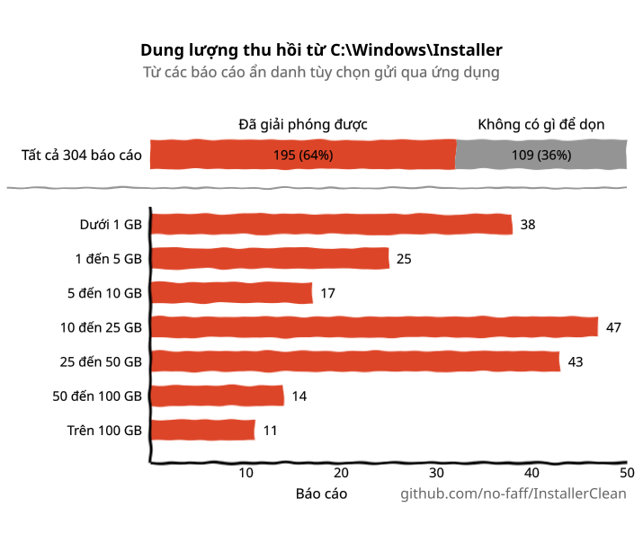
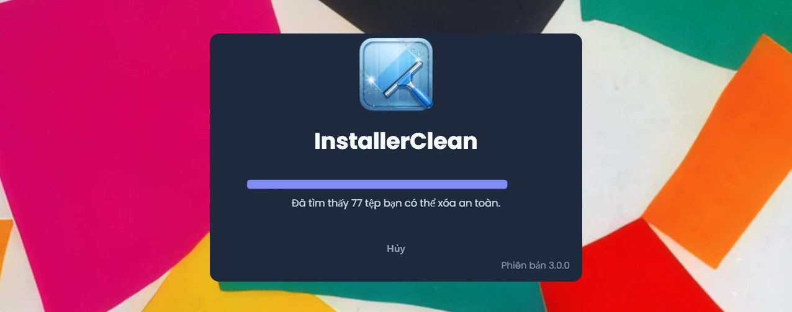
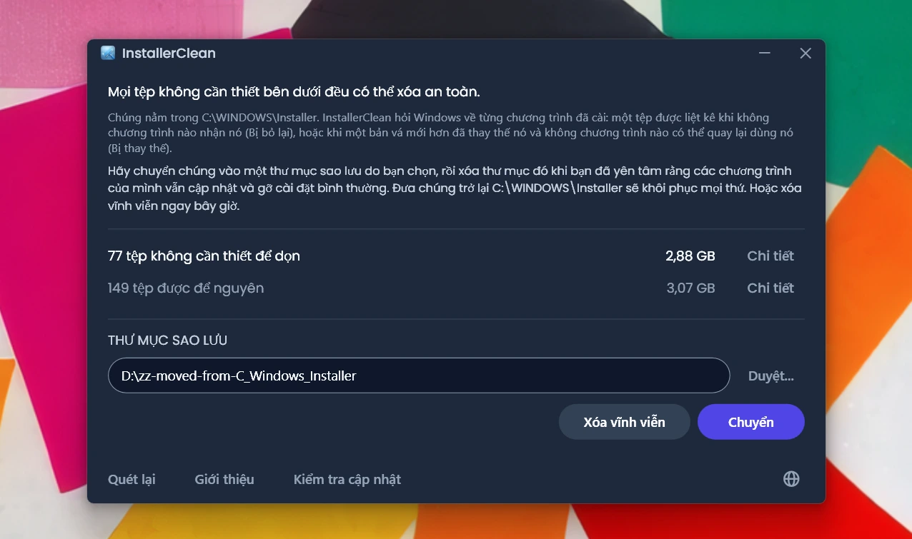
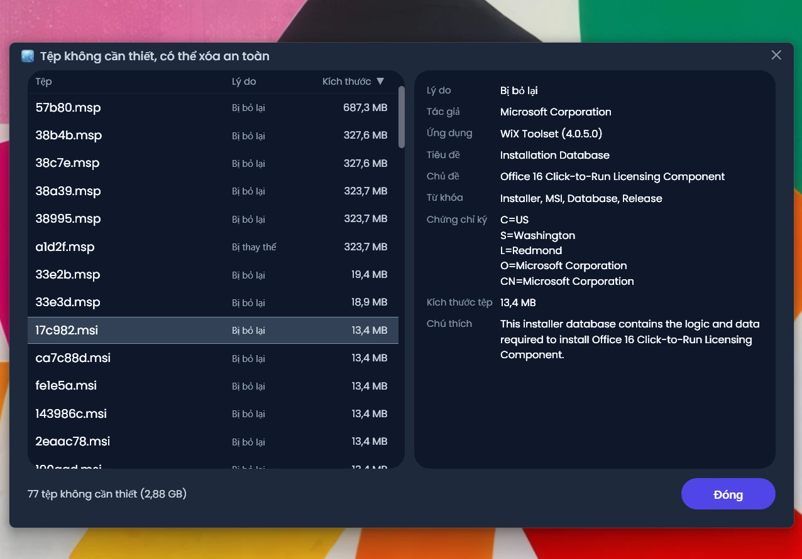
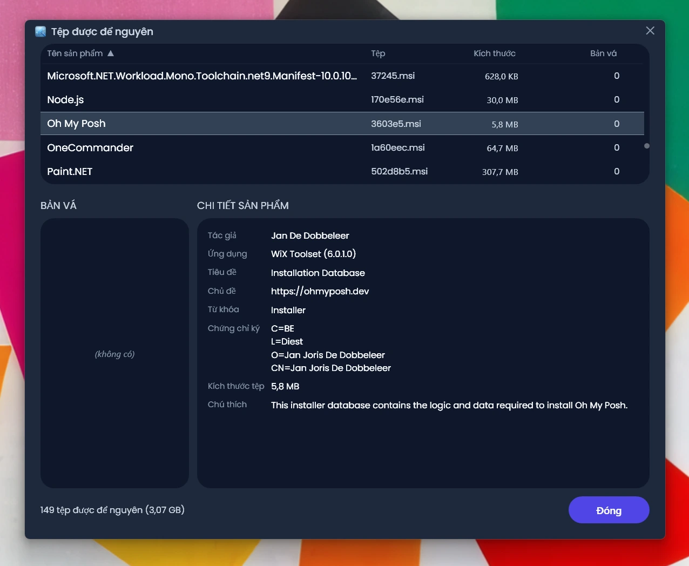
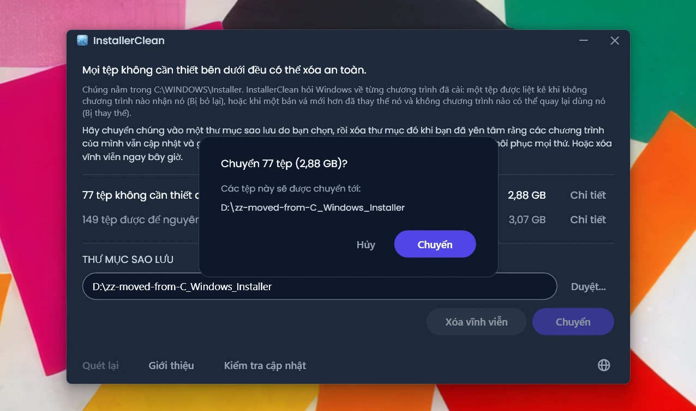
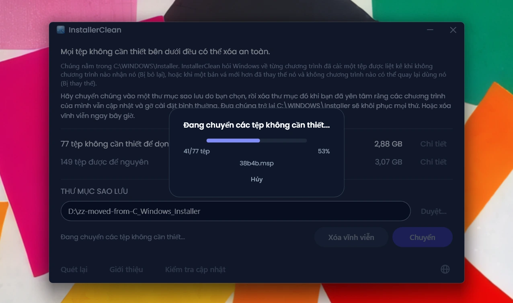
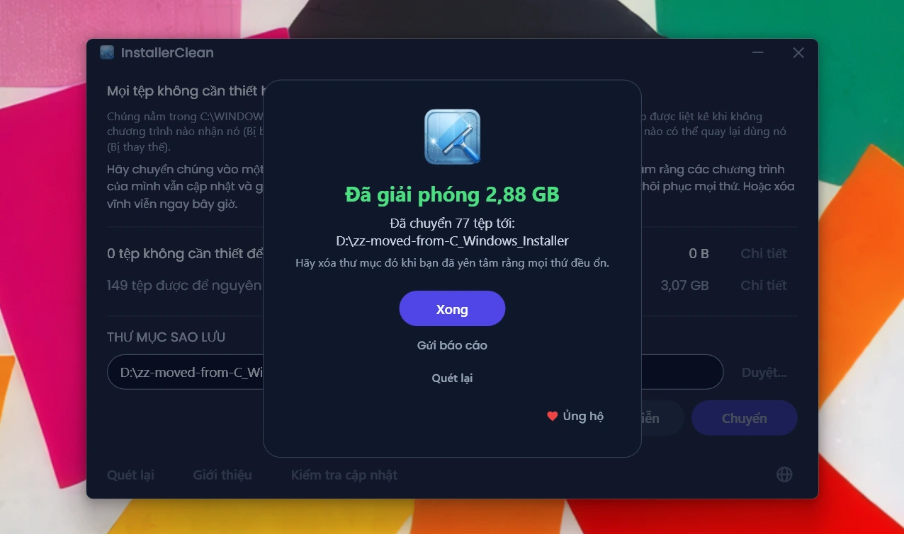
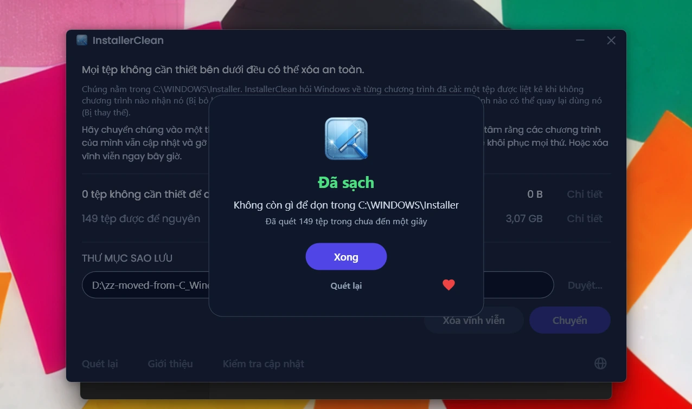

<p align="center">
  <a href="README.md">English</a> · <a href="README.zh-CN.md">简体中文</a> · <a href="README.ru.md">Русский</a> · <a href="README.es.md">Español</a> · <a href="README.ar.md">العربية</a> · <a href="README.ja.md">日本語</a> · <a href="README.pt-BR.md">Português (BR)</a> · <a href="README.pl.md">Polski</a> · <a href="README.tr.md">Türkçe</a> · <a href="README.ko.md">한국어</a> · <a href="README.fr.md">Français</a> · <a href="README.it.md">Italiano</a> · <a href="README.de.md">Deutsch</a> · <a href="README.id.md">Bahasa Indonesia</a> · <strong>Tiếng Việt</strong> · <a href="README.uk.md">Українська</a> · <a href="README.nl.md">Nederlands</a>
</p>

<p align="center">
  
</p>

<p align="center"><em>🎶 What's my line? I'm happy <a href="https://www.youtube.com/watch?v=HM-jHhUZfFI">cleaning Windows</a></em></p>

<h1 align="center">InstallerClean</h1>

<p align="center"><strong>Một công cụ mã nguồn mở giúp dọn dẹp an toàn <code>C:\Windows\Installer</code>, thư mục ẩn của Windows đang âm thầm ngốn dung lượng đĩa của bạn.</strong></p>

<p align="center"><em>Năm thì mười họa mới dùng đến. Biết đâu dọn ra được chút dung lượng. Rồi nhẹ nhõm bước tiếp.</em></p>

<p align="center">
  <a href="LICENSE"></a>
  <a href="https://dotnet.microsoft.com/download/dotnet/10.0"></a>
  <a href="https://github.com/no-faff/InstallerClean/actions/workflows/ci.yml"></a>
  <a href="https://github.com/no-faff/InstallerClean/releases"></a>
  <a href="https://github.com/no-faff/InstallerClean/releases/latest"></a>
  <a href="https://github.com/no-faff/InstallerClean/releases"></a>
</p>

<a id="reports-stats"></a>

<!-- reports-stats-start chart-only (generated; do not hand-edit between these markers) -->
<p align="center">
  <picture>
    <source media="(prefers-color-scheme: dark)" srcset="docs/reports-vi-dark.svg" />
    <source media="(prefers-color-scheme: light)" srcset="docs/reports-vi-light.svg" />
    
  </picture>
</p>
<!-- reports-stats-end -->

- **Là gì:** InstallerClean chỉ làm một việc: nó loại bỏ những tệp không cần thiết khỏi `C:\Windows\Installer`, một thư mục ẩn cứ đầy dần lên khi bạn cài và cập nhật phần mềm. Sau một lượt quét nhanh, nó cho bạn biết bạn có tệp như vậy hay không, hiển thị thêm chi tiết cho ai tò mò, và cho phép bạn chuyển chúng đi nơi khác hoặc xóa chúng để giải phóng dung lượng trên ổ C: của bạn.
- **Có lẽ bạn đến đây vì:** Bạn đã dùng [WinDirStat](https://github.com/windirstat/windirstat), WizTree hoặc TreeSize, thấy `C:\Windows\Installer` chiếm rất nhiều dung lượng mà không biết bên trong có gì. Nếu vậy thì InstallerClean chính là thứ bạn cần. Nó biết những tệp có tên trông ngẫu nhiên như `9f05cba.msi` chứa gì, và nhanh chóng cho bạn biết tệp nào có thể loại bỏ an toàn.
- **Giải phóng được bao nhiêu:** Biểu đồ ở trên cho thấy kết quả của những báo cáo tùy chọn vẫn đều đặn gửi về từ v1.8.0. (Cảm ơn tất cả những ai đã bấm nút. Không có các bạn thì biểu đồ ở trên đã không tồn tại.) Trong số <!-- reports-freedpct-start -->65%<!-- reports-freedpct-end --> đã giải phóng được dung lượng, trung vị giải phóng được là <!-- reports-median-start -->15,8 GB<!-- reports-median-end -->. <!-- reports-biggest-start -->Một máy đã thu hồi tận 464 GB.<!-- reports-biggest-end --> <!-- reports-nothingpct-start -->35%<!-- reports-nothingpct-end --> còn lại không giải phóng được gì, nên chuyện này tùy vào từng máy: một bản Windows 11 cài mới không có phần mềm nào thêm thì chẳng có gì để loại bỏ. Những máy có nhiều tệp không cần thiết nhất là những máy đã chạy nhiều năm, những máy có phần mềm nặng dựa trên MSI (Acrobat, Office, LibreOffice, các công cụ phát triển lớn), và những ai cài rồi gỡ rất nhiều phần mềm. Bạn sẽ thấy chính xác là bao nhiêu ngay khi chạy nó.
- **Có an toàn không:** Có. Thứ duy nhất nó động đến là các tệp trong `C:\Windows\Installer`. Nó hỏi Windows Installer xem những gì vẫn còn cần, và nó cũng đọc chính những bản ghi đó từ registry. Nó chỉ đề xuất một tệp khi không có gì đã cài trên máy nhận tệp đó là của mình, hoặc khi một bản vá mới hơn đã thay thế nó và không chương trình nào ở đây có thể quay lại dùng bản cũ. Bất cứ thứ gì nó không có được câu trả lời rõ ràng thì nó giữ lại. [Chi tiết ở bên dưới](#cách-hoạt-động).
- **Không thu thập gì về bạn:** Mã nguồn mở (Apache 2.0). Không tài khoản, không quảng cáo, không theo dõi, không thu thập dữ liệu, không có gì chạy ngầm. Việc duy nhất nó tự mình làm trên mạng là kiểm tra GitHub xem có phiên bản mới hơn không mỗi khi bạn chạy nó, và bạn có thể tắt việc đó.
- **Tải về:** [Tải bản phát hành mới nhất](../../releases/latest). Chạy nó; bấm qua [mọi cảnh báo Windows hiện ra](#unknown-publisher) và [lời nhắc quyền quản trị](#admin). Chuyển hoặc xóa những gì nó tìm được. Xong.

## Nội dung

- [Thư mục không ai nói cho bạn biết](#thư-mục-không-ai-nói-cho-bạn-biết)
- [Đi tìm trợ giúp](#đi-tìm-trợ-giúp)
- [InstallerClean làm gì](#installerclean-làm-gì)
- [Ảnh chụp màn hình](#ảnh-chụp-màn-hình)
- [Cách hoạt động](#cách-hoạt-động)
- [Tải về](#tải-về)
  - [Tự kiểm tra bản tải về](#tự-kiểm-tra-bản-tải-về)
- [FAQ](#faq)
- [Dòng lệnh](#dòng-lệnh)
- [Khả năng tiếp cận](#khả-năng-tiếp-cận)
- [Chính sách ký số phần mềm](#chính-sách-ký-số-phần-mềm)
- [Quyền riêng tư](#quyền-riêng-tư)
- [Những gì nó không làm](#những-gì-nó-không-làm)
- [Các lựa chọn khác](#các-lựa-chọn-khác)
- [Nếu có lúc nào đó thiếu một tệp trong C:\Windows\Installer](#recovery)
- [Yêu cầu](#yêu-cầu)
- [Biên dịch từ mã nguồn](#biên-dịch-từ-mã-nguồn)
- [Đóng góp](#đóng-góp)
- [Ủng hộ dự án](#ủng-hộ-dự-án)
- [Lịch sử lượt sao](#lịch-sử-lượt-sao)
- [Giấy phép](#giấy-phép)

---

## Thư mục không ai nói cho bạn biết

Trên mọi máy tính Windows đều có một thư mục ẩn tên là `C:\Windows\Installer`. Mỗi lần bạn cài phần mềm dùng hệ thống Windows Installer, hoặc áp dụng một bản vá cho Microsoft Office, Adobe Acrobat, Visual Studio hay bất kỳ ứng dụng nào dựa trên `.msi` khác, một bản sao của trình cài đặt đó hoặc tệp vá `.msp` sẽ được đưa vào thư mục này, và ở lại đó.

Khi một bản vá mới hơn thay thế bản cũ, cả hai đều ở lại. Trình cài đặt của phần mềm bạn đã gỡ từ lâu cũng vậy. Dọn dẹp Ổ đĩa không đụng tới thứ nào trong số đó, Nhận biết Lưu trữ cũng không. DISM thì dành cho một thư mục hoàn toàn khác. Theo thời gian, thư mục này phình to: 1 GB, 5 GB, 20 GB, 50 GB. Trên những máy có nhiều phần mềm dùng MSI (Acrobat là thủ phạm thường gặp), nó có thể [vượt quá 100 GB](https://www.reddit.com/r/sysadmin/comments/1oxcrmh/acrobat_filling_up_the_cwindowsinstaller_folder/).

Đây không phải những tệp tạm tự quay lại. Chúng là gánh nặng thật sự: những trình cài đặt cũ của phần mềm bạn đã gỡ từ nhiều năm trước, và những bản vá đã bị thay thế nhiều lần. Một khi đã xóa, chúng không quay lại nữa.

**Nếu bạn đang tìm một cách dễ dàng để giải phóng dung lượng đĩa trên Windows, thư mục này là một nơi tốt để bắt đầu.** InstallerClean tìm những tệp không cần thiết và loại bỏ chúng một cách an toàn.

## Đi tìm trợ giúp

Nếu bạn từng tìm cách xử lý thư mục này, hẳn bạn biết nó diễn ra thế nào. Một người có 180 GB trong `C:\Windows\Installer` hỏi cách dọn nó. Họ [được khuyên chạy Dọn dẹp Ổ đĩa](https://learn.microsoft.com/en-us/answers/questions/4238108/windows-installer-folder-has-occupied-180gb). Họ thử. Nó dọn được 600 MB, không phần nào trong số đó từ thư mục kia (vì Dọn dẹp Ổ đĩa không đụng tới `C:\Windows\Installer`). Rồi chủ đề rơi vào im lặng.

> *“Tất cả các chủ đề tôi tìm được đều có xu hướng khuyên cùng những thứ chẳng giải quyết được vấn đề, rồi sau đó chết hẳn.”*
>
> [ksparks519, r/Windows10](https://www.reddit.com/r/Windows10/comments/1bt8c5p/anyone_ever_figure_out_giant_installer_folders/) (dịch từ nguyên văn tiếng Anh)

Hoặc họ được bảo là đừng đụng vào nó. Trong một chủ đề, một người có thư mục Installer 60 GB được bảo là [“đừng nghịch vào nó.”](https://www.reddit.com/r/techsupport/comments/1hw4suq/my_windows_installer_folder_is_like_60gb_so_i/) Khi họ hỏi vậy nên làm gì thay vào đó, câu trả lời là: *“Tôi vừa nói rồi đấy.”*

Lời khuyên thường gặp lẫn lộn hai chuyện khác nhau. Xóa tệp một cách bừa bãi khiến bạn không còn cập nhật hay gỡ cài đặt được những chương trình mà các tệp ấy thuộc về. Chỉ loại bỏ những tệp mà không có gì trên máy nhận là của mình, hoặc những tệp Windows ghi nhận là đã bị thay thế, thì không gây ra chuyện đó. InstallerClean làm chuyện thứ hai.

## InstallerClean làm gì

1. **Quét** `C:\Windows\Installer` để tìm các tệp `.msi` và `.msp`
2. **Hỏi** Windows Installer xem những gì vẫn còn cần, rồi tự đọc lại chính những bản ghi đó từ registry
3. **Giữ lại** bất cứ thứ gì mà hai lần đọc không thống nhất được với nhau
4. **Cho bạn biết có thể giải phóng bao nhiêu** và nó để nguyên bao nhiêu, kèm các cửa sổ chi tiết tùy chọn liệt kê từng tệp
5. **Loại bỏ những tệp không cần thiết**: chuyển chúng vào một thư mục sao lưu bạn chọn, hoặc xóa vĩnh viễn

## Ảnh chụp màn hình

<p>
  <br>
  <em>Lượt quét đầu tiên. Việc này rất nhanh.</em>
  <br><br>
</p>

<p>
  <br>
  <em>Kết quả: có thể loại bỏ bao nhiêu, đã để nguyên bao nhiêu.</em>
  <br><br>
</p>

<p>
  <br>
  <em>Chi tiết những tệp có thể bỏ đi: lý do mỗi tệp không còn cần nữa, và những gì tệp đó nói về chính nó.</em>
  <br><br>
</p>

<p>
  <br>
  <em>Chi tiết những tệp được để nguyên: chương trình mà Windows nói mỗi tệp thuộc về, và những gì tệp đó nói về chính nó.</em>
  <br><br>
</p>

<p>
  <br>
  <em>Xác nhận trước cả hai thao tác. Chuyển sẽ sao lưu các tệp vào một thư mục bạn chọn. Hoặc xóa chúng vĩnh viễn.</em>
  <br><br>
</p>

<p>
  <br>
  <em>Việc chuyển đang chạy. Sang cùng một ổ đĩa thì tức thì. Sang ổ khác thì càng nhiều GB càng lâu.</em>
  <br><br>
</p>

<p>
  <br>
  <em>Xong. Dung lượng đã lấy lại. Các tệp được sao lưu cho đến khi bạn yên tâm rằng mọi thứ đều ổn. Rồi hãy xóa thư mục sao lưu.</em>
  <br><br>
</p>

<p>
  <br>
  <em>Sau khi quét lại. Không còn gì để dọn.</em>
  <br><br>
</p>

<a id="is-it-safe"></a>
## Cách hoạt động

Khi Windows Installer cài một chương trình, nó giữ lại một bản sao của trình cài đặt trong `C:\Windows\Installer`, và khi một bản vá được đăng ký cho một chương trình thì nó cũng giữ lại một bản sao của bản vá đó. Những bản sao ấy là thứ nó dựa vào để sửa chữa, cập nhật hay gỡ cài đặt phần mềm về sau, và đó là lý do chúng ở lại rất lâu sau khi việc cài đặt đã xong. Cả hai loại bản sao đều nằm trong thư mục này: trình cài đặt `.msi`; và bản vá `.msp`, thứ cập nhật một chương trình bạn đã có chứ không thay thế nó.

InstallerClean đề xuất một tệp vì một trong hai lý do.

**Bị bỏ lại** nghĩa là không có gì trên máy nhận tệp đó là của mình. Không sản phẩm đã cài nào và không bản vá đã đăng ký nào nêu tên tệp đó.

**Bị thay thế** nghĩa là Windows đã ghi nhận rằng một bản vá mới hơn đã thay thế bản vá này, mà vẫn giữ tệp lại. Một bản vá chỉ bị xóa khi mọi chương trình có đăng ký nó đều đã bị gỡ cài đặt, hoặc khi bản vá đó bị gỡ khỏi tất cả các chương trình ấy. Bị một bản mới hơn thay thế không phải là điều nào trong hai điều đó, nên tệp vẫn ở lại. Adobe Acrobat hoạt động theo cách này trên Windows: các bản cập nhật của nó đến dưới dạng bản vá cho một bản cài đặt gốc chứ không phải dưới dạng trình cài đặt mới, nên một máy đã dùng nó một thời gian có thể đang giữ vài bản.

InstallerClean xác định hai loại này theo hai chiều ngược nhau, và chỉ loại thứ nhất mới phải nhìn vào bên trong thư mục.

**Liệt kê thư mục.** InstallerClean liệt kê các tệp `.msi` và `.msp` nằm ngay trong `C:\Windows\Installer`. Nó không đi vào các thư mục con.

**Đọc bản ghi, hai lần.** Nó hỏi Windows Installer về mọi sản phẩm đã cài và mọi bản vá đã đăng ký, cùng với tệp trong bộ nhớ đệm mà mỗi bản ghi nêu tên, bằng cách gọi API Windows Installer trong `msi.dll`. Rồi InstallerClean đọc chính những bản ghi ấy theo một cách thứ hai, trực tiếp từ registry, vì lần hỏi kia có thể trả về thiếu mà không nói gì: Windows đưa từng bản ghi một cho đến khi báo là hết, và một lượt dừng ở bản ghi thứ ba trong số hai trăm trông y hệt một lượt đã chạy đến cuối. Một khóa registry đưa cả danh sách tên của nó ra cùng một lúc, nên một danh sách bị thiếu thì không thể trông như đã đủ. Mỗi sản phẩm mà registry nêu tên còn lần hỏi kia bỏ sót thì được hỏi lại Windows theo tên, từng cái một. Lần đọc thứ hai này chỉ có thể đưa một tệp sang phía “vẫn còn cần”. Không có đường nào để nó đưa một tệp vào danh sách cần loại bỏ.

**Khớp một bản ghi với tệp của nó.** Một bản ghi nêu tên tệp của nó trong bộ nhớ đệm dưới dạng một đường dẫn, và cùng một thư mục không phải lúc nào cũng được viết giống nhau trong các bản ghi. Nên thay vì tin vào cách viết, InstallerClean hỏi Windows xem mỗi đường dẫn được ghi thực sự trỏ tới đâu, rồi đối chiếu với những tệp đã liệt kê trong thư mục. Tệp nào vẫn chưa có bản ghi nào nhận là của mình thì được đối chiếu lần thứ hai, lần này không qua tên chút nào: InstallerClean mở tệp ra và nhờ Windows nhận dạng tệp đó, để hai cái tên khác nhau của cùng một tệp được nhận ra là một tệp.

**Những bản ghi không khớp được.** Nếu Windows không chịu cho biết một đường dẫn được ghi trỏ tới đâu, hoặc không nhận dạng được tệp ở cuối đường dẫn đó, thì InstallerClean không biết bản ghi ấy nói về tệp nào, và bất kỳ tệp nào nó đã liệt kê cũng có thể là tệp đó. Điều tương tự xảy ra nếu một chương trình có thể đã được cài nhiều hơn một lần, vì khi đó nó không phân biệt được tệp nào trong bộ nhớ đệm thuộc về bản cài nào. Trong bất kỳ trường hợp nào như vậy, lượt quét đó không đề xuất gì trong số những tệp nó tìm được bằng cách liệt kê thư mục. Một bản ghi trỏ tới một tệp đã không còn nữa thì lại khác: không còn gì để nó có thể nói tới, nên nó không thể nói về bất kỳ tệp nào vẫn đang ở trong thư mục.

**Hỏi từ đầu bên kia.** Một tệp bị bỏ lại được xác định bằng một sự vắng mặt, mà vắng mặt cũng có thể có nghĩa là ứng dụng đã không tìm thấy bản ghi. Nên trước khi đề xuất một trình cài đặt `.msi`, InstallerClean mở tệp ra, đọc mã sản phẩm mà chính tệp đó mang, và hỏi Windows xem sản phẩm ấy có đang được cài hay không. Nếu có, tệp ở lại, bất kể phần còn lại của lượt quét đã tìm thấy gì. Phép kiểm tra đó chỉ có thể lấy một tệp ra khỏi danh sách. Không câu trả lời nào của nó đưa được một tệp vào danh sách.

**Điều gì quyết định một bản vá `.msp`.** Một bản vá không được mở ra để hỏi xem nó thuộc về chương trình nào. Thứ quyết định thay vào đó là việc một đăng ký bản vá nêu tên tệp của nó trong bộ nhớ đệm ở hai nơi: các bản vá đã đăng ký cho từng sản phẩm; và một danh sách registry duy nhất gồm mọi đăng ký bản vá trên máy. Một bản vá chỉ được đề xuất là bị bỏ lại khi không nơi nào trong hai nơi đó nêu tên tệp của bản vá ấy trong bộ nhớ đệm.

**Bản vá bị thay thế khác ở chỗ nào.** Nó không đi qua bước nào ở trên, vì nó không phải một tệp không ai nhận. Windows có bản ghi về nó, và chính bản ghi đó nói rằng nó đã bị thay thế. Rủi ro ở đây là chuyện khác: một bản vá có thể được đăng ký cho nhiều chương trình, mà chỉ một trong số đó đã dùng xong nó. Vì vậy một bản vá bị thay thế chỉ được đề xuất khi Windows ghi nhận rằng nó không gỡ được, mọi chương trình có đăng ký nó đều đã được hỏi, không chương trình nào còn áp dụng nó, và không chương trình nào đang giữ một bản vá mà Windows nói là gỡ được. Điều cuối cùng có ở đó vì việc hoàn tác một bản vá trên một chương trình có thể quay lại cần đến tệp cũ hơn. Nếu có bất kỳ điều nào trong số đó không trả lời được, tệp ở lại.

<details>
<summary>Những lệnh gọi Windows Installer mà ứng dụng dùng</summary>

- `MsiEnumProductsEx` để liệt kê mọi sản phẩm đã cài, và một lần nữa với một mã sản phẩm đơn lẻ để hỏi xem một sản phẩm cụ thể có đang được cài hay không
- `MsiEnumPatchesEx` để liệt kê các bản vá đã đăng ký, cả theo từng sản phẩm lẫn trên toàn máy
- `MsiGetProductInfoEx` để đọc tên của một sản phẩm, tệp trong bộ nhớ đệm mà nó nêu tên, và liệu nó có phải một trong nhiều bản cài của cùng một sản phẩm hay không
- `MsiGetPatchInfoEx` để đọc trạng thái của một bản vá, xem Windows có gỡ được nó hay không, và tệp trong bộ nhớ đệm mà nó nêu tên
- `MsiGetSummaryInformation` và `MsiSummaryInfoGetProperty` để đọc từ một tệp vá xem nó có thể áp dụng cho những chương trình nào
- `MsiOpenDatabase`, `MsiDatabaseOpenView`, `MsiViewExecute`, `MsiViewFetch` và `MsiRecordGetString` để đọc từ một tệp cài đặt mã sản phẩm mà nó khai báo

</details>

Dù đã nói tất cả những điều đó, ứng dụng vẫn khuyến khích bạn chuyển các tệp vào một thư mục sao lưu (trên ổ đĩa hoặc phân vùng khác nếu bạn muốn giải phóng dung lượng trên ổ C). Như vậy bạn có cơ hội tự mình yên tâm rằng mọi thứ thật sự đều ổn trước khi xóa hẳn những tệp không cần thiết.

## Tải về

Ba bản dựng, chọn một:

- **Portable** (`InstallerClean-3.0.0-portable.exe`): một tệp duy nhất, có sẵn .NET 10 runtime bên trong. Không cần cài, không có trình gỡ: bấm đúp là chạy. Hãy cất tệp đó ở đâu đó cho lần sau, hoặc xóa đi khi bạn xong việc.
- **Setup** (`InstallerClean-3.0.0-setup.exe`): một trình cài đặt Windows thông thường, đã đóng gói sẵn .NET 10 runtime. Thêm một mục vào menu Bắt Đầu và gỡ cài đặt gọn gàng. Được xếp vào danh sách chương trình để sáu tháng nữa bạn vẫn dễ tìm lại, hoặc để chạy thường xuyên hơn thế nếu bạn cài và gỡ nhiều phần mềm.
- **CLI** (`installerclean-cli.exe`): riêng bản dòng lệnh, một tệp duy nhất có sẵn runtime bên trong. Không cần cài, không có trình gỡ. Thả nó lên một máy khách, chạy một lượt quét hay một lượt dọn, rồi xóa đi. Được làm cho việc viết script, các tác vụ theo lịch và triển khai hàng loạt, khi bạn muốn thực hiện các thao tác mà không cần một ứng dụng desktop trên máy khách. Xem [Dòng lệnh](#dòng-lệnh) để biết các tham số và mã thoát.

Từ 2.2.0, tên tệp của bản cài đặt và bản portable có kèm số phiên bản, nên một bản đã tải về luôn cho biết nó là gì; bản CLI vẫn giữ tên đơn giản `installerclean-cli.exe` để các tác vụ theo lịch và script đang trỏ tới nó tiếp tục chạy qua các lần cập nhật.

Tải từ [trang phát hành](../../releases/latest), rồi chạy. Nó không được ký số, nên Windows hiện cảnh báo “nhà phát hành không xác định”; phần [FAQ](#unknown-publisher) giải thích bạn sẽ thấy gì và vì sao nó an toàn.

Ứng dụng tự động quét khi khởi động. Hãy xem lại kết quả, rồi bấm **Chuyển** hoặc **Xóa vĩnh viễn**.

Hoặc cài qua [winget](https://learn.microsoft.com/windows/package-manager/winget/):

```
winget install NoFaff.InstallerClean
```

Hoặc cài qua [Scoop](https://scoop.sh):

```
scoop install installerclean
```

### Tự kiểm tra bản tải về

InstallerClean không được ký số. Đây là những thứ bạn có thể kiểm tra trước khi chạy nó:

- Mã băm SHA-256 của mỗi bản tải về đều nằm trên trang phát hành của nó.
- VirusTotal: mỗi bản dựng đều được quét trước khi phát hành, và trang phát hành mang kết quả đầy đủ theo từng công cụ cho mỗi bản tải về.
- Mã nguồn nằm ở đây, tại [github.com/no-faff/InstallerClean](https://github.com/no-faff/InstallerClean). Các dịch vụ quét, truy vấn, chuyển, xóa, cài đặt và kiểm tra khởi động lại đang chờ đều được một bộ kiểm thử tự động bao phủ, và bộ kiểm thử đó chạy trên Windows ở mỗi lần đẩy lên `main` và ở mỗi pull request, còn huy hiệu CI ở đầu trang này cho biết kết quả.
- Các bản dựng phát hành có tính tất định: cùng một mã nguồn, cùng một SDK và cùng những cờ publish sẽ cho ra đúng những byte như nhau, và một bản phát hành không thể được gắn tag trừ khi mọi đầu vào của bản dựng khớp với mã nguồn tại tag đó. Vậy nên bạn có thể checkout tag đó, tự dựng lấy rồi đối chiếu mã băm với mã băm đã công bố. Ghi chú của mỗi bản phát hành mang đủ những gì bạn cần cho việc đó: phiên bản SDK mà nó được dựng bằng, và các cờ publish của bất kỳ bản tải nào không dựng bằng giá trị mặc định. Bản setup là ngoại lệ: nó do Inno Setup biên dịch chứ không phải SDK, và nó tự đóng dấu năm dựng vào bên trong, nên muốn tái tạo mã băm của nó thì cần cả đúng phiên bản Inno lẫn đúng năm dương lịch.
- <!-- downloads-start -->82.000+<!-- downloads-end --> lượt tải trên GitHub, MajorGeeks và Softpedia.
- [MajorGeeks](https://www.majorgeeks.com/files/details/installerclean.html) kiểm tra mỗi lần gửi trong một máy ảo và chỉ đăng nếu nó vượt qua được phần đánh giá của họ.<br><a href="https://www.majorgeeks.com/files/details/installerclean.html"></a>
- [Softpedia](https://www.softpedia.com/get/System/Hard-Disk-Utils/InstallerClean.shtml) đã đánh giá nó và chứng nhận nó không có phần mềm gián điệp, phần mềm quảng cáo và virus.<br><a href="https://www.softpedia.com/get/System/Hard-Disk-Utils/InstallerClean.shtml"></a>

## FAQ

<a id="admin"></a>

**Vì sao nó cần quyền quản trị viên?** Hai lý do. `C:\Windows\Installer` bị khóa, chỉ quản trị viên mới vào được, nên việc đọc thư mục, truy vấn Windows Installer và chuyển hay xóa tệp đều cần quyền đó. Và một quản trị viên được phép hỏi Windows về các chương trình đã cài dưới bất kỳ tài khoản nào trên máy, còn người không phải quản trị viên thì không: chạy mà thiếu quyền đó thì Windows sẽ nói một chương trình chưa được cài trong khi nó đã được cài, ngay bên trong phép kiểm tra quyết định một tệp có còn cần hay không.

<a id="unknown-publisher"></a>

**Vì sao Windows báo “Nhà phát hành không xác định”?** InstallerClean không được ký số, và Windows đánh dấu các tệp tải về từ internet, nên trong lần chạy đầu tiên SmartScreen thường hiện “Windows đã bảo vệ PC của bạn” với nhà phát hành ghi là không xác định. Một chứng chỉ ký số trả phí tốn tiền mỗi năm, và tôi thà giữ ứng dụng miễn phí còn hơn phải trả tiền cho nó, nên tôi đã nộp đơn xin SignPath Foundation, nơi ký số miễn phí cho phần mềm mã nguồn mở, và InstallerClean đã được chấp thuận (xem [Chính sách ký số phần mềm](#chính-sách-ký-số-phần-mềm)). Chứng chỉ vẫn chưa được cấp, nên hiện tại hãy bấm **Thông tin khác**, rồi **Vẫn chạy**. Làm vậy là an toàn: mã nguồn là công khai, và mỗi bản phát hành đều có liên kết VirusTotal và mã băm SHA-256 mà bạn có thể kiểm tra trước.

**Nó có chạy trên Windows 7 hay 8 không?** Không. Nó cần Windows 10 phiên bản 1607 trở lên, bản dựng cũ nhất mà .NET 10 runtime hỗ trợ. Trình cài đặt từ chối cài trên bất cứ bản nào cũ hơn, và bản portable sẽ không khởi động.

## Dòng lệnh

`installerclean-cli.exe` là một tệp thực thi console riêng, được cài cạnh GUI. Cùng lượt quét đó, cùng thao tác chuyển đó, cùng thao tác xóa đó, không có cửa sổ. Nó giữ dấu nhắc cho tới khi xong, nên một script hay một tác vụ theo lịch có thể chờ nó.

### Các cờ

| Cờ | Tác dụng | Cũng nhận |
|---|---|---|
| `/s` | Chỉ quét. Liệt kê những gì nó sẽ loại bỏ, kèm tên, kích thước và lý do của từng tệp. Không thay đổi gì. | |
| `/d` | Quét, rồi xóa vĩnh viễn những tệp không cần thiết. | |
| `/m` | Quét, rồi chuyển chúng vào thư mục đã lưu trong GUI. | |
| `/m ĐƯỜNG_DẪN` | Quét, rồi chuyển chúng tới `ĐƯỜNG_DẪN`. Hãy đặt trong dấu nháy nếu nó có dấu cách. | |
| `--help` | In phần cách dùng rồi thoát với mã `0`. | `/?`, `-h` |
| `--version` | In phiên bản rồi thoát với mã `0`. | `-v` |

Các cờ không phân biệt hoa thường, nên `/S` và `/D` chạy được y như `/s` và `/d`. Mỗi lần chạy chỉ một cờ: chúng không kết hợp được với nhau, và `/s` cùng `/d` không nhận gì đứng sau.

Chạy mà không có tham số nào thì nó in phần cách dùng và thoát với mã `1`, nhờ vậy một tác vụ theo lịch bị rớt mất cờ sẽ thất bại một cách rõ ràng thay vì âm thầm không làm gì. Một cờ nó không nhận ra thì in một dòng lỗi, rồi phần cách dùng, và cũng thoát với mã `1`. Một đường dẫn chuyển có dấu cách mà không đặt trong dấu nháy cũng bị từ chối như vậy chứ không bị cắt cụt âm thầm, và thông báo sẽ bảo bạn đặt nó trong dấu nháy.

### Mã thoát

Đây là những mã mà chính công cụ ghi trong `--help`:

| Mã | Nghĩa |
|---|---|
| `0` | Thành công. Lượt chạy đã làm đúng việc được yêu cầu và không có gì hỏng. |
| `1` | Không xử lý gì. Lượt chạy đã thất bại, hoặc bị từ chối. |
| `2` | Một phần. Xử lý được một số, không được một số, kể cả khi có Ctrl+C giữa chừng. |
| `75` | Tạm thời. Một điều kiện tạm thời đã chặn lượt chạy; thông báo in ra cho biết đó là điều kiện nào. |
| `130` | Đã hủy bằng Ctrl+C trước khi có gì được xử lý. |

`1` bao gồm cả một lần bị từ chối lẫn một lần thất bại, và bị từ chối không phải là lỗi: một đích đơn giản là đã đầy, hay một giá trị registry mà ứng dụng không đọc được trước khi động vào bất cứ thứ gì, đều rơi vào đây. `0` nghĩa là không có gì hỏng, chứ không phải là không còn gì sót lại: `--help`, `--version` và một lượt chỉ quét đều thoát với mã `0`, dù lượt quét tìm thấy sáu mươi tám tệp hay không tệp nào.

### Nhật ký sự kiện

Mỗi lần chạy đều ghi một mục kết quả vào nhật ký Application, và có thể thêm một hoặc vài thông báo bên cạnh. Event ID là một giao ước ổn định dành cho máy, nên một hệ thống RMM có thể lọc theo con số mà không phải phân tích chữ nào:

| ID | Nghĩa |
|---|---|
| `1000` | Thành công |
| `1002` | Một phần |
| `2000` | Bỏ qua, tạm thời |
| `4000` | Thất bại nặng |
| `3000` | Thông báo: lượt quét không bao quát được hết mọi sản phẩm đã cài |
| `3001` | Thông báo: những tệp Windows trông đợi lại không có trong thư mục |
| `3002` | Thông báo: có tệp bị giữ lại thay vì được đề xuất |

Dải `3000` là thông báo chứ không phải kết quả, và không tính là kết quả của lượt chạy. Loại mục là Information khi lượt chạy không có gì trục trặc và là Warning khi có. **Nhật ký sự kiện luôn bằng tiếng Anh**, bất kể ngôn ngữ hiển thị của máy, nên một lệnh tìm theo cụm từ đã biết luôn có đích ổn định. Phần được dịch là dòng lệnh: nó theo ngôn ngữ của chính máy, và nó viết kích thước cùng ngày tháng theo vùng của máy.

### Ví dụ thực tế

Ghi một bản rà soát ra tệp, không thay đổi gì:

```
installerclean-cli /s > audit.txt
```

Chuyển hằng tháng sang `D:\InstallerBackup`, với bản CLI đặt tại `C:\Tools`:

```
schtasks /create /tn "InstallerClean monthly" /tr "C:\Tools\installerclean-cli.exe /m D:\InstallerBackup" /sc monthly /ru SYSTEM /rl highest
```

Tác vụ sẽ chờ đến khi lượt chạy kết thúc và ghi mã thoát vào Last Run Result của nó, nên một hệ thống RMM có thể dựa vào các mã ở trên.

Từ PowerShell:

```powershell
& 'C:\Tools\installerclean-cli.exe' /m D:\InstallerBackup
switch ($LASTEXITCODE) {
    0       { 'Sạch' }
    2       { 'Một phần, hãy xem kết quả in ra' }
    75      { 'Bị chặn, thử lại sau' }
    default { "Thất bại ($LASTEXITCODE)" }
}
```

### Trước khi bạn đưa nó vào script

- **Nó cần quyền nâng cao.** Mọi thao tác đều cần, kể cả `/s`. Từ một dấu nhắc không được nâng quyền, Windows từ chối khởi chạy nó và trả `740` về cho shell của bạn.
- **Thư mục đã lưu trong GUI là theo từng người dùng.** Một tác vụ chạy dưới quyền SYSTEM hay một tài khoản dịch vụ sẽ không thấy nó, nên những lượt chạy như vậy phải truyền `/m ĐƯỜNG_DẪN`.
- **SYSTEM ra mạng dưới danh nghĩa tài khoản máy**, nên một đích `\\server\share` cần được cấp quyền cho tài khoản đó.
- **`/s` không bao giờ chặn.** Nó chỉ đọc và không giữ khóa nào, nên bạn có thể quét trong khi ứng dụng desktop đang mở. `/d` và `/m` giữ một khóa trên toàn máy và thoát với mã `75` nếu một lượt chạy InstallerClean khác đang giữ khóa đó.
- **Mọi thứ đều đi ra stdout**, kể cả lỗi; không có stderr. Hãy dựa vào mã thoát thay vì phân tích văn bản.
- **Chuyển sẽ từ chối chứ không đổi tên.** Nếu đích đã có sẵn một tệp trùng tên, tệp đó được để lại trong bộ nhớ đệm và được nêu tên trong kết quả in ra, còn phần còn lại của lô vẫn được chuyển. Một lượt chạy mà mọi tệp đều trùng tên thì không xử lý gì và thoát với mã `1`.
- **Không có gì tự dọn thư mục sao lưu.** `/m` chỉ thêm vào chứ không bao giờ bớt đi. Thư mục đó cần chính bạn dọn.
- **`taskkill /pid` không phải một lần hủy êm.** Lượt chạy kế tiếp sẽ khôi phục khóa một-thực-thể.
- **Lần chạy đầu tiên đăng ký một nguồn nhật ký sự kiện**, tại `HKLM\SYSTEM\CurrentControlSet\Services\EventLog\Application\InstallerClean`. Hãy để nguyên nó ở đó: Trình xem Sự kiện đọc phần mô tả của một mục thông qua nguồn của mục đó, nên xóa nguồn đi sẽ biến mọi mục mà công cụ này đã ghi thành lỗi nguồn-không-xác-định.

### Vì sao là `installerclean-cli` chứ không phải `installerclean.exe`

`InstallerClean.exe` là cửa sổ và nó bỏ qua các tham số dòng lệnh. `installerclean-cli.exe` là một tiến trình console thật, nên nó giữ dấu nhắc cho tới khi xong và chuyển hướng hay nối ống được như bất cứ thứ gì khác. Bản setup cài cả hai. Bản portable chỉ có GUI; hãy tải riêng `installerclean-cli.exe` từ [trang phát hành](../../releases/latest) nếu bạn muốn dòng lệnh mà không cần cửa sổ.

## Khả năng tiếp cận

InstallerClean được xây dựng để có thể sử dụng hoàn toàn bằng bàn phím và với trình đọc màn hình.

- **Thao tác bằng bàn phím xuyên suốt.** Mọi việc ứng dụng làm đều tới được từ bàn phím, và các cột trong cửa sổ chi tiết cũng sắp xếp được bằng bàn phím, nên ở đây không có gì cần đến chuột. Các nút trên thanh tiêu đề hoạt động giống như các nút của Windows và được gọi bằng Alt+Space hoặc Alt+F4. Tiêu điểm bàn phím luôn hiện rõ ở bất cứ nơi nào nó dừng lại.
- **Trình tường thuật và Truy nhập bằng giọng nói.** Mọi điều khiển đều có nhãn, và từ ngữ hiển thị trên một nút chính là từ kích hoạt nút đó bằng giọng nói. Khi một thao tác Chuyển hoặc Xóa hoàn tất, kết quả được đọc to lên.
- **Được làm để dễ đọc.** Văn bản đạt độ tương phản WCAG AA trên toàn bộ giao diện tối.

Nếu có điều gì ở đây cản trở bạn, hãy [mở một issue](../../issues). Các vấn đề về khả năng tiếp cận là lỗi, không phải trường hợp ngoại lệ hiếm gặp.

## Chính sách ký số phần mềm

InstallerClean đã được [SignPath Foundation](https://signpath.org) chấp thuận ký số miễn phí. Đây là một chương trình ký số cho phần mềm mã nguồn mở, để phần mềm không còn đến máy bạn từ một nhà phát hành không xác định nữa. Bản thân chứng chỉ thì vẫn chưa được cấp, nên hôm nay các bản tải về ở đây chưa được ký số và Windows sẽ cảnh báo về chúng.

Khi chứng chỉ được cấp, mỗi bản phát hành sẽ mang dòng chữ mà SignPath yêu cầu: “free code signing provided by SignPath.io, certificate by SignPath Foundation”. Chứng chỉ thuộc về quỹ chứ không thuộc về tôi, bởi chứng chỉ bắt buộc phải được cấp cho một pháp nhân, mà một dự án của một người thì không phải. Điều đó không có nghĩa là InstallerClean thuộc về họ, hay là họ tham gia vào nó ngoài việc ký số.

**Các vai trò.** InstallerClean có một người duy trì duy nhất. Người commit và người rà soát, tức là ai được đưa mã vào dự án: tôi. Người phê duyệt, tức là ai được cho phép ký số một bản phát hành: tôi.

## Quyền riêng tư

Báo cáo tùy chọn là thứ duy nhất từng gửi đi bất cứ điều gì về một lượt chạy, và nó chỉ đi khi bạn bấm nút. Nó cho biết lượt quét đã tìm thấy gì, đã giữ lại những gì và vì sao, bạn đã chuyển hay đã xóa, việc đó giải phóng được bao nhiêu, mất bao lâu, và có gì thất bại hay không, cùng với phiên bản của ứng dụng, ngôn ngữ bạn đọc nó và phiên bản Windows của bạn. Không tên tệp, không tên thư mục, không tên tài khoản, không có gì nhận dạng máy của bạn và không có gì có thể nối hai báo cáo lại với nhau. Đó là cách tôi biết được ứng dụng có chạy tốt hay không, và nó đang giữ lại những gì, trên những máy khác máy của tôi.

Không quảng cáo, không thu thập dữ liệu. Những kết nối duy nhất còn lại là lần kiểm tra phiên bản khi ứng dụng khởi động (một yêu cầu tới GitHub mà bạn có thể tắt trong cửa sổ Giới thiệu) và các nút dẫn tới GitHub cùng một trang bạn có thể quyên góp nếu thấy rộng lòng. [Chính sách quyền riêng tư](PRIVACY.md) đầy đủ (bằng tiếng Anh).

## Những gì nó không làm

- WinSxS (`C:\Windows\WinSxS`) là một thư mục khác với những quy tắc khác. Với thư mục đó, hãy chạy `Dism /Online /Cleanup-Image /StartComponentCleanup` từ một dấu nhắc lệnh có quyền nâng cao.
- Không có dịch vụ chạy ngầm, không có tác vụ theo lịch, không tự động dọn. Ứng dụng chỉ chạy khi bạn khởi động nó.
- Nó không thay đổi các chương trình đã cài đặt của bạn hay cơ sở dữ liệu Windows Installer, chỉ đọc chúng. Thứ duy nhất nó từng ghi vào registry là việc đăng ký nguồn sự kiện, chỉ làm một lần, mà công cụ dòng lệnh cần đến để các lần chạy của nó hiện ra trong Nhật ký Sự kiện Windows.
- Nó tự mình tạo đúng một loại kết nối: mỗi khi bạn chạy, nó xem nhanh trang phát hành của GitHub có phiên bản mới hơn không, và bạn có thể tắt việc này trong cửa sổ Giới thiệu. Mọi thứ khác chỉ xảy ra khi bạn yêu cầu: báo cáo ẩn danh tùy chọn (những con số về lượt chạy, không có gì nêu tên bạn hay các tệp của bạn) và các liên kết tới tài liệu trên GitHub cùng một trang quyên góp, sẽ mở trong trình duyệt của bạn nếu bạn bấm vào. Nó không bao giờ tự tải về bất cứ thứ gì.
- Không thanh công cụ, không phần mềm đi kèm, không phần mềm quảng cáo.

## Các lựa chọn khác

Nếu bạn từng tìm hiểu về thư mục này, công cụ nhiều khả năng bạn đã gặp nhất là [PatchCleaner](https://www.homedev.com.au/free/patchcleaner). Nó làm công việc này đầu tiên, nó đã làm suốt một thập kỷ trước khi InstallerClean ra đời, nó vẫn đang hoạt động tốt, và sẽ không có InstallerClean nếu không có nó.

Tôi làm InstallerClean vì PatchCleaner là mã nguồn đóng, không có bản cập nhật nào kể từ tháng 3 năm 2016, và theo mặc định thì loại trừ các tệp của Adobe. Việc loại trừ đó có lý do chính đáng, và HomeDev đã nói thẳng như vậy trong ghi chú phát hành khi đó:

> *“Có một vấn đề đã biết ở các phiên bản trước, khi PatchCleaner nhận nhầm các bản vá của Adobe Acrobat Reader là không cần thiết. Adobe làm một điều gì đó riêng của họ trong việc tự động cập nhật, đến mức nếu PatchCleaner loại bỏ những bản vá ‘mồ côi’ khỏi thư mục trình cài đặt thì các bản cập nhật tự động của Adobe Reader sẽ không còn cài đặt thành công nữa.”*
>
> [Ghi chú phát hành PatchCleaner, phiên bản 1.4.0.0](https://www.homedev.com.au/free/patchcleaner) (dịch từ nguyên văn tiếng Anh)

Bộ lọc đi kèm với nó tìm chữ “Acrobat” trong siêu dữ liệu của tệp và trong chữ ký của tệp. Trên những máy mà Acrobat là thủ phạm tệ nhất, đó lại chính là phần lớn dung lượng:

> *“Tôi đã tải Patchcleaner về để xóa các tệp .msp mồ côi, nhưng hóa ra việc đó chỉ giải phóng được 250 MB dung lượng. 29 GB tệp bị ‘loại trừ bởi bộ lọc’, nên Patchcleaner có vẻ chẳng giúp được gì.”*
>
> HeatherBunny1111, [r/techsupport](https://www.reddit.com/r/techsupport/comments/1qc4tcf/how_to_delete_msp_files_safely/) (dịch từ nguyên văn tiếng Anh)

Khác biệt giữa hai công cụ ở đây nằm ở chỗ mỗi bên hỏi Windows điều gì, chứ không phải ở chỗ hai bên nghĩ khác nhau về Adobe. Danh sách mà Windows giữ về những bản vá *đã áp dụng* cho một sản phẩm bỏ qua các bản vá đã bị một bản mới hơn thay thế, nên một công cụ đọc danh sách đó sẽ gặp tệp của một bản vá bị thay thế như một tệp mà không có gì nhận là của mình, y hệt mọi tệp khác. Chính bộ lọc loại trừ mới là thứ bắt được các tệp của Adobe theo tên. InstallerClean thì hỏi Windows về trạng thái bản vá, nên một bản vá bị thay thế đến nơi đã mang sẵn nhãn của nó, và số phận của nó được quyết định dựa trên những gì Windows ghi nhận về nó chứ không dựa trên cái tên của nó. Đây là so sánh giữa hai bên:

| | **InstallerClean** | **PatchCleaner** |
|---|---|---|
| Cập nhật gần nhất | 2026 (đang hoạt động) | 3 tháng 3 năm 2016 |
| Mã nguồn | Mã nguồn mở (Apache 2.0) | Mã nguồn đóng |
| Runtime | .NET 10 (độc lập) | .NET Framework 4.5.2 + VBScript |
| API | API Windows Installer trong `msi.dll` (trong tiến trình) | Windows Installer COM (ngoài tiến trình, qua VBScript) |
| Bản vá bị thay thế | Nhận ra từ bản ghi bản vá của Windows | Không phân biệt được với tệp không ai nhận |
| Tệp của Adobe | Bản vá bị thay thế được phát hiện và ghi nhãn | Loại trừ bằng một bộ lọc theo tên, bật sẵn |

> **Một lưu ý về `Win32_Product`:** Cách phổ biến nhưng lỗi để liệt kê các sản phẩm đã cài là `Win32_Product` (WMI), vốn [kích hoạt các thao tác sửa chữa MSI](https://gregramsey.net/2012/02/20/win32_product-is-evil/) trên mọi sản phẩm trong lúc liệt kê. Cả InstallerClean lẫn PatchCleaner đều tránh nó. InstallerClean gọi API Windows Installer trong `msi.dll`; PatchCleaner chạy một script phụ dùng đối tượng COM của Windows Installer. Script đó tên là `WMIProducts.vbs`, khiến nó trông như ngược lại, nhưng tệp ấy là script mẫu của chính Microsoft có sửa đôi chút, và nó hỏi Windows Installer chứ không phải WMI. Cái tên là điều duy nhất gây hiểu nhầm ở nó.

Dọn dẹp Ổ đĩa, Nhận biết Lưu trữ, CCleaner và BleachBit đều không dọn `C:\Windows\Installer`.

<a id="recovery"></a>
## Nếu có lúc nào đó thiếu một tệp trong `C:\Windows\Installer`

Nếu bạn đúng là thiếu một tệp trong thư mục đó, chương trình mà tệp ấy thuộc về vẫn chạy bình thường. Nhưng khi bạn thử cập nhật hoặc gỡ cài đặt chương trình đó thì nhiều khả năng việc ấy sẽ thất bại. Windows đi tìm tệp, không thấy, và bước đó dừng lại.

Toàn bộ mục đích của InstallerClean là chỉ đề xuất chuyển hoặc xóa những tệp *không* cần đến, nhưng nó có biết khi nào một tệp bị thiếu, nên nó đánh dấu mọi tệp như vậy mà nó tìm thấy bằng một hình tam giác cảnh báo và một liên kết trỏ tới đây. Đây là những việc cần làm để thử sửa chương trình:

- Tìm số phiên bản của chương trình đã cài (Cài đặt, Ứng dụng, Ứng dụng đã cài đặt)
- Tải trình cài đặt **đúng phiên bản đó** từ nhà sản xuất. Một bản mới hơn sẽ không được, mà gỡ cài đặt trước cũng không: cả hai cách đều phải bỏ đi bản đang cài trước khi đi tiếp, và chính việc bỏ đi ấy là bước cần đến tệp đang thiếu.
- Chạy trình cài đặt đó
- Việc đó hẳn sẽ khôi phục được tệp và không động đến các cài đặt của bạn. Hãy quét lại trong InstallerClean, và cảnh báo sẽ biến mất nếu cách này có tác dụng.

Tuy vậy, Microsoft không bảo đảm cách đó sẽ có tác dụng. Sau đây là trình bày đầy đủ hơn của chính họ:

<details>
<summary>Trình bày đầy đủ hơn của Microsoft</summary>

*Các trích dẫn của Microsoft dưới đây được giữ nguyên văn tiếng Anh.*

Hướng dẫn đầy đủ: [Restore missing Windows Installer cache files](https://learn.microsoft.com/en-us/troubleshoot/windows-client/application-management/missing-windows-installer-cache), KB 2667628.

*Vấn đề có thể không xuất hiện ngay:*
> "If the installer cache is compromised, you may not immediately see problems until you take an action such as uninstalling, repairing, or updating a product."

*Các tệp là duy nhất cho từng máy, nên bạn không thể chép một tệp từ PC khác:*
> "Missing files cannot be copied between computers because the files are unique."

*Nếu bạn có một bản sao lưu được tạo trước khi tệp biến mất, Microsoft nêu bốn cách, theo thứ tự này:*
> - System Restore points (available only on client operating systems)
> - Restoreable system state backup
> - Failure recovery methods that can restore the full system state backup
> - Reinstallation of the operating system and all applications

*Và điểm vướng của cả bốn cách. Chỗ này nói về một bản sao lưu hệ thống, chứ không phải về một thư mục mà chính bạn đã chuyển tệp vào: những tệp đó bạn chép thẳng trở lại được, chỉ cần xác nhận lời nhắc quyền quản trị mà Windows hiện ra khi bạn chép vào thư mục ấy.*
> "To restore the missing files, a full system state restoration is required. It is not possible to replace only the missing files from a previous backup."

*Cách khôi phục được khuyến nghị, và những giới hạn thẳng thắn của nó:*
> "If application files are missing from the Windows Installer Cache, ask the vendor or support team for the application about the missing files. You must follow the procedures or steps recommended by the application vendor to restore the files. In some cases, you may have to rebuild the operating system and reinstall the application to fix the problem."
>
> "Windows support engineers cannot help you recover missing application files from the Windows Installer cache."

</details>

Nếu có lúc nào đó InstallerClean là nguyên nhân khiến một tệp bị thiếu, tôi muốn biết. Hãy [mở một issue](../../issues) và tôi sẽ sửa.

## Yêu cầu

- Windows 10 (phiên bản 1607 / build 14393 trở lên, phiên bản cũ nhất mà .NET 10 runtime hỗ trợ) hoặc Windows 11
- Windows 64-bit. Trình cài đặt sẽ không cài trên bản 32-bit và sẽ báo cho bạn biết.
- Quyền quản trị viên, cho cả trình cài đặt lẫn ứng dụng (`C:\Windows\Installer` chỉ dành cho quản trị viên)

Xem [Tải về](#tải-về) để biết các tùy chọn bản dựng setup, portable và CLI.

## Biên dịch từ mã nguồn

```
git clone https://github.com/no-faff/InstallerClean.git
cd InstallerClean
dotnet build src/InstallerClean.sln
```

Chạy các bài kiểm thử:

```
dotnet test src/InstallerClean.Tests/
```

## Đóng góp

Tìm thấy lỗi hay có đề xuất? Hãy [mở một issue](../../issues) hoặc bắt đầu một [thảo luận](../../discussions). Pull request luôn được hoan nghênh. Vui lòng chạy `dotnet test` trước khi gửi.

InstallerClean có 16 ngôn ngữ, mỗi ngôn ngữ bao trọn toàn bộ: ứng dụng, trình cài đặt, dòng lệnh và cả README này. Trong ứng dụng, trình cài đặt và dòng lệnh, bản tiếng Nhật và bản tiếng Hà Lan do coolvitto và RijckAlex đóng góp hoàn chỉnh, còn bản tiếng Ý là bản dịch máy của tôi được bovirus sửa và duyệt, cả ba đều là người bản ngữ; phần còn lại là bản dịch máy của tôi. Mọi README đều do tôi làm, ở mọi ngôn ngữ. Tôi đã bỏ rất nhiều công vào chúng, nhưng chúng sẽ không hoàn hảo, và tôi quyết định phát hành nguyên trạng thay vì giữ lại cho đến khi có người bản ngữ kiểm tra từng bản. Nếu bạn biết tiếng Anh và một trong những ngôn ngữ này mà thấy chỗ nào có thể cải thiện, tôi rất vui được nghe, qua một [issue](../../issues/new?template=translation_review.md), một pull request hoặc một [thảo luận](../../discussions).

## Ủng hộ dự án

Nếu InstallerClean giải phóng được chút dung lượng cho bạn và bạn thấy rộng lòng, tôi sẽ rất biết ơn một [khoản ủng hộ nhỏ](https://nofaff.netlify.app/support). Trong ứng dụng có một nút ❤️ dẫn tới đúng nơi đó. Số tiền bao nhiêu cũng đều được đón nhận với lòng biết ơn. Cảm ơn rất nhiều tất cả những ai đã ủng hộ cho đến giờ. Đây là một khối lượng công việc khổng lồ và tôi mừng vì nó đã đáng công.

## Lịch sử lượt sao

<picture>
  <source media="(prefers-color-scheme: dark)" srcset="docs/star-history-dark.svg" />
  <source media="(prefers-color-scheme: light)" srcset="docs/star-history-light.svg" />
  
</picture>

## Giấy phép

[Apache 2.0](LICENSE)

---

🎶 [George Formby - When I'm Cleaning Windows](https://www.youtube.com/watch?v=P183Uo5Ust4). Chúc bạn vui vẻ!
