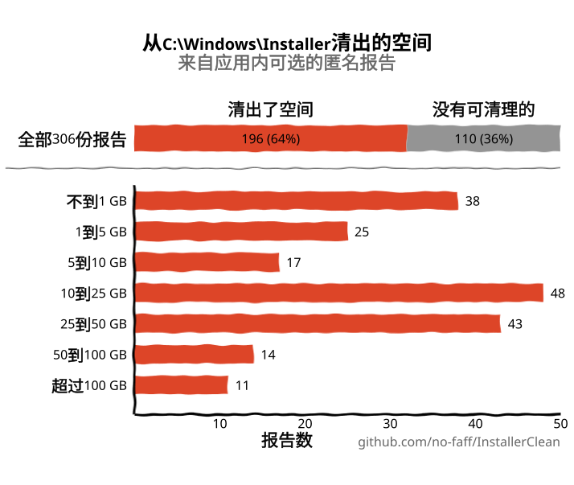
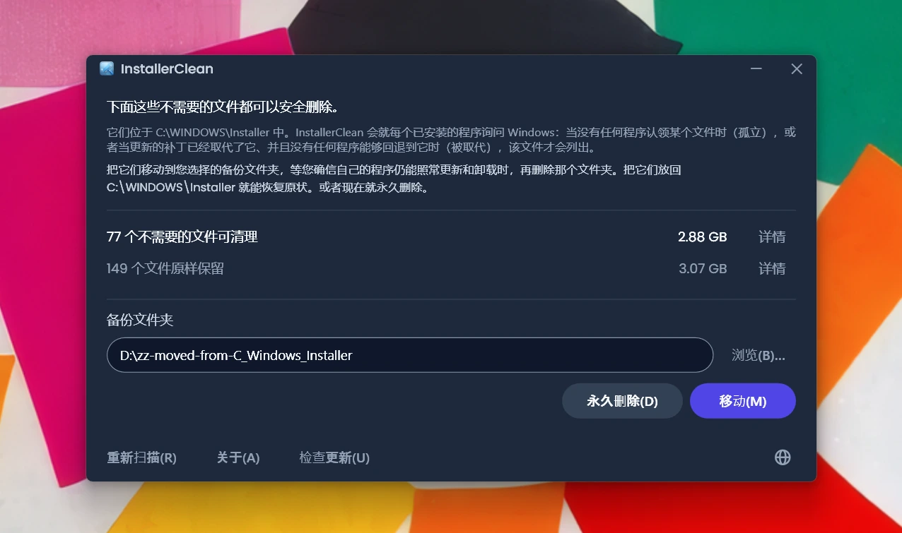
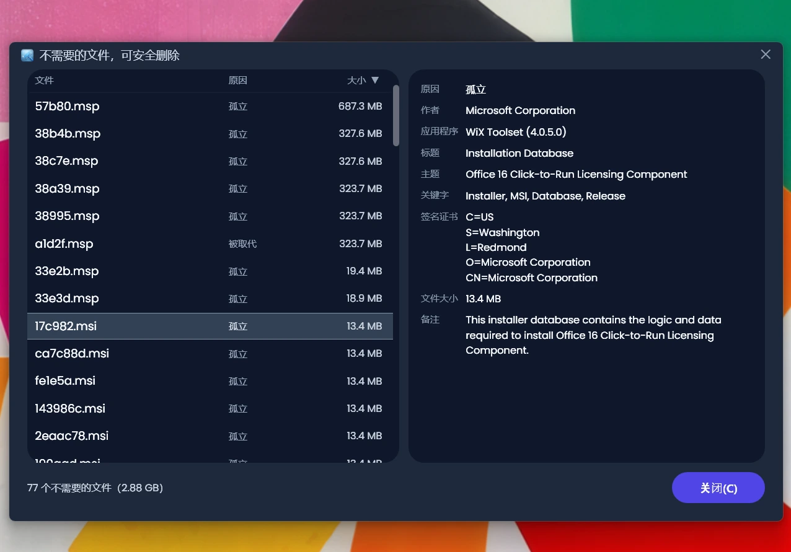
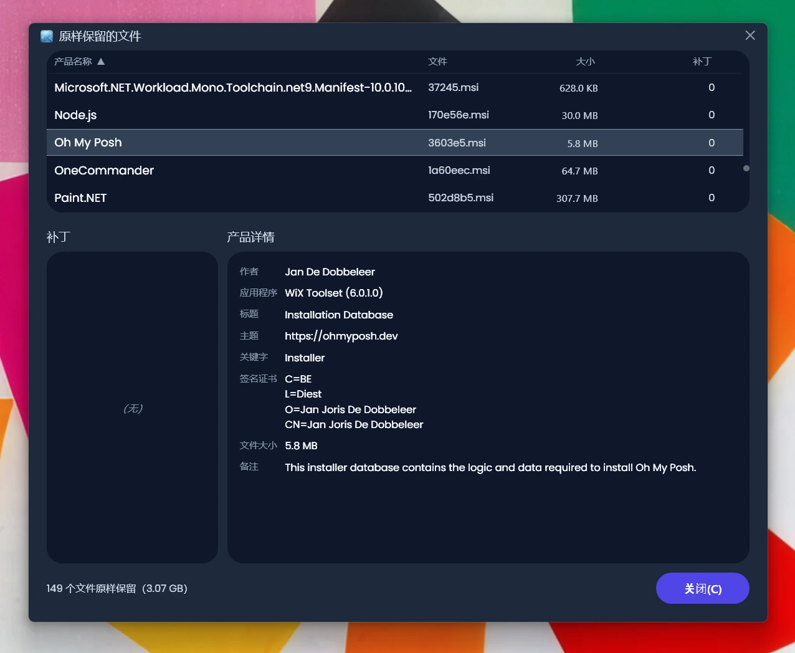
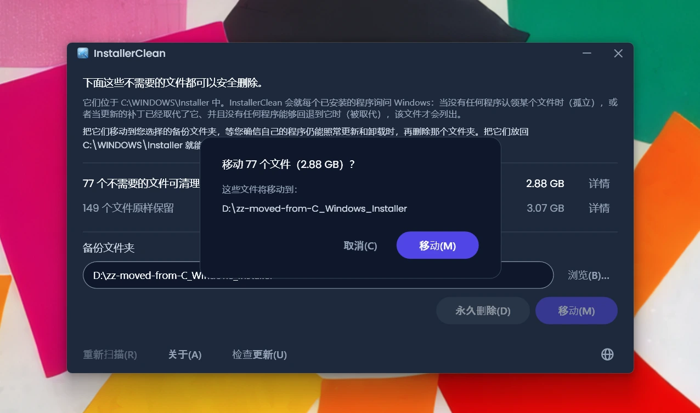
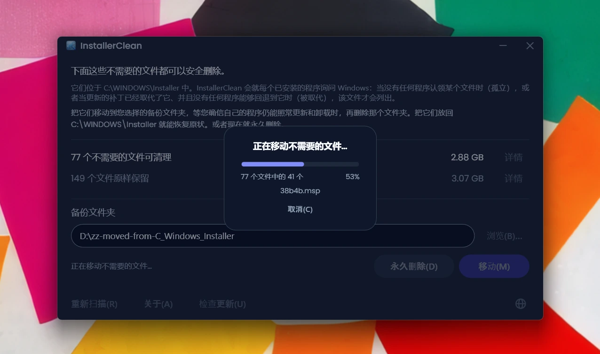
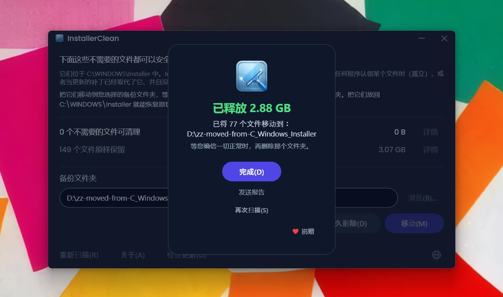

<p align="center">
  <a href="README.md">English</a> · <strong>简体中文</strong> · <a href="README.ru.md">Русский</a> · <a href="README.es.md">Español</a> · <a href="README.ar.md">العربية</a> · <a href="README.ja.md">日本語</a> · <a href="README.pt-BR.md">Português (BR)</a> · <a href="README.pl.md">Polski</a> · <a href="README.tr.md">Türkçe</a> · <a href="README.ko.md">한국어</a> · <a href="README.fr.md">Français</a> · <a href="README.it.md">Italiano</a> · <a href="README.de.md">Deutsch</a> · <a href="README.id.md">Bahasa Indonesia</a> · <a href="README.vi.md">Tiếng Việt</a> · <a href="README.uk.md">Українська</a> · <a href="README.nl.md">Nederlands</a>
</p>

<p align="center">
  
</p>

<p align="center"><em>🎶 What's my line? I'm happy <a href="https://www.youtube.com/watch?v=HM-jHhUZfFI">cleaning Windows</a></em></p>

<h1 align="center">InstallerClean</h1>

<p align="center"><strong>一款开源工具，安全清理 <code>C:\Windows\Installer</code>，这个悄悄蚕食您磁盘空间的隐藏 Windows 文件夹。</strong></p>

<p align="center"><em>难得用上一回。说不定能省点空间。清清爽爽，继续前行。</em></p>

<p align="center">
  <a href="LICENSE"></a>
  <a href="https://dotnet.microsoft.com/download/dotnet/10.0"></a>
  <a href="https://github.com/no-faff/InstallerClean/actions/workflows/ci.yml"></a>
  <a href="https://github.com/no-faff/InstallerClean/releases"></a>
  <a href="https://github.com/no-faff/InstallerClean/releases/latest"></a>
  <a href="https://github.com/no-faff/InstallerClean/releases"></a>
</p>

<a id="reports-stats"></a>

<!-- reports-stats-start chart-only (generated; do not hand-edit between these markers) -->
<p align="center">
  <picture>
    <source media="(prefers-color-scheme: dark)" srcset="docs/reports-zh-CN-dark.svg" />
    <source media="(prefers-color-scheme: light)" srcset="docs/reports-zh-CN-light.svg" />
    
  </picture>
</p>
<!-- reports-stats-end -->

- **简介：** InstallerClean 只做一件事：清除 `C:\Windows\Installer` 里不需要的文件，这个隐藏文件夹会随着您安装和更新软件而越来越满。快速扫描之后，它会告诉您有没有这类文件，想细看的还能查看更多细节，并让您把它们移到别处，或者删掉，给 C: 盘腾出空间。
- **您可能正是为此而来：** 您用 [WinDirStat](https://github.com/windirstat/windirstat)、WizTree 或 TreeSize 时，看到 `C:\Windows\Installer` 占了很大空间，却不知道里面都是些什么。这种情况下，InstallerClean 正是您需要的工具。像 `9f05cba.msi` 这样名字看起来毫无规律的文件，InstallerClean 清楚里面装的是什么，并很快告诉您哪些可以安全清除。
- **能腾出多少空间：** 上面的图表来自 v1.8.0 以来陆续收到的可选报告。（谢谢每一位点过那个按钮的人。没有你们，就没有上面这张图。）在释放了空间的那 <!-- reports-freedpct-start -->65%<!-- reports-freedpct-end --> 当中，释放空间的中位数是 <!-- reports-median-start -->15.5 GB<!-- reports-median-end -->。<!-- reports-biggest-start -->有一台机器足足清出了 462 GB。<!-- reports-biggest-end -->另外 <!-- reports-nothingpct-start -->35%<!-- reports-nothingpct-end --> 什么也没释放出来，所以这要看机器：一台没装额外软件的全新 Windows 11 就没有什么可清理的。不需要的文件最多的，是那些已经跑了很多年的机器、装着大型 MSI 软件的机器（Acrobat、Office、LibreOffice、大型开发工具），以及经常装了又卸的人。一运行您就能看到自己这台到底有多少。
- **是否安全：** 是的。它碰的只有 `C:\Windows\Installer` 里的文件。它会问 Windows Installer 哪些还需要，同时还从注册表里把同一批记录再读一遍。只有当这台机器上没有任何已安装的东西认领某个文件，或者较新的补丁已经取代了它、并且这里没有任何程序还能退回到旧的那个时，InstallerClean 才会把这个文件提供出来。凡是它得不到明确答复的，一律保留。[详见下文](#工作原理)。
- **不涉及您的任何信息：** 开源（Apache 2.0）。没有账号，没有广告，没有跟踪，没有遥测，也没有任何东西在后台运行。它唯一会自己发起的联网操作，就是在您运行时到 GitHub 查一下有没有新版本，而且这也可以关掉。
- **如何获取：** [下载最新版本](../../releases/latest)。运行它；点过 [Windows 显示的任何警告](#unknown-publisher)和[管理员提示](#admin)。把它找出来的文件移走或删掉。搞定。

## 目录

- [没有人告诉您的文件夹](#没有人告诉您的文件夹)
- [寻求帮助](#寻求帮助)
- [InstallerClean 做什么](#installerclean-做什么)
- [截图](#截图)
- [工作原理](#工作原理)
- [下载](#下载)
  - [核对下载的文件](#核对下载的文件)
- [常见问题](#常见问题)
- [命令行](#命令行)
- [无障碍](#无障碍)
- [代码签名政策](#代码签名政策)
- [隐私](#隐私)
- [它不做什么](#它不做什么)
- [其他工具](#其他工具)
- [如果 C:\Windows\Installer 里少了文件](#recovery)
- [系统要求](#系统要求)
- [从源码构建](#从源码构建)
- [参与贡献](#参与贡献)
- [支持本项目](#支持本项目)
- [Star 历史](#star-历史)
- [许可证](#许可证)

---

## 没有人告诉您的文件夹

每台 Windows 电脑上都有一个名为 `C:\Windows\Installer` 的隐藏文件夹。每当您安装使用 Windows Installer 机制的软件，或给 Microsoft Office、Adobe Acrobat、Visual Studio 等任何基于 `.msi` 的应用打补丁时，那个安装程序或 `.msp` 补丁文件的副本就会进入这个文件夹，然后一直留在那里。

新补丁取代旧补丁时，两个都还在。很久以前卸载掉的软件，它们的安装程序也还在。磁盘清理碰都不碰这些，存储感知也一样。DISM 针对的完全是另一个文件夹。时间一长，文件夹越来越大：1 GB、5 GB、20 GB、50 GB。在大量使用 MSI 软件的电脑上（Acrobat 是常见的元凶），这个文件夹能[突破 100 GB](https://www.reddit.com/r/sysadmin/comments/1oxcrmh/acrobat_filling_up_the_cwindowsinstaller_folder/)。

这些不是那种会自己重新冒出来的临时文件。它们是实打实的累赘：多年前卸载的软件留下的旧安装程序，以及被替换了好几次的补丁。一旦清掉，就不会再回来。

**如果您想找个简单的办法给 Windows 腾出磁盘空间，这个文件夹是个不错的起点。** InstallerClean 找出不需要的文件，安全地清除它们。

## 寻求帮助

只要您为这个文件夹找过帮助，多半就知道是怎么个套路。有人的 `C:\Windows\Installer` 有 180 GB，问怎么清理，[得到的回答是运行磁盘清理](https://learn.microsoft.com/en-us/answers/questions/4238108/windows-installer-folder-has-occupied-180gb)。一试，清出了 600 MB，但没有一点来自那个文件夹（因为磁盘清理根本不碰 `C:\Windows\Installer`）。然后帖子就没了下文。

> *“我找到的帖子几乎都在翻来覆去地推荐同样那几招，根本解决不了问题，然后就没了动静。”*
>
> [ksparks519, r/Windows10](https://www.reddit.com/r/Windows10/comments/1bt8c5p/anyone_ever_figure_out_giant_installer_folders/)（译自英文原帖）

要么就是干脆叫人别碰它。在一个帖子里，有人的 Installer 文件夹有 60 GB，得到的回复是[“别去动它”](https://www.reddit.com/r/techsupport/comments/1hw4suq/my_windows_installer_folder_is_like_60gb_so_i/)。问的人再追问那到底该怎么做，得到的回答是：*“我刚才不就说了吗。”*

主流的建议把两件不同的事混为一谈。随手乱删文件，会让那些文件所属的程序再也没法更新或卸载。而只清除这台机器上没有任何东西认领的文件，或者 Windows 记录为已被取代的文件，则不会。InstallerClean 做的是后者。

## InstallerClean 做什么

1. **扫描** `C:\Windows\Installer`，找出其中的 `.msi` 和 `.msp` 文件
2. **询问** Windows Installer 哪些还需要，同时还从注册表里把同一批记录再读一遍
3. **留下**两次读取之间无法定论的一切
4. **告诉您能腾出多少**，以及有多少是原样保留的，并提供可选的详情窗口，逐一列出每个文件
5. **清除不需要的文件**：把它们移动到您选择的备份文件夹，或者永久删除

## 截图

<p>
  <br>
  <em>初始扫描，非常快。</em>
  <br><br>
</p>

<p>
  <br>
  <em>结果：有多少可以清除，有多少原样保留。</em>
  <br><br>
</p>

<p>
  <br>
  <em>可以清掉的那些文件的详情：每一个为什么不再需要，以及文件自己是怎么说的。</em>
  <br><br>
</p>

<p>
  <br>
  <em>原样保留的那些文件的详情：Windows 说每一个属于哪个程序，以及文件自己是怎么说的。</em>
  <br><br>
</p>

<p>
  <br>
  <em>两种操作之前都会确认。移动会把文件备份到您选择的文件夹。或者直接永久删除。</em>
  <br><br>
</p>

<p>
  <br>
  <em>移动进行中。移到同一个驱动器上是瞬间完成的。移到另一个驱动器上，GB 越多花的时间越长。</em>
  <br><br>
</p>

<p>
  <br>
  <em>完成。空间回来了。文件先备份着，等您确信一切正常为止。然后把备份文件夹删掉。</em>
  <br><br>
</p>

<p>
  <br>
  <em>再次扫描之后。已经没有什么可清理的了。</em>
  <br><br>
</p>

<a id="is-it-safe"></a>
## 工作原理

Windows Installer 安装一个程序时，会把安装程序的一份副本留在 `C:\Windows\Installer` 里；当一个补丁被注册到某个程序上时，同样会留下那个补丁的副本。日后 Windows Installer 修复、更新或卸载这个软件时，靠的就是这些副本，这也是安装早已结束、它们却还留在那里的原因。两种副本最后都进了这个文件夹：`.msi` 安装程序；以及 `.msp` 补丁，补丁是给您已经装好的程序打更新，而不是把那个程序整个换掉。

InstallerClean 只会出于两个原因之一提供某个文件。

**孤立**的意思是，这台机器上没有任何东西认领这个文件。没有任何已安装的产品、也没有任何已注册的补丁指名这个文件。

**被取代**的意思是，Windows 记录了这个补丁已经被一个较新的补丁取代，却照样把文件留着。只有当一个补丁所注册到的每一个程序都被卸载，或者这个补丁从所有这些程序上都被移除时，那个补丁文件才会被删掉。被较新的补丁取代，这两条都不算，所以文件就留了下来。Adobe Acrobat 在 Windows 上就是这么运作的：它的更新是针对一份基础安装发布的补丁，而不是全新的安装程序，所以一台装了它有些时日的机器上，可能存着好几个。

InstallerClean 判定这两者的方向正好相反，而且只有前一种才需要去看文件夹里到底有些什么。

**列出文件夹。** InstallerClean 列出直接放在 `C:\Windows\Installer` 里的 `.msi` 和 `.msp` 文件。它不会进入子文件夹。

**把记录读两遍。** 它调用 `msi.dll` 里的 Windows Installer API，向 Windows Installer 要每一个已安装的产品、每一个已注册的补丁，以及它们各自指名的缓存文件。然后它换一种方式再读一遍同样的记录，直接从注册表里读，因为前一种问法可能少给了却不吭声：Windows 是一条一条地交出记录，直到它说没有了为止，而在两百条里停在第三条的那一次运行，看上去跟读到末尾的那一次一模一样。注册表项则是一次性交出它那一整份名单，所以一份短了的名单不可能看起来是完整的。凡是注册表指名、而前一种问法漏掉的产品，都会按名字一个一个再交回给 Windows 去问。这第二遍读取只能把文件挪到“仍然需要”的那一边。没有任何路径能让它把哪个文件放进待清除的名单里。

**把记录和它的文件对上。** 一条记录是用路径来指名它的缓存文件的，而同一个文件夹在这些记录里并不总是写成同一个样子。所以 InstallerClean 不去相信这个写法，而是问 Windows 每一条记录里的路径究竟指向哪里，再拿这个结果去跟文件夹里列出的那些文件比对。仍然没被认领的，还要再经过一次完全不经过名字的比对：它打开文件，请 Windows 辨认这个文件是哪一个，这样同一个文件的两个不同名字就会被认出是同一个文件。

**对不上的记录。** 如果 Windows 不肯说某条记录里的路径指向哪里，或者辨认不出路径尽头的那个文件，InstallerClean 就不知道那条记录说的是哪个文件，而它列出的任何一个文件都可能就是那一个。某个程序可能安装了不止一次时也是同理，因为那时它分不清哪个缓存文件属于哪一份。遇到上述任何一种情况，它这一次就不会提供任何靠列出文件夹找到的文件。而一条指向早已不在的文件的记录则是另一回事：已经没有东西留给它去指了，所以那条记录说的不可能是文件夹里还在的任何一个文件。

**从另一头问起。** 孤立是由“没有”判定的，而“没有”也可能意味着应用没能找到那条记录。所以在提供一个 `.msi` 安装程序之前，InstallerClean 会打开这个文件，读出文件自己带着的产品代码，再问 Windows 那个产品是否已安装。如果已安装，这个文件就留下，不管扫描的其余部分找到了什么。这项检查只能把文件从名单上拿掉。它能给出的任何答案，都不会把文件放上去。

**`.msp` 补丁是怎么判定的。** 补丁不会被打开来询问它属于哪个程序。真正起决定作用的是另一件事：一条补丁注册会在两个地方指名它的缓存文件，一个是注册到每个产品上的那些补丁，另一个是记录这台机器上全部补丁注册的那份注册表名单。只有这两处都没有指名那个缓存文件时，一个补丁才会作为孤立文件被提供出来。

**被取代的补丁不一样在哪里。** 上面这些它一样都不走，因为它并不是一个没人认领的文件。Windows 有它的记录，而正是那条记录说它已经被取代了。这里的风险是另一种：一个补丁可以注册到好几个程序上，而其中只有一个已经用不着它了。所以只有在以下几点全部成立时，一个被取代的补丁才会被提供出来：Windows 记录它无法被卸载；它注册到的每一个程序都被问过；这些程序没有一个还应用着它；并且这些程序里没有一个还持有 Windows 说可以被卸载的补丁。最后这一条之所以在，是因为在某个程序上撤销一个补丁，可能会回过头去找那个较旧的文件。上述任何一点得不到答复，文件就留下。

<details>
<summary>这里用到的 Windows Installer 调用</summary>

- `MsiEnumProductsEx` 列出每一个已安装的产品；给它一个产品代码再调用一次，则是问某个特定产品是否已安装
- `MsiEnumPatchesEx` 列出已注册的补丁，既按产品列，也在整台机器的范围内列
- `MsiGetProductInfoEx` 读取一个产品的名称、它指名的缓存文件，以及它是不是同一产品的多份安装之一
- `MsiGetPatchInfoEx` 读取一个补丁的状态、Windows 能否卸载它，以及它指名的缓存文件
- `MsiGetSummaryInformation` 和 `MsiSummaryInfoGetProperty` 从补丁文件里读出它可以应用到哪些程序上
- `MsiOpenDatabase`、`MsiDatabaseOpenView`、`MsiViewExecute`、`MsiViewFetch` 和 `MsiRecordGetString` 从安装程序文件里读出它声明的产品代码

</details>

话虽如此，应用还是鼓励您把文件移动到一个备份文件夹（如果您是想给 C 盘腾空间，就放到另一个驱动器或分区上）。这样在最终删掉这些不需要的文件之前，您有机会自己确认一切确实正常。

## 下载

三种构建，任选其一：

- **Portable**（`InstallerClean-3.0.0-portable.exe`）：单个文件，.NET 10 运行时就在里面。无需安装，没有卸载程序：双击就能运行。把文件留着下次再用，或者用完就删掉。
- **Setup**（`InstallerClean-3.0.0-setup.exe`）：标准的 Windows 安装程序，内置 .NET 10 运行时。会添加一个开始菜单条目，卸载也干净。安安稳稳待在“程序”里，半年之后也好找；要是您装了又卸的软件很多，用得比这更勤也方便。
- **CLI**（`installerclean-cli.exe`）：单独的命令行版本，一个文件，运行时就在里面。无需安装，没有卸载程序。把它丢到一台客户端上，跑一次扫描或清理，再删掉。它是为脚本、计划任务和批量部署而做的，适合只想执行操作、又不想在客户端装桌面应用的场合。参数和退出代码见[命令行](#命令行)。

从 2.2.0 起，安装版和便携版的文件名都带上了版本号，下载下来的副本永远说得清自己是什么；命令行版则保留朴素的 `installerclean-cli.exe` 文件名，这样指向它的计划任务和脚本在更新之后依然能用。

从[发布页面](../../releases/latest)下载，然后运行。它没有签名，所以 Windows 会显示一条“未知发布者”的警告；[常见问题](#unknown-publisher)解释了您会看到什么，以及为什么这么做是安全的。

应用启动时会自动扫描。查看结果，然后点击**移动**或**永久删除**。

或者通过 [winget](https://learn.microsoft.com/windows/package-manager/winget/) 安装：

```
winget install NoFaff.InstallerClean
```

或者通过 [Scoop](https://scoop.sh) 安装：

```
scoop install installerclean
```

### 核对下载的文件

InstallerClean 没有签名。在运行它之前，您可以核对这些：

- 每个下载文件的 SHA-256 都在它的发布页面上，既写在发布说明里，也作为一个单独的 `.sha256` 文件放在下载文件旁边。
- VirusTotal：每个构建在发出去之前都会扫描，发布页面上带有每个下载文件逐引擎的完整结果。
- 源代码就在 [github.com/no-faff/InstallerClean](https://github.com/no-faff/InstallerClean)。扫描、查询、移动、删除、设置和待重启这几项服务都有一套自动化测试覆盖，每次推送到 `main` 以及每个 pull request 都会在 Windows 上运行，本页顶部的 CI 徽章报告运行结果。
- 发布版本的构建是确定性的：相同的源代码、相同的 SDK 和相同的发布参数会产出相同的字节，而且除非每一项构建输入都与该标签处的源代码一致，否则一个版本无法被打上标签。所以您可以检出标签、自己构建一遍，再把算出的哈希值和公布的哈希值对比。每个版本的发布说明里都有您需要的东西：构建时用的 SDK 版本，以及任何不是用默认参数构建的下载文件所用的发布参数。setup 是例外：它由 Inno Setup 而不是 SDK 编译，并且会把构建的年份打进文件本身，所以要复现它的哈希值，还需要同一个 Inno 版本和同一个年份。
- 在 GitHub、MajorGeeks 和 Softpedia 上累计 <!-- downloads-start -->74,000+<!-- downloads-end --> 次下载。
- [MajorGeeks](https://www.majorgeeks.com/files/details/installerclean.html) 会在虚拟机中测试每一个提交上来的版本，只有通过他们的审核才会收录。<br><a href="https://www.majorgeeks.com/files/details/installerclean.html"></a>
- [Softpedia](https://www.softpedia.com/get/System/Hard-Disk-Utils/InstallerClean.shtml) 审核过它，并认证它不含间谍软件、广告软件和病毒。<br><a href="https://www.softpedia.com/get/System/Hard-Disk-Utils/InstallerClean.shtml"></a>

## 常见问题

<a id="admin"></a>

**为什么它需要管理员权限？** 两个原因。`C:\Windows\Installer` 被锁定为仅限管理员访问，所以读取它、查询 Windows Installer、移动或删除文件，都需要管理员权限。另外，管理员可以就这台机器上任何账户下安装的程序去问 Windows，非管理员则不行：不带管理员权限运行，在那项判定文件是否仍然需要的检查里，Windows 会把一个其实装着的程序说成没有安装。

<a id="unknown-publisher"></a>

**为什么 Windows 说“未知发布者”？** InstallerClean 没有代码签名，而且 Windows 会给从网上下载的文件加上标记，所以首次运行时 SmartScreen 通常会显示“Windows 已保护你的电脑”，发布者一栏写着未知。付费的签名证书每年都要花钱，我宁愿让应用保持免费，也不想为这样一张证书掏钱，所以我向免费为开源软件签名的 SignPath Foundation 提出了申请，InstallerClean 已经获准（见[代码签名政策](#代码签名政策)）。证书还没有签发，所以目前请点击**更多信息**，再点**仍要运行**。这么做是安全的：源代码是公开的，每个版本都有 VirusTotal 链接和 SHA-256 哈希值供您事先核对。

**支持 Windows 7 或 8 吗？** 不支持。它需要 Windows 10 版本 1607 或更高，这是 .NET 10 运行时支持的最低版本。setup 在更旧的系统上会拒绝安装，portable 版也启动不了。

## 命令行

`installerclean-cli.exe` 是一个独立的控制台程序，与图形界面装在一起。一样的扫描、一样的移动、一样的删除，只是没有窗口。它会占住命令提示符直到结束，因此脚本或计划任务可以等待它完成。

### 选项

| 选项 | 作用 | 也接受 |
|---|---|---|
| `/s` | 仅扫描。列出它会清除哪些文件，给出每个文件的名称、大小和原因。不改动任何东西。 | |
| `/d` | 先扫描，然后把不需要的文件永久删除。 | |
| `/m` | 先扫描，然后把它们移动到在图形界面里保存的那个文件夹。 | |
| `/m 路径` | 先扫描，然后把它们移动到 `路径`。路径里有空格就加上引号。 | |
| `--help` | 打印用法说明并以 `0` 退出。 | `/?`、`-h` |
| `--version` | 打印版本号并以 `0` 退出。 | `-v` |

选项不区分大小写，所以 `/S` 和 `/D` 与 `/s` 和 `/d` 一样可用。每次运行只能用一个选项：它们不能组合，而且 `/s` 和 `/d` 后面不接任何东西。

不带参数运行，它会打印用法说明并以 `1` 退出，这样一来，丢了选项的计划任务会明明白白地失败，而不是悄无声息地什么都不做。遇到不认识的选项，它会先打印一行错误，再打印用法说明，同样以 `1` 退出。含有空格却没加引号的移动路径也会被同样地拒绝，而不是被悄悄截断，并且消息会告诉您给它加上引号。

### 退出代码

以下是工具自己在 `--help` 里写明的代码：

| 代码 | 含义 |
|---|---|
| `0` | 成功。本次运行做了要求的事，并且没有任何失败。 |
| `1` | 没有处理任何内容。本次运行失败，或者被拒绝。 |
| `2` | 部分。有的处理了，有的没有，包括中途按下 Ctrl+C。 |
| `75` | 暂时性。有临时状况挡住了这次运行；打印出来的消息会说明是哪一种。 |
| `130` | 在处理任何内容之前按 Ctrl+C 取消。 |

`1` 既包括失败，也包括被拒绝，而被拒绝并不等于出了毛病：目标位置只是满了，或者应用在动手之前读不到某个注册表值，都落在这里。`0` 的意思是没有任何失败，而不是没有东西剩下：`--help`、`--version` 和仅扫描的运行都以 `0` 退出，不管这次扫描找到了六十八个文件还是一个也没有。

### 事件日志

每次运行都会向应用程序日志写入一条结果记录，可能还会在旁边加上一条或多条通知。事件 ID 是一份稳定的、给机器用的约定，所以 RMM 可以只按号码过滤，不必解析任何文本：

| ID | 含义 |
|---|---|
| `1000` | 成功 |
| `1002` | 部分 |
| `2000` | 已跳过，暂时性 |
| `4000` | 严重失败 |
| `3000` | 通知：扫描未能覆盖每一个已安装的产品 |
| `3001` | 通知：Windows 认为应当在的文件不在这个文件夹里 |
| `3002` | 通知：有文件被保留了下来，没有提供出来 |

`3000` 这一段是通知，而不是结果，因此不计入一次运行的结果。运行中没有出岔子时，记录类型是“信息”，出了岔子则是“警告”。**事件日志始终是英文的**，无论机器的显示语言是什么，这样按已知短语搜索才有一个稳定的目标。翻译过的是控制台：它跟随机器自身的语言，大小和日期也按机器所在区域的写法。

### 用法示例

把审查结果写进文件，不改动任何东西：

```
installerclean-cli /s > audit.txt
```

每月把文件移动到 `D:\InstallerBackup`，CLI 放在 `C:\Tools`：

```
schtasks /create /tn "InstallerClean monthly" /tr "C:\Tools\installerclean-cli.exe /m D:\InstallerBackup" /sc monthly /ru SYSTEM /rl highest
```

任务会一直等到这次运行结束，并把退出代码记录为它的“上次运行结果”，所以 RMM 可以依据上面那些代码来判断。

在 PowerShell 里：

```powershell
& 'C:\Tools\installerclean-cli.exe' /m D:\InstallerBackup
switch ($LASTEXITCODE) {
    0       { '干净' }
    2       { '部分完成，请查看输出' }
    75      { '被挡住了，请稍后重试' }
    default { "失败（$LASTEXITCODE）" }
}
```

### 写进脚本之前

- **它需要提权。** 全部都需要，`/s` 也一样。从没有提权的命令提示符运行，Windows 会拒绝启动它，并把 `740` 交给您的 shell。
- **图形界面里记下的那个文件夹是按用户保存的。** 以 SYSTEM 或服务账户身份运行的任务看不到它，所以这类运行必须传 `/m 路径`。
- **SYSTEM 是以计算机账户的身份访问网络的**，所以 `\\服务器\共享` 这样的目标位置，需要把权限给到那个账户。
- **`/s` 从不阻塞。** 它是只读的，不取任何锁，所以桌面应用开着的时候也能扫描。`/d` 和 `/m` 会取一把机器范围的锁，如果另一次 InstallerClean 运行正持有它，就以 `75` 退出。
- **所有输出都走 stdout**，错误也在内；没有 stderr。请依据退出代码来判断，而不是去解析文本。
- **移动会拒绝，而不是改名。** 如果目标位置已经有同名的文件，那个文件就留在缓存里，并在输出里点出名字，这一批里其余的照样移动。如果每个文件都撞了名，这次运行就什么也没处理，以 `1` 退出。
- **没有任何东西会清空备份文件夹。** `/m` 只会往里加。那个文件夹得由您自己去清。
- **`taskkill /pid` 不是优雅的取消。** 单实例锁会由下一次运行收回。
- **第一次运行会注册一个事件日志源**，位置在 `HKLM\SYSTEM\CurrentControlSet\Services\EventLog\Application\InstallerClean`。请把它留在那里：事件查看器是通过来源来读取一条记录的描述的，删掉它会让这个工具已经写下的每一条记录都变成来源未知的错误。

### 为什么是 `installerclean-cli` 而不是 `installerclean.exe`

`InstallerClean.exe` 是那个窗口，它不理会命令行参数。`installerclean-cli.exe` 是一个真正的控制台进程，所以它会占住命令提示符直到结束，重定向和管道也和别的程序一样。setup 会把两个都装上。portable 下载只有图形界面；如果您想要不带窗口的命令行，请从[发布页面](../../releases/latest)单独下载 `installerclean-cli.exe`。

## 无障碍

InstallerClean 在设计上力求完全能用键盘和屏幕阅读器操作。

- **全程可用键盘操作。** 应用做的每一件事都能从键盘到达，详情窗口里的各列也能用键盘排序，所以这里没有任何地方非用鼠标不可。标题栏按钮的行为和 Windows 自己的一样，用 Alt+Space 或 Alt+F4 就能到达。键盘焦点无论落在哪里都保持可见。
- **讲述人与语音访问。** 每个控件都有标签，按钮上看得见的那个词，就是用语音激活它时要说的词。移动或删除完成后，结果会朗读出来。
- **为阅读而打造。** 在整个深色主题中，文字都达到 WCAG AA 对比度标准。

如果这里有任何地方妨碍到您，请[提交 issue](../../issues)。无障碍问题属于 bug，而不是边缘情况。

## 代码签名政策

InstallerClean 已获 [SignPath Foundation](https://signpath.org) 接受，可以免费获得代码签名。这是一项为开源软件签名的计划，签过之后，软件到您机器上时就不再是来路不明的发布者了。证书本身还没有签发，所以这里的下载目前都没有签名，Windows 会对它们发出警告。

证书签发之后，每个发布版本都会带上 SignPath 要求的那行字：free code signing provided by SignPath.io, certificate by SignPath Foundation。证书属于基金会而不是我，因为证书必须签发给一个法律实体，而一个人的项目算不上。这并不表示 InstallerClean 是他们的，也不表示除了签名之外他们还参与了什么。

**角色。** InstallerClean 只有一位维护者。提交者与审核者，也就是谁能把代码放进项目：我。批准者，也就是谁能授权给一个发布版本签名：我。

## 隐私

可选的报告是唯一会把一次运行的情况发出去的东西，而且只有您按下那个按钮时它才会发出去。它写的是：扫描找到了什么、保留了什么以及为什么保留、您是移动还是删除、这次腾出了多少、用了多久、有什么失败了，再加上应用的版本、您阅读它所用的语言，以及您的 Windows 版本。没有文件名，没有文件夹名，没有账户名，没有任何能识别您机器的东西，也没有任何能把两份报告联系到一起的东西。我就是靠它来了解应用在我自己之外的机器上是否正常工作，以及它保留下了哪些东西。

没有广告，没有遥测。除此之外的联网只有两处：应用启动时的版本检查（向 GitHub 发一个请求，可以在“关于”窗口里关掉），以及指向 GitHub 和捐赠页面的按钮，捐赠全凭您的心意。完整的[隐私政策](PRIVACY.md)（英文）。

## 它不做什么

- WinSxS（`C:\Windows\WinSxS`）是另一个文件夹，规则也不同。要清理那个，请在已提权的命令提示符里运行 `Dism /Online /Cleanup-Image /StartComponentCleanup`。
- 没有后台服务，没有计划任务，没有自动清理。应用只在您启动它时运行。
- 它不会改动您已安装的程序或 Windows Installer 数据库，只是读取它们。它写入注册表的唯一内容，是命令行工具需要的一次性事件源注册，好让它的运行记录能出现在 Windows 事件日志里。
- 它自己主动发起的联网只有一种：运行时快速查一下 GitHub 的发布页面有没有新版本，您可以在“关于”里把它关掉。其余的都只在您主动要求时才发生：可选的匿名报告（关于这次运行的一些数字，不含任何指向您或您文件的内容），以及指向 GitHub 文档和捐赠页面的链接，您点了才会在浏览器里打开。它从不自行下载任何东西。
- 没有工具栏，没有捆绑软件，没有广告软件。

## 其他工具

如果您以前搜过这个文件夹，最可能找到的工具就是 [PatchCleaner](https://www.homedev.com.au/free/patchcleaner)。是它先做了这件事，在 InstallerClean 出现之前它已经做了十年，如今依然好用，而且没有它就不会有 InstallerClean。

我做 InstallerClean，是因为 PatchCleaner 不开源、自 2016 年 3 月起就没再更新，而且默认排除 Adobe 的文件。那条排除规则的存在有充分的理由，HomeDev 当时在发布说明里也把话说得很清楚：

> *“早先的版本有一个已知问题：PatchCleaner 会把 Adobe Acrobat Reader 的补丁误判为不再需要。Adobe 在自动更新上有一套自己的专有做法，如果 PatchCleaner 把安装程序目录里那些‘孤立’的补丁删掉，Adobe Reader 的自动更新就再也装不上了。”*
>
> [PatchCleaner 发布说明，版本 1.4.0.0](https://www.homedev.com.au/free/patchcleaner)（译自英文原文）

随之加进去的那个过滤器，会在文件的元数据和签名里找“Acrobat”这个词。在 Acrobat 是最大占用源的机器上，那可能就是大部分空间：

> *“我下载了 PatchCleaner 来删除那些孤立的 .msp 文件，但据说这样只能释放 250 MB 的空间。有 29 GB 的文件被‘过滤器排除’了，所以 PatchCleaner 似乎帮不上忙。”*
>
> HeatherBunny1111, [r/techsupport](https://www.reddit.com/r/techsupport/comments/1qc4tcf/how_to_delete_msp_files_safely/)（译自英文原帖）

这里两个工具的差别，在于各自向 Windows 问了什么，而不是对 Adobe 有什么不同看法。Windows 为某个产品列出的*已应用*补丁名单，并不包含那些已被较新补丁取代的补丁，所以读这份名单的工具，遇到一个被取代的补丁的文件时，看到的就是一个没人认领的文件，和其他文件没有两样。是那个排除过滤器按名字把 Adobe 的那些挑了出来。InstallerClean 改为向 Windows 询问补丁的状态，所以一个被取代的补丁到 InstallerClean 手上时就已经标明是被取代的，而怎么处理它，取决于 Windows 对它的记录，而不是取决于它的名字怎么写。两者对比如下：

| | **InstallerClean** | **PatchCleaner** |
|---|---|---|
| 最近更新 | 2026（活跃维护中） | 2016 年 3 月 3 日 |
| 源代码 | 开源（Apache 2.0） | 闭源 |
| 运行时 | .NET 10（自包含） | .NET Framework 4.5.2 + VBScript |
| API | `msi.dll` 里的 Windows Installer API（进程内） | Windows Installer COM（进程外，经 VBScript） |
| 被取代的补丁 | 从 Windows 的补丁记录中识别出来 | 与没人认领的文件不加区分 |
| Adobe 文件 | 被取代的补丁会被检测出来并标注 | 按名字过滤排除，默认开启 |

> **关于 `Win32_Product` 的说明：** 列出已安装产品有一种常见却有缺陷的做法，就是用 `Win32_Product`（WMI），它会在枚举过程中[对每一个产品触发 MSI 修复操作](https://gregramsey.net/2012/02/20/win32_product-is-evil/)。InstallerClean 和 PatchCleaner 都避开了它。InstallerClean 调用 `msi.dll` 里的 Windows Installer API；PatchCleaner 则运行一个使用 Windows Installer COM 对象的辅助脚本。那个脚本叫 `WMIProducts.vbs`，这名字让它看起来像是另一回事，但这个文件其实是 Microsoft 自己的示例脚本改了一处，它问的是 Windows Installer 而不是 WMI。关于它，唯一有误导性的就是这个名字。

磁盘清理、存储感知、CCleaner 和 BleachBit 都不清理 `C:\Windows\Installer`。

<a id="recovery"></a>
## 如果 `C:\Windows\Installer` 里少了文件

如果那个文件夹里真的少了一个文件，那个文件所属的程序照样能正常运行。但当您试着更新或卸载那个程序时，多半会失败。Windows 去找这个文件，找不到，这一步就停住了。

InstallerClean 的全部用意，就是只提供*不*需要的文件供您移动或删除；不过它确实看得出有文件缺失，所以凡是它发现的，都会用一个警告三角标出来，并附上一个指向这里的链接。想修复那个程序，可以这样做：

- 查出您已安装的那个程序的版本号（设置 > 应用 > 已安装的应用）
- 从程序的制作方下载**那个版本**的安装程序。较新的版本不行，先卸载也不行：这两种做法都得先移除已经装好的那一份才能往下走，而移除正是需要那个缺失文件的步骤。
- 运行那个安装程序
- 这应当会把文件恢复回来，并且不动您的设置。在 InstallerClean 里重新扫描一次，如果成功了，那条警告就会消失。

不过 Microsoft 并不保证这样就行。下面是它自己更完整的说法：

<details>
<summary>Microsoft 更完整的说法</summary>

*以下 Microsoft 引文均为英文原文。*

完整指引：[Restore missing Windows Installer cache files](https://learn.microsoft.com/en-us/troubleshoot/windows-client/application-management/missing-windows-installer-cache)，KB 2667628。

*可能不会立刻显现：*
> "If the installer cache is compromised, you may not immediately see problems until you take an action such as uninstalling, repairing, or updating a product."

*这些文件每台机器各不相同，所以没法从别的电脑拷一个过来：*
> "Missing files cannot be copied between computers because the files are unique."

*如果您有一份在文件丢失之前做好的备份，Microsoft 按下面的顺序列出了四条路：*
> - System Restore points (available only on client operating systems)
> - Restoreable system state backup
> - Failure recovery methods that can restore the full system state backup
> - Reinstallation of the operating system and all applications

*这四条都卡在同一件事上。它们说的是系统备份，而不是您自己把文件移过去的那个文件夹：那里的文件可以直接复制回去，复制进该文件夹时确认一下 Windows 弹出的管理员提示就行。*
> "To restore the missing files, a full system state restoration is required. It is not possible to replace only the missing files from a previous backup."

*推荐的恢复办法，以及它直白的局限：*
> "If application files are missing from the Windows Installer Cache, ask the vendor or support team for the application about the missing files. You must follow the procedures or steps recommended by the application vendor to restore the files. In some cases, you may have to rebuild the operating system and reinstall the application to fix the problem."
>
> "Windows support engineers cannot help you recover missing application files from the Windows Installer cache."

</details>

如果哪天某个文件的缺失是 InstallerClean 造成的，我想知道。请[提交 issue](../../issues)，我会把它修好。

## 系统要求

- Windows 10（版本 1607 / 内部版本 14393 或更高，这是 .NET 10 运行时支持的最低版本）或 Windows 11
- 64 位 Windows。setup 不会装到 32 位系统上，并且会明确告诉您。
- 管理员权限，setup 和应用都需要（`C:\Windows\Installer` 仅限管理员访问）

setup、portable 和 CLI 各种构建的选项见[下载](#下载)。

## 从源码构建

```
git clone https://github.com/no-faff/InstallerClean.git
cd InstallerClean
dotnet build src/InstallerClean.sln
```

运行测试：

```
dotnet test src/InstallerClean.Tests/
```

## 参与贡献

发现了 bug，或有什么建议？[提交 issue](../../issues) 或发起[讨论](../../discussions)。欢迎 pull request。提交前请先运行 `dotnet test`。

InstallerClean 提供 16 种语言，每一种都覆盖它的全部：应用、安装程序、命令行，以及这份 README。在应用、安装程序和命令行里，日文和荷兰文由 coolvitto 和 RijckAlex 完整贡献，意大利文是我的机器翻译经 bovirus 校正并认可的，三位都是母语者；其余都是我自己的机器翻译。每一份 README，在每一种语言里都出自我自己之手。我在这上面下了不少功夫，但它们不会完美，而我决定就这样发布，而不是压着不放、等到每一种语言都有母语者校对为止。如果您懂英文和其中一种语言，发现任何可以改进的地方，我会很乐意听到，可以通过 [issue](../../issues/new?template=translation_review.md)、pull request 或[讨论](../../discussions)告诉我。

## 支持本项目

如果 InstallerClean 给您腾出了一些空间，而您又乐意的话，我会非常感谢您的[一点捐赠](https://nofaff.netlify.app/support)。应用里有一个 ❤️ 按钮，指向同一个地方。多少都会心怀感激地收下。非常感谢到目前为止捐过的每一位。这是一份很大的工作量，我很高兴它是值得的。

## Star 历史

<picture>
  <source media="(prefers-color-scheme: dark)" srcset="docs/star-history-dark.svg" />
  <source media="(prefers-color-scheme: light)" srcset="docs/star-history-light.svg" />
  
</picture>

## 许可证

[Apache 2.0](LICENSE)

---

🎶 [George Formby - When I'm Cleaning Windows](https://www.youtube.com/watch?v=P183Uo5Ust4). 点开看看吧！
